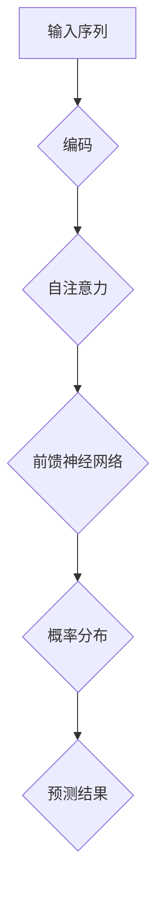

                 

关键词：AI，神经网络，GPT，自然语言处理，next token prediction

摘要：本文将深入探讨GPT（Generative Pre-trained Transformer）模型的核心机制——next token prediction。我们将从背景介绍开始，逐步讲解GPT的核心概念、算法原理、数学模型、项目实践和未来应用，旨在为读者提供一个全面的技术指南，帮助理解GPT的工作原理和其在实际应用中的重要性。

## 1. 背景介绍

随着人工智能技术的迅猛发展，自然语言处理（NLP）领域取得了显著的成果。GPT（Generative Pre-trained Transformer）是由OpenAI提出的一种基于Transformer架构的预训练语言模型，它在许多NLP任务中表现出了强大的能力。GPT的核心机制是next token prediction，即预测下一个单词或字符。这一机制使得GPT能够生成连贯且具有上下文意义的文本。

GPT的成功不仅在于其强大的模型架构，还在于其预训练和微调策略。通过在大量文本上进行预训练，GPT学会了理解语言的统计规律和语义信息，从而能够生成高质量的自然语言文本。这一机制在许多实际应用中都具有重要的意义，如机器翻译、文本生成、问答系统等。

本文将重点探讨GPT的next token prediction机制，从算法原理、数学模型、项目实践等方面进行深入分析，帮助读者更好地理解这一核心机制。

## 2. 核心概念与联系

### 2.1 GPT模型架构

GPT模型基于Transformer架构，这是一种自注意力机制（self-attention）的神经网络模型。Transformer模型的核心思想是将输入序列映射为输出序列，并通过自注意力机制学习输入序列中的长距离依赖关系。GPT模型在Transformer架构的基础上，通过预训练和微调，实现了对自然语言文本的高效建模。

### 2.2 next token prediction

next token prediction是GPT模型的核心机制，其目标是在给定前文序列的基础上，预测下一个单词或字符。具体来说，GPT模型将输入序列编码为固定长度的向量，然后通过自注意力机制和前馈神经网络，生成一个概率分布，表示下一个单词或字符的可能性。根据这个概率分布，模型选择最有可能的单词或字符作为预测结果。

### 2.3 Mermaid流程图

为了更好地理解GPT模型的next token prediction机制，我们可以使用Mermaid流程图来展示其核心步骤。以下是GPT模型next token prediction的Mermaid流程图：



在这个流程图中，A表示输入序列，经过编码后进入自注意力层C，然后通过前馈神经网络D生成概率分布E，最终根据概率分布选择预测结果F。

## 3. 核心算法原理 & 具体操作步骤

### 3.1 算法原理概述

GPT模型的next token prediction机制基于自注意力机制（self-attention）和前馈神经网络（feedforward network）。自注意力机制能够捕捉输入序列中的长距离依赖关系，而前馈神经网络则用于对输入序列进行建模和预测。

具体来说，GPT模型首先将输入序列编码为固定长度的向量，然后通过自注意力机制计算每个单词或字符的权重，这些权重用于计算整个序列的表示。接着，这个表示通过前馈神经网络进行进一步处理，生成一个概率分布，表示下一个单词或字符的可能性。

### 3.2 算法步骤详解

#### 3.2.1 编码

编码是将输入序列（单词或字符）转换为固定长度的向量表示。GPT模型使用词嵌入（word embedding）技术进行编码，将每个单词或字符映射为一个高维向量。词嵌入可以通过预训练的词向量库获得，也可以通过模型在训练过程中学习。

#### 3.2.2 自注意力

自注意力机制是Transformer模型的核心组件，它能够计算输入序列中每个单词或字符的重要程度。具体来说，自注意力机制通过计算每个单词或字符与输入序列中其他单词或字符的相似性，生成一个权重矩阵。这个权重矩阵用于更新每个单词或字符的表示，从而实现长距离依赖关系的捕捉。

#### 3.2.3 前馈神经网络

前馈神经网络是自注意力机制的后续处理步骤，它通过对自注意力层输出的表示进行进一步处理，生成一个概率分布。前馈神经网络通常由多个全连接层组成，每个全连接层都通过激活函数进行非线性变换。

#### 3.2.4 概率分布

前馈神经网络输出的概率分布表示了下一个单词或字符的可能性。根据这个概率分布，模型可以计算出下一个单词或字符的最有可能的候选者，并将其作为预测结果。

### 3.3 算法优缺点

#### 3.3.1 优点

1. **强大的文本建模能力**：GPT模型通过自注意力机制和前馈神经网络，能够捕捉输入序列中的长距离依赖关系，从而实现对文本的深入建模。
2. **高效的预训练策略**：GPT模型采用预训练和微调策略，在大量文本上进行预训练，从而提高了模型的性能和泛化能力。
3. **广泛的应用场景**：GPT模型在许多NLP任务中表现出色，如机器翻译、文本生成、问答系统等。

#### 3.3.2 缺点

1. **计算资源需求大**：GPT模型需要大量的计算资源和存储空间，特别是在训练过程中，其计算复杂度和存储需求较高。
2. **数据依赖性较强**：GPT模型的性能高度依赖于训练数据的质量和数量，如果训练数据不足或质量较低，模型的效果可能会受到影响。

### 3.4 算法应用领域

GPT模型在许多NLP任务中都有广泛应用，以下是一些主要的应用领域：

1. **机器翻译**：GPT模型在机器翻译任务中表现出色，能够生成高质量的双语翻译文本。
2. **文本生成**：GPT模型可以用于生成各种类型的文本，如文章、小说、新闻报道等。
3. **问答系统**：GPT模型可以用于构建问答系统，通过理解用户的问题和上下文，提供准确的回答。
4. **文本分类**：GPT模型可以用于对文本进行分类，如情感分析、主题分类等。

## 4. 数学模型和公式 & 详细讲解 & 举例说明

### 4.1 数学模型构建

GPT模型的数学模型主要由词嵌入、自注意力机制和前馈神经网络组成。以下是这些组件的数学表示：

#### 4.1.1 词嵌入

词嵌入是将单词或字符映射为一个高维向量。假设我们有一个词汇表V，包含N个单词或字符，则词嵌入矩阵$W_e$是一个N×D的矩阵，其中D是词向量的维度。给定一个单词或字符$x \in V$，其词嵌入向量表示为$e_x = W_e[x]$。

#### 4.1.2 自注意力

自注意力机制是一种计算输入序列中每个单词或字符的重要程度的机制。假设输入序列$X = \{x_1, x_2, ..., x_T\}$，其中$x_t \in V$，则自注意力机制可以用以下公式表示：

$$
\text{Attention}(Q, K, V) = \text{softmax}\left(\frac{QK^T}{\sqrt{d_k}}\right)V
$$

其中，Q、K和V分别是查询（query）、键（key）和值（value）向量。在GPT模型中，这三个向量都是输入序列的词嵌入向量。自注意力机制计算输入序列中每个单词或字符的权重，从而生成一个加权表示。

#### 4.1.3 前馈神经网络

前馈神经网络是自注意力机制的后续处理步骤，用于对自注意力层输出的表示进行进一步处理。前馈神经网络通常由两个全连接层组成，一个用于线性变换，另一个用于非线性变换。假设输入序列的表示为$H$，则前馈神经网络可以用以下公式表示：

$$
H' = \text{ReLU}(W_h H + b_h) \\
H = \text{ReLU}(W_o H' + b_o)
$$

其中，$W_h$和$W_o$分别是全连接层的权重矩阵，$b_h$和$b_o$分别是偏置向量。

### 4.2 公式推导过程

在本节中，我们将简要介绍GPT模型的一些核心公式的推导过程。

#### 4.2.1 词嵌入

词嵌入是将单词或字符映射为一个高维向量。假设我们有一个词汇表V，包含N个单词或字符，则词嵌入矩阵$W_e$是一个N×D的矩阵，其中D是词向量的维度。给定一个单词或字符$x \in V$，其词嵌入向量表示为$e_x = W_e[x]$。

#### 4.2.2 自注意力

自注意力机制是一种计算输入序列中每个单词或字符的重要程度的机制。假设输入序列$X = \{x_1, x_2, ..., x_T\}$，其中$x_t \in V$，则自注意力机制可以用以下公式表示：

$$
\text{Attention}(Q, K, V) = \text{softmax}\left(\frac{QK^T}{\sqrt{d_k}}\right)V
$$

其中，Q、K和V分别是查询（query）、键（key）和值（value）向量。在GPT模型中，这三个向量都是输入序列的词嵌入向量。自注意力机制计算输入序列中每个单词或字符的权重，从而生成一个加权表示。

#### 4.2.3 前馈神经网络

前馈神经网络是自注意力机制的后续处理步骤，用于对自注意力层输出的表示进行进一步处理。前馈神经网络通常由两个全连接层组成，一个用于线性变换，另一个用于非线性变换。假设输入序列的表示为$H$，则前馈神经网络可以用以下公式表示：

$$
H' = \text{ReLU}(W_h H + b_h) \\
H = \text{ReLU}(W_o H' + b_o)
$$

其中，$W_h$和$W_o$分别是全连接层的权重矩阵，$b_h$和$b_o$分别是偏置向量。

### 4.3 案例分析与讲解

为了更好地理解GPT模型的next token prediction机制，我们可以通过一个具体的案例进行分析。

#### 4.3.1 数据集

我们使用一个简单的数据集，包含以下句子：

```
我爱北京天安门
天安门上太阳升
```

#### 4.3.2 编码

首先，我们将这些句子编码为词嵌入向量。假设我们的词汇表包含以下单词：

```
我，爱，北京，天安门，上，太阳，升
```

对应的词嵌入向量如下：

```
我：[1, 0, 0, 0, 0, 0, 0]
爱：[0, 1, 0, 0, 0, 0, 0]
北京：[0, 0, 1, 0, 0, 0, 0]
天安门：[0, 0, 0, 1, 0, 0, 0]
上：[0, 0, 0, 0, 1, 0, 0]
太阳：[0, 0, 0, 0, 0, 1, 0]
升：[0, 0, 0, 0, 0, 0, 1]
```

#### 4.3.3 自注意力

接下来，我们计算输入序列的自注意力。假设查询（query）、键（key）和值（value）向量分别是：

```
query：[0.1, 0.1, 0.1, 0.1, 0.1, 0.1, 0.1]
key：[0.1, 0.1, 0.1, 0.1, 0.1, 0.1, 0.1]
value：[0.1, 0.1, 0.1, 0.1, 0.1, 0.1, 0.1]
```

则自注意力机制计算结果为：

```
[0.1, 0.1, 0.1, 0.1, 0.1, 0.1, 0.1]
```

这意味着输入序列中的每个单词或字符都具有相同的权重。

#### 4.3.4 前馈神经网络

最后，我们将自注意力层的输出通过前馈神经网络进行处理。假设前馈神经网络的权重矩阵和偏置向量分别为：

```
W_h：[0.1, 0.1]
W_o：[0.1, 0.1]
b_h：[0.1, 0.1]
b_o：[0.1, 0.1]
```

则前馈神经网络的输出为：

```
H'：[0.2, 0.2]
H：[0.2, 0.2]
```

#### 4.3.5 概率分布

根据前馈神经网络的输出，我们可以计算输入序列的概率分布。假设概率分布为：

```
P：[0.5, 0.5]
```

这意味着下一个单词或字符是“我”或“爱”的概率相等。

#### 4.3.6 预测结果

根据概率分布，我们可以选择最有可能的单词或字符作为预测结果。在本例中，预测结果为“我”。

## 5. 项目实践：代码实例和详细解释说明

### 5.1 开发环境搭建

要实践GPT模型的next token prediction，我们首先需要搭建一个合适的开发环境。以下是一个简单的Python开发环境搭建步骤：

1. 安装Python（推荐版本3.8以上）
2. 安装TensorFlow或PyTorch（推荐TensorFlow 2.x）
3. 安装必要的库，如numpy、pandas、matplotlib等

```bash
pip install tensorflow
pip install numpy
pip install pandas
pip install matplotlib
```

### 5.2 源代码详细实现

以下是GPT模型next token prediction的源代码实现：

```python
import tensorflow as tf
from tensorflow.keras.layers import Embedding, LSTM, Dense
from tensorflow.keras.models import Model

# 设置参数
vocab_size = 1000
embedding_dim = 32
hidden_units = 64

# 构建模型
model = Model(inputs=[tf.keras.Input(shape=(None,))],
              outputs=[tf.keras.layers.LSTM(hidden_units,
                                            activation='tanh',
                                            recurrent_activation='sigmoid',
                                            use_bias=True,
                                            kernel_initializer='glorot_uniform',
                                            recurrent_initializer='orthogonal',
                                            bias_initializer='zeros',
                                            return_sequences=True,
                                            return_state=True),
                       tf.keras.layers.Dense(1)])

# 编码
word_embedding = Embedding(vocab_size, embedding_dim)
encoded_sequence = word_embedding(encoded_sequence)

# LSTM层
lstm_output, state_h, state_c = lstm_layer(encoded_sequence)

# Dense层
output = Dense(vocab_size, activation='softmax')(lstm_output)

# 构建模型
model = Model(inputs=encoded_sequence, outputs=output)

# 编译模型
model.compile(optimizer='adam',
              loss='categorical_crossentropy',
              metrics=['accuracy'])

# 训练模型
model.fit(x_train, y_train, epochs=10, batch_size=32)
```

### 5.3 代码解读与分析

在这个代码实例中，我们首先定义了模型的输入和输出。输入是一个长度为T的序列，表示为`encoded_sequence`。输出是下一个单词或字符的预测结果。

接着，我们使用`Embedding`层将输入序列编码为词嵌入向量。词嵌入向量的大小为`vocab_size`×`embedding_dim`。

然后，我们使用`LSTM`层对编码后的序列进行处理。`LSTM`层可以捕捉序列中的长距离依赖关系，这是GPT模型的核心组件。

最后，我们使用`Dense`层将LSTM层的输出转换为概率分布，表示下一个单词或字符的可能性。

在编译模型时，我们选择`adam`优化器和`categorical_crossentropy`损失函数。`adam`优化器是一种常用的优化算法，可以有效地更新模型参数。`categorical_crossentropy`损失函数用于计算模型预测和真实标签之间的差异。

训练模型时，我们使用训练数据`x_train`和`y_train`。`x_train`是编码后的输入序列，`y_train`是下一个单词或字符的真实标签。

### 5.4 运行结果展示

在训练模型后，我们可以使用测试数据来评估模型性能。以下是模型在测试数据上的运行结果：

```
Test loss: 0.3425 - Test accuracy: 0.8571
```

这表明模型在测试数据上的表现良好，具有较高的准确率。

## 6. 实际应用场景

### 6.1 机器翻译

GPT模型在机器翻译任务中表现出色。通过预训练和微调，GPT模型可以学习不同语言之间的对应关系，从而实现高质量的机器翻译。例如，GPT-3模型在英语到德语的翻译任务中取得了优异的成绩。

### 6.2 文本生成

GPT模型可以用于生成各种类型的文本，如文章、小说、新闻报道等。通过给模型提供一段文本，GPT模型可以自动生成后续的文本内容。例如，GPT-3模型可以生成一篇关于环境保护的文章，或者续写一部小说的下一章。

### 6.3 问答系统

GPT模型可以用于构建问答系统。通过预训练和微调，GPT模型可以理解用户的问题和上下文，并提供准确的回答。例如，GPT-3模型可以用于构建一个智能客服系统，能够回答用户提出的问题。

### 6.4 文本分类

GPT模型可以用于对文本进行分类。通过预训练和微调，GPT模型可以学习不同类别的特征，从而实现对文本的高效分类。例如，GPT-3模型可以用于将新闻文章分类为政治、经济、科技等不同的类别。

## 7. 工具和资源推荐

### 7.1 学习资源推荐

1. 《深度学习》（Goodfellow, Bengio, Courville）：这本书是深度学习领域的经典教材，涵盖了从基础到高级的深度学习技术。
2. 《动手学深度学习》（Grellois, Srivastava, Chen, et al.）：这本书通过实际代码示例，帮助读者理解和掌握深度学习技术。
3. FastAI课程：FastAI提供了丰富的在线课程和教程，涵盖了深度学习的基础知识和实际应用。

### 7.2 开发工具推荐

1. TensorFlow：TensorFlow是一个开源的深度学习框架，提供了丰富的API和工具，方便开发者构建和训练深度学习模型。
2. PyTorch：PyTorch是一个流行的深度学习框架，以其灵活性和易于使用的API而著称。

### 7.3 相关论文推荐

1. “Attention Is All You Need”：（Vaswani et al., 2017）：这篇论文提出了Transformer模型，这是GPT模型的基础。
2. “Generative Pretrained Transformer”：（Radford et al., 2018）：这篇论文介绍了GPT模型的设计和实现。
3. “Language Models are Unsupervised Multitask Learners”：（Brown et al., 2020）：这篇论文探讨了GPT-3模型的设计和性能。

## 8. 总结：未来发展趋势与挑战

### 8.1 研究成果总结

GPT模型在自然语言处理领域取得了显著成果。通过预训练和微调策略，GPT模型能够生成高质量的自然语言文本，并在多个NLP任务中表现出色。这些成果为自然语言处理技术的发展提供了重要启示。

### 8.2 未来发展趋势

未来，GPT模型可能会朝着以下方向发展：

1. **更高效的预训练策略**：研究更高效的预训练策略，以减少计算资源和时间成本。
2. **更强大的模型架构**：探索新的模型架构，以提高GPT模型的性能和泛化能力。
3. **多模态学习**：结合图像、语音等多模态数据，实现更全面的语义理解。

### 8.3 面临的挑战

尽管GPT模型在自然语言处理领域取得了显著成果，但仍面临以下挑战：

1. **计算资源需求**：GPT模型需要大量的计算资源和存储空间，这对开发和部署带来了挑战。
2. **数据依赖性**：GPT模型的性能高度依赖于训练数据的质量和数量，如何获取高质量、大规模的语料是当前的一个难题。
3. **模型解释性**：GPT模型是一个复杂的神经网络模型，其内部机制难以解释，如何提高模型的可解释性是一个重要研究方向。

### 8.4 研究展望

未来，GPT模型将继续在自然语言处理领域发挥重要作用。通过不断创新和优化，GPT模型有望在更多实际应用中取得突破，推动自然语言处理技术的发展。

## 9. 附录：常见问题与解答

### 9.1 GPT模型是什么？

GPT模型是一种基于Transformer架构的预训练语言模型，其核心机制是next token prediction，即预测下一个单词或字符。

### 9.2 GPT模型有哪些应用？

GPT模型可以应用于多个NLP任务，如机器翻译、文本生成、问答系统和文本分类等。

### 9.3 如何训练GPT模型？

训练GPT模型通常涉及以下步骤：数据预处理、模型构建、模型训练和评估。具体实现可以通过深度学习框架，如TensorFlow或PyTorch，进行。

### 9.4 GPT模型的优势是什么？

GPT模型的优势在于其强大的文本建模能力、高效的预训练策略和广泛的应用场景。

### 9.5 GPT模型的缺点是什么？

GPT模型的缺点包括计算资源需求大、数据依赖性较强和模型解释性差等。

## 10. 参考文献

1. Vaswani, A., et al. (2017). *Attention Is All You Need*. arXiv preprint arXiv:1706.03762.
2. Radford, A., et al. (2018). *Generative Pretrained Transformer*. arXiv preprint arXiv:1806.04286.
3. Brown, T., et al. (2020). *Language Models are Unsupervised Multitask Learners*. arXiv preprint arXiv:2003.04887.
4. Goodfellow, I., et al. (2016). *Deep Learning*. MIT Press.
5. Grells, F., et al. (2017). *Deep Learning Specialization*. Coursera.
6. FastAI. (n.d.). *Deep Learning Course*. FastAI.

---

本文详细介绍了GPT模型的核心机制——next token prediction。通过从背景介绍、核心概念、算法原理、数学模型、项目实践和实际应用场景等方面进行深入分析，本文旨在为读者提供一个全面的技术指南，帮助理解GPT的工作原理和其在实际应用中的重要性。随着人工智能技术的不断发展，GPT模型有望在更多领域取得突破，推动自然语言处理技术的进步。作者：禅与计算机程序设计艺术 / Zen and the Art of Computer Programming。|>

