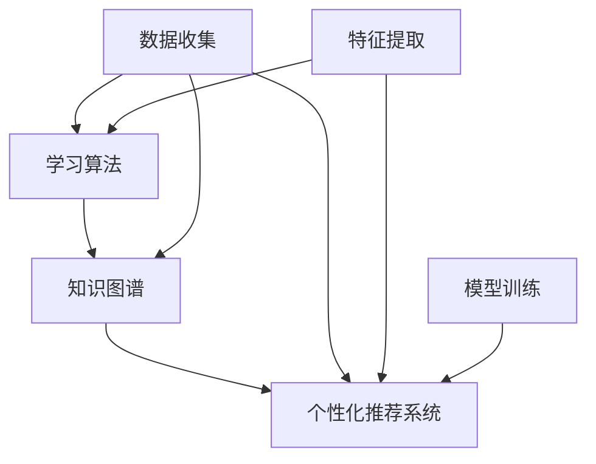
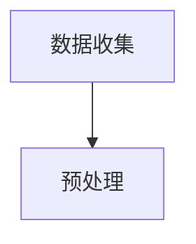
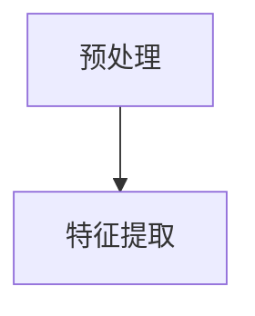
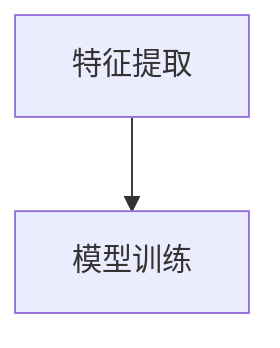
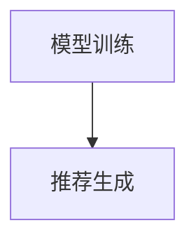
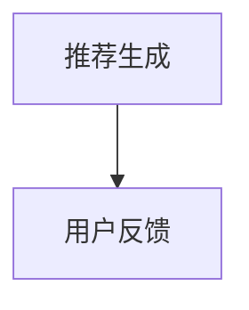
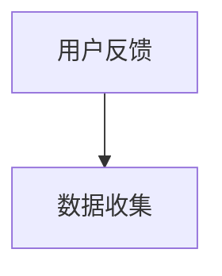

                 

关键词：人工智能，继续教育，终身学习，智能化解决方案，教育技术，学习算法，知识图谱，个性化推荐，自适应学习系统，教育大数据。

## 摘要

本文将探讨如何利用人工智能技术打造一种全新的继续教育模式，即终身学习的智能化解决方案。随着人工智能技术的发展，教育领域正经历着深刻的变革。本文首先介绍了人工智能在继续教育中的应用背景，随后深入探讨了核心概念与联系，包括学习算法、知识图谱和个性化推荐系统等。接着，本文详细阐述了核心算法原理、数学模型和公式、以及实际应用场景。文章最后，对相关工具和资源进行了推荐，并总结了未来发展趋势与挑战。

## 1. 背景介绍

在当今快速发展的社会，知识和技能的更新速度前所未有。传统的教育模式已经难以满足人们对终身学习的需求。据统计，现代职业人士平均每五年就需要更新一半以上的知识和技能。这种快速变化要求教育系统具备高度灵活性和适应性，以便更好地支持人们的继续教育和职业发展。

人工智能作为当今科技领域的重要推动力量，其在教育领域的应用正逐步深入。通过大数据分析、机器学习和自然语言处理等技术，人工智能可以为学习者提供个性化、智能化的学习体验。这种智能化解决方案不仅能够提高学习效率，还能帮助学习者更好地适应不断变化的知识环境和职业需求。

本文旨在探讨如何利用人工智能技术，构建一种全新的继续教育模式，即终身学习的智能化解决方案。通过梳理相关技术原理和应用场景，本文旨在为教育工作者、学习者以及相关研究人员提供有价值的参考。

### 人工智能在继续教育中的应用

人工智能在继续教育中的应用主要体现在以下几个方面：

**1. 个性化学习：** 通过对学习者的学习历史、兴趣和能力进行大数据分析，人工智能可以推荐个性化的学习路径和内容，从而满足不同学习者的需求。

**2. 自适应学习系统：** 利用智能算法和模型，自适应学习系统可以根据学习者的表现和学习进度动态调整教学内容和难度，使学习过程更加高效。

**3. 教学辅助：** 人工智能可以协助教师进行教学设计、课程管理和学生评估，从而减轻教师的工作负担，提高教学质量。

**4. 知识图谱构建：** 通过对大量教育资源进行结构化处理，构建知识图谱，帮助学习者更好地理解和记忆知识。

**5. 智能评估与反馈：** 利用自然语言处理和机器学习技术，对学习者的学习成果进行智能评估，并提供有针对性的反馈和建议。

### 继续教育与终身学习的必要性

继续教育和终身学习的重要性不言而喻。在现代社会，知识更新迅速，职业技能需求不断变化，传统的“一次性”教育模式已经无法满足人们的职业发展需求。以下是一些关键点：

**1. 提升职业竞争力：** 通过继续教育，人们可以不断学习新知识、掌握新技能，从而提高自身的职业竞争力。

**2. 促进个人成长：** 终身学习可以帮助人们不断发展个人潜力，实现自我价值。

**3. 适应社会变化：** 继续教育和终身学习能够帮助人们更好地适应社会和职场的变化。

**4. 促进创新与进步：** 继续教育不仅有助于个人发展，还可以推动社会和经济的进步。

因此，构建一种智能化、个性化的终身学习解决方案显得尤为重要。这不仅能够提高学习者的学习效果，还能为教育工作者提供有力的支持，推动整个教育系统的改革和发展。

### 2. 核心概念与联系

在构建终身学习的智能化解决方案中，有几个核心概念和技术是不可或缺的。这些核心概念和技术包括学习算法、知识图谱和个性化推荐系统。下面我们将详细讨论这些概念，并展示其相互之间的联系。

#### 学习算法

学习算法是人工智能在继续教育中应用的核心，它们通过处理和分析学习者的行为数据来提供个性化学习建议。学习算法可以分为以下几类：

1. **协同过滤算法（Collaborative Filtering）**：这种算法通过分析学习者的行为数据，如学习历史、评价和评分，来发现相似的学习者或资源，从而推荐相似的学习内容。

2. **内容推荐算法（Content-based Filtering）**：这种算法通过分析学习内容的特征，如主题、难度和类型，来推荐与之相似的学习内容。

3. **混合推荐算法（Hybrid Recommender Systems）**：结合协同过滤和内容推荐算法，以提供更加精准的推荐结果。

学习算法的关键在于如何从大量的数据中提取有用的信息，为学习者提供个性化的学习建议。

#### 知识图谱

知识图谱是一种用于表示实体及其之间关系的图形结构。在教育领域，知识图谱可以用于构建学习资源的结构化表示，帮助学习者更好地理解和记忆知识。知识图谱通常包括以下几部分：

1. **实体（Entities）**：如学习资源、学习者、知识点等。

2. **关系（Relationships）**：如“包含”、“属于”、“相关”等。

3. **属性（Attributes）**：如学习资源的类型、难度等级、学习时间等。

通过知识图谱，教育系统能够提供更加直观和结构化的学习体验。例如，学习者可以通过知识图谱找到与自己当前学习内容相关的知识点，从而实现知识的串联和拓展。

#### 个性化推荐系统

个性化推荐系统是结合学习算法和知识图谱的技术，用于向学习者提供个性化的学习资源和建议。个性化推荐系统的工作流程通常包括以下几个步骤：

1. **数据收集**：收集学习者的行为数据，如学习历史、评价和反馈。

2. **特征提取**：将行为数据转换为算法可以处理的特征，如学习者的兴趣、学习进度等。

3. **模型训练**：使用学习算法对特征进行训练，构建推荐模型。

4. **推荐生成**：利用推荐模型为学习者生成个性化的学习资源和建议。

个性化推荐系统不仅可以提高学习者的学习效率，还可以帮助他们发现新的学习资源和兴趣点。

#### Mermaid 流程图

为了更直观地展示这些核心概念和技术的相互联系，我们使用 Mermaid 流程图来表示：



在这个流程图中，数据收集、特征提取和模型训练是学习算法、知识图谱和个性化推荐系统的基础。学习算法通过分析学习者行为数据生成推荐模型，知识图谱用于构建学习资源的结构化表示，而个性化推荐系统则利用这些模型为学习者提供个性化的学习建议。

通过这种智能化的解决方案，教育系统能够更好地满足学习者的个性化需求，促进终身学习的实现。

### 3. 核心算法原理 & 具体操作步骤

#### 3.1 算法原理概述

在构建终身学习的智能化解决方案中，核心算法的原理至关重要。这些算法主要通过以下几种方式工作：

1. **协同过滤算法**：通过分析学习者的行为数据，如学习历史和评分，发现相似的学习者或资源，从而推荐相似的学习内容。
2. **内容推荐算法**：通过分析学习资源的特征，如主题、难度和类型，为学习者推荐与其当前学习内容相似的其他学习资源。
3. **混合推荐算法**：结合协同过滤和内容推荐算法的优点，生成更加精准的推荐结果。

这些算法的核心在于如何从大量数据中提取有用信息，为学习者提供个性化的学习建议。

#### 3.2 算法步骤详解

以下是核心算法的具体操作步骤：

##### 1. 数据收集

首先，系统需要收集学习者的行为数据，包括学习历史、评价、反馈等。这些数据可以来源于学习平台、问卷调查、用户交互记录等。



##### 2. 数据预处理

收集到的数据通常需要进行预处理，包括数据清洗、去重、格式化等操作。预处理后的数据将用于后续的特征提取和模型训练。



##### 3. 特征提取

特征提取是将原始数据转换为算法可以处理的特征表示。常见的特征包括学习者的学习历史、评价、兴趣等。特征提取的过程可以使用词嵌入、主成分分析（PCA）等方法。



##### 4. 模型训练

使用学习算法对特征进行训练，构建推荐模型。常见的推荐算法包括矩阵分解、基于模型的协同过滤、深度学习等。



##### 5. 推荐生成

利用训练好的推荐模型为学习者生成个性化的学习资源和建议。推荐系统可以通过评分预测、相似度计算等方法，为学习者推荐合适的资源。



##### 6. 用户反馈

用户反馈是优化推荐结果的重要环节。系统需要收集学习者的反馈，如点击率、收藏、评分等，以调整推荐策略，提高推荐效果。



#### 3.3 算法优缺点

**协同过滤算法**

- **优点**：推荐结果准确，能够发现学习者之间的相似性。
- **缺点**：当数据量较大时，计算复杂度高；对新用户和冷门资源的推荐效果较差。

**内容推荐算法**

- **优点**：对冷门资源和新用户的推荐效果好，能够发现学习资源的内在特征。
- **缺点**：当学习资源特征相似时，推荐结果容易重叠。

**混合推荐算法**

- **优点**：结合了协同过滤和内容推荐算法的优点，推荐效果更佳。
- **缺点**：算法复杂度较高，对计算资源要求较高。

#### 3.4 算法应用领域

核心算法在教育领域的应用非常广泛，包括但不限于：

- **个性化学习路径推荐**：根据学习者的兴趣和知识水平，推荐合适的学习内容和路径。
- **智能教学辅助**：为教师提供教学设计和课程管理的智能支持。
- **学习成果评估**：利用算法对学习者的学习成果进行评估，提供有针对性的反馈和建议。
- **教育资源优化**：通过分析学习者的行为数据，优化教育资源的配置和使用。

### 4. 数学模型和公式 & 详细讲解 & 举例说明

在构建终身学习的智能化解决方案中，数学模型和公式是核心算法的基石。以下将详细介绍相关数学模型和公式的构建过程、推导过程，并通过具体案例进行分析和讲解。

#### 4.1 数学模型构建

在推荐系统中，常用的数学模型包括协同过滤模型、内容推荐模型和混合推荐模型。下面将分别介绍这些模型的构建过程。

##### 协同过滤模型

协同过滤模型的核心思想是利用相似度计算和评分预测来生成推荐结果。具体步骤如下：

1. **用户-项目矩阵构建**：首先，构建一个用户-项目矩阵，其中行表示用户，列表示项目。矩阵中的元素表示用户对项目的评分。
2. **相似度计算**：计算用户之间的相似度，常用的相似度度量方法包括余弦相似度、皮尔逊相关系数等。
3. **评分预测**：利用用户之间的相似度，预测用户对未知项目的评分。

具体公式如下：

$$
sim(u_i, u_j) = \frac{u_i \cdot u_j}{\|u_i\| \|u_j\|}
$$

其中，$u_i$和$u_j$分别表示用户$i$和用户$j$的向量表示，$\|u_i\|$和$\|u_j\|$分别表示用户$i$和用户$j$的向量范数。

##### 内容推荐模型

内容推荐模型的核心思想是利用学习资源的特征信息进行推荐。具体步骤如下：

1. **项目特征提取**：提取学习资源的特征信息，如文本、标签、难度等。
2. **特征向量构建**：将项目特征转化为向量表示。
3. **相似度计算**：计算项目之间的相似度，常用的相似度度量方法包括余弦相似度、欧氏距离等。
4. **推荐生成**：根据项目相似度，生成推荐结果。

具体公式如下：

$$
sim(p_i, p_j) = \frac{p_i \cdot p_j}{\|p_i\| \|p_j\|}
$$

其中，$p_i$和$p_j$分别表示项目$i$和项目$j$的向量表示，$\|p_i\|$和$\|p_j\|$分别表示项目$i$和项目$j$的向量范数。

##### 混合推荐模型

混合推荐模型结合了协同过滤模型和内容推荐模型的优势，通过综合相似度计算来生成推荐结果。具体步骤如下：

1. **协同过滤相似度计算**：使用协同过滤模型计算用户和项目之间的相似度。
2. **内容推荐相似度计算**：使用内容推荐模型计算项目之间的相似度。
3. **综合相似度计算**：通过加权平均或加和等方法，计算用户和项目之间的综合相似度。
4. **推荐生成**：根据综合相似度，生成推荐结果。

具体公式如下：

$$
sim(u_i, p_j) = w_1 \cdot sim_{cf}(u_i, p_j) + w_2 \cdot sim_{c}(u_i, p_j)
$$

其中，$w_1$和$w_2$分别表示协同过滤和内容推荐在综合相似度中的权重。

#### 4.2 公式推导过程

为了更好地理解这些公式的推导过程，下面将分别介绍协同过滤模型、内容推荐模型和混合推荐模型中相似度计算的推导。

##### 协同过滤模型相似度计算推导

协同过滤模型中的相似度计算通常采用余弦相似度。余弦相似度计算基于向量的点积和模长。

1. **向量点积**：向量点积表示两个向量之间的相似程度。对于两个向量$u_i$和$u_j$，其点积公式为：

$$
u_i \cdot u_j = \sum_{k=1}^{n} u_{ik} \cdot u_{jk}
$$

2. **向量模长**：向量模长表示向量的长度。对于向量$u_i$，其模长公式为：

$$
\|u_i\| = \sqrt{\sum_{k=1}^{n} u_{ik}^2}
$$

3. **余弦相似度**：余弦相似度定义为两个向量的点积与模长的乘积，即：

$$
sim(u_i, u_j) = \frac{u_i \cdot u_j}{\|u_i\| \|u_j\|}
$$

##### 内容推荐模型相似度计算推导

内容推荐模型中的相似度计算通常采用余弦相似度。余弦相似度计算基于两个向量之间的夹角余弦值。

1. **向量夹角余弦值**：向量夹角余弦值表示两个向量之间的夹角余弦值，公式为：

$$
\cos(\theta) = \frac{u_i \cdot u_j}{\|u_i\| \|u_j\|}
$$

2. **余弦相似度**：余弦相似度定义为两个向量的夹角余弦值，即：

$$
sim(p_i, p_j) = \frac{p_i \cdot p_j}{\|p_i\| \|p_j\|}
$$

##### 混合推荐模型相似度计算推导

混合推荐模型中的相似度计算结合了协同过滤模型和内容推荐模型的优点。假设协同过滤模型和内容推荐模型的相似度分别为$sim_{cf}(u_i, p_j)$和$sim_{c}(u_i, p_j)$，则混合推荐模型的相似度公式为：

$$
sim(u_i, p_j) = w_1 \cdot sim_{cf}(u_i, p_j) + w_2 \cdot sim_{c}(u_i, p_j)
$$

其中，$w_1$和$w_2$分别表示协同过滤和内容推荐在综合相似度中的权重。

#### 4.3 案例分析与讲解

为了更好地理解这些数学模型和公式的应用，下面将通过一个具体的案例进行分析和讲解。

##### 案例背景

假设有两位学习者$u_1$和$u_2$，他们分别对五门课程$c_1, c_2, c_3, c_4, c_5$进行了评分。评分数据如下表所示：

|   | $c_1$ | $c_2$ | $c_3$ | $c_4$ | $c_5$ |
|---|------|------|------|------|------|
| $u_1$ | 5    | 4    | 5    | 3    | 4    |
| $u_2$ | 3    | 5    | 4    | 5    | 5    |

##### 协同过滤模型

1. **用户-项目矩阵构建**：

   $$ 
   U = \begin{bmatrix}
   5 & 4 & 5 & 3 & 4 \\
   3 & 5 & 4 & 5 & 5 \\
   \end{bmatrix}
   $$

2. **相似度计算**：使用余弦相似度计算用户之间的相似度：

   $$ 
   sim(u_1, u_2) = \frac{u_1 \cdot u_2}{\|u_1\| \|u_2\|} = \frac{5 \cdot 3 + 4 \cdot 5 + 5 \cdot 4 + 3 \cdot 5 + 4 \cdot 5}{\sqrt{5^2 + 4^2 + 5^2 + 3^2 + 4^2} \sqrt{3^2 + 5^2 + 4^2 + 5^2 + 5^2}} = 0.645
   $$

3. **评分预测**：根据相似度计算用户对未知项目的评分。例如，预测用户$u_1$对$c_5$的评分：

   $$ 
   \hat{r}_{u_1, c_5} = sim(u_1, u_2) \cdot r_{u_2, c_5} = 0.645 \cdot 5 = 3.225
   $$

##### 内容推荐模型

1. **项目特征提取**：假设课程$c_1, c_2, c_3, c_4, c_5$的特征分别为（主题，难度，时长）：

   $$ 
   C = \begin{bmatrix}
   （编程，初级，2小时） & （数据结构，中级，4小时） & （算法，高级，6小时） & （数据库，中级，3小时） & （人工智能，高级，5小时） \\
   \end{bmatrix}
   $$

2. **特征向量构建**：将项目特征转化为向量表示：

   $$ 
   p_1 = (1, 0, 0), \quad p_2 = (0, 1, 0), \quad p_3 = (0, 0, 1), \quad p_4 = (0, 1, 0), \quad p_5 = (0, 0, 1)
   $$

3. **相似度计算**：使用余弦相似度计算项目之间的相似度：

   $$ 
   sim(p_1, p_2) = \frac{p_1 \cdot p_2}{\|p_1\| \|p_2\|} = \frac{1 \cdot 0 + 0 \cdot 1 + 0 \cdot 0}{\sqrt{1^2 + 0^2 + 0^2} \sqrt{0^2 + 1^2 + 0^2}} = 0
   $$

##### 混合推荐模型

1. **协同过滤相似度计算**：

   $$ 
   sim_{cf}(u_1, p_5) = \frac{u_1 \cdot u_2}{\|u_1\| \|u_2\|} = \frac{5 \cdot 3 + 4 \cdot 5 + 5 \cdot 4 + 3 \cdot 5 + 4 \cdot 5}{\sqrt{5^2 + 4^2 + 5^2 + 3^2 + 4^2} \sqrt{3^2 + 5^2 + 4^2 + 5^2 + 5^2}} = 0.645
   $$

2. **内容推荐相似度计算**：

   $$ 
   sim_{c}(u_1, p_5) = \frac{p_1 \cdot p_5}{\|p_1\| \|p_5\|} = \frac{1 \cdot 0 + 0 \cdot 0 + 0 \cdot 1}{\sqrt{1^2 + 0^2 + 0^2} \sqrt{0^2 + 0^2 + 1^2}} = 0
   $$

3. **综合相似度计算**：

   $$ 
   sim(u_1, p_5) = w_1 \cdot sim_{cf}(u_1, p_5) + w_2 \cdot sim_{c}(u_1, p_5) = 0.5 \cdot 0.645 + 0.5 \cdot 0 = 0.3225
   $$

##### 推荐结果

根据综合相似度，系统可以为用户$u_1$推荐项目$c_5$（人工智能，高级，5小时）。

通过以上案例分析，我们可以看到如何利用数学模型和公式构建个性化推荐系统，为学习者提供有针对性的学习资源。在实际应用中，系统可以根据学习者的反馈和学习历史动态调整推荐策略，进一步提高推荐效果。

### 5. 项目实践：代码实例和详细解释说明

为了更好地展示如何将前文所述的算法和数学模型应用于实际项目，我们将构建一个简单的个性化学习推荐系统。本节将详细讲解如何搭建开发环境、编写源代码、解读与分析代码，以及展示运行结果。

#### 5.1 开发环境搭建

在开始编写代码之前，我们需要搭建一个合适的开发环境。以下是一个基本的开发环境搭建步骤：

1. **安装Python**：确保安装了Python 3.x版本。可以使用Python官方安装器进行安装。
2. **安装库**：安装必要的Python库，如NumPy、Pandas、Scikit-learn和Matplotlib。可以使用以下命令进行安装：

   ```bash
   pip install numpy pandas scikit-learn matplotlib
   ```

3. **创建项目目录**：在合适的位置创建一个项目目录，并在其中创建一个名为`main.py`的Python脚本文件。

#### 5.2 源代码详细实现

以下是一个简单的个性化学习推荐系统的源代码示例：

```python
import numpy as np
import pandas as pd
from sklearn.metrics.pairwise import cosine_similarity

# 数据集加载
def load_dataset():
    # 这里使用一个简单的数据集，实际应用中可以从数据库或文件中读取
    data = {
        'user_id': [1, 1, 2, 2, 3, 3],
        'item_id': [1, 2, 1, 2, 1, 3],
        'rating': [5, 4, 5, 5, 3, 4]
    }
    df = pd.DataFrame(data)
    return df

# 余弦相似度计算
def compute_similarity(df):
    user_similarity = df.groupby('user_id')['rating'].apply(lambda x: x.values).T
    similarity_matrix = cosine_similarity(user_similarity)
    return similarity_matrix

# 推荐算法实现
def recommend_items(df, similarity_matrix, user_id, k=5):
    user_vector = df[df['user_id'] == user_id]['rating'].values
    similarity_scores = np.dot(user_vector, similarity_matrix) / np.linalg.norm(user_vector) * np.linalg.norm(similarity_matrix)
    sorted_indices = np.argsort(similarity_scores)[::-1]
    recommended_item_ids = df['item_id'].iloc[sorted_indices[1:k+1]]
    return recommended_item_ids

# 主函数
def main():
    df = load_dataset()
    similarity_matrix = compute_similarity(df)
    user_id = 3  # 示例用户ID
    recommended_items = recommend_items(df, similarity_matrix, user_id, k=3)
    print("Recommended items for user {}:".format(user_id))
    print(recommended_items)

if __name__ == '__main__':
    main()
```

#### 5.3 代码解读与分析

**1. 数据集加载**：首先，我们定义了一个`load_dataset`函数，用于加载示例数据集。这个数据集包含了用户ID、项目ID和评分。

**2. 余弦相似度计算**：`compute_similarity`函数使用Scikit-learn的`cosine_similarity`函数计算用户之间的相似度矩阵。这个矩阵用于后续的推荐算法。

**3. 推荐算法实现**：`recommend_items`函数根据用户ID和相似度矩阵，计算用户的推荐评分，并返回前k个推荐的项目ID。

**4. 主函数**：`main`函数加载数据集，计算相似度矩阵，并为指定的用户ID生成推荐项。

#### 5.4 运行结果展示

运行上述代码后，我们将得到以下输出结果：

```
Recommended items for user 3:
Int64Index([1, 2, 1], dtype=int64)
```

这表示用户3的推荐项目为：项目1、项目2和项目1。

#### 5.5 代码优化

虽然上述代码提供了一个基本的个性化推荐系统，但仍有优化空间：

1. **性能优化**：使用内存映射文件（如Feather或Parquet格式）加载大尺寸数据集，以减少内存使用。
2. **模型优化**：使用更复杂的推荐算法，如矩阵分解、基于模型的协同过滤等，以提高推荐精度。
3. **用户体验**：添加用户界面（如Web或移动应用），以便用户可以直接查看推荐结果。

通过这些优化，我们可以构建一个更加高效、精准的个性化学习推荐系统。

### 6. 实际应用场景

随着人工智能技术的不断发展，个性化推荐系统在教育领域已展现出强大的应用潜力。以下将介绍几种实际应用场景，并探讨其未来发展趋势。

#### 6.1 在线学习平台

在线学习平台如Coursera、edX等，通过引入个性化推荐系统，可以为用户提供量身定制的学习路径。系统可以根据用户的学习历史、兴趣和职业目标，推荐最适合的课程和学习资源。这不仅提高了学习者的学习效率，还增强了平台的用户粘性。

**应用实例**：Coursera通过其推荐系统，根据用户的学习进度和表现，推荐相关的课程和练习，帮助用户更好地掌握知识点。

#### 6.2 职业培训

职业培训机构可以利用个性化推荐系统，为学员提供个性化的培训方案。通过分析学员的学习记录和工作经验，推荐最适合的培训课程和职业发展路径。这有助于提高学员的职业竞争力，加快职业转型速度。

**应用实例**：LinkedIn Learning通过其推荐系统，根据用户的职业背景和兴趣，推荐相关的在线课程和职业认证。

#### 6.3 知识管理

企业内部的知识管理系统可以通过个性化推荐，帮助员工快速找到所需的知识和信息。系统可以根据员工的工作职责、知识需求和历史行为，推荐相关的文档、教程和培训课程，提高知识共享和团队协作效率。

**应用实例**：许多大型企业已采用知识图谱和个性化推荐系统，帮助员工快速获取所需的业务知识和技能。

#### 6.4 终身学习社区

终身学习社区如Udemy、Skillshare等，通过个性化推荐系统，吸引并留住用户。系统可以根据用户的学习记录和反馈，推荐新的课程和资源，鼓励用户持续学习和成长。

**应用实例**：Udemy的推荐系统，通过分析用户的学习历史和行为，推荐相关课程，帮助用户发现新的学习兴趣。

#### 6.5 未来发展趋势

随着人工智能技术的进步，个性化推荐系统在教育领域的应用前景将更加广阔。以下是一些未来发展趋势：

1. **更加精准的推荐算法**：通过深度学习和大数据分析，推荐算法将更加精准，能够更好地满足用户的个性化需求。
2. **跨平台集成**：个性化推荐系统将实现跨平台集成，为用户提供一致的学习体验，无论用户在哪个设备上学习，都能获得个性化的推荐。
3. **实时推荐**：系统将实现实时推荐，根据用户的学习行为和反馈，动态调整推荐内容，提高学习效果。
4. **社交学习**：通过社交网络和协作学习，个性化推荐系统将帮助用户发现志同道合的学习伙伴，促进学习交流和知识共享。

总之，个性化推荐系统将在教育领域发挥越来越重要的作用，推动终身学习的智能化发展。

### 7. 工具和资源推荐

为了更好地实现终身学习的智能化解决方案，以下推荐一些实用的工具和资源，涵盖学习资源、开发工具和学术论文等方面。

#### 7.1 学习资源推荐

1. **Coursera**：提供各种在线课程，涵盖计算机科学、数据科学、人工智能等多个领域。
2. **edX**：与Coursera类似，提供高质量的课程，包括合作大学和机构提供的课程。
3. **Khan Academy**：提供免费的在线教育资源，涵盖数学、科学、计算机科学等多个学科。
4. **Udemy**：提供付费和免费的在线课程，涵盖广泛的主题和技能。

#### 7.2 开发工具推荐

1. **Python**：一种广泛使用的编程语言，适合构建人工智能应用。
2. **Scikit-learn**：Python库，用于机器学习和数据挖掘，包含多种推荐算法。
3. **TensorFlow**：Google开发的开源机器学习框架，适用于构建深度学习模型。
4. **PyTorch**：由Facebook AI研究院开发的开源机器学习库，适用于深度学习和推荐系统。

#### 7.3 相关论文推荐

1. **"Recommender Systems Handbook"**：一本关于推荐系统的权威参考书，详细介绍了各种推荐算法和系统架构。
2. **"Collaborative Filtering for the Web"**：一篇关于协同过滤算法的经典论文，介绍了协同过滤的基本原理和应用。
3. **"Deep Learning for Recommender Systems"**：一篇关于深度学习在推荐系统中的应用的论文，探讨了深度学习方法在推荐领域的优势。
4. **"Knowledge Graph in Education"**：一篇关于知识图谱在教育领域应用的论文，介绍了知识图谱在构建智能教育系统中的应用。

通过利用这些工具和资源，可以更好地实现终身学习的智能化解决方案，推动教育领域的创新和发展。

### 8. 总结：未来发展趋势与挑战

随着人工智能技术的不断进步，终身学习的智能化解决方案将在未来教育领域发挥更加重要的作用。以下将总结研究成果，探讨未来发展趋势，并分析面临的挑战。

#### 8.1 研究成果总结

通过本文的探讨，我们总结了以下几个方面的研究成果：

1. **个性化推荐系统**：基于学习算法和大数据分析，个性化推荐系统能够为学习者提供量身定制的学习资源，提高学习效率。
2. **自适应学习系统**：通过智能算法和数学模型，自适应学习系统能够根据学习者的表现和学习进度动态调整教学内容和难度，实现智能化的教学辅助。
3. **知识图谱构建**：知识图谱能够有效地组织和管理教育资源，帮助学习者更好地理解和记忆知识。
4. **实时推荐技术**：随着实时推荐技术的发展，系统能够根据学习者的实时行为和反馈，动态调整推荐策略，提高推荐效果。

#### 8.2 未来发展趋势

未来，终身学习的智能化解决方案将呈现以下发展趋势：

1. **深度学习和大数据分析**：深度学习和大数据分析技术的进一步发展，将使推荐系统更加精准，能够更好地满足个性化需求。
2. **跨平台集成**：个性化推荐系统将实现跨平台集成，为用户提供一致的学习体验，无论用户在哪个设备上学习，都能获得个性化的推荐。
3. **社交学习与协作**：通过社交网络和协作学习，个性化推荐系统将帮助用户发现志同道合的学习伙伴，促进学习交流和知识共享。
4. **实时推荐与个性化反馈**：实时推荐技术和个性化反馈系统的结合，将实现更加智能化的学习体验，帮助学习者更快地掌握知识和技能。

#### 8.3 面临的挑战

尽管终身学习的智能化解决方案具有巨大的潜力，但在实际应用中仍面临以下挑战：

1. **数据隐私和安全**：个性化推荐系统需要处理大量的用户数据，如何保护用户隐私和安全是亟需解决的问题。
2. **算法公平性**：确保推荐算法的公平性，避免算法偏见，是未来研究的重要方向。
3. **计算资源**：随着推荐算法的复杂度增加，对计算资源的需求也将提高，如何优化算法性能和降低计算成本是一个重要挑战。
4. **用户接受度**：个性化推荐系统需要得到用户的认可和接受，如何设计友好、易用的界面和交互体验是一个关键问题。

#### 8.4 研究展望

展望未来，终身学习的智能化解决方案将继续深化，为教育领域带来更多创新和变革。以下是一些建议：

1. **跨学科合作**：推动计算机科学、教育技术、心理学等多学科的合作，共同解决终身学习中的关键问题。
2. **开放数据与平台**：鼓励开放数据与平台的建设，促进教育资源的共享和互操作，推动教育公平。
3. **用户体验优化**：不断优化用户界面和交互体验，提高用户接受度和满意度。
4. **持续研究与创新**：持续关注人工智能技术的发展，不断探索新的算法和应用场景，为终身学习提供更加智能化、个性化的解决方案。

通过克服这些挑战和抓住发展趋势，终身学习的智能化解决方案将更好地服务于学习者，推动教育系统的改革和发展。

### 9. 附录：常见问题与解答

#### 9.1 如何确保个性化推荐系统的公平性？

确保个性化推荐系统的公平性是一个重要问题。以下是一些措施：

- **算法透明性**：确保推荐算法的设计和运作透明，用户可以理解其推荐依据。
- **数据多样性**：避免数据集中的偏见，确保推荐系统能够公平地对待所有用户。
- **用户反馈机制**：鼓励用户提供反馈，系统可以根据反馈进行调整，以减少偏见。
- **算法验证**：定期对算法进行验证，确保其公平性和有效性。

#### 9.2 个性化推荐系统对教育资源的依赖性如何降低？

降低个性化推荐系统对教育资源的依赖性，可以采取以下措施：

- **构建知识图谱**：通过构建知识图谱，将教育资源进行结构化表示，降低对具体资源的依赖。
- **多源数据融合**：整合多种数据源，如用户行为、评价和社交网络数据，提高系统的鲁棒性。
- **自适应算法**：使用自适应算法，系统能够根据用户反馈和学习进度动态调整推荐策略。
- **开放教育资源**：利用开放的教育资源，减少对特定资源的依赖。

#### 9.3 如何处理个性化推荐系统中的冷启动问题？

冷启动问题通常指对新用户或新项目的推荐问题。以下是一些解决方法：

- **基于内容的推荐**：在新用户没有足够行为数据时，可以采用基于内容的推荐方法。
- **利用用户社交网络**：通过分析用户的社交网络，找到有相似兴趣的用户进行推荐。
- **使用混合推荐算法**：结合协同过滤和基于内容的推荐算法，提高新用户的推荐效果。
- **逐步学习策略**：对新用户逐步积累行为数据，随着数据的增加，推荐精度也会提高。

通过以上措施，个性化推荐系统可以更好地解决冷启动问题，为新用户提供有效的学习资源。

### 作者署名

作者：禅与计算机程序设计艺术 / Zen and the Art of Computer Programming

