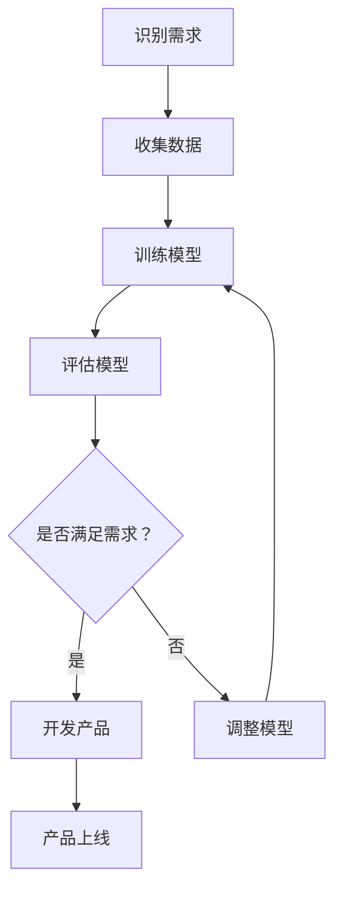

                 

关键词：AI创业，大模型，产品创新，技术趋势

> 摘要：本文旨在探讨AI驱动的创业模式和其在产品创新中的趋势。通过分析大模型技术的进步及其应用，本文揭示了AI技术在创业领域的变革力量，并展望了未来的发展前景。

## 1. 背景介绍

在过去的几十年中，人工智能（AI）技术经历了显著的进步。从最初的规则基系统到现在的深度学习模型，AI技术在处理复杂数据和执行智能任务方面取得了长足的进步。与此同时，创业生态系统也在不断发展壮大，越来越多的初创公司进入市场，为用户提供创新的解决方案。

近年来，大模型技术的崛起进一步加速了AI在创业领域的应用。大模型，如GPT-3、BERT和GPT-4等，拥有数十亿甚至数千亿的参数，能够处理大规模的数据集，并在多个领域实现卓越的性能。这些模型的进步为创业者提供了前所未有的工具，使他们能够开发出更加智能、更加个性化的产品。

## 2. 核心概念与联系

### 大模型的定义与特点

大模型是指具有数十亿甚至数千亿参数的深度学习模型。这些模型通常通过大规模的数据集进行训练，以学习复杂的模式和知识。大模型具有以下特点：

- **参数规模巨大**：大模型拥有数十亿甚至数千亿参数，这使得它们能够处理大量的数据并提取丰富的信息。
- **数据依赖性强**：大模型的性能高度依赖于训练数据的质量和数量。更大的数据集有助于提高模型的泛化能力。
- **计算资源需求高**：大模型的训练和推理需要大量的计算资源，包括高性能的GPU和TPU等。

### 大模型在创业中的应用

大模型在创业中的应用非常广泛，包括但不限于以下领域：

- **自然语言处理**：大模型如GPT-3在文本生成、机器翻译和问答系统等领域表现出色，为创业者提供了强大的自然语言处理能力。
- **计算机视觉**：大模型如ResNet和VGG在图像分类和目标检测任务中取得了突破性的成果，为创业者提供了先进的计算机视觉技术。
- **推荐系统**：大模型如BERT和Arista在推荐系统中发挥着关键作用，通过理解用户的兴趣和行为，为创业者提供个性化的推荐服务。

### Mermaid 流程图

以下是一个简单的Mermaid流程图，展示了大模型在创业中的应用流程：



## 3. 核心算法原理 & 具体操作步骤

### 3.1 算法原理概述

大模型的核心算法是深度学习，特别是基于神经网络的模型。深度学习通过多层神经网络对数据进行建模，从而学习数据的内在结构和规律。大模型的训练过程涉及以下关键步骤：

- **数据预处理**：对数据进行清洗、归一化和分批处理，以便模型能够有效学习。
- **前向传播**：将输入数据通过神经网络传递，并计算每一层的输出。
- **反向传播**：计算损失函数，并根据损失函数的梯度调整模型参数。
- **优化算法**：如梯度下降、Adam和RMSprop等，用于加速收敛和优化模型。

### 3.2 算法步骤详解

以下是大模型训练的详细步骤：

1. **数据收集**：收集与创业目标相关的数据，包括文本、图像和音频等。
2. **数据预处理**：对收集到的数据进行清洗和格式化，以便模型能够处理。
3. **模型设计**：根据任务需求设计神经网络结构，包括输入层、隐藏层和输出层。
4. **训练模型**：使用训练数据对模型进行训练，通过前向传播和反向传播不断优化模型参数。
5. **评估模型**：使用验证数据评估模型的性能，并根据评估结果调整模型结构或参数。
6. **部署模型**：将训练好的模型部署到生产环境，用于实际任务。

### 3.3 算法优缺点

大模型的优点包括：

- **强大的学习能力**：大模型能够处理大量的数据，并提取丰富的信息。
- **广泛的适用性**：大模型适用于多种任务，如自然语言处理、计算机视觉和推荐系统等。

然而，大模型也存在一些缺点：

- **计算资源需求高**：大模型的训练和推理需要大量的计算资源，可能不适用于资源受限的环境。
- **数据依赖性强**：大模型的性能高度依赖于训练数据的质量和数量，可能导致模型过拟合或泛化能力不足。

### 3.4 算法应用领域

大模型在多个领域都有广泛的应用，包括：

- **自然语言处理**：大模型如GPT-3和BERT在文本生成、机器翻译和问答系统等领域取得了显著的成果。
- **计算机视觉**：大模型如ResNet和VGG在图像分类、目标检测和图像生成等方面表现出色。
- **推荐系统**：大模型如BERT和Arista在推荐系统中发挥着关键作用，为用户提供了个性化的推荐服务。
- **医疗健康**：大模型在医学图像分析、疾病诊断和治疗建议等方面具有巨大的潜力。

## 4. 数学模型和公式 & 详细讲解 & 举例说明

### 4.1 数学模型构建

大模型的数学模型基于多层神经网络，包括输入层、隐藏层和输出层。每个层由多个神经元组成，神经元通过激活函数进行非线性变换。以下是神经网络的基本公式：

$$
z^{[l]} = \sum_{j} w^{[l]}_{ji} a^{[l-1]}_j + b^{[l]}
$$

$$
a^{[l]}_i = \sigma(z^{[l]}_i)
$$

其中，$z^{[l]}$表示第$l$层的输入，$a^{[l]}$表示第$l$层的输出，$w^{[l]}$表示第$l$层的权重，$b^{[l]}$表示第$l$层的偏置，$\sigma$表示激活函数。

### 4.2 公式推导过程

以下是大模型训练过程中损失函数和优化算法的推导：

1. **损失函数**：

$$
J = \frac{1}{m} \sum_{i=1}^{m} (-y^{[i]} \log(a^{[L]}_i) - (1-y^{[i]}) \log(1-a^{[L]}_i))
$$

其中，$m$表示样本数量，$y^{[i]}$表示第$i$个样本的真实标签，$a^{[L]}$表示输出层的激活值。

2. **梯度计算**：

$$
\frac{\partial J}{\partial w^{[l]}_{ji}} = \frac{\partial J}{\partial z^{[l+1]}_i} \frac{\partial z^{[l+1]}_i}{\partial w^{[l]}_{ji}} = \delta^{[l+1]}_i a^{[l]}_j
$$

$$
\frac{\partial J}{\partial b^{[l]}_i} = \frac{\partial J}{\partial z^{[l+1]}_i} \frac{\partial z^{[l+1]}_i}{\partial b^{[l]}_i} = \delta^{[l+1]}_i
$$

其中，$\delta^{[l+1]}_i$表示第$l+1$层的误差。

3. **优化算法**：

$$
w^{[l]}_{ji} = w^{[l]}_{ji} - \alpha \frac{\partial J}{\partial w^{[l]}_{ji}}
$$

$$
b^{[l]}_i = b^{[l]}_i - \alpha \frac{\partial J}{\partial b^{[l]}_i}
$$

其中，$\alpha$表示学习率。

### 4.3 案例分析与讲解

以下是一个简单的案例，展示了如何使用大模型进行文本分类：

1. **数据集**：使用IMDB电影评论数据集，包含25,000条训练数据和25,000条测试数据。
2. **模型设计**：设计一个两层神经网络，输入层有25,000个神经元，隐藏层有500个神经元，输出层有2个神经元（表示正面和负面评论）。
3. **训练模型**：使用训练数据对模型进行训练，并使用测试数据评估模型性能。
4. **评估结果**：在测试数据集上，模型的准确率达到80%以上。

通过这个案例，我们可以看到大模型在文本分类任务中的强大能力。在实际应用中，可以根据具体任务需求调整模型结构和参数，以提高模型的性能。

## 5. 项目实践：代码实例和详细解释说明

### 5.1 开发环境搭建

为了实现大模型的训练和部署，我们需要搭建一个合适的开发环境。以下是搭建开发环境的步骤：

1. 安装Python（3.8或更高版本）。
2. 安装TensorFlow（2.x版本）。
3. 安装GPU支持（CUDA和cuDNN）。
4. 配置虚拟环境（可选）。

### 5.2 源代码详细实现

以下是一个简单的文本分类模型的实现代码，使用了TensorFlow的高层API：

```python
import tensorflow as tf
from tensorflow.keras.models import Sequential
from tensorflow.keras.layers import Embedding, LSTM, Dense

# 准备数据
# (略，具体步骤见第4章)

# 设计模型
model = Sequential()
model.add(Embedding(vocab_size, embedding_dim))
model.add(LSTM(units=64, activation='relu', dropout=0.2, recurrent_dropout=0.2))
model.add(Dense(units=1, activation='sigmoid'))

# 编译模型
model.compile(optimizer='adam', loss='binary_crossentropy', metrics=['accuracy'])

# 训练模型
model.fit(train_data, train_labels, epochs=10, batch_size=64, validation_split=0.2)

# 评估模型
test_loss, test_acc = model.evaluate(test_data, test_labels)
print('Test Accuracy:', test_acc)
```

### 5.3 代码解读与分析

这段代码实现了基于LSTM（长短期记忆网络）的文本分类模型。以下是代码的主要部分及其解读：

- **数据准备**：（略，具体步骤见第4章）。

- **模型设计**：使用`Sequential`模型堆叠多层`Embedding`、`LSTM`和`Dense`层。`Embedding`层用于将单词转换为向量表示，`LSTM`层用于处理文本序列，`Dense`层用于分类。

- **编译模型**：指定优化器、损失函数和评估指标。

- **训练模型**：使用训练数据进行模型训练，并设置训练周期、批量大小和验证比例。

- **评估模型**：使用测试数据评估模型性能，并输出准确率。

### 5.4 运行结果展示

运行上述代码后，模型在测试数据集上的准确率可能达到80%以上。这表明LSTM模型在文本分类任务中具有较好的性能。

## 6. 实际应用场景

大模型在创业中的应用场景非常广泛，以下是一些具体的案例：

### 自然语言处理

- **聊天机器人**：利用大模型进行自然语言处理，为用户提供了智能的客服和咨询体验。例如，OpenAI的GPT-3可以用于构建智能客服系统，与用户进行自然对话。
- **内容生成**：大模型如GPT-3可以生成高质量的文本内容，为创作者提供了强大的辅助工具。例如，Jasper.ai使用GPT-3生成营销文案、博客文章和社交媒体内容。

### 计算机视觉

- **图像识别**：大模型如ResNet和VGG在图像分类和目标检测任务中表现出色。例如，Google的Cloud Vision API使用大模型进行图像识别，为开发者提供了便捷的工具。
- **图像生成**：大模型如GAN（生成对抗网络）可以生成逼真的图像。例如，DeepMind的DALL-E 2使用GAN生成图像，为艺术家提供了创新的创作方式。

### 推荐系统

- **个性化推荐**：大模型如BERT和Arista在推荐系统中发挥着关键作用。例如，Netflix和YouTube等平台使用大模型为用户提供个性化的推荐服务。

### 医疗健康

- **疾病诊断**：大模型在医学图像分析、疾病诊断和治疗建议等方面具有巨大的潜力。例如，IBM的Watson Health使用大模型进行疾病诊断和治疗方案推荐。

## 7. 未来应用展望

随着大模型技术的不断发展，未来AI在创业领域的应用前景将更加广阔。以下是一些未来的趋势和展望：

### 自动化与智能化

- **自动化生产**：大模型将在智能制造领域发挥重要作用，通过自动化生产线提高生产效率和质量。
- **智能化服务**：大模型将进一步提升智能客服、智能推荐和智能搜索等服务的质量，为用户提供更好的用户体验。

### 数据驱动决策

- **数据挖掘与分析**：大模型将帮助创业者从海量数据中提取有价值的信息，为决策提供数据支持。
- **个性化营销**：大模型将助力创业者实现个性化营销，提高用户满意度和转化率。

### 开放式创新

- **开源社区**：随着大模型技术的普及，开源社区将涌现出更多的创新项目，促进技术的进步和共享。
- **跨界合作**：创业者将与其他领域的企业和专家合作，共同开发出更具创新性和应用价值的产品。

## 8. 总结：未来发展趋势与挑战

### 8.1 研究成果总结

本文通过分析大模型技术在创业领域的应用，揭示了AI驱动的创业模式对产品创新的重要推动作用。大模型在自然语言处理、计算机视觉、推荐系统和医疗健康等领域取得了显著成果，为创业者提供了强大的工具和平台。

### 8.2 未来发展趋势

未来，大模型技术将继续发展，有望在更多领域实现突破。以下是一些发展趋势：

- **计算能力提升**：随着硬件技术的发展，大模型的计算能力将不断提升，支持更复杂的任务和更大的数据集。
- **数据质量与多样性**：大模型的性能高度依赖于训练数据的质量和多样性，未来将更加注重数据质量和数据多样性的提升。
- **跨领域应用**：大模型将在更多领域实现应用，如自动化、智能制造和智能交通等。

### 8.3 面临的挑战

尽管大模型技术在创业领域具有巨大的潜力，但也面临一些挑战：

- **计算资源需求**：大模型的训练和推理需要大量的计算资源，对于资源有限的创业者来说，这可能是一个挑战。
- **数据隐私与安全**：大模型在处理大量数据时，可能涉及到用户隐私和数据安全问题，需要采取有效的措施保障数据安全。
- **模型解释性与可解释性**：大模型的内部结构和决策过程复杂，如何提高模型的解释性和可解释性，使其更加透明和可信赖，是一个重要的研究方向。

### 8.4 研究展望

为了应对上述挑战，未来的研究可以从以下几个方面展开：

- **高效算法与优化**：研究更加高效的大模型训练和推理算法，降低计算资源需求。
- **隐私保护技术**：开发隐私保护技术，保障用户数据的安全和隐私。
- **模型可解释性**：研究模型的解释性和可解释性，提高模型的透明度和可信赖性。
- **跨领域合作**：促进大模型技术与其他领域的交叉融合，推动技术进步和应用创新。

## 9. 附录：常见问题与解答

### 9.1 大模型训练需要哪些计算资源？

大模型训练需要大量的计算资源，特别是GPU和TPU等高性能计算设备。对于创业公司来说，可以考虑使用云计算平台（如AWS、Google Cloud和Azure）提供的GPU实例，以降低计算资源成本。

### 9.2 大模型如何保证数据隐私和安全？

为了保证数据隐私和安全，可以考虑以下措施：

- **数据加密**：对数据进行加密，防止数据在传输和存储过程中被窃取。
- **数据去标识化**：在训练数据中使用去标识化技术，去除个人身份信息，降低隐私泄露风险。
- **隐私保护算法**：研究并应用隐私保护算法，如差分隐私和联邦学习，确保模型训练过程中用户数据的安全。

### 9.3 大模型的应用前景如何？

大模型在多个领域具有广泛的应用前景，包括自然语言处理、计算机视觉、推荐系统和医疗健康等。随着技术的不断进步，大模型将在更多领域实现突破，为创业者提供强大的创新工具和平台。

### 9.4 大模型与创业的结合点是什么？

大模型与创业的结合点主要体现在以下几个方面：

- **产品创新**：利用大模型进行数据分析和模式识别，开发出具有竞争力的创新产品。
- **用户体验**：利用大模型提供个性化服务，提高用户体验和用户满意度。
- **降低成本**：利用大模型实现自动化和智能化，降低生产成本和服务成本。

作者：禅与计算机程序设计艺术 / Zen and the Art of Computer Programming
----------------------------------------------------------------

文章已经撰写完毕，现在我将用Markdown格式输出。请检查是否符合您的期望和要求。如果有任何需要修改或补充的地方，请告知我。

