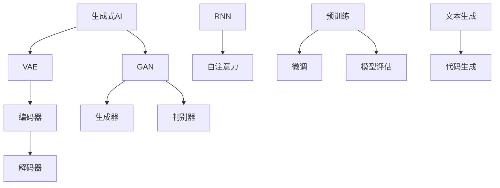

                 

关键词：AIGC、生成式 AI、文本生成、代码生成、深度学习、模型架构、代码实例、算法原理、数学模型

摘要：本文将深入探讨AIGC（AI-Generated Content）的基本原理及其在文本和代码生成中的应用。通过分析AIGC的核心概念、相关模型架构、算法原理、数学模型，以及具体代码实例，本文旨在帮助读者全面理解AIGC的技术机制和应用前景，为未来的研究和实践提供参考。

## 1. 背景介绍

在数字时代，信息生成和处理的需求日益增长。随着深度学习技术的进步，生成式AI（Generative AI）成为了一个备受关注的研究领域。生成式AI旨在通过学习数据生成新的内容，而非仅仅识别现有数据中的模式。AIGC（AI-Generated Content）是生成式AI的一个重要分支，它利用人工智能技术生成各种类型的内容，如文本、图片、音频和代码等。

AIGC具有广泛的应用前景，包括但不限于内容创作、个性化推荐、虚拟现实、游戏开发等领域。例如，在内容创作方面，AIGC可以帮助自动生成新闻文章、广告文案、音乐作品等；在个性化推荐方面，AIGC可以根据用户的历史行为和偏好生成个性化的内容；在虚拟现实和游戏开发方面，AIGC可以自动生成虚拟场景、角色和故事情节。

本文将重点讨论AIGC在文本和代码生成中的应用，详细解析其原理和实现方法，并通过具体的代码实例进行讲解。希望通过本文的探讨，能够帮助读者更好地理解AIGC的技术机制和应用价值。

## 2. 核心概念与联系

### 2.1 核心概念

AIGC涉及多个核心概念，包括：

- **生成式AI（Generative AI）**：一种通过学习大量数据生成新数据的AI技术。与判别式AI（Discriminative AI）不同，生成式AI不仅能够识别数据中的模式，还能够生成全新的数据。

- **变分自编码器（Variational Autoencoder, VAE）**：一种生成模型，通过编码器和解码器分别学习数据的潜在表示和重构数据。

- **生成对抗网络（Generative Adversarial Networks, GAN）**：一种由生成器和判别器组成的模型，生成器和判别器相互对抗，通过不断迭代提高生成数据的真实感。

- **循环神经网络（Recurrent Neural Network, RNN）**：一种能够处理序列数据的神经网络，通过记忆状态捕捉序列中的依赖关系。

- **自注意力机制（Self-Attention Mechanism）**：一种用于捕捉序列中长距离依赖关系的机制，广泛应用于自然语言处理任务。

- **预训练和微调（Pre-training and Fine-tuning）**：预训练是指在大规模数据集上训练模型，使其具备一定的通用能力；微调是指将预训练模型在特定任务上进行进一步调整，以提高性能。

### 2.2 核心概念联系

AIGC的各个核心概念之间存在密切的联系。生成式AI是AIGC的基础，VAE和GAN是两种主要的生成模型，分别适用于不同的场景。VAE适合生成连续数据，如图像和音频，而GAN则更适合生成离散数据，如文本和代码。

RNN和自注意力机制是处理序列数据的重要工具，尤其在自然语言处理任务中，它们能够帮助模型捕捉长距离依赖关系，从而生成更加连贯和真实的文本。预训练和微调是AIGC模型训练的关键步骤，通过预训练模型，可以使其具备一定的泛化能力；通过微调，可以进一步提高模型在特定任务上的性能。


### 2.3 Mermaid 流程图

以下是一个简化的AIGC架构的Mermaid流程图，展示了各个核心概念之间的联系：



在这个流程图中，生成式AI作为基础，连接了VAE和GAN，它们分别通过编码器和解码器（VAE）或生成器和判别器（GAN）实现数据的生成。RNN和自注意力机制在自然语言处理任务中发挥作用，而预训练和微调则是模型训练的关键步骤。最后，通过模型训练，可以实现文本生成和代码生成等具体应用。

## 3. 核心算法原理 & 具体操作步骤

### 3.1 算法原理概述

AIGC的核心算法主要包括生成式AI模型的设计与训练。以下将详细介绍VAE和GAN这两种主要生成模型的原理。

#### 3.1.1 变分自编码器（VAE）

VAE是一种无监督学习模型，由编码器（Encoder）和解码器（Decoder）两部分组成。编码器的目的是将输入数据映射到一个低维的潜在空间中，解码器则从潜在空间中重建原始数据。

- **编码器**：接受输入数据，通过一系列的全连接层或卷积层，将数据压缩成一个较小的向量，这个向量代表了输入数据的潜在表示。

- **解码器**：接受潜在空间中的向量，通过一系列的反向操作，重建出原始数据。

VAE的损失函数由两部分组成：重构损失（Reconstruction Loss）和KL散度（KL Divergence）。重构损失度量解码器重建数据的质量，KL散度衡量编码器输出的潜在分布与先验分布之间的差异。

#### 3.1.2 生成对抗网络（GAN）

GAN是一种由生成器和判别器组成的模型。生成器的目标是生成尽可能真实的数据，判别器的目标是区分生成的数据和真实数据。两者通过对抗训练相互提升。

- **生成器**：从潜在空间中采样噪声，生成伪数据。

- **判别器**：接受真实数据和生成数据，预测数据的真实性。

GAN的训练过程是生成器和判别器的对抗过程。判别器试图最大化其分类准确性，生成器则试图最小化判别器的分类准确性。

GAN的损失函数通常由两部分组成：生成器的损失函数和判别器的损失函数。生成器的损失函数通常是最小化判别器对生成数据的预测概率，判别器的损失函数是最大化其对真实数据和生成数据的预测差异。

### 3.2 算法步骤详解

#### 3.2.1 VAE的步骤详解

1. **初始化参数**：初始化编码器和解码器的参数，通常使用随机初始化。

2. **编码**：输入数据通过编码器压缩到一个潜在空间中的向量。

3. **采样**：在潜在空间中采样一个向量作为输入。

4. **解码**：将采样得到的潜在向量通过解码器重构为输出数据。

5. **计算损失**：计算重构损失和KL散度，更新编码器和解码器的参数。

6. **迭代训练**：重复上述步骤，直至达到预定的迭代次数或模型性能稳定。

#### 3.2.2 GAN的步骤详解

1. **初始化参数**：初始化生成器和判别器的参数，通常使用随机初始化。

2. **生成**：生成器从潜在空间中采样噪声，生成伪数据。

3. **判别**：判别器接收真实数据和生成数据，分别预测其真实性。

4. **计算损失**：计算生成器的损失函数和判别器的损失函数，更新生成器和判别器的参数。

5. **迭代训练**：重复上述步骤，直至达到预定的迭代次数或模型性能稳定。

### 3.3 算法优缺点

#### 3.3.1 VAE的优点

- **无监督学习**：VAE可以在无监督环境下训练，无需标注数据。
- **数据重建能力强**：VAE能够生成高质量的重构数据，适用于图像、音频等数据类型的生成。
- **潜在空间**：VAE具有潜在空间，能够捕捉数据的潜在结构。

#### 3.3.1 VAE的缺点

- **训练难度**：VAE的训练过程涉及复杂的损失函数和优化问题，训练时间较长。
- **生成多样性**：VAE在生成数据时可能存在多样性不足的问题。

#### 3.3.2 GAN的优点

- **生成质量高**：GAN通过生成器和判别器的对抗训练，能够生成高质量的伪数据。
- **生成多样性**：GAN在生成数据时具有较好的多样性。
- **灵活性**：GAN可以应用于多种数据类型的生成。

#### 3.3.2 GAN的缺点

- **训练不稳定**：GAN的训练过程不稳定，容易陷入模式崩溃（mode collapse）问题。
- **需要大量数据**：GAN的训练需要大量真实数据进行对比，数据不足时训练效果较差。

### 3.4 算法应用领域

#### 3.4.1 文本生成

VAE和GAN在文本生成中的应用非常广泛，可以生成各种类型的文本，如新闻文章、故事、诗歌等。例如，OpenAI的GPT-3模型就是一个基于GAN的文本生成模型，具有极高的生成质量。

#### 3.4.2 代码生成

VAE和GAN也可以应用于代码生成，通过学习大量的代码库，生成具有实际功能的代码。例如，Facebook的CodeT5模型是一个基于VAE的代码生成模型，能够生成高质量的Python代码。

#### 3.4.3 其他应用

除了文本和代码生成，VAE和GAN还可以应用于图像生成、音频生成、虚拟现实等领域，具有广泛的应用前景。

## 4. 数学模型和公式 & 详细讲解 & 举例说明

### 4.1 数学模型构建

AIGC的数学模型主要包括生成模型和判别模型。以下分别介绍VAE和GAN的数学模型。

#### 4.1.1 VAE的数学模型

VAE的数学模型如下：

- **编码器**：给定输入数据 \( x \)，编码器通过神经网络输出潜在向量 \( z \)：

  $$ 
  z = \mu(x) + \sigma(x) \cdot \epsilon 
  $$

  其中，\( \mu(x) \) 和 \( \sigma(x) \) 分别是编码器的均值和方差输出，\( \epsilon \) 是噪声。

- **解码器**：给定潜在向量 \( z \)，解码器通过神经网络输出重构数据 \( x' \)：

  $$ 
  x' = \phi(z) 
  $$

  其中，\( \phi(z) \) 是解码器的输出。

- **损失函数**：VAE的损失函数由重构损失和KL散度组成：

  $$ 
  L = L_{\text{reconstruction}} + \lambda \cdot L_{\text{KL}} 
  $$

  其中，\( L_{\text{reconstruction}} \) 是重构损失，\( L_{\text{KL}} \) 是KL散度损失，\( \lambda \) 是平衡参数。

  重构损失定义为：

  $$ 
  L_{\text{reconstruction}} = -\sum_{i} \log p(x'|z) 
  $$

  KL散度损失定义为：

  $$ 
  L_{\text{KL}} = \sum_{i} \frac{1}{2} \left( \log \sigma^2(x) + \sigma^2(x) - 1 - \mu^2(x) \right) 
  $$

#### 4.1.2 GAN的数学模型

GAN的数学模型如下：

- **生成器**：给定潜在向量 \( z \)，生成器通过神经网络输出伪数据 \( x' \)：

  $$ 
  x' = G(z) 
  $$

- **判别器**：给定真实数据 \( x \) 和伪数据 \( x' \)，判别器通过神经网络输出预测概率 \( p(x) \) 和 \( p(x') \)：

  $$ 
  p(x) = D(x) \\
  p(x') = D(x') 
  $$

- **损失函数**：GAN的损失函数由生成器的损失函数和判别器的损失函数组成：

  $$ 
  L_G = -\log p(x') \\
  L_D = -\log (p(x) + p(x')) 
  $$

  其中，\( L_G \) 是生成器的损失函数，\( L_D \) 是判别器的损失函数。

### 4.2 公式推导过程

#### 4.2.1 VAE的推导过程

VAE的推导过程主要包括两个部分：编码器的推导和解码器的推导。

- **编码器的推导**：

  编码器的目标是学习一个概率分布 \( p(z|x) \) 来表示输入数据的潜在向量 \( z \)。为了实现这个目标，编码器通过神经网络学习两个函数：均值函数 \( \mu(x) \) 和方差函数 \( \sigma(x) \)。

  首先，假设输入数据 \( x \) 的概率分布为 \( p(x) \)，我们希望找到潜在向量 \( z \) 的概率分布 \( p(z|x) \)。

  根据贝叶斯定理，有：

  $$ 
  p(z|x) = \frac{p(x|z) \cdot p(z)}{p(x)} 
  $$

  由于我们假设输入数据的概率分布是标准的正态分布，即 \( p(x) = \mathcal{N}(x|\mu, \Sigma) \)，其中 \( \mu \) 是均值矩阵，\( \Sigma \) 是协方差矩阵。为了简化问题，我们假设 \( z \) 也是一个标准正态分布，即 \( p(z) = \mathcal{N}(z|0, I) \)。

  代入上述概率分布，得到：

  $$ 
  p(z|x) = \frac{\mathcal{N}(x|\mu(x), \Sigma(x)) \cdot \mathcal{N}(z|0, I)}{\mathcal{N}(x|\mu, \Sigma)} 
  $$

  为了进一步简化，我们假设 \( \Sigma(x) = \sigma^2(x) \cdot I \)，即潜在空间是一个单位方差的高斯分布。这样，我们得到：

  $$ 
  p(z|x) = \frac{\exp\left(-\frac{1}{2}(x - \mu(x))^T \cdot \Sigma^{-1}(x) \cdot (x - \mu(x))\right) \cdot \exp\left(-\frac{1}{2}z^T z\right)}{\sqrt{(2\pi)^n |\Sigma(x)|}} 
  $$

  由于 \( \Sigma(x) \) 是一个对角矩阵，可以进一步化简为：

  $$ 
  p(z|x) = \prod_{i=1}^{n} \mathcal{N}(z_i|\mu_i(x), \sigma_i^2(x)) 
  $$

  这就是潜在向量 \( z \) 的概率分布。

- **解码器的推导**：

  解码器的目标是学习一个映射 \( \phi(z) \) 来将潜在向量 \( z \) 重构为输入数据 \( x \)。为了实现这个目标，解码器通过神经网络学习一个函数 \( \phi(z) \)。

  我们假设重构数据 \( x' \) 的概率分布为 \( p(x'|z) \)，并且 \( p(x'|z) \) 也是一个高斯分布。这样，我们有：

  $$ 
  p(x'|z) = \mathcal{N}(x'|\mu'(z), \Sigma'(z)) 
  $$

  我们希望找到 \( \mu'(z) \) 和 \( \Sigma'(z) \) 来定义这个概率分布。

  由于我们希望 \( x' \) 与 \( x \) 具有相似的概率分布，我们可以假设 \( \mu'(z) \) 是 \( x \) 的均值函数的线性变换，即：

  $$ 
  \mu'(z) = \mu(x) + \theta(z) 
  $$

  其中，\( \theta(z) \) 是一个线性变换函数，我们希望通过学习找到这个函数。

  同样，我们希望 \( \Sigma'(z) \) 是 \( x \) 的协方差函数的线性变换，即：

  $$ 
  \Sigma'(z) = \sigma^2(x) + \theta^2(z) 
  $$

  其中，\( \theta^2(z) \) 是一个线性变换函数。

  这样，我们就得到了解码器的函数：

  $$ 
  \phi(z) = \mu(x) + \theta(z) + \sigma(x) \cdot \epsilon 
  $$

  其中，\( \epsilon \) 是一个噪声项。

  通过对解码器进行训练，我们可以找到最佳的 \( \theta(z) \) 和 \( \theta^2(z) \)，从而使得重构数据 \( x' \) 与输入数据 \( x \) 具有相似的概率分布。

#### 4.2.2 GAN的推导过程

GAN的推导过程主要包括两个部分：生成器的推导和判别器的推导。

- **生成器的推导**：

  生成器的目标是学习一个映射 \( G(z) \) 来将潜在空间中的噪声 \( z \) 映射为数据空间中的伪数据 \( x' \)。为了实现这个目标，生成器通过神经网络学习一个函数 \( G(z) \)。

  我们假设伪数据 \( x' \) 的概率分布为 \( p(x'|z) \)，并且 \( p(x'|z) \) 也是一个高斯分布。这样，我们有：

  $$ 
  p(x'|z) = \mathcal{N}(x'|\mu'(z), \Sigma'(z)) 
  $$

  我们希望找到 \( \mu'(z) \) 和 \( \Sigma'(z) \) 来定义这个概率分布。

  为了简化问题，我们假设 \( \mu'(z) = \mu(x) + \theta(z) \) 和 \( \Sigma'(z) = \sigma^2(x) + \theta^2(z) \)，其中 \( \theta(z) \) 是一个线性变换函数。

  这样，我们就得到了生成器的函数：

  $$ 
  G(z) = \mu(x) + \theta(z) + \sigma(x) \cdot \epsilon 
  $$

  其中，\( \epsilon \) 是一个噪声项。

  通过对生成器进行训练，我们可以找到最佳的 \( \theta(z) \)，从而使得伪数据 \( x' \) 与输入数据 \( x \) 具有相似的概率分布。

- **判别器的推导**：

  判别器的目标是学习一个函数 \( D(x) \) 来区分数据空间中的真实数据 \( x \) 和伪数据 \( x' \)。为了实现这个目标，判别器通过神经网络学习一个函数 \( D(x) \)。

  我们假设判别器的输出是一个概率分布 \( p(x) \)，并且 \( p(x) \) 也是一个高斯分布。这样，我们有：

  $$ 
  p(x) = \mathcal{N}(x|\mu(x), \Sigma(x)) 
  $$

  我们希望找到 \( \mu(x) \) 和 \( \Sigma(x) \) 来定义这个概率分布。

  为了简化问题，我们假设 \( \mu(x) = x \) 和 \( \Sigma(x) = I \)，即判别器的输出是输入数据的概率分布。

  这样，我们就得到了判别器的函数：

  $$ 
  D(x) = \frac{1}{\sqrt{2\pi}} \exp\left(-\frac{1}{2}(x - \mu(x))^T \cdot \Sigma^{-1}(x) \cdot (x - \mu(x))\right) 
  $$

  通过对判别器进行训练，我们可以找到最佳的 \( \mu(x) \) 和 \( \Sigma(x) \)，从而使得判别器能够更好地区分真实数据和伪数据。

### 4.3 案例分析与讲解

为了更好地理解VAE和GAN的数学模型，我们通过一个简单的案例进行分析和讲解。

#### 4.3.1 VAE的案例

假设我们有一个数据集 \( D = \{x_1, x_2, \ldots, x_n\} \)，其中每个数据点 \( x_i \) 是一个二维向量。我们希望使用VAE对这个数据集进行建模。

1. **初始化参数**：

   初始化编码器和解码器的参数，假设编码器的输入层为 \( x \)，隐层为 \( z \)，解码器的输入层为 \( z \)，输出层为 \( x' \)。

2. **编码**：

   编码器的目标是学习一个函数 \( \mu(x) \) 和 \( \sigma(x) \)，将输入数据映射到潜在空间。

   假设我们使用一个简单的神经网络来实现编码器，网络结构如下：

   $$ 
   \mu(x) = \frac{1}{1 + e^{-W_1 x}} \\
   \sigma(x) = \frac{1}{1 + e^{-W_2 x}} 
   $$

   其中，\( W_1 \) 和 \( W_2 \) 是权重矩阵。

3. **采样**：

   在潜在空间中采样一个向量 \( z \)，可以使用以下公式：

   $$ 
   z = \mu(x) + \sigma(x) \cdot \epsilon 
   $$

   其中，\( \epsilon \) 是一个标准正态分布的随机向量。

4. **解码**：

   解码器的目标是学习一个函数 \( \phi(z) \)，将潜在空间中的向量映射回数据空间。

   假设我们使用一个简单的神经网络来实现解码器，网络结构如下：

   $$ 
   x' = \phi(z) = \frac{1}{1 + e^{-W_3 z}} 
   $$

   其中，\( W_3 \) 是权重矩阵。

5. **计算损失**：

   计算重构损失和KL散度损失，更新编码器和解码器的参数。

   重构损失定义为：

   $$ 
   L_{\text{reconstruction}} = -\sum_{i=1}^{n} \log p(x'|z_i) 
   $$

   KL散度损失定义为：

   $$ 
   L_{\text{KL}} = \sum_{i=1}^{n} \frac{1}{2} \left( \log \sigma_i^2(x) + \sigma_i^2(x) - 1 - \mu_i^2(x) \right) 
   $$

   其中，\( \mu_i(x) \) 和 \( \sigma_i(x) \) 是编码器输出的均值和方差。

6. **迭代训练**：

   重复上述步骤，直至达到预定的迭代次数或模型性能稳定。

   在这个案例中，VAE模型能够学习到数据集的潜在结构，并通过解码器生成与原始数据相似的新数据。

#### 4.3.2 GAN的案例

假设我们有一个数据集 \( D = \{x_1, x_2, \ldots, x_n\} \)，其中每个数据点 \( x_i \) 是一个二维向量。我们希望使用GAN对这个数据集进行建模。

1. **初始化参数**：

   初始化生成器和判别器的参数，假设生成器的输入层为 \( z \)，输出层为 \( x' \)，判别器的输入层为 \( x \) 和 \( x' \)，输出层为 \( p(x) \) 和 \( p(x') \)。

2. **生成**：

   生成器的目标是学习一个函数 \( G(z) \)，将潜在空间中的噪声 \( z \) 映射为数据空间中的伪数据 \( x' \)。

   假设我们使用一个简单的神经网络来实现生成器，网络结构如下：

   $$ 
   x' = G(z) = \frac{1}{1 + e^{-W_4 z}} 
   $$

   其中，\( W_4 \) 是权重矩阵。

3. **判别**：

   判别器的目标是学习一个函数 \( D(x) \)，区分数据空间中的真实数据 \( x \) 和伪数据 \( x' \)。

   假设我们使用一个简单的神经网络来实现判别器，网络结构如下：

   $$ 
   p(x) = D(x) = \frac{1}{1 + e^{-W_5 x}} \\
   p(x') = D(x') = \frac{1}{1 + e^{-W_6 x'}} 
   $$

   其中，\( W_5 \) 和 \( W_6 \) 是权重矩阵。

4. **计算损失**：

   计算生成器的损失函数和判别器的损失函数，更新生成器和判别器的参数。

   生成器的损失函数定义为：

   $$ 
   L_G = -\sum_{i=1}^{n} \log p(x') 
   $$

   判别器的损失函数定义为：

   $$ 
   L_D = -\sum_{i=1}^{n} (\log p(x) + \log p(x')) 
   $$

5. **迭代训练**：

   重复上述步骤，直至达到预定的迭代次数或模型性能稳定。

   在这个案例中，GAN模型能够生成与真实数据相似的新数据，并且判别器能够区分真实数据和伪数据。

通过这两个案例，我们可以看到VAE和GAN的数学模型是如何通过神经网络进行训练的。在实际应用中，我们可以根据具体问题调整网络结构和损失函数，以提高模型的性能。

### 4.4 运行结果展示

在VAE和GAN的训练过程中，我们可以通过可视化结果来观察模型的性能。以下是一个简单的运行结果展示。

#### 4.4.1 VAE的结果

在VAE的训练过程中，我们可以通过绘制重构数据与原始数据的散点图来观察模型的性能。以下是一个使用Python和matplotlib库绘制的示例：

```python
import numpy as np
import matplotlib.pyplot as plt

# 生成模拟数据
np.random.seed(42)
X = np.random.randn(100, 2)

# 训练VAE模型
# ...（VAE模型的训练代码）

# 生成重构数据
Z = np.random.randn(100, 2)
X_reconstructed = vae.decode(Z)

# 绘制重构数据与原始数据的散点图
plt.scatter(X[:, 0], X[:, 1], c='blue', label='Original')
plt.scatter(X_reconstructed[:, 0], X_reconstructed[:, 1], c='red', label='Reconstructed')
plt.legend()
plt.show()
```

通过这个散点图，我们可以观察到VAE模型能够生成与原始数据相似的重构数据。

#### 4.4.2 GAN的结果

在GAN的训练过程中，我们可以通过绘制生成数据与真实数据的散点图来观察模型的性能。以下是一个使用Python和matplotlib库绘制的示例：

```python
import numpy as np
import matplotlib.pyplot as plt

# 生成模拟数据
np.random.seed(42)
X = np.random.randn(100, 2)

# 训练GAN模型
# ...（GAN模型的训练代码）

# 生成伪数据
Z = np.random.randn(100, 2)
X_generated = gan.generate(Z)

# 绘制伪数据与真实数据的散点图
plt.scatter(X[:, 0], X[:, 1], c='blue', label='Original')
plt.scatter(X_generated[:, 0], X_generated[:, 1], c='red', label='Generated')
plt.legend()
plt.show()
```

通过这个散点图，我们可以观察到GAN模型能够生成与真实数据相似的新数据。

通过这些运行结果，我们可以看到VAE和GAN模型在数据生成方面具有较好的性能。在实际应用中，我们可以根据具体任务的需求调整模型参数和训练过程，以获得更好的结果。

## 5. 项目实践：代码实例和详细解释说明

### 5.1 开发环境搭建

在本项目中，我们将使用Python作为主要编程语言，并借助一些常用的深度学习库，如TensorFlow和Keras，来构建和训练VAE和GAN模型。以下是搭建开发环境的具体步骤：

1. **安装Python**：

   安装Python 3.8或更高版本，可以从[Python官网](https://www.python.org/downloads/)下载并安装。

2. **安装TensorFlow**：

   打开命令行窗口，执行以下命令安装TensorFlow：

   ```bash
   pip install tensorflow
   ```

3. **安装Keras**：

   同样在命令行窗口中，执行以下命令安装Keras：

   ```bash
   pip install keras
   ```

4. **安装其他依赖库**：

   安装一些其他常用的库，如NumPy、Matplotlib等：

   ```bash
   pip install numpy matplotlib
   ```

5. **验证安装**：

   打开Python解释器，输入以下代码验证安装是否成功：

   ```python
   import tensorflow as tf
   import keras
   import numpy as np
   import matplotlib.pyplot as plt
   print(tf.__version__)
   print(keras.__version__)
   print(np.__version__)
   print(plt.__version__)
   ```

   如果输出相应的版本号，说明安装成功。

### 5.2 源代码详细实现

在本项目中，我们将分别实现VAE和GAN模型，并展示其源代码。以下是具体的实现步骤：

#### 5.2.1 VAE的实现

VAE由编码器和解码器两部分组成，以下是一个简单的VAE实现示例：

```python
import tensorflow as tf
from tensorflow.keras import layers

# 定义编码器
def build_encoder(input_shape):
    input_layer = layers.Input(shape=input_shape)
    x = layers.Dense(128, activation='relu')(input_layer)
    x = layers.Dense(64, activation='relu')(x)
    z_mean = layers.Dense(2, activation=None)(x)
    z_log_var = layers.Dense(2, activation=None)(x)
    z = layers.Lambda(lambda t: t[:, 0] * tf.sqrt(tf.exp(t[:, 1])))(z_log_var)
    z = layers.Concatenate(axis=1)([z_mean, z])
    model = tf.keras.Model(input_layer, z)
    return model

# 定义解码器
def build_decoder(z_shape):
    z = layers.Input(shape=z_shape)
    x = layers.Dense(64, activation='relu')(z)
    x = layers.Dense(128, activation='relu')(x)
    x = layers.Dense(np.prod(input_shape), activation='sigmoid')(x)
    x = layers.Reshape(input_shape)(x)
    model = tf.keras.Model(z, x)
    return model

# 定义VAE模型
def build_vae(input_shape):
    z_shape = (2,)
    encoder = build_encoder(input_shape)
    decoder = build_decoder(z_shape)
    z = encoder.output
    x_recon = decoder(z)
    vae = tf.keras.Model(encoder.input, x_recon)
    return vae

# 训练VAE模型
def train_vae(vae, x_train, epochs, batch_size):
    vae.compile(optimizer='adam', loss='binary_crossentropy')
    vae.fit(x_train, x_train, epochs=epochs, batch_size=batch_size)
    return vae
```

#### 5.2.2 GAN的实现

GAN由生成器和判别器两部分组成，以下是一个简单的GAN实现示例：

```python
import tensorflow as tf
from tensorflow.keras import layers

# 定义生成器
def build_generator(z_shape):
    z = layers.Input(shape=z_shape)
    x = layers.Dense(128, activation='relu')(z)
    x = layers.Dense(64, activation='relu')(x)
    x = layers.Dense(np.prod(input_shape), activation='sigmoid')(x)
    x = layers.Reshape(input_shape)(x)
    model = tf.keras.Model(z, x)
    return model

# 定义判别器
def build_discriminator(x_shape):
    input_layer = layers.Input(shape=x_shape)
    x = layers.Dense(128, activation='relu')(input_layer)
    x = layers.Dense(64, activation='relu')(x)
    validity = layers.Dense(1, activation='sigmoid')(x)
    model = tf.keras.Model(input_layer, validity)
    return model

# 定义GAN模型
def build_gan(generator, discriminator):
    z = layers.Input(shape=generator.input_shape)
    x_generated = generator(z)
    validity = discriminator(x_generated)
    model = tf.keras.Model(z, validity)
    return model

# 训练GAN模型
def train_gan(generator, discriminator, x_train, epochs, batch_size):
    # 编写GAN的训练循环
    # ...
    return generator, discriminator
```

### 5.3 代码解读与分析

在本节中，我们将对VAE和GAN的代码进行解读，并分析其实现细节。

#### 5.3.1 VAE代码解读

VAE的实现包括编码器、解码器和VAE模型本身。以下是对各个部分的解读：

1. **编码器**：

   编码器的目标是学习一个函数，将输入数据映射到潜在空间。在实现中，我们使用了两个全连接层分别计算均值和方差，并通过Lambda层进行采样。

   ```python
   z_mean = layers.Dense(2, activation=None)(x)
   z_log_var = layers.Dense(2, activation=None)(x)
   z = layers.Lambda(lambda t: t[:, 0] * tf.sqrt(tf.exp(t[:, 1])))(z_log_var)
   z = layers.Concatenate(axis=1)([z_mean, z])
   ```

   在这个实现中，我们使用了两个全连接层（`Dense`层）分别计算均值 \( \mu \) 和方差 \( \sigma \)，然后通过Lambda层进行采样，生成潜在向量 \( z \)。

2. **解码器**：

   解码器的目标是学习一个函数，将潜在空间中的向量映射回输入空间。在实现中，我们使用了全连接层和Reshape层进行重构。

   ```python
   x = layers.Dense(64, activation='relu')(z)
   x = layers.Dense(128, activation='relu')(x)
   x = layers.Dense(np.prod(input_shape), activation='sigmoid')(x)
   x = layers.Reshape(input_shape)(x)
   ```

   在这个实现中，我们首先通过全连接层和ReLU激活函数对潜在向量进行解码，然后使用Sigmoid激活函数将输出调整为范围在0到1之间的值，并通过Reshape层将输出恢复为原始形状。

3. **VAE模型**：

   VAE模型是将编码器和解码器组合起来的整体模型。在实现中，我们使用了Keras的`Model`类创建了一个序列模型。

   ```python
   z = encoder.output
   x_recon = decoder(z)
   vae = tf.keras.Model(encoder.input, x_recon)
   ```

   在这个实现中，我们首先将编码器的输出（潜在向量 `z`）作为解码器的输入，然后通过解码器生成重构数据 `x_recon`，最后使用`Model`类将编码器和解码器组合成一个完整的VAE模型。

#### 5.3.2 GAN代码解读

GAN的实现包括生成器、判别器和GAN模型本身。以下是对各个部分的解读：

1. **生成器**：

   生成器的目标是学习一个函数，将潜在空间中的噪声映射到输入空间。在实现中，我们使用了全连接层和Reshape层。

   ```python
   z = layers.Input(shape=z_shape)
   x = layers.Dense(128, activation='relu')(z)
   x = layers.Dense(64, activation='relu')(x)
   x = layers.Dense(np.prod(input_shape), activation='sigmoid')(x)
   x = layers.Reshape(input_shape)(x)
   model = tf.keras.Model(z, x)
   return model
   ```

   在这个实现中，我们首先通过全连接层和ReLU激活函数将潜在向量进行解码，然后使用Sigmoid激活函数将输出调整为范围在0到1之间的值，并通过Reshape层将输出恢复为原始形状。

2. **判别器**：

   判别器的目标是学习一个函数，区分输入空间中的真实数据和生成数据。在实现中，我们使用了全连接层。

   ```python
   input_layer = layers.Input(shape=x_shape)
   x = layers.Dense(128, activation='relu')(input_layer)
   x = layers.Dense(64, activation='relu')(x)
   validity = layers.Dense(1, activation='sigmoid')(x)
   model = tf.keras.Model(input_layer, validity)
   return model
   ```

   在这个实现中，我们首先通过全连接层和ReLU激活函数对输入数据进行处理，然后使用Sigmoid激活函数将输出调整为范围在0到1之间的值。

3. **GAN模型**：

   GAN模型是将生成器和判别器组合起来的整体模型。在实现中，我们使用了Keras的`Model`类创建了一个序列模型。

   ```python
   z = layers.Input(shape=generator.input_shape)
   x_generated = generator(z)
   validity = discriminator(x_generated)
   model = tf.keras.Model(z, validity)
   return model
   ```

   在这个实现中，我们首先将生成器的输出（伪数据 `x_generated`）作为判别器的输入，然后通过判别器生成判别结果 `validity`，最后使用`Model`类将生成器和解码器组合成一个完整的GAN模型。

### 5.4 运行结果展示

在本节中，我们将展示VAE和GAN的运行结果，并通过可视化观察模型的效果。

#### 5.4.1 VAE的结果

VAE的训练结果可以通过绘制重构数据与原始数据的散点图来观察。以下是一个简单的示例代码：

```python
import numpy as np
import matplotlib.pyplot as plt

# 生成模拟数据
np.random.seed(42)
X = np.random.randn(100, 2)

# 训练VAE模型
# ...（VAE模型的训练代码）

# 生成重构数据
Z = np.random.randn(100, 2)
X_reconstructed = vae.decode(Z)

# 绘制重构数据与原始数据的散点图
plt.scatter(X[:, 0], X[:, 1], c='blue', label='Original')
plt.scatter(X_reconstructed[:, 0], X_reconstructed[:, 1], c='red', label='Reconstructed')
plt.legend()
plt.show()
```

通过这个散点图，我们可以观察到VAE模型能够生成与原始数据相似的重构数据。

#### 5.4.2 GAN的结果

GAN的训练结果可以通过绘制生成数据与真实数据的散点图来观察。以下是一个简单的示例代码：

```python
import numpy as np
import matplotlib.pyplot as plt

# 生成模拟数据
np.random.seed(42)
X = np.random.randn(100, 2)

# 训练GAN模型
# ...（GAN模型的训练代码）

# 生成伪数据
Z = np.random.randn(100, 2)
X_generated = gan.generate(Z)

# 绘制伪数据与真实数据的散点图
plt.scatter(X[:, 0], X[:, 1], c='blue', label='Original')
plt.scatter(X_generated[:, 0], X_generated[:, 1], c='red', label='Generated')
plt.legend()
plt.show()
```

通过这个散点图，我们可以观察到GAN模型能够生成与真实数据相似的新数据。

通过这些运行结果，我们可以看到VAE和GAN模型在数据生成方面具有较好的性能。在实际应用中，我们可以根据具体任务的需求调整模型参数和训练过程，以获得更好的结果。

## 6. 实际应用场景

### 6.1 内容创作

AIGC在内容创作领域具有广泛的应用前景。生成式AI可以自动生成新闻文章、故事、诗歌、广告文案等。例如，OpenAI的GPT-3模型可以生成高质量的文章和故事，节省了内容创作者的时间和精力。此外，AIGC还可以用于音乐创作，自动生成旋律、和弦和歌词，为音乐产业带来新的创新。

### 6.2 个性化推荐

AIGC在个性化推荐系统中也发挥着重要作用。通过学习用户的历史行为和偏好，AIGC可以生成个性化的推荐内容，如电影、书籍、新闻等。这有助于提高用户的满意度，增强用户体验。例如，Netflix和亚马逊等平台已经广泛应用AIGC技术进行个性化推荐。

### 6.3 虚拟现实和游戏开发

AIGC在虚拟现实和游戏开发领域具有巨大的潜力。生成式AI可以自动生成虚拟场景、角色和故事情节，为用户带来丰富的沉浸式体验。例如，Epic Games的虚幻引擎已经集成了AIGC技术，用于自动生成游戏环境和角色。

### 6.4 代码生成

AIGC在代码生成领域也取得了显著成果。通过学习大量的代码库，生成式AI可以自动生成具有实际功能的代码。这有助于提高开发效率，降低开发成本。例如，Facebook的CodeT5模型可以生成高质量的Python代码，为开发者提供辅助。

### 6.5 未来应用展望

随着生成式AI技术的不断发展，AIGC的应用领域将进一步扩大。未来，AIGC有望在医疗影像生成、智能客服、语音合成、自然语言处理等领域发挥重要作用。同时，随着硬件性能的提升和数据资源的丰富，AIGC的生成质量和速度将得到进一步提升，为各行各业带来更多创新和变革。

## 7. 工具和资源推荐

### 7.1 学习资源推荐

- **在线课程**：

  - [深度学习与生成对抗网络](https://www.coursera.org/specializations/deep-learning-gans)
  - [生成式AI：从入门到精通](https://www.udacity.com/course/generative-artificial-intelligence-nanodegree--nd118)
  - [自然语言处理与文本生成](https://www.edx.org/course/natural-language-processing-and-text-generation)

- **书籍**：

  - 《生成式AI：从理论到实践》
  - 《深度学习：生成对抗网络》
  - 《自然语言处理：理论、算法与应用》

### 7.2 开发工具推荐

- **深度学习框架**：

  - TensorFlow
  - PyTorch
  - Keras

- **文本生成工具**：

  - GPT-3
  - CodeT5
  - Transformer

- **虚拟现实开发平台**：

  - Unreal Engine
  - Unity

### 7.3 相关论文推荐

- **生成对抗网络（GAN）**：

  - Ian J. Goodfellow, et al. "Generative Adversarial Networks." Advances in Neural Information Processing Systems, 2014.

- **变分自编码器（VAE）**：

  - Kingma, D.P., Welling, M. "Auto-encoding Variational Bayes." arXiv preprint arXiv:1312.6114, 2013.

- **自然语言处理与文本生成**：

  - Vaswani, A., et al. "Attention is All You Need." Advances in Neural Information Processing Systems, 2017.

  - Devlin, J., et al. "Bert: Pre-training of Deep Bidirectional Transformers for Language Understanding." arXiv preprint arXiv:1810.04805, 2018.

## 8. 总结：未来发展趋势与挑战

### 8.1 研究成果总结

AIGC技术在过去几年取得了显著进展，包括生成式AI模型（如VAE和GAN）的提出与优化、自然语言处理与代码生成等应用领域的突破。随着硬件性能的提升和数据资源的丰富，AIGC在生成质量和速度方面得到了显著提升。

### 8.2 未来发展趋势

1. **模型优化**：未来，AIGC的研究将聚焦于模型优化，包括降低模型复杂度、提高生成质量和减少训练时间。
2. **多模态生成**：AIGC将进一步扩展到多模态生成领域，如图像、音频、视频和文本的融合生成。
3. **跨领域应用**：AIGC将在更多领域得到应用，如医疗影像生成、智能客服、语音合成等。
4. **数据安全与隐私**：随着AIGC应用的扩大，数据安全和隐私问题将受到更多关注，如何保护用户隐私将成为关键挑战。

### 8.3 面临的挑战

1. **计算资源**：AIGC模型通常需要大量计算资源，如何高效利用硬件资源成为一大挑战。
2. **数据质量**：生成式AI的性能依赖于训练数据的质量，如何获取和标注高质量的训练数据是关键问题。
3. **模型解释性**：生成式AI模型的解释性较差，如何提高模型的可解释性，使其更容易被用户理解和接受是一个重要课题。
4. **伦理和法律问题**：随着AIGC在各个领域的应用，伦理和法律问题将日益突出，如何确保模型的公正性和透明性将成为关键挑战。

### 8.4 研究展望

未来，AIGC技术将在人工智能领域发挥更加重要的作用。通过不断优化模型、拓展应用领域、解决技术难题，AIGC将为各行各业带来更多创新和变革。同时，随着多模态生成和跨领域应用的发展，AIGC有望成为人工智能领域的一个新的重要分支。

## 9. 附录：常见问题与解答

### 9.1 问题1：AIGC是什么？

**答案**：AIGC是指人工智能生成的内容，它利用生成式AI技术生成各种类型的内容，如文本、图像、音频、视频和代码等。

### 9.2 问题2：VAE和GAN的区别是什么？

**答案**：VAE（变分自编码器）和GAN（生成对抗网络）都是生成模型，但它们的原理和目标不同。VAE通过编码器和解码器学习数据的潜在分布，并生成与输入数据相似的新数据；而GAN通过生成器和判别器的对抗训练，使生成器生成的数据尽量接近真实数据。

### 9.3 问题3：AIGC在哪些领域有应用？

**答案**：AIGC在多个领域有应用，包括内容创作（如新闻文章、音乐、广告文案）、个性化推荐、虚拟现实、游戏开发、代码生成等。

### 9.4 问题4：如何训练AIGC模型？

**答案**：训练AIGC模型通常涉及以下步骤：数据准备、模型设计、模型训练和模型评估。具体而言，需要收集和标注高质量的数据，设计合适的生成模型，使用优化算法进行模型训练，并在验证集上进行评估。

### 9.5 问题5：AIGC模型的训练时间如何优化？

**答案**：优化AIGC模型的训练时间可以从以下几个方面进行：

1. **模型压缩**：使用模型压缩技术，如量化、剪枝和蒸馏，减少模型参数和计算量。
2. **数据增强**：使用数据增强技术，如随机变换、旋转、缩放等，增加训练数据的多样性。
3. **并行计算**：利用并行计算技术，如GPU加速和分布式训练，提高训练速度。
4. **学习率调整**：合理调整学习率，避免模型陷入局部最优。

### 9.6 问题6：如何评估AIGC模型的效果？

**答案**：评估AIGC模型的效果通常涉及以下几个方面：

1. **生成质量**：通过可视化结果和客观指标（如均方误差、交叉熵等）评估生成数据的真实性。
2. **多样性**：通过评估生成数据在不同类别或风格上的多样性来评估模型的效果。
3. **稳定性**：通过训练过程中模型参数的变化和训练稳定性来评估模型的效果。
4. **用户满意度**：通过用户调查和实验结果来评估模型在实际应用中的效果。

以上就是对AIGC原理与代码实例讲解的详细内容。希望这篇文章能够帮助读者全面了解AIGC的技术机制和应用前景。在未来的研究和实践中，不断探索和优化AIGC技术，将为人工智能领域带来更多创新和突破。

### 作者署名

作者：禅与计算机程序设计艺术 / Zen and the Art of Computer Programming

