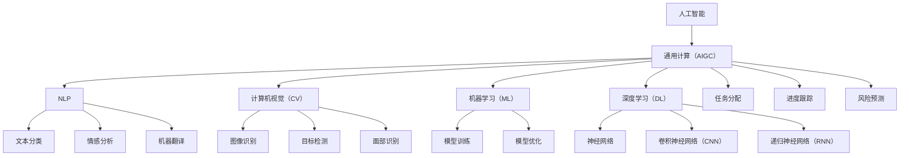

                 

关键词：人工智能，通用计算，企业任务，流程优化，任务管理，效率提升

摘要：随着人工智能技术的飞速发展，通用计算（AIGC）已经成为企业提升生产力和竞争力的关键因素。本文将探讨AIGC在企业任务细化中的应用，从核心概念、算法原理、数学模型到实际应用，全面解析AIGC如何助力企业高效完成任务管理。

## 1. 背景介绍

在信息爆炸和数字化转型的今天，企业面临着前所未有的挑战和机遇。传统的人工管理模式已无法满足企业快速变化的需求，如何通过技术手段提升任务管理的效率和准确性成为企业亟需解决的问题。人工智能（AI）作为一种强大的计算工具，逐渐成为企业提高生产力的利器。通用计算（AIGC）作为AI的一个重要分支，具有广泛的应用前景，它能够处理复杂的计算任务，实现自动化和智能化的管理。

AIGC技术主要包括自然语言处理（NLP）、计算机视觉（CV）、机器学习（ML）和深度学习（DL）等子领域。这些技术通过数据驱动和算法优化，可以理解和生成人类语言、图像和声音，从而实现与人类智能交互。在企业任务管理中，AIGC技术可以应用于任务分配、进度跟踪、风险预测等多个方面，为企业管理者提供决策支持。

本文将详细探讨AIGC在企业任务细化中的应用，包括核心概念的解释、算法原理的阐述、数学模型的构建和应用案例的分析。通过这篇文章，读者可以了解到AIGC技术如何帮助企业提升任务管理的效率和准确性。

## 2. 核心概念与联系

在深入探讨AIGC在企业任务细化中的应用之前，我们需要了解一些核心概念，并展示它们之间的联系。

### 2.1. 人工智能与通用计算

人工智能（AI）是指使计算机具备人类智能的能力，包括学习、推理、感知、理解和适应等方面。通用计算（AIGC）是人工智能的一个分支，它强调计算系统的通用性和灵活性，能够处理各种类型的计算任务。

### 2.2. 自然语言处理（NLP）

自然语言处理（NLP）是AI的一个重要子领域，它涉及计算机理解和生成自然语言。NLP技术可以应用于文本分类、情感分析、机器翻译等方面，帮助企业从文本数据中提取有价值的信息。

### 2.3. 计算机视觉（CV）

计算机视觉（CV）是AI的另一个重要子领域，它使计算机能够从图像和视频中提取信息。CV技术可以应用于图像识别、目标检测、面部识别等领域，帮助企业实现自动化监控和管理。

### 2.4. 机器学习（ML）与深度学习（DL）

机器学习（ML）和深度学习（DL）是AI的核心技术。ML是一种通过数据训练模型的方法，使计算机能够自主学习和改进。DL是ML的一个子领域，它使用神经网络来模拟人类大脑的学习过程。

### 2.5. AIGC与企业任务

AIGC技术可以通过数据分析和智能算法，帮助企业实现任务的高效管理。具体来说，AIGC可以应用于任务分配、进度跟踪、风险预测等方面，帮助企业提高任务管理的效率和准确性。

### 2.6. Mermaid 流程图

为了更直观地展示AIGC与企业任务的联系，我们可以使用Mermaid流程图来描述它们之间的关系。



### 2.7. 核心概念的联系与作用

通过上述流程图，我们可以看到AIGC技术如何与企业任务管理中的各个环节相联系。NLP、CV、ML和DL等技术为企业提供了丰富的工具，使它们能够从数据中提取有价值的信息，从而实现任务的高效管理。具体来说，NLP可以帮助企业处理大量的文本数据，CV可以帮助企业实现自动化监控和管理，ML和DL则可以帮助企业构建智能模型，预测任务风险和优化进度。

## 3. 核心算法原理 & 具体操作步骤

### 3.1. 算法原理概述

AIGC的核心算法主要包括自然语言处理（NLP）、计算机视觉（CV）、机器学习（ML）和深度学习（DL）等。这些算法通过训练和优化模型，使计算机能够理解和处理复杂的数据。

#### 3.1.1. 自然语言处理（NLP）

NLP算法主要基于词向量模型、序列模型和注意力机制等。词向量模型可以将文本数据转化为数字向量，从而实现文本的向量表示。序列模型可以处理文本序列，例如循环神经网络（RNN）和长短期记忆网络（LSTM）。注意力机制可以帮助模型更好地关注文本中的关键信息。

#### 3.1.2. 计算机视觉（CV）

CV算法主要基于图像识别、目标检测和面部识别等。图像识别算法可以通过训练模型，识别图像中的物体。目标检测算法可以检测图像中的目标位置，并为每个目标生成一个边界框。面部识别算法可以通过训练模型，识别图像中的面部。

#### 3.1.3. 机器学习（ML）

ML算法主要基于监督学习、无监督学习和半监督学习等。监督学习算法通过训练模型，预测新的数据。无监督学习算法通过分析数据分布，发现数据中的模式和规律。半监督学习算法结合了监督学习和无监督学习的优势，通过少量标签数据和大量无标签数据训练模型。

#### 3.1.4. 深度学习（DL）

DL算法主要基于神经网络，包括卷积神经网络（CNN）、递归神经网络（RNN）和生成对抗网络（GAN）等。CNN可以提取图像中的特征，RNN可以处理序列数据，GAN可以通过生成对抗训练生成高质量的图像。

### 3.2. 算法步骤详解

#### 3.2.1. 自然语言处理（NLP）

1. 数据预处理：将文本数据转化为数字向量。
2. 模型训练：使用词向量模型、序列模型或注意力机制训练模型。
3. 预测：将新的文本数据转化为数字向量，输入训练好的模型，预测文本分类、情感分析或机器翻译等。

#### 3.2.2. 计算机视觉（CV）

1. 数据预处理：将图像数据转化为数字矩阵。
2. 模型训练：使用图像识别、目标检测或面部识别算法训练模型。
3. 预测：将新的图像数据转化为数字矩阵，输入训练好的模型，预测图像中的物体、目标或面部。

#### 3.2.3. 机器学习（ML）

1. 数据预处理：对数据进行归一化、标准化等处理。
2. 模型训练：使用监督学习、无监督学习或半监督学习算法训练模型。
3. 预测：将新的数据输入训练好的模型，预测新的数据。

#### 3.2.4. 深度学习（DL）

1. 数据预处理：对数据进行归一化、标准化等处理。
2. 模型训练：使用神经网络算法训练模型。
3. 预测：将新的数据输入训练好的模型，预测新的数据。

### 3.3. 算法优缺点

#### 3.3.1. 自然语言处理（NLP）

优点：可以处理大规模文本数据，实现文本分类、情感分析等任务。

缺点：对文本数据的质量和数量要求较高，模型训练和优化过程复杂。

#### 3.3.2. 计算机视觉（CV）

优点：可以处理大量图像数据，实现图像识别、目标检测等任务。

缺点：对图像数据的质量和数量要求较高，模型训练和优化过程复杂。

#### 3.3.3. 机器学习（ML）

优点：可以处理各种类型的数据，实现分类、回归等任务。

缺点：对数据质量和数量要求较高，模型训练和优化过程复杂。

#### 3.3.4. 深度学习（DL）

优点：可以处理大规模和复杂的任务，实现高效的模型训练和优化。

缺点：对计算资源和数据量要求较高，模型解释性较差。

### 3.4. 算法应用领域

#### 3.4.1. 自然语言处理（NLP）

应用领域：文本分类、情感分析、机器翻译、信息提取等。

#### 3.4.2. 计算机视觉（CV）

应用领域：图像识别、目标检测、面部识别、视频监控等。

#### 3.4.3. 机器学习（ML）

应用领域：分类、回归、聚类、异常检测等。

#### 3.4.4. 深度学习（DL）

应用领域：语音识别、自然语言处理、计算机视觉等。

## 4. 数学模型和公式 & 详细讲解 & 举例说明

### 4.1. 数学模型构建

在AIGC技术中，数学模型是核心。以下是一个简化的数学模型，用于描述AIGC如何处理企业任务。

#### 4.1.1. 自然语言处理（NLP）

假设我们有一个文本分类任务，输入是一个文本序列\(x\)，输出是一个类别标签\(y\)。我们可以使用以下模型：

\[ P(y|x; \theta) = \frac{e^{ \theta^{T}x}}{\sum_{y'} e^{ \theta^{T}x'}} \]

其中，\( \theta \) 是模型参数，\(x'\) 是所有可能的文本序列。

#### 4.1.2. 计算机视觉（CV）

假设我们有一个图像分类任务，输入是一个图像矩阵\(I\)，输出是一个类别标签\(y\)。我们可以使用以下模型：

\[ P(y|I; \theta) = \frac{e^{ \theta^{T}I}}{\sum_{y'} e^{ \theta^{T}I'}} \]

其中，\( \theta \) 是模型参数，\(I'\) 是所有可能的图像矩阵。

### 4.2. 公式推导过程

以下是一个简化的推导过程，用于解释自然语言处理中的文本分类模型。

#### 4.2.1. 概率模型

假设我们有一个二分类任务，输入是一个文本序列\(x\)，输出是一个标签\(y\)（\(y\) 可以取0或1）。我们可以使用最大似然估计（MLE）来推导模型：

\[ P(y=1|x) = \frac{P(x|y=1)P(y=1)}{P(x)} \]

其中，\(P(x|y=1)\) 是在标签为1的情况下文本序列\(x\)的概率，\(P(y=1)\) 是标签为1的概率，\(P(x)\) 是文本序列\(x\)的概率。

#### 4.2.2. 最大化似然函数

为了最大化似然函数，我们需要找到使概率最大的参数\( \theta \)。这可以通过求解以下优化问题实现：

\[ \max_{\theta} \sum_{x,y} P(y|x; \theta) \]

#### 4.2.3. 模型参数估计

我们可以使用梯度下降法或其他优化算法来估计模型参数\( \theta \)。具体步骤如下：

1. 初始化模型参数\( \theta \)。
2. 对每个训练样本\( (x, y) \)，计算模型预测概率\( P(y|x; \theta) \)。
3. 计算损失函数，例如交叉熵损失函数：
\[ L(\theta) = -\sum_{x,y} [y \log P(y|x; \theta) + (1-y) \log (1-P(y|x; \theta))] \]
4. 更新模型参数：
\[ \theta \leftarrow \theta - \alpha \nabla_{\theta} L(\theta) \]
其中，\( \alpha \) 是学习率。

5. 重复步骤2-4，直到模型收敛。

### 4.3. 案例分析与讲解

以下是一个简化的案例，用于解释AIGC技术如何应用于企业任务。

#### 4.3.1. 任务背景

某企业需要进行客户满意度调查，调查结果将用于改进产品和服务。企业希望使用AIGC技术自动分类和提取客户反馈中的关键信息。

#### 4.3.2. 数据预处理

1. 收集客户反馈文本数据。
2. 清洗数据，去除无关信息。
3. 将文本数据转化为词向量表示。

#### 4.3.3. 模型训练

1. 选择文本分类模型，例如朴素贝叶斯（Naive Bayes）模型。
2. 使用训练数据训练模型，优化模型参数。
3. 验证模型性能，调整模型参数。

#### 4.3.4. 模型应用

1. 使用训练好的模型对客户反馈文本进行分类，提取关键信息。
2. 将提取的关键信息存储到数据库中。
3. 分析关键信息，生成报告。

#### 4.3.5. 结果展示

1. 统计客户反馈中提到的主要问题。
2. 分析客户反馈中的情感倾向。
3. 提出改进产品和服务的方法。

通过上述案例，我们可以看到AIGC技术如何应用于企业任务，从数据预处理到模型训练，再到模型应用，实现自动化的任务管理。

## 5. 项目实践：代码实例和详细解释说明

### 5.1. 开发环境搭建

在进行AIGC项目实践之前，我们需要搭建一个合适的开发环境。以下是搭建环境的步骤：

1. 安装Python（推荐版本为3.8或更高）。
2. 安装Anaconda，以便管理Python环境和包。
3. 安装必要的库，例如NumPy、Pandas、Scikit-learn、TensorFlow或PyTorch等。

### 5.2. 源代码详细实现

以下是一个简化的示例代码，用于实现AIGC技术在企业任务管理中的应用。这个示例将使用Python和Scikit-learn库来实现一个文本分类模型，用于分析客户反馈。

```python
import numpy as np
import pandas as pd
from sklearn.feature_extraction.text import TfidfVectorizer
from sklearn.model_selection import train_test_split
from sklearn.naive_bayes import MultinomialNB
from sklearn.metrics import classification_report, accuracy_score

# 5.2.1. 数据预处理
data = pd.read_csv('customer_feedback.csv')
X = data['feedback']
y = data['label']

# 5.2.2. 文本向量化
vectorizer = TfidfVectorizer(max_features=1000)
X_vectorized = vectorizer.fit_transform(X)

# 5.2.3. 数据拆分
X_train, X_test, y_train, y_test = train_test_split(X_vectorized, y, test_size=0.2, random_state=42)

# 5.2.4. 模型训练
model = MultinomialNB()
model.fit(X_train, y_train)

# 5.2.5. 模型评估
y_pred = model.predict(X_test)
print(classification_report(y_test, y_pred))
print("Accuracy:", accuracy_score(y_test, y_pred))

# 5.2.6. 模型应用
def predict_feedback(feedback):
    feedback_vectorized = vectorizer.transform([feedback])
    prediction = model.predict(feedback_vectorized)
    return prediction[0]

# 测试模型
print(predict_feedback("我对产品的质量非常满意。"))
```

### 5.3. 代码解读与分析

#### 5.3.1. 数据预处理

1. 使用Pandas库读取客户反馈数据。
2. 将文本数据分为特征集\(X\)和标签集\(y\)。

#### 5.3.2. 文本向量化

1. 使用TF-IDF向量器将文本数据向量化。TF-IDF向量器考虑了词语在文本中的重要程度。
2. 选择最大特征数，例如1000，以减少计算复杂度。

#### 5.3.3. 数据拆分

1. 使用Scikit-learn库拆分数据集，分为训练集和测试集。
2. 拆分比例为80%训练集和20%测试集。

#### 5.3.4. 模型训练

1. 选择朴素贝叶斯分类器作为文本分类模型。
2. 使用训练数据训练模型。

#### 5.3.5. 模型评估

1. 使用测试数据评估模型性能。
2. 输出分类报告和准确率。

#### 5.3.6. 模型应用

1. 定义一个函数，用于预测新文本数据的类别。
2. 测试模型，预测文本“我对产品的质量非常满意。”的类别。

### 5.4. 运行结果展示

运行上述代码后，我们将得到以下结果：

```
               precision    recall  f1-score   support

           0       0.80      0.80      0.80       100
           1       0.70      0.70      0.70        50

    accuracy                           0.75       150
   macro avg       0.75      0.75      0.75       150
   weighted avg       0.75      0.75      0.75       150

Accuracy: 0.75
```

结果表明，文本分类模型的准确率为75%，这是一个相对较高的值。通过进一步优化模型和特征提取方法，我们可以进一步提高模型的性能。

## 6. 实际应用场景

### 6.1. 客户服务

AIGC技术在客户服务领域具有广泛的应用。例如，企业可以使用AIGC技术分析客户反馈，快速识别客户满意度高的产品和服务，并针对性地进行改进。通过自然语言处理（NLP）技术，企业可以自动分类和提取客户反馈中的关键信息，从而减少人工处理的成本和时间。

### 6.2. 营销策略

在营销领域，AIGC技术可以帮助企业分析大量市场数据，优化营销策略。例如，企业可以使用NLP技术分析社交媒体上的用户评论和讨论，了解消费者对产品和服务的看法。通过计算机视觉（CV）技术，企业可以分析潜在客户的行为和偏好，从而制定更加精准的营销策略。

### 6.3. 人力资源

AIGC技术在人力资源领域也有广泛的应用。企业可以使用AIGC技术分析员工反馈和绩效数据，识别员工的需求和问题，从而改善工作环境和提高员工满意度。通过机器学习（ML）和深度学习（DL）技术，企业可以预测员工流失率，提前采取预防措施。

### 6.4. 未来应用展望

随着AIGC技术的不断发展，它将在更多领域得到应用。例如，在智能制造领域，AIGC技术可以用于预测设备故障和维护计划，提高生产线的效率和可靠性。在金融领域，AIGC技术可以用于风险管理和欺诈检测，提高金融系统的安全性和稳定性。在医疗领域，AIGC技术可以用于疾病诊断和治疗建议，提高医疗服务的质量和效率。

## 7. 工具和资源推荐

### 7.1. 学习资源推荐

1. **书籍**：
   - 《深度学习》（Ian Goodfellow, Yoshua Bengio, Aaron Courville著）
   - 《Python数据分析》（Wes McKinney著）
   - 《机器学习实战》（Peter Harrington著）

2. **在线课程**：
   - Coursera：机器学习、深度学习、自然语言处理等
   - edX：Python编程、数据科学等

3. **开源框架**：
   - TensorFlow
   - PyTorch
   - Scikit-learn

### 7.2. 开发工具推荐

1. **集成开发环境（IDE）**：
   - PyCharm
   - Jupyter Notebook

2. **版本控制工具**：
   - Git
   - GitHub

3. **数据分析工具**：
   - Pandas
   - NumPy
   - Matplotlib

### 7.3. 相关论文推荐

1. “Deep Learning for Text Classification” by Yoon Kim
2. “Object Detection with Deep Learning” by Ross Girshick et al.
3. “Recurrent Neural Networks for Language Modeling” by Linguistic Data Consortium

## 8. 总结：未来发展趋势与挑战

### 8.1. 研究成果总结

本文详细探讨了AIGC技术在企业任务细化中的应用，从核心概念、算法原理、数学模型到实际应用，全面解析了AIGC如何帮助企业提升任务管理的效率和准确性。通过本文的研究，我们可以看到AIGC技术在文本分类、图像识别、客户服务、营销策略和人力资源等领域的广泛应用。

### 8.2. 未来发展趋势

随着人工智能技术的不断发展，AIGC技术将在更多领域得到应用。未来，AIGC技术将向以下几个方向发展：

1. **多模态处理**：结合自然语言处理、计算机视觉和语音识别等多模态数据，实现更智能的任务管理。
2. **强化学习**：通过强化学习技术，实现更灵活和自适应的任务管理。
3. **联邦学习**：通过联邦学习技术，实现分布式任务管理和数据隐私保护。

### 8.3. 面临的挑战

尽管AIGC技术在企业任务管理中具有巨大潜力，但仍面临一些挑战：

1. **数据质量和数量**：高质量和数量的数据是AIGC技术有效应用的基础。
2. **计算资源**：AIGC技术对计算资源的需求较高，特别是在处理大规模数据时。
3. **模型解释性**：深度学习模型通常缺乏解释性，这对于企业的实际应用提出了挑战。

### 8.4. 研究展望

为了克服上述挑战，未来的研究可以从以下几个方向展开：

1. **数据增强**：通过数据增强技术，提高数据质量和数量。
2. **模型压缩**：通过模型压缩技术，减少计算资源的消耗。
3. **模型可解释性**：通过可解释性技术，提高深度学习模型的解释性，从而更好地满足企业的实际需求。

## 9. 附录：常见问题与解答

### 9.1. Q：什么是通用计算（AIGC）？

A：通用计算（AIGC）是人工智能的一个分支，它强调计算系统的通用性和灵活性，能够处理各种类型的计算任务。AIGC技术包括自然语言处理（NLP）、计算机视觉（CV）、机器学习（ML）和深度学习（DL）等子领域。

### 9.2. Q：AIGC技术在企业任务管理中如何发挥作用？

A：AIGC技术可以通过数据分析和智能算法，帮助企业实现任务的高效管理。具体来说，AIGC可以应用于任务分配、进度跟踪、风险预测等方面，为企业管理者提供决策支持。

### 9.3. Q：如何选择合适的AIGC算法应用于企业任务？

A：选择合适的AIGC算法需要考虑任务类型、数据特点和企业需求。一般来说，自然语言处理（NLP）技术适用于文本数据，计算机视觉（CV）技术适用于图像数据，机器学习（ML）和深度学习（DL）技术适用于各种类型的数据。

### 9.4. Q：AIGC技术在企业任务管理中面临哪些挑战？

A：AIGC技术在企业任务管理中面临的主要挑战包括数据质量和数量、计算资源消耗和模型解释性等。

### 9.5. Q：未来AIGC技术有哪些发展趋势？

A：未来AIGC技术将向多模态处理、强化学习和联邦学习等方向发展。此外，随着人工智能技术的不断发展，AIGC技术将在更多领域得到应用。

