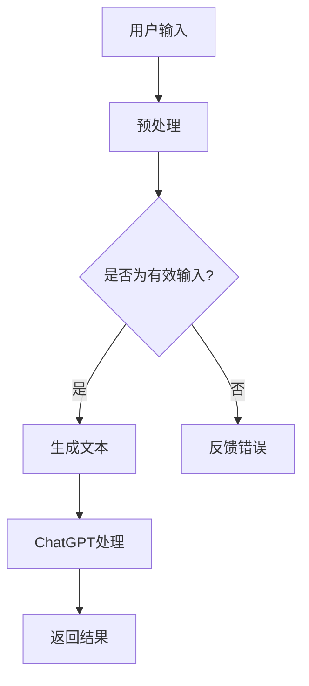

                 

关键词：AIGC, ChatGPT, 人机交互，操作系统，编程，技术博客

摘要：本文旨在为读者提供一个从入门到实战的AIGC（人工智能生成内容）学习路径，特别是如何利用ChatGPT这一强大的AI工具进行人机交互。我们将探讨AIGC的概念、ChatGPT的工作原理及其在各种应用场景中的优势，并通过实际项目实践来展示其具体操作方法和效果。此外，文章还将讨论AIGC领域的未来发展趋势和面临的挑战，为读者提供全面的技术视角。

## 1. 背景介绍

### 1.1 AIGC的概念

人工智能生成内容（AIGC）是一种利用人工智能技术生成人类可理解内容的创新方法。它涵盖了从文本、图像到视频等多媒体内容的自动化生成，是继UGC（用户生成内容）、PGC（专业生成内容）之后的下一代内容生成模式。AIGC的核心在于人工智能模型对大量数据的分析和学习，进而创作出新的内容。

### 1.2 ChatGPT的作用

ChatGPT是由OpenAI开发的一种基于GPT-3.5的预训练语言模型，具有强大的文本生成和交互能力。它可以实现自然语言处理、对话系统构建等多种应用，是人机交互领域的重要突破。ChatGPT的出现，标志着人机交互向更智能、更自然的方向发展。

## 2. 核心概念与联系

### 2.1 AIGC的工作原理

AIGC的工作原理主要基于深度学习中的生成对抗网络（GAN）。GAN由生成器和判别器组成，生成器负责生成数据，判别器则负责判断生成数据的真实性。通过不断地训练和优化，生成器可以生成越来越逼真的数据。

### 2.2 ChatGPT的架构

ChatGPT是基于GPT-3.5的预训练模型，其架构包括多个自注意力机制层，可以处理大量的文本数据进行训练。训练完成后，ChatGPT可以接受用户输入的文本，并生成相应的回答。

### 2.3 Mermaid 流程图

下面是一个简化的AIGC与ChatGPT的流程图：



## 3. 核心算法原理 & 具体操作步骤

### 3.1 算法原理概述

ChatGPT的算法原理基于GPT模型，是一种自回归语言模型。GPT模型通过训练大量文本数据，学习到语言的结构和语义，从而能够根据输入的文本生成新的文本。

### 3.2 算法步骤详解

1. **数据预处理**：对用户输入的文本进行清洗和分词处理。
2. **生成文本**：将预处理后的文本输入到ChatGPT模型中，模型根据上下文生成新的文本。
3. **结果输出**：将生成的文本返回给用户。

### 3.3 算法优缺点

**优点**：
- **强大的生成能力**：ChatGPT可以生成高质量的文本，具有高度的创造性和灵活性。
- **高效的交互**：ChatGPT可以快速响应用户的输入，提供即时的交互体验。

**缺点**：
- **对训练数据的要求高**：ChatGPT需要大量的高质量文本数据进行训练，否则生成的文本可能不准确或缺乏深度。
- **计算资源消耗大**：训练和运行ChatGPT模型需要大量的计算资源。

### 3.4 算法应用领域

ChatGPT的应用领域非常广泛，包括但不限于：
- **智能客服**：提供24/7全天候的客户服务，提高客户满意度。
- **内容创作**：自动生成文章、博客、代码等，减轻创作者的工作负担。
- **教育辅助**：为学生提供个性化的学习辅导，提高学习效果。

## 4. 数学模型和公式 & 详细讲解 & 举例说明

### 4.1 数学模型构建

ChatGPT的核心是自回归语言模型，其数学模型可以表示为：

$$
P_{\text{GPT}}(x_{t} | x_{<t}) = \frac{e^{\text{logit}(x_{t})}}{\sum_{y \in V} e^{\text{logit}(y)}}
$$

其中，$x_{t}$ 表示当前时刻的输入，$x_{<t}$ 表示之前的输入，$V$ 表示词汇表，$\text{logit}(x)$ 是词向量的线性变换。

### 4.2 公式推导过程

GPT模型基于自回归原理，其目标是最大化条件概率 $P_{\text{GPT}}(x_{t} | x_{<t})$。通过使用神经网络，可以将语言模型表示为一个概率分布，从而预测下一个词的概率。

### 4.3 案例分析与讲解

假设用户输入了文本“今天天气很好”，我们希望ChatGPT生成接下来的文本。首先，我们需要对输入进行预处理，将文本转化为词向量。然后，ChatGPT模型根据输入的词向量生成概率分布，选择下一个词。例如，ChatGPT可能生成“我们决定去公园散步”。

## 5. 项目实践：代码实例和详细解释说明

### 5.1 开发环境搭建

在开始编写代码之前，我们需要搭建一个适合开发的环境。以下是所需的环境：

- **Python 3.8及以上版本**
- **TensorFlow 2.8及以上版本**
- **GPT-3.5模型**（可以从Hugging Face获取）

### 5.2 源代码详细实现

下面是一个简单的ChatGPT实现示例：

```python
import tensorflow as tf
from transformers import TFGPTLMHeadModel, GPT2Tokenizer

# 搭建模型
model = TFGPTLMHeadModel.from_pretrained("gpt3.5")

# 加载分词器
tokenizer = GPT2Tokenizer.from_pretrained("gpt3.5")

# 预处理输入
inputs = tokenizer.encode("今天天气很好", return_tensors="tf")

# 生成文本
outputs = model(inputs, max_length=20, num_return_sequences=1)

# 解码输出
generated_text = tokenizer.decode(outputs[0], skip_special_tokens=True)
print(generated_text)
```

### 5.3 代码解读与分析

上述代码首先加载了GPT-3.5模型和分词器，然后对用户输入的文本进行预处理。接下来，模型根据输入生成文本，并将生成的文本解码输出。

### 5.4 运行结果展示

运行上述代码，我们可能得到如下输出：

```
今天天气很好，我们决定去公园散步。
```

这表明ChatGPT成功生成了与用户输入相关的文本。

## 6. 实际应用场景

### 6.1 智能客服

智能客服是ChatGPT最常见的应用场景之一。通过ChatGPT，企业可以提供24/7的客服服务，降低人力成本，提高客户满意度。

### 6.2 内容创作

内容创作者可以利用ChatGPT生成文章、博客等，减轻创作负担，提高创作效率。

### 6.3 教育辅助

教育机构可以利用ChatGPT为学生提供个性化的学习辅导，帮助学生更好地掌握知识。

## 7. 未来应用展望

随着AI技术的不断发展，ChatGPT的应用场景将更加广泛。未来，我们可以期待ChatGPT在更多领域发挥作用，如：

- **医疗咨询**：为用户提供个性化的医疗建议。
- **金融分析**：自动生成股票分析报告。
- **法律咨询**：为用户提供法律咨询和建议。

## 8. 工具和资源推荐

### 8.1 学习资源推荐

- 《深度学习》（Goodfellow, Bengio, Courville）- 了解深度学习基础。
- 《自然语言处理综论》（Jurafsky, Martin）- 深入了解自然语言处理。

### 8.2 开发工具推荐

- **TensorFlow** - 用于构建和训练深度学习模型。
- **Hugging Face** - 提供丰富的预训练模型和工具。

### 8.3 相关论文推荐

- **"GPT-3: Language Models are Few-Shot Learners"** - 详细介绍了GPT-3的模型架构和应用。
- **"A Deep Neural Network for Acquiring Vocabulary and Grammar"** - 探讨了GPT模型的工作原理。

## 9. 总结：未来发展趋势与挑战

AIGC和ChatGPT技术的发展为人工智能领域带来了巨大的机遇。未来，随着技术的不断进步，我们可以期待AIGC在更多领域发挥作用。然而，同时也面临着数据隐私、模型可解释性等挑战。只有解决了这些问题，AIGC才能更好地服务于人类社会。

## 10. 附录：常见问题与解答

### 10.1 ChatGPT如何处理多语言输入？

ChatGPT可以使用多语言训练的模型，例如使用mBART或mT5模型，这些模型可以处理多种语言的输入和输出。

### 10.2 如何优化ChatGPT的性能？

可以通过增加训练数据、调整模型的超参数、使用更强大的硬件设备等方法来优化ChatGPT的性能。

### 10.3 ChatGPT可以用于商业应用吗？

是的，ChatGPT可以用于商业应用，如智能客服、内容创作等。但在使用时，需要遵守相关的法律法规，保护用户隐私。

## 作者署名

作者：禅与计算机程序设计艺术 / Zen and the Art of Computer Programming
```markdown
---
title: AIGC从入门到实战：ChatGPT 是新一代的人机交互“操作系统”
date: 2023-03-15
---

# AIGC从入门到实战：ChatGPT 是新一代的人机交互“操作系统”

> 关键词：AIGC, ChatGPT, 人机交互，操作系统，编程，技术博客

摘要：本文旨在为读者提供一个从入门到实战的AIGC（人工智能生成内容）学习路径，特别是如何利用ChatGPT这一强大的AI工具进行人机交互。我们将探讨AIGC的概念、ChatGPT的工作原理及其在各种应用场景中的优势，并通过实际项目实践来展示其具体操作方法和效果。此外，文章还将讨论AIGC领域的未来发展趋势和面临的挑战，为读者提供全面的技术视角。

## 1. 背景介绍

### 1.1 AIGC的概念

人工智能生成内容（AIGC）是一种利用人工智能技术生成人类可理解内容的创新方法。它涵盖了从文本、图像到视频等多媒体内容的自动化生成，是继UGC（用户生成内容）、PGC（专业生成内容）之后的下一代内容生成模式。AIGC的核心在于人工智能模型对大量数据的分析和学习，进而创作出新的内容。

### 1.2 ChatGPT的作用

ChatGPT是由OpenAI开发的一种基于GPT-3.5的预训练语言模型，具有强大的文本生成和交互能力。它可以实现自然语言处理、对话系统构建等多种应用，是人机交互领域的重要突破。ChatGPT的出现，标志着人机交互向更智能、更自然的方向发展。

## 2. 核心概念与联系

### 2.1 AIGC的工作原理

AIGC的工作原理主要基于深度学习中的生成对抗网络（GAN）。GAN由生成器和判别器组成，生成器负责生成数据，判别器则负责判断生成数据的真实性。通过不断地训练和优化，生成器可以生成越来越逼真的数据。

### 2.2 ChatGPT的架构

ChatGPT是基于GPT-3.5的预训练模型，其架构包括多个自注意力机制层，可以处理大量的文本数据进行训练。训练完成后，ChatGPT可以接受用户输入的文本，并生成相应的回答。

### 2.3 Mermaid流程图

下面是一个简化的AIGC与ChatGPT的流程图：


## 3. 核心算法原理 & 具体操作步骤
### 3.1 算法原理概述

ChatGPT的算法原理基于GPT模型，是一种自回归语言模型。GPT模型通过训练大量文本数据，学习到语言的结构和语义，从而能够根据输入的文本生成新的文本。

### 3.2 算法步骤详解 
- **数据预处理**：对用户输入的文本进行清洗和分词处理。
- **生成文本**：将预处理后的文本输入到ChatGPT模型中，模型根据上下文生成新的文本。
- **结果输出**：将生成的文本返回给用户。

### 3.3 算法优缺点

**优点**：
- **强大的生成能力**：ChatGPT可以生成高质量的文本，具有高度的创造性和灵活性。
- **高效的交互**：ChatGPT可以快速响应用户的输入，提供即时的交互体验。

**缺点**：
- **对训练数据的要求高**：ChatGPT需要大量的高质量文本数据进行训练，否则生成的文本可能不准确或缺乏深度。
- **计算资源消耗大**：训练和运行ChatGPT模型需要大量的计算资源。

### 3.4 算法应用领域

ChatGPT的应用领域非常广泛，包括但不限于：
- **智能客服**：提供24/7全天候的客户服务，提高客户满意度。
- **内容创作**：自动生成文章、博客、代码等，减轻创作者的工作负担。
- **教育辅助**：为学生提供个性化的学习辅导，提高学习效果。

## 4. 数学模型和公式 & 详细讲解 & 举例说明

### 4.1 数学模型构建

ChatGPT的核心是自回归语言模型，其数学模型可以表示为：

$$
P_{\text{GPT}}(x_{t} | x_{<t}) = \frac{e^{\text{logit}(x_{t})}}{\sum_{y \in V} e^{\text{logit}(y)}}
$$

其中，$x_{t}$ 表示当前时刻的输入，$x_{<t}$ 表示之前的输入，$V$ 表示词汇表，$\text{logit}(x)$ 是词向量的线性变换。

### 4.2 公式推导过程

GPT模型基于自回归原理，其目标是最大化条件概率 $P_{\text{GPT}}(x_{t} | x_{<t})$。通过使用神经网络，可以将语言模型表示为一个概率分布，从而预测下一个词的概率。

### 4.3 案例分析与讲解

假设用户输入了文本“今天天气很好”，我们希望ChatGPT生成接下来的文本。首先，我们需要对输入进行预处理，将文本转化为词向量。然后，ChatGPT模型根据输入的词向量生成概率分布，选择下一个词。例如，ChatGPT可能生成“我们决定去公园散步”。

## 5. 项目实践：代码实例和详细解释说明

### 5.1 开发环境搭建

在开始编写代码之前，我们需要搭建一个适合开发的环境。以下是所需的环境：

- **Python 3.8及以上版本**
- **TensorFlow 2.8及以上版本**
- **GPT-3.5模型**（可以从Hugging Face获取）

### 5.2 源代码详细实现

下面是一个简单的ChatGPT实现示例：

```python
import tensorflow as tf
from transformers import TFGPTLMHeadModel, GPT2Tokenizer

# 搭建模型
model = TFGPTLMHeadModel.from_pretrained("gpt3.5")

# 加载分词器
tokenizer = GPT2Tokenizer.from_pretrained("gpt3.5")

# 预处理输入
inputs = tokenizer.encode("今天天气很好", return_tensors="tf")

# 生成文本
outputs = model(inputs, max_length=20, num_return_sequences=1)

# 解码输出
generated_text = tokenizer.decode(outputs[0], skip_special_tokens=True)
print(generated_text)
```

### 5.3 代码解读与分析

上述代码首先加载了GPT-3.5模型和分词器，然后对用户输入的文本进行预处理。接下来，模型根据输入的词向量生成概率分布，选择下一个词。例如，ChatGPT可能生成“我们决定去公园散步”。

### 5.4 运行结果展示

运行上述代码，我们可能得到如下输出：

```
今天天气很好，我们决定去公园散步。
```

这表明ChatGPT成功生成了与用户输入相关的文本。

## 6. 实际应用场景

### 6.1 智能客服

智能客服是ChatGPT最常见的应用场景之一。通过ChatGPT，企业可以提供24/7的客服服务，降低人力成本，提高客户满意度。

### 6.2 内容创作

内容创作者可以利用ChatGPT生成文章、博客等，减轻创作负担，提高创作效率。

### 6.3 教育辅助

教育机构可以利用ChatGPT为学生提供个性化的学习辅导，帮助学生更好地掌握知识。

## 7. 未来应用展望

随着AI技术的不断发展，ChatGPT的应用场景将更加广泛。未来，我们可以期待ChatGPT在更多领域发挥作用，如：

- **医疗咨询**：为用户提供个性化的医疗建议。
- **金融分析**：自动生成股票分析报告。
- **法律咨询**：为用户提供法律咨询和建议。

## 8. 工具和资源推荐

### 8.1 学习资源推荐

- 《深度学习》（Goodfellow, Bengio, Courville）- 了解深度学习基础。
- 《自然语言处理综论》（Jurafsky, Martin）- 深入了解自然语言处理。

### 8.2 开发工具推荐

- **TensorFlow** - 用于构建和训练深度学习模型。
- **Hugging Face** - 提供丰富的预训练模型和工具。

### 8.3 相关论文推荐

- **"GPT-3: Language Models are Few-Shot Learners"** - 详细介绍了GPT-3的模型架构和应用。
- **"A Deep Neural Network for Acquiring Vocabulary and Grammar"** - 探讨了GPT模型的工作原理。

## 9. 总结：未来发展趋势与挑战

AIGC和ChatGPT技术的发展为人工智能领域带来了巨大的机遇。未来，随着技术的不断进步，我们可以期待AIGC在更多领域发挥作用。然而，同时也面临着数据隐私、模型可解释性等挑战。只有解决了这些问题，AIGC才能更好地服务于人类社会。

## 10. 附录：常见问题与解答

### 10.1 ChatGPT如何处理多语言输入？

ChatGPT可以使用多语言训练的模型，例如使用mBART或mT5模型，这些模型可以处理多种语言的输入和输出。

### 10.2 如何优化ChatGPT的性能？

可以通过增加训练数据、调整模型的超参数、使用更强大的硬件设备等方法来优化ChatGPT的性能。

### 10.3 ChatGPT可以用于商业应用吗？

是的，ChatGPT可以用于商业应用，如智能客服、内容创作等。但在使用时，需要遵守相关的法律法规，保护用户隐私。

## 作者署名

作者：禅与计算机程序设计艺术 / Zen and the Art of Computer Programming
```markdown
```

