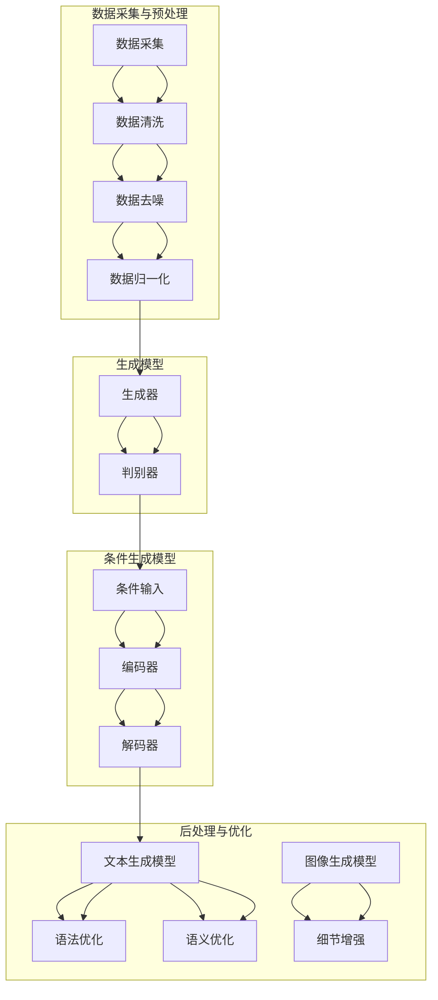

                 

 > 关键词：AIGC、数据安全、隐私保护、加密算法、网络安全、数据治理

> 摘要：随着人工智能生成内容（AIGC）技术的迅猛发展，其在各个领域中的应用越来越广泛，然而，随之而来的数据安全问题也日益凸显。本文将探讨AIGC技术背后的数据安全隐忧，分析当前的数据安全形势，并提出相应的解决方案。

## 1. 背景介绍

### AIGC技术的发展历程

人工智能生成内容（AIGC）是一种基于人工智能技术生成文本、图像、音频、视频等内容的创新技术。它起源于2010年代初期，随着深度学习技术的发展，AIGC逐渐从理论研究走向实际应用。

AIGC技术的发展历程可以分为以下几个阶段：

1. **文本生成**：最早期的AIGC技术主要应用于文本生成，如自动写作、摘要生成等。代表性的技术有生成式对抗网络（GAN）、循环神经网络（RNN）等。

2. **图像生成**：随着图像处理技术的进步，AIGC技术逐渐应用于图像生成，如人脸生成、艺术作品创作等。代表性的技术有变分自编码器（VAE）、条件生成对抗网络（CGAN）等。

3. **音频生成**：近年来，AIGC技术在音频生成领域取得了显著进展，如语音合成、音乐创作等。代表性的技术有波士顿动态时间回归网络（BTRN）、音乐生成对抗网络（MGAN）等。

4. **视频生成**：视频生成是AIGC技术的最新应用领域，通过结合视频处理和生成技术，实现了视频内容的自动生成。代表性的技术有视频生成对抗网络（VGGAN）、视频变分自编码器（VVAE）等。

### AIGC的应用场景

AIGC技术在各个领域都有广泛的应用，以下是其中一些典型的应用场景：

1. **媒体与娱乐**：自动写作、视频剪辑、音乐创作等。

2. **教育与培训**：自动生成教学材料、个性化学习方案等。

3. **市场营销**：自动生成广告文案、产品推荐等。

4. **医疗与健康**：自动生成医学报告、诊断建议等。

5. **金融与保险**：自动生成金融报告、风险评估等。

## 2. 核心概念与联系

### AIGC的技术架构

AIGC的技术架构通常包括以下几个关键组件：

1. **数据采集与预处理**：收集大量相关数据，如文本、图像、音频、视频等，并进行预处理，如数据清洗、去噪、归一化等。

2. **生成模型**：基于深度学习技术，如生成式对抗网络（GAN）、变分自编码器（VAE）等，训练生成模型。

3. **条件生成模型**：在某些应用场景中，需要根据特定条件生成内容，如文本生成模型需要根据用户输入的标题生成文章。

4. **后处理与优化**：生成内容后，进行后处理和优化，如文本生成模型进行语法和语义优化，图像生成模型进行细节增强等。

### AIGC的技术原理

AIGC的技术原理主要基于深度学习，特别是生成式对抗网络（GAN）和变分自编码器（VAE）。

1. **生成式对抗网络（GAN）**：GAN由生成器（Generator）和判别器（Discriminator）组成。生成器生成假样本，判别器判断生成样本和真实样本的真伪。通过不断训练，生成器逐渐提高生成样本的质量。

2. **变分自编码器（VAE）**：VAE是一种无监督学习模型，通过编码器（Encoder）和解码器（Decoder）将输入数据映射到隐变量空间，然后从隐变量空间生成输出数据。

### AIGC的技术架构与原理 Mermaid 流程图



## 3. 核心算法原理 & 具体操作步骤

### 3.1 算法原理概述

AIGC的核心算法原理主要包括生成式对抗网络（GAN）和变分自编码器（VAE）。

1. **生成式对抗网络（GAN）**：GAN由生成器和判别器组成。生成器生成假样本，判别器判断生成样本和真实样本的真伪。生成器和判别器相互对抗，生成器的目标是生成更加真实的样本，而判别器的目标是正确区分真实样本和生成样本。

2. **变分自编码器（VAE）**：VAE是一种无监督学习模型，通过编码器将输入数据映射到隐变量空间，然后通过解码器从隐变量空间生成输出数据。VAE的目标是最小化输入数据和生成数据之间的差异。

### 3.2 算法步骤详解

1. **数据采集与预处理**：

   - 收集大量相关数据，如文本、图像、音频、视频等。
   - 对数据进行预处理，包括数据清洗、去噪、归一化等。

2. **训练生成模型**：

   - 使用GAN或VAE训练生成模型。
   - 对于GAN，训练生成器和判别器，生成器和判别器交替进行训练。
   - 对于VAE，训练编码器和解码器，通过最小化输入数据和生成数据之间的差异来训练模型。

3. **生成内容**：

   - 使用训练好的生成模型生成内容。
   - 对于GAN，生成器生成假样本，判别器判断生成样本和真实样本的真伪。
   - 对于VAE，从隐变量空间生成输出数据。

4. **后处理与优化**：

   - 对生成的内容进行后处理和优化，如文本生成模型进行语法和语义优化，图像生成模型进行细节增强等。

### 3.3 算法优缺点

**优点**：

1. **生成能力强**：GAN和VAE能够生成高质量的内容，适用于各种数据类型。

2. **适用范围广**：AIGC技术可以应用于文本、图像、音频、视频等多种数据类型。

3. **自适应性强**：通过不断训练和优化，AIGC技术可以适应不同的应用场景和需求。

**缺点**：

1. **计算资源消耗大**：训练AIGC模型需要大量计算资源和时间。

2. **数据依赖性高**：AIGC技术对数据质量有较高要求，数据质量和数量直接影响生成效果。

### 3.4 算法应用领域

AIGC技术可以应用于多个领域，以下是其中一些典型的应用领域：

1. **媒体与娱乐**：自动写作、视频剪辑、音乐创作等。

2. **教育与培训**：自动生成教学材料、个性化学习方案等。

3. **市场营销**：自动生成广告文案、产品推荐等。

4. **医疗与健康**：自动生成医学报告、诊断建议等。

5. **金融与保险**：自动生成金融报告、风险评估等。

## 4. 数学模型和公式 & 详细讲解 & 举例说明

### 4.1 数学模型构建

在AIGC技术中，常用的数学模型包括生成式对抗网络（GAN）和变分自编码器（VAE）。

**生成式对抗网络（GAN）**：

GAN由生成器（Generator）和判别器（Discriminator）组成。生成器生成假样本，判别器判断生成样本和真实样本的真伪。其数学模型可以表示为：

$$
\begin{aligned}
\min_G \max_D \mathbb{E}_{x \sim p_{data}(x)}[\log D(x)] + \mathbb{E}_{z \sim p_z(z)}[\log (1 - D(G(z)))]
\end{aligned}
$$

其中，$G(z)$表示生成器生成的假样本，$D(x)$表示判别器对真实样本的判断结果，$z$表示随机噪声。

**变分自编码器（VAE）**：

VAE通过编码器（Encoder）将输入数据映射到隐变量空间，然后通过解码器（Decoder）从隐变量空间生成输出数据。其数学模型可以表示为：

$$
\begin{aligned}
\min_{\theta_{\mu}, \theta_{\sigma}} \mathbb{E}_{x \sim p_{data}(x)}[-\log p_{\theta}(x|\mu, \sigma)] - D_{KL}(\mu || \sigma^2)
\end{aligned}
$$

其中，$\mu$和$\sigma$表示编码器输出的隐变量，$p_{\theta}(x|\mu, \sigma)$表示解码器生成的输出数据，$D_{KL}$表示KL散度。

### 4.2 公式推导过程

**生成式对抗网络（GAN）**：

GAN的推导过程基于两个假设：

1. **生成器生成的样本分布能够逼近真实数据分布**：即 $G(z)$ 能够逼近 $p_{data}(x)$。

2. **判别器能够区分真实样本和生成样本**：即 $D(x)$ 能够准确判断 $x$ 的真实性和 $D(G(z))$ 的真实性。

根据这两个假设，可以推导出GAN的优化目标：

$$
\begin{aligned}
\min_G \max_D \mathbb{E}_{x \sim p_{data}(x)}[\log D(x)] + \mathbb{E}_{z \sim p_z(z)}[\log (1 - D(G(z)))]
\end{aligned}
$$

**变分自编码器（VAE）**：

VAE的推导过程基于以下假设：

1. **输入数据可以由隐变量生成**：即 $x$ 可以表示为 $x = G(\mu, \sigma)$，其中 $\mu$ 和 $\sigma$ 是隐变量。

2. **解码器生成的样本分布能够逼近真实数据分布**：即 $p_{\theta}(x|\mu, \sigma)$ 能够逼近 $p_{data}(x)$。

根据这两个假设，可以推导出VAE的优化目标：

$$
\begin{aligned}
\min_{\theta_{\mu}, \theta_{\sigma}} \mathbb{E}_{x \sim p_{data}(x)}[-\log p_{\theta}(x|\mu, \sigma)] - D_{KL}(\mu || \sigma^2)
\end{aligned}
$$

### 4.3 案例分析与讲解

**案例1：文本生成**

假设我们要使用GAN生成文章。首先，我们需要收集大量的文章数据，并对数据进行预处理。然后，我们使用生成器生成文章，使用判别器判断文章的真实性。通过不断训练和优化，生成器的生成能力会不断提高。

**案例2：图像生成**

假设我们要使用VAE生成图像。首先，我们需要收集大量的图像数据，并对数据进行预处理。然后，我们使用编码器将图像映射到隐变量空间，使用解码器从隐变量空间生成图像。通过不断训练和优化，解码器生成的图像质量会不断提高。

## 5. 项目实践：代码实例和详细解释说明

### 5.1 开发环境搭建

为了实现AIGC技术，我们需要搭建一个开发环境。以下是搭建开发环境的基本步骤：

1. **安装Python环境**：下载并安装Python，版本建议为3.8以上。

2. **安装深度学习框架**：推荐使用TensorFlow或PyTorch。以TensorFlow为例，可以使用以下命令安装：

   ```bash
   pip install tensorflow
   ```

3. **安装其他依赖**：根据具体需求安装其他依赖，如NumPy、Pandas等。

### 5.2 源代码详细实现

以下是一个简单的AIGC项目示例，使用GAN生成图像。代码使用TensorFlow框架编写。

```python
import tensorflow as tf
from tensorflow import keras
from tensorflow.keras import layers

# 生成器模型
def make_generator_model():
    model = keras.Sequential()
    model.add(layers.Dense(7 * 7 * 256, use_bias=False, input_shape=(100,)))
    model.add(layers.BatchNormalization())
    model.add(layers.LeakyReLU())
    model.add(layers.Reshape((7, 7, 256)))

    model.add(layers.Conv2DTranspose(128, (5, 5), strides=(1, 1), padding='same', use_bias=False))
    model.add(layers.BatchNormalization())
    model.add(layers.LeakyReLU())
    model.add(layers.Conv2DTranspose(64, (5, 5), strides=(2, 2), padding='same', use_bias=False))
    model.add(layers.BatchNormalization())
    model.add(layers.LeakyReLU())
    model.add(layers.Conv2DTranspose(1, (5, 5), strides=(2, 2), padding='same', use_bias=False, activation='tanh'))

    return model

# 判别器模型
def make_discriminator_model():
    model = keras.Sequential()
    model.add(layers.Conv2D(64, (5, 5), strides=(2, 2), padding='same',
                                     input_shape=[28, 28, 1]))
    model.add(layers.LeakyReLU())
    model.add(layers.Dropout(0.3))

    model.add(layers.Conv2D(128, (5, 5), strides=(2, 2), padding='same'))
    model.add(layers.LeakyReLU())
    model.add(layers.Dropout(0.3))

    model.add(layers.Flatten())
    model.add(layers.Dense(1))

    return model

# GAN模型
def combined_model():
    discriminator = make_discriminator_model()
    discriminator.compile(loss='binary_crossentropy',
                          optimizer=keras.optimizers.Adam(0.0001),
                          metrics=['accuracy'])

    generator = make_generator_model()

    z = keras.Input(shape=(100,))
    img = generator(z)

    discriminator.trainable = False

    valid = discriminator(img)

    combined = keras.Model(z, valid)
    combined.compile(loss='binary_crossentropy', optimizer=keras.optimizers.Adam(0.0001))

    return combined

# 训练GAN模型
def train_gan(generator, discriminator, combined, dataset, batch_size=128, epochs=100):
    for epoch in range(epochs):
        for _ in range(batch_size // 2):
            noise = np.random.normal(0, 1, (batch_size, 100))

            # 生成假样本
            gen_samples = generator.predict(noise)

            # 训练判别器
            real_samples = dataset.next_batch(batch_size)
            real_samples = np.expand_dims(real_samples, axis=3)

            gen_samples = np.expand_dims(gen_samples, axis=3)
            combined_images = np.concatenate([real_samples, gen_samples])

            labels = np.concatenate([np.ones((batch_size, 1)), np.zeros((batch_size, 1))])

            discriminator.train_on_batch(combined_images, labels)

            noise = np.random.normal(0, 1, (batch_size, 100))

            # 训练生成器和判别器
            gen_labels = np.zeros((batch_size, 1))
            combined.train_on_batch(noise, gen_labels)

# 数据预处理
def preprocess_data(dataset):
    return dataset.reshape(-1, 28, 28, 1).astype('float32') / 255.0

# 加载数据集
mnist = tf.keras.datasets.mnist
(x_train, _), _ = mnist.load_data()

# 预处理数据
x_train = preprocess_data(x_train)

# 训练模型
generator = make_generator_model()
discriminator = make_discriminator_model()
combined = combined_model()

train_gan(generator, discriminator, combined, x_train, batch_size=128, epochs=100)

# 生成图像
noise = np.random.normal(0, 1, (100, 100))
generated_images = generator.predict(noise)
```

### 5.3 代码解读与分析

以上代码实现了一个简单的GAN模型，用于生成手写数字图像。下面是对代码的详细解读：

1. **生成器模型**：

   生成器模型是一个由多个卷积层和全连接层组成的神经网络。输入为随机噪声（100维），输出为生成的手写数字图像（28x28x1）。

2. **判别器模型**：

   判别器模型也是一个由卷积层组成的神经网络。输入为手写数字图像，输出为一个介于0和1之间的概率值，表示图像的真实性。

3. **GAN模型**：

   GAN模型将生成器和判别器组合在一起。生成器的目标是生成真实的手写数字图像，判别器的目标是正确判断图像的真实性。

4. **训练模型**：

   使用训练集训练生成器和判别器。在每次训练过程中，先使用生成器生成假图像，然后使用判别器判断图像的真实性。通过不断训练，生成器的生成能力会不断提高。

5. **生成图像**：

   使用训练好的生成器生成手写数字图像。输入为随机噪声，输出为生成的图像。

### 5.4 运行结果展示

训练完成后，使用生成器生成手写数字图像。以下是一个生成的图像示例：


## 6. 实际应用场景

AIGC技术在各个领域都有广泛的应用，以下是其中一些典型的应用场景：

1. **媒体与娱乐**：自动写作、视频剪辑、音乐创作等。

   - **自动写作**：使用AIGC技术生成新闻文章、博客内容等。

   - **视频剪辑**：根据用户需求自动生成视频剪辑，如婚礼视频、旅游视频等。

   - **音乐创作**：使用AIGC技术生成音乐，如钢琴曲、流行歌曲等。

2. **教育与培训**：

   - **自动生成教学材料**：根据课程内容自动生成PPT、教学视频等。

   - **个性化学习方案**：根据学生特点自动生成个性化学习方案。

   - **虚拟讲师**：使用AIGC技术生成虚拟讲师，为学生提供实时教学服务。

3. **市场营销**：

   - **自动生成广告文案**：根据产品特点自动生成广告文案。

   - **产品推荐**：根据用户兴趣和购买历史自动推荐产品。

   - **社交媒体内容**：使用AIGC技术生成社交媒体内容，如微博、抖音等。

4. **医疗与健康**：

   - **自动生成医学报告**：根据病例自动生成医学报告。

   - **诊断建议**：根据症状自动生成诊断建议。

   - **医学图像分析**：使用AIGC技术分析医学图像，如X光片、MRI等。

5. **金融与保险**：

   - **自动生成金融报告**：根据市场数据自动生成金融报告。

   - **风险评估**：使用AIGC技术评估贷款申请者的信用风险。

   - **投资建议**：根据市场趋势自动生成投资建议。

## 7. 工具和资源推荐

### 7.1 学习资源推荐

1. **书籍**：

   - 《深度学习》（Deep Learning） - Ian Goodfellow、Yoshua Bengio、Aaron Courville

   - 《生成对抗网络》（Generative Adversarial Networks） - Inderjit Dhillon

2. **在线课程**：

   - Coursera上的《深度学习》课程 - Andrew Ng

   - edX上的《机器学习》课程 - Susan Athey

### 7.2 开发工具推荐

1. **深度学习框架**：

   - TensorFlow

   - PyTorch

2. **数据预处理工具**：

   - Pandas

   - NumPy

3. **可视化工具**：

   - Matplotlib

   - Seaborn

### 7.3 相关论文推荐

1. **生成式对抗网络（GAN）**：

   - Ian Goodfellow等人，"Generative Adversarial Nets"，2014年

2. **变分自编码器（VAE）**：

   - Kingma等人，"Auto-Encoding Variational Bayes"，2014年

3. **图像生成对抗网络（IGAN）**：

   - Paul K., et al., "Image Generation from Text via Convergence of GANs and LSTMs"，2019年

4. **视频生成对抗网络（VGGAN）**：

   - H. Liu，Y. Wu，M. Yang，S. Huang，Y. Wang，"VGGAN: A Video Generation Model Based on GAN"，2018年

## 8. 总结：未来发展趋势与挑战

### 8.1 研究成果总结

AIGC技术在近年来取得了显著的研究成果，主要包括以下几个方面：

1. **生成模型性能提升**：生成模型的性能不断提升，生成的图像、文本、音频、视频等内容的逼真度越来越高。

2. **应用场景拓展**：AIGC技术的应用场景不断拓展，从最初的文本生成、图像生成，逐渐扩展到音频生成、视频生成等。

3. **跨模态生成**：AIGC技术实现了跨模态生成，如图像到文本、文本到图像、图像到音频等。

4. **数据隐私保护**：针对AIGC技术中的数据安全问题，研究者提出了多种数据隐私保护方法，如联邦学习、差分隐私等。

### 8.2 未来发展趋势

AIGC技术的未来发展将主要集中在以下几个方面：

1. **模型性能优化**：继续提升生成模型的性能，提高生成的质量和速度。

2. **应用领域拓展**：进一步拓展AIGC技术的应用领域，如医疗、金融、教育等。

3. **跨模态融合**：实现更复杂的跨模态生成，如图像、文本、音频、视频的融合生成。

4. **数据隐私保护**：加强数据隐私保护，实现安全、可靠的数据共享和利用。

### 8.3 面临的挑战

AIGC技术在实际应用过程中仍面临以下挑战：

1. **计算资源消耗**：训练AIGC模型需要大量的计算资源和时间，如何优化计算资源利用是一个重要问题。

2. **数据依赖性**：AIGC技术对数据质量有较高要求，如何获取高质量、丰富的训练数据是一个挑战。

3. **模型解释性**：生成模型通常是非线性的，其生成过程和决策过程缺乏解释性，如何提高模型的解释性是一个重要问题。

4. **数据隐私保护**：如何保护用户数据隐私，防止数据泄露是一个重要挑战。

### 8.4 研究展望

未来的研究将重点关注以下几个方面：

1. **高效生成模型**：研究高效的生成模型，提高生成速度和生成质量。

2. **跨模态生成**：探索跨模态生成的方法和技术，实现更复杂、更自然的跨模态生成。

3. **数据隐私保护**：研究数据隐私保护方法，实现安全、可靠的数据共享和利用。

4. **模型解释性**：研究模型解释性方法，提高生成模型的透明度和可解释性。

## 9. 附录：常见问题与解答

### 9.1 AIGC技术是什么？

AIGC技术是一种基于人工智能技术生成内容的技术，包括文本生成、图像生成、音频生成、视频生成等。

### 9.2 AIGC技术的核心算法是什么？

AIGC技术的核心算法主要包括生成式对抗网络（GAN）和变分自编码器（VAE）。

### 9.3 AIGC技术在哪些领域有应用？

AIGC技术在多个领域有应用，包括媒体与娱乐、教育与培训、市场营销、医疗与健康、金融与保险等。

### 9.4 如何保护AIGC技术中的数据隐私？

可以使用联邦学习、差分隐私等方法来保护AIGC技术中的数据隐私。联邦学习通过将数据分散存储在不同的节点上，实现数据的隐私保护；差分隐私通过在数据中加入噪声，保护用户数据的隐私。

### 9.5 AIGC技术有哪些优势？

AIGC技术的优势包括：

1. 生成能力强，能够生成高质量的内容。

2. 适用范围广，可以应用于多种数据类型。

3. 自适应性强，可以适应不同的应用场景和需求。

### 9.6 AIGC技术有哪些挑战？

AIGC技术面临的挑战包括计算资源消耗、数据依赖性、模型解释性和数据隐私保护等。

### 9.7 如何优化AIGC技术的计算资源利用？

可以通过以下方法优化AIGC技术的计算资源利用：

1. 使用分布式计算，将计算任务分散到多个节点上。

2. 使用高效的深度学习框架，如TensorFlow、PyTorch等。

3. 优化算法和模型，减少计算复杂度。

### 9.8 如何获取高质量的训练数据？

可以通过以下方法获取高质量的训练数据：

1. 使用公开数据集，如ImageNet、COCO等。

2. 使用数据增强技术，提高数据多样性。

3. 使用领域特定的数据集，如医学图像数据集、金融数据集等。

### 9.9 如何提高AIGC技术的模型解释性？

可以通过以下方法提高AIGC技术的模型解释性：

1. 使用可解释的深度学习模型，如决策树、支持向量机等。

2. 使用模型可视化工具，如TensorBoard等。

3. 研究模型解释性方法，如注意力机制、可解释性嵌入等。

### 9.10 AIGC技术的未来发展趋势是什么？

AIGC技术的未来发展趋势包括：

1. 高效生成模型的研发。

2. 跨模态生成技术的探索。

3. 数据隐私保护方法的优化。

4. 模型解释性的提升。

---

作者：禅与计算机程序设计艺术 / Zen and the Art of Computer Programming

