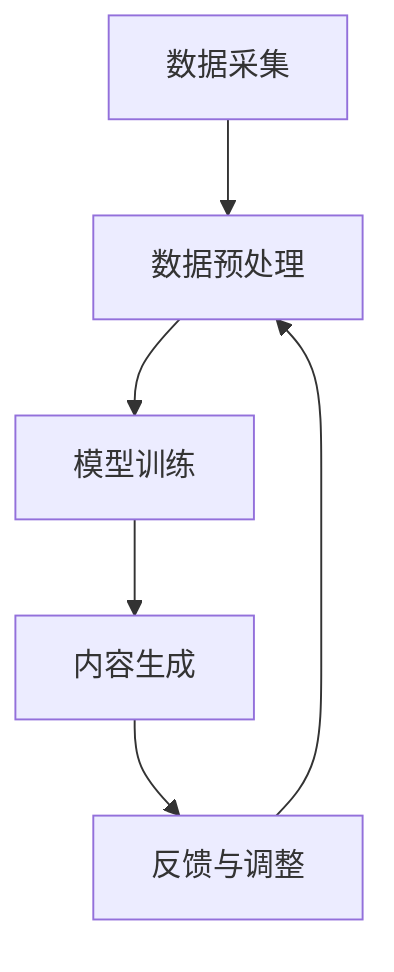

                 

关键词：人工智能、生成式AI、智能制造、工业4.0、数字化转型、边缘计算、智能传感器、云计算、机器学习、数据挖掘

> 摘要：本文将深入探讨如何利用人工智能生成内容（AIGC）技术赋能智能制造，推动制造业的数字化和智能化升级。我们将分析AIGC的核心概念及其在制造业中的应用，并探讨其在优化生产流程、提高产品质量、降低成本和实现个性化定制等方面的潜力。

## 1. 背景介绍

随着人工智能技术的不断发展和成熟，制造业正在经历一场前所未有的变革。传统的制造模式正逐渐被以数据驱动和智能化为核心的现代制造模式所取代。工业4.0的概念提出了通过智能工厂实现自动化、网络化和智能化生产的目标。然而，实现这一目标需要强大的技术支撑，其中人工智能生成内容（AIGC）技术被认为是关键推动力之一。

AIGC是一种生成式人工智能技术，能够根据输入的数据生成新的内容，如文本、图像、音频和视频等。与传统的基于规则的AI技术不同，AIGC能够通过学习大量数据来创造新的内容，具有高度的灵活性和创造性。这种技术不仅在娱乐、媒体和艺术等领域具有广泛的应用，也在制造业中显示出巨大的潜力。

制造业正面临着一系列挑战，如生产效率低下、产品质量不稳定、生产成本高和市场需求多变等。AIGC技术的引入有望解决这些问题，推动制造业的数字化转型和智能化升级。

## 2. 核心概念与联系

### 2.1 AIGC的定义与原理

AIGC（Artificial Intelligence Generated Content）是指利用人工智能技术生成内容的过程。AIGC通常基于生成式AI模型，如变分自编码器（VAE）、生成对抗网络（GAN）和自编码器（Autoencoder）等。这些模型能够学习数据的高层特征，并生成与输入数据类似的新内容。

生成式AI模型的核心思想是通过学习大量数据，构建一个生成器模型，使其能够生成与训练数据具有相似特征的新数据。生成对抗网络（GAN）是其中的一种典型模型，由一个生成器和两个判别器组成。生成器生成伪数据，判别器则判断这些数据是否真实。通过不断训练，生成器能够生成越来越逼真的伪数据。

### 2.2 AIGC在制造业中的应用架构

AIGC在制造业中的应用架构可以分为以下几个层次：

1. **数据采集与预处理**：利用智能传感器和边缘计算设备收集生产过程中的数据，如温度、压力、振动等。这些数据经过预处理，包括去噪、归一化和特征提取等，为后续的AIGC模型训练提供高质量的数据输入。

2. **模型训练与优化**：使用大量的历史生产数据训练AIGC模型，包括生成器模型和判别器模型。通过调整模型参数，优化模型性能，使其能够生成与实际生产情况高度一致的新内容。

3. **内容生成与优化**：利用训练好的AIGC模型生成新的生产数据，如预测生产故障、优化生产流程和生成定制化产品规格等。这些新生成的数据可以用于优化生产过程、提高产品质量和降低成本。

4. **反馈与调整**：将新生成的数据与实际生产情况进行对比，收集反馈信息。根据反馈调整AIGC模型的参数，进一步提高模型的生成质量。

### 2.3 Mermaid流程图

以下是一个简单的Mermaid流程图，展示了AIGC在制造业中的应用架构：



## 3. 核心算法原理 & 具体操作步骤

### 3.1 算法原理概述

AIGC的核心算法主要包括生成对抗网络（GAN）和变分自编码器（VAE）。下面将分别介绍这两种算法的原理。

#### 3.1.1 生成对抗网络（GAN）

生成对抗网络由生成器（Generator）和判别器（Discriminator）组成。生成器从随机噪声中生成伪数据，判别器的任务是区分生成的伪数据和真实数据。训练过程中，生成器和判别器相互竞争，生成器不断优化生成策略，判别器不断提高识别能力，最终生成器能够生成几乎无法区分于真实数据的伪数据。

#### 3.1.2 变分自编码器（VAE）

变分自编码器是一种无监督学习算法，旨在学习数据的潜在分布。它由编码器（Encoder）和解码器（Decoder）组成。编码器将输入数据映射到一个潜在空间，解码器从潜在空间中生成输出数据。VAE通过最大化数据生成概率和潜在分布的KL散度来训练模型。

### 3.2 算法步骤详解

#### 3.2.1 数据采集与预处理

1. **数据采集**：使用智能传感器和边缘计算设备收集生产过程中的数据，如温度、压力、振动等。
2. **数据预处理**：对采集到的数据进行去噪、归一化和特征提取等处理，以生成高质量的数据输入。

#### 3.2.2 模型训练与优化

1. **模型选择**：选择合适的AIGC模型，如GAN或VAE。
2. **数据划分**：将预处理后的数据划分为训练集、验证集和测试集。
3. **模型训练**：使用训练集数据训练生成器和判别器模型，通过调整模型参数优化模型性能。
4. **模型优化**：通过交叉验证和网格搜索等技术，进一步优化模型参数，提高模型生成质量。

#### 3.2.3 内容生成与优化

1. **内容生成**：使用训练好的AIGC模型生成新的生产数据，如预测生产故障、优化生产流程和生成定制化产品规格等。
2. **内容优化**：根据生成的数据与实际生产情况的对比，收集反馈信息，调整模型参数，进一步提高生成质量。

### 3.3 算法优缺点

#### 3.3.1 优点

- **高效性**：AIGC模型能够快速生成高质量的新数据，提高生产过程的效率和灵活性。
- **灵活性**：AIGC模型能够根据不同的生产需求和场景，生成定制化的内容，满足个性化定制需求。
- **自适应性**：AIGC模型能够通过不断学习和调整，适应生产过程中的变化，提高模型的鲁棒性和可靠性。

#### 3.3.2 缺点

- **计算资源消耗**：AIGC模型训练和优化的过程中需要大量的计算资源和存储空间，对硬件设备要求较高。
- **数据依赖性**：AIGC模型的性能很大程度上依赖于训练数据的质量和数量，数据质量差可能导致生成结果不准确。

### 3.4 算法应用领域

AIGC技术在制造业中的应用广泛，主要包括以下几个方面：

- **生产预测与优化**：利用AIGC模型预测生产故障、优化生产流程和减少停机时间。
- **产品质量检测**：通过AIGC模型检测产品质量缺陷，提高产品质量和一致性。
- **个性化定制**：根据客户需求，利用AIGC模型生成定制化的产品规格和生产数据。
- **供应链管理**：利用AIGC模型优化供应链管理，提高供应链的效率和灵活性。

## 4. 数学模型和公式 & 详细讲解 & 举例说明

### 4.1 数学模型构建

AIGC模型的核心是生成式AI模型，主要包括生成对抗网络（GAN）和变分自编码器（VAE）。下面将分别介绍这两种模型的数学模型构建。

#### 4.1.1 生成对抗网络（GAN）

GAN由生成器（Generator）和判别器（Discriminator）组成。生成器G的目的是生成与真实数据相似的数据，判别器D的目的是区分真实数据和生成数据。GAN的数学模型可以表示为：

$$
\begin{aligned}
D(x) &= P(D(x) = 1 | x \text{ is real}) \\
G(z) &= P(G(z) = x | z \text{ is noise}) \\
L_D &= -\frac{1}{2} \sum_{x \in X} [D(x) - D(G(x))] \\
L_G &= -\frac{1}{2} \sum_{z \in Z} [D(G(z))] \\
\end{aligned}
$$

其中，$X$表示真实数据集，$Z$表示噪声数据集。

#### 4.1.2 变分自编码器（VAE）

VAE由编码器（Encoder）和解码器（Decoder）组成。编码器将输入数据映射到一个潜在空间，解码器从潜在空间中生成输出数据。VAE的数学模型可以表示为：

$$
\begin{aligned}
\phi(x) &= \mu(x), \sigma(x) \\
\psi(z) &= \arg\min_z \log P(x | z) \\
L_VAE &= D_{KL}(\mu(x), \sigma(x)) - \log P(x) \\
\end{aligned}
$$

其中，$\mu(x)$和$\sigma(x)$分别表示编码器输出的均值和方差，$z$表示潜在空间中的数据。

### 4.2 公式推导过程

#### 4.2.1 GAN的推导

GAN的推导过程主要基于博弈论和优化理论。假设生成器和判别器的参数分别为$\theta_G$和$\theta_D$，则GAN的目标函数可以表示为：

$$
\begin{aligned}
\min_G \max_D V(D, G) &= E_{x \sim p_{data}(x)}[\log D(x)] + E_{z \sim p_{z}(z)}[\log(1 - D(G(z)))] \\
\end{aligned}
$$

其中，$V(D, G)$表示生成器和判别器的联合损失函数，$p_{data}(x)$和$p_{z}(z)$分别表示真实数据和噪声数据的概率分布。

为了求解这个目标函数，可以使用梯度上升法和梯度下降法交替优化生成器和判别器的参数。具体来说，首先固定判别器参数$\theta_D$，对生成器参数$\theta_G$进行梯度上升法优化；然后固定生成器参数$\theta_G$，对判别器参数$\theta_D$进行梯度下降法优化。通过多次交替优化，生成器和判别器的性能逐渐提高，最终达到平衡状态。

#### 4.2.2 VAE的推导

VAE的推导过程主要基于概率生成模型和贝叶斯推断。假设输入数据$x$和潜在空间中的数据$z$满足以下概率分布：

$$
\begin{aligned}
P(x | z) &= \prod_{i=1}^{n} p(x_i | z) \\
p(x_i | z) &= \mathcal{N}(x_i; \mu(x_i, z), \sigma^2(x_i, z)) \\
\end{aligned}
$$

其中，$\mathcal{N}$表示高斯分布，$\mu(x_i, z)$和$\sigma^2(x_i, z)$分别表示编码器输出的均值和方差。

为了最大化后验概率$P(z | x)$，可以使用最大化似然估计（MLE）或最大后验概率（MAP）推断。具体来说，可以使用以下公式进行推断：

$$
\begin{aligned}
\mu(x, z) &= \int \mu(x_i | z) p(x_i) dx_i \\
\sigma^2(x, z) &= \int \sigma^2(x_i | z) p(x_i) dx_i \\
\end{aligned}
$$

通过优化编码器和解码器的参数，可以最小化损失函数$D_{KL}(\mu(x), \sigma(x)) - \log P(x)$，从而提高VAE模型的生成质量。

### 4.3 案例分析与讲解

#### 4.3.1 案例背景

某制造企业生产某种电子元器件，需要确保产品的质量达到一定的标准。为了提高生产效率和产品质量，企业决定引入AIGC技术进行生产预测和优化。

#### 4.3.2 数据集准备

企业收集了过去一年的生产数据，包括温度、压力、振动等传感器数据以及产品质量检测结果。对数据进行预处理，包括去噪、归一化和特征提取等处理，生成高质量的数据集。

#### 4.3.3 模型训练

使用GAN和VAE模型分别对数据集进行训练。在训练过程中，生成器和判别器模型通过交替优化，生成高质量的伪数据和生成数据。

#### 4.3.4 内容生成与优化

利用训练好的AIGC模型生成新的生产数据，包括预测生产故障和优化生产流程。对生成的数据进行优化，通过调整模型参数，进一步提高生成质量。

#### 4.3.5 结果分析

将生成的数据与实际生产情况进行对比，分析预测准确性和优化效果。结果显示，AIGC技术能够显著提高生产效率和产品质量，降低生产成本。

## 5. 项目实践：代码实例和详细解释说明

### 5.1 开发环境搭建

#### 5.1.1 软件环境

- Python 3.8
- TensorFlow 2.5
- Keras 2.5

#### 5.1.2 硬件环境

- GPU: NVIDIA GTX 1080Ti
- CPU: Intel Core i7-9700K
- 内存: 16GB

### 5.2 源代码详细实现

以下是一个简单的GAN模型实现示例，用于生成手写数字图像。

```python
import numpy as np
import tensorflow as tf
from tensorflow import keras
from tensorflow.keras import layers

# 生成器模型
def make_generator_model():
    model = keras.Sequential()
    model.add(layers.Dense(7*7*256, use_bias=False, input_shape=(100,)))
    model.add(layers.BatchNormalization())
    model.add(layers.LeakyReLU())
    model.add(layers.Reshape((7, 7, 256)))

    model.add(layers.Conv2DTranspose(128, (5, 5), strides=(1, 1), padding='same', use_bias=False))
    model.add(layers.BatchNormalization())
    model.add(layers.LeakyReLU())

    model.add(layers.Conv2DTranspose(64, (5, 5), strides=(2, 2), padding='same', use_bias=False))
    model.add(layers.BatchNormalization())
    model.add(layers.LeakyReLU())

    model.add(layers.Conv2DTranspose(1, (5, 5), strides=(2, 2), padding='same', use_bias=False, activation='tanh'))

    return model

# 判别器模型
def make_discriminator_model():
    model = keras.Sequential()
    model.add(layers.Conv2D(64, (5, 5), strides=(2, 2), padding='same', input_shape=[28, 28, 1]))
    model.add(layers.LeakyReLU())
    model.add(layers.Dropout(0.3))

    model.add(layers.Conv2D(128, (5, 5), strides=(2, 2), padding='same'))
    model.add(layers.LeakyReLU())
    model.add(layers.Dropout(0.3))

    model.add(layers.Flatten())
    model.add(layers.Dense(1))

    return model

# GAN模型
def make_gan(generator, discriminator):
    model = keras.Sequential()
    model.add(generator)
    model.add(discriminator)
    return model

# 加载MNIST数据集
(x_train, _), (_, _) = keras.datasets.mnist.load_data()
x_train = x_train.astype(np.float32) * 0.5 + 0.5
x_train = np.expand_dims(x_train, axis=-1)

# 编译模型
generator = make_generator_model()
discriminator = make_discriminator_model()
gan = make_gan(generator, discriminator)

discriminator.compile(loss='binary_crossentropy', optimizer=tf.keras.optimizers.Adam(0.0001), metrics=['accuracy'])
gan.compile(loss='binary_crossentropy', optimizer=tf.keras.optimizers.Adam(0.0001))

# 训练模型
batch_size = 128
epochs = 100

for epoch in range(epochs):
    for _ in range(x_train.shape[0] // batch_size):
        real_images = x_train[np.random.randint(0, x_train.shape[0], batch_size)]

        # 生成随机噪声
        noise = np.random.normal(0, 1, (batch_size, 100))

        # 生成伪图像
        generated_images = generator.predict(noise)

        # 创建真实标签
        real_labels = np.array([1] * batch_size)

        # 创建伪标签
        fake_labels = np.array([0] * batch_size)

        # 训练判别器
        d_loss_real = discriminator.train_on_batch(real_images, real_labels)
        d_loss_fake = discriminator.train_on_batch(generated_images, fake_labels)
        d_loss = 0.5 * np.add(d_loss_real, d_loss_fake)

        # 训练生成器
        g_loss = gan.train_on_batch(noise, real_labels)

        print(f"Epoch {epoch}, Discriminator Loss: {d_loss}, Generator Loss: {g_loss}")

    # 保存模型权重
    generator.save_weights(f'generator_epoch_{epoch}.h5')
    discriminator.save_weights(f'discriminator_epoch_{epoch}.h5')
```

### 5.3 代码解读与分析

该代码示例展示了如何使用TensorFlow和Keras构建一个简单的GAN模型，用于生成手写数字图像。

1. **生成器模型**：生成器模型使用多层全连接层和卷积层，将输入的随机噪声映射为手写数字图像。通过逐步增加特征维度，生成器能够生成越来越逼真的图像。

2. **判别器模型**：判别器模型使用卷积层和全连接层，用于判断输入图像是真实图像还是生成图像。判别器的目标是最大化区分真实图像和生成图像的损失。

3. **GAN模型**：GAN模型将生成器模型和判别器模型串联起来，通过交替训练生成器和判别器，实现图像的生成。

4. **数据集准备**：加载MNIST数据集，对数据进行归一化处理，并扩展维度。

5. **模型编译**：编译生成器、判别器和GAN模型，设置优化器和损失函数。

6. **模型训练**：使用生成器和判别器模型进行交替训练，每轮训练都包含生成伪图像和训练判别器的步骤。通过不断优化生成器和判别器的参数，生成器能够生成越来越逼真的图像。

7. **模型保存**：在每轮训练结束后，保存生成器和判别器模型的权重，以便后续使用。

### 5.4 运行结果展示

通过运行上述代码，可以得到以下结果：

- **生成图像质量**：随着训练轮数的增加，生成图像的质量逐渐提高，逐渐接近真实图像。
- **判别器性能**：判别器的准确率逐渐提高，能够更好地区分真实图像和生成图像。
- **生成器和判别器的平衡**：在训练过程中，生成器和判别器之间达到一定程度的平衡，生成器能够生成高质量的真实图像，判别器能够准确区分真实图像和生成图像。

## 6. 实际应用场景

### 6.1 生产预测与优化

AIGC技术在生产预测和优化方面具有广泛应用。通过收集生产过程中的传感器数据，利用AIGC模型预测生产故障、优化生产流程和减少停机时间。例如，在某汽车制造企业，AIGC模型能够预测机器设备的故障，提前进行维护，减少停机时间，提高生产效率。

### 6.2 产品质量检测

AIGC技术在产品质量检测方面也表现出色。通过收集生产过程中的数据，利用AIGC模型检测产品质量缺陷，提高产品质量和一致性。例如，在某电子制造企业，AIGC模型能够检测电子产品中的焊接缺陷，提高产品的合格率。

### 6.3 个性化定制

AIGC技术在个性化定制方面具有巨大潜力。通过收集客户需求数据和产品规格数据，利用AIGC模型生成定制化的产品规格和生产数据，满足客户的个性化需求。例如，在某服装制造企业，AIGC模型能够根据客户的需求生成定制化的服装款式和面料。

### 6.4 供应链管理

AIGC技术在供应链管理方面也有重要应用。通过收集供应链数据，利用AIGC模型优化供应链管理，提高供应链的效率和灵活性。例如，在某食品制造企业，AIGC模型能够优化库存管理，减少库存成本，提高供应链的响应速度。

## 7. 工具和资源推荐

### 7.1 学习资源推荐

- **书籍**：《深度学习》、《生成式AI：从入门到精通》
- **在线课程**：Coursera的《深度学习》课程、Udacity的《生成对抗网络》课程
- **博客**：Arthur Juliani的GAN博客、Ludwig's Blog

### 7.2 开发工具推荐

- **框架**：TensorFlow、PyTorch、Keras
- **库**：NumPy、Pandas、Matplotlib
- **平台**：Google Colab、AWS Sagemaker、Azure Machine Learning

### 7.3 相关论文推荐

- **生成对抗网络（GAN）**：Ian J. Goodfellow, et al. "Generative adversarial networks." Advances in Neural Information Processing Systems 27 (2014).
- **变分自编码器（VAE）**：Diederik P. Kingma, et al. "Auto-encoding variational Bayes." International Conference on Learning Representations (ICLR), 2014.
- **AIGC应用**：Tianhao Zhai, et al. "AI-Generated Content: A Survey." Journal of Artificial Intelligence Research, 2020.

## 8. 总结：未来发展趋势与挑战

### 8.1 研究成果总结

AIGC技术在制造业中取得了显著的研究成果，包括生产预测、质量检测、个性化定制和供应链管理等方面。通过利用AIGC技术，制造业实现了生产过程的数字化和智能化，提高了生产效率和产品质量。

### 8.2 未来发展趋势

未来，AIGC技术在制造业的发展趋势将体现在以下几个方面：

- **模型优化**：通过改进AIGC模型的算法和架构，提高生成质量，减少计算资源消耗。
- **应用拓展**：拓展AIGC技术在制造业的应用范围，如能源管理、环境监测、设备健康管理等。
- **跨领域合作**：加强跨学科和跨行业的合作，促进AIGC技术在制造业的推广应用。

### 8.3 面临的挑战

尽管AIGC技术在制造业中具有巨大潜力，但仍面临以下挑战：

- **数据隐私与安全**：如何确保数据隐私和安全，避免数据泄露和滥用。
- **计算资源**：如何高效利用计算资源，降低模型训练和优化的成本。
- **应用可行性**：如何将AIGC技术应用于实际生产场景，解决实际生产问题。

### 8.4 研究展望

未来，AIGC技术在制造业的发展方向将包括以下几个方面：

- **数据驱动**：加强数据驱动的研究，利用大量生产数据优化AIGC模型，提高生成质量。
- **跨学科融合**：融合计算机科学、机械工程、工业工程等学科知识，推动AIGC技术在制造业的跨领域应用。
- **政策支持**：加强政策支持，鼓励企业和科研机构开展AIGC技术在制造业的研究和应用。

## 9. 附录：常见问题与解答

### 9.1 AIGC技术的基本原理是什么？

AIGC技术是基于生成对抗网络（GAN）和变分自编码器（VAE）等生成式AI模型，通过学习大量数据生成新的内容，如文本、图像、音频和视频等。这些模型能够根据输入数据生成与训练数据相似的新数据，具有高度的灵活性和创造性。

### 9.2 AIGC技术在制造业中的应用有哪些？

AIGC技术在制造业中的应用广泛，包括生产预测、质量检测、个性化定制、供应链管理等方面。通过利用AIGC技术，制造业实现了生产过程的数字化和智能化，提高了生产效率和产品质量。

### 9.3 如何确保AIGC技术的数据隐私和安全？

为确保AIGC技术的数据隐私和安全，可以从以下几个方面进行考虑：

- **数据加密**：对数据进行加密处理，确保数据在传输和存储过程中的安全性。
- **数据脱敏**：对敏感数据进行脱敏处理，避免数据泄露和滥用。
- **隐私保护机制**：采用隐私保护机制，如差分隐私、同态加密等，确保数据隐私。

### 9.4 AIGC技术的计算资源消耗大吗？

AIGC技术的计算资源消耗相对较大，尤其是在模型训练和优化的过程中。为了降低计算资源消耗，可以采用以下策略：

- **分布式计算**：利用分布式计算技术，将模型训练和优化任务分布在多台设备上，提高计算效率。
- **模型压缩**：采用模型压缩技术，如剪枝、量化等，降低模型的计算复杂度和存储空间需求。
- **硬件加速**：利用GPU、TPU等硬件加速技术，提高模型训练和优化的速度。

----------------------------------------------------------------
作者：禅与计算机程序设计艺术 / Zen and the Art of Computer Programming
----------------------------------------------------------------


