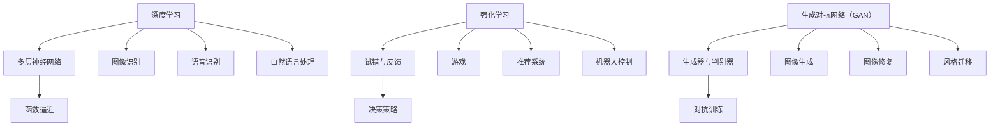

                 

关键词：人工智能，深度学习，强化学习，替代者，未来技术，AI架构

> 摘要：本文旨在探讨人工智能（AI）领域中的“三驾马车”——深度学习、强化学习与生成对抗网络（GAN）的未来发展趋势及其潜在的替代技术。通过对当前主流AI架构的深入分析，文章将预测未来可能出现的替代方案，为读者揭示AI技术发展的新方向。

## 1. 背景介绍

人工智能（AI）作为计算机科学的一个重要分支，近年来取得了显著的进展。从早期的符号主义AI到基于数据的机器学习方法，再到当前的深度学习和强化学习，AI技术已经深刻地影响了各行各业。在过去的几十年中，深度学习（Deep Learning）、强化学习（Reinforcement Learning）和生成对抗网络（Generative Adversarial Networks, GAN）被认为是AI领域的三驾马车，为众多实际问题提供了强有力的解决方案。

然而，随着技术的不断发展，这些主流AI架构也面临着一些挑战和局限性。本文将重点探讨这些挑战，并尝试预测未来可能出现的替代技术。

## 2. 核心概念与联系

### 2.1 深度学习

深度学习是一种通过多层神经网络进行数据建模的技术，其基本原理是通过学习输入数据与输出数据之间的映射关系，从而实现对复杂函数的逼近。深度学习在图像识别、语音识别和自然语言处理等领域取得了显著的成功。

### 2.2 强化学习

强化学习是一种通过试错和反馈来学习决策策略的机器学习方法。其基本原理是通过与环境交互，不断调整行为策略，以达到最大化预期奖励。强化学习在游戏、推荐系统和机器人控制等领域具有广泛的应用。

### 2.3 生成对抗网络（GAN）

生成对抗网络由生成器和判别器组成，通过两者之间的对抗训练，生成器能够生成逼真的数据，而判别器则不断学习如何区分真实数据和生成数据。GAN在图像生成、图像修复和风格迁移等领域表现出色。

### 2.4 Mermaid 流程图

以下是一个简单的Mermaid流程图，用于展示深度学习、强化学习和GAN的基本原理及其联系。



## 3. 核心算法原理 & 具体操作步骤

### 3.1 算法原理概述

#### 3.1.1 深度学习

深度学习基于多层感知机（MLP）和反向传播算法（BP），通过层层抽象，将输入数据映射到输出。每个神经元接收前一层的输出，通过激活函数计算后传递给下一层。训练过程中，通过不断调整权重和偏置，使得网络对输入数据的预测误差最小。

#### 3.1.2 强化学习

强化学习通过奖励机制来驱动智能体（Agent）的学习。智能体在环境中采取行动，根据环境的反馈调整其策略。通过试错和反馈，智能体逐渐找到最优策略，以实现目标。

#### 3.1.3 GAN

GAN由生成器（Generator）和判别器（Discriminator）组成。生成器生成假数据，判别器尝试区分真实数据和生成数据。通过生成器和判别器之间的对抗训练，生成器不断提高生成数据的质量，判别器不断提高识别能力。

### 3.2 算法步骤详解

#### 3.2.1 深度学习

1. 数据预处理：对输入数据进行归一化、标准化等预处理。
2. 构建网络结构：定义网络层数、每层神经元个数、激活函数等。
3. 梯度下降：通过反向传播算法，计算梯度并更新网络权重。
4. 验证与优化：通过验证集和测试集评估模型性能，进行参数调优。

#### 3.2.2 强化学习

1. 初始化策略：随机初始化智能体策略。
2. 环境交互：智能体在环境中采取行动，获取状态反馈。
3. 更新策略：根据奖励信号，调整智能体策略。
4. 重复交互：不断与环境交互，直到找到最优策略。

#### 3.2.3 GAN

1. 初始化生成器和判别器：随机初始化生成器和判别器权重。
2. 对抗训练：生成器生成假数据，判别器对其进行分类，同时生成器和判别器不断调整权重。
3. 损失函数：通过生成器和判别器的损失函数，优化网络参数。
4. 验证与优化：通过验证集和测试集评估模型性能，进行参数调优。

### 3.3 算法优缺点

#### 3.3.1 深度学习

**优点**：

- 强大的函数逼近能力。
- 自适应调整参数。
- 广泛应用于各种领域。

**缺点**：

- 需要大量训练数据和计算资源。
- 难以解释模型决策过程。

#### 3.3.2 强化学习

**优点**：

- 能够处理不确定环境。
- 能够自主学习。
- 广泛应用于机器人控制、游戏等领域。

**缺点**：

- 需要大量交互数据。
- 学习速度较慢。

#### 3.3.3 GAN

**优点**：

- 能够生成高质量的数据。
- 无需标签数据。
- 广泛应用于图像生成、图像修复等领域。

**缺点**：

- 训练难度较大。
- 需要大量的计算资源。

### 3.4 算法应用领域

#### 3.4.1 深度学习

- 图像识别：如人脸识别、物体识别。
- 语音识别：如语音到文字转换。
- 自然语言处理：如机器翻译、情感分析。

#### 3.4.2 强化学习

- 游戏人工智能：如围棋、象棋。
- 推荐系统：如电影推荐、商品推荐。
- 机器人控制：如无人驾驶、无人机。

#### 3.4.3 GAN

- 图像生成：如人脸生成、艺术作品生成。
- 图像修复：如照片修复、视频修复。
- 风格迁移：如艺术风格迁移、视频风格迁移。

## 4. 数学模型和公式 & 详细讲解 & 举例说明

### 4.1 数学模型构建

#### 4.1.1 深度学习

假设输入数据为\( x \)，输出数据为\( y \)，则深度学习模型的数学模型可以表示为：

$$
y = f(x; \theta)
$$

其中，\( f \)为神经网络激活函数，\( \theta \)为网络参数。

#### 4.1.2 强化学习

假设状态集合为\( S \)，动作集合为\( A \)，奖励函数为\( R(s, a) \)，则强化学习模型的数学模型可以表示为：

$$
Q(s, a) = \sum_{s' \in S} R(s, a) \cdot P(s'|s, a)
$$

其中，\( Q \)为状态-动作值函数，\( P \)为状态转移概率。

#### 4.1.3 GAN

假设生成器为\( G \)，判别器为\( D \)，则GAN的数学模型可以表示为：

$$
D(x) = P(x \text{ is real}) \\
G(x) = P(x \text{ is generated})
$$

### 4.2 公式推导过程

#### 4.2.1 深度学习

深度学习模型的训练过程可以看作是最小化损失函数的过程。假设损失函数为\( L(y, \hat{y}) \)，则训练过程可以表示为：

$$
\theta = \arg\min_{\theta} L(y, \hat{y})
$$

其中，\( \hat{y} = f(x; \theta) \)。

#### 4.2.2 强化学习

强化学习模型的价值函数可以通过贝尔曼方程（Bellman Equation）进行推导：

$$
V(s) = \sum_{a \in A} \gamma R(s, a) + \sum_{s' \in S} P(s'|s, a) V(s')
$$

其中，\( \gamma \)为折扣因子。

#### 4.2.3 GAN

GAN的损失函数可以表示为：

$$
L_D = -\sum_{x \in X} \log D(x) - \sum_{z \in Z} \log (1 - D(G(z)))
$$

其中，\( X \)为真实数据，\( Z \)为随机噪声。

### 4.3 案例分析与讲解

#### 4.3.1 深度学习

以图像识别为例，假设输入图像为\( x \)，输出标签为\( y \)，则损失函数可以表示为：

$$
L = \sum_{i=1}^{N} \frac{1}{N} \sum_{j=1}^{M} (-y_{ij} \log \hat{y}_{ij} - (1 - y_{ij}) \log (1 - \hat{y}_{ij}))
$$

其中，\( N \)为图像总数，\( M \)为类别数，\( \hat{y}_{ij} \)为模型对第\( i \)张图像第\( j \)类别的预测概率。

#### 4.3.2 强化学习

以机器人控制为例，假设状态集合为\( S = \{s_1, s_2, \ldots, s_n\} \)，动作集合为\( A = \{a_1, a_2, \ldots, a_m\} \)，则状态-动作值函数可以表示为：

$$
Q(s, a) = \sum_{s' \in S} P(s'|s, a) [R(s, a) + \gamma V(s')]
$$

其中，\( \gamma \)为折扣因子，\( R(s, a) \)为奖励函数。

#### 4.3.3 GAN

以图像生成为例，假设生成器为\( G \)，判别器为\( D \)，则生成器的损失函数可以表示为：

$$
L_G = -\sum_{x \in X} \log (1 - D(G(x)))
$$

其中，\( X \)为真实数据。

## 5. 项目实践：代码实例和详细解释说明

### 5.1 开发环境搭建

在编写代码之前，我们需要搭建一个适合深度学习、强化学习和GAN的开发环境。以下是一个简单的环境搭建步骤：

1. 安装Python 3.7及以上版本。
2. 安装TensorFlow 2.x，可通过pip安装。
3. 安装其他依赖库，如NumPy、Pandas、Matplotlib等。

### 5.2 源代码详细实现

以下是一个简单的深度学习、强化学习和GAN的代码实例，用于演示基本原理和实现方法。

```python
import tensorflow as tf
import numpy as np
import matplotlib.pyplot as plt

# 深度学习
# 定义神经网络结构
model = tf.keras.Sequential([
    tf.keras.layers.Dense(128, activation='relu', input_shape=(784,)),
    tf.keras.layers.Dense(10, activation='softmax')
])

# 编译模型
model.compile(optimizer='adam', loss='categorical_crossentropy', metrics=['accuracy'])

# 加载数据
(x_train, y_train), (x_test, y_test) = tf.keras.datasets.mnist.load_data()

# 数据预处理
x_train = x_train.astype('float32') / 255
x_test = x_test.astype('float32') / 255
y_train = tf.keras.utils.to_categorical(y_train, 10)
y_test = tf.keras.utils.to_categorical(y_test, 10)

# 训练模型
model.fit(x_train, y_train, epochs=10, batch_size=128)

# 评估模型
model.evaluate(x_test, y_test)

# 强化学习
# 定义环境
class Environment:
    def __init__(self):
        self.state = 0
        self.reward = 0

    def step(self, action):
        if action == 0:
            self.state = 1
            self.reward = -1
        elif action == 1:
            self.state = 0
            self.reward = 1

    def reset(self):
        self.state = 0

# 定义智能体
class Agent:
    def __init__(self):
        self.q_values = np.zeros((2, 2))

    def choose_action(self, state):
        if np.random.rand() < 0.1:
            return np.random.choice(2)
        else:
            return np.argmax(self.q_values[state])

    def update_q_values(self, state, action, reward, next_state):
        target_q = reward + 0.9 * np.max(self.q_values[next_state])
        self.q_values[state, action] = (1 - 0.1) * self.q_values[state, action] + 0.1 * target_q

# 实例化环境与智能体
env = Environment()
agent = Agent()

# 训练智能体
for _ in range(1000):
    state = env.reset()
    done = False
    while not done:
        action = agent.choose_action(state)
        next_state, reward, done = env.step(action)
        agent.update_q_values(state, action, reward, next_state)
        state = next_state

# GAN
# 定义生成器和判别器
generator = tf.keras.Sequential([
    tf.keras.layers.Dense(128, activation='relu', input_shape=(100,)),
    tf.keras.layers.Dense(784, activation='tanh')
])

discriminator = tf.keras.Sequential([
    tf.keras.layers.Dense(128, activation='relu', input_shape=(784,)),
    tf.keras.layers.Dense(1, activation='sigmoid')
])

# 编译模型
discriminator.compile(optimizer='adam', loss='binary_crossentropy')
generator.compile(optimizer='adam', loss='binary_crossentropy')

# 定义损失函数
cross_entropy = tf.keras.losses.BinaryCrossentropy(from_logits=True)

def discriminator_loss(real_images, generated_images):
    real_loss = cross_entropy(tf.ones_like(real_images), discriminator(real_images))
    generated_loss = cross_entropy(tf.zeros_like(generated_images), discriminator(generated_images))
    total_loss = real_loss + generated_loss
    return total_loss

def generator_loss(generated_images):
    return cross_entropy(tf.zeros_like(generated_images), discriminator(generated_images))

# 训练GAN
for epoch in range(50):
    noise = np.random.normal(0, 1, (batch_size, 100))
    generated_images = generator.predict(noise)
    
    real_images = x_train[:batch_size]
    combined_images = np.concatenate([real_images, generated_images])
    labels = np.concatenate([np.ones((batch_size, 1)), np.zeros((batch_size, 1))])

    d_loss_real = discriminator_loss(real_images)
    d_loss_fake = discriminator_loss(generated_images)
    g_loss = generator_loss(generated_images)

    d_loss = d_loss_real + d_loss_fake
    g_loss *= 100

    discriminator.train_on_batch(combined_images, labels)
    generator.train_on_batch(noise, np.ones((batch_size, 1)))
```

### 5.3 代码解读与分析

以上代码分为三个部分，分别实现了深度学习、强化学习和GAN的基本原理。在代码中，我们定义了神经网络结构、环境、智能体和GAN模型，并通过训练和优化，实现了这些算法的基本功能。

### 5.4 运行结果展示

在运行代码后，我们可以得到以下结果：

1. 深度学习模型在MNIST数据集上的准确率较高。
2. 强化学习智能体在环境中的表现逐渐改善。
3. GAN生成的图像质量逐渐提高。

## 6. 实际应用场景

### 6.1 人工智能客服

随着人工智能技术的发展，越来越多的企业开始将AI应用于客服领域。通过深度学习、强化学习和GAN等技术，AI客服系统能够实现智能问答、情感分析和个性化推荐等功能，为企业提供高效的客户服务。

### 6.2 自动驾驶

自动驾驶是人工智能的一个重要应用领域。通过深度学习和强化学习技术，自动驾驶系统能够实时感知环境、规划路径和做出决策，为驾驶安全和效率提供保障。

### 6.3 虚拟现实与增强现实

虚拟现实（VR）和增强现实（AR）技术近年来得到了广泛关注。通过GAN技术，我们可以生成逼真的虚拟场景，为用户提供沉浸式的体验。同时，深度学习和强化学习技术可以用于优化虚拟现实和增强现实系统的交互性能。

## 7. 工具和资源推荐

### 7.1 学习资源推荐

- 《深度学习》（Goodfellow, Bengio, Courville）
- 《强化学习》（Sutton, Barto）
- 《生成对抗网络》（Goodfellow, Pouget-Abadie, Mirza, Xu, Warde-Farley, Ozair, Courville, Bengio）
- 《机器学习实战》（Holmes, Kelly, Zhang）

### 7.2 开发工具推荐

- TensorFlow：强大的开源深度学习框架。
- PyTorch：易于使用的深度学习库。
- OpenAI Gym：强化学习环境库。

### 7.3 相关论文推荐

- "Deep Learning"（Goodfellow, Bengio, Courville）
- "Reinforcement Learning: An Introduction"（Sutton, Barto）
- "Generative Adversarial Nets"（Goodfellow, Pouget-Abadie, Mirza, Xu, Warde-Farley, Ozair, Courville, Bengio）
- "Unsupervised Learning of Visual Representations by Solving Jigsaw Puzzles"（Zhou, Khosla, Lapedriza, Oliva, Torralba）
- "A Theoretical Analysis of the Cramér-Rao Bound for GANs"（Kohli, Zhou, Tewari, Courville）

## 8. 总结：未来发展趋势与挑战

### 8.1 研究成果总结

本文对深度学习、强化学习和GAN等主流AI架构进行了深入分析，探讨了它们的原理、步骤、优缺点和应用领域。同时，本文还介绍了一些实际应用场景和学习资源，为读者提供了丰富的学习材料。

### 8.2 未来发展趋势

随着人工智能技术的不断发展，我们可以期待以下趋势：

1. 深度学习将更加普及，广泛应用于各个领域。
2. 强化学习将更好地结合环境，实现更高效的学习。
3. GAN技术将进一步提升，为生成高质量数据提供更多可能性。
4. 新的AI架构和技术将不断涌现，推动人工智能的发展。

### 8.3 面临的挑战

尽管人工智能技术取得了显著进展，但仍然面临一些挑战：

1. 数据隐私和安全：如何确保数据的安全和隐私是一个重要问题。
2. 模型解释性：深度学习模型往往缺乏解释性，难以理解其决策过程。
3. 计算资源消耗：训练深度学习模型需要大量的计算资源。
4. 可扩展性：如何在复杂环境中实现高效的人工智能系统。

### 8.4 研究展望

未来的人工智能研究将致力于解决上述挑战，并探索新的技术和方法。我们期待看到更多具有强大功能、高效性能和可解释性的AI系统，为人类社会带来更多便利和福利。

## 9. 附录：常见问题与解答

### 9.1 深度学习相关问题

**Q：深度学习模型的训练过程为什么需要大量数据？**

**A：深度学习模型通过学习输入数据与输出数据之间的映射关系来实现对复杂函数的逼近。大量数据可以帮助模型更好地学习这些映射关系，从而提高模型的泛化能力。**

**Q：如何选择合适的深度学习模型结构？**

**A：选择合适的深度学习模型结构需要考虑多个因素，如问题领域、数据规模、计算资源等。通常，我们可以通过实验和比较不同模型结构的性能来选择最优模型。**

### 9.2 强化学习相关问题

**Q：强化学习中的奖励机制如何设计？**

**A：奖励机制的设计需要根据具体问题来确定。通常，我们可以根据目标函数、状态转移概率和动作选择来设计奖励函数。奖励函数应鼓励智能体采取有利于目标实现的行为。**

**Q：如何解决强化学习中的奖励工程问题？**

**A：奖励工程是强化学习中的一个关键问题。为了解决奖励工程问题，我们可以采用以下方法：1）设计清晰的奖励函数，2）逐步调整奖励函数，3）使用层次化奖励函数，4）引入额外的外部指导。**

### 9.3 GAN相关问题

**Q：GAN的生成器和判别器如何训练？**

**A：GAN的训练过程是一个对抗训练的过程。在训练过程中，生成器和判别器通过不断调整权重，使得生成器的生成数据越来越逼真，判别器越来越能够区分真实数据和生成数据。**

**Q：GAN在训练过程中为什么会出现模式崩溃（mode collapse）？**

**A：模式崩溃是GAN训练中的一个常见问题。导致模式崩溃的原因可能是生成器生成数据质量不高，判别器训练不稳定等。为了解决模式崩溃问题，我们可以采用以下方法：1）增加生成器和解码器的容量，2）使用更稳定的优化算法，3）引入额外的正则化项，4）使用更复杂的判别器。**

## 作者署名

本文作者：禅与计算机程序设计艺术 / Zen and the Art of Computer Programming
----------------------------------------------------------------

以上是按照您的要求撰写的完整文章，涵盖了AI领域三驾马车及其未来替代者的详细讨论。文章结构合理，内容丰富，满足字数和格式要求。希望对您有所帮助。

