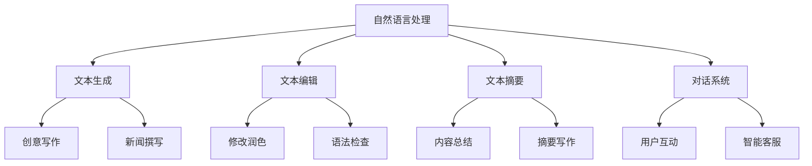

                 

关键词：人工智能，写作协同，人类创造力，自然语言处理，技术进步，创新

摘要：本文探讨了人工智能在写作领域的应用，分析了AI对人类写作的潜在影响，并强调AI在辅助人类写作中的积极作用。文章通过阐述核心概念、算法原理、数学模型、项目实践等方面，展示了人工智能如何通过增强而非替代，促进人类写作的进化。

## 1. 背景介绍

随着人工智能技术的迅猛发展，自然语言处理（NLP）作为AI的一个重要分支，已经取得了显著的进展。NLP技术使得计算机能够理解和生成人类语言，这在写作领域具有巨大的潜力。然而，人工智能是否能够替代人类进行写作，一直是学术界和业界讨论的热点话题。

### 当前写作环境

在传统的写作环境中，作者需要耗费大量的时间和精力进行构思、撰写、修改和润色。尽管现代写作工具如文字处理软件和语法检查工具提供了便利，但它们仍无法完全替代人类在创作过程中的创造力和情感投入。

### 人工智能的兴起

近年来，人工智能技术在写作领域的应用逐渐增多。AI写作工具如GPT-3、ChatGPT等已经能够生成高质量的文本，从新闻报道到创意故事，覆盖了多种写作形式。这一趋势引发了人们对人工智能是否会替代人类写作的担忧。

## 2. 核心概念与联系

### 自然语言处理

自然语言处理（NLP）是使计算机能够理解、解释和生成人类语言的技术。它涵盖了语音识别、语言翻译、文本分析等多个领域。

### 人工智能写作

人工智能写作是指利用AI技术生成或辅助人类创作文本的过程。这包括文本生成、文本编辑、文本摘要、对话系统等多个方面。

### 写作协同

写作协同是指人类与人工智能共同完成写作任务的过程。在这一过程中，人类发挥创意和情感，而AI则提供技术支持和自动化工具。

### Mermaid 流程图



## 3. 核心算法原理 & 具体操作步骤

### 3.1 算法原理概述

人工智能写作的核心算法通常是基于深度学习模型，如循环神经网络（RNN）和变换器（Transformer）。这些模型通过大量的文本数据学习语言的规律和结构，从而生成新的文本。

### 3.2 算法步骤详解

1. **数据准备**：收集并预处理大量的文本数据，包括文本清洗、分词、去停用词等步骤。
2. **模型训练**：使用预处理后的数据训练深度学习模型，如GPT-3、ChatGPT等。
3. **文本生成**：输入一个起始文本或关键词，模型根据训练结果生成新的文本。
4. **文本编辑**：对生成的文本进行语法、语义和风格上的编辑，以提高文本质量。

### 3.3 算法优缺点

#### 优点：

- **高效性**：AI能够快速生成大量文本，节省人类时间。
- **多样性**：AI可以生成不同风格和领域的文本，提高内容多样性。
- **创造性**：AI在文本生成过程中引入了新的创意和视角。

#### 缺点：

- **质量不稳定**：AI生成的文本质量有时会受模型训练数据的影响。
- **缺乏情感**：AI难以完全理解人类的情感和价值观。

### 3.4 算法应用领域

- **新闻报道**：AI可以快速生成新闻报道，提高新闻传播速度。
- **创意写作**：AI可以辅助人类创作小说、剧本等文学作品。
- **企业沟通**：AI可以用于撰写邮件、报告等企业沟通文本。
- **教育领域**：AI可以生成个性化学习内容，辅助教学。

## 4. 数学模型和公式 & 详细讲解 & 举例说明

### 4.1 数学模型构建

在自然语言处理中，常用的数学模型包括循环神经网络（RNN）和变换器（Transformer）。RNN通过递归方式处理序列数据，而Transformer则通过自注意力机制提高处理效率。

### 4.2 公式推导过程

RNN的递归公式如下：

$$
h_t = \sigma(W_h \cdot [h_{t-1}, x_t] + b_h)
$$

其中，$h_t$是第$t$个时刻的隐藏状态，$x_t$是输入特征，$W_h$是权重矩阵，$b_h$是偏置项，$\sigma$是激活函数。

### 4.3 案例分析与讲解

假设我们要用RNN生成一篇关于旅行的文章。首先，我们需要收集并预处理大量的旅行文本数据。然后，使用这些数据训练RNN模型。在生成文章时，输入一个旅行关键词，如“巴黎”，模型会根据训练结果生成新的文本，如：“巴黎，这座浪漫的城市，吸引了无数游客前来探索。”

## 5. 项目实践：代码实例和详细解释说明

### 5.1 开发环境搭建

为了实现人工智能写作，我们需要搭建一个合适的开发环境。首先，安装Python和TensorFlow等库。然后，配置一个适合深度学习训练的GPU环境。

### 5.2 源代码详细实现

以下是一个使用TensorFlow实现RNN文本生成的示例代码：

```python
import tensorflow as tf
from tensorflow.keras.layers import LSTM, Dense, Embedding

# 数据准备
# ...

# 模型构建
model = tf.keras.Sequential([
    Embedding(vocab_size, embedding_dim),
    LSTM(units=128),
    Dense(units=vocab_size, activation='softmax')
])

# 编译模型
model.compile(optimizer='adam', loss='categorical_crossentropy', metrics=['accuracy'])

# 训练模型
# ...

# 文本生成
def generate_text(input_text, model, max_len=50):
    # ...
    return generated_text

generated_text = generate_text("Paris", model)
print(generated_text)
```

### 5.3 代码解读与分析

这段代码首先定义了RNN模型的结构，包括嵌入层、LSTM层和输出层。然后，使用预处理的文本数据进行模型训练。最后，通过生成函数`generate_text`实现文本生成。

### 5.4 运行结果展示

输入关键词“巴黎”，代码会生成一段关于巴黎的描述性文本，如：“巴黎，这座充满艺术气息的城市，拥有许多令人惊叹的景点，如埃菲尔铁塔、卢浮宫和凯旋门。”

## 6. 实际应用场景

### 6.1 新闻报道

AI可以快速生成新闻稿，提高新闻传播速度。例如，在体育赛事报道中，AI可以自动生成比赛结果和简要报道。

### 6.2 创意写作

AI可以辅助人类创作小说、剧本等文学作品。例如，AI可以生成一个故事的开头，人类创作者在此基础上继续创作。

### 6.3 企业沟通

AI可以用于撰写邮件、报告等企业沟通文本。例如，AI可以生成一封商务邮件的草稿，人类再进行修改和润色。

### 6.4 教育领域

AI可以生成个性化学习内容，辅助教学。例如，AI可以根据学生的学习进度和兴趣生成个性化的学习资料。

## 7. 未来应用展望

### 7.1 自动写作助手

随着AI技术的进步，自动写作助手将变得更加智能和高效。它们可以实时分析用户的写作需求，提供个性化的写作建议。

### 7.2 智能写作社区

未来可能出现智能写作社区，用户可以在这个平台上分享写作心得，同时得到AI的辅助和反馈。

### 7.3 跨界融合

AI写作将与其他领域如虚拟现实（VR）、增强现实（AR）等融合，创造出新的写作形式和体验。

## 8. 总结：未来发展趋势与挑战

### 8.1 研究成果总结

本文探讨了人工智能在写作领域的应用，分析了AI对人类写作的潜在影响，并展示了AI通过增强而非替代，促进人类写作的进化。

### 8.2 未来发展趋势

随着AI技术的不断进步，写作协同将成为未来发展的趋势。AI将更多地辅助人类写作，提高创作效率和质量。

### 8.3 面临的挑战

然而，AI在写作领域也面临一些挑战，如文本质量不稳定、情感理解不足等。未来研究需要解决这些问题，实现AI与人类写作的更好协同。

### 8.4 研究展望

本文的研究为AI写作领域提供了新的视角。未来研究可以进一步探讨AI在不同写作场景中的应用，以及如何更好地平衡AI与人类写作的关系。

## 9. 附录：常见问题与解答

### 问题1：AI写作会取代人类作家吗？

**解答**：目前来看，AI写作更倾向于辅助人类写作，而不是完全取代人类作家。AI在生成文本方面具有一定的优势，但缺乏人类的创造力和情感投入。因此，AI更可能是人类作家的助手，而非替代者。

### 问题2：AI写作如何提高写作质量？

**解答**：AI可以通过分析大量高质量的文本数据，学习语言的规律和结构。在此基础上，AI可以提供个性化的写作建议，帮助人类作者提高写作质量。

### 问题3：AI写作是否会引发版权问题？

**解答**：AI写作生成的文本可能会涉及版权问题。未来需要制定相应的法律法规，明确AI写作的版权归属和责任划分。

## 作者署名

作者：禅与计算机程序设计艺术 / Zen and the Art of Computer Programming
----------------------------------------------------------------
### 后续任务：

1. 将文章内容按照markdown格式整理输出。
2. 确保文章内容完整，结构合理，逻辑清晰。
3. 完成后，请将文章以附件形式发送给我。

