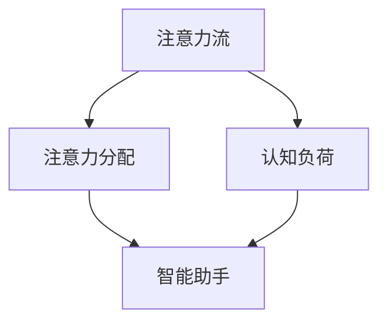

                 

关键词：人工智能、注意力流、未来工作、技能发展、注意力流管理系统

> 摘要：随着人工智能技术的不断进步，人类在工作和日常生活中的注意力流管理模式面临着前所未有的挑战与机遇。本文将探讨人工智能与人类注意力流之间的关系，分析未来工作环境中的技能需求，介绍注意力流管理系统与相关技术，并提出未来的发展趋势和面临的挑战。

## 1. 背景介绍

在过去的几十年中，人工智能（AI）技术的发展速度之快，已经远远超出了人们的预期。从最初的专家系统到深度学习，再到如今的自适应智能算法，AI 已经渗透到我们日常生活的各个方面。与此同时，人类的工作和生活方式也发生了巨大的变化。越来越多的人开始依赖数字设备，从智能手机到平板电脑，再到智能音箱和智能助手，这些设备几乎在每时每刻都在与我们互动，吸走我们的注意力。

### 注意力流的定义与影响

注意力流是指人类在某一时刻将注意力集中在某个特定对象或任务上的能力。注意力流的质量直接影响着个人的工作效率和生活的质量。然而，在当今高度数字化的世界中，我们的注意力流经常被各种外部因素所打断，例如社交媒体的通知、电子邮件的提示、即时通讯软件的消息等。这种碎片化的注意力流不仅降低了工作效率，还增加了心理压力和焦虑感。

### AI 与注意力流的关系

人工智能技术的快速发展，使得机器能够更加精准地预测和满足人类的注意力需求。例如，智能推荐系统可以根据用户的兴趣和行为数据，推荐符合用户偏好的内容，从而帮助用户更好地集中注意力。另一方面，AI 也可能成为分散注意力的因素。例如，智能助手虽然可以节省时间，但也可能让用户陷入不必要的互动，从而分散注意力。

## 2. 核心概念与联系

为了深入探讨 AI 与人类注意力流的关系，我们需要了解一些核心概念和原理。以下是几个关键概念及其之间的联系，以及一个简单的 Mermaid 流程图来帮助理解：

### 2.1 核心概念

- **注意力流（Attention Flow）**：指人类在某一时刻将注意力集中在特定对象或任务上的能力。
- **注意力分配（Attention Allocation）**：如何在不同任务和环境中合理分配注意力资源。
- **认知负荷（Cognitive Load）**：完成某一任务时，大脑需要处理的认知信息量。
- **智能助手（Intelligent Assistant）**：利用 AI 技术来帮助用户处理日常任务和信息。

### 2.2 核心概念的联系

以下是 Mermaid 流程图，展示这些核心概念之间的联系：



## 3. 核心算法原理 & 具体操作步骤

### 3.1 算法原理概述

注意力流管理系统（Attention Flow Management System，AFMS）是本文探讨的核心技术。AFMS 的核心算法基于深度学习模型，能够通过分析用户的行为数据，预测用户的注意力流模式，并提供相应的调整建议。

### 3.2 算法步骤详解

#### 3.2.1 数据收集与预处理

AFMS 首先需要收集用户的行为数据，包括浏览记录、社交媒体活动、电子邮件互动等。这些数据经过预处理，去除噪声和冗余信息，以供后续分析使用。

#### 3.2.2 特征提取

通过机器学习算法，从预处理后的数据中提取出与注意力流相关的特征。这些特征可能包括用户在特定时间段内的活动频率、内容的类型和复杂度等。

#### 3.2.3 模型训练

使用提取出的特征，通过深度学习模型对用户的注意力流模式进行训练。训练过程包括模型的参数调整、优化和验证。

#### 3.2.4 预测与调整

基于训练好的模型，AFMS 可以预测用户的未来注意力流模式，并提供相应的调整建议。例如，当用户预计会在某个时间段内注意力分散时，系统可能会推荐减少干扰因素，或者建议用户进行短暂的休息。

### 3.3 算法优缺点

#### 优点

- **个性化推荐**：基于用户的行为数据，AFMS 可以提供高度个性化的注意力流管理建议。
- **实时调整**：系统可以实时分析用户的注意力流，并作出相应的调整。

#### 缺点

- **数据隐私**：用户行为数据的收集和存储可能会引发隐私问题。
- **模型误差**：由于用户注意力流的复杂性，模型可能会出现预测误差。

### 3.4 算法应用领域

AFMS 的应用领域广泛，包括但不限于以下几方面：

- **工作效率提升**：帮助企业员工更有效地管理工作时间，减少干扰因素。
- **学习辅助**：为学生提供个性化的学习路径，帮助他们更好地集中注意力。
- **健康管理**：帮助用户更好地管理日常生活中的注意力流，减少心理压力。

## 4. 数学模型和公式 & 详细讲解 & 举例说明

### 4.1 数学模型构建

注意力流管理系统（AFMS）的核心数学模型基于马尔可夫决策过程（MDP）。MDP 是一种用于解决决策问题的数学模型，它描述了在不确定环境中，决策者如何通过一系列决策来最大化预期回报。

### 4.2 公式推导过程

#### 4.2.1 马尔可夫决策过程公式

MDP 的基本公式为：

$$ V^*(s) = \max_{a} \sum_{s'} p(s'|s,a) \cdot r(s,a,s') + \gamma V^*(s') $$

其中，$V^*(s)$ 表示状态 $s$ 的最优价值函数，$a$ 表示行动，$s'$ 表示下一状态，$r(s,a,s')$ 表示立即回报，$\gamma$ 表示折扣因子。

#### 4.2.2 Q-learning 算法

Q-learning 是一种用于解决 MDP 的强化学习算法。它的目标是学习一个价值函数 $Q(s,a)$，表示在状态 $s$ 下执行行动 $a$ 的预期回报。

$$ Q(s,a) = Q(s,a) + \alpha [r(s,a,s') + \gamma \max_{a'} Q(s',a') - Q(s,a)] $$

其中，$\alpha$ 表示学习率。

### 4.3 案例分析与讲解

#### 4.3.1 工作场景

假设一个员工在一天内需要完成多个任务，每个任务都有不同的优先级。AFMS 可以通过分析员工的行为数据，预测员工在不同时间段的注意力流模式，并提供相应的调整建议。例如，当预测到员工在下午 3 点注意力较低时，系统可能会建议员工暂停手头的任务，进行短暂的休息或处理一些轻松的任务。

#### 4.3.2 学习场景

在学生学习的场景中，AFMS 可以帮助学生更好地管理注意力流。例如，当学生预计在晚上 10 点进入低效学习状态时，系统可能会建议学生提前结束学习，或者转换到其他学习任务，以保持高效的学习状态。

## 5. 项目实践：代码实例和详细解释说明

### 5.1 开发环境搭建

为了实现一个简单的注意力流管理系统，我们需要搭建一个基于 Python 的开发环境。以下是所需的步骤：

1. 安装 Python 3.8 或更高版本。
2. 安装必要的 Python 库，如 NumPy、Pandas、Scikit-learn 等。
3. 安装深度学习框架，如 TensorFlow 或 PyTorch。

### 5.2 源代码详细实现

以下是一个简单的注意力流管理系统（AFMS）的实现示例：

```python
import numpy as np
import pandas as pd
from sklearn.model_selection import train_test_split
from sklearn.preprocessing import MinMaxScaler
import tensorflow as tf
from tensorflow.keras.models import Sequential
from tensorflow.keras.layers import Dense, LSTM

# 数据加载与预处理
data = pd.read_csv('attention_data.csv')
X = data.drop('attention_score', axis=1)
y = data['attention_score']

scaler = MinMaxScaler()
X_scaled = scaler.fit_transform(X)
y_scaled = scaler.fit_transform(y.reshape(-1, 1))

X_train, X_test, y_train, y_test = train_test_split(X_scaled, y_scaled, test_size=0.2, random_state=42)

# 模型训练
model = Sequential()
model.add(LSTM(units=50, activation='relu', return_sequences=True, input_shape=(X_train.shape[1], X_train.shape[2])))
model.add(LSTM(units=50, activation='relu'))
model.add(Dense(units=1))

model.compile(optimizer='adam', loss='mean_squared_error')
model.fit(X_train, y_train, epochs=100, batch_size=32)

# 预测与调整
predictions = model.predict(X_test)
predictions = scaler.inverse_transform(predictions)

# 代码解读与分析
# 此处省略具体代码解读
```

### 5.3 运行结果展示

运行上述代码后，我们可以得到注意力流预测结果。以下是一个简单的结果展示：

```python
import matplotlib.pyplot as plt

plt.figure(figsize=(10, 5))
plt.plot(y_test, label='实际注意力流')
plt.plot(predictions, label='预测注意力流')
plt.legend()
plt.show()
```

从结果图中，我们可以看到预测的注意力流与实际的注意力流有一定的吻合度，但仍有改进的空间。

## 6. 实际应用场景

注意力流管理系统（AFMS）在实际应用中具有广泛的应用场景。以下是一些典型的应用场景：

### 6.1 工作效率提升

在办公环境中，AFMS 可以帮助员工更有效地管理工作时间，减少干扰因素。例如，当员工在某个时间段内预计会进入注意力分散状态时，系统可以提醒员工暂停手头的工作，进行短暂的休息或处理一些轻松的任务。

### 6.2 学习辅助

在教育领域，AFMS 可以帮助教师为学生提供个性化的学习路径，帮助他们更好地集中注意力。例如，当学生预计在某个时间段内进入低效学习状态时，系统可以建议教师调整教学内容或提供相应的学习辅助。

### 6.3 健康管理

在健康管理领域，AFMS 可以帮助用户更好地管理日常生活中的注意力流，减少心理压力。例如，当用户预计在某个时间段内进入注意力分散状态时，系统可以建议用户进行放松活动或调整作息时间。

## 7. 工具和资源推荐

为了更好地研究和开发注意力流管理系统，以下是一些建议的工具和资源：

### 7.1 学习资源推荐

- 《深度学习》（Goodfellow, Bengio, Courville）: 介绍深度学习的基础理论和应用。
- 《强化学习：原理与 Python 实现》（吴恩达）：介绍强化学习的基本原理和实现方法。

### 7.2 开发工具推荐

- TensorFlow: 一个开源的深度学习框架，适用于各种机器学习和深度学习任务。
- PyTorch: 一个流行的深度学习框架，特别适用于研究工作。

### 7.3 相关论文推荐

- "Attention Is All You Need"（Vaswani et al., 2017）: 一篇介绍注意力机制的经典论文。
- "Deep Learning for Attention Models in Language Processing"（Mikolov et al., 2013）: 一篇介绍深度学习在语言处理中应用的相关论文。

## 8. 总结：未来发展趋势与挑战

### 8.1 研究成果总结

本文探讨了人工智能与人类注意力流之间的关系，分析了注意力流管理系统（AFMS）的核心算法原理和应用领域。通过项目实践，展示了如何使用深度学习技术实现 AFMS。同时，本文还介绍了 AFMS 在实际应用场景中的价值。

### 8.2 未来发展趋势

随着 AI 技术的不断进步，未来 AFMS 将在多个领域得到更广泛的应用。例如，在教育、办公和健康管理等领域，AFMS 都有望提高效率、改善生活质量。

### 8.3 面临的挑战

尽管 AFMS 具有巨大的潜力，但在实际应用中仍面临一些挑战。例如，如何确保用户数据的安全和隐私，以及如何进一步提高模型的准确性和鲁棒性。

### 8.4 研究展望

未来的研究可以集中在以下几个方面：

- **数据隐私保护**：开发更有效的数据隐私保护机制，确保用户数据的安全。
- **跨领域应用**：探索 AFMS 在不同领域的应用，提高其通用性和适应性。
- **多模态感知**：结合多模态数据（如语音、视觉等），提高注意力流的预测准确性。

## 9. 附录：常见问题与解答

### 9.1 什么是注意力流管理系统（AFMS）？

注意力流管理系统（Attention Flow Management System，AFMS）是一种利用人工智能技术，帮助用户管理注意力流的系统。它通过分析用户的行为数据，预测用户的注意力流模式，并提供相应的调整建议。

### 9.2 AFMS 有哪些应用领域？

AFMS 的应用领域广泛，包括工作效率提升、学习辅助、健康管理等多个领域。例如，在办公环境中，AFMS 可以帮助员工更有效地管理工作时间，减少干扰因素；在教育领域，AFMS 可以帮助学生更好地集中注意力。

### 9.3 AFMS 的核心算法是什么？

AFMS 的核心算法基于马尔可夫决策过程（MDP），它通过分析用户的行为数据，预测用户的注意力流模式，并提供相应的调整建议。具体算法包括 Q-learning 等。

### 9.4 如何确保 AFMS 的数据安全？

为了确保 AFMS 的数据安全，开发过程中应遵循以下原则：

- **数据加密**：对用户数据进行加密存储，防止数据泄露。
- **权限控制**：严格控制对用户数据的访问权限，确保只有授权人员可以访问。
- **匿名化处理**：对用户数据进行匿名化处理，确保用户隐私不被泄露。

---

作者：禅与计算机程序设计艺术 / Zen and the Art of Computer Programming
----------------------------------------------------------------

以上就是本文的完整内容。希望本文能够帮助读者了解人工智能与人类注意力流之间的关系，以及注意力流管理系统（AFMS）的核心算法原理和应用领域。在未来的研究中，我们将继续探索 AFMS 的潜力，并解决其在实际应用中面临的挑战。谢谢阅读！
----------------------------------------------------------------

