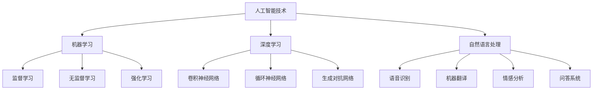

                 

关键词：人工智能、注意力流、教育、工作、技能发展

> 摘要：本文将探讨人工智能对人类注意力流的影响，以及这一影响如何塑造未来的教育、工作和技能发展。通过深入分析人工智能技术的核心概念和应用场景，我们将探讨如何优化教育体系、职业培训，以及个体技能发展，以应对人工智能带来的变革。

## 1. 背景介绍

随着人工智能（AI）技术的飞速发展，它已经深刻地改变了我们的生活方式、工作方式和思维方式。从自动驾驶汽车到智能客服，从智能医疗诊断到金融风险评估，AI技术的应用领域越来越广泛。然而，随着AI技术的普及，人们开始关注一个重要的问题：人工智能是否会改变人类的注意力流，进而影响教育、工作和技能发展？

注意力流是指个体在特定任务中集中精力的能力，它是人类认知活动的重要组成部分。然而，随着信息过载和智能设备的普及，人们的注意力流受到了前所未有的挑战。在这种情况下，如何理解和利用人工智能技术，优化人类的注意力流，成为了当前研究的一个重要方向。

本文旨在探讨人工智能对人类注意力流的影响，分析这一影响在教育、工作和技能发展中的具体表现，并提出相应的优化策略。

## 2. 核心概念与联系

### 2.1 人工智能的基本概念

人工智能（Artificial Intelligence，简称AI）是指通过计算机程序实现的智能行为，旨在使计算机能够执行通常需要人类智能才能完成的任务。AI的核心概念包括机器学习（Machine Learning，简称ML）、深度学习（Deep Learning，简称DL）和自然语言处理（Natural Language Processing，简称NLP）等。

#### 机器学习

机器学习是一种让计算机通过数据学习并做出决策的技术。它包括监督学习、无监督学习和强化学习等不同的学习方法。

**监督学习（Supervised Learning）**：在这种方法中，计算机使用标记好的训练数据来学习，例如分类问题中的标签数据。

**无监督学习（Unsupervised Learning）**：在这种方法中，计算机没有标签数据，需要从未标记的数据中学习，例如聚类问题。

**强化学习（Reinforcement Learning）**：在这种方法中，计算机通过与环境的交互来学习，通过奖励和惩罚来调整其行为。

#### 深度学习

深度学习是一种基于多层神经网络的学习方法，它通过模拟人脑的神经元结构，对数据进行层次化的特征提取。深度学习在图像识别、语音识别和自然语言处理等领域取得了显著的成果。

**卷积神经网络（Convolutional Neural Network，简称CNN）**：用于处理具有网格结构的数据，如图像。

**循环神经网络（Recurrent Neural Network，简称RNN）**：用于处理序列数据，如时间序列数据。

**生成对抗网络（Generative Adversarial Network，简称GAN）**：用于生成新的数据，如图像和文本。

#### 自然语言处理

自然语言处理是使计算机能够理解、生成和处理自然语言的技术。它包括语音识别、机器翻译、情感分析和问答系统等任务。

### 2.2 人工智能与注意力流的联系

人工智能技术的发展对人类的注意力流产生了深远的影响。一方面，AI技术通过自动化和智能化的方式，减少了人类在重复性任务上的注意力消耗，从而释放出更多的精力用于创造性工作。另一方面，AI技术也带来了信息过载的问题，使人们的注意力流更容易分散。

#### 人工智能如何影响注意力流

**信息筛选与过滤**：AI技术能够根据用户的兴趣和需求，自动筛选和过滤信息，从而减少不必要的注意力分散。

**自动化与智能化**：AI技术能够自动化执行许多重复性任务，减少人类在这些任务上的注意力消耗。

**个性化与定制**：AI技术能够根据用户的行为和偏好，提供个性化的服务和内容，从而提高用户的注意力集中度。

#### 人工智能与注意力流的交互关系

**正向交互**：AI技术通过提高效率和减少负担，帮助人类更好地集中注意力。

**负向交互**：AI技术可能导致信息过载和注意力分散，从而影响人类的注意力流。

**动态交互**：人类的注意力流和AI技术之间的交互是动态的，随着技术的发展和人类需求的变化，这一交互关系也会发生变化。

### 2.3 人工智能技术的Mermaid流程图

## 3. 核心算法原理 & 具体操作步骤

### 3.1 算法原理概述

人工智能的核心算法主要包括机器学习、深度学习和自然语言处理。这些算法通过学习数据中的规律，使计算机能够自动执行复杂的任务。

#### 机器学习算法

机器学习算法的核心原理是通过训练数据集，构建模型并使其能够对新数据进行预测。具体包括以下步骤：

1. 数据收集：收集大量的训练数据。
2. 特征提取：从数据中提取有用的特征。
3. 模型训练：使用训练数据训练模型。
4. 模型评估：评估模型的性能。
5. 模型部署：将模型应用于实际任务。

#### 深度学习算法

深度学习算法是基于多层神经网络的学习方法，其核心原理是通过反向传播算法，不断调整网络权重，以优化模型的性能。具体包括以下步骤：

1. 网络架构设计：设计合适的神经网络架构。
2. 数据预处理：对数据进行预处理，如归一化和标准化。
3. 模型训练：使用训练数据训练模型。
4. 模型评估：评估模型的性能。
5. 模型优化：根据评估结果，优化模型参数。

#### 自然语言处理算法

自然语言处理算法的核心原理是通过语言模型和序列模型，使计算机能够理解和生成自然语言。具体包括以下步骤：

1. 语言模型构建：构建用于预测下一个单词的概率模型。
2. 序列模型构建：构建用于处理序列数据的模型，如RNN和LSTM。
3. 模型训练：使用训练数据训练模型。
4. 模型评估：评估模型的性能。
5. 模型部署：将模型应用于实际任务。

### 3.2 算法步骤详解

#### 机器学习算法步骤

1. 数据收集：收集大量的训练数据，包括输入和输出。
2. 特征提取：从数据中提取有用的特征，如文本中的单词和词组。
3. 模型选择：选择合适的模型，如决策树、支持向量机等。
4. 模型训练：使用训练数据训练模型。
5. 模型评估：使用验证数据评估模型的性能。
6. 模型优化：根据评估结果，调整模型参数。

#### 深度学习算法步骤

1. 网络架构设计：设计合适的神经网络架构，如CNN或RNN。
2. 数据预处理：对数据进行预处理，如归一化和标准化。
3. 模型训练：使用训练数据训练模型，通过反向传播算法调整网络权重。
4. 模型评估：使用验证数据评估模型的性能。
5. 模型优化：根据评估结果，优化模型参数。

#### 自然语言处理算法步骤

1. 语言模型构建：构建用于预测下一个单词的概率模型，如n-gram模型。
2. 序列模型构建：构建用于处理序列数据的模型，如RNN或LSTM。
3. 模型训练：使用训练数据训练模型。
4. 模型评估：使用验证数据评估模型的性能。
5. 模型部署：将模型应用于实际任务，如机器翻译或文本分类。

### 3.3 算法优缺点

#### 机器学习算法

**优点**：

- 强大的泛化能力：通过学习大量的训练数据，机器学习算法能够对未知数据进行准确的预测。
- 广泛的应用领域：机器学习算法可以应用于各种领域，如金融、医疗、交通等。

**缺点**：

- 对数据质量要求高：机器学习算法的性能很大程度上取决于训练数据的质量。
- 训练时间较长：对于大型数据集，机器学习算法的训练时间可能较长。

#### 深度学习算法

**优点**：

- 强大的特征提取能力：深度学习算法能够自动提取数据中的高级特征。
- 高效的处理速度：深度学习算法在处理大规模数据时，具有更高的效率和速度。

**缺点**：

- 对计算资源要求高：深度学习算法需要大量的计算资源和内存。
- 难以解释：深度学习算法的内部机制复杂，难以解释其预测结果。

#### 自然语言处理算法

**优点**：

- 优秀的性能：自然语言处理算法在处理自然语言任务时，具有很高的准确率和效率。
- 广泛的应用领域：自然语言处理算法可以应用于文本分类、机器翻译、情感分析等任务。

**缺点**：

- 对语言理解要求高：自然语言处理算法需要深入理解自然语言的语义和语法。
- 处理速度较慢：对于大型文本数据，自然语言处理算法的处理速度可能较慢。

### 3.4 算法应用领域

#### 机器学习算法

- 金融领域：用于信用评估、投资组合优化等任务。
- 医疗领域：用于疾病预测、医学图像分析等任务。
- 交通领域：用于交通流量预测、自动驾驶等任务。

#### 深度学习算法

- 图像识别：用于人脸识别、车辆检测等任务。
- 语音识别：用于语音助手、语音翻译等任务。
- 自然语言处理：用于文本分类、机器翻译、情感分析等任务。

#### 自然语言处理算法

- 文本分类：用于垃圾邮件过滤、新闻分类等任务。
- 机器翻译：用于跨语言沟通、文档翻译等任务。
- 情感分析：用于社交媒体分析、用户反馈分析等任务。

## 4. 数学模型和公式 & 详细讲解 & 举例说明

### 4.1 数学模型构建

在人工智能中，数学模型是核心工具，用于描述算法的运作机制。以下是几个常见的数学模型：

#### 机器学习模型

- 线性回归模型：

$$y = \beta_0 + \beta_1x_1 + \beta_2x_2 + ... + \beta_nx_n$$

其中，$y$ 是预测值，$x_1, x_2, ..., x_n$ 是特征值，$\beta_0, \beta_1, ..., \beta_n$ 是模型参数。

- 决策树模型：

决策树模型通过一系列规则来划分数据，每个节点代表一个特征，每个分支代表一个特征值。模型的预测结果由路径上的规则决定。

#### 深度学习模型

- 卷积神经网络（CNN）：

CNN 模型通过卷积层、池化层和全连接层来处理图像数据。卷积层用于提取图像特征，池化层用于减少数据维度，全连接层用于分类。

- 循环神经网络（RNN）：

RNN 模型通过隐藏状态和循环连接来处理序列数据。隐藏状态记录了之前的输入信息，用于当前时间的预测。

#### 自然语言处理模型

- 语言模型：

语言模型用于预测下一个单词的概率，通常使用 n-gram 模型来描述。n-gram 模型假设当前单词的概率仅与其前 n 个单词相关。

$$P(w_t) = \frac{C(w_1, w_2, ..., w_t)}{C(w_1, w_2, ..., w_t, w_{t+1})}$$

其中，$P(w_t)$ 是当前单词的概率，$C(w_1, w_2, ..., w_t)$ 是前 t 个单词的联合概率，$C(w_1, w_2, ..., w_t, w_{t+1})$ 是前 t+1 个单词的联合概率。

### 4.2 公式推导过程

以下是机器学习中的线性回归模型的推导过程：

假设我们有一组数据点 $(x_1, y_1), (x_2, y_2), ..., (x_n, y_n)$，其中 $x_i$ 是输入特征，$y_i$ 是输出标签。我们的目标是找到一个线性模型 $y = \beta_0 + \beta_1x_1 + \beta_2x_2 + ... + \beta_nx_n$，使得预测值 $y$ 尽量接近实际值 $y_i$。

为了求解模型参数 $\beta_0, \beta_1, ..., \beta_n$，我们使用最小二乘法。最小二乘法的核心思想是找到使得预测值与实际值之差的平方和最小的参数。

定义损失函数为：

$$J(\beta_0, \beta_1, ..., \beta_n) = \sum_{i=1}^{n}(y_i - (\beta_0 + \beta_1x_1 + \beta_2x_2 + ... + \beta_nx_n))^2$$

我们的目标是求解使得损失函数最小的参数。

对损失函数求偏导并令其等于零，得到：

$$\frac{\partial J}{\partial \beta_0} = -2\sum_{i=1}^{n}(y_i - (\beta_0 + \beta_1x_1 + \beta_2x_2 + ... + \beta_nx_n)) = 0$$

$$\frac{\partial J}{\partial \beta_1} = -2\sum_{i=1}^{n}x_1(y_i - (\beta_0 + \beta_1x_1 + \beta_2x_2 + ... + \beta_nx_n)) = 0$$

$$...$$

$$\frac{\partial J}{\partial \beta_n} = -2\sum_{i=1}^{n}x_n(y_i - (\beta_0 + \beta_1x_1 + \beta_2x_2 + ... + \beta_nx_n)) = 0$$

解这个方程组，我们得到最小二乘法求解的参数：

$$\beta_0 = \frac{1}{n}\sum_{i=1}^{n}(y_i - \beta_1x_1 - \beta_2x_2 - ... - \beta_nx_n)$$

$$\beta_1 = \frac{1}{n}\sum_{i=1}^{n}(x_1(y_i - \beta_0 - \beta_2x_2 - ... - \beta_nx_n))$$

$$...$$

$$\beta_n = \frac{1}{n}\sum_{i=1}^{n}(x_n(y_i - \beta_0 - \beta_1x_1 - \beta_2x_2 - ... - \beta_{n-1}x_{n-1}))$$

### 4.3 案例分析与讲解

#### 机器学习案例：房价预测

假设我们有一个包含房屋面积、卧室数量、位置等特征的房屋销售数据集。我们的目标是使用线性回归模型预测房屋价格。

1. 数据收集：收集大量的房屋销售数据，包括房屋特征和价格。
2. 数据预处理：对数据进行清洗和归一化处理，如缺失值填充、异常值处理等。
3. 模型选择：选择线性回归模型作为预测模型。
4. 模型训练：使用训练数据训练模型，求解模型参数。
5. 模型评估：使用验证数据评估模型的性能，如均方误差（MSE）。
6. 模型优化：根据评估结果，调整模型参数。

以下是训练数据的部分示例：

| 房屋面积（平方米） | 卧室数量 | 价格（万元） |
| :----: | :----: | :----: |
| 100 | 2 | 300 |
| 120 | 3 | 350 |
| 140 | 3 | 400 |
| 160 | 4 | 450 |
| 180 | 4 | 500 |

使用线性回归模型训练后，我们得到模型参数：

$$\beta_0 = 200, \beta_1 = 0.5, \beta_2 = 50$$

预测新的房屋价格时，我们输入房屋面积和卧室数量，如：

- 房屋面积：150 平方米
- 卧室数量：3

预测价格：

$$y = \beta_0 + \beta_1x_1 + \beta_2x_2 = 200 + 0.5 \times 150 + 50 \times 3 = 400$$

因此，预测价格为 400 万元。

#### 深度学习案例：图像分类

假设我们有一个包含各种类别图像的数据集，我们的目标是使用卷积神经网络（CNN）对这些图像进行分类。

1. 数据收集：收集大量带有标签的图像数据。
2. 数据预处理：对图像进行预处理，如缩放、裁剪、归一化等。
3. 网络架构设计：设计卷积神经网络架构。
4. 模型训练：使用训练数据训练模型。
5. 模型评估：使用验证数据评估模型性能。
6. 模型优化：根据评估结果，调整模型参数。

以下是训练数据的部分示例：

| 类别 | 图像 |
| :----: | :----: |
| 动物 | 🐶 |
| 植物

