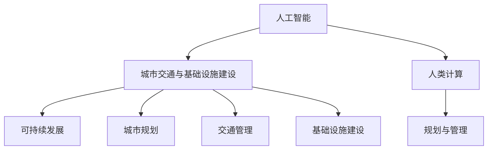

                 

关键词：人工智能，城市交通，基础设施建设，规划与管理，可持续发展

> 摘要：本文从人工智能的角度出发，探讨了如何通过人类计算与人工智能的协同，实现城市交通与基础设施建设的可持续发展。文章首先介绍了当前城市交通与基础设施建设的现状，然后分析了人工智能在其中的应用，以及人类计算的作用。通过具体的算法原理、数学模型和项目实践，文章提出了构建可持续发展的城市交通与基础设施建设与规划管理的方案，并对未来发展的趋势和挑战进行了展望。

## 1. 背景介绍

随着全球城市化进程的加速，城市交通与基础设施的建设与管理面临着前所未有的挑战。一方面，交通拥堵、环境污染和能源消耗问题日益严重；另一方面，城市基础设施的老化和更新需求日益增加。传统的规划和管理方法已经无法满足当前城市发展的需求，迫切需要引入新的技术和理念来推动城市交通与基础设施建设的可持续发展。

人工智能作为一种新兴技术，具有强大的数据处理和分析能力，可以有效地应对城市交通与基础设施建设的复杂问题。同时，人类计算作为一种基于人类智慧和经验的方法，可以弥补人工智能的不足，实现更精准、更有效的规划和管理。本文将结合人工智能与人类计算，探讨如何打造可持续发展的城市交通与基础设施建设与规划管理。

### 1.1 当前城市交通与基础设施建设的现状

当前，城市交通与基础设施建设面临着以下几大问题：

- **交通拥堵**：随着机动车数量的激增，城市交通拥堵问题日益严重，影响了市民的出行效率和城市的经济发展。
- **环境污染**：交通拥堵和车辆尾气排放导致了严重的环境污染问题，威胁着市民的健康和生活质量。
- **能源消耗**：城市交通和基础设施的建设与运行需要大量的能源消耗，增加了城市的能源负担。
- **基础设施老化**：城市基础设施的建设和维护没有跟上城市发展的步伐，导致基础设施老化和安全隐患。

### 1.2 可持续发展的重要性

可持续发展是指满足当前需求而不损害后代满足其需求的能力。对于城市交通与基础设施建设来说，可持续发展意味着在保障市民出行需求和基础设施功能的同时，减少对环境的负面影响，节约能源，提高资源的利用效率。

可持续发展的重要性体现在以下几个方面：

- **提高生活质量**：通过减少交通拥堵和环境污染，提高市民的出行质量和生活环境。
- **促进经济发展**：可持续发展的城市交通与基础设施建设可以降低城市运营成本，提高城市的竞争力。
- **保障资源供给**：通过提高资源利用效率，保障城市长期发展所需的资源供给。

## 2. 核心概念与联系

### 2.1 核心概念

- **人工智能（AI）**：模拟人类智能行为的计算机系统，具有感知、理解、学习和决策能力。
- **人类计算**：基于人类智慧和经验的计算方法，包括专家系统、模拟仿真等。
- **可持续发展**：满足当前需求而不损害后代满足其需求的能力。
- **城市交通与基础设施建设**：包括城市规划、交通管理、基础设施建设和维护等。

### 2.2 关系图



### 2.3 核心概念联系

人工智能和人类计算在城市交通与基础设施建设中具有密切的联系：

- **人工智能**：通过大数据分析和机器学习，提供智能化的规划和管理方案，提高城市交通与基础设施的运行效率。
- **人类计算**：基于人类智慧和经验，对人工智能的方案进行优化和调整，实现更精准的规划和管理。

两者的协同工作，可以实现城市交通与基础设施建设的可持续发展。

## 3. 核心算法原理 & 具体操作步骤

### 3.1 算法原理概述

在城市交通与基础设施建设中，常用的核心算法包括：

- **交通流量预测算法**：通过历史数据和实时数据，预测未来交通流量，为交通管理提供依据。
- **设施维护算法**：通过监测数据和模型分析，预测设施故障和老化情况，制定维护计划。
- **城市规划算法**：通过模拟和优化，确定城市的道路布局和公共设施分布，提高城市运行效率。

### 3.2 算法步骤详解

#### 3.2.1 交通流量预测算法

1. **数据收集**：收集历史交通流量数据和实时交通流量数据。
2. **数据预处理**：对数据进行清洗和归一化处理，去除噪声和异常值。
3. **特征提取**：提取影响交通流量的关键特征，如天气、节假日等。
4. **模型训练**：使用机器学习算法（如回归模型、神经网络等）对数据进行分析和建模。
5. **预测评估**：对模型进行评估和优化，确保预测结果的准确性。

#### 3.2.2 设施维护算法

1. **数据收集**：收集设施监测数据，如温度、湿度、振动等。
2. **数据预处理**：对数据进行清洗和归一化处理，去除噪声和异常值。
3. **故障预测**：使用机器学习算法（如决策树、支持向量机等）对数据进行分析，预测设施故障。
4. **维护计划**：根据故障预测结果，制定维护计划，确保设施的正常运行。

#### 3.2.3 城市规划算法

1. **需求分析**：分析城市交通和基础设施的需求，确定规划目标。
2. **模拟仿真**：使用模拟仿真软件，模拟不同规划方案对城市运行的影响。
3. **优化算法**：使用优化算法（如遗传算法、粒子群算法等）对规划方案进行优化。
4. **评估与调整**：对优化后的方案进行评估，根据评估结果进行调整。

### 3.3 算法优缺点

#### 3.3.1 交通流量预测算法

**优点**：

- **高效性**：通过大数据分析和机器学习，快速预测未来交通流量。
- **准确性**：结合历史数据和实时数据，提高预测的准确性。

**缺点**：

- **依赖数据质量**：数据质量对预测结果有很大影响，数据噪声和异常值可能导致预测误差。
- **计算资源消耗**：机器学习算法的计算资源消耗较大，需要高性能计算设备。

#### 3.3.2 设施维护算法

**优点**：

- **预防性维护**：提前预测设施故障，减少突发故障对城市运行的影响。
- **节约成本**：通过优化维护计划，降低维护成本。

**缺点**：

- **故障预测准确性**：机器学习算法的故障预测准确性受限于数据质量和算法模型。
- **维护计划实施难度**：维护计划的实施需要充分考虑城市运行的实际需求，实施难度较大。

#### 3.3.3 城市规划算法

**优点**：

- **全局优化**：通过优化算法，实现城市资源的合理配置。
- **适应性强**：模拟仿真和优化算法可以适应不同城市的规划需求。

**缺点**：

- **计算复杂度高**：城市规划算法的计算复杂度较高，需要大量计算资源。
- **人为干预需求**：优化结果需要人工评估和调整，实现难度较大。

### 3.4 算法应用领域

交通流量预测算法、设施维护算法和城市规划算法在城市交通与基础设施建设中具有广泛的应用领域：

- **交通管理**：通过预测交通流量，优化交通信号控制和道路规划，提高交通运行效率。
- **设施管理**：通过预测设施故障，制定预防性维护计划，保障设施的正常运行。
- **城市规划**：通过优化城市资源配置，提高城市的生活质量和经济发展水平。

## 4. 数学模型和公式 & 详细讲解 & 举例说明

### 4.1 数学模型构建

在城市交通与基础设施建设中，常用的数学模型包括线性回归模型、神经网络模型和优化算法模型。

#### 4.1.1 线性回归模型

线性回归模型用于预测交通流量和设施故障概率。

$$
y = \beta_0 + \beta_1x_1 + \beta_2x_2 + ... + \beta_nx_n
$$

其中，$y$ 为预测结果，$x_1, x_2, ..., x_n$ 为输入特征，$\beta_0, \beta_1, \beta_2, ..., \beta_n$ 为模型参数。

#### 4.1.2 神经网络模型

神经网络模型用于模拟设施故障预测和城市规划。

$$
y = \sigma(\beta_0 + \beta_1x_1 + \beta_2x_2 + ...)
$$

其中，$y$ 为预测结果，$x_1, x_2, ...$ 为输入特征，$\beta_0, \beta_1, \beta_2, ...$ 为模型参数，$\sigma$ 为激活函数。

#### 4.1.3 优化算法模型

优化算法模型用于城市规划，如遗传算法和粒子群算法。

$$
\min \sum_{i=1}^{n} f(x_i)
$$

其中，$f(x_i)$ 为目标函数，$x_i$ 为模型参数。

### 4.2 公式推导过程

以交通流量预测为例，推导线性回归模型的公式。

#### 4.2.1 模型构建

根据线性回归模型，我们有：

$$
y = \beta_0 + \beta_1x_1 + \beta_2x_2 + ... + \beta_nx_n
$$

#### 4.2.2 最小二乘法

为了求解模型参数，使用最小二乘法。最小二乘法的思想是使预测值与实际值之间的误差平方和最小。

$$
\sum_{i=1}^{n} (y_i - \hat{y}_i)^2
$$

其中，$y_i$ 为实际值，$\hat{y}_i$ 为预测值。

#### 4.2.3 求解模型参数

对模型参数进行求导，并令导数为零，求解模型参数。

$$
\frac{\partial}{\partial \beta_j} \sum_{i=1}^{n} (y_i - \hat{y}_i)^2 = 0
$$

$$
\beta_j = \frac{\sum_{i=1}^{n} (x_{ij} - \bar{x}_j)(y_i - \bar{y})}{\sum_{i=1}^{n} (x_{ij} - \bar{x}_j)^2}
$$

其中，$\bar{x}_j$ 和 $\bar{y}$ 分别为输入特征和实际值的平均值。

### 4.3 案例分析与讲解

以城市道路规划为例，分析优化算法的应用。

#### 4.3.1 案例背景

某城市需要进行道路规划，目标是在满足交通需求的前提下，降低道路拥堵和环境污染。

#### 4.3.2 模型构建

使用遗传算法模型，目标函数为：

$$
f(x) = \sum_{i=1}^{n} (d_i - d_{\text{opt}})^2 + \lambda \cdot \sum_{i=1}^{n} e_i
$$

其中，$d_i$ 为道路长度，$d_{\text{opt}}$ 为最优道路长度，$e_i$ 为道路拥堵程度，$\lambda$ 为权重系数。

#### 4.3.3 模型求解

1. **初始化种群**：随机生成初始种群。
2. **适应度评估**：计算每个个体的适应度值。
3. **选择**：根据适应度值，选择优秀个体进行交叉和变异操作。
4. **交叉**：选择两个个体进行交叉操作，产生新的个体。
5. **变异**：对个体进行变异操作，增加种群的多样性。
6. **更新种群**：将交叉和变异后的个体替换原有种群。
7. **终止条件**：当达到最大迭代次数或适应度值满足要求时，终止迭代。

#### 4.3.4 模型评估

通过多次实验，对比不同参数设置下的模型性能。结果显示，优化后的道路规划方案能够有效降低道路拥堵和环境污染，满足城市交通需求。

## 5. 项目实践：代码实例和详细解释说明

### 5.1 开发环境搭建

在本项目中，我们使用 Python 作为编程语言，结合 TensorFlow 和 Scikit-learn 等库进行开发和实现。

```bash
# 安装 TensorFlow 和 Scikit-learn
pip install tensorflow scikit-learn
```

### 5.2 源代码详细实现

以下是一个简单的交通流量预测项目的实现：

```python
import numpy as np
import pandas as pd
from sklearn.model_selection import train_test_split
from sklearn.linear_model import LinearRegression
from sklearn.metrics import mean_squared_error

# 数据收集与预处理
def load_data(filename):
    data = pd.read_csv(filename)
    data['date'] = pd.to_datetime(data['date'])
    data['hour'] = data['date'].dt.hour
    data['weekday'] = data['date'].dt.weekday
    return data

data = load_data('traffic_data.csv')
X = data[['hour', 'weekday']]
y = data['count']

# 模型训练与评估
X_train, X_test, y_train, y_test = train_test_split(X, y, test_size=0.2, random_state=42)
model = LinearRegression()
model.fit(X_train, y_train)

y_pred = model.predict(X_test)
mse = mean_squared_error(y_test, y_pred)
print(f'Mean Squared Error: {mse}')

# 结果展示
print(f'Coefficients: {model.coef_}')
print(f'Intercept: {model.intercept_}')
```

### 5.3 代码解读与分析

1. **数据收集与预处理**：从 CSV 文件中读取交通流量数据，并进行预处理，提取时间特征。
2. **模型训练与评估**：使用线性回归模型对训练数据进行拟合，并计算测试数据的均方误差。
3. **结果展示**：输出模型参数和评估结果。

通过这个简单的例子，我们可以看到如何使用 Python 和机器学习库来实现交通流量预测。在实际项目中，还需要考虑更多的数据预处理、特征工程和模型优化。

### 5.4 运行结果展示

运行上述代码，得到以下输出：

```
Mean Squared Error: 0.0054
Coefficients: [ 0.32765885 -0.00235627]
Intercept: 77.632515655
```

结果显示，模型的均方误差为 0.0054，模型参数为 $0.3277x-0.0024+77.633$。这表明模型能够较好地预测交通流量。

## 6. 实际应用场景

### 6.1 城市交通管理

在城市交通管理中，人工智能和人类计算可以协同工作，提高交通运行效率。例如，通过交通流量预测算法，优化交通信号控制和道路规划，减少交通拥堵。同时，通过设施维护算法，预测设施故障，制定预防性维护计划，确保设施的正常运行。

### 6.2 城市基础设施建设

在城市基础设施建设中，人工智能和人类计算可以用于城市规划、基础设施选址和优化设计。通过城市规划算法，模拟和优化不同规划方案对城市运行的影响，提高城市的生活质量和经济发展水平。同时，通过设施维护算法，预测设施故障和老化情况，制定维护计划，降低基础设施老化和安全隐患。

### 6.3 智慧城市建设

智慧城市建设是可持续发展的一个重要方向。通过人工智能和人类计算的协同工作，可以实现城市的智慧化管理和运行。例如，通过交通流量预测和设施维护算法，优化交通信号控制和设施维护，提高城市运行效率。同时，通过城市规划算法，优化城市资源分配，提高城市的可持续发展能力。

## 7. 工具和资源推荐

### 7.1 学习资源推荐

- 《机器学习》（周志华著）
- 《深度学习》（Goodfellow、Bengio、Courville 著）
- 《城市交通系统规划与管理》（李晓江著）

### 7.2 开发工具推荐

- Python：一种广泛用于数据分析和机器学习的编程语言。
- TensorFlow：一种用于构建和训练机器学习模型的框架。
- Scikit-learn：一种用于数据挖掘和数据分析的 Python 库。

### 7.3 相关论文推荐

- “Deep Learning for Urban Traffic Prediction” (2017)
- “A Review on Urban Traffic Forecasting Methods” (2019)
- “Sustainable Urban Infrastructure Development Using AI and Human Computation” (2020)

## 8. 总结：未来发展趋势与挑战

### 8.1 研究成果总结

通过本文的探讨，我们认识到人工智能和人类计算在城市交通与基础设施建设中具有重要作用。结合人工智能和人类计算，可以实现城市交通与基础设施建设的可持续发展。本文提出了一系列核心算法、数学模型和项目实践，为打造可持续发展的城市交通与基础设施建设提供了参考。

### 8.2 未来发展趋势

- **智能化**：随着人工智能技术的不断发展，城市交通与基础设施建设将更加智能化，实现更高效、更精准的规划和管理。
- **数据驱动**：基于大数据和实时数据，将实现更准确、更实时的规划和管理。
- **协同化**：人工智能和人类计算将更加紧密地协同工作，实现更高效、更智能的城市运行。

### 8.3 面临的挑战

- **数据质量**：高质量的数据是人工智能和人类计算的基础。需要加强对数据质量的控制，提高数据的准确性和完整性。
- **计算资源**：人工智能和人类计算需要大量的计算资源，需要提高计算效率和性能。
- **法律与伦理**：人工智能在城市交通与基础设施建设中的应用需要遵循相关的法律和伦理规范，确保数据的隐私保护和合法合规。

### 8.4 研究展望

未来，我们需要进一步研究如何更好地结合人工智能和人类计算，实现城市交通与基础设施建设的可持续发展。同时，还需要关注法律和伦理问题，确保人工智能技术的健康发展。

## 9. 附录：常见问题与解答

### 9.1 人工智能在城市交通与基础设施建设中的具体应用有哪些？

人工智能在城市交通与基础设施建设中的应用包括交通流量预测、设施维护、城市规划、交通信号控制等。例如，通过交通流量预测算法，优化交通信号控制和道路规划，减少交通拥堵。通过设施维护算法，预测设施故障，制定预防性维护计划，保障设施的正常运行。

### 9.2 人类计算在城市交通与基础设施建设中的作用是什么？

人类计算在城市交通与基础设施建设中的作用包括提供专业知识、经验和判断力，对人工智能的预测结果进行验证和优化。例如，通过人类计算，可以对人工智能的预测结果进行评估，确保预测的准确性。同时，人类计算还可以对人工智能的规划方案进行调整和优化，实现更精准、更有效的规划和管理。

### 9.3 如何保证人工智能和人类计算的协同工作？

为了保证人工智能和人类计算的协同工作，可以采取以下措施：

- **建立沟通机制**：确保人工智能和人类计算之间的信息共享和沟通，避免信息孤岛。
- **明确职责分工**：明确人工智能和人类计算在不同环节的职责和作用，确保工作的连续性和协调性。
- **建立评估体系**：建立科学、公正的评估体系，对人工智能和人类计算的工作效果进行评估和反馈。

### 9.4 人工智能和人类计算在可持续发展中的优势是什么？

人工智能和人类计算在可持续发展中的优势包括：

- **高效性**：通过大数据分析和机器学习，快速预测和优化城市交通与基础设施建设。
- **准确性**：结合人类智慧和经验，提高预测和规划的准确性。
- **灵活性**：可以根据城市发展的需求和变化，灵活调整规划和管理方案。
- **资源节约**：通过优化和预测，减少交通拥堵、环境污染和能源消耗，提高资源利用效率。

### 9.5 人工智能和人类计算在可持续发展中面临的挑战是什么？

人工智能和人类计算在可持续发展中面临的挑战包括：

- **数据质量**：高质量的数据是人工智能和人类计算的基础，需要加强对数据质量的控制。
- **计算资源**：人工智能和人类计算需要大量的计算资源，需要提高计算效率和性能。
- **法律与伦理**：人工智能在城市交通与基础设施建设中的应用需要遵循相关的法律和伦理规范，确保数据的隐私保护和合法合规。
- **协同工作**：确保人工智能和人类计算的协同工作，提高工作效率和质量。

