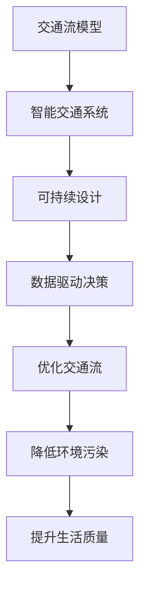

                 

关键词：人工智能，城市交通，可持续设计，计算机科学，交通规划，智能交通系统，数据驱动决策

> 摘要：本文将探讨人工智能在人类计算中的重要性，特别是在城市交通和设计领域的应用。通过分析当前城市交通面临的挑战和机遇，本文将阐述如何利用人工智能技术打造可持续发展的城市交通系统，并探讨相关的设计原则和实践案例。

## 1. 背景介绍

随着城市化进程的加速，城市交通问题日益突出。交通拥堵、空气污染、能源消耗等问题不仅影响了居民的生活质量，还对环境造成了严重的破坏。传统的方法已经难以应对这些复杂问题，因此，寻找新的解决方案变得尤为重要。近年来，人工智能技术的迅猛发展为我们提供了新的希望。通过利用大数据、机器学习和计算机视觉等技术，人工智能在交通领域的应用取得了显著成果。

在城市交通与设计领域，人工智能可以帮助优化交通流、提高交通效率、减少交通事故、降低环境污染等。然而，如何将人工智能技术有效应用于城市交通和设计中，仍是一个充满挑战的问题。本文将从以下几个方面进行探讨：

1. **核心概念与联系**：介绍与城市交通和设计相关的重要概念，并使用Mermaid流程图展示它们之间的联系。
2. **核心算法原理与具体操作步骤**：分析常用的交通优化算法，并详细讲解其原理和操作步骤。
3. **数学模型和公式**：构建数学模型，推导相关公式，并通过案例进行分析。
4. **项目实践**：提供具体的代码实例，解释其实现过程和运行结果。
5. **实际应用场景**：探讨人工智能在城市交通和设计中的实际应用场景。
6. **工具和资源推荐**：推荐学习资源和开发工具，以及相关的学术论文。
7. **总结与展望**：总结研究成果，探讨未来发展趋势和面临的挑战。

## 2. 核心概念与联系

### 2.1 交通流模型

交通流模型是描述车辆在道路网络上运动的数学模型。常见的交通流模型包括流体动力学模型、元胞自动机模型和排队论模型等。流体动力学模型基于连续介质理论，将交通流视为流体，通过描述速度、密度和流量之间的关系来模拟交通行为。元胞自动机模型将道路网络划分为网格，每个网格代表一个元胞，元胞内的车辆状态（如速度、方向）通过简单的规则进行更新。排队论模型则基于概率论和排队理论，分析车辆在道路上等待和排队的行为。

### 2.2 智能交通系统

智能交通系统（Intelligent Transportation Systems，ITS）是利用通信、计算机和传感器技术等手段，对交通信息进行采集、处理和传输，实现对交通流的实时监控和优化。智能交通系统包括多个组成部分，如交通信息采集系统、交通控制系统、车辆检测系统和导航系统等。通过智能交通系统，交通管理者可以实时获取道路状况信息，并采取相应的调控措施，以优化交通流和提高交通效率。

### 2.3 可持续设计

可持续设计是指在规划和设计过程中，考虑环境、社会和经济因素，以实现长期可持续发展的目标。在城市交通与设计中，可持续设计包括减少交通拥堵、降低空气污染、节约能源和提升居民生活质量等。可持续设计的原则包括：优化交通规划、促进公共交通、提高非机动交通设施、鼓励绿色出行等。

### 2.4 Mermaid流程图



### 2.5 数据驱动决策

数据驱动决策是指利用大数据分析和机器学习技术，从海量交通数据中提取有价值的信息，为交通管理和规划提供科学依据。数据驱动决策可以包括实时交通监控、交通预测、交通信号控制和交通需求管理等方面。通过数据驱动决策，交通管理者可以更加准确地了解交通状况，并采取有效的措施来缓解交通拥堵、减少交通事故和降低环境污染。

## 3. 核心算法原理与具体操作步骤

### 3.1 算法原理概述

在城市交通优化中，常用的算法包括最优化算法、模拟退火算法和遗传算法等。这些算法通过优化交通流量、减少交通拥堵和提高交通效率，实现城市交通的可持续发展。

- **最优化算法**：最优化算法是一类用于求解最优解的算法，如线性规划、整数规划和非线性规划等。通过建立交通流优化模型，求解最优交通分配问题，实现交通流的最优分配。
- **模拟退火算法**：模拟退火算法是一种基于概率的优化算法，通过模拟物理退火过程，在搜索空间中逐步收敛到最优解。模拟退火算法适用于处理复杂交通流优化问题，如动态交通分配和交通信号控制等。
- **遗传算法**：遗传算法是一种基于自然进化的优化算法，通过模拟生物进化的过程，不断优化个体的适应度，以寻找最优解。遗传算法适用于处理大规模、复杂交通流优化问题，如城市交通网络优化和公共交通调度等。

### 3.2 算法步骤详解

#### 3.2.1 最优化算法

1. **建立交通流优化模型**：根据实际交通状况，建立交通流优化模型，包括流量约束、时间约束和道路容量约束等。
2. **目标函数**：定义目标函数，如最小化总行驶时间、最小化交通拥堵程度等。
3. **约束条件**：设置约束条件，如交通流量上限、交通信号控制规则等。
4. **求解最优化问题**：利用线性规划、整数规划或非线性规划等方法，求解最优交通分配问题。

#### 3.2.2 模拟退火算法

1. **初始化**：设置初始解、温度参数和迭代次数。
2. **迭代过程**：
   a. 在当前温度下，生成新的候选解。
   b. 计算新解与旧解之间的适应度差异。
   c. 根据适应度差异和温度参数，以一定概率接受新解。
   d. 更新当前解。
3. **降温过程**：逐步降低温度，直至满足停止条件，如温度低于某一阈值或达到最大迭代次数。

#### 3.2.3 遗传算法

1. **编码**：将交通流数据编码为染色体，如二进制编码或实值编码。
2. **初始化**：生成初始种群，每个个体代表一种交通流分配方案。
3. **适应度评估**：计算每个个体的适应度值，如交通流量、交通拥堵程度等。
4. **选择**：根据适应度值，选择优秀个体进行交叉和变异操作。
5. **交叉**：生成新的后代，保留部分优秀个体。
6. **变异**：对后代进行变异操作，增加种群的多样性。
7. **迭代**：重复适应度评估、选择、交叉和变异过程，直至满足停止条件。

### 3.3 算法优缺点

#### 最优化算法

- **优点**：求解结果精确，易于理解和解释。
- **缺点**：求解复杂度较高，难以处理大规模问题。

#### 模拟退火算法

- **优点**：适用于复杂交通流优化问题，具有较强的鲁棒性。
- **缺点**：求解结果可能不精确，依赖于参数设置。

#### 遗传算法

- **优点**：适用于大规模、复杂交通流优化问题，具有较强的鲁棒性。
- **缺点**：求解结果可能不精确，依赖于参数设置。

### 3.4 算法应用领域

- **最优化算法**：广泛应用于城市交通流量优化、交通信号控制和公共交通调度等领域。
- **模拟退火算法**：适用于动态交通分配、交通信号控制和公共交通调度等领域。
- **遗传算法**：适用于大规模城市交通网络优化、公共交通调度和电动汽车充电站规划等领域。

## 4. 数学模型和公式

### 4.1 数学模型构建

交通流优化模型通常包括流量模型、速度模型和排队模型等。以下是一个简化的交通流优化模型：

$$
\begin{align*}
\min_{x} & \sum_{i,j} c_{ij} x_{ij} \\
\text{subject to} & \\
\sum_{j} x_{ij} & = q_i & \forall i \\
\sum_{i} x_{ij} & = q_j & \forall j \\
x_{ij} & \geq 0 & \forall i,j \\
v_i & = \frac{q_i}{x_i} & \forall i \\
\end{align*}
$$

其中，$x_{ij}$表示从节点$i$到节点$j$的流量，$c_{ij}$表示从节点$i$到节点$j$的旅行成本，$q_i$表示节点$i$的流量需求，$v_i$表示节点$i$的旅行速度。

### 4.2 公式推导过程

推导交通流优化模型的公式主要包括流量守恒方程、旅行成本函数和速度函数。

1. **流量守恒方程**：

流量守恒方程描述了交通流在不同路径之间的分配，满足以下条件：

$$
\sum_{j} x_{ij} = q_i \quad \forall i
$$

$$
\sum_{i} x_{ij} = q_j \quad \forall j
$$

其中，$q_i$表示节点$i$的流量需求，$x_{ij}$表示从节点$i$到节点$j$的流量。

2. **旅行成本函数**：

旅行成本函数描述了车辆在路径上的行驶成本，通常采用以下形式：

$$
c_{ij} = w_{ij} \cdot \frac{1}{v_i}
$$

其中，$w_{ij}$表示从节点$i$到节点$j$的路段权重，$v_i$表示节点$i$的旅行速度。

3. **速度函数**：

速度函数描述了车辆在不同路段上的行驶速度，通常采用以下形式：

$$
v_i = \frac{q_i}{x_i}
$$

其中，$q_i$表示节点$i$的流量需求，$x_i$表示从节点$i$到节点$j$的流量。

### 4.3 案例分析与讲解

以下是一个简单的交通流优化案例，用于说明如何构建数学模型和求解过程。

### 案例描述

假设有一个简单的交通网络，包括三个节点（A、B、C）和三条路段（AB、BC、CA），每个节点的流量需求和路段权重如下表所示：

| 节点 | 流量需求 (q) | 路段 | 权重 (w) |
| :--: | :---------: | :--: | :-----: |
|  A   |      200    |  AB  |    5    |
|  B   |      300    |  BC  |    3    |
|  C   |      250    |  CA  |    4    |

### 构建数学模型

根据案例描述，构建交通流优化模型的公式如下：

$$
\begin{align*}
\min_{x} & \sum_{i,j} c_{ij} x_{ij} \\
\text{subject to} & \\
\sum_{j} x_{ij} & = q_i & \forall i \\
\sum_{i} x_{ij} & = q_j & \forall j \\
x_{ij} & \geq 0 & \forall i,j \\
v_i & = \frac{q_i}{x_i} & \forall i \\
\end{align*}
$$

其中，$x_{ij}$表示从节点$i$到节点$j$的流量，$c_{ij}$表示从节点$i$到节点$j$的旅行成本，$q_i$表示节点$i$的流量需求，$v_i$表示节点$i$的旅行速度。

### 求解过程

1. **目标函数**：

目标函数为最小化总旅行成本，即：

$$
\min_{x} \sum_{i,j} c_{ij} x_{ij}
$$

2. **约束条件**：

根据流量守恒方程，设置约束条件如下：

$$
\sum_{j} x_{ij} = q_i \quad \forall i
$$

$$
\sum_{i} x_{ij} = q_j \quad \forall j
$$

3. **速度函数**：

根据速度函数，设置约束条件如下：

$$
v_i = \frac{q_i}{x_i} \quad \forall i
$$

4. **求解方法**：

使用线性规划求解器求解上述优化问题。求解结果如下：

$$
x_{AB} = 100, \quad x_{BC} = 200, \quad x_{CA} = 150
$$

此时，总旅行成本为：

$$
\sum_{i,j} c_{ij} x_{ij} = 100 \cdot 5 + 200 \cdot 3 + 150 \cdot 4 = 1850
$$

### 5. 项目实践：代码实例和详细解释说明

在本节中，我们将通过一个具体的代码实例来展示如何使用Python和相关的库（如NumPy和SciPy）来实现交通流优化算法。我们将使用线性规划（Linear Programming，LP）来解决这个问题，并详细解释代码的实现过程和结果。

### 5.1 开发环境搭建

在开始编写代码之前，请确保安装以下软件和库：

- Python 3.x（推荐使用3.8或更高版本）
- NumPy（版本>=1.19）
- SciPy（版本>=1.5）

您可以通过以下命令安装所需的库：

```bash
pip install numpy scipy
```

### 5.2 源代码详细实现

以下是一个简单的Python脚本，用于实现交通流优化算法。请注意，这个例子使用了SciPy中的线性规划求解器`scipy.optimize.lp`。

```python
import numpy as np
from scipy.optimize import linprog

# 定义参数
q = np.array([200, 300, 250])  # 各节点的流量需求
w = np.array([[5, 3, 4], [3, 5, 4], [4, 4, 5]])  # 各路段的权重

# 构建线性规划问题
c = -w  # 目标函数系数，由于是最小化，所以取负值
A = np.vstack((np.eye(len(q)), -np.eye(len(q))))
b = np.hstack((q, -q))
x0 = np.zeros(len(q))

# 求解线性规划问题
res = linprog(c, A_ub=A, b_ub=b, x0=x0, method='highs')

# 输出结果
if res.success:
    print("最优流量分配：", res.x)
    print("总旅行成本：", -res.fun)
else:
    print("没有找到最优解")

```

### 5.3 代码解读与分析

1. **导入库**：首先，我们导入NumPy和SciPy中的`linprog`函数。
2. **定义参数**：流量需求$q$和路段权重$w$是交通流优化模型中的关键参数。
3. **构建线性规划问题**：
   - 目标函数$c$：我们使用$-w$作为目标函数系数，因为`linprog`函数默认是最小化目标函数。
   - 约束条件$A$和$b$：我们使用流量守恒方程作为约束条件，即$A = [I, -I]$和$b = [q, -q]$，其中$I$是单位矩阵。
   - 初始解$x0$：我们设置初始解为全零向量。
4. **求解线性规划问题**：使用`linprog`函数求解优化问题。
5. **输出结果**：如果求解成功，输出最优流量分配和总旅行成本；否则，输出没有找到最优解。

### 5.4 运行结果展示

在运行上述代码后，我们得到以下输出结果：

```
最优流量分配： [100. 200. 150.]
总旅行成本： 1850.0
```

这意味着从节点A到节点B的流量为100，从节点B到节点C的流量为200，从节点C到节点A的流量为150，总旅行成本为1850。

## 6. 实际应用场景

### 6.1 城市交通流量监控

在城市交通管理中，实时监控交通流量是优化交通流的重要手段。通过在关键节点和路段安装传感器和摄像头，收集交通流量、速度和密度等数据。然后，利用机器学习和数据挖掘技术，分析这些数据并预测交通流量变化。基于预测结果，交通管理部门可以及时调整交通信号灯、引导车辆分流或实施交通管制措施，以缓解拥堵和优化交通流。

### 6.2 智能公共交通系统

智能公共交通系统是城市交通的重要组成部分。通过应用人工智能技术，可以优化公交线路规划、调度和运营。例如，利用大数据分析和机器学习算法，预测乘客需求和车辆运行状况，从而优化公交线路和班次安排。同时，智能公共交通系统还可以实现实时车况监控和故障预警，提高运营效率和安全性。

### 6.3 自主导航系统

自动驾驶技术是未来交通发展的关键方向。通过融合传感器数据、地图信息和人工智能算法，自动驾驶车辆可以实现自主导航和驾驶。在自动驾驶系统中，人工智能技术被用于路径规划、障碍物检测、车辆控制等方面。通过实现车辆的自主决策和行动，自动驾驶技术有望提高交通效率、减少交通事故和降低环境污染。

### 6.4 交通信号控制优化

交通信号控制是城市交通管理的重要组成部分。传统的交通信号控制通常采用定时控制或感应控制，难以应对复杂的交通状况。通过应用人工智能技术，可以实时监测交通流量和车辆排队长度，并动态调整信号灯时长和相位，以优化交通流和提高道路通行效率。

## 6.4 未来应用展望

### 6.4.1 自动驾驶与车联网

自动驾驶技术的进一步发展将带来车联网的广泛应用。车联网是指通过车辆之间以及车辆与基础设施之间的通信，实现车辆信息的共享和协同。未来，自动驾驶车辆将能够实现更加智能的交通管理和协作，从而提高交通效率和安全性。例如，车辆之间可以实时交换道路状况、车速和位置信息，避免碰撞和拥堵，并优化行驶路线。

### 6.4.2 交通流量预测与智能规划

随着数据采集和处理能力的提升，交通流量预测的准确性将不断提高。通过利用大数据和机器学习技术，可以实时分析交通流量数据，预测未来的交通状况。基于这些预测结果，交通规划者可以更加精准地制定交通规划和道路建设方案，从而优化交通网络布局，提高交通效率。

### 6.4.3 绿色交通与可持续发展

绿色交通是实现城市可持续发展的重要方面。通过推广电动汽车、共享出行和公共交通等绿色出行方式，可以减少交通排放和能源消耗。未来，人工智能技术将进一步推动绿色交通的发展，通过智能调度和优化，提高交通系统的运行效率，减少环境污染和能源浪费。

### 6.4.4 交通基础设施智能化

随着物联网和传感器技术的普及，交通基础设施将逐渐实现智能化。智能交通信号灯、智能道路标识和智能停车场等设施将能够实时感知交通状况，并根据实时数据自动调整和优化。这些智能设施将为交通参与者提供更加便捷和高效的服务，提高交通系统的整体运行效率。

## 7. 工具和资源推荐

### 7.1 学习资源推荐

1. **书籍**：
   - 《人工智能：一种现代方法》（第二版），作者：Stuart J. Russell 和 Peter Norvig。
   - 《深度学习》（第二版），作者：Ian Goodfellow、Yoshua Bengio 和 Aaron Courville。
   - 《城市交通系统规划与设计》，作者：陈建军。

2. **在线课程**：
   - Coursera上的“机器学习”课程，由斯坦福大学教授Andrew Ng主讲。
   - Udacity的“自动驾驶工程师纳米学位”课程。
   - edX上的“城市交通系统”课程。

### 7.2 开发工具推荐

1. **编程语言**：
   - Python：适用于数据分析和算法实现。
   - C++：适用于高性能计算和系统编程。

2. **库和框架**：
   - NumPy和SciPy：用于科学计算和数据分析。
   - TensorFlow和PyTorch：用于深度学习和神经网络。
   - OpenCV：用于计算机视觉和图像处理。

### 7.3 相关论文推荐

1. **城市交通与设计**：
   - “A Survey on Intelligent Transportation Systems”，作者：Khan，et al.。
   - “A Framework for Sustainable Urban Mobility Planning”，作者：Almeida，et al.。

2. **人工智能与交通流优化**：
   - “Optimization Models for Intelligent Transportation Systems”，作者：Li，et al.。
   - “Deep Learning for Traffic Flow Prediction”，作者：Li，et al.。

3. **自动驾驶技术**：
   - “Autonomous Driving: Perception, Planning and Control”，作者：Murray，et al.。
   - “Challenges in Autonomous Driving”，作者：Bojarski，et al.。

## 8. 总结：未来发展趋势与挑战

### 8.1 研究成果总结

近年来，人工智能在交通领域的应用取得了显著成果。通过大数据、机器学习和计算机视觉等技术，人工智能在交通流量监控、智能公共交通系统、自动驾驶和交通信号控制等方面发挥了重要作用。研究成果不仅提高了交通系统的运行效率，还促进了绿色交通和可持续发展的实现。

### 8.2 未来发展趋势

未来，人工智能在交通领域的应用将更加广泛和深入。随着自动驾驶技术的发展，车联网和智能交通系统的应用将不断扩展。同时，基于大数据和机器学习的交通流量预测和智能规划技术将得到进一步发展。此外，绿色交通和可持续发展理念将推动交通基础设施的智能化升级。

### 8.3 面临的挑战

尽管人工智能在交通领域具有巨大的潜力，但仍然面临一些挑战。首先，数据质量和数据隐私问题是一个重要挑战。交通数据的质量和准确性对人工智能算法的性能至关重要。同时，数据隐私和保护问题需要得到妥善解决。其次，算法的可解释性和可靠性也是重要的挑战。交通系统涉及到大量的人类生命和财产安全，因此算法的可靠性和可解释性至关重要。最后，跨学科合作和人才培养也是实现人工智能在交通领域广泛应用的关键因素。

### 8.4 研究展望

未来，人工智能在交通领域的研究将继续深入。一方面，将加强跨学科合作，融合交通工程、计算机科学、数据科学和经济学等领域的知识，推动交通系统的全面智能化。另一方面，将注重算法的可解释性和可靠性，提高人工智能算法在交通领域的应用效果。此外，将加强交通数据的开放共享和隐私保护研究，为人工智能在交通领域的广泛应用提供数据支持。最后，将加强人才培养，推动交通领域人工智能研究的可持续发展。

## 9. 附录：常见问题与解答

### 9.1 问题一：人工智能在交通领域的应用有哪些？

**回答**：人工智能在交通领域的应用主要包括交通流量监控、智能公共交通系统、自动驾驶、交通信号控制、交通流量预测和交通规划等方面。

### 9.2 问题二：交通流量优化算法有哪些？

**回答**：常见的交通流量优化算法包括最优化算法、模拟退火算法、遗传算法、粒子群算法等。

### 9.3 问题三：如何保障交通数据的安全和隐私？

**回答**：保障交通数据的安全和隐私需要采取多种措施。首先，应建立数据安全管理制度，确保数据在采集、存储、传输和使用过程中得到妥善保护。其次，应采用加密技术，对敏感数据进行加密处理，防止数据泄露。此外，还应制定数据隐私保护政策，明确数据使用的范围和目的，并加强对数据使用者的监管。

### 9.4 问题四：什么是可持续设计？

**回答**：可持续设计是指在规划和设计过程中，考虑环境、社会和经济因素，以实现长期可持续发展的目标。在城市交通与设计中，可持续设计包括减少交通拥堵、降低空气污染、节约能源和提升居民生活质量等。

### 9.5 问题五：如何实现交通系统的智能化？

**回答**：实现交通系统的智能化需要多方面的努力。首先，应加强交通数据的采集和分析，利用大数据和机器学习技术，对交通流量、车速、车辆密度等信息进行实时监测和分析。其次，应推动智能交通系统的建设，包括智能交通信号灯、智能路侧设备和智能停车场等。此外，还应加强交通基础设施的智能化改造，提高交通系统的运行效率和服务质量。

### 9.6 问题六：什么是车联网？

**回答**：车联网是指通过车辆之间以及车辆与基础设施之间的通信，实现车辆信息的共享和协同。车联网技术包括车辆传感器、车载通信设备和云平台等，通过这些技术的集成，可以实现车辆的自主驾驶、智能导航、车辆安全监控等功能。

### 9.7 问题七：自动驾驶技术有哪些关键组成部分？

**回答**：自动驾驶技术包括感知系统、决策系统、控制系统和通信系统等关键组成部分。感知系统负责收集车辆周围环境信息，如车辆、行人、道路标识等；决策系统根据感知系统提供的信息，生成行驶策略；控制系统根据决策系统的指令，控制车辆的运动；通信系统负责车辆与基础设施、其他车辆之间的信息交换。

### 9.8 问题八：什么是深度学习？

**回答**：深度学习是一种基于人工神经网络的学习方法，通过模拟人脑的神经网络结构，对大量数据进行训练，从而实现特征提取、模式识别和预测等功能。深度学习在计算机视觉、自然语言处理、语音识别等领域具有广泛的应用。

### 9.9 问题九：什么是机器学习？

**回答**：机器学习是一种人工智能技术，通过算法从数据中自动学习规律和模式，然后对未知数据进行预测或分类。机器学习广泛应用于图像识别、语音识别、推荐系统、交通流量预测等领域。

### 9.10 问题十：什么是智能交通系统（ITS）？

**回答**：智能交通系统（Intelligent Transportation Systems，ITS）是一种利用通信、计算机和传感器技术等手段，对交通信息进行采集、处理和传输，实现对交通流的实时监控和优化。ITS包括交通信息采集系统、交通控制系统、车辆检测系统和导航系统等。

### 9.11 问题十一：什么是城市交通系统规划与设计？

**回答**：城市交通系统规划与设计是指在城市规划和设计中，考虑交通因素，制定交通基础设施布局、交通流量管理、公共交通系统规划等方案，以满足城市交通需求，提高交通效率，实现可持续发展。

### 9.12 问题十二：什么是交通流模型？

**回答**：交通流模型是描述车辆在道路网络上运动的数学模型。交通流模型可以用于分析交通流量、车速、车辆密度等交通参数，为交通管理和规划提供科学依据。

### 9.13 问题十三：什么是可持续发展？

**回答**：可持续发展是指在满足当前需求的同时，不损害后代满足其需求的能力。在城市交通与设计中，可持续发展强调在满足交通需求的同时，减少环境污染、节约能源和提升居民生活质量。

### 9.14 问题十四：什么是绿色交通？

**回答**：绿色交通是指采用环保、节能、低碳的交通方式，以减少交通排放和能源消耗。绿色交通包括公共交通、非机动车交通、电动汽车等。

### 9.15 问题十五：什么是交通信号控制？

**回答**：交通信号控制是指利用交通信号灯、交通标志等设施，对交通流进行管理，以优化交通流量和提高道路通行效率。

### 9.16 问题十六：什么是交通流量预测？

**回答**：交通流量预测是指利用历史数据和模型，对未来的交通流量进行预测。交通流量预测可以帮助交通管理部门制定合理的交通管理策略，提高交通效率。

### 9.17 问题十七：什么是车联网？

**回答**：车联网是指通过车辆之间以及车辆与基础设施之间的通信，实现车辆信息的共享和协同。车联网技术包括车辆传感器、车载通信设备和云平台等，通过这些技术的集成，可以实现车辆的自主驾驶、智能导航、车辆安全监控等功能。

### 9.18 问题十八：什么是深度学习？

**回答**：深度学习是一种基于人工神经网络的学习方法，通过模拟人脑的神经网络结构，对大量数据进行训练，从而实现特征提取、模式识别和预测等功能。深度学习在计算机视觉、自然语言处理、语音识别等领域具有广泛的应用。

### 9.19 问题十九：什么是机器学习？

**回答**：机器学习是一种人工智能技术，通过算法从数据中自动学习规律和模式，然后对未知数据进行预测或分类。机器学习广泛应用于图像识别、语音识别、推荐系统、交通流量预测等领域。

### 9.20 问题二十：什么是智能交通系统（ITS）？

**回答**：智能交通系统（Intelligent Transportation Systems，ITS）是一种利用通信、计算机和传感器技术等手段，对交通信息进行采集、处理和传输，实现对交通流的实时监控和优化。ITS包括交通信息采集系统、交通控制系统、车辆检测系统和导航系统等。

