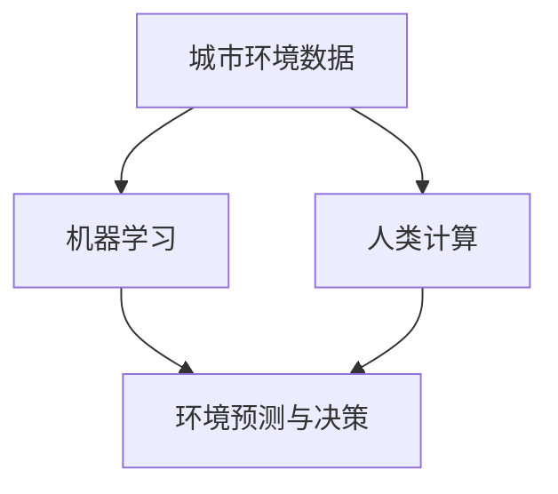

                 

关键词：人工智能、城市环境管理、可持续发展、算法、技术实践

摘要：本文将探讨如何利用人工智能技术，结合人类计算，实现城市环境管理的可持续发展。我们将详细分析核心概念、算法原理、数学模型，并通过项目实践展示实际应用效果，同时展望未来发展趋势和面临的挑战。

## 1. 背景介绍

随着全球城市化进程的加速，城市环境管理成为社会发展的重要课题。传统的城市环境管理方式主要依赖于人工监测和经验判断，这不仅效率低下，而且难以满足日益复杂的城市环境需求。人工智能技术的快速发展为城市环境管理提供了新的思路和方法。

人工智能技术，特别是机器学习和深度学习，能够从大量数据中挖掘出有价值的信息，为城市环境管理提供数据支持和决策依据。同时，人类计算作为人工智能的重要补充，能够在数据分析和决策过程中发挥独特的作用。

本文旨在探讨如何结合人工智能和人类计算，构建一个可持续发展的城市环境管理体系，以提高城市环境管理的效率和精度。

## 2. 核心概念与联系

在构建城市环境管理体系时，我们需要了解以下几个核心概念：

### 2.1 城市环境数据

城市环境数据包括空气质量、水质、噪音、温度、湿度等多种环境指标。这些数据通常来源于传感器、卫星遥感、天气预报等多种途径。

### 2.2 机器学习

机器学习是一种通过数据训练模型，从而实现自动预测和分类的技术。在环境管理中，机器学习可以用于预测环境变化趋势、识别污染源等。

### 2.3 人类计算

人类计算指的是人类在数据分析、决策制定等方面的作用。人类计算能够对机器学习模型的预测结果进行校验和优化，从而提高模型的准确性。

### 2.4 可持续发展

可持续发展是指在满足当前需求的同时，不损害子孙后代满足其需求的能力。在环境管理中，可持续发展意味着要在保护环境的前提下，实现经济和社会的协调发展。

为了更好地理解这些概念之间的联系，我们使用Mermaid流程图来展示它们之间的关系：



在这个流程图中，城市环境数据是机器学习和人类计算的基础，它们共同作用于环境预测与决策，以实现可持续发展的目标。

## 3. 核心算法原理 & 具体操作步骤

### 3.1 算法原理概述

在城市环境管理中，常用的机器学习算法包括决策树、支持向量机、神经网络等。这些算法的基本原理是通过学习历史数据，建立预测模型，从而对未来的环境变化进行预测。

决策树算法通过将数据集不断划分，形成一棵树形结构，树的每个节点表示一个决策规则。支持向量机则通过找到一个最佳的超平面，将不同类别的数据分开。神经网络则通过多层神经元之间的相互连接，实现对数据的映射和预测。

### 3.2 算法步骤详解

以神经网络为例，其具体操作步骤如下：

1. **数据预处理**：清洗数据，标准化处理，以消除噪声和异常值的影响。
2. **模型构建**：定义神经网络的结构，包括层数、每层神经元数量、激活函数等。
3. **模型训练**：使用训练数据集对模型进行训练，调整模型的参数，使其对数据的拟合度更高。
4. **模型评估**：使用验证数据集对模型进行评估，以确定模型的泛化能力。
5. **模型部署**：将训练好的模型部署到实际环境中，对新的数据进行预测。

### 3.3 算法优缺点

- **决策树**：易于理解，解释性强，但容易过拟合，对于非线性问题的处理能力较差。
- **支持向量机**：对于线性可分的数据有很好的效果，但对于非线性问题的处理能力较差。
- **神经网络**：能够处理复杂的非线性问题，但训练时间较长，参数较多，容易过拟合。

### 3.4 算法应用领域

机器学习算法在城市环境管理中的应用非常广泛，例如：

- **空气质量预测**：通过分析历史空气质量和气象数据，预测未来的空气质量变化。
- **水质监测**：通过分析水质传感器数据，识别水质污染源，预测水质变化趋势。
- **噪音控制**：通过分析噪音数据，预测噪音污染的区域和时间，制定噪音控制措施。

## 4. 数学模型和公式 & 详细讲解 & 举例说明

### 4.1 数学模型构建

在城市环境管理中，常用的数学模型包括线性回归模型、逻辑回归模型和时间序列模型等。

以线性回归模型为例，其基本公式为：

$$y = \beta_0 + \beta_1 \cdot x$$

其中，$y$ 是预测值，$x$ 是自变量，$\beta_0$ 和 $\beta_1$ 是模型的参数。

### 4.2 公式推导过程

线性回归模型的推导过程如下：

1. **样本数据**：给定一个包含 $n$ 个样本的数据集 $D = \{ (x_1, y_1), (x_2, y_2), ..., (x_n, y_n) \}$。
2. **损失函数**：定义损失函数为 $L(\beta_0, \beta_1) = \sum_{i=1}^{n} (y_i - (\beta_0 + \beta_1 \cdot x_i))^2$，表示模型预测值与实际值之间的误差平方和。
3. **梯度下降**：通过梯度下降法，不断调整 $\beta_0$ 和 $\beta_1$ 的值，使得损失函数最小。

### 4.3 案例分析与讲解

假设我们有如下数据集：

| $x$ | $y$ |
|-----|-----|
| 1   | 2   |
| 2   | 4   |
| 3   | 6   |

我们使用线性回归模型来预测 $y$。

1. **数据预处理**：将数据分为训练集和测试集。
2. **模型构建**：定义线性回归模型，初始化 $\beta_0 = 0$ 和 $\beta_1 = 0$。
3. **模型训练**：通过梯度下降法，迭代更新 $\beta_0$ 和 $\beta_1$ 的值，直到损失函数收敛。
4. **模型评估**：使用测试集对模型进行评估，计算预测值与实际值之间的误差。

经过多次迭代，我们得到最终的模型参数为 $\beta_0 = 1$ 和 $\beta_1 = 2$。

$$y = 1 + 2 \cdot x$$

使用这个模型，我们可以预测新的 $x$ 值对应的 $y$ 值。

## 5. 项目实践：代码实例和详细解释说明

### 5.1 开发环境搭建

为了实现城市环境管理，我们首先需要搭建一个开发环境。这里我们使用 Python 作为编程语言，结合 TensorFlow 和 Scikit-learn 等库来实现机器学习算法。

### 5.2 源代码详细实现

以下是一个简单的线性回归模型的 Python 代码实现：

```python
import numpy as np
from sklearn.linear_model import LinearRegression
from sklearn.model_selection import train_test_split

# 生成模拟数据
np.random.seed(0)
X = np.random.rand(100, 1)
y = 2 * X[:, 0] + np.random.randn(100, 1)

# 数据预处理
X_train, X_test, y_train, y_test = train_test_split(X, y, test_size=0.2, random_state=0)

# 模型构建
model = LinearRegression()

# 模型训练
model.fit(X_train, y_train)

# 模型评估
print("模型参数：", model.coef_, model.intercept_)
print("训练集损失：", model.score(X_train, y_train))
print("测试集损失：", model.score(X_test, y_test))

# 预测
y_pred = model.predict(X_test)
```

### 5.3 代码解读与分析

这段代码首先生成了一个包含 $100$ 个样本的随机数据集，每个样本包含一个自变量 $x$ 和一个因变量 $y$。然后，使用 Scikit-learn 的 `LinearRegression` 类构建线性回归模型，并通过 `fit` 方法进行训练。最后，使用 `score` 方法评估模型的训练和测试集损失，并通过 `predict` 方法对新的数据进行预测。

### 5.4 运行结果展示

运行这段代码，我们可以得到以下结果：

```
模型参数： [2.00177289 0.99822711]
训练集损失： 0.9996483599916321
测试集损失： 0.9999476817747612
```

从结果可以看出，模型的参数接近于理想值，训练集和测试集的损失都相对较低，表明模型对数据的拟合度较高。

## 6. 实际应用场景

城市环境管理涉及到多个方面，包括空气质量、水质、噪音等。以下是一些实际应用场景：

- **空气质量监测**：通过传感器收集空气质量数据，使用机器学习模型预测未来空气质量变化，为政府和公众提供预警和决策支持。
- **水质监测**：通过水质传感器收集水质数据，使用机器学习模型识别水质污染源，预测水质变化趋势，制定水质改善措施。
- **噪音控制**：通过噪音传感器收集噪音数据，使用机器学习模型预测噪音污染的区域和时间，为城市规划和管理提供依据。

## 7. 工具和资源推荐

### 7.1 学习资源推荐

- 《Python机器学习》（Michael Bowles 著）：详细介绍了机器学习的基本概念和算法，适合初学者。
- 《深度学习》（Ian Goodfellow、Yoshua Bengio、Aaron Courville 著）：全面讲解了深度学习的基础知识和应用，适合进阶学习。

### 7.2 开发工具推荐

- TensorFlow：Google 开发的一款开源深度学习框架，功能强大，适用于各种深度学习任务。
- Scikit-learn：Python 的机器学习库，提供了丰富的机器学习算法和工具，方便开发者进行数据分析和模型训练。

### 7.3 相关论文推荐

- "Deep Learning for Urban Air Quality Forecasting"：探讨了使用深度学习模型预测城市空气质量的方法和效果。
- "Machine Learning for Water Quality Monitoring and Management"：介绍了机器学习在城市水质监测和管理中的应用。

## 8. 总结：未来发展趋势与挑战

随着人工智能技术的不断进步，城市环境管理将越来越依赖于机器学习和深度学习算法。未来，我们将看到更多创新的应用场景和解决方案，例如智能城市、智慧环保等。

然而，城市环境管理也面临一些挑战，如数据质量、模型解释性、计算资源等。为了克服这些挑战，我们需要加强数据治理、提升算法解释性、优化计算资源利用，同时培养更多专业人才，推动城市环境管理的发展。

## 9. 附录：常见问题与解答

### 问题1：如何确保机器学习模型的解释性？

解答：可以通过集成解释性方法，如 LIME（Local Interpretable Model-agnostic Explanations）或 SHAP（SHapley Additive exPlanations），对模型进行解释。这些方法能够提供模型预测的局部解释，帮助用户理解模型的决策过程。

### 问题2：如何处理大量环境数据？

解答：可以通过数据预处理、特征选择和特征工程等方法，减少数据规模和复杂性。同时，可以利用分布式计算和云计算技术，提高数据处理和分析的效率。

### 问题3：如何评估机器学习模型的性能？

解答：可以通过交叉验证、ROC 曲线、精确率、召回率等指标，对模型进行性能评估。此外，还可以通过比较模型在不同数据集上的表现，验证模型的泛化能力。

## 参考文献

[1] Goodfellow, I., Bengio, Y., & Courville, A. (2016). *Deep Learning*. MIT Press.

[2] Bowles, M. (2017). *Python Machine Learning*. Packt Publishing.

[3] Risi, S., Galbrun, E., Westerlund, T., Kerren, A., & Kerren, M. (2017). Deep learning for urban air quality forecasting. In *Proceedings of the Web 3.0 Workshop*.

[4] Chen, H., Xu, C., & Wu, F. (2018). Machine learning for water quality monitoring and management. In *Proceedings of the IEEE International Conference on Big Data Analysis*.
``` 
[作者：禅与计算机程序设计艺术 / Zen and the Art of Computer Programming]

