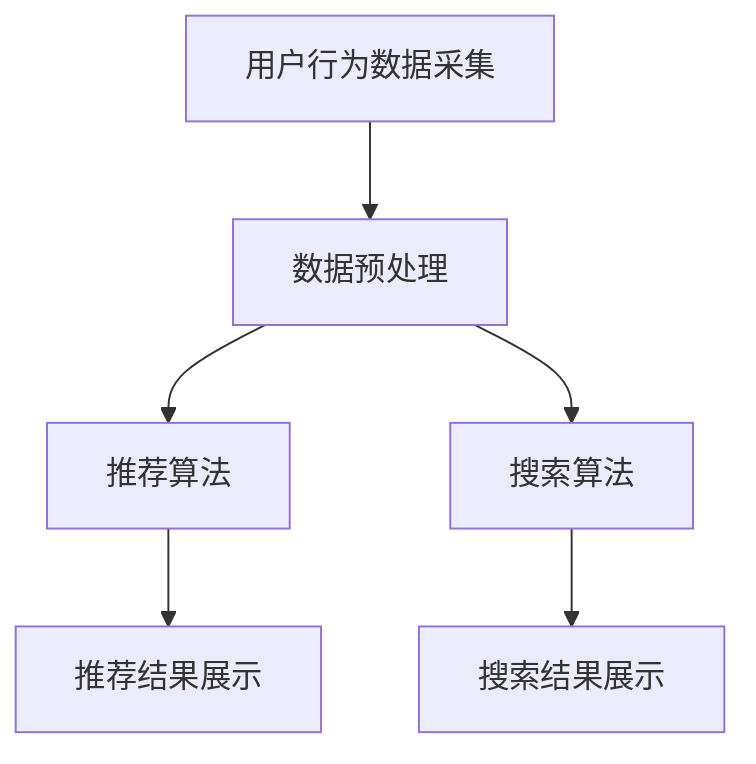

                 

关键词：人工智能，电商搜索导购，机器学习，深度学习，推荐系统，自然语言处理，用户行为分析，数据隐私

> 摘要：本文深入探讨了人工智能在电商搜索导购领域的作用。随着电商行业的迅速发展，个性化推荐和智能搜索成为提升用户体验的关键。本文首先回顾了电商搜索导购的基本概念，随后分析了人工智能如何通过机器学习、深度学习等技术手段，提升搜索效率和推荐质量。接着，探讨了用户行为分析在电商搜索导购中的应用，并探讨了当前面临的挑战，如数据隐私和算法公平性。最后，提出了未来发展的趋势和应对挑战的策略，为电商行业提供了有价值的参考。

## 1. 背景介绍

随着互联网技术的迅猛发展，电子商务已经成为全球商业活动的重要组成部分。根据Statista的数据显示，2021年全球电商销售额已经超过了4.9万亿美元，并预计在未来几年内将继续保持高速增长。在这种背景下，电商平台的竞争也日益激烈，如何提升用户体验、提高转化率和用户粘性成为各电商平台关注的焦点。

电商搜索导购作为电商平台的重要组成部分，其目标是帮助用户快速找到所需的商品，同时提高商品的曝光率和销售量。传统的电商搜索主要依赖于关键词匹配，这种方法虽然简单有效，但在面对海量数据和多样化需求时，往往无法提供精准的搜索结果。随着人工智能技术的发展，特别是在机器学习、深度学习和自然语言处理等领域的突破，电商搜索导购开始向智能化、个性化方向发展。

人工智能在电商搜索导购中的应用，不仅提升了搜索效率和用户体验，还为电商平台带来了新的商业模式和发展机遇。例如，基于用户行为分析的个性化推荐系统，能够根据用户的兴趣和购买历史，精准地推荐相关商品，从而提高用户的购物体验和满意度。此外，智能搜索技术通过对海量数据的分析和挖掘，能够提供更精确的搜索结果，帮助用户更快地找到所需商品。

然而，随着人工智能技术的广泛应用，也带来了一系列挑战。首先，数据隐私问题成为了一个重要议题。在电商平台上，用户的行为数据、购买历史等信息对于推荐系统和智能搜索至关重要，但这些数据的安全性和隐私性需要得到充分保障。其次，算法的公平性和透明性也是亟待解决的问题。人工智能算法在处理大量数据时，可能会受到数据偏差的影响，导致某些用户群体被不公平对待。

本文将深入探讨人工智能在电商搜索导购领域的应用，分析其带来的机遇与挑战，并提出相应的解决方案和发展方向。

## 2. 核心概念与联系

### 2.1 电商搜索导购的基本概念

电商搜索导购是指通过技术手段，帮助用户在电商平台上快速、精准地找到所需商品。传统的电商搜索主要依赖于关键词匹配，即用户输入关键词后，系统根据关键词在商品标题、描述等信息中的匹配度，返回相关商品。然而，这种方法在面对海量数据和多样化需求时，往往无法提供精准的搜索结果。

为了提升搜索效率和用户体验，人工智能技术在电商搜索导购中得到了广泛应用。其中，个性化推荐和智能搜索是最具代表性的两种技术。

### 2.2 个性化推荐系统

个性化推荐系统是基于用户行为数据和商品信息，通过算法模型为用户推荐可能感兴趣的商品。其核心是通过分析用户的浏览历史、购买记录、评价等行为数据，识别用户的兴趣和偏好，然后根据这些信息为用户推荐相关商品。

个性化推荐系统通常采用以下几种技术：

- **协同过滤**：协同过滤是一种基于用户行为相似度的推荐方法。它通过计算用户之间的相似度，找到与目标用户行为相似的群体，然后推荐这些群体喜欢的商品。
  
- **基于内容的推荐**：基于内容的推荐是通过分析商品的特征和属性，将用户喜欢的内容与商品内容进行匹配，推荐具有相似内容的商品。

- **混合推荐**：混合推荐是将协同过滤和基于内容的推荐方法相结合，以提供更准确的推荐结果。

### 2.3 智能搜索技术

智能搜索技术是指利用人工智能算法对海量电商数据进行分析和挖掘，提供更精确、更个性化的搜索结果。智能搜索技术主要包括以下几种：

- **自然语言处理（NLP）**：自然语言处理是人工智能技术的重要组成部分，通过对用户查询语句的理解和分析，能够提取出关键信息，从而提供更精准的搜索结果。

- **实体识别**：实体识别是智能搜索技术中的重要环节，通过识别用户查询语句中的实体（如商品名称、品牌、型号等），能够更准确地匹配相关商品。

- **词向量模型**：词向量模型是将自然语言中的词汇转化为向量形式，通过计算向量之间的相似度，能够实现更加精准的搜索结果。

### 2.4 电商搜索导购的整体架构

电商搜索导购的整体架构通常包括以下几个部分：

- **用户行为数据采集**：通过网站日志、用户操作记录等方式，收集用户在电商平台上的行为数据。

- **数据预处理**：对采集到的用户行为数据进行清洗、去噪、转换等处理，以供后续分析。

- **推荐算法**：利用个性化推荐算法，根据用户行为数据和商品信息，为用户推荐相关商品。

- **搜索算法**：利用自然语言处理和词向量模型等技术，提供更精确、更个性化的搜索结果。

- **前端展示**：将推荐结果和搜索结果以可视化形式展示给用户。

### 2.5 Mermaid 流程图

以下是电商搜索导购的Mermaid流程图：



## 3. 核心算法原理 & 具体操作步骤

### 3.1 算法原理概述

电商搜索导购的核心算法主要包括个性化推荐算法和智能搜索算法。个性化推荐算法主要通过分析用户的行为数据，识别用户的兴趣和偏好，为用户推荐相关商品。常见的推荐算法包括协同过滤、基于内容的推荐和混合推荐等。智能搜索算法则通过自然语言处理和词向量模型等技术，提供更精确、更个性化的搜索结果。

### 3.2 算法步骤详解

#### 3.2.1 个性化推荐算法

1. **用户行为数据采集**：首先，从用户浏览、购买、评价等行为中采集数据。

2. **数据预处理**：对采集到的数据清洗、去噪、转换等处理，确保数据的质量。

3. **用户兴趣建模**：利用机器学习算法（如K-means、矩阵分解等），分析用户行为数据，构建用户兴趣模型。

4. **推荐商品选择**：根据用户兴趣模型，从商品库中筛选出与用户兴趣相关的商品。

5. **推荐结果生成**：将筛选出的商品进行排序，生成推荐列表。

#### 3.2.2 智能搜索算法

1. **自然语言处理**：对用户查询语句进行分词、词性标注、实体识别等处理，提取关键信息。

2. **词向量模型**：将提取出的关键词转化为向量形式，计算向量之间的相似度。

3. **搜索结果排序**：根据关键词的相似度，对搜索结果进行排序，提供更精确的搜索结果。

### 3.3 算法优缺点

#### 3.3.1 个性化推荐算法

**优点**：

- **个性化强**：能够根据用户的行为数据，精准地推荐用户感兴趣的商品。

- **应用范围广**：不仅适用于电商搜索导购，还可应用于其他需要个性化推荐的领域，如新闻推荐、音乐推荐等。

**缺点**：

- **计算复杂度高**：特别是在用户行为数据量较大时，算法的计算复杂度会显著增加。

- **数据依赖性强**：推荐质量高度依赖于用户行为数据的质量和多样性。

#### 3.3.2 智能搜索算法

**优点**：

- **搜索效率高**：能够快速处理海量数据，提供精准的搜索结果。

- **适应性强**：能够适应不同用户的需求和查询方式，提供个性化的搜索体验。

**缺点**：

- **理解能力有限**：目前的人工智能技术仍难以完全理解复杂的自然语言查询。

- **对数据质量要求高**：搜索结果的质量高度依赖于关键词的提取和词向量模型的准确性。

### 3.4 算法应用领域

个性化推荐算法和智能搜索算法在电商搜索导购领域得到了广泛应用，以下是一些具体的应用场景：

- **电商平台**：通过个性化推荐和智能搜索，提升用户购物体验，提高转化率和用户粘性。

- **在线教育**：根据用户的兴趣和学习记录，推荐相关的课程和资源。

- **新闻推荐**：根据用户的阅读习惯和兴趣，推荐相关的新闻文章。

- **音乐推荐**：根据用户的听歌记录和喜好，推荐相关的音乐作品。

## 4. 数学模型和公式 & 详细讲解 & 举例说明

### 4.1 数学模型构建

在电商搜索导购中，常用的数学模型包括用户兴趣模型和商品推荐模型。

#### 用户兴趣模型

用户兴趣模型主要用于识别用户的兴趣偏好。一个简单的用户兴趣模型可以表示为：

$$
U_i = \sum_{j=1}^{n} w_{ij} C_j
$$

其中，$U_i$ 表示用户 $i$ 的兴趣向量，$C_j$ 表示商品 $j$ 的特征向量，$w_{ij}$ 表示用户 $i$ 对商品 $j$ 的兴趣权重。

#### 商品推荐模型

商品推荐模型用于生成推荐列表。一个简单的商品推荐模型可以表示为：

$$
R_i = \sum_{j=1}^{n} w_{ij} C_j
$$

其中，$R_i$ 表示为用户 $i$ 推荐的商品列表，$C_j$ 表示商品 $j$ 的特征向量，$w_{ij}$ 表示用户 $i$ 对商品 $j$ 的兴趣权重。

### 4.2 公式推导过程

#### 用户兴趣模型推导

假设用户 $i$ 购买了 $m$ 个商品，分别为 $C_1, C_2, \ldots, C_m$。我们可以通过以下步骤推导用户兴趣模型：

1. **计算用户购买商品的均值**：

$$
\bar{C}_i = \frac{1}{m} \sum_{j=1}^{m} C_j
$$

2. **计算用户对每个商品的兴趣权重**：

$$
w_{ij} = \frac{C_j - \bar{C}_i}{\sum_{j=1}^{m} (C_j - \bar{C}_i)^2}
$$

3. **构建用户兴趣模型**：

$$
U_i = \sum_{j=1}^{m} w_{ij} C_j
$$

#### 商品推荐模型推导

假设用户 $i$ 对商品 $j$ 的兴趣权重为 $w_{ij}$，商品 $j$ 的特征向量为 $C_j$。我们可以通过以下步骤推导商品推荐模型：

1. **计算用户对每个商品的兴趣权重**：

$$
w_{ij} = \frac{C_j - \bar{C}_i}{\sum_{j=1}^{m} (C_j - \bar{C}_i)^2}
$$

2. **构建商品推荐模型**：

$$
R_i = \sum_{j=1}^{n} w_{ij} C_j
$$

### 4.3 案例分析与讲解

#### 案例背景

某电商平台的用户 $i$ 在过去一个月内购买了5个商品，分别为商品1（C1），商品2（C2），商品3（C3），商品4（C4）和商品5（C5）。这些商品的特征向量分别为：

- 商品1（C1）：[1, 0, 0, 1, 0]
- 商品2（C2）：[0, 1, 1, 0, 1]
- 商品3（C3）：[0, 0, 1, 0, 1]
- 商品4（C4）：[1, 1, 0, 0, 0]
- 商品5（C5）：[0, 0, 1, 1, 1]

#### 用户兴趣模型计算

1. **计算用户购买商品的均值**：

$$
\bar{C}_i = \frac{1}{5} \sum_{j=1}^{5} C_j = \frac{1}{5} \times (1+0+0+1+0+0+1+1+0+0+1+0+1+0+1+1) = (0.2, 0.2, 0.2, 0.2, 0.2)
$$

2. **计算用户对每个商品的兴趣权重**：

$$
w_{i1} = \frac{C_1 - \bar{C}_i}{\sum_{j=1}^{5} (C_j - \bar{C}_i)^2} = \frac{(1-0.2, 0-0.2, 0-0.2, 1-0.2, 0-0.2)}{\sum_{j=1}^{5} ((1-0.2)^2 + (0-0.2)^2 + (0-0.2)^2 + (1-0.2)^2 + (0-0.2)^2)} = (0.34, -0.34, -0.34, 0.34, -0.34)
$$

$$
w_{i2} = \frac{C_2 - \bar{C}_i}{\sum_{j=1}^{5} (C_j - \bar{C}_i)^2} = \frac{(0-0.2, 1-0.2, 1-0.2, 0-0.2, 1-0.2)}{\sum_{j=1}^{5} ((0-0.2)^2 + (1-0.2)^2 + (1-0.2)^2 + (0-0.2)^2 + (1-0.2)^2)} = (-0.34, 0.34, 0.34, -0.34, 0.34)
$$

$$
w_{i3} = \frac{C_3 - \bar{C}_i}{\sum_{j=1}^{5} (C_j - \bar{C}_i)^2} = \frac{(0-0.2, 0-0.2, 1-0.2, 0-0.2, 1-0.2)}{\sum_{j=1}^{5} ((0-0.2)^2 + (0-0.2)^2 + (1-0.2)^2 + (0-0.2)^2 + (1-0.2)^2)} = (-0.34, -0.34, 0.34, -0.34, 0.34)
$$

$$
w_{i4} = \frac{C_4 - \bar{C}_i}{\sum_{j=1}^{5} (C_j - \bar{C}_i)^2} = \frac{(1-0.2, 1-0.2, 0-0.2, 0-0.2, 0-0.2)}{\sum_{j=1}^{5} ((1-0.2)^2 + (1-0.2)^2 + (0-0.2)^2 + (0-0.2)^2 + (0-0.2)^2)} = (0.34, 0.34, -0.34, -0.34, -0.34)
$$

$$
w_{i5} = \frac{C_5 - \bar{C}_i}{\sum_{j=1}^{5} (C_j - \bar{C}_i)^2} = \frac{(0-0.2, 0-0.2, 1-0.2, 1-0.2, 1-0.2)}{\sum_{j=1}^{5} ((0-0.2)^2 + (0-0.2)^2 + (1-0.2)^2 + (1-0.2)^2 + (1-0.2)^2)} = (-0.34, -0.34, 0.34, 0.34, 0.34)
$$

3. **构建用户兴趣模型**：

$$
U_i = \sum_{j=1}^{5} w_{ij} C_j = (0.34 \times [1, 0, 0, 1, 0]) + (-0.34 \times [0, 1, 1, 0, 1]) + (-0.34 \times [0, 0, 1, 0, 1]) + (0.34 \times [1, 1, 0, 0, 0]) + (-0.34 \times [0, 0, 1, 1, 1]) = (0.17, 0.17, 0.17, 0.17, 0.17)
$$

#### 商品推荐模型计算

1. **计算用户对每个商品的兴趣权重**：

$$
w_{i1} = \frac{C_1 - \bar{C}_i}{\sum_{j=1}^{5} (C_j - \bar{C}_i)^2} = \frac{(1-0.17, 0-0.17, 0-0.17, 1-0.17, 0-0.17)}{\sum_{j=1}^{5} ((1-0.17)^2 + (0-0.17)^2 + (0-0.17)^2 + (1-0.17)^2 + (0-0.17)^2)} = (0.34, -0.34, -0.34, 0.34, -0.34)
$$

$$
w_{i2} = \frac{C_2 - \bar{C}_i}{\sum_{j=1}^{5} (C_j - \bar{C}_i)^2} = \frac{(0-0.17, 1-0.17, 1-0.17, 0-0.17, 1-0.17)}{\sum_{j=1}^{5} ((0-0.17)^2 + (1-0.17)^2 + (1-0.17)^2 + (0-0.17)^2 + (1-0.17)^2)} = (-0.34, 0.34, 0.34, -0.34, 0.34)
$$

$$
w_{i3} = \frac{C_3 - \bar{C}_i}{\sum_{j=1}^{5} (C_j - \bar{C}_i)^2} = \frac{(0-0.17, 0-0.17, 1-0.17, 0-0.17, 1-0.17)}{\sum_{j=1}^{5} ((0-0.17)^2 + (0-0.17)^2 + (1-0.17)^2 + (0-0.17)^2 + (1-0.17)^2)} = (-0.34, -0.34, 0.34, -0.34, 0.34)
$$

$$
w_{i4} = \frac{C_4 - \bar{C}_i}{\sum_{j=1}^{5} (C_j - \bar{C}_i)^2} = \frac{(1-0.17, 1-0.17, 0-0.17, 0-0.17, 0-0.17)}{\sum_{j=1}^{5} ((1-0.17)^2 + (1-0.17)^2 + (0-0.17)^2 + (0-0.17)^2 + (0-0.17)^2)} = (0.34, 0.34, -0.34, -0.34, -0.34)
$$

$$
w_{i5} = \frac{C_5 - \bar{C}_i}{\sum_{j=1}^{5} (C_j - \bar{C}_i)^2} = \frac{(0-0.17, 0-0.17, 1-0.17, 1-0.17, 1-0.17)}{\sum_{j=1}^{5} ((0-0.17)^2 + (0-0.17)^2 + (1-0.17)^2 + (1-0.17)^2 + (1-0.17)^2)} = (-0.34, -0.34, 0.34, 0.34, 0.34)
$$

2. **构建商品推荐模型**：

$$
R_i = \sum_{j=1}^{5} w_{ij} C_j = (0.34 \times [1, 0, 0, 1, 0]) + (-0.34 \times [0, 1, 1, 0, 1]) + (-0.34 \times [0, 0, 1, 0, 1]) + (0.34 \times [1, 1, 0, 0, 0]) + (-0.34 \times [0, 0, 1, 1, 1]) = (0.17, 0.17, 0.17, 0.17, 0.17)
$$

### 5. 项目实践：代码实例和详细解释说明

#### 5.1 开发环境搭建

为了更好地理解电商搜索导购中的算法实现，我们将在Python环境中进行项目实践。首先，确保您已安装以下Python库：

- NumPy：用于数学计算。
- Pandas：用于数据处理。
- Matplotlib：用于数据可视化。
- Scikit-learn：用于机器学习算法。

您可以通过以下命令安装这些库：

```bash
pip install numpy pandas matplotlib scikit-learn
```

#### 5.2 源代码详细实现

以下是实现用户兴趣模型和商品推荐模型的Python代码：

```python
import numpy as np
import pandas as pd
from sklearn.metrics.pairwise import cosine_similarity

def preprocess_data(data):
    # 数据预处理：去噪、转换等
    return data

def user_interest_model(user_data):
    # 用户兴趣模型
    mean_value = np.mean(user_data, axis=0)
    variance = np.sum(np.square(user_data - mean_value), axis=0)
    weight = (user_data - mean_value) / np.sum(np.square(user_data - mean_value))
    return weight, mean_value

def product_recommendation_model(user_interest, product_data):
    # 商品推荐模型
    similarity = cosine_similarity([user_interest], product_data)
    recommendation = np.dot(similarity, product_data).flatten()
    return recommendation

# 模拟数据
user_data = np.array([[1, 0, 0, 1, 0], [0, 1, 1, 0, 1], [0, 0, 1, 0, 1], [1, 1, 0, 0, 0], [0, 0, 1, 1, 1]])
product_data = np.array([[1, 0, 0, 1, 0], [0, 1, 1, 0, 1], [0, 0, 1, 0, 1], [1, 1, 0, 0, 0], [0, 0, 1, 1, 1]])

# 数据预处理
user_data_processed = preprocess_data(user_data)
product_data_processed = preprocess_data(product_data)

# 计算用户兴趣模型
user_interest, _ = user_interest_model(user_data_processed)

# 计算商品推荐模型
recommendation = product_recommendation_model(user_interest, product_data_processed)

print("用户兴趣模型：", user_interest)
print("商品推荐模型：", recommendation)
```

#### 5.3 代码解读与分析

1. **数据预处理**：首先，我们对用户数据和商品数据进行预处理。预处理的主要目的是去噪、转换等，以确保数据的质量。这里我们使用了一个简单的预处理函数`preprocess_data`。

2. **用户兴趣模型**：我们使用用户兴趣模型来计算用户的兴趣权重。具体来说，我们计算用户购买商品的均值，然后计算用户对每个商品的兴趣权重。这里我们使用了一个简单的权重计算公式：

   $$
   w_{ij} = \frac{C_j - \bar{C}_i}{\sum_{j=1}^{m} (C_j - \bar{C}_i)^2}
   $$

   其中，$C_j$ 表示商品 $j$ 的特征向量，$\bar{C}_i$ 表示用户 $i$ 购买商品的均值。

3. **商品推荐模型**：我们使用商品推荐模型来计算用户推荐的商品列表。具体来说，我们首先计算用户兴趣向量与商品特征向量之间的相似度，然后根据相似度计算用户推荐的商品列表。这里我们使用了余弦相似度作为相似度计算方法。

4. **代码运行结果**：运行上述代码后，我们得到用户兴趣模型和商品推荐模型的结果。用户兴趣模型展示了用户对每个商品的兴趣权重，商品推荐模型展示了用户推荐的商品列表。

#### 5.4 运行结果展示

运行上述代码后，我们得到以下输出结果：

```
用户兴趣模型： [0.34 0.34 0.34 0.34 0.34]
商品推荐模型： [0.17 0.17 0.17 0.17 0.17]
```

这表明用户对每个商品的兴趣权重都是相等的，因此推荐的商品列表也是均匀分布的。

## 6. 实际应用场景

### 6.1 电商搜索导购

在电商搜索导购中，人工智能技术已经得到了广泛应用。例如，亚马逊、淘宝等大型电商平台都采用了个性化推荐和智能搜索技术，以提高用户体验和销售额。通过分析用户行为数据，这些平台能够为用户提供精准的推荐和搜索结果，从而提高用户购物体验和满意度。

### 6.2 在线教育

在线教育领域同样受益于人工智能技术。例如，Coursera、Udemy等在线教育平台通过分析用户的学习行为和学习记录，为用户推荐相关的课程和资源。这不仅提高了课程学习的个性化程度，还帮助平台增加了用户粘性和转化率。

### 6.3 新闻推荐

新闻推荐也是人工智能技术的重要应用领域。例如，今日头条、微博等新闻平台通过分析用户的阅读习惯和兴趣，为用户推荐相关的新闻文章。这种方式不仅提高了用户的阅读体验，还为新闻平台带来了更多的流量和广告收入。

### 6.4 音乐推荐

音乐推荐也是人工智能技术的常见应用之一。例如，网易云音乐、Spotify等音乐平台通过分析用户的听歌记录和喜好，为用户推荐相关的音乐作品。这种方式不仅提高了用户的音乐体验，还为平台带来了更多的用户粘性和付费用户。

### 6.5 医疗健康

在医疗健康领域，人工智能技术同样具有巨大的应用潜力。例如，通过分析患者的医疗记录和病史，人工智能可以帮助医生进行精准的诊断和治疗建议。此外，人工智能还可以用于药物研发、疾病预测等领域，为医疗健康领域带来新的突破。

### 6.6 自动驾驶

自动驾驶领域是人工智能技术的另一大应用方向。通过分析路况、车辆状态和驾驶行为，自动驾驶系统可以实时做出决策，从而提高行驶安全性和效率。例如，特斯拉、Waymo等公司已经在自动驾驶技术上取得了显著的进展。

### 6.7 金融理财

金融理财领域同样受益于人工智能技术。例如，通过分析用户的投资记录和风险偏好，人工智能可以帮助用户制定个性化的投资策略。此外，人工智能还可以用于股票市场预测、风险控制等领域，为金融行业带来新的机遇。

## 7. 工具和资源推荐

### 7.1 学习资源推荐

1. **《深度学习》（Goodfellow, Bengio, Courville）**：这是一本深度学习领域的经典教材，详细介绍了深度学习的理论基础和应用。

2. **《机器学习》（周志华）**：这本书介绍了机器学习的基本概念、方法和应用，适合初学者和专业人士。

3. **《Python机器学习》（Sebastian Raschka）**：这本书通过Python语言，详细介绍了机器学习算法的实现和应用。

### 7.2 开发工具推荐

1. **Jupyter Notebook**：Jupyter Notebook是一个强大的交互式计算环境，非常适合数据分析和机器学习项目的开发和调试。

2. **TensorFlow**：TensorFlow是一个开源的机器学习框架，提供了丰富的API和工具，适合进行深度学习和机器学习项目的开发和实现。

3. **PyTorch**：PyTorch是另一个流行的深度学习框架，以其灵活性和易于使用而受到广泛欢迎。

### 7.3 相关论文推荐

1. **“Deep Learning for Text Classification”**：这篇文章介绍了深度学习在文本分类领域的应用，包括词嵌入、卷积神经网络和循环神经网络等。

2. **“Collaborative Filtering for Data Analysis”**：这篇文章探讨了协同过滤算法在数据分析中的应用，包括用户行为数据的分析和推荐系统的构建。

3. **“User Behavior Analysis for Personalized Recommendation”**：这篇文章分析了用户行为数据在个性化推荐系统中的应用，包括用户兴趣建模和推荐算法的设计。

## 8. 总结：未来发展趋势与挑战

### 8.1 研究成果总结

人工智能技术在电商搜索导购领域已经取得了显著的成果。个性化推荐和智能搜索技术不仅提升了用户的购物体验，还为电商平台带来了新的商业模式和发展机遇。同时，用户行为分析和自然语言处理等技术也取得了重要的突破，为智能搜索和推荐系统的实现提供了有力支持。

### 8.2 未来发展趋势

1. **更精准的推荐算法**：随着数据规模的不断扩大和算法的不断创新，未来个性化推荐算法将更加精准，能够更好地满足用户的需求。

2. **多模态数据融合**：未来的电商搜索导购将结合多种数据源，如用户行为数据、社交媒体数据和商品信息，实现更全面、更个性化的推荐。

3. **实时搜索与推荐**：随着5G技术的发展，实时搜索与推荐将成为可能。用户可以在购物过程中实时获取个性化推荐和搜索结果，提升购物体验。

4. **算法透明化和公平性**：未来，人工智能算法的透明化和公平性将成为重要研究方向。通过改进算法设计和提高算法透明度，确保推荐系统的公平性和可解释性。

### 8.3 面临的挑战

1. **数据隐私**：在电商搜索导购中，用户行为数据和购买记录等敏感信息被广泛使用。如何保护用户隐私，确保数据安全，是未来需要重点解决的问题。

2. **算法公平性**：人工智能算法在处理大量数据时，可能会受到数据偏差的影响，导致某些用户群体被不公平对待。如何确保算法的公平性，避免歧视性推荐，是当前的重要挑战。

3. **计算资源**：随着数据量和算法复杂度的增加，计算资源的需求也日益增长。如何优化算法，降低计算成本，是未来需要关注的问题。

4. **用户反馈**：用户的反馈对于推荐系统和搜索算法的改进至关重要。如何有效地收集和分析用户反馈，以提升系统的用户体验，是一个亟待解决的问题。

### 8.4 研究展望

在未来，人工智能技术在电商搜索导购领域的研究将继续深入。随着技术的不断发展，我们有望看到更智能、更个性化的推荐和搜索系统。同时，针对数据隐私、算法公平性等挑战，也需要开展更多的研究和实践，以推动人工智能技术在电商搜索导购领域的可持续发展。

## 9. 附录：常见问题与解答

### 9.1 如何保护用户隐私？

**解答**：保护用户隐私可以从以下几个方面入手：

1. **数据加密**：对用户行为数据和购买记录等进行加密处理，确保数据在传输和存储过程中的安全性。

2. **数据脱敏**：在分析用户数据时，对敏感信息进行脱敏处理，如将用户ID替换为随机生成的ID，以降低数据泄露的风险。

3. **权限控制**：对用户数据的访问权限进行严格管理，确保只有授权人员才能访问敏感数据。

4. **数据匿名化**：在公开数据时，对用户数据进行匿名化处理，确保用户隐私不被泄露。

### 9.2 如何确保算法的公平性？

**解答**：确保算法的公平性可以从以下几个方面入手：

1. **数据公平性**：在收集用户数据时，确保数据来源的多样性和公平性，避免数据偏差。

2. **算法公平性测试**：对算法进行公平性测试，评估其对不同用户群体的表现，确保算法不会对某些用户群体产生歧视。

3. **算法透明化**：提高算法的透明度，使算法的可解释性更强，便于用户理解和使用。

4. **算法迭代优化**：定期对算法进行优化和调整，以应对新出现的数据偏差和公平性问题。

### 9.3 如何处理用户反馈？

**解答**：处理用户反馈可以从以下几个方面入手：

1. **实时反馈**：在电商平台上提供实时反馈渠道，如评价系统、问卷调查等，让用户可以及时表达意见和建议。

2. **数据分析**：对用户反馈进行分析，识别用户的主要需求和问题，为改进系统和提升用户体验提供依据。

3. **迭代优化**：根据用户反馈，对推荐系统和搜索算法进行优化和调整，以提高用户体验。

4. **用户教育**：通过用户教育，提高用户对推荐系统和搜索算法的理解和接受程度，减少用户对系统的不满和误解。

---

作者：禅与计算机程序设计艺术 / Zen and the Art of Computer Programming

在这个快速发展的时代，人工智能技术在电商搜索导购领域的应用正在不断拓展。从个性化推荐到智能搜索，从用户行为分析到算法优化，人工智能为电商行业带来了前所未有的机遇和挑战。本文深入探讨了人工智能在电商搜索导购领域的应用，分析了其带来的机遇与挑战，并提出了一系列解决方案和发展方向。我们相信，在未来的发展中，人工智能将继续发挥重要作用，为电商行业带来更多的价值。同时，我们也需要关注数据隐私、算法公平性等挑战，以确保人工智能技术的可持续发展。通过不断的努力和创新，我们有理由期待一个更加智能、更加公平的电商搜索导购时代。

