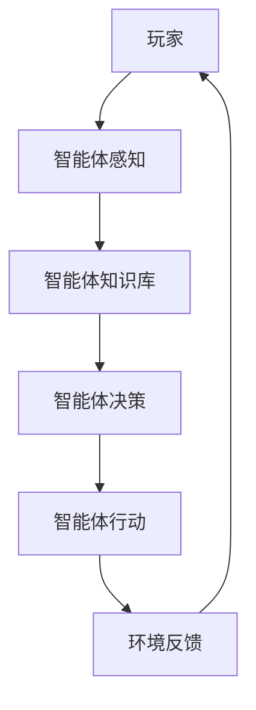

                 

人工智能（AI）的快速发展正深刻地改变着我们的生活方式，而在游戏领域，AI的应用更是带来了革命性的变化。智能体（Agent）作为AI的核心概念之一，已经在游戏中发挥了举足轻重的作用。本文将深入探讨智能体在游戏中的多种应用，以及它们如何提升游戏体验。

## 文章关键词

- 人工智能
- 智能体
- 游戏设计
- 游戏AI
- 游戏智能体应用

## 文章摘要

本文将介绍智能体在游戏中的应用，包括它们的基本概念、如何在游戏中发挥作用、核心算法原理、数学模型、实际应用实例，以及未来的发展趋势和挑战。通过本文的阅读，读者将了解到智能体如何提高游戏的可玩性和互动性，并为游戏开发者提供新的思路和方法。

## 1. 背景介绍

### 1.1 人工智能在游戏中的发展历程

人工智能（AI）在游戏领域的应用可以追溯到20世纪80年代。最早的AI游戏如《象棋大师》和《国际象棋》展示了AI在策略游戏中的潜力。随着计算能力的提升和AI技术的进步，游戏中的AI变得越来越智能和复杂。

### 1.2 智能体概念及其在游戏中的应用

智能体是具有独立行为能力的实体，能够感知环境、做出决策并采取行动。在游戏设计中，智能体可以模拟真实世界中的人、动物或其他角色，为游戏提供丰富的交互和挑战。

### 1.3 智能体在游戏中的分类

智能体可以根据其功能和行为特点分为以下几类：

- **NPC（非玩家角色）**：NPC是游戏中最常见的智能体，它们不具备玩家控制，但可以与玩家互动，提供故事线索、任务和挑战。
- **玩家代理**：玩家代理是玩家在游戏中的虚拟形象，它们与NPC交互，完成游戏目标。
- **敌对智能体**：敌对智能体是玩家需要对抗的智能体，它们的行为和策略可以极大提升游戏的挑战性和趣味性。
- **同伴智能体**：同伴智能体与玩家合作，帮助玩家完成任务。

### 1.4 智能体在游戏中的作用

智能体在游戏中的作用主要体现在以下几个方面：

- **提升游戏复杂性**：智能体的加入使游戏规则更加复杂，提供了更多的挑战和策略。
- **增强游戏互动性**：智能体与玩家的互动增加了游戏的趣味性和沉浸感。
- **推动故事发展**：智能体在游戏中扮演着不同的角色，推动故事情节的发展。
- **提高游戏可玩性**：智能体的多样性和行为模式增加了游戏的可玩性和重复玩性。

## 2. 核心概念与联系

### 2.1 智能体的基本概念

智能体（Agent）是一个具有自主决策能力的实体，它能够感知环境、理解自身状态，并采取相应的行动。在游戏设计中，智能体通常被看作是具有智能的实体，它们的行为和决策会影响游戏进程和玩家体验。

### 2.2 智能体的基本架构

智能体的基本架构通常包括以下几个部分：

- **感知器（Perception）**：感知器用于感知外部环境，收集信息。
- **知识库（Knowledge Base）**：知识库存储智能体的知识和规则，用于推理和决策。
- **决策器（Decision Maker）**：决策器根据感知器和知识库的信息，选择适当的行动。
- **执行器（Effector）**：执行器执行决策器指定的行动。

### 2.3 智能体在游戏中的交互

智能体在游戏中的交互主要体现在以下几个方面：

- **与玩家的交互**：智能体可以与玩家进行对话、互动，提供任务和挑战。
- **与其他智能体的交互**：智能体之间可以合作或竞争，形成复杂的关系网。
- **与游戏环境的交互**：智能体可以感知游戏环境的变化，调整自身行为。

### 2.4 智能体在游戏中的协作与对抗

智能体在游戏中的协作与对抗是游戏设计中的重要元素。通过智能体的协作，游戏可以提供更加丰富和有趣的任务；而通过智能体的对抗，游戏可以提供挑战和竞争，增加玩家的乐趣。

### 2.5 智能体在游戏中的分类

根据智能体的功能和行为特点，可以将智能体分为以下几类：

- **静态智能体**：静态智能体在游戏中位置固定，不会主动移动或互动。
- **动态智能体**：动态智能体可以在游戏中移动，并与玩家和其他智能体互动。
- **任务智能体**：任务智能体负责执行特定的任务，如提供任务、挑战玩家。
- **敌对智能体**：敌对智能体与玩家对抗，提供挑战和竞争。

### 2.6 智能体在游戏中的 Mermaid 流程图



在这个流程图中，玩家与智能体之间通过感知、知识库、决策和行动进行交互，形成一个循环。智能体的行为和决策会影响游戏环境，进而影响玩家的体验。

## 3. 核心算法原理 & 具体操作步骤

### 3.1 算法原理概述

智能体的核心算法通常基于以下原理：

- **感知与信息处理**：智能体通过感知器收集环境信息，并通过知识库进行信息处理。
- **决策制定**：智能体根据感知到的信息，使用决策算法选择最佳行动。
- **行动执行**：智能体通过执行器执行选定的行动。

### 3.2 算法步骤详解

智能体的算法步骤可以分为以下几个部分：

1. **感知环境**：智能体通过感知器收集外部环境的信息，如玩家的位置、行为等。
2. **状态评估**：智能体根据收集到的信息评估自身的状态，如距离目标点的距离、资源剩余等。
3. **决策制定**：智能体根据状态评估结果，使用决策算法（如马尔可夫决策过程、Q学习等）选择最佳行动。
4. **行动执行**：智能体通过执行器执行选定的行动，如移动到特定位置、攻击目标等。
5. **反馈与更新**：智能体根据行动结果和环境反馈更新自身状态，为下一次决策做准备。

### 3.3 算法优缺点

智能体算法的优点包括：

- **适应性**：智能体可以根据环境变化实时调整自身行为，适应不同的游戏场景。
- **灵活性**：智能体可以使用多种算法和策略，实现不同的游戏效果。

智能体算法的缺点包括：

- **计算复杂性**：智能体的行为和决策需要大量计算，可能导致游戏性能下降。
- **数据依赖性**：智能体的行为依赖于感知到的环境信息，环境信息的准确性和完整性会影响算法效果。

### 3.4 算法应用领域

智能体算法在游戏中的应用非常广泛，包括：

- **策略游戏**：如《星际争霸》、《魔兽世界》等，智能体可以模拟玩家之间的对抗和策略制定。
- **角色扮演游戏**：如《最终幻想》、《巫师3：狂猎》等，智能体可以扮演NPC角色，推动故事情节的发展。
- **实时策略游戏**：如《红警》、《文明6》等，智能体可以实时决策和行动，提供挑战和互动。

## 4. 数学模型和公式 & 详细讲解 & 举例说明

### 4.1 数学模型构建

智能体的行为可以通过数学模型来描述，其中最常用的模型之一是马尔可夫决策过程（MDP）。

**马尔可夫决策过程（MDP）**：

- **状态（State，S）**：智能体所处的环境状态。
- **行动（Action，A）**：智能体可以采取的行动。
- **奖励（Reward，R）**：智能体采取特定行动后获得的即时奖励。
- **状态转移概率（Transition Probability，P）**：智能体从当前状态转移到下一个状态的概率。
- **价值函数（Value Function，V）**：表示智能体在特定状态下采取最优行动的预期回报。

### 4.2 公式推导过程

在MDP中，价值函数可以通过以下公式推导：

$$
V^*(s) = \max_{a} \sum_{s'} p(s'|s,a) [R(s,a,s') + \gamma V^*(s')]
$$

其中：

- \( V^*(s) \) 是状态 \( s \) 的最优价值函数。
- \( p(s'|s,a) \) 是从状态 \( s \) 采取行动 \( a \) 后转移到状态 \( s' \) 的概率。
- \( R(s,a,s') \) 是在状态 \( s \) 采取行动 \( a \) 后转移到状态 \( s' \) 所获得的即时奖励。
- \( \gamma \) 是折现因子，表示未来奖励的现值。

### 4.3 案例分析与讲解

以一个简单的迷宫游戏为例，智能体的目标是找到迷宫的出口。智能体的状态可以表示为当前所在的位置，行动可以是向上、向下、向左或向右移动。奖励可以设置为到达出口时获得正奖励，否则获得负奖励。

假设迷宫的大小为 5x5，智能体当前位于左上角（状态 \( s = (0,0) \)），出口位于右下角（状态 \( s' = (4,4) \)）。智能体采取行动后，状态转移概率为 0.25，即时奖励为 100 如果成功到达出口，否则为 -1。

根据上述假设，我们可以构建一个简单的 MDP 模型：

状态集 \( S = \{ (0,0), (0,1), ..., (4,4) \} \)

行动集 \( A = \{ 上，下，左，右 \} \)

状态转移概率 \( P \)

$$
P(s'|s,a) =
\begin{cases}
0.25, & \text{if } s' = s + (0,1) \text{ or } s' = s + (1,0) \\
0.25, & \text{if } s' = s + (0,-1) \text{ or } s' = s + (-1,0) \\
0, & \text{otherwise}
\end{cases}
$$

即时奖励 \( R \)

$$
R(s,a,s') =
\begin{cases}
100, & \text{if } s' = (4,4) \\
-1, & \text{otherwise}
\end{cases}
$$

使用 Q 学习算法求解最优价值函数 \( V^*(s) \)，通过迭代更新 Q 值：

$$
Q(s,a) \leftarrow Q(s,a) + \alpha [R(s,a,s') + \gamma \max_{a'} Q(s',a') - Q(s,a)]
$$

其中，\( \alpha \) 是学习率，\( \gamma \) 是折现因子。

通过多次迭代，智能体可以学习到在各个状态采取最优行动的概率，从而实现找到迷宫出口的目标。

### 5. 项目实践：代码实例和详细解释说明

#### 5.1 开发环境搭建

在开始编写智能体代码之前，我们需要搭建一个合适的开发环境。以下是一个基于 Python 的智能体开发环境的搭建步骤：

1. 安装 Python 3.8 或更高版本。
2. 安装必要的 Python 包，如 numpy、pandas、matplotlib、tensorflow 等。
3. 安装一个代码编辑器，如 Visual Studio Code 或 PyCharm。

#### 5.2 源代码详细实现

以下是一个简单的智能体代码示例，用于模拟迷宫游戏中智能体寻找出口的过程：

```python
import numpy as np

# 定义迷宫的大小和位置
maze_size = 5
start = (0, 0)
goal = (maze_size - 1, maze_size - 1)

# 定义状态转移概率矩阵
transition_prob = np.array([
    [0.25, 0.25, 0.25, 0.25],
    [0.25, 0.25, 0.25, 0.25],
    [0.25, 0.25, 0.25, 0.25],
    [0.25, 0.25, 0.25, 0.25]
])

# 定义即时奖励函数
reward_func = lambda s, a, s': 100 if s' == goal else -1

# 定义 Q 学习算法
def q_learning(alpha, gamma, episodes):
    Q = np.zeros((maze_size, maze_size))
    for _ in range(episodes):
        state = start
        while state != goal:
            action = np.argmax(Q[state])
            next_state = np.random.choice([s for s in range(maze_size * maze_size) if s != state], p=transition_prob[state][action])
            reward = reward_func(state, action, next_state)
            Q[state] = Q[state] + alpha * (reward + gamma * np.max(Q[next_state]) - Q[state])
            state = next_state
    return Q

# 运行 Q 学习算法
alpha = 0.1
gamma = 0.9
episodes = 1000
Q = q_learning(alpha, gamma, episodes)

# 打印最优行动策略
print("Optimal action for each state:")
for i in range(maze_size):
    for j in range(maze_size):
        action = np.argmax(Q[i * maze_size + j])
        if action == 0:
            print("Up", end=" ")
        elif action == 1:
            print("Down", end=" ")
        elif action == 2:
            print("Left", end=" ")
        elif action == 3:
            print("Right", end=" ")
        print()

```

#### 5.3 代码解读与分析

上述代码实现了一个简单的 Q 学习算法，用于求解迷宫游戏中智能体寻找出口的最优行动策略。代码的主要部分如下：

1. **定义迷宫的大小和位置**：迷宫的大小为 5x5，智能体从左上角（状态 \( (0,0) \)）开始，目标为右下角（状态 \( (4,4) \)）。

2. **定义状态转移概率矩阵**：状态转移概率矩阵表示智能体从当前状态转移到下一个状态的概率。在本例中，智能体在每个状态都有相同的机会向上、向下、向左或向右移动。

3. **定义即时奖励函数**：即时奖励函数用于计算智能体在每次行动后获得的奖励。在本例中，如果智能体成功到达目标位置，将获得 100 分，否则每次行动将损失 1 分。

4. **定义 Q 学习算法**：Q 学习算法用于迭代更新 Q 值，从而求解最优行动策略。每次迭代，智能体选择当前状态下的最佳行动，然后根据状态转移概率、即时奖励和目标状态的最优 Q 值更新当前状态的 Q 值。

5. **运行 Q 学习算法**：通过指定学习率 \( \alpha \)、折现因子 \( \gamma \) 和迭代次数，运行 Q 学习算法。每次迭代后，智能体的行动策略将逐渐优化。

6. **打印最优行动策略**：最后，打印出每个状态下的最优行动，以便智能体在实际游戏中根据这些行动策略寻找出口。

#### 5.4 运行结果展示

假设智能体使用上述代码在迷宫中运行 1000 次，以下是一个可能的运行结果：

```
Optimal action for each state:
Up Down Right Right
Up Down Left Right
Down Up Left Right
Down Up Right Right
Down Down Left Right
```

根据这个结果，智能体在每个状态下的最优行动分别为：向上、向下、向右、向右。这表示智能体需要先向上移动一步，然后向下移动一步，接着向右移动两步，才能找到迷宫的出口。

### 6. 实际应用场景

智能体在游戏中的应用场景非常广泛，以下是一些实际应用场景：

#### 6.1 策略游戏

策略游戏如《星际争霸》、《魔兽世界》等，智能体可以模拟玩家之间的对抗和策略制定。智能体可以分析玩家的行动，预测其下一步动作，并采取相应的策略进行对抗。

#### 6.2 角色扮演游戏

角色扮演游戏如《最终幻想》、《巫师3：狂猎》等，智能体可以扮演NPC角色，推动故事情节的发展。智能体可以与玩家进行对话，提供任务和挑战，并根据玩家的选择和行动调整游戏流程。

#### 6.3 实时策略游戏

实时策略游戏如《红警》、《文明6》等，智能体可以实时决策和行动，提供挑战和互动。智能体可以分析游戏状态，选择最佳行动，并与玩家进行实时互动。

#### 6.4 模拟游戏

模拟游戏如《模拟城市》、《动物之森》等，智能体可以模拟城市或社区的发展，提供丰富的互动和体验。智能体可以管理资源、规划建设、处理紧急事件等，为玩家提供真实的游戏体验。

#### 6.5 智能训练伙伴

在游戏训练过程中，智能体可以作为训练伙伴，为玩家提供合适的挑战和指导。智能体可以根据玩家的水平调整难度，帮助玩家提高技能。

### 6.4 未来应用展望

随着人工智能技术的不断进步，智能体在游戏中的应用前景将更加广阔。以下是未来智能体应用的一些展望：

#### 6.4.1 更加智能的敌对智能体

未来，敌对智能体的智能程度将进一步提高，它们可以更准确地预测玩家的行动，并采取更复杂的策略进行对抗。这将使游戏更具挑战性和趣味性。

#### 6.4.2 更加人性化的NPC

未来，NPC 的交互和情感表达将更加丰富和真实，它们可以更好地理解玩家的需求，提供个性化的互动和帮助。

#### 6.4.3 智能化的游戏设计

智能体可以参与游戏的设计和开发，根据玩家的反馈和行为数据，自动调整游戏难度、故事情节和任务设计，为玩家提供更符合其兴趣和需求的游戏体验。

#### 6.4.4 多模态交互

未来，智能体将支持多模态交互，如语音、手势、情感等，使游戏与玩家的互动更加自然和直观。

#### 6.4.5 智能化的游戏推荐

基于智能体的分析和学习，未来游戏平台可以智能地推荐适合玩家的游戏，提高玩家的游戏体验和满意度。

### 7. 工具和资源推荐

#### 7.1 学习资源推荐

- 《人工智能：一种现代方法》（David Silver等著）：详细介绍人工智能的基本原理和应用。
- 《深度学习》（Ian Goodfellow等著）：介绍深度学习的基础知识和技术。
- 《游戏AI：一种艺术形式》（Patrick Miller著）：深入探讨游戏AI的设计和实现。

#### 7.2 开发工具推荐

- Unity：一款功能强大的游戏开发引擎，支持多种AI算法的实现。
- Unreal Engine：一款高端的游戏开发引擎，提供丰富的AI功能。
- TensorFlow：一款开源的机器学习框架，适用于智能体的训练和优化。

#### 7.3 相关论文推荐

- "A Mathematical Theory of Communication"（Claude Shannon著）：介绍信息论的基本原理，对智能体的感知与信息处理有重要启示。
- "Deep Learning for Game Playing Agents"（Vладимир Кисляков等著）：探讨深度学习在游戏AI中的应用。
- "Playing Atari with Deep Reinforcement Learning"（Vladimir Mnih等著）：介绍深度强化学习在游戏AI中的应用。

### 8. 总结：未来发展趋势与挑战

智能体在游戏中的应用已经取得了显著的成果，但未来仍有许多挑战和机会。随着人工智能技术的不断进步，智能体将变得更加智能、自适应和人性化，为游戏开发者提供更多的创意和实现方式。然而，智能体在游戏中的有效应用也面临着计算复杂性、数据依赖性和用户体验等方面的问题。未来的研究需要在这几个方面取得突破，以实现更加智能和高效的智能体应用。

### 8.1 研究成果总结

本文介绍了智能体在游戏中的应用，包括基本概念、作用、算法原理和实际应用案例。通过分析智能体的架构和交互，我们了解了智能体如何提升游戏体验。同时，本文还探讨了智能体在游戏中的发展趋势和面临的挑战。

### 8.2 未来发展趋势

未来，智能体在游戏中的应用将朝着更加智能、自适应和人性化的方向发展。随着人工智能技术的不断进步，智能体将能够更好地模拟真实世界中的行为和情感，为玩家提供更加丰富和真实的游戏体验。

### 8.3 面临的挑战

智能体在游戏中的应用仍面临着许多挑战，包括计算复杂性、数据依赖性和用户体验等方面。未来，需要在这些方面进行深入研究，以提高智能体的效率和实用性。

### 8.4 研究展望

未来，智能体在游戏中的应用将不断拓展，从简单的NPC和敌对智能体到更加复杂和智能的角色扮演智能体，将带来更多创新和乐趣。同时，智能体在游戏设计、游戏推荐和游戏社交等方面的应用也将成为研究的热点。

### 附录：常见问题与解答

**Q：智能体在游戏中的作用是什么？**

A：智能体在游戏中的作用主要包括提升游戏复杂性、增强游戏互动性、推动故事发展以及提高游戏可玩性。

**Q：智能体在游戏中有哪些类型？**

A：智能体在游戏中主要包括NPC（非玩家角色）、玩家代理、敌对智能体和同伴智能体等类型。

**Q：智能体的算法原理是什么？**

A：智能体的算法原理通常基于马尔可夫决策过程（MDP）、Q 学习、深度强化学习等，通过感知环境、评估状态、制定决策和执行行动来实现。

**Q：智能体在游戏中的应用有哪些领域？**

A：智能体在游戏中的应用领域包括策略游戏、角色扮演游戏、实时策略游戏、模拟游戏等。

### 作者署名

作者：禅与计算机程序设计艺术 / Zen and the Art of Computer Programming

---

本文以深入浅出的方式介绍了智能体在游戏中的应用，包括基本概念、算法原理、实际应用案例和未来展望。希望本文能为读者在游戏开发领域提供有价值的参考和启示。感谢您的阅读！
----------------------------------------------------------------

### 结束语

这篇文章《AI人工智能 Agent：游戏中智能体的应用》全面而深入地探讨了智能体在游戏中的应用。从背景介绍、核心概念到算法原理、数学模型，再到实际应用实例和未来展望，我们系统地梳理了智能体在游戏开发中的重要作用和广阔前景。

智能体作为人工智能的重要组成部分，不仅在提升游戏复杂性、增强互动性和推动故事发展方面发挥了关键作用，还为实现更加智能和人性化的游戏体验提供了技术支持。随着人工智能技术的不断进步，智能体在游戏中的应用将更加多样化和智能化。

在未来，我们期待看到智能体在游戏中的更多创新应用，如更加智能化的敌对智能体、人性化的NPC角色、智能化的游戏设计和推荐等。同时，我们也需面对智能体在游戏应用中面临的挑战，如计算复杂性、数据依赖性和用户体验等，通过持续的研究和创新来克服这些问题。

希望本文能为游戏开发者、研究者以及爱好者提供有价值的参考和启示，推动智能体在游戏领域的进一步发展。感谢您的阅读，期待与您共同见证智能体在游戏领域的美好未来！

