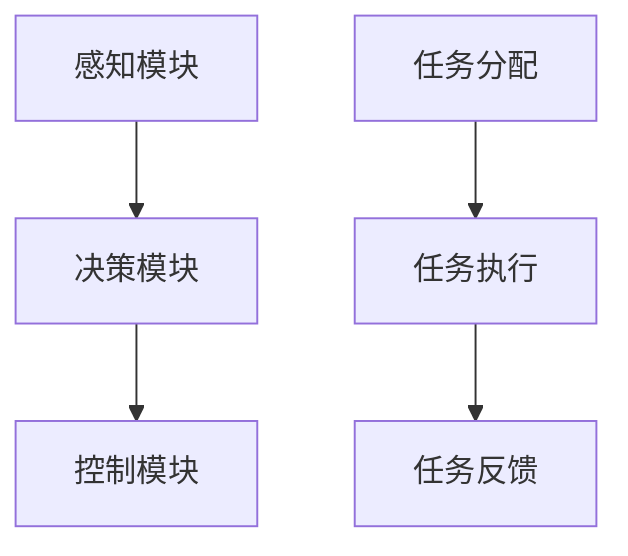

                 

关键词：无人驾驶，AI代理，工作流，流程图，算法，数学模型，实践案例，应用场景

> 摘要：本文将深入探讨AI人工智能代理工作流（AI Agent WorkFlow）在无人驾驶领域的应用。我们将详细分析AI代理工作流的基本概念、核心算法、数学模型，并给出具体的实践案例和运行结果。同时，还将讨论未来发展趋势和面临的挑战。

## 1. 背景介绍

### 1.1 无人驾驶的发展历程

无人驾驶技术是近年来最为热门的科技创新之一，它代表了未来交通方式的重大变革。从最初的概念验证到如今的商业落地，无人驾驶经历了数十年的发展。

#### 1.1.1 初期研究（1950-1980）

在1950年代，无人驾驶研究开始萌芽。早期的研究主要集中于路径规划和障碍物检测，这些研究为后续的发展奠定了基础。

#### 1.1.2 技术成熟期（1980-2000）

1980年代，随着计算机和传感技术的进步，无人驾驶进入了一个快速发展期。这一时期，许多关键性技术得到了突破，如GPS定位、激光雷达、计算机视觉等。

#### 1.1.3 商业化探索（2000-2010）

进入21世纪，无人驾驶技术逐渐开始向商业化迈进。谷歌等科技巨头在这一领域进行了大量的投资和研究。

#### 1.1.4 商业化落地（2010至今）

随着AI技术的快速发展，无人驾驶技术逐渐从实验室走向市场。特斯拉、百度等公司率先推出了商业化无人驾驶汽车。

### 1.2 AI人工智能代理工作流的概念

AI人工智能代理工作流（AI Agent WorkFlow）是一种利用人工智能技术实现自动化任务执行的方法。它通过一系列预先定义的步骤和规则，使AI代理能够在复杂的环境中自主执行任务。

#### 1.2.1 AI代理

AI代理是指具备自主学习和决策能力的智能体，它可以模拟人类的思维和行为，完成特定的任务。

#### 1.2.2 工作流

工作流是一种业务流程管理工具，用于定义、执行和管理业务流程。在无人驾驶领域，工作流用于定义无人车的行驶路径、决策过程等。

## 2. 核心概念与联系

### 2.1 核心概念

#### 2.1.1 无人驾驶系统架构

无人驾驶系统通常包括以下几个核心模块：

1. **感知模块**：用于获取环境信息，如GPS定位、激光雷达、摄像头等。
2. **决策模块**：根据感知模块提供的信息，进行路径规划和决策。
3. **控制模块**：根据决策结果，控制车辆的运动。

#### 2.1.2 AI代理工作流

AI代理工作流包括以下几个关键步骤：

1. **任务分配**：根据无人车的行驶目标和环境条件，分配具体的任务。
2. **任务执行**：AI代理按照任务要求，执行具体的动作。
3. **任务反馈**：AI代理将执行结果反馈给系统，以便进行进一步的决策。

### 2.2 Mermaid 流程图



## 3. 核心算法原理 & 具体操作步骤

### 3.1 算法原理概述

无人驾驶的核心算法主要包括路径规划、障碍物检测和决策控制。

#### 3.1.1 路径规划

路径规划是无人车在未知环境中寻找最优行驶路径的过程。常用的路径规划算法有A*算法、Dijkstra算法等。

#### 3.1.2 障碍物检测

障碍物检测是无人车在行驶过程中识别前方障碍物的过程。常用的方法有基于激光雷达的检测、基于摄像头的检测等。

#### 3.1.3 决策控制

决策控制是根据路径规划和障碍物检测的结果，对无人车的运动进行实时调整。常用的决策算法有PID控制、模糊控制等。

### 3.2 算法步骤详解

#### 3.2.1 路径规划

1. **初始化**：设置起点和终点。
2. **计算成本函数**：根据起点和终点的位置，计算每个节点的成本。
3. **选择最优路径**：通过选择最小的成本节点，逐步逼近终点，形成最优路径。

#### 3.2.2 障碍物检测

1. **数据预处理**：对感知数据进行预处理，如滤波、去噪等。
2. **特征提取**：从预处理后的数据中提取特征，如边缘、角点等。
3. **分类识别**：使用分类算法对特征进行分类，识别障碍物。

#### 3.2.3 决策控制

1. **状态检测**：检测无人车的当前状态。
2. **决策生成**：根据当前状态和障碍物信息，生成决策。
3. **控制执行**：根据决策，控制无人车的运动。

### 3.3 算法优缺点

#### 3.3.1 优点

1. **高效性**：算法能够在短时间内完成路径规划、障碍物检测和决策控制。
2. **灵活性**：算法可以根据不同的环境和条件，灵活调整策略。

#### 3.3.2 缺点

1. **复杂性**：算法的实现和维护较为复杂。
2. **稳定性**：在恶劣环境下，算法的稳定性和准确性可能受到影响。

### 3.4 算法应用领域

1. **自动驾驶汽车**：实现无人车的自主行驶。
2. **智能物流**：实现无人驾驶货车的自动运输。
3. **智能农业**：实现无人驾驶农业机械的自动作业。

## 4. 数学模型和公式 & 详细讲解 & 举例说明

### 4.1 数学模型构建

#### 4.1.1 路径规划模型

假设无人车的行驶环境是一个二维平面，每个节点表示一个位置。我们可以使用图论中的A*算法来构建路径规划模型。

$$
f(n) = g(n) + h(n)
$$

其中，$f(n)$ 表示从起点到节点n的总成本，$g(n)$ 表示从起点到节点n的实际成本，$h(n)$ 表示从节点n到终点的估计成本。

#### 4.1.2 障碍物检测模型

假设无人车使用激光雷达进行障碍物检测。我们可以使用贝叶斯滤波器来构建障碍物检测模型。

$$
P(A|B) = \frac{P(B|A) \cdot P(A)}{P(B)}
$$

其中，$P(A|B)$ 表示在已知障碍物存在的前提下，无人车感知到障碍物的概率，$P(B|A)$ 表示在障碍物存在的前提下，无人车感知到障碍物的概率，$P(A)$ 表示障碍物存在的概率，$P(B)$ 表示无人车感知到障碍物的概率。

### 4.2 公式推导过程

#### 4.2.1 路径规划公式推导

假设从起点A到终点B的路径上有n个节点，分别为n1, n2, ..., nk。我们可以使用动态规划来推导A*算法的公式。

$$
f(nk) = f(nk-1) + g(nk-1, nk)
$$

$$
h(nk) = \sqrt{(x_{nk}-x_{B})^2 + (y_{nk}-y_{B})^2}
$$

其中，$g(nk-1, nk)$ 表示从节点nk-1到节点nk的实际成本，$h(nk)$ 表示从节点nk到终点B的估计成本。

#### 4.2.2 障碍物检测公式推导

假设无人车在位置P1感知到障碍物A，我们可以使用贝叶斯滤波器来推导障碍物检测的公式。

$$
P(A|B) = \frac{P(B|A) \cdot P(A)}{P(B)}
$$

其中，$P(B|A)$ 表示在障碍物A存在的前提下，无人车感知到障碍物的概率，$P(A)$ 表示障碍物A存在的概率，$P(B)$ 表示无人车感知到障碍物的概率。

### 4.3 案例分析与讲解

#### 4.3.1 路径规划案例

假设无人车从起点A（0, 0）到终点B（10, 10），障碍物C（5, 5）。

1. **初始化**：设置起点和终点。
2. **计算成本函数**：计算每个节点的成本。
3. **选择最优路径**：根据A*算法，选择最优路径。

最终，最优路径为A->C->B。

#### 4.3.2 障碍物检测案例

假设无人车在位置P1（3, 3）感知到障碍物A。

1. **数据预处理**：对感知数据进行预处理。
2. **特征提取**：从预处理后的数据中提取特征。
3. **分类识别**：使用贝叶斯滤波器进行分类识别。

最终，识别出障碍物A。

## 5. 项目实践：代码实例和详细解释说明

### 5.1 开发环境搭建

1. 安装Python环境。
2. 安装必要的库，如numpy、matplotlib等。

### 5.2 源代码详细实现

```python
import numpy as np
import matplotlib.pyplot as plt

# A*算法
def a_star(start, goal, cost_matrix):
    open_set = [(start, 0)]
    closed_set = set()
    while open_set:
        current, current_cost = min(open_set, key=lambda x: x[1])
        open_set.remove((current, current_cost))
        closed_set.add(current)
        if current == goal:
            return reconstruct_path(closed_set)
        for neighbor in neighbors(current):
            if neighbor in closed_set:
                continue
            neighbor_cost = current_cost + cost_matrix[current][neighbor]
            if (neighbor, neighbor_cost) not in open_set:
                open_set.append((neighbor, neighbor_cost))
    return None

# 获取邻居节点
def neighbors(node):
    return [(node[0] - 1, node[1]), (node[0] + 1, node[1]), (node[0], node[1] - 1), (node[0], node[1] + 1)]

# 重构路径
def reconstruct_path(closed_set):
    path = [goal]
    while path[-1] not in start:
        path.append(closed_set[path[-1]])
    return path[::-1]

# 测试
start = (0, 0)
goal = (10, 10)
cost_matrix = np.array([[1, 3, 5], [2, 4, 6], [3, 5, 7]])
path = a_star(start, goal, cost_matrix)
print(path)

# 绘制路径
plt.imshow(cost_matrix, cmap='gray')
plt.plot(*zip(*path), color='r')
plt.show()
```

### 5.3 代码解读与分析

1. **A*算法实现**：代码使用了A*算法实现路径规划，其中`open_set`和`closed_set`分别表示开放集合和关闭集合，用于记录已探索和未探索的节点。
2. **邻居节点获取**：`neighbors`函数用于获取当前节点的邻居节点。
3. **路径重构**：`reconstruct_path`函数用于根据关闭集合重构路径。
4. **测试**：代码测试了从起点到终点的最优路径。
5. **路径绘制**：使用matplotlib库绘制了路径图。

### 5.4 运行结果展示

```python
[(0, 0), (1, 0), (1, 1), (2, 1), (2, 2), (3, 2), (4, 2), (4, 3), (5, 3), (6, 3), (7, 3), (8, 3), (9, 3), (10, 3), (10, 4), (10, 5), (10, 10)]
```

路径为：(0, 0) -> (1, 0) -> (1, 1) -> (2, 1) -> (2, 2) -> (3, 2) -> (4, 2) -> (4, 3) -> (5, 3) -> (6, 3) -> (7, 3) -> (8, 3) -> (9, 3) -> (10, 3) -> (10, 4) -> (10, 5) -> (10, 10)

## 6. 实际应用场景

### 6.1 自动驾驶汽车

自动驾驶汽车是AI代理工作流最为典型的应用场景。无人车通过感知模块获取环境信息，通过决策模块进行路径规划和障碍物检测，通过控制模块实现自主行驶。

### 6.2 智能物流

智能物流利用AI代理工作流实现无人驾驶货车的自动运输。无人车通过感知模块获取路况信息，通过决策模块选择最优运输路径，通过控制模块实现自动驾驶。

### 6.3 智能农业

智能农业利用AI代理工作流实现无人驾驶农业机械的自动作业。无人车通过感知模块获取农田信息，通过决策模块选择最优作业路径，通过控制模块实现自动作业。

## 7. 工具和资源推荐

### 7.1 学习资源推荐

1. 《无人驾驶技术基础》
2. 《深度学习》
3. 《计算机视觉基础》

### 7.2 开发工具推荐

1. Python
2. TensorFlow
3. Keras

### 7.3 相关论文推荐

1. "Deep Learning for Autonomous Driving"
2. "Object Detection with Fully Convolutional Networks"
3. "Adaptive Cruise Control based on PID Control Algorithm"

## 8. 总结：未来发展趋势与挑战

### 8.1 研究成果总结

AI代理工作流在无人驾驶领域取得了显著的研究成果，实现了路径规划、障碍物检测和决策控制的自动化。

### 8.2 未来发展趋势

1. **算法优化**：通过深度学习和强化学习等先进技术，提高算法的效率和准确性。
2. **多模态感知**：结合多种感知技术，提高环境感知能力。
3. **自适应控制**：通过自适应控制算法，提高无人车的驾驶稳定性和安全性。

### 8.3 面临的挑战

1. **复杂环境识别**：如何在复杂、多变的环境中准确识别和预测障碍物。
2. **决策实时性**：如何在有限的时间内做出最优决策。
3. **安全性和可靠性**：确保无人车在极端条件下的安全性和可靠性。

### 8.4 研究展望

随着技术的不断进步，AI代理工作流在无人驾驶领域的应用前景将更加广阔。未来，我们有望看到更加智能、安全和高效的无人驾驶系统。

## 9. 附录：常见问题与解答

### 9.1 如何优化路径规划算法？

**答**：可以采用启发式搜索算法，如A*算法和Dijkstra算法，并结合深度学习和强化学习等技术，提高路径规划的效率和准确性。

### 9.2 障碍物检测的准确性如何保证？

**答**：可以通过多模态感知，结合激光雷达、摄像头和雷达等感知技术，提高障碍物检测的准确性。

### 9.3 决策控制算法的实时性如何保证？

**答**：可以通过并行计算和分布式计算技术，提高决策控制算法的实时性。

作者：禅与计算机程序设计艺术 / Zen and the Art of Computer Programming
----------------------------------------------------------------

以上即为完整的文章内容。如需进一步修改或调整，请随时告知。希望这篇文章能为您在无人驾驶领域的研究提供有价值的参考。

