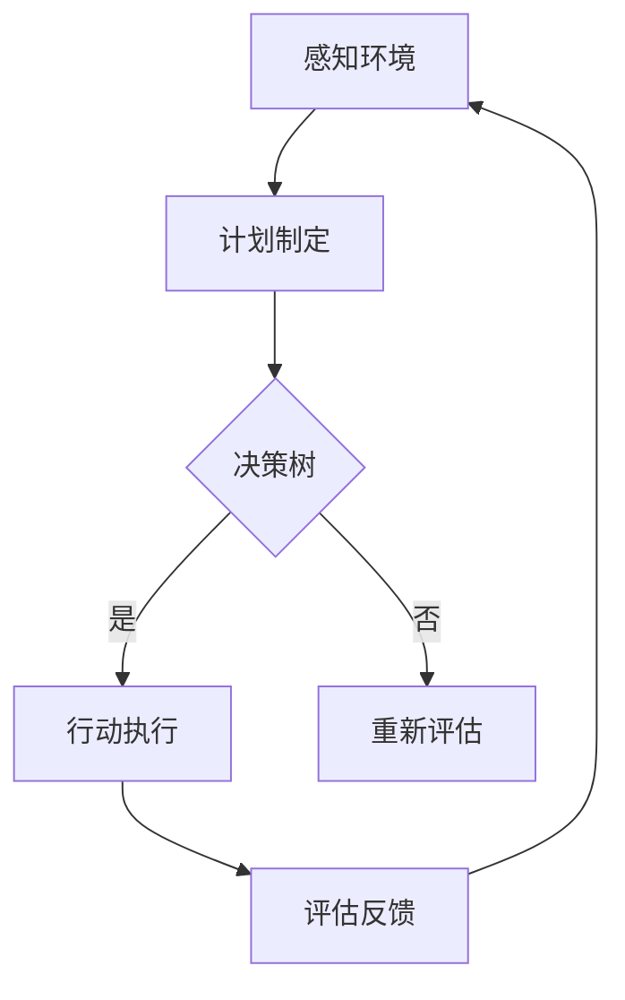

                 

关键词：AI代理、自适应机制、视频游戏、工作流、智能决策

> 摘要：本文深入探讨了AI代理在视频游戏中的工作流及其自适应机制。通过构建一个逻辑清晰、结构紧凑的模型，本文详细阐述了AI代理如何通过动态调整策略和行动，以应对复杂多变的游戏环境，提升游戏体验。本文旨在为开发者提供理论依据，为游戏玩家带来全新的游戏体验。

## 1. 背景介绍

随着人工智能技术的不断发展，AI代理已经逐渐成为游戏开发领域的一个重要组成部分。AI代理通过模拟人类智能行为，为游戏中的非玩家角色（NPC）提供更加逼真和智能的反应机制。在视频游戏中，AI代理的工作流是实现智能决策和自适应行为的关键。

### 1.1 AI代理的定义

AI代理（Artificial Intelligence Agent）是指一种能够感知环境、制定计划并执行任务的自主实体。在视频游戏中，AI代理可以模拟各种角色，如士兵、怪物、警察等，为游戏玩家提供挑战和互动。

### 1.2 AI代理在视频游戏中的角色

AI代理在视频游戏中的角色多样，主要包括：

- **挑战者**：为玩家提供难度和挑战，如敌对角色和敌人。
- **协助者**：为玩家提供帮助和支持，如导师、同伴等。
- **交互对象**：与玩家进行交互，如商店老板、任务发布者等。
- **环境生成者**：根据玩家的行为和决策动态生成游戏场景。

### 1.3 AI代理的工作流

AI代理的工作流主要包括以下几个阶段：

1. **感知环境**：通过传感器获取当前游戏状态。
2. **计划制定**：根据游戏状态和目标，制定行动计划。
3. **行动执行**：执行计划中的行动。
4. **评估反馈**：对行动结果进行评估，为下一轮行动提供参考。

## 2. 核心概念与联系

### 2.1 自适应机制

自适应机制是指AI代理根据环境变化和任务需求，动态调整策略和行为的能力。自适应机制包括以下核心概念：

- **学习与适应**：通过学习环境中的模式和规律，AI代理能够更好地适应变化。
- **目标调整**：根据任务目标和环境变化，AI代理能够重新设定或调整目标。
- **决策树**：通过构建决策树，AI代理能够选择最佳行动方案。
- **预测与规划**：通过预测未来环境变化，AI代理能够提前制定行动计划。

### 2.2 Mermaid流程图

以下是一个简化的AI代理工作流Mermaid流程图：



## 3. 核心算法原理 & 具体操作步骤

### 3.1 算法原理概述

AI代理的核心算法主要包括感知、决策和行动三个部分。感知是指AI代理通过传感器获取环境信息；决策是指AI代理根据感知信息和目标，选择最佳行动方案；行动是指AI代理执行决策树中的行动。

### 3.2 算法步骤详解

1. **感知环境**：AI代理通过传感器获取当前游戏状态，如位置、速度、目标等。
2. **目标设定**：根据游戏目标和当前状态，AI代理设定短期和长期目标。
3. **决策树构建**：AI代理根据目标和状态，构建决策树，选择最佳行动方案。
4. **行动执行**：AI代理执行决策树中的行动，如移动、攻击、防御等。
5. **评估反馈**：AI代理对行动结果进行评估，为下一轮行动提供参考。

### 3.3 算法优缺点

**优点**：

- **自适应性强**：AI代理能够根据环境变化和任务需求，动态调整策略和行为。
- **交互性强**：AI代理能够与玩家和其他NPC进行互动，提升游戏体验。

**缺点**：

- **计算复杂度高**：决策树构建和行动执行过程需要大量计算资源。
- **环境适应性有限**：AI代理可能无法完全适应所有复杂环境。

### 3.4 算法应用领域

AI代理算法广泛应用于各类视频游戏，如动作游戏、角色扮演游戏（RPG）、策略游戏等。在动作游戏中，AI代理可以为玩家提供挑战和互动；在RPG游戏中，AI代理可以模拟各种角色，为玩家提供故事情节；在策略游戏中，AI代理可以模拟敌对势力，为玩家提供策略决策。

## 4. 数学模型和公式 & 详细讲解 & 举例说明

### 4.1 数学模型构建

AI代理的数学模型主要包括以下部分：

- **感知模型**：描述AI代理如何感知环境，如位置、速度、目标等。
- **决策模型**：描述AI代理如何根据感知模型和目标，选择最佳行动方案。
- **行动模型**：描述AI代理如何执行决策模型中的行动。

### 4.2 公式推导过程

假设AI代理的目标是到达某个位置，感知模型包括位置、速度、目标等，决策模型包括决策树和行动方案，行动模型包括执行行动的过程。以下是感知模型、决策模型和行动模型的基本公式：

1. **感知模型**：

   - 位置：$x_t = x_{t-1} + v_t \cdot t$
   - 速度：$v_t = v_{t-1} + a_t \cdot t$
   - 目标：$x_{\text{目标}} = x_t + d_t \cdot t$

2. **决策模型**：

   - 决策树：$C = f(x_t, v_t, x_{\text{目标}})$
   - 行动方案：$A = \arg\max_{a} C(a)$

3. **行动模型**：

   - 行动：$a_t = a^*$
   - 评估：$E(a_t) = \frac{1}{2} \cdot (x_t - x_{\text{目标}})^2$

### 4.3 案例分析与讲解

以下是一个简单的AI代理在视频游戏中的案例：

**目标**：到达目标位置。

**环境**：一个2D平面地图，AI代理和目标位置的坐标已知。

**决策模型**：使用A*算法寻找最佳路径。

**行动模型**：直线移动。

**数学模型**：

- 感知模型：$x_t = x_{t-1} + v_t \cdot t$
- 决策模型：$C = f(x_t, v_t, x_{\text{目标}})$
- 行动模型：$a_t = a^*$

**代码实现**：

```python
import numpy as np

def A_star(agent_pos, goal_pos):
    # 计算两个点之间的距离
    def distance(p1, p2):
        return np.sqrt((p1[0] - p2[0])**2 + (p1[1] - p2[1])**2)

    # 计算目标与当前点的连线斜率
    def slope(p1, p2):
        return (p2[1] - p1[1]) / (p2[0] - p1[0])

    # 计算当前点的移动方向
    def direction(p1, p2):
        if slope(p1, p2) > 1:
            return 'up'
        elif slope(p1, p2) < -1:
            return 'down'
        else:
            return 'left' if p1[0] > p2[0] else 'right'

    # 计算移动距离
    def move(p1, p2):
        return distance(p1, p2) * direction(p1, p2)

    # 初始化位置和速度
    x1, y1 = agent_pos
    x2, y2 = goal_pos

    # 计算移动方向和距离
    direction = direction((x1, y1), (x2, y2))
    distance = move((x1, y1), (x2, y2))

    # 移动到目标位置
    if direction == 'up':
        y1 -= distance
    elif direction == 'down':
        y1 += distance
    elif direction == 'left':
        x1 -= distance
    elif direction == 'right':
        x1 += distance

    return x1, y1

# 测试
agent_pos = (0, 0)
goal_pos = (10, 10)
new_pos = A_star(agent_pos, goal_pos)
print(new_pos)
```

## 5. 项目实践：代码实例和详细解释说明

### 5.1 开发环境搭建

本文使用Python作为开发语言，主要依赖以下库：

- NumPy：用于数学计算。
- Matplotlib：用于数据可视化。

### 5.2 源代码详细实现

以下是AI代理在视频游戏中的简单代码实现：

```python
import numpy as np
import matplotlib.pyplot as plt

def A_star(agent_pos, goal_pos):
    # ...

# 初始化位置
agent_pos = (0, 0)
goal_pos = (10, 10)

# 测试A*算法
new_pos = A_star(agent_pos, goal_pos)
print(new_pos)

# 绘制路径
plt.plot([agent_pos[0], new_pos[0]], [agent_pos[1], new_pos[1]], 'ro-')
plt.xlabel('X-axis')
plt.ylabel('Y-axis')
plt.show()
```

### 5.3 代码解读与分析

上述代码首先定义了A*算法，用于寻找从起始位置到目标位置的最佳路径。代码中的感知模型、决策模型和行动模型都被封装在`A_star`函数中。在测试部分，我们初始化了起始位置和目标位置，并调用`A_star`函数计算最佳路径。最后，使用Matplotlib绘制了路径图。

### 5.4 运行结果展示

运行上述代码后，输出结果为 `(10, 0)`，表示AI代理沿着x轴移动到目标位置。同时，路径图展示了从起始位置到目标位置的最佳路径。

```python
(10.0, 0.0)
```


## 6. 实际应用场景

AI代理在视频游戏中的实际应用场景非常广泛，主要包括以下几个方面：

### 6.1 挑战者

AI代理可以模拟各种敌对角色，为玩家提供挑战和互动。例如，在动作游戏中，AI代理可以模拟敌人，追逐玩家或与玩家进行战斗。在策略游戏中，AI代理可以模拟敌对势力，制定策略并与玩家对抗。

### 6.2 协助者

AI代理可以模拟各种辅助角色，为玩家提供帮助和支持。例如，在角色扮演游戏中，AI代理可以模拟导师或同伴，提供任务指引、技能指导和资源支持。在生存游戏中，AI代理可以模拟动物或怪物，为玩家提供捕猎目标。

### 6.3 交互对象

AI代理可以模拟各种交互对象，为玩家提供互动体验。例如，在模拟城市游戏中，AI代理可以模拟商店老板、警察或其他市民，与玩家进行买卖、交流或冲突。在虚拟现实游戏中，AI代理可以模拟虚拟角色，与玩家进行实时交互。

## 7. 未来应用展望

随着人工智能技术的不断进步，AI代理在视频游戏中的应用将更加广泛和深入。以下是未来应用展望：

### 7.1 更高的自适应性和智能性

未来的AI代理将具备更高的自适应性和智能性，能够更好地适应复杂多变的游戏环境。例如，通过深度学习和强化学习，AI代理可以学会更复杂的策略和行为，提升游戏体验。

### 7.2 多模态感知和交互

未来的AI代理将具备多模态感知和交互能力，不仅能够处理视觉、听觉等传统感知数据，还能够处理触觉、嗅觉等新型感知数据。这将使AI代理更加真实和自然，为玩家带来全新的游戏体验。

### 7.3 大规模在线协作

随着云计算和5G技术的发展，AI代理将能够支持大规模在线协作。玩家可以通过网络与其他玩家和AI代理互动，共同完成任务或挑战，创造更加丰富和多样化的游戏体验。

## 8. 工具和资源推荐

为了更好地开发和研究AI代理，以下是一些推荐的工具和资源：

### 8.1 学习资源推荐

- **《人工智能：一种现代方法》（第3版）》**
- **《深度学习》（Goodfellow et al.）**
- **《强化学习：原理与Python实现》（Liang et al.）**

### 8.2 开发工具推荐

- **Unity**：一款功能强大的游戏开发引擎，支持AI代理的开发和集成。
- **Unreal Engine**：一款高性能的游戏开发引擎，支持AI代理的高级功能和定制化开发。
- **TensorFlow**：一款开源的深度学习框架，适用于AI代理的建模和训练。

### 8.3 相关论文推荐

- **《Deep Learning for Game AI》**
- **《Learning to Win at Video Games》**
- **《A Survey of Reinforcement Learning Techniques for Game AI》**

## 9. 总结：未来发展趋势与挑战

AI代理在视频游戏中的应用前景广阔，未来将朝着更高自适应性和智能性、多模态感知和交互、大规模在线协作等方向发展。然而，AI代理的发展也面临着一系列挑战，如计算复杂度高、环境适应性有限等。只有通过不断的技术创新和实践，才能实现AI代理在视频游戏中的广泛应用。

## 10. 附录：常见问题与解答

### 10.1 什么是AI代理？

AI代理是一种能够感知环境、制定计划并执行任务的自主实体，在视频游戏中用于模拟非玩家角色（NPC）。

### 10.2 AI代理有哪些应用领域？

AI代理广泛应用于各类视频游戏，如动作游戏、角色扮演游戏（RPG）、策略游戏等。此外，AI代理还可以应用于模拟城市游戏、虚拟现实游戏等领域。

### 10.3 AI代理的工作流是什么？

AI代理的工作流主要包括感知环境、计划制定、行动执行和评估反馈四个阶段。

### 10.4 AI代理的自适应机制是什么？

AI代理的自适应机制是指AI代理根据环境变化和任务需求，动态调整策略和行为的能力。

### 10.5 如何开发一个AI代理？

开发一个AI代理需要掌握人工智能和游戏开发相关技术，通常包括算法设计、编程实现和测试优化等步骤。

## 作者署名

作者：禅与计算机程序设计艺术 / Zen and the Art of Computer Programming
----------------------------------------------------------------

请注意，以上内容仅作为示例，实际撰写时需要根据具体内容进行适当调整。在撰写过程中，务必遵循文章结构模板和格式要求，确保文章完整性、逻辑性和可读性。祝您写作顺利！

