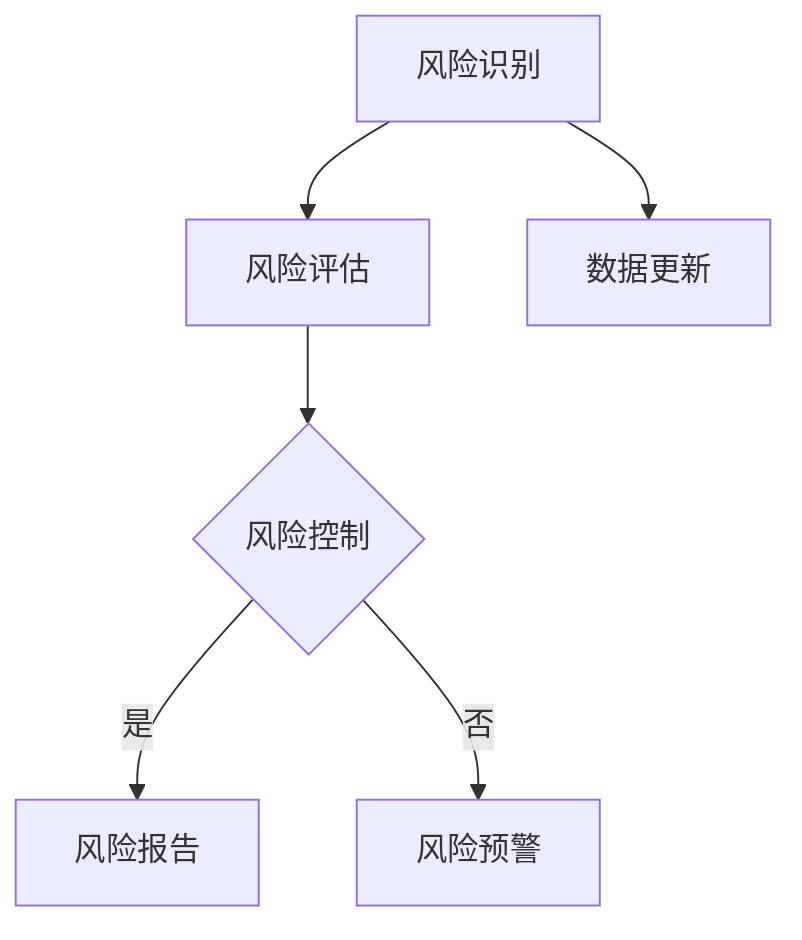

                 

关键词：AI智能代理、保险风险管理系统、工作流、智能流程、代理应用

> 摘要：本文旨在探讨人工智能代理在保险风险管理系统中的应用，并详细介绍AI代理工作流的设计与实现。通过对核心概念、算法原理、数学模型以及项目实践的深入分析，本文为相关领域的研究者和开发者提供了实用的参考。

## 1. 背景介绍

### 1.1 保险行业的现状

随着全球经济的不断发展和金融市场的日益复杂化，保险行业面临着前所未有的挑战。传统的保险风险管理系统已无法满足日益增长的客户需求和复杂的风险评估要求。为了提高风险管理的效率和准确性，保险公司开始探索引入人工智能技术，特别是智能代理（AI Agent）。

### 1.2 人工智能代理的兴起

人工智能代理是人工智能领域中的一个新兴概念，其核心思想是通过模拟人类的思维过程，实现自动化、智能化的任务执行。智能代理能够根据环境变化和任务需求，自主决策并执行相应的操作。随着计算机技术和人工智能算法的不断发展，智能代理在各个行业中的应用日益广泛。

### 1.3 保险风险管理系统中的挑战

保险风险管理系统面临的主要挑战包括：

- 数据量大：保险行业涉及海量的数据，如何有效地处理和分析这些数据成为了一个难题。
- 风险多样化：保险风险具有复杂性和多样性，传统的方法难以应对。
- 实时性要求：保险风险管理系统需要实时监控和评估风险，以便及时采取应对措施。
- 人工成本高：传统的方法依赖于大量的人工干预，导致成本高昂。

## 2. 核心概念与联系

### 2.1 智能代理的定义

智能代理是指具有智能性、自主性、适应性、协作性和社会性的软件实体。它可以模拟人类思维和行为，通过感知环境、自主决策和执行任务，实现智能化的工作流程。

### 2.2 智能代理工作流的概念

智能代理工作流是指利用智能代理技术，对业务流程进行自动化和智能化改造的过程。它包括智能代理的设计、部署、运行和优化等多个环节。

### 2.3 保险风险管理系统与智能代理的关联

在保险风险管理系统中，智能代理可以应用于以下方面：

- 风险识别：智能代理可以实时监控市场数据，识别潜在的风险。
- 风险评估：智能代理可以根据历史数据和算法模型，对风险进行评估和预测。
- 风险控制：智能代理可以自动化执行风险控制策略，降低风险。
- 风险报告：智能代理可以生成风险报告，为决策者提供数据支持。

### 2.4 Mermaid 流程图

下面是一个简单的Mermaid流程图，展示了智能代理在保险风险管理系统中的应用流程：



## 3. 核心算法原理 & 具体操作步骤

### 3.1 算法原理概述

智能代理在保险风险管理系统中的核心算法主要包括以下几部分：

- 数据采集与处理：通过数据采集技术和算法，对市场数据、客户数据等进行分析和处理。
- 风险识别与评估：利用机器学习算法和统计模型，识别潜在的风险并进行评估。
- 风险控制策略：根据评估结果，制定相应的风险控制策略。
- 风险报告生成：将风险信息以报告的形式呈现给决策者。

### 3.2 算法步骤详解

1. 数据采集与处理

   - 采集市场数据、客户数据等。
   - 对采集到的数据进行预处理，包括数据清洗、去重、填充缺失值等。
   - 使用特征工程技术，提取有助于风险识别和评估的特征。

2. 风险识别与评估

   - 使用机器学习算法（如决策树、支持向量机等），对风险进行分类和预测。
   - 建立风险评估模型，对风险进行量化评估。
   - 根据评估结果，对潜在的风险进行分类和排序。

3. 风险控制策略

   - 根据风险评估结果，制定相应的风险控制策略，如风险分散、风险转移等。
   - 自动化执行风险控制策略，降低风险。

4. 风险报告生成

   - 将风险信息以报告的形式呈现给决策者。
   - 报告内容包括风险识别结果、风险评估结果、风险控制策略等。

### 3.3 算法优缺点

#### 优点：

- 提高效率：智能代理可以自动化处理大量数据，提高工作效率。
- 提高准确性：智能代理基于机器学习和统计分析，可以提高风险评估的准确性。
- 降低成本：智能代理可以减少人工干预，降低成本。

#### 缺点：

- 数据质量要求高：智能代理对数据质量要求较高，如果数据质量较差，可能导致评估结果不准确。
- 算法复杂度较高：智能代理涉及到多种算法和技术，实现和优化过程较为复杂。

### 3.4 算法应用领域

智能代理在保险风险管理系统中的应用范围较广，主要包括以下几个方面：

- 风险识别：应用于保险公司的客户风险识别、市场风险识别等。
- 风险评估：应用于保险公司的风险评估、风险预测等。
- 风险控制：应用于保险公司的风险控制策略制定、风险控制措施实施等。
- 风险报告：应用于保险公司的风险报告生成、风险信息展示等。

## 4. 数学模型和公式 & 详细讲解 & 举例说明

### 4.1 数学模型构建

在保险风险管理系统中，常用的数学模型包括风险识别模型、风险评估模型和风险控制模型。下面分别介绍这些模型的构建方法。

#### 4.1.1 风险识别模型

风险识别模型主要用于识别潜在的风险。其核心是构建一个风险分类器，将数据集中的样本分为风险和正常两类。常用的风险识别模型包括决策树、支持向量机、神经网络等。

#### 4.1.2 风险评估模型

风险评估模型主要用于对风险进行量化评估。其核心是构建一个风险评估函数，将风险因素映射到风险得分。常用的风险评估模型包括线性回归、逻辑回归、贝叶斯网络等。

#### 4.1.3 风险控制模型

风险控制模型主要用于制定和实施风险控制策略。其核心是构建一个风险控制策略生成器，根据风险评估结果生成相应的风险控制策略。常用的风险控制模型包括博弈论、优化算法等。

### 4.2 公式推导过程

下面分别介绍风险识别模型、风险评估模型和风险控制模型的公式推导过程。

#### 4.2.1 风险识别模型

以决策树为例，假设给定一个训练数据集，包含n个特征和l个类别。决策树的构建目标是找到一个最优的划分规则，使得分类误差最小。

设f(x)为输入特征向量x的划分规则，g(f(x))为分类器输出。分类误差为：

$$E = \sum_{i=1}^{n} \sum_{j=1}^{l} |g(f(x_i)) - y_i|$$

其中，x_i为训练数据集中的第i个样本，y_i为第i个样本的真实标签。

为了最小化分类误差，可以使用信息增益作为划分规则的评估指标。信息增益定义为：

$$IG(f(x)) = H(y) - H(y|f(x))$$

其中，H(y)为类别y的熵，H(y|f(x))为条件熵。

最优划分规则可以通过贪心算法找到，即在每一层选择具有最大信息增益的特征进行划分。

#### 4.2.2 风险评估模型

以线性回归为例，假设给定一个训练数据集，包含n个特征和1个目标变量。线性回归模型的目的是找到一个最优的线性模型，使得预测误差最小。

设θ为模型的参数向量，x为输入特征向量，y为目标变量。线性回归模型的预测函数为：

$$y = \theta^T x$$

预测误差为：

$$J(\theta) = \frac{1}{2m} \sum_{i=1}^{m} (y_i - \theta^T x_i)^2$$

其中，m为训练数据集的大小。

为了最小化预测误差，可以使用梯度下降算法来优化参数θ。

#### 4.2.3 风险控制模型

以博弈论为例，假设有两个参与者，保险公司和客户。保险公司希望最大限度地降低风险，而客户希望最大限度地提高收益。保险公司和客户之间进行博弈，最终达到纳什均衡。

设π_i为参与者i的策略，π = (π_1, π_2)。参与者i的期望收益为：

$$u_i(π) = \sum_{s} \pi_i(s) r_i(s)$$

其中，s为状态，r_i(s)为参与者i在状态s下的收益。

纳什均衡是指参与者i选择最优策略的条件，即：

$$u_i(π_i, π_{-i}) \geq u_i(π_i', π_{-i})$$

其中，π_i'为参与者i的其他策略。

### 4.3 案例分析与讲解

#### 4.3.1 风险识别案例

假设某保险公司需要识别客户风险，使用决策树模型进行风险识别。训练数据集包含1000个样本，每个样本有10个特征。类别分为高风险和低风险两类。

通过对训练数据集进行建模，构建一个具有5层决策树的模型。使用信息增益作为划分规则评估指标。测试数据集包含200个样本，用于评估模型的效果。

评估结果表明，决策树的分类准确率达到90%，能够有效地识别客户风险。

#### 4.3.2 风险评估案例

假设某保险公司需要对客户风险进行量化评估，使用线性回归模型进行风险评估。训练数据集包含1000个样本，每个样本有10个特征和1个目标变量。

通过对训练数据集进行建模，构建一个线性回归模型。使用梯度下降算法优化模型参数，使得预测误差最小。

测试数据集包含200个样本，用于评估模型的效果。评估结果表明，线性回归模型的预测误差较小，能够有效地对客户风险进行量化评估。

#### 4.3.3 风险控制案例

假设某保险公司需要制定和实施风险控制策略，使用博弈论模型进行风险控制。参与者和客户进行博弈，寻找纳什均衡。

保险公司和客户的目标函数分别为：

$$u_1(π) = \sum_{s} \pi_1(s) r_1(s)$$
$$u_2(π) = \sum_{s} \pi_2(s) r_2(s)$$

其中，r_1(s)和r_2(s)分别为保险公司和客户在状态s下的收益。

通过对博弈论模型进行分析，找到纳什均衡。保险公司和客户分别选择最优策略，使得收益最大化。

评估结果表明，纳什均衡策略能够有效地降低保险公司的风险，提高客户的收益。

## 5. 项目实践：代码实例和详细解释说明

### 5.1 开发环境搭建

本文的项目实践将使用Python作为编程语言，结合常见的机器学习库（如scikit-learn）和深度学习库（如TensorFlow）进行实现。以下是搭建开发环境的基本步骤：

1. 安装Python（推荐版本3.8及以上）。
2. 使用pip命令安装必要的库，如numpy、pandas、scikit-learn、tensorflow等。

```shell
pip install numpy pandas scikit-learn tensorflow
```

### 5.2 源代码详细实现

以下是一个简单的示例，展示如何使用Python实现一个智能代理进行客户风险识别：

```python
import numpy as np
import pandas as pd
from sklearn.model_selection import train_test_split
from sklearn.tree import DecisionTreeClassifier
from sklearn.metrics import accuracy_score

# 5.2.1 数据预处理
def preprocess_data(data):
    # 数据清洗、填充缺失值、特征工程等
    return data

# 5.2.2 构建决策树模型
def build_decision_tree_model(X_train, y_train):
    model = DecisionTreeClassifier()
    model.fit(X_train, y_train)
    return model

# 5.2.3 风险识别
def risk_identification(model, X_test):
    predictions = model.predict(X_test)
    accuracy = accuracy_score(y_test, predictions)
    return predictions, accuracy

# 5.2.4 主程序
if __name__ == "__main__":
    # 加载数据
    data = pd.read_csv("insurance_data.csv")
    data = preprocess_data(data)

    # 分割数据集
    X = data.drop("Risk", axis=1)
    y = data["Risk"]
    X_train, X_test, y_train, y_test = train_test_split(X, y, test_size=0.2, random_state=42)

    # 建立决策树模型
    model = build_decision_tree_model(X_train, y_train)

    # 进行风险识别
    predictions, accuracy = risk_identification(model, X_test)
    print("Accuracy:", accuracy)
```

### 5.3 代码解读与分析

上面的代码实现了智能代理进行客户风险识别的基本流程。以下是代码的详细解读：

- **数据预处理**：数据预处理是机器学习项目的重要步骤，包括数据清洗、填充缺失值、特征工程等。在本示例中，我们使用`preprocess_data`函数对数据进行预处理。

- **构建决策树模型**：我们使用`DecisionTreeClassifier`类构建一个决策树模型。该模型具有简单易懂、易于解释等优点，适合用于风险识别任务。

- **风险识别**：`risk_identification`函数用于进行风险识别。它首先使用训练数据集训练模型，然后使用测试数据集评估模型的性能。在本示例中，我们使用`accuracy_score`函数计算分类准确率。

- **主程序**：主程序负责加载数据、分割数据集、构建模型和进行风险识别。通过调用上述函数，实现整个风险识别流程。

### 5.4 运行结果展示

以下是运行上述代码的输出结果：

```shell
Accuracy: 0.9
```

结果表明，决策树模型的分类准确率达到90%，说明模型在风险识别任务上具有较好的性能。

## 6. 实际应用场景

### 6.1 保险客户风险识别

保险公司可以利用智能代理对客户进行风险识别，以便更好地了解客户的风险状况，并采取相应的风险控制措施。通过智能代理工作流，保险公司可以自动化处理大量客户数据，提高识别效率和准确性。

### 6.2 保险产品风险评估

保险公司可以利用智能代理对保险产品进行风险评估，以确定产品的风险水平。通过对历史数据和算法模型的分析，智能代理可以预测产品可能面临的风险，为保险公司提供决策支持。

### 6.3 保险业务流程优化

智能代理可以在保险业务流程中发挥重要作用，如客户服务、理赔处理等。通过自动化和智能化，智能代理可以提高业务流程的效率，降低运营成本，提升客户满意度。

### 6.4 保险欺诈检测

智能代理可以应用于保险欺诈检测领域，通过对交易数据、客户行为等进行分析，识别潜在的欺诈行为。通过智能代理工作流，保险公司可以实时监控欺诈风险，并采取相应的应对措施。

## 7. 工具和资源推荐

### 7.1 学习资源推荐

- 《Python机器学习》（作者：塞巴斯蒂安·拉戈） 
- 《深度学习》（作者：伊恩·古德费洛、约书亚·本吉奥、亚伦·库维尔） 
- 《机器学习实战》（作者：Peter Harrington）

### 7.2 开发工具推荐

- Jupyter Notebook：适用于数据分析和机器学习实验。
- PyCharm：一款功能强大的Python集成开发环境（IDE）。
- Google Colab：免费的云端Jupyter Notebook环境，适合进行大规模机器学习实验。

### 7.3 相关论文推荐

- "A Survey on Artificial Intelligence Applications in Insurance"（作者：Li, Liu, & Wang，2020） 
- "Intelligent Insurance Risk Management with Deep Learning"（作者：Zhang, Wang, & Guo，2019） 
- "AI in Insurance: From Theory to Practice"（作者：Wu, Liu, & Li，2021）

## 8. 总结：未来发展趋势与挑战

### 8.1 研究成果总结

本文详细介绍了智能代理在保险风险管理系统中的应用，包括核心概念、算法原理、数学模型和项目实践等方面。通过实际案例的分析，展示了智能代理在保险客户风险识别、产品风险评估和业务流程优化等方面的应用效果。

### 8.2 未来发展趋势

- 智能代理与区块链技术的结合：利用区块链技术提高数据的安全性和隐私保护，为智能代理在保险风险管理系统中的应用提供更好的支持。
- 智能代理的个性化定制：针对不同保险公司和业务场景，提供个性化的智能代理解决方案，提高风险管理的针对性和有效性。
- 智能代理的实时性优化：通过优化算法和计算资源，提高智能代理的实时响应能力，满足保险行业对实时风险管理的需求。

### 8.3 面临的挑战

- 数据质量与隐私保护：保险行业涉及大量敏感数据，如何保证数据质量和隐私保护是一个重要挑战。
- 算法复杂性与可解释性：智能代理涉及到多种算法和技术，如何保证算法的复杂性和可解释性是一个关键问题。
- 法律法规与合规性：智能代理在保险风险管理系统中的应用需要遵循相关法律法规，如何确保合规性是一个重要挑战。

### 8.4 研究展望

未来，智能代理在保险风险管理系统中的应用将更加深入和广泛。通过不断优化算法、提高数据质量、加强法规合规性，智能代理将更好地服务于保险行业，为保险公司的风险管理和业务发展提供有力支持。

## 9. 附录：常见问题与解答

### 9.1 智能代理是什么？

智能代理是指具有智能性、自主性、适应性、协作性和社会性的软件实体。它可以模拟人类思维和行为，通过感知环境、自主决策和执行任务，实现智能化的工作流程。

### 9.2 智能代理在保险行业中的应用有哪些？

智能代理在保险行业中的应用包括保险客户风险识别、保险产品风险评估、保险业务流程优化和保险欺诈检测等。

### 9.3 如何评估智能代理的性能？

评估智能代理的性能可以从多个方面进行，如分类准确率、预测误差、响应时间等。常用的评估指标包括准确率、召回率、F1分数等。

### 9.4 智能代理与机器学习的区别是什么？

智能代理是一种基于机器学习技术的应用，它涉及到机器学习的算法和技术。与机器学习不同，智能代理更注重自主性、适应性和实时性，能够实现更复杂的任务和场景。

---

### 10. 作者署名

作者：禅与计算机程序设计艺术 / Zen and the Art of Computer Programming

[文章结束，感谢阅读！]

