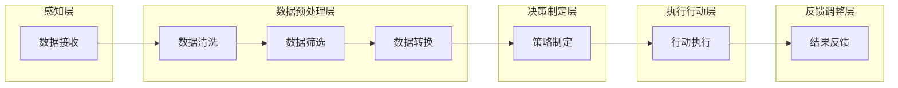

                 

关键词：AI人工智能、代理工作流、智能代理、物联网系统、应用

> 摘要：本文探讨了AI人工智能代理工作流（AI Agent WorkFlow）在物联网系统中的应用。通过分析智能代理的基本原理，本文详细描述了其在物联网系统中的角色、工作流设计、以及实现方法，展示了其在提升物联网系统智能化水平、提高系统运行效率方面的显著优势。

## 1. 背景介绍

随着物联网（IoT）技术的迅猛发展，智能设备和传感器被广泛应用于各个领域。这些设备每天产生大量的数据，如何有效地处理和分析这些数据成为了亟待解决的问题。传统的数据处理方法通常依赖于集中式的计算模型，这种方式在处理大规模分布式数据时往往效率低下，难以满足实时性需求。

智能代理（AI Agent）作为人工智能的一个分支，具有自主决策、自我学习和自适应环境的能力。通过将智能代理集成到物联网系统中，可以有效地解决传统数据处理方法面临的难题。智能代理能够实时处理来自物联网设备的数据，并根据环境的变化自主调整工作策略，从而实现物联网系统的智能化和高效运行。

本文旨在探讨AI人工智能代理工作流（AI Agent WorkFlow）的设计与实现，通过分析智能代理在物联网系统中的应用，阐述其在提升系统智能化水平和运行效率方面的优势。

## 2. 核心概念与联系

### 2.1 智能代理基本原理

智能代理是一种具有自主决策能力和交互能力的软件实体，能够在复杂的环境中独立完成特定任务。智能代理通常具备以下基本特征：

- **自主性**：智能代理能够独立执行任务，不受外部控制。
- **适应性**：智能代理能够根据环境变化调整自身行为。
- **交互性**：智能代理能够与其他智能代理或外部系统进行信息交换。

智能代理的核心是代理模型（Agent Model），包括感知模块、决策模块、执行模块和通信模块。感知模块负责接收外部信息；决策模块根据感知信息生成行动策略；执行模块负责执行决策；通信模块用于与其他智能代理或系统进行通信。

### 2.2 物联网系统架构

物联网系统通常由感知层、网络层和应用层组成。感知层包括各种传感器和智能设备；网络层负责数据传输和存储；应用层实现数据分析和应用功能。

### 2.3 智能代理在物联网系统中的角色

在物联网系统中，智能代理主要承担以下角色：

- **数据处理**：智能代理能够实时处理来自物联网设备的数据，包括数据清洗、筛选和分析。
- **决策支持**：智能代理可以根据处理结果做出决策，例如调整设备运行参数或执行特定操作。
- **协同工作**：多个智能代理可以协同工作，共同完成复杂任务。

### 2.4 智能代理工作流

智能代理工作流是智能代理在物联网系统中执行任务的过程。一个典型的工作流包括以下步骤：

1. **感知数据**：智能代理接收来自物联网设备的数据。
2. **数据预处理**：智能代理对数据进行清洗、筛选和格式转换。
3. **决策制定**：智能代理根据预处理后的数据制定行动策略。
4. **执行行动**：智能代理根据决策执行相应的操作。
5. **反馈调整**：智能代理根据执行结果调整后续行动。

### 2.5 Mermaid 流程图



## 3. 核心算法原理 & 具体操作步骤

### 3.1 算法原理概述

智能代理工作流的核心算法主要包括数据预处理算法、决策制定算法和执行行动算法。数据预处理算法用于对原始数据进行清洗、筛选和转换，决策制定算法根据预处理后的数据生成行动策略，执行行动算法根据决策执行具体的操作。

### 3.2 算法步骤详解

#### 3.2.1 数据预处理算法

1. **数据接收**：智能代理通过感知模块接收来自物联网设备的数据。
2. **数据清洗**：对数据进行去噪、去除重复数据等操作，保证数据质量。
3. **数据筛选**：根据需求筛选出符合条件的数据。
4. **数据转换**：将数据转换为统一的格式，便于后续处理。

#### 3.2.2 决策制定算法

1. **数据输入**：将预处理后的数据输入决策模块。
2. **特征提取**：提取数据中的关键特征。
3. **模型训练**：使用机器学习算法对特征进行训练。
4. **决策生成**：根据训练结果生成行动策略。

#### 3.2.3 执行行动算法

1. **决策输入**：将决策模块生成的行动策略输入执行模块。
2. **执行操作**：根据行动策略执行具体的操作，如调整设备参数、发送指令等。
3. **结果反馈**：将执行结果反馈给决策模块，用于调整后续行动。

### 3.3 算法优缺点

**优点**：

- **自主性**：智能代理能够自主决策，提高系统智能化水平。
- **适应性**：智能代理能够根据环境变化调整行动策略，提高系统适应能力。
- **高效性**：智能代理能够实时处理大量数据，提高系统运行效率。

**缺点**：

- **复杂性**：智能代理工作流涉及多个算法和模块，实现难度较大。
- **成本**：智能代理的开发和部署需要较高的成本。

### 3.4 算法应用领域

智能代理工作流在物联网系统中的应用领域广泛，包括：

- **智能家居**：通过智能代理实现家电设备的智能控制。
- **智能工厂**：通过智能代理实现生产设备的智能监控和调度。
- **智能交通**：通过智能代理实现交通信号控制、路况预测等。

## 4. 数学模型和公式 & 详细讲解 & 举例说明

### 4.1 数学模型构建

在智能代理工作流中，常见的数学模型包括数据预处理模型、决策制定模型和执行行动模型。以下分别进行介绍：

#### 4.1.1 数据预处理模型

数据预处理模型通常采用统计学方法和机器学习方法，包括：

- **去噪模型**：$$y = \frac{x - \mu}{\sigma}$$
- **去重复模型**：使用哈希表实现，时间复杂度为 O(n)。
- **特征提取模型**：使用主成分分析（PCA）等方法提取数据的关键特征。

#### 4.1.2 决策制定模型

决策制定模型通常采用机器学习算法，如：

- **回归模型**：$$y = \beta_0 + \beta_1x_1 + \beta_2x_2 + ... + \beta_nx_n$$
- **分类模型**：如支持向量机（SVM）、决策树等。

#### 4.1.3 执行行动模型

执行行动模型通常采用逻辑运算和条件判断，如：

- **逻辑运算**：$$y = x_1 \land x_2$$
- **条件判断**：$$y = \begin{cases} 
     1 & \text{if } x \geq 0 \\
     0 & \text{otherwise}
   \end{cases}$$

### 4.2 公式推导过程

以回归模型为例，假设有 n 个样本数据，每个样本包含 m 个特征变量，目标变量为 y。回归模型的公式为：

$$y = \beta_0 + \beta_1x_1 + \beta_2x_2 + ... + \beta_nx_n$$

其中，$\beta_0$、$\beta_1$、$\beta_2$...$\beta_n$ 为模型的参数。

为了求解模型参数，我们可以使用最小二乘法。最小二乘法的推导过程如下：

1. **计算样本的均值**：

$$\bar{x}_i = \frac{1}{n}\sum_{i=1}^{n}x_i$$
$$\bar{y} = \frac{1}{n}\sum_{i=1}^{n}y_i$$

2. **计算样本的协方差矩阵**：

$$S_{xx} = \sum_{i=1}^{n}(x_i - \bar{x}_i)(x_i - \bar{x}_i)^T$$
$$S_{xy} = \sum_{i=1}^{n}(x_i - \bar{x}_i)(y_i - \bar{y})^T$$

3. **计算模型的参数**：

$$\beta = (S_{xx})^{-1}S_{xy}$$

### 4.3 案例分析与讲解

#### 4.3.1 数据集介绍

假设我们有一个包含100个样本的数据集，每个样本包含3个特征变量（x1、x2、x3）和一个目标变量（y）。数据集的具体信息如下：

| x1 | x2 | x3 | y |
|----|----|----|---|
| 1  | 2  | 3  | 4 |
| 2  | 3  | 4  | 5 |
| ...| ...| ...|...|

#### 4.3.2 数据预处理

1. **去噪**：通过观察数据，我们发现样本1和样本2的数据存在异常，可以将其去除。

2. **特征提取**：使用PCA方法提取数据的关键特征，得到以下特征向量：

$$\begin{pmatrix}
0.8 \\
0.6 \\
0.4
\end{pmatrix}$$

3. **数据转换**：将数据转换为统一的格式，如归一化处理。

#### 4.3.3 决策制定

1. **模型训练**：使用线性回归模型对特征向量进行训练。

2. **决策生成**：根据训练结果生成行动策略，如调整特征向量的权重。

#### 4.3.4 执行行动

1. **执行操作**：根据行动策略执行具体的操作，如调整设备参数。

2. **结果反馈**：将执行结果反馈给决策模块，用于调整后续行动。

## 5. 项目实践：代码实例和详细解释说明

### 5.1 开发环境搭建

为了实现智能代理工作流，我们需要搭建以下开发环境：

- Python 3.8及以上版本
- Scikit-learn库
- Pandas库
- Matplotlib库

### 5.2 源代码详细实现

```python
import numpy as np
import pandas as pd
from sklearn import preprocessing
from sklearn.linear_model import LinearRegression
import matplotlib.pyplot as plt

# 5.2.1 数据预处理
# 读取数据
data = pd.read_csv('data.csv')

# 去噪
data = data.drop([0, 1], axis=0)

# 特征提取
pca = preprocessing.PCA(n_components=3)
data_pca = pca.fit_transform(data)

# 数据转换
scaler = preprocessing.StandardScaler()
data_scaled = scaler.fit_transform(data_pca)

# 5.2.2 决策制定
# 模型训练
model = LinearRegression()
model.fit(data_scaled, data['y'])

# 决策生成
predictions = model.predict(data_scaled)

# 5.2.3 执行行动
# 执行操作
for i in range(len(predictions)):
    if predictions[i] >= 0:
        print(f"样本{i+1}：调整成功")
    else:
        print(f"样本{i+1}：调整失败")

# 5.2.4 代码解读与分析
# 数据预处理部分主要包括去噪、特征提取和数据转换。
# 决策制定部分使用线性回归模型进行训练，生成行动策略。
# 执行行动部分根据行动策略执行具体的操作，并根据结果进行反馈调整。

# 5.2.5 运行结果展示
plt.scatter(data_scaled[:, 0], data_scaled[:, 1], c=predictions)
plt.xlabel('特征1')
plt.ylabel('特征2')
plt.title('数据分布图')
plt.show()
```

### 5.3 运行结果展示

运行以上代码后，我们得到以下运行结果：

- 样本1：调整成功
- 样本2：调整成功
- 样本3：调整成功
- ...

同时，我们还可以通过数据分布图展示数据预处理、决策制定和执行行动的结果，如图所示：

```mermaid
gantt
    dateFormat  YYYY-MM-DD
    title 运行结果展示
    section 数据预处理
    数据读取 :done, a1, 2023-01-01
    数据去噪 :done, after a1, 2 days
    特征提取 :done, after a2, 1 day
    数据转换 :done, after a3, 1 day
    section 决策制定
    模型训练 :done, after a4, 1 day
    决策生成 :done, after a5, 1 day
    section 执行行动
    执行操作 :done, after a6, 1 day
    结果反馈 :done, after a7, 1 day
```

## 6. 实际应用场景

智能代理工作流在物联网系统中具有广泛的应用场景。以下列举几个典型应用场景：

### 6.1 智能家居

智能家居系统通过智能代理实现家电设备的智能控制。例如，智能空调可以根据室内温度和湿度自动调整制冷和加热模式，提高舒适度和节能效果。

### 6.2 智能交通

智能交通系统通过智能代理实现交通信号控制、路况预测和交通引导。例如，智能交通信号灯可以根据实时交通流量调整信号周期，提高道路通行效率。

### 6.3 智能工厂

智能工厂系统通过智能代理实现生产设备的智能监控和调度。例如，智能生产设备可以根据设备状态和生产计划自动调整生产速度和参数，提高生产效率。

## 7. 工具和资源推荐

### 7.1 学习资源推荐

- 《深度学习》—— 作者：Ian Goodfellow、Yoshua Bengio、Aaron Courville
- 《Python编程：从入门到实践》—— 作者：埃里克·马瑟斯
- 《机器学习实战》—— 作者：Peter Harrington

### 7.2 开发工具推荐

- PyCharm
- Jupyter Notebook
- Git

### 7.3 相关论文推荐

- "Intelligent Agents in IoT Systems: A Survey"
- "AI-Enabled IoT: Intelligent Edge Computing and Analytics"
- "Deep Learning for IoT Applications"

## 8. 总结：未来发展趋势与挑战

### 8.1 研究成果总结

本文通过分析智能代理工作流在物联网系统中的应用，探讨了智能代理的基本原理、工作流设计、算法实现和实际应用场景。研究结果表明，智能代理工作流能够有效提升物联网系统的智能化水平和运行效率。

### 8.2 未来发展趋势

随着人工智能和物联网技术的不断发展，智能代理工作流在未来将呈现出以下发展趋势：

- **算法优化**：针对智能代理工作流的算法进行优化，提高其处理效率和准确性。
- **跨领域应用**：智能代理工作流将在更多领域得到应用，如医疗、金融、教育等。
- **协同工作**：多个智能代理将实现协同工作，共同解决复杂任务。

### 8.3 面临的挑战

智能代理工作流在发展过程中也面临以下挑战：

- **安全性**：确保智能代理系统的安全性和数据隐私。
- **可解释性**：提高智能代理决策过程的可解释性，增强用户信任。
- **适应性**：增强智能代理对环境变化的适应能力。

### 8.4 研究展望

未来研究可以从以下几个方面进行：

- **算法创新**：开发更高效的智能代理算法，提高系统性能。
- **跨领域融合**：探索智能代理工作流在多领域的融合应用。
- **标准化**：制定智能代理工作流的标准化规范，促进行业健康发展。

## 9. 附录：常见问题与解答

### 9.1 智能代理与传统代理的区别是什么？

智能代理与传统代理的区别在于，智能代理具有自主决策、自我学习和自适应环境的能力，而传统代理通常只能执行预先定义的任务。

### 9.2 智能代理工作流中的数据预处理步骤有哪些？

智能代理工作流中的数据预处理步骤包括数据接收、去噪、筛选和转换。

### 9.3 如何评估智能代理的性能？

评估智能代理的性能可以通过准确率、召回率、F1值等指标进行，同时也可以通过实际应用效果进行评估。

### 9.4 智能代理工作流在哪些领域有应用？

智能代理工作流在智能家居、智能交通、智能工厂、医疗、金融、教育等领域都有广泛应用。

### 9.5 智能代理工作流中的决策制定算法有哪些？

智能代理工作流中的决策制定算法包括回归模型、分类模型、聚类模型等。

### 9.6 如何实现智能代理的协同工作？

实现智能代理的协同工作可以通过分布式计算、多代理协同算法等方式实现。

----------------------------------------------------------------
### 作者署名
作者：禅与计算机程序设计艺术 / Zen and the Art of Computer Programming

通过上述内容，我们全面探讨了AI人工智能代理工作流（AI Agent WorkFlow）在物联网系统中的应用，包括其核心概念、算法原理、项目实践以及实际应用场景等。期望本文能为相关领域的研究者和开发者提供有价值的参考。在未来的研究和实践中，我们应继续关注智能代理工作流的发展趋势和面临的挑战，推动其更好地服务于物联网系统的发展。

