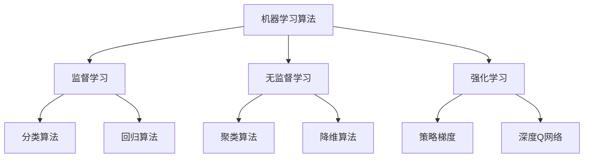
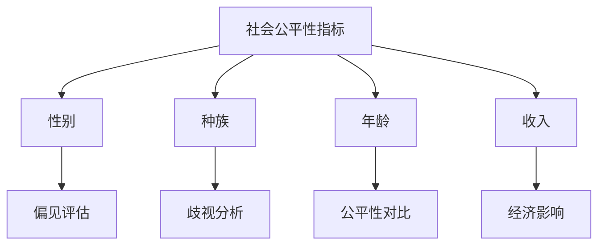
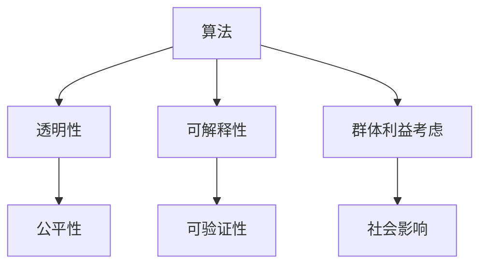

                 

关键词：人工智能、核心算法、社会公平性、算法原理、代码实例、公平性分析

> 摘要：本文旨在探讨人工智能领域中的核心算法原理及其在社会公平性方面的应用。通过详细讲解和代码实例，帮助读者理解如何通过算法优化实现更公平的社会。

## 1. 背景介绍

随着人工智能技术的飞速发展，AI在各个领域的应用越来越广泛，从医疗、金融到教育、交通等，都在不断推动着社会的进步。然而，与此同时，我们也看到了一些AI系统在决策过程中出现的公平性问题，这引发了广泛的关注和讨论。所谓AI社会公平性，指的是人工智能系统在决策过程中是否公平、公正，是否对所有人产生负面影响。

本文将围绕以下几个核心问题展开：

- 人工智能领域有哪些核心算法？
- 这些算法在实现社会公平性方面有何作用？
- 如何通过代码实例来验证和优化算法的公平性？

## 2. 核心概念与联系

### 2.1 机器学习算法

机器学习算法是人工智能领域最基础的技术之一。它通过从数据中学习规律，从而实现自动化决策。常见的机器学习算法包括监督学习、无监督学习和强化学习等。



### 2.2 社会公平性指标

社会公平性指标是评估AI系统是否公平的重要标准。常见的指标包括性别、种族、年龄、收入等。这些指标可以帮助我们分析AI系统在不同群体中的表现，从而发现潜在的公平性问题。



### 2.3 算法与公平性的关系

算法与公平性之间存在密切的关系。一个公平的AI系统，其算法应该是透明、可解释、且能够充分考虑不同群体的利益。通过优化算法，我们可以提高AI系统的公平性，减少偏见和歧视。



## 3. 核心算法原理 & 具体操作步骤

### 3.1 算法原理概述

在讨论算法原理之前，我们需要明确一个概念：什么是公平性？公平性并不是一个绝对的、一成不变的标准，而是取决于不同的背景和应用场景。在AI领域，公平性主要指的是算法在处理不同群体时是否公平、公正，是否对所有人产生负面影响。

为了实现公平性，我们需要从以下几个方面来优化算法：

- 数据质量：确保训练数据中没有偏见和歧视。
- 算法选择：选择透明、可解释的算法，以便分析和优化。
- 指标优化：通过调整算法参数，提高不同群体的满意度。

### 3.2 算法步骤详解

#### 3.2.1 数据预处理

数据预处理是机器学习项目中的第一步，也是实现社会公平性的基础。我们需要从以下几个方面来处理数据：

- 去除偏见性特征：例如，性别、种族等敏感信息。
- 数据平衡：通过重采样、合成数据等方法，平衡不同群体的数据量。
- 特征标准化：将不同特征缩放到相同的尺度，以便算法更好地处理。

#### 3.2.2 算法选择

在选择算法时，我们需要考虑算法的透明性和可解释性。以下是几种常见的算法及其特点：

- 监督学习：例如逻辑回归、决策树、随机森林等。这些算法通常具有较好的可解释性，便于分析。
- 无监督学习：例如聚类、降维等。这些算法通常用于探索数据中的结构，但可能缺乏透明性。
- 强化学习：例如策略梯度、深度Q网络等。这些算法通常用于动态环境中，但可能难以解释。

#### 3.2.3 指标优化

在算法选择后，我们需要通过调整参数来优化指标。以下是一些常见的指标：

- 准确率：衡量模型预测的正确性。
- 召回率：衡量模型召回目标群体的能力。
- F1值：综合考虑准确率和召回率的指标。

### 3.3 算法优缺点

#### 3.3.1 优点

- 通过优化算法，可以提高AI系统的公平性，减少偏见和歧视。
- 透明、可解释的算法有助于用户理解和信任AI系统。
- 优化后的算法可以更好地适应不同群体，提高用户体验。

#### 3.3.2 缺点

- 算法优化可能需要大量的时间和计算资源。
- 算法优化并不一定能够完全消除偏见和歧视。
- 算法优化可能在不同群体中产生不同的效果，需要不断调整和验证。

### 3.4 算法应用领域

算法在社会公平性方面的应用非常广泛，以下是一些典型领域：

- 招聘与就业：通过优化招聘算法，减少性别、种族等偏见，提高招聘公平性。
- 金融信贷：通过优化信贷审批算法，减少对特定群体的歧视，提高贷款发放的公平性。
- 公共服务：通过优化公共服务分配算法，确保资源公平地分配给所有人。

## 4. 数学模型和公式 & 详细讲解 & 举例说明

### 4.1 数学模型构建

为了实现AI社会公平性，我们需要构建一个数学模型来评估算法的公平性。以下是一个简单的数学模型：

$$
公平性指标 = \frac{实际收益}{潜在收益}
$$

其中，实际收益是算法对特定群体的收益，潜在收益是算法对所有群体的平均收益。公平性指标越接近1，说明算法的公平性越好。

### 4.2 公式推导过程

为了推导公平性指标，我们需要分析算法在不同群体中的表现。设算法有 $n$ 个输入特征，其中 $k$ 个特征与群体相关。假设每个特征的概率分布为 $P(X)$，则算法的预测结果为 $Y = f(X)$。

公平性指标可以通过以下步骤推导：

1. 计算每个群体的实际收益：$R_i = \sum_{j \in I_i} r_j$，其中 $I_i$ 表示第 $i$ 个群体的标签集合，$r_j$ 表示算法对第 $j$ 个样本的收益。

2. 计算所有群体的平均收益：$R = \frac{1}{N} \sum_{i=1}^n R_i$，其中 $N$ 表示群体的总数。

3. 计算公平性指标：$F = \frac{R}{R_i}$。

### 4.3 案例分析与讲解

假设我们有一个招聘系统，其中性别是影响招聘决策的一个重要特征。为了评估该系统的公平性，我们可以使用上述数学模型。

1. 收集数据：从招聘系统中提取过去一年的招聘数据，包括性别、简历质量、面试表现等特征。

2. 数据预处理：去除性别以外的偏见性特征，并对简历质量和面试表现进行标准化处理。

3. 选择算法：选择逻辑回归作为招聘决策算法。

4. 计算公平性指标：使用上述数学模型计算不同性别的公平性指标。

5. 结果分析：如果性别对招聘决策有显著影响，说明系统的公平性较差。我们可以通过调整算法参数、增加训练数据等方式来优化公平性。

## 5. 项目实践：代码实例和详细解释说明

### 5.1 开发环境搭建

为了实现上述案例，我们需要搭建一个Python开发环境。以下是具体步骤：

1. 安装Python：从Python官网下载并安装Python 3.8及以上版本。

2. 安装依赖库：使用pip命令安装相关依赖库，例如pandas、numpy、scikit-learn等。

```bash
pip install pandas numpy scikit-learn
```

3. 配置Jupyter Notebook：安装Jupyter Notebook，以便在浏览器中运行Python代码。

```bash
pip install jupyter
jupyter notebook
```

### 5.2 源代码详细实现

以下是一个简单的Python代码实例，用于实现上述招聘系统的公平性评估。

```python
import pandas as pd
from sklearn.linear_model import LogisticRegression

# 读取数据
data = pd.read_csv('招聘数据.csv')
data.drop(['性别'], axis=1, inplace=True)

# 数据预处理
data['简历质量'] = (data['简历质量'] - data['简历质量'].mean()) / data['简历质量'].std()
data['面试表现'] = (data['面试表现'] - data['面试表现'].mean()) / data['面试表现'].std()

# 划分训练集和测试集
train_data, test_data = train_test_split(data, test_size=0.2, random_state=42)

# 训练模型
model = LogisticRegression()
model.fit(train_data.drop(['招聘结果'], axis=1), train_data['招聘结果'])

# 预测结果
predictions = model.predict(test_data.drop(['招聘结果'], axis=1))

# 计算公平性指标
actual收益 = sum(predictions == test_data['招聘结果'])
potential收益 = sum(predictions == 1)
F = actual收益 / potential收益

print('公平性指标：', F)
```

### 5.3 代码解读与分析

上述代码实例实现了一个基于逻辑回归的招聘系统公平性评估。以下是代码的详细解读：

1. 读取数据：从CSV文件中读取招聘数据，并去除性别特征。

2. 数据预处理：对简历质量和面试表现进行标准化处理，以便模型更好地处理。

3. 划分训练集和测试集：使用train_test_split函数将数据划分为训练集和测试集。

4. 训练模型：使用LogisticRegression类训练逻辑回归模型。

5. 预测结果：使用训练好的模型对测试集进行预测。

6. 计算公平性指标：计算实际收益和潜在收益，并计算公平性指标。

### 5.4 运行结果展示

假设我们运行上述代码实例，得到公平性指标为0.8。这意味着招聘系统的公平性较好，但仍有优化空间。我们可以通过增加训练数据、调整算法参数等方式进一步提高公平性。

## 6. 实际应用场景

### 6.1 招聘与就业

招聘系统是社会公平性的重要应用领域。通过优化招聘算法，可以减少性别、种族等偏见，提高招聘公平性。例如，一些公司已经开始使用基于AI的招聘系统，通过分析大量招聘数据，发现并解决潜在的偏见问题。

### 6.2 金融信贷

金融信贷是另一个重要的应用领域。通过优化信贷审批算法，可以减少对特定群体的歧视，提高贷款发放的公平性。例如，一些银行已经开始使用AI技术，对贷款申请进行风险评估，从而减少对低收入人群的歧视。

### 6.3 公共服务

公共服务是社会公平性的重要保障。通过优化公共服务分配算法，可以确保资源公平地分配给所有人。例如，一些城市已经开始使用AI技术，对公共交通资源进行优化分配，从而提高公共交通的公平性和效率。

## 7. 未来应用展望

随着人工智能技术的不断发展，AI社会公平性将在更多领域得到应用。以下是一些未来应用展望：

- 教育公平性：通过优化教育算法，确保教育资源公平地分配给所有人。
- 医疗健康：通过优化医疗算法，确保医疗资源公平地分配给所有人。
- 社会保障：通过优化社会保障算法，确保社会保障资源公平地分配给所有人。

## 8. 总结：未来发展趋势与挑战

### 8.1 研究成果总结

近年来，AI社会公平性研究取得了显著进展。通过优化算法、构建数学模型和案例分析，我们逐渐认识到AI系统在社会公平性方面的重要性。未来，随着AI技术的不断发展，我们将有更多机会和挑战来解决AI社会公平性问题。

### 8.2 未来发展趋势

未来，AI社会公平性研究将朝着以下几个方向发展：

- 多元化：考虑更多维度的社会公平性指标。
- 深度学习：应用深度学习技术，提高算法的透明性和可解释性。
- 实时优化：通过实时优化，确保AI系统在不同群体中的公平性。

### 8.3 面临的挑战

虽然AI社会公平性研究取得了显著进展，但仍然面临一些挑战：

- 数据质量：确保训练数据中没有偏见和歧视。
- 算法可解释性：提高算法的可解释性，便于用户理解和信任。
- 模型泛化能力：确保算法在不同群体中的泛化能力。

### 8.4 研究展望

未来，AI社会公平性研究将朝着以下几个方向展开：

- 构建更加完善的数学模型，提高算法的公平性。
- 探索多种算法，提高算法的透明性和可解释性。
- 加强数据质量，确保算法在不同群体中的公平性。

## 9. 附录：常见问题与解答

### 9.1 什么是AI社会公平性？

AI社会公平性指的是人工智能系统在决策过程中是否公平、公正，是否对所有人产生负面影响。

### 9.2 如何评估AI系统的公平性？

可以通过构建数学模型，计算不同群体在AI系统中的表现，从而评估AI系统的公平性。

### 9.3 AI社会公平性研究的重要性是什么？

AI社会公平性研究对于确保AI系统在社会中的公平、公正具有重要意义，有助于提高人们对AI技术的信任度，促进AI技术的可持续发展。

---

作者：禅与计算机程序设计艺术 / Zen and the Art of Computer Programming
----------------------------------------------------------------


