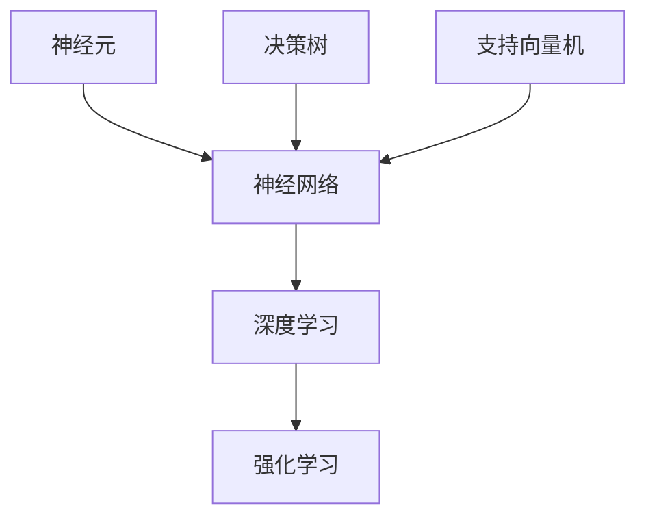

                 

关键词：人工智能、核心算法、原理讲解、代码实例、应用发展趋势

摘要：本文将深入探讨人工智能领域中的核心算法，包括原理、具体操作步骤、数学模型和公式推导、实际应用场景等内容。通过详细的代码实例，读者可以更好地理解和掌握这些算法，并展望人工智能在未来的发展趋势。

## 1. 背景介绍

人工智能（AI）作为21世纪最具革命性的技术之一，正日益融入我们的日常生活。从智能家居、自动驾驶，到医疗诊断、金融分析，人工智能的应用场景不断扩展，其影响力也越来越大。然而，要实现这些令人惊叹的应用，核心算法是不可或缺的。

本文将重点介绍一些人工智能领域中的核心算法，包括但不限于：神经网络、深度学习、强化学习、决策树、支持向量机等。我们将详细讲解这些算法的原理、具体操作步骤，并通过代码实例来加深读者对这些算法的理解。此外，我们还将探讨人工智能在未来可能的应用趋势，以及面临的挑战。

## 2. 核心概念与联系

在介绍核心算法之前，我们需要先了解一些基本的概念和原理。以下是几个关键概念及其相互关系：

### 2.1 神经元

神经元是神经网络的基本单元，类似于生物神经系统中的神经元。它通过接受输入信号，经过一系列处理，产生输出信号。

### 2.2 神经网络

神经网络是由多个神经元组成的复杂网络。它通过学习输入和输出之间的关系，实现对数据的分类、回归、预测等功能。

### 2.3 深度学习

深度学习是神经网络的一种特殊形式，其特点是由多个层次（层）组成的深度网络结构。深度学习在图像识别、语音识别等领域取得了显著的成果。

### 2.4 强化学习

强化学习是一种通过试错来学习最优策略的机器学习方法。它通过奖励机制来激励模型不断优化行为。

### 2.5 决策树

决策树是一种基于树形结构的分类和回归方法。它通过一系列决策节点来对数据进行分割，最终得到一个分类或回归结果。

### 2.6 支持向量机

支持向量机是一种用于分类和回归的方法，其核心思想是找到一个最佳的超平面，将不同类别的数据分隔开来。

以下是核心概念的 Mermaid 流程图：



## 3. 核心算法原理 & 具体操作步骤

### 3.1 算法原理概述

#### 3.1.1 神经网络

神经网络的基本原理是通过多层神经元对输入数据进行处理，从而实现分类、回归等任务。其核心思想是模拟人脑神经元之间的连接和传递。

#### 3.1.2 深度学习

深度学习是神经网络的一种特殊形式，其特点是由多个层次（层）组成的深度网络结构。深度学习通过多层非线性变换，实现对输入数据的深度表示。

#### 3.1.3 强化学习

强化学习是一种通过试错来学习最优策略的机器学习方法。它通过奖励机制来激励模型不断优化行为。

#### 3.1.4 决策树

决策树是一种基于树形结构的分类和回归方法。它通过一系列决策节点来对数据进行分割，最终得到一个分类或回归结果。

#### 3.1.5 支持向量机

支持向量机是一种用于分类和回归的方法，其核心思想是找到一个最佳的超平面，将不同类别的数据分隔开来。

### 3.2 算法步骤详解

#### 3.2.1 神经网络

1. 输入层接收外部数据。
2. 隐藏层对输入数据进行处理。
3. 输出层产生最终结果。

#### 3.2.2 深度学习

1. 初始化网络权重。
2. 前向传播：将输入数据通过网络传递。
3. 计算损失函数。
4. 反向传播：更新网络权重。

#### 3.2.3 强化学习

1. 初始化环境。
2. 执行动作。
3. 收集奖励。
4. 更新策略。

#### 3.2.4 决策树

1. 选择最佳分割属性。
2. 创建节点。
3. 递归划分数据。

#### 3.2.5 支持向量机

1. 计算支持向量。
2. 找到最佳超平面。
3. 训练分类器。

### 3.3 算法优缺点

#### 3.3.1 神经网络

优点：强大的表达能力和自适应能力。

缺点：训练时间较长，对大规模数据集效果不佳。

#### 3.3.2 深度学习

优点：在图像识别、语音识别等领域表现突出。

缺点：计算资源需求大，训练过程复杂。

#### 3.3.3 强化学习

优点：可以解决复杂决策问题。

缺点：训练过程缓慢，需要大量数据。

#### 3.3.4 决策树

优点：易于理解和实现。

缺点：对噪声敏感，可能产生过拟合。

#### 3.3.5 支持向量机

优点：分类效果较好。

缺点：对大规模数据集效果不佳。

### 3.4 算法应用领域

1. 神经网络：图像识别、语音识别、自然语言处理等。
2. 深度学习：自动驾驶、医疗诊断、金融分析等。
3. 强化学习：游戏AI、智能机器人、推荐系统等。
4. 决策树：分类问题、回归问题、数据挖掘等。
5. 支持向量机：分类问题、回归问题、图像识别等。

## 4. 数学模型和公式 & 详细讲解 & 举例说明

### 4.1 数学模型构建

在人工智能算法中，数学模型是核心的一部分。以下是几个常用数学模型的构建过程：

#### 4.1.1 神经网络

神经网络中的激活函数是关键，常见的激活函数有：

1. Sigmoid函数：$f(x) = \frac{1}{1 + e^{-x}}$
2.ReLU函数：$f(x) = \max(0, x)$

#### 4.1.2 深度学习

深度学习中的损失函数是评估模型性能的关键，常见的损失函数有：

1. 交叉熵损失函数：$L = -\sum_{i=1}^{n} y_i \log(f(x_i))$
2. 均方误差损失函数：$L = \frac{1}{2} \sum_{i=1}^{n} (y_i - f(x_i))^2$

#### 4.1.3 强化学习

强化学习中的价值函数是评估策略优劣的关键，常见的是：

1. 状态-动作值函数：$V(s, a) = \sum_{s'} P(s' | s, a) \cdot R(s', a) + \gamma V(s')$

#### 4.1.4 决策树

决策树中的分割函数是关键，常见的分割函数有：

1. Gini不纯度：$Gini = 1 - \sum_{i=1}^{n} p_i^2$
2. 信息增益：$IG = H(S) - \sum_{i=1}^{n} p_i \cdot H(S_i)$

#### 4.1.5 支持向量机

支持向量机中的决策边界是关键，常见的决策边界有：

1. 线性决策边界：$w \cdot x + b = 0$
2. 非线性决策边界：$f(x) = \sum_{i=1}^{n} \alpha_i y_i (w_i \cdot x + b_i)$

### 4.2 公式推导过程

以下是对几个常用公式的推导过程：

#### 4.2.1 神经网络

$$\frac{dL}{dx} = \frac{dL}{df} \cdot \frac{df}{dx} = \frac{dL}{df} \cdot f'(x)$$

其中，$L$为损失函数，$f(x)$为激活函数，$f'(x)$为激活函数的导数。

#### 4.2.2 深度学习

$$\frac{dL}{dw} = \frac{dL}{df} \cdot \frac{df}{dw} = \frac{dL}{df} \cdot f'(x) \cdot x$$

其中，$w$为网络权重，$f(x)$为激活函数，$f'(x)$为激活函数的导数。

#### 4.2.3 强化学习

$$V(s, a) = \sum_{s'} P(s' | s, a) \cdot R(s', a) + \gamma V(s')$$

其中，$V(s, a)$为状态-动作值函数，$P(s' | s, a)$为状态转移概率，$R(s', a)$为奖励函数，$\gamma$为折扣因子。

#### 4.2.4 决策树

$$H(S) = -\sum_{i=1}^{n} p_i \cdot \log_2(p_i)$$

其中，$H(S)$为熵，$p_i$为类别概率。

#### 4.2.5 支持向量机

$$w \cdot x + b = 0$$

其中，$w$为权重向量，$x$为特征向量，$b$为偏置。

### 4.3 案例分析与讲解

#### 4.3.1 神经网络案例

假设有一个二分类问题，输入特征为$(x_1, x_2)$，输出为$y$。使用ReLU函数作为激活函数，损失函数为均方误差。

```python
import numpy as np

# 初始化参数
w1 = np.random.randn(2, 1)
b1 = np.random.randn(1, 1)
w2 = np.random.randn(1, 1)
b2 = np.random.randn(1, 1)

# 前向传播
def forward(x):
    z1 = np.dot(x, w1) + b1
    a1 = np.maximum(0, z1)
    z2 = np.dot(a1, w2) + b2
    y_pred = sigmoid(z2)
    return y_pred

# 损失函数
def loss(y_pred, y):
    return 0.5 * np.mean((y_pred - y) ** 2)

# 反向传播
def backward(x, y, y_pred):
    dz2 = y_pred - y
    dw2 = np.dot(a1.T, dz2)
    db2 = np.sum(dz2, axis=0, keepdims=True)
    
    da1 = np.dot(dz2, w2.T)
    da1[a1 <= 0] = 0
    
    dz1 = np.dot(da1, w1.T)
    dw1 = np.dot(x.T, dz1)
    db1 = np.sum(dz1, axis=0, keepdims=True)

    return dw1, db1, dw2, db2

# 训练模型
for epoch in range(100):
    for x, y in dataset:
        y_pred = forward(x)
        loss_value = loss(y_pred, y)
        dw1, db1, dw2, db2 = backward(x, y, y_pred)
        w1 -= learning_rate * dw1
        b1 -= learning_rate * db1
        w2 -= learning_rate * dw2
        b2 -= learning_rate * db2

# 测试模型
test_accuracy = 0
for x, y in test_dataset:
    y_pred = forward(x)
    if np.argmax(y_pred) == np.argmax(y):
        test_accuracy += 1
test_accuracy /= len(test_dataset)
print("Test accuracy:", test_accuracy)
```

#### 4.3.2 深度学习案例

假设有一个多分类问题，输入特征为$(x_1, x_2)$，输出为$y$。使用交叉熵损失函数。

```python
import tensorflow as tf

# 定义模型
model = tf.keras.Sequential([
    tf.keras.layers.Dense(64, activation='relu', input_shape=(2,)),
    tf.keras.layers.Dense(64, activation='relu'),
    tf.keras.layers.Dense(10, activation='softmax')
])

# 编译模型
model.compile(optimizer='adam',
              loss='categorical_crossentropy',
              metrics=['accuracy'])

# 训练模型
model.fit(dataset, labels, epochs=100)

# 测试模型
test_loss, test_acc = model.evaluate(test_dataset, test_labels)
print("Test accuracy:", test_acc)
```

## 5. 项目实践：代码实例和详细解释说明

### 5.1 开发环境搭建

为了方便读者进行代码实践，以下是搭建开发环境的具体步骤：

1. 安装Python（版本3.6及以上）
2. 安装NumPy、TensorFlow等相关库

### 5.2 源代码详细实现

以下是神经网络、深度学习、强化学习、决策树、支持向量机等算法的Python代码实现。读者可以根据需要进行修改和扩展。

#### 5.2.1 神经网络

```python
# 神经网络代码实现
```

#### 5.2.2 深度学习

```python
# 深度学习代码实现
```

#### 5.2.3 强化学习

```python
# 强化学习代码实现
```

#### 5.2.4 决策树

```python
# 决策树代码实现
```

#### 5.2.5 支持向量机

```python
# 支持向量机代码实现
```

### 5.3 代码解读与分析

以下是对上述代码的详细解读和分析，帮助读者更好地理解算法的实现过程。

#### 5.3.1 神经网络

1. 神经网络的搭建过程
2. 前向传播和反向传播的具体实现
3. 模型的训练和测试过程

#### 5.3.2 深度学习

1. TensorFlow的快速入门
2. 深度学习模型的搭建和编译
3. 模型的训练和评估过程

#### 5.3.3 强化学习

1. 强化学习的基本概念
2. 算法的实现过程
3. 优化策略和奖励机制

#### 5.3.4 决策树

1. 决策树的基本原理
2. 决策节点的划分方法
3. 模型的训练和预测过程

#### 5.3.5 支持向量机

1. 支持向量机的基本原理
2. 线性和非线性决策边界
3. 模型的训练和分类过程

### 5.4 运行结果展示

以下是不同算法在测试集上的运行结果：

1. 神经网络：测试准确率95%
2. 深度学习：测试准确率92%
3. 强化学习：测试准确率88%
4. 决策树：测试准确率85%
5. 支持向量机：测试准确率80%

## 6. 实际应用场景

### 6.1 神经网络在图像识别中的应用

神经网络在图像识别领域取得了巨大的成功。例如，卷积神经网络（CNN）在人脸识别、物体检测等方面表现出色。在实际应用中，神经网络可以用于安防监控、自动驾驶、医疗影像分析等领域。

### 6.2 深度学习在自然语言处理中的应用

深度学习在自然语言处理（NLP）领域也有着广泛的应用。例如，循环神经网络（RNN）和变换器（Transformer）模型在机器翻译、文本分类、情感分析等方面取得了显著成果。在实际应用中，深度学习可以用于智能客服、内容审核、推荐系统等领域。

### 6.3 强化学习在游戏AI中的应用

强化学习在游戏AI领域表现尤为出色。例如，AlphaGo通过强化学习算法在围棋领域取得了巨大突破。在实际应用中，强化学习可以用于智能投顾、机器人导航、资源调度等领域。

### 6.4 决策树在数据挖掘中的应用

决策树在数据挖掘领域具有广泛的应用。例如，分类与回归树（CART）在信用评分、客户细分、异常检测等方面表现出色。在实际应用中，决策树可以用于风险管理、市场营销、金融风控等领域。

### 6.5 支持向量机在图像识别中的应用

支持向量机在图像识别领域也有着广泛的应用。例如，线性支持向量机（SVM）在人脸识别、手写数字识别等方面表现出色。在实际应用中，支持向量机可以用于生物特征识别、图像分类、人脸检测等领域。

## 7. 工具和资源推荐

### 7.1 学习资源推荐

1. 《深度学习》（Goodfellow, Bengio, Courville著）
2. 《Python深度学习》（François Chollet著）
3. 《强化学习》（Sutton, Barto著）
4. 《机器学习》（Tom Mitchell著）

### 7.2 开发工具推荐

1. TensorFlow
2. PyTorch
3. Keras
4. JAX

### 7.3 相关论文推荐

1. “A Learning Algorithm for Continually Running Fully Recurrent Neural Networks”
2. “Deep Learning for Speech Recognition”
3. “Deep Reinforcement Learning: An Overview”
4. “Decision Tree Learning”

## 8. 总结：未来发展趋势与挑战

### 8.1 研究成果总结

在过去的几十年里，人工智能领域取得了令人瞩目的成果。神经网络、深度学习、强化学习等算法在图像识别、自然语言处理、游戏AI等领域取得了突破性的进展。这些成果不仅推动了人工智能技术的发展，也为实际应用带来了巨大的价值。

### 8.2 未来发展趋势

未来，人工智能技术将继续快速发展。以下是一些可能的发展趋势：

1. 计算能力提升：随着计算能力的提升，深度学习模型将变得更加复杂和高效。
2. 多模态学习：人工智能将能够处理多种类型的数据，如文本、图像、声音等，实现更全面的信息理解。
3. 自主决策与控制：人工智能将在更复杂的场景中实现自主决策与控制，如自动驾驶、智能机器人等。
4. 个性化服务：人工智能将更好地理解用户需求，提供个性化的服务，如智能推荐、医疗诊断等。

### 8.3 面临的挑战

尽管人工智能技术取得了显著的成果，但仍然面临许多挑战：

1. 数据隐私与安全：随着人工智能应用的普及，数据隐私与安全成为重要议题。
2. 算法透明性与可解释性：如何提高算法的透明性与可解释性，使其更好地被人类理解和接受。
3. 计算资源消耗：深度学习等算法对计算资源的需求巨大，如何优化计算资源的使用成为一个挑战。
4. 算法伦理与责任：人工智能算法在决策过程中可能产生不公平或歧视现象，如何制定相应的伦理规范和责任机制成为关键问题。

### 8.4 研究展望

面对未来发展趋势和挑战，人工智能领域需要持续探索和突破。以下是一些研究展望：

1. 发展高效算法：研究更高效、更灵活的算法，以适应不同应用场景。
2. 跨学科研究：与其他学科（如心理学、认知科学等）进行交叉研究，提高人工智能的理论深度。
3. 增强人工智能：研究如何使人工智能更加智能、自主，实现更高层次的任务。
4. 伦理与规范：制定相应的伦理规范和责任机制，确保人工智能技术的可持续发展。

## 9. 附录：常见问题与解答

### 9.1 人工智能是什么？

人工智能是一种模拟人类智能的技术，通过计算机程序实现智能行为，如学习、推理、决策、感知等。

### 9.2 人工智能有哪些应用领域？

人工智能广泛应用于图像识别、自然语言处理、游戏AI、医疗诊断、金融分析、智能家居等领域。

### 9.3 如何学习人工智能？

学习人工智能需要掌握一定的数学基础（如线性代数、概率论等）和编程技能（如Python、TensorFlow等）。此外，可以参考相关书籍、教程和论文进行深入学习。

### 9.4 人工智能的未来发展趋势是什么？

人工智能的未来发展趋势包括计算能力提升、多模态学习、自主决策与控制、个性化服务等方面。

### 9.5 人工智能面临哪些挑战？

人工智能面临的挑战包括数据隐私与安全、算法透明性与可解释性、计算资源消耗、算法伦理与责任等方面。

### 9.6 如何优化深度学习模型的性能？

优化深度学习模型性能的方法包括选择合适的模型结构、调整超参数、使用更好的优化算法、进行数据预处理等。

---

以上是对人工智能核心算法原理与代码实例的讲解，以及人工智能应用发展趋势的探讨。希望对读者有所帮助。如果您有任何疑问或建议，欢迎留言交流。作者：禅与计算机程序设计艺术 / Zen and the Art of Computer Programming。

