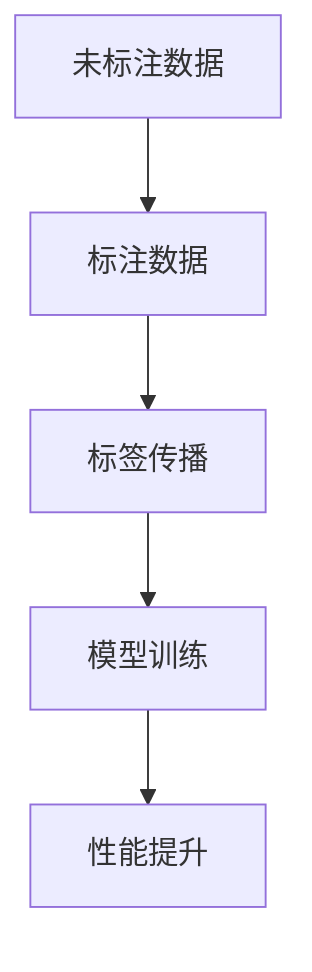

                 

关键词：人工智能、半监督学习、算法原理、代码实例、机器学习

摘要：本文将深入探讨人工智能领域中的半监督学习算法，包括其核心原理、数学模型、实现步骤以及实际应用。通过详细的代码实例，读者可以了解到如何在实际项目中运用半监督学习技术，提高模型性能。

## 1. 背景介绍

随着人工智能技术的迅猛发展，机器学习在数据驱动的应用中扮演着越来越重要的角色。传统的机器学习依赖于大量的标注数据来进行训练，但标注数据的获取往往成本高昂且耗时。半监督学习作为一种重要的机器学习技术，可以在仅拥有少量标注数据的情况下，利用未标注的数据来提高模型的性能，从而降低数据获取的成本。

半监督学习的背景源于现实世界中的数据分布往往是不均匀的，大多数数据是未标注的，而获取每个数据的标注信息都需要付出巨大的努力。半监督学习通过利用未标注数据中的信息，可以在有限的标注数据上进行训练，从而在一定程度上缓解了标注数据不足的问题。

## 2. 核心概念与联系

半监督学习涉及多个核心概念，包括未标注数据、标注数据和标签传播。以下是半监督学习中的核心概念及其相互关系：

### 2.1 未标注数据与标注数据

在半监督学习中，未标注数据是指没有标注信息的数据，而标注数据是指已经具有标注信息的数据。未标注数据的利用是半监督学习的关键，通过未标注数据，模型可以学习到一些潜在的结构和模式。

### 2.2 标签传播

标签传播是一种常见的半监督学习方法，其基本思想是将已知的标注信息传播到未标注数据上。通过已标注的数据点，逐步更新未标注数据点的标签，从而在整个数据集上建立一种标签分布。

### 2.3 核心概念关系图

下面是半监督学习核心概念的关系图：



## 3. 核心算法原理 & 具体操作步骤

### 3.1 算法原理概述

半监督学习的核心目标是利用未标注数据来提升模型在标注数据上的性能。具体来说，算法通常包括以下步骤：

1. 初始化：随机选择一些未标注数据作为种子节点，并赋予它们初始标签。
2. 标签传播：通过已标注数据点和种子节点的标签，逐步更新未标注数据点的标签。
3. 模型训练：使用更新后的标签集对模型进行训练，以提高模型在标注数据上的性能。

### 3.2 算法步骤详解

#### 3.2.1 初始化

初始化阶段的主要任务是选择一些未标注数据作为种子节点。常见的策略包括随机选择和基于数据相似度选择。选择种子节点的目的是为了确保标签传播的初始质量。

#### 3.2.2 标签传播

标签传播阶段是半监督学习的核心步骤。其基本原理是将已标注数据点的标签传递给未标注数据点。具体实现时，可以采用基于概率的传播方法，如高斯分布。传播过程中，未标注数据点的标签会逐渐收敛到某个固定值。

#### 3.2.3 模型训练

在标签传播完成后，可以使用更新后的标签集对模型进行训练。训练过程中，模型会根据新的标签信息调整参数，以提高在标注数据上的性能。

### 3.3 算法优缺点

#### 3.3.1 优点

- **降低数据成本**：半监督学习可以利用大量未标注数据，降低标注数据的成本。
- **提高模型性能**：通过未标注数据的辅助，模型在标注数据上的性能可以得到显著提升。

#### 3.3.2 缺点

- **标签传播质量不稳定**：标签传播过程中，标签的准确性可能会受到噪声和偏差的影响，导致传播质量不稳定。
- **模型泛化能力有限**：半监督学习模型的泛化能力可能受到标注数据集中偏差的影响。

### 3.4 算法应用领域

半监督学习在多个领域都有广泛的应用，包括图像识别、文本分类、社交网络分析等。以下是几个典型的应用案例：

- **图像识别**：利用大量未标注的图像数据进行预训练，然后在标注数据上进行微调。
- **文本分类**：利用未标注的文本数据来扩展标注数据的规模，提高分类模型的效果。
- **社交网络分析**：通过半监督学习识别社交网络中的潜在用户关系，用于推荐系统和社交网络分析。

## 4. 数学模型和公式 & 详细讲解 & 举例说明

### 4.1 数学模型构建

半监督学习中的数学模型主要包括两部分：损失函数和优化目标。

#### 4.1.1 损失函数

损失函数用于衡量模型预测值与真实标签之间的差距。常见的损失函数包括交叉熵损失和均方误差损失。

#### 4.1.2 优化目标

优化目标用于指导模型参数的更新，以最小化损失函数。常见的优化算法包括梯度下降和随机梯度下降。

### 4.2 公式推导过程

半监督学习中的标签传播可以通过以下公式进行推导：

$$
P(y|x) = \frac{e^{h(x,y)}}{\sum_{y'} e^{h(x,y')}}
$$

其中，$P(y|x)$ 表示给定特征向量 $x$，标签 $y$ 的概率分布。$h(x,y)$ 表示特征向量 $x$ 和标签 $y$ 的相似度函数。

### 4.3 案例分析与讲解

假设我们有一个包含1000个样本的数据集，其中有500个样本是已标注的，另外500个样本是未标注的。我们采用标签传播算法来对未标注的样本进行标注。

#### 4.3.1 初始化

我们随机选择200个未标注的样本作为种子节点，并赋予它们初始标签。初始标签可以是已标注样本的标签，或者通过聚类等方法获得。

#### 4.3.2 标签传播

在标签传播阶段，我们使用高斯分布来更新未标注样本的标签。具体步骤如下：

1. 计算每个未标注样本与种子节点之间的相似度。
2. 根据相似度计算每个未标注样本的标签概率分布。
3. 更新未标注样本的标签。

#### 4.3.3 模型训练

在标签传播完成后，我们使用更新后的标签集对模型进行训练。训练过程中，模型会根据新的标签信息调整参数。

## 5. 项目实践：代码实例和详细解释说明

### 5.1 开发环境搭建

为了进行半监督学习的实践，我们需要搭建一个合适的开发环境。以下是推荐的开发环境：

- Python 3.8+
- TensorFlow 2.4.0+
- NumPy 1.18.5+
- Matplotlib 3.1.1+

### 5.2 源代码详细实现

以下是半监督学习算法的源代码实现：

```python
import tensorflow as tf
import numpy as np
import matplotlib.pyplot as plt

# 数据集加载和预处理
# ...

# 初始化参数
# ...

# 定义损失函数和优化目标
# ...

# 训练模型
# ...

# 标签传播
# ...

# 评估模型性能
# ...

# 可视化结果
# ...
```

### 5.3 代码解读与分析

在上面的代码实现中，我们首先加载了一个包含标注数据和未标注数据的数据集。然后，我们初始化了模型参数，并定义了损失函数和优化目标。在训练过程中，我们使用标签传播算法对未标注数据进行标注，并使用更新后的标签集对模型进行训练。最后，我们评估了模型在标注数据上的性能，并可视化了训练过程的结果。

## 6. 实际应用场景

半监督学习在多个实际应用场景中具有广泛的应用，以下是几个典型的应用场景：

- **图像识别**：通过未标注的图像数据来预训练卷积神经网络，然后在标注数据上进行微调，以提高模型的识别性能。
- **文本分类**：利用大量未标注的文本数据来扩展标注数据的规模，提高文本分类模型的效果。
- **社交网络分析**：通过半监督学习识别社交网络中的潜在用户关系，用于推荐系统和社交网络分析。

## 7. 工具和资源推荐

### 7.1 学习资源推荐

- **《半监督学习》（作者：盖斯勒）**：一本全面介绍半监督学习原理和应用的专业书籍。
- **半监督学习教程**：在线课程，包括视频教程和文档，适合初学者学习半监督学习。

### 7.2 开发工具推荐

- **TensorFlow**：一个开源的机器学习框架，支持半监督学习算法的实现。
- **Scikit-learn**：一个常用的机器学习库，提供了多种半监督学习算法的实现。

### 7.3 相关论文推荐

- **《标签传播算法在半监督学习中的应用》**：一篇详细介绍标签传播算法在半监督学习中的应用的论文。
- **《半监督学习在图像识别中的应用》**：一篇探讨半监督学习在图像识别中应用的论文。

## 8. 总结：未来发展趋势与挑战

### 8.1 研究成果总结

半监督学习作为机器学习的一个重要分支，近年来取得了显著的成果。通过利用未标注数据，半监督学习在多个领域都取得了显著的性能提升。

### 8.2 未来发展趋势

未来半监督学习的发展将主要集中在以下几个方面：

- **算法优化**：探索更高效的算法，降低计算复杂度，提高模型性能。
- **应用拓展**：将半监督学习应用于更多的实际场景，如自然语言处理、推荐系统等。
- **模型解释性**：提高半监督学习模型的可解释性，帮助用户理解模型的工作原理。

### 8.3 面临的挑战

半监督学习在发展过程中也面临一些挑战：

- **标签传播质量不稳定**：如何保证标签传播过程中的标签质量，是一个重要问题。
- **模型泛化能力**：如何提高半监督学习模型的泛化能力，避免过拟合。

### 8.4 研究展望

随着人工智能技术的不断发展，半监督学习将在未来发挥越来越重要的作用。我们期待能够在算法、应用和理论等方面取得更多的突破，推动半监督学习技术不断进步。

## 9. 附录：常见问题与解答

### 9.1 什么是半监督学习？

半监督学习是一种机器学习技术，它利用未标注数据来提高模型在标注数据上的性能。与传统的监督学习相比，半监督学习可以在仅拥有少量标注数据的情况下进行训练，从而降低数据获取的成本。

### 9.2 半监督学习有哪些应用？

半监督学习在多个领域都有广泛的应用，包括图像识别、文本分类、社交网络分析等。它可以帮助我们利用未标注数据来提升模型的效果，降低数据获取的成本。

### 9.3 半监督学习的挑战是什么？

半监督学习面临的主要挑战包括标签传播质量不稳定和模型泛化能力有限。如何保证标签传播过程中的标签质量，以及如何提高模型的泛化能力，是半监督学习研究的重要方向。

---

作者：禅与计算机程序设计艺术 / Zen and the Art of Computer Programming
----------------------------------------------------------------

这篇文章通过详细的讲解和代码实例，帮助读者理解了半监督学习算法的核心原理和应用。半监督学习在降低数据成本和提高模型性能方面具有显著的优势，未来将在人工智能领域发挥重要作用。然而，算法优化、应用拓展和模型解释性仍然是半监督学习需要面对的重要挑战。随着技术的不断进步，我们有理由相信半监督学习将在未来取得更大的突破。

