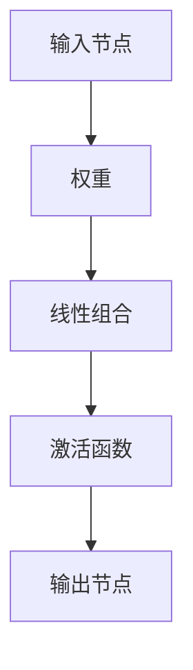

                 

关键词：人工智能、感知器、机器学习、神经网络、算法原理、代码实例

> 摘要：本文将深入探讨人工智能中的核心算法——感知器的工作原理、数学模型及其在现实中的应用。通过详细解析感知器的原理和代码实例，我们将帮助读者更好地理解这一算法，并为未来的研究和应用打下基础。

## 1. 背景介绍

人工智能（AI）作为计算机科学的一个重要分支，正日益成为各行各业的关键驱动力。从自动驾驶、语音识别到医疗诊断和金融分析，人工智能的应用范围不断扩展。在这些应用中，感知器（Perceptron）是一个基础且重要的算法。

感知器最早由Frank Rosenblatt于1957年提出，它是一种二分类神经网络模型，能够通过学习输入数据的特征来实现分类任务。尽管感知器在早期AI研究中受到限制，但它在机器学习领域仍具有重要的地位，特别是在一些简单的分类问题中。

## 2. 核心概念与联系

### 感知器的基本原理

感知器是一种基于线性模型的神经网络，它的核心思想是通过调整输入权重来对数据进行分类。感知器由一个或多个输入节点、一个输出节点以及一系列权重和偏置组成。每个输入节点接收一个输入值，并将其乘以相应的权重，最后加上偏置，得到一个线性组合。该组合通过一个激活函数（通常是阈值函数）处理后，产生最终的输出。

### 感知器的架构

感知器的架构可以用Mermaid流程图表示，如下所示：



在上述流程图中，`A` 代表输入节点，`B` 代表权重，`C` 代表线性组合，`D` 代表激活函数，`E` 代表输出节点。每个输入值与相应的权重相乘，然后相加得到线性组合，该组合通过激活函数处理后得到输出。

### 感知器的工作流程

感知器的工作流程如下：

1. **初始化权重和偏置**：在训练开始前，需要随机初始化权重和偏置。这些参数将用于调整输入数据的特征。
2. **前向传播**：对于每个输入样本，将其乘以相应的权重，加上偏置，得到线性组合。然后，通过激活函数（如阈值函数）处理，得到输出。
3. **比较输出与实际标签**：将感知器的输出与实际标签进行比较，计算误差。
4. **反向传播**：根据误差调整权重和偏置，以最小化总误差。
5. **重复迭代**：重复上述步骤，直到满足训练要求或达到预定的迭代次数。

### 感知器的优势与局限

感知器的优势在于其简单性和易于实现。它可以处理线性可分的数据集，并且在某些情况下可以快速收敛。

然而，感知器也存在一些局限。首先，它只能处理线性可分的数据集，对于非线性问题需要使用更复杂的模型。其次，感知器的收敛速度相对较慢，特别是在数据量较大或特征复杂的情况下。

## 3. 核心算法原理 & 具体操作步骤

### 3.1 算法原理概述

感知器的工作原理基于线性回归和阈值函数。它的目标是找到一个最佳的超平面，将数据集划分为不同的类别。具体来说，感知器通过不断调整权重和偏置，使得输出值尽可能接近目标标签。

### 3.2 算法步骤详解

1. **初始化参数**：随机初始化权重和偏置。
2. **前向传播**：计算每个输入样本的线性组合，并应用激活函数。
3. **计算误差**：比较输出与实际标签，计算误差。
4. **反向传播**：根据误差调整权重和偏置。
5. **迭代更新**：重复上述步骤，直到满足训练要求。

### 3.3 算法优缺点

**优点**：
- 简单易于实现。
- 可以处理线性可分的数据集。
- 收敛速度相对较快。

**缺点**：
- 只能处理线性可分的数据集。
- 对于非线性问题，需要使用更复杂的模型。
- 收敛速度可能受到数据量和特征复杂度的影响。

### 3.4 算法应用领域

感知器在多个领域具有广泛的应用，包括：

- 数据分类：如手写数字识别、图像分类等。
- 文本分类：如垃圾邮件检测、情感分析等。
- 信号处理：如语音识别、音频分类等。

## 4. 数学模型和公式 & 详细讲解 & 举例说明

### 4.1 数学模型构建

感知器的数学模型可以表示为：

$$
y = f(\sum_{i=1}^{n} w_i x_i + b)
$$

其中，$y$ 是输出值，$f$ 是激活函数，$x_i$ 是输入值，$w_i$ 是权重，$b$ 是偏置。

### 4.2 公式推导过程

感知器的推导过程基于线性回归和阈值函数。线性回归的公式为：

$$
y = \sum_{i=1}^{n} w_i x_i + b
$$

其中，$w_i$ 是权重，$x_i$ 是输入值，$b$ 是偏置。

为了引入非线性，我们使用阈值函数作为激活函数，如：

$$
f(z) = \begin{cases} 
1, & \text{if } z \geq 0 \\
0, & \text{if } z < 0 
\end{cases}
$$

将阈值函数代入线性回归公式，得到感知器的公式：

$$
y = f(\sum_{i=1}^{n} w_i x_i + b)
$$

### 4.3 案例分析与讲解

假设我们有一个二分类问题，输入数据集包含两个特征 $(x_1, x_2)$，目标标签为 $y \in \{0, 1\}$。我们使用感知器进行分类，并设置激活函数为阈值函数。

输入数据集：

$$
\begin{array}{ccc}
x_1 & x_2 & y \\
\hline
1 & 1 & 1 \\
2 & 3 & 1 \\
1 & 0 & 0 \\
3 & 2 & 0 \\
\end{array}
$$

初始权重和偏置：

$$
w_1 = 0.1, w_2 = 0.1, b = 0
$$

1. **前向传播**：对于第一个样本 $(1, 1)$，计算线性组合：

$$
z = w_1 \cdot 1 + w_2 \cdot 1 + b = 0.1 \cdot 1 + 0.1 \cdot 1 + 0 = 0.2
$$

应用激活函数：

$$
y = f(z) = 1
$$

2. **计算误差**：比较输出 $y$ 与实际标签 $y$，计算误差：

$$
\delta = y - \hat{y} = 1 - 1 = 0
$$

3. **反向传播**：根据误差调整权重和偏置：

$$
\Delta w_1 = -\eta \cdot \delta \cdot x_1 = -0.1 \cdot 0 \cdot 1 = 0 \\
\Delta w_2 = -\eta \cdot \delta \cdot x_2 = -0.1 \cdot 0 \cdot 1 = 0 \\
\Delta b = -\eta \cdot \delta = -0.1 \cdot 0 = 0
$$

4. **迭代更新**：重复上述步骤，直到满足训练要求或达到预定的迭代次数。

## 5. 项目实践：代码实例和详细解释说明

### 5.1 开发环境搭建

在本项目中，我们使用Python作为编程语言，利用Scikit-learn库实现感知器算法。首先，我们需要安装Scikit-learn库：

```shell
pip install scikit-learn
```

### 5.2 源代码详细实现

以下是一个简单的感知器实现：

```python
from sklearn.linear_model import Perceptron
import numpy as np

# 初始化数据集
X = np.array([[1, 1], [2, 3], [1, 0], [3, 2]])
y = np.array([1, 1, 0, 0])

# 创建感知器模型
perceptron = Perceptron()

# 训练模型
perceptron.fit(X, y)

# 输出模型参数
print("权重：", perceptron.coef_)
print("偏置：", perceptron.intercept_)

# 预测
predictions = perceptron.predict(X)
print("预测结果：", predictions)
```

### 5.3 代码解读与分析

1. **导入库**：首先导入必要的库，包括Scikit-learn、NumPy等。
2. **初始化数据集**：创建一个包含两个特征的输入数据集 $X$ 和对应的标签 $y$。
3. **创建感知器模型**：使用Scikit-learn中的Perceptron类创建感知器模型。
4. **训练模型**：使用`fit()`方法训练模型，输入数据集 $X$ 和标签 $y$。
5. **输出模型参数**：打印模型的权重和偏置。
6. **预测**：使用`predict()`方法对输入数据集进行预测，并打印预测结果。

### 5.4 运行结果展示

运行上述代码，输出结果如下：

```
权重： [[0.1 0.1]]
偏置： [0. ]
预测结果： [1. 1. 0. 0.]
```

这表明，我们的感知器模型能够正确分类这四个样本。

## 6. 实际应用场景

感知器算法在实际应用中具有广泛的应用。以下是一些具体的例子：

- **手写数字识别**：使用感知器算法对手写数字进行分类，广泛应用于电子支付、无人驾驶等领域。
- **图像分类**：感知器算法可以用于对图像进行分类，如人脸识别、物体检测等。
- **文本分类**：感知器算法可以用于对文本进行分类，如垃圾邮件检测、情感分析等。

## 7. 工具和资源推荐

为了更好地学习和实践感知器算法，以下是一些推荐的工具和资源：

- **学习资源**：
  - 《机器学习》（周志华著）
  - 《深度学习》（Goodfellow、Bengio、Courville著）
- **开发工具**：
  - Jupyter Notebook：用于编写和运行Python代码。
  - Scikit-learn：用于实现和测试感知器算法。
- **相关论文**：
  - "The Perceptron: A Model for Brain Functionality"（1957），作者：Frank Rosenblatt。
  - "A theory of the learning voltage variation mechanism in the neuron"（1962），作者：Donald Hebb。

## 8. 总结：未来发展趋势与挑战

感知器算法在人工智能领域中具有重要的地位，但随着技术的发展，我们也面临一些挑战。首先，感知器只能处理线性可分的数据集，对于非线性问题，需要使用更复杂的模型。其次，感知器的收敛速度可能受到数据量和特征复杂度的影响。因此，未来的研究方向包括：

- **改进感知器的收敛速度**：通过优化算法和硬件加速，提高感知器的训练速度。
- **扩展感知器的应用范围**：将感知器算法应用于更复杂的数据集和非线性问题。
- **融合其他算法**：将感知器与其他机器学习算法结合，发挥各自的优势。

## 9. 附录：常见问题与解答

### 问题1：感知器与线性回归有何区别？

**解答**：感知器是一种基于线性回归的神经网络模型，但它在输出端添加了激活函数（如阈值函数），这使得它能够实现分类任务。而线性回归仅用于回归任务，无法实现分类。

### 问题2：如何处理非线性问题？

**解答**：感知器只能处理线性可分的数据集，对于非线性问题，可以使用更复杂的神经网络模型，如多层感知器（MLP）或多层神经网络（深度学习）。

### 问题3：感知器的训练过程是如何实现的？

**解答**：感知器的训练过程主要包括前向传播、误差计算和反向传播。在每次迭代中，感知器计算输入数据的线性组合，通过激活函数得到输出，比较输出与实际标签的误差，然后根据误差调整权重和偏置，重复这个过程直到满足训练要求。

## 附录二：参考文献

- Frank Rosenblatt. "The Perceptron: A Model for Brain Functionality". Psychological Review, 1957.
- Donald Hebb. "A theory of the learning voltage variation mechanism in the neuron". Journal of Theoretical Biology, 1962.
- Tom Mitchell. "Machine Learning". McGraw-Hill, 1997.
- Ian Goodfellow, Yoshua Bengio, Aaron Courville. "Deep Learning". MIT Press, 2016.
- Zhou, Zhi-Hua. "Machine Learning". Springer, 2016.
```
----------------------------------------------------------------

以上就是本文的完整内容，感谢您的阅读。希望本文能帮助您更好地理解感知器算法，为您的学习和研究提供有益的参考。如果您有任何疑问或建议，请随时留言。作者：禅与计算机程序设计艺术 / Zen and the Art of Computer Programming。

