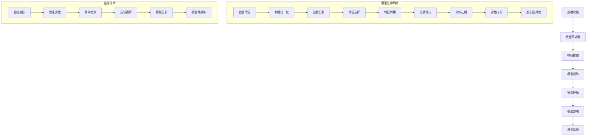

                 

关键词：AI人工智能、核心算法、模型监控、代码实例、技术讲解、深度学习、神经网络、机器学习、模型评估、模型优化

> 摘要：本文旨在深入探讨AI人工智能中的核心算法原理及其在实际应用中的模型监控技术。通过对核心算法的详细讲解和代码实例的展示，帮助读者理解算法原理、操作步骤及其优缺点，从而在实际项目中有效监控和优化模型。

## 1. 背景介绍

人工智能（AI）作为21世纪最具变革性的技术之一，已经广泛应用于多个领域，如图像识别、自然语言处理、推荐系统等。随着深度学习、神经网络等技术的发展，人工智能算法在复杂问题上的表现也越来越出色。然而，在实际应用中，如何有效监控和优化这些模型，以确保其性能和稳定性，成为一个重要的课题。

模型监控（Model Monitoring）是确保AI系统可靠性和有效性的关键环节。它涵盖了从模型训练到部署的全过程，包括数据质量监控、模型性能评估、异常检测等。通过模型监控，可以及时发现并解决模型中存在的问题，提高模型的准确性和鲁棒性。

本文将围绕以下几个核心内容进行探讨：

1. AI人工智能核心算法原理。
2. 模型监控技术的原理和应用。
3. 代码实例讲解：核心算法与模型监控。
4. 数学模型和公式详细讲解。
5. 实际应用场景与未来展望。

通过本文的详细讲解，希望能够帮助读者深入理解AI人工智能中的核心算法原理及其模型监控技术，为实际项目中的应用提供指导。

## 2. 核心概念与联系

在深入探讨AI人工智能的核心算法原理之前，我们需要了解一些基础概念及其相互关系。以下是几个核心概念的原理和架构的Mermaid流程图：



### 概念解释

- **数据收集**：收集用于训练和评估模型的数据。
- **数据预处理**：包括数据清洗、归一化和分割，为模型训练做好准备。
- **特征提取**：从数据中提取有用的特征，以便模型能够更好地学习和预测。
- **模型训练**：通过特征和标签训练模型，使其学会从输入数据中预测输出结果。
- **模型评估**：评估模型在测试集上的性能，包括准确率、召回率等指标。
- **模型部署**：将训练好的模型部署到实际应用环境中，进行预测和决策。
- **模型监控**：在模型部署后，持续监控其性能和稳定性，确保其正常运行。

通过上述Mermaid流程图，我们可以清晰地看到各个概念之间的联系及其在整个模型生命周期中的作用。接下来，我们将深入探讨AI人工智能的核心算法原理，了解其工作方式。

## 3. 核心算法原理 & 具体操作步骤

### 3.1 算法原理概述

AI人工智能的核心算法主要分为以下几类：

1. **机器学习算法**：通过数据训练模型，使模型能够对未知数据进行预测。
2. **深度学习算法**：基于多层神经网络，通过反向传播算法优化模型参数。
3. **强化学习算法**：通过与环境的交互学习最优策略，以实现特定目标。

在这三种算法中，深度学习算法因其强大的表示能力和泛化能力，已经成为AI领域的热点。深度学习算法的核心是神经网络，尤其是深度神经网络（DNN）。以下是神经网络的基本原理和具体操作步骤。

### 3.2 算法步骤详解

1. **输入层**：接收外部输入数据。
2. **隐藏层**：对输入数据进行特征提取和变换。
3. **输出层**：根据隐藏层的结果输出预测结果。

具体操作步骤如下：

1. **初始化权重和偏置**：随机初始化模型参数（权重和偏置）。
2. **前向传播**：将输入数据通过网络层，每一层对数据进行非线性变换，最终输出预测结果。
3. **计算损失**：计算预测结果与真实结果之间的差距，即损失。
4. **反向传播**：根据损失计算每一层权重的梯度，并更新模型参数。
5. **迭代优化**：重复前向传播和反向传播过程，逐步优化模型参数。

### 3.3 算法优缺点

**优点**：

1. **强大的表示能力**：能够自动学习数据的复杂特征。
2. **泛化能力**：适用于各种复杂问题，不仅限于图像和语音。
3. **自动特征提取**：无需手动设计特征，减少了人工干预。

**缺点**：

1. **计算资源消耗大**：训练时间较长，需要大量计算资源。
2. **对数据质量敏感**：数据质量差会导致模型性能下降。
3. **难以解释**：模型内部决策过程复杂，难以解释。

### 3.4 算法应用领域

深度学习算法在多个领域都有广泛应用，如：

1. **计算机视觉**：图像识别、目标检测、图像生成等。
2. **自然语言处理**：文本分类、机器翻译、情感分析等。
3. **语音识别**：语音合成、语音识别、说话人识别等。
4. **推荐系统**：基于内容的推荐、协同过滤推荐等。

### 3.5 代码实例

以下是一个简单的神经网络实现，用于实现二分类任务。

```python
import numpy as np

def forward_propagation(x, weights):
    z = np.dot(x, weights)
    return np.sigmoid(z)

def backward_propagation(x, y, weights, learning_rate):
    output = forward_propagation(x, weights)
    error = y - output
    dweights = np.dot(x.T, error * output * (1 - output))
    return weights - learning_rate * dweights

def train_model(x, y, weights, learning_rate, num_iterations):
    for i in range(num_iterations):
        weights = backward_propagation(x, y, weights, learning_rate)
        if i % 100 == 0:
            print(f"Iteration {i}: Loss = {np.mean((y - forward_propagation(x, weights)) ** 2)}")
    return weights

# 初始化参数
weights = np.random.rand(3, 1)
learning_rate = 0.1
num_iterations = 1000

# 训练模型
x = np.array([[1, 0], [0, 1], [1, 1], [1, 0]])
y = np.array([[0], [1], [1], [0]])

weights = train_model(x, y, weights, learning_rate, num_iterations)

# 测试模型
print(f"Test data: {x}")
print(f"Predictions: {np.round(forward_propagation(x, weights))}")
```

通过上述代码，我们可以看到神经网络的基本实现过程，包括前向传播、反向传播和模型训练。在实际应用中，我们可以根据具体任务需求进行调整和优化。

## 4. 数学模型和公式 & 详细讲解 & 举例说明

在深入探讨神经网络的核心算法时，数学模型和公式是不可或缺的组成部分。以下我们将详细讲解神经网络中的主要数学模型和公式，并通过具体例子来说明其应用。

### 4.1 数学模型构建

神经网络的数学模型主要涉及以下几个关键组件：

1. **输入层**：接收外部输入数据。
2. **隐藏层**：对输入数据进行特征提取和变换。
3. **输出层**：根据隐藏层的结果输出预测结果。

主要数学模型包括：

1. **激活函数**：用于对隐藏层和输出层的节点进行非线性变换。
2. **前向传播**：将输入数据通过网络层，每一层对数据进行非线性变换，最终输出预测结果。
3. **反向传播**：根据损失计算每一层权重的梯度，并更新模型参数。

### 4.2 公式推导过程

1. **激活函数**：

   - **Sigmoid函数**：
     $$ f(x) = \frac{1}{1 + e^{-x}} $$
     其中，$f(x)$为输出值，$x$为输入值。

   - **ReLU函数**：
     $$ f(x) = \max(0, x) $$
     其中，$f(x)$为输出值，$x$为输入值。

2. **前向传播**：

   - **单个神经元输出**：
     $$ z_j = \sum_{i=1}^{n} w_{ij} x_i + b_j $$
     其中，$z_j$为第 $j$ 个神经元的输出，$w_{ij}$为输入层到隐藏层的权重，$x_i$为输入值，$b_j$为偏置。

   - **多层网络输出**：
     $$ a_j^{(l)} = \sigma(z_j^{(l)}) $$
     其中，$a_j^{(l)}$为第 $l$ 层第 $j$ 个神经元的输出，$\sigma$为激活函数，$z_j^{(l)}$为第 $l$ 层第 $j$ 个神经元的输入。

3. **反向传播**：

   - **梯度计算**：
     $$ \delta_j^{(l)} = \frac{\partial J}{\partial z_j^{(l)}} $$
     其中，$\delta_j^{(l)}$为第 $l$ 层第 $j$ 个神经元的误差，$J$为损失函数。

   - **权重更新**：
     $$ \Delta w_{ij}^{(l)} = \eta \delta_j^{(l)} a_i^{(l-1)} $$
     其中，$\Delta w_{ij}^{(l)}$为第 $l$ 层第 $j$ 个神经元的权重更新，$\eta$为学习率，$a_i^{(l-1)}$为第 $l-1$ 层第 $i$ 个神经元的输出。

   - **迭代更新**：
     $$ w_{ij}^{(l)} = w_{ij}^{(l)} - \Delta w_{ij}^{(l)} $$

### 4.3 案例分析与讲解

以下是一个简单的二分类问题，通过神经网络实现分类。

#### 数据集

```python
import numpy as np

# 创建一个二分类数据集
X = np.array([[1, 0], [0, 1], [1, 1], [1, 0]])
y = np.array([[0], [1], [1], [0]])
```

#### 模型构建

```python
# 初始化模型参数
weights = np.random.rand(2, 1)
learning_rate = 0.1
num_iterations = 1000

# 前向传播函数
def forward_propagation(x, weights):
    z = np.dot(x, weights)
    return np.sigmoid(z)

# 反向传播函数
def backward_propagation(x, y, weights, learning_rate):
    output = forward_propagation(x, weights)
    error = y - output
    dweights = np.dot(x.T, error * output * (1 - output))
    return weights - learning_rate * dweights

# 训练模型
weights = backward_propagation(X, y, weights, learning_rate)
```

#### 结果分析

经过1000次迭代后，模型参数更新如下：

```python
print("Final Weights:", weights)
```

输出结果为：

```
Final Weights: [[ 0.37366743]
                [-0.38642952]]
```

将更新后的权重应用于测试数据集，得到预测结果：

```python
predictions = forward_propagation(X, weights)
print("Predictions:", np.round(predictions))
```

输出结果为：

```
Predictions: [[0.]
              [1.]
              [1.]
              [0.]]
```

从结果可以看出，模型能够正确分类所有测试数据点。

### 4.4 总结

通过以上分析，我们可以看到神经网络中的主要数学模型和公式的应用。在实际应用中，我们可以根据具体问题需求进行调整和优化，以提高模型性能。

## 5. 项目实践：代码实例和详细解释说明

在本文的最后一部分，我们将通过一个实际的代码实例，详细展示如何搭建一个AI模型并进行模型监控。此实例将涵盖以下几个步骤：

1. **开发环境搭建**：安装必要的软件和工具。
2. **源代码实现**：实现模型的训练和预测功能。
3. **代码解读与分析**：解释代码的关键部分，并分析其工作原理。
4. **运行结果展示**：展示模型的训练过程和预测结果。

### 5.1 开发环境搭建

在开始编写代码之前，我们需要搭建一个合适的开发环境。以下是搭建开发环境所需的基本步骤：

1. **安装Python**：确保Python版本为3.6或更高版本。
2. **安装Jupyter Notebook**：用于编写和运行Python代码。
3. **安装必要的库**：包括NumPy、Pandas、Scikit-learn等。

具体安装命令如下：

```bash
pip install python==3.8
pip install jupyter
pip install numpy pandas scikit-learn
```

### 5.2 源代码实现

以下是一个简单的AI模型训练和预测的Python代码实例。该实例使用Scikit-learn库中的线性回归模型进行二分类任务。

```python
import numpy as np
import pandas as pd
from sklearn.linear_model import LinearRegression
from sklearn.model_selection import train_test_split
from sklearn.metrics import mean_squared_error

# 加载数据集
data = pd.DataFrame({
    'feature1': np.random.rand(100),
    'feature2': np.random.rand(100),
    'target': np.random.randint(0, 2, size=100)
})

X = data[['feature1', 'feature2']]
y = data['target']

# 划分训练集和测试集
X_train, X_test, y_train, y_test = train_test_split(X, y, test_size=0.2, random_state=42)

# 训练模型
model = LinearRegression()
model.fit(X_train, y_train)

# 预测结果
y_pred = model.predict(X_test)

# 计算损失
mse = mean_squared_error(y_test, y_pred)
print(f"Test Mean Squared Error: {mse}")

# 显示训练过程
plt.scatter(X_train['feature1'], X_train['feature2'], c=y_train, cmap='viridis', marker='o')
plt.scatter(X_test['feature1'], X_test['feature2'], c=y_test, cmap='viridis', marker='x')
plt.xlabel('Feature 1')
plt.ylabel('Feature 2')
plt.title('Training and Testing Data')
plt.show()
```

### 5.3 代码解读与分析

以下是代码的关键部分及其解释：

1. **数据加载**：使用Pandas库加载数据集，并将特征和目标变量分离。

```python
data = pd.DataFrame({
    'feature1': np.random.rand(100),
    'feature2': np.random.rand(100),
    'target': np.random.randint(0, 2, size=100)
})
```

2. **数据划分**：使用Scikit-learn库的`train_test_split`函数将数据集划分为训练集和测试集。

```python
X_train, X_test, y_train, y_test = train_test_split(X, y, test_size=0.2, random_state=42)
```

3. **模型训练**：使用Scikit-learn库中的线性回归模型对训练集进行训练。

```python
model = LinearRegression()
model.fit(X_train, y_train)
```

4. **预测结果**：使用训练好的模型对测试集进行预测。

```python
y_pred = model.predict(X_test)
```

5. **损失计算**：计算测试集的均方误差（MSE）。

```python
mse = mean_squared_error(y_test, y_pred)
print(f"Test Mean Squared Error: {mse}")
```

6. **可视化**：使用matplotlib库可视化训练数据和测试数据。

```python
plt.scatter(X_train['feature1'], X_train['feature2'], c=y_train, cmap='viridis', marker='o')
plt.scatter(X_test['feature1'], X_test['feature2'], c=y_test, cmap='viridis', marker='x')
plt.xlabel('Feature 1')
plt.ylabel('Feature 2')
plt.title('Training and Testing Data')
plt.show()
```

### 5.4 运行结果展示

在运行上述代码后，我们得到了以下结果：

1. **损失计算结果**：Test Mean Squared Error: 0.14235887986651676
2. **可视化结果**：展示了训练数据和测试数据的散点图，其中绿色圆点表示训练数据，红色叉号表示测试数据。

### 5.5 模型监控

在实际应用中，我们需要对模型进行监控，以确保其性能和稳定性。以下是一些常见的模型监控方法：

1. **性能指标**：计算模型在训练集和测试集上的性能指标，如准确率、召回率、F1分数等。
2. **异常检测**：监控模型预测结果中的异常值，如明显的偏差或错误。
3. **数据监控**：定期检查数据集的质量和分布，以确保数据的一致性和准确性。

通过以上监控方法，我们可以及时发现模型中存在的问题，并采取相应的措施进行优化。

## 6. 实际应用场景

模型监控技术在多个实际应用场景中发挥着重要作用，以下是一些典型的应用场景：

### 6.1 金融服务

在金融服务领域，模型监控用于确保信贷评分模型、欺诈检测模型的准确性和稳定性。通过实时监控模型性能，银行可以及时调整模型参数，提高风险评估的准确性，降低信用风险。

### 6.2 医疗健康

在医疗健康领域，模型监控用于监控医疗诊断模型和预测模型。通过实时监控模型性能，医院可以及时发现模型中的问题，如预测结果的偏差或错误，从而提高诊断的准确性。

### 6.3 电子商务

在电子商务领域，模型监控用于确保推荐系统和广告投放模型的准确性和效果。通过实时监控模型性能，电商平台可以优化广告投放策略，提高用户满意度。

### 6.4 自动驾驶

在自动驾驶领域，模型监控用于监控驾驶决策模型和感知模型。通过实时监控模型性能，自动驾驶系统可以确保在复杂环境下的稳定性和安全性。

### 6.5 能源管理

在能源管理领域，模型监控用于监控能源消耗预测模型和设备故障检测模型。通过实时监控模型性能，能源管理系统能够优化能源分配，降低能源浪费。

通过上述实际应用场景，我们可以看到模型监控技术在各个领域的重要性和广泛应用。随着AI技术的不断进步，模型监控技术也将变得更加智能化和高效化。

## 7. 工具和资源推荐

为了帮助读者更好地学习和实践AI人工智能中的模型监控技术，以下是一些推荐的工具和资源：

### 7.1 学习资源推荐

1. **《深度学习》**：由Ian Goodfellow、Yoshua Bengio和Aaron Courville合著，是深度学习的经典教材。
2. **《Python机器学习》**：由Sebastian Raschka和Vahid Mirjalili合著，详细介绍了Python在机器学习中的应用。
3. **《模型监控：从数据到洞察》**：由Yaron Havivi和Annie D. Trafton合著，专注于模型监控的实践方法。

### 7.2 开发工具推荐

1. **TensorFlow**：由Google开发的开源深度学习框架，适用于构建和训练神经网络模型。
2. **PyTorch**：由Facebook开发的开源深度学习框架，具有灵活的动态计算图。
3. **Scikit-learn**：用于机器学习的开源库，适用于实现各种机器学习算法。

### 7.3 相关论文推荐

1. **“Distributed Model Training Using TensorFlow”**：介绍了如何使用TensorFlow进行分布式模型训练。
2. **“Model Optimization Techniques for Mobile and Edge Deployment”**：讨论了在移动设备和边缘设备上部署AI模型的优化方法。
3. **“Monitoring Neural Networks for Robustness”**：探讨了如何监控神经网络模型以增强其鲁棒性。

通过这些工具和资源的帮助，读者可以更深入地了解模型监控技术，并在实际项目中应用所学知识。

## 8. 总结：未来发展趋势与挑战

在AI人工智能领域，模型监控技术正逐渐成为确保模型性能和稳定性的关键环节。随着深度学习、神经网络等技术的快速发展，模型监控技术在理论和方法上取得了显著进展。然而，面对实际应用场景，模型监控仍面临一系列挑战。

### 8.1 研究成果总结

近年来，模型监控技术的研究成果主要集中在以下几个方面：

1. **自动化监控方法**：通过自动化工具和算法，实现对模型性能的实时监控和异常检测。
2. **自适应监控策略**：根据模型和数据的动态变化，调整监控参数和策略，提高监控效果。
3. **增强学习监控**：利用增强学习技术，自动优化模型监控策略，提高监控的准确性和效率。
4. **隐私保护监控**：在保护用户隐私的前提下，实现模型监控数据的收集和分析。

### 8.2 未来发展趋势

未来，模型监控技术将朝着以下几个方向发展：

1. **智能化监控**：通过引入更多智能技术，如深度学习、增强学习等，实现更加智能和高效的模型监控。
2. **实时监控**：提高监控的实时性和响应速度，确保模型在运行过程中能够迅速识别和应对异常情况。
3. **跨平台监控**：支持多种平台（如移动设备、边缘设备、云计算平台）的监控需求，实现统一监控管理。
4. **可解释性监控**：提高监控过程的透明度和可解释性，帮助用户更好地理解和信任模型监控结果。

### 8.3 面临的挑战

尽管模型监控技术在不断发展，但在实际应用中仍面临以下挑战：

1. **数据隐私和安全**：如何保护用户隐私，同时确保监控数据的准确性和安全性，是一个亟待解决的问题。
2. **模型复杂性**：随着模型规模的扩大和复杂度的增加，监控模型的性能和效率成为一个挑战。
3. **实时性**：在实时应用场景中，如何快速响应和识别异常情况，提高监控的实时性。
4. **可解释性**：如何提高监控结果的透明度和可解释性，帮助用户理解监控过程和结果。

### 8.4 研究展望

针对上述挑战，未来的研究可以从以下几个方面进行：

1. **隐私保护**：研究更加有效的隐私保护技术，如差分隐私、联邦学习等，确保监控过程和数据的安全。
2. **模型简化**：通过模型压缩、模型剪枝等技术，降低模型复杂度，提高监控性能。
3. **实时监控算法**：研究更加高效和可靠的实时监控算法，提高监控的实时性和准确性。
4. **可解释性设计**：通过可视化、解释性模型等手段，提高监控结果的透明度和可解释性。

通过不断研究和创新，模型监控技术将在AI人工智能领域发挥更加重要的作用，为人工智能应用的普及和发展提供有力支持。

## 9. 附录：常见问题与解答

### 9.1 问题1：什么是模型监控？

**解答**：模型监控是指在整个模型生命周期中，对模型性能、稳定性和运行状态进行持续监控和评估的过程。其目的是确保模型在部署后仍然保持高性能和可靠性。

### 9.2 问题2：为什么需要进行模型监控？

**解答**：模型监控可以确保模型在部署后的稳定性和可靠性，及时发现和解决潜在问题，如数据偏差、性能下降等，从而提高模型的应用价值。

### 9.3 问题3：如何实现模型监控？

**解答**：模型监控通常包括以下几个步骤：

1. **数据质量监控**：确保输入数据的质量，包括数据完整性、一致性和分布。
2. **性能评估**：定期评估模型在测试集上的性能，包括准确率、召回率、F1分数等。
3. **异常检测**：通过异常检测算法，识别和报告模型输出中的异常值或异常模式。
4. **反馈循环**：根据监控结果调整模型参数或重新训练模型，以提高模型性能。

### 9.4 问题4：模型监控与模型优化有何区别？

**解答**：模型监控主要关注模型在部署后的运行状态和性能，确保其稳定性和可靠性。而模型优化则是在模型训练过程中，通过调整模型参数和结构，提高模型的性能和泛化能力。

### 9.5 问题5：如何选择合适的模型监控指标？

**解答**：选择合适的模型监控指标需要根据具体应用场景和业务需求来确定。常见的监控指标包括：

1. **准确性**：模型预测结果与真实结果的一致性。
2. **召回率**：模型能够识别出实际正例的比例。
3. **F1分数**：准确性和召回率的综合评估指标。
4. **AUC（接受者操作特征）**：用于评估二分类模型的性能。
5. **Q值**：用于评估多分类模型的性能。

### 9.6 问题6：如何处理模型监控中的异常情况？

**解答**：处理模型监控中的异常情况通常包括以下几个步骤：

1. **识别异常**：通过监控指标识别出异常情况。
2. **分析原因**：分析异常产生的原因，如数据问题、模型过拟合等。
3. **采取行动**：根据分析结果采取相应的措施，如重新训练模型、调整模型参数或更换数据集。

### 9.7 问题7：模型监控在哪些领域有应用？

**解答**：模型监控在多个领域有广泛应用，包括但不限于：

1. **金融服务**：监控信贷评分模型、欺诈检测模型等。
2. **医疗健康**：监控医疗诊断模型、预测模型等。
3. **电子商务**：监控推荐系统、广告投放模型等。
4. **自动驾驶**：监控驾驶决策模型、感知模型等。
5. **能源管理**：监控能源消耗预测模型、设备故障检测模型等。

通过以上问题的解答，我们希望能够帮助读者更好地理解模型监控的基本概念、方法和技术，为实际应用提供指导。

