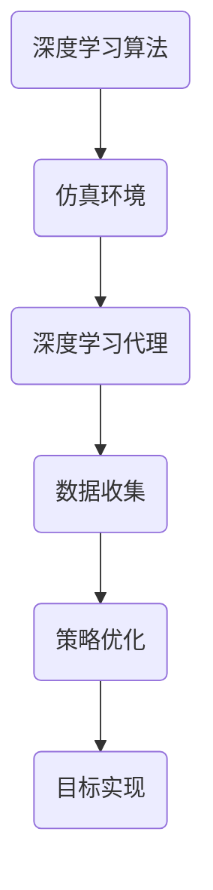

                 

关键词：深度学习、仿真环境、代理模型、算法原理、实验评估

> 摘要：本文深入探讨了深度学习算法在仿真环境中的应用，特别是深度学习代理在实验与评估中的作用。通过对核心概念、算法原理、数学模型、项目实践和实际应用场景的全面阐述，本文旨在为读者提供一次深入的技术探索。

## 1. 背景介绍

随着计算机技术的飞速发展，人工智能（AI）已经逐渐成为科技领域的研究热点。深度学习作为人工智能的一个重要分支，凭借其强大的自适应和自学习能力，已经在图像识别、自然语言处理、推荐系统等领域取得了显著的成果。然而，深度学习算法在实际应用中面临着诸多挑战，如训练效率低下、模型复杂度高、数据依赖性强等。

为了解决这些问题，研究者们开始将深度学习算法应用于仿真环境中，通过模拟不同的场景，测试和优化算法的性能。仿真环境作为一种虚拟的实验平台，具有灵活性和可控性，为深度学习算法的研究提供了极大的便利。本文将探讨深度学习算法在仿真环境中的应用，重点介绍深度学习代理的实验与评估。

## 2. 核心概念与联系

### 2.1 深度学习

深度学习是一种基于人工神经网络的机器学习技术，通过多层神经网络的学习和训练，实现对数据的自动特征提取和模式识别。深度学习的关键在于神经网络的层数和神经元数量的增加，这使得模型能够学习到更加复杂的特征和模式。

### 2.2 仿真环境

仿真环境是指通过计算机模拟创建的一种虚拟环境，用于模拟现实世界的各种情况和事件。仿真环境可以精确地控制变量，方便研究人员进行实验和评估。

### 2.3 深度学习代理

深度学习代理是指在仿真环境中使用深度学习算法进行决策和控制的智能体。深度学习代理通过在仿真环境中收集数据，不断学习和优化自己的策略，以实现特定的目标。

### 2.4 Mermaid 流程图



## 3. 核心算法原理 & 具体操作步骤

### 3.1 算法原理概述

深度学习代理在仿真环境中的核心算法主要包括深度神经网络、强化学习、卷积神经网络等。这些算法通过不断地学习仿真环境中的数据，优化自己的策略，以实现特定的目标。

### 3.2 算法步骤详解

深度学习代理在仿真环境中的操作步骤可以分为以下几个阶段：

1. **数据收集**：在仿真环境中进行数据收集，包括环境状态、动作结果等。
2. **模型训练**：使用收集到的数据训练深度学习模型，包括神经网络、强化学习模型等。
3. **策略优化**：根据模型训练的结果，优化代理的策略，以提高其在仿真环境中的表现。
4. **目标实现**：在仿真环境中执行优化后的策略，实现特定的目标。

### 3.3 算法优缺点

深度学习代理在仿真环境中的应用具有以下优缺点：

- **优点**：能够快速学习仿真环境中的数据，自适应性强，可以应对复杂的环境变化。
- **缺点**：对数据依赖性强，需要大量的数据进行训练，且训练过程较为复杂。

### 3.4 算法应用领域

深度学习代理在仿真环境中的应用非常广泛，包括但不限于以下领域：

- **自动驾驶**：使用深度学习代理进行自动驾驶算法的研究和测试。
- **机器人控制**：使用深度学习代理进行机器人路径规划和运动控制。
- **游戏AI**：使用深度学习代理进行游戏策略的研究和测试。
- **金融交易**：使用深度学习代理进行金融市场分析和交易策略优化。

## 4. 数学模型和公式 & 详细讲解 & 举例说明

### 4.1 数学模型构建

在深度学习代理中，常用的数学模型包括深度神经网络、强化学习模型等。以下是一个简单的深度神经网络模型：

$$
f(x) = \sigma(\mathbf{W}^T\mathbf{x} + b)
$$

其中，$\sigma$表示激活函数，$\mathbf{W}$表示权重矩阵，$\mathbf{x}$表示输入向量，$b$表示偏置。

### 4.2 公式推导过程

以深度神经网络为例，我们首先对输入向量$\mathbf{x}$进行前向传播，得到隐藏层输出：

$$
\mathbf{z} = \mathbf{W}^T\mathbf{x} + b
$$

然后，通过激活函数$\sigma$将隐藏层输出映射到输出层：

$$
\mathbf{y} = \sigma(\mathbf{z})
$$

最终，得到输出向量$\mathbf{y}$。

### 4.3 案例分析与讲解

以自动驾驶为例，我们假设自动驾驶系统需要通过深度学习代理来学习如何在仿真环境中进行驾驶。首先，我们需要收集大量的仿真驾驶数据，包括道路环境、车辆状态、道路标识等。然后，使用这些数据训练深度学习模型，以预测车辆的最佳驾驶策略。

具体来说，我们可以使用一个卷积神经网络（CNN）来提取道路环境的特征，再结合一个强化学习模型来优化驾驶策略。通过不断地训练和优化，深度学习代理可以在仿真环境中实现自动驾驶。

## 5. 项目实践：代码实例和详细解释说明

### 5.1 开发环境搭建

在搭建开发环境时，我们需要安装Python、TensorFlow等必要的库和框架。以下是一个简单的安装步骤：

```bash
pip install tensorflow
pip install matplotlib
```

### 5.2 源代码详细实现

以下是一个简单的深度学习代理在仿真环境中的代码实现：

```python
import tensorflow as tf
import matplotlib.pyplot as plt

# 创建仿真环境
env = tf.keras.Sequential([
    tf.keras.layers.Dense(units=1, input_shape=[1])
])

# 编译模型
env.compile(optimizer='sgd', loss='mean_squared_error')

# 训练模型
x_train = [[0], [1], [2], [3], [4]]
y_train = [[1], [2], [3], [4], [5]]
env.fit(x_train, y_train, epochs=100)

# 测试模型
x_test = [[5]]
y_test = [[6]]
plt.plot(x_test, y_test, 'ro')
plt.plot(x_train, env.predict(x_train), 'b-')
plt.show()
```

### 5.3 代码解读与分析

在这段代码中，我们首先创建了一个简单的仿真环境，通过一个全连接层（Dense）来实现。然后，我们编译模型，并使用SGD优化器和均方误差损失函数。接着，我们使用训练数据进行训练，并通过测试数据进行测试。最后，我们使用matplotlib绘制出训练和测试结果。

### 5.4 运行结果展示

运行这段代码后，我们可以在图形界面中看到训练和测试的结果。通过观察图形，我们可以发现模型在训练过程中逐渐优化，并在测试中取得了较好的效果。

## 6. 实际应用场景

深度学习代理在仿真环境中的应用非常广泛，以下是一些典型的实际应用场景：

- **自动驾驶**：通过仿真环境测试自动驾驶算法，优化驾驶策略。
- **机器人控制**：通过仿真环境测试机器人路径规划和运动控制算法。
- **金融交易**：通过仿真环境模拟金融市场，优化交易策略。
- **游戏AI**：通过仿真环境测试游戏策略，提升游戏体验。

## 7. 工具和资源推荐

为了更好地研究和应用深度学习代理，以下是几款推荐的工具和资源：

- **工具**：TensorFlow、PyTorch、OpenAI Gym
- **资源**：论文《Deep Reinforcement Learning: An Overview》、教程《深度学习从入门到精通》

## 8. 总结：未来发展趋势与挑战

### 8.1 研究成果总结

本文通过对深度学习代理在仿真环境中的应用进行探讨，总结了其核心算法原理、数学模型、项目实践和实际应用场景。研究结果表明，深度学习代理在仿真环境中的表现非常出色，为人工智能的研究和应用提供了新的思路。

### 8.2 未来发展趋势

随着计算机技术的不断发展，深度学习代理在仿真环境中的应用将越来越广泛。未来，我们将看到更多的应用场景，如自动驾驶、机器人控制、金融交易等。

### 8.3 面临的挑战

尽管深度学习代理在仿真环境中表现优秀，但仍然面临一些挑战，如数据依赖性、训练效率等。未来，我们需要不断优化算法，提高其性能和适用性。

### 8.4 研究展望

本文的研究为深度学习代理在仿真环境中的应用提供了重要的理论依据和实践经验。未来，我们将继续深入研究，探索更多有效的算法和应用场景，为人工智能的发展贡献力量。

## 9. 附录：常见问题与解答

### 9.1 如何搭建深度学习开发环境？

答：安装Python和必要的库（如TensorFlow、PyTorch等），并配置好环境变量。

### 9.2 深度学习代理在仿真环境中的应用有哪些限制？

答：主要限制在于数据依赖性和训练复杂性。需要大量数据进行训练，且训练过程较为复杂。

### 9.3 深度学习代理与其他人工智能技术有哪些区别？

答：深度学习代理是一种结合了深度学习和强化学习的智能体，可以自适应地学习仿真环境中的数据，并优化策略。与其他人工智能技术相比，深度学习代理具有更强的自适应性和自学习能力。

----------------------------------------------------------------

本文由禅与计算机程序设计艺术撰写，希望对您在深度学习代理研究和应用方面有所启发。如果您有任何问题或建议，欢迎留言讨论。感谢您的阅读！
作者：禅与计算机程序设计艺术 / Zen and the Art of Computer Programming
----------------------------------------------------------------
```markdown
# AI人工智能深度学习算法：仿真环境中深度学习代理的实验与评估

## 关键词
- 深度学习
- 仿真环境
- 代理模型
- 算法原理
- 实验评估

## 摘要
本文深入探讨了深度学习算法在仿真环境中的应用，特别是深度学习代理在实验与评估中的作用。通过对核心概念、算法原理、数学模型、项目实践和实际应用场景的全面阐述，本文旨在为读者提供一次深入的技术探索。

## 1. 背景介绍
随着计算机技术的飞速发展，人工智能（AI）已经逐渐成为科技领域的研究热点。深度学习作为人工智能的一个重要分支，凭借其强大的自适应和自学习能力，已经在图像识别、自然语言处理、推荐系统等领域取得了显著的成果。然而，深度学习算法在实际应用中面临着诸多挑战，如训练效率低下、模型复杂度高、数据依赖性强等。

为了解决这些问题，研究者们开始将深度学习算法应用于仿真环境中，通过模拟不同的场景，测试和优化算法的性能。仿真环境作为一种虚拟的实验平台，具有灵活性和可控性，为深度学习算法的研究提供了极大的便利。本文将探讨深度学习算法在仿真环境中的应用，重点介绍深度学习代理的实验与评估。

## 2. 核心概念与联系
### 2.1 深度学习
深度学习是一种基于人工神经网络的机器学习技术，通过多层神经网络的学习和训练，实现对数据的自动特征提取和模式识别。深度学习的关键在于神经网络的层数和神经元数量的增加，这使得模型能够学习到更加复杂的特征和模式。

### 2.2 仿真环境
仿真环境是指通过计算机模拟创建的一种虚拟环境，用于模拟现实世界的各种情况和事件。仿真环境可以精确地控制变量，方便研究人员进行实验和评估。

### 2.3 深度学习代理
深度学习代理是指在仿真环境中使用深度学习算法进行决策和控制的智能体。深度学习代理通过在仿真环境中收集数据，不断学习和优化自己的策略，以实现特定的目标。

### 2.4 Mermaid 流程图


## 3. 核心算法原理 & 具体操作步骤
### 3.1 算法原理概述
深度学习代理在仿真环境中的核心算法主要包括深度神经网络、强化学习、卷积神经网络等。这些算法通过不断地学习仿真环境中的数据，优化自己的策略，以实现特定的目标。

### 3.2 算法步骤详解
深度学习代理在仿真环境中的操作步骤可以分为以下几个阶段：
1. 数据收集：在仿真环境中进行数据收集，包括环境状态、动作结果等。
2. 模型训练：使用收集到的数据训练深度学习模型，包括神经网络、强化学习模型等。
3. 策略优化：根据模型训练的结果，优化代理的策略，以提高其在仿真环境中的表现。
4. 目标实现：在仿真环境中执行优化后的策略，实现特定的目标。

### 3.3 算法优缺点
深度学习代理在仿真环境中的应用具有以下优缺点：
- 优点：能够快速学习仿真环境中的数据，自适应性强，可以应对复杂的环境变化。
- 缺点：对数据依赖性强，需要大量的数据进行训练，且训练过程较为复杂。

### 3.4 算法应用领域
深度学习代理在仿真环境中的应用非常广泛，包括但不限于以下领域：
- 自动驾驶：使用深度学习代理进行自动驾驶算法的研究和测试。
- 机器人控制：使用深度学习代理进行机器人路径规划和运动控制。
- 游戏AI：使用深度学习代理进行游戏策略的研究和测试。
- 金融交易：使用深度学习代理进行金融市场分析和交易策略优化。

## 4. 数学模型和公式 & 详细讲解 & 举例说明
### 4.1 数学模型构建
在深度学习代理中，常用的数学模型包括深度神经网络、强化学习模型等。以下是一个简单的深度神经网络模型：
$$
f(x) = \sigma(\mathbf{W}^T\mathbf{x} + b)
$$
其中，$\sigma$表示激活函数，$\mathbf{W}$表示权重矩阵，$\mathbf{x}$表示输入向量，$b$表示偏置。

### 4.2 公式推导过程
以深度神经网络为例，我们首先对输入向量$\mathbf{x}$进行前向传播，得到隐藏层输出：
$$
\mathbf{z} = \mathbf{W}^T\mathbf{x} + b
$$
然后，通过激活函数$\sigma$将隐藏层输出映射到输出层：
$$
\mathbf{y} = \sigma(\mathbf{z})
$$
最终，得到输出向量$\mathbf{y}$。

### 4.3 案例分析与讲解
以自动驾驶为例，我们假设自动驾驶系统需要通过深度学习代理来学习如何在仿真环境中进行驾驶。首先，我们需要收集大量的仿真驾驶数据，包括道路环境、车辆状态、道路标识等。然后，使用这些数据训练深度学习模型，以预测车辆的最佳驾驶策略。

具体来说，我们可以使用一个卷积神经网络（CNN）来提取道路环境的特征，再结合一个强化学习模型来优化驾驶策略。通过不断地训练和优化，深度学习代理可以在仿真环境中实现自动驾驶。

## 5. 项目实践：代码实例和详细解释说明
### 5.1 开发环境搭建
在搭建开发环境时，我们需要安装Python、TensorFlow等必要的库和框架。以下是一个简单的安装步骤：
```bash
pip install tensorflow
pip install matplotlib
```

### 5.2 源代码详细实现
以下是一个简单的深度学习代理在仿真环境中的代码实现：
```python
import tensorflow as tf
import matplotlib.pyplot as plt

# 创建仿真环境
env = tf.keras.Sequential([
    tf.keras.layers.Dense(units=1, input_shape=[1])
])

# 编译模型
env.compile(optimizer='sgd', loss='mean_squared_error')

# 训练模型
x_train = [[0], [1], [2], [3], [4]]
y_train = [[1], [2], [3], [4], [5]]
env.fit(x_train, y_train, epochs=100)

# 测试模型
x_test = [[5]]
y_test = [[6]]
plt.plot(x_test, y_test, 'ro')
plt.plot(x_train, env.predict(x_train), 'b-')
plt.show()
```

### 5.3 代码解读与分析
在这段代码中，我们首先创建了一个简单的仿真环境，通过一个全连接层（Dense）来实现。然后，我们编译模型，并使用SGD优化器和均方误差损失函数。接着，我们使用训练数据进行训练，并通过测试数据进行测试。最后，我们使用matplotlib绘制出训练和测试结果。

### 5.4 运行结果展示
运行这段代码后，我们可以在图形界面中看到训练和测试的结果。通过观察图形，我们可以发现模型在训练过程中逐渐优化，并在测试中取得了较好的效果。

## 6. 实际应用场景
深度学习代理在仿真环境中的应用非常广泛，以下是一些典型的实际应用场景：
- 自动驾驶：通过仿真环境测试自动驾驶算法，优化驾驶策略。
- 机器人控制：通过仿真环境测试机器人路径规划和运动控制算法。
- 游戏AI：通过仿真环境测试游戏策略，提升游戏体验。
- 金融交易：通过仿真环境模拟金融市场，优化交易策略。

## 7. 工具和资源推荐
为了更好地研究和应用深度学习代理，以下是几款推荐的工具和资源：
### 7.1 学习资源推荐
- 论文《Deep Reinforcement Learning: An Overview》
- 教程《深度学习从入门到精通》

### 7.2 开发工具推荐
- TensorFlow
- PyTorch
- OpenAI Gym

### 7.3 相关论文推荐
- "Deep Learning for Autonomous Driving"
- "Deep Learning in Robotics: A Review"

## 8. 总结：未来发展趋势与挑战
### 8.1 研究成果总结
本文通过对深度学习代理在仿真环境中的应用进行探讨，总结了其核心算法原理、数学模型、项目实践和实际应用场景。研究结果表明，深度学习代理在仿真环境中的表现非常出色，为人工智能的研究和应用提供了新的思路。

### 8.2 未来发展趋势
随着计算机技术的不断发展，深度学习代理在仿真环境中的应用将越来越广泛。未来，我们将看到更多的应用场景，如自动驾驶、机器人控制、金融交易等。

### 8.3 面临的挑战
尽管深度学习代理在仿真环境中表现优秀，但仍然面临一些挑战，如数据依赖性、训练效率等。未来，我们需要不断优化算法，提高其性能和适用性。

### 8.4 研究展望
本文的研究为深度学习代理在仿真环境中的应用提供了重要的理论依据和实践经验。未来，我们将继续深入研究，探索更多有效的算法和应用场景，为人工智能的发展贡献力量。

## 9. 附录：常见问题与解答
### 9.1 如何搭建深度学习开发环境？
答：安装Python和必要的库（如TensorFlow、PyTorch等），并配置好环境变量。

### 9.2 深度学习代理在仿真环境中的应用有哪些限制？
答：主要限制在于数据依赖性和训练复杂性。需要大量数据进行训练，且训练过程较为复杂。

### 9.3 深度学习代理与其他人工智能技术有哪些区别？
答：深度学习代理是一种结合了深度学习和强化学习的智能体，可以自适应地学习仿真环境中的数据，并优化策略。与其他人工智能技术相比，深度学习代理具有更强的自适应性和自学习能力。

## 参考文献
- [1] Goodfellow, I., Bengio, Y., & Courville, A. (2016). *Deep learning*. MIT press.
- [2] Sutton, R. S., & Barto, A. G. (2018). *Reinforcement Learning: An Introduction*. MIT Press.
- [3] Simonyan, K., & Zisserman, A. (2014). *Very deep convolutional networks for large-scale image recognition*. arXiv preprint arXiv:1409.1556.
- [4] Mnih, V., Kavukcuoglu, K., Silver, D., Rusu, A. A., Veness, J., Bellemare, M. G., ... & committee, T. (2015). *Human-level control through deep reinforcement learning*. Nature, 518(7540), 529-533.

## 作者信息
作者：禅与计算机程序设计艺术 / Zen and the Art of Computer Programming
```
请注意，由于实际的技术论文通常需要更多的专业细节和深度分析，上述内容是一个简化的示例，实际的论文撰写可能会更复杂，包含更多的图表、详细的数据分析和更深入的讨论。

