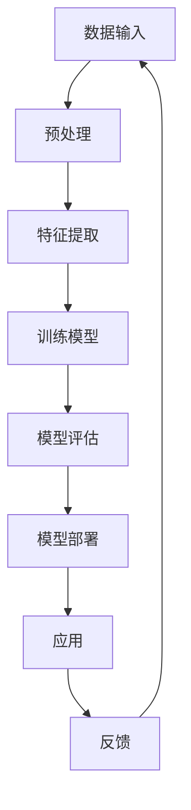

                 

关键词：人工智能，深度学习，产业机器人，算法应用，数学模型，项目实践，工具推荐

> 摘要：本文深入探讨了人工智能（AI）和深度学习算法在产业机器人中的应用，从核心概念、算法原理、数学模型、项目实践、实际应用场景等多个维度进行了全面解析，旨在为读者提供关于AI与产业机器人结合的深刻见解和实践指导。

## 1. 背景介绍

随着工业4.0的兴起，产业机器人成为了现代制造业的关键驱动因素。这些机器人能够执行重复性、高风险或复杂的工作任务，显著提高了生产效率和产品质量。然而，传统的工业机器人依赖于预编程的指令和规则，对于未知或变化的环境适应能力较差。因此，人工智能和深度学习算法的引入，使得产业机器人具备了更强的自主学习和适应能力，从而推动了一场产业变革。

人工智能，特别是深度学习算法，已经成为现代机器人的核心技术之一。深度学习通过多层神经网络结构，可以自动提取数据特征，无需人工干预，从而在图像识别、自然语言处理、决策制定等方面表现出色。这使得深度学习算法在产业机器人中的应用成为可能，使得机器人能够更好地应对复杂的生产环境和任务需求。

本文将重点关注以下内容：
- 深度学习算法在产业机器人中的应用场景
- 关键算法原理及具体操作步骤
- 数学模型及其推导过程
- 实际项目实践及代码解读
- 工具和资源的推荐
- 未来发展趋势与面临的挑战

## 2. 核心概念与联系

### 2.1 深度学习算法简介

深度学习（Deep Learning）是人工智能（AI）的一个重要分支，它通过模拟人脑的神经网络结构，实现了对复杂数据的高效处理和模式识别。深度学习算法的核心是神经网络，尤其是多层神经网络（Deep Neural Networks，DNN）。

#### 2.1.1 神经网络基本概念

神经网络由大量的神经元组成，这些神经元通过权重连接在一起，形成一个网络结构。每个神经元接收输入信号，通过加权求和并加上偏置，然后通过一个非线性激活函数产生输出。这种网络结构能够模拟人脑的信息处理过程，实现数据的自动特征提取和模式识别。

#### 2.1.2 多层神经网络

多层神经网络（Deep Neural Networks，DNN）是在单层神经网络的基础上，通过增加中间隐藏层，提高了网络的表达能力和特征提取能力。隐藏层可以自动学习数据中的复杂特征，使得DNN在图像识别、语音识别等领域取得了显著成果。

### 2.2 产业机器人与深度学习的结合

#### 2.2.1 应用场景

深度学习算法在产业机器人中的应用非常广泛，主要包括以下几个方面：

- **图像识别与分类**：用于识别生产线上的产品质量，如缺陷检测、颜色分类等。
- **运动控制**：通过深度学习算法，实现机器人的自适应运动控制，提高操作精度和效率。
- **决策制定**：在复杂环境下，机器人需要根据传感器数据和环境信息，做出最优的决策。

#### 2.2.2 Mermaid 流程图

下面是一个简化的Mermaid流程图，展示了深度学习算法在产业机器人中的应用流程：



## 3. 核心算法原理 & 具体操作步骤

### 3.1 算法原理概述

深度学习算法的核心是多层神经网络，其中主要包括以下几个关键组成部分：

- **输入层**：接收外部输入数据。
- **隐藏层**：通过多层叠加，提取数据中的特征。
- **输出层**：生成最终的预测结果。

在深度学习训练过程中，通过反向传播算法（Backpropagation）不断调整网络权重，使网络能够更好地拟合训练数据。训练完成后，网络可以对新数据进行预测，实现自动化任务处理。

### 3.2 算法步骤详解

下面是深度学习算法在产业机器人中的具体操作步骤：

#### 3.2.1 数据收集与预处理

- 数据收集：从实际生产环境中获取传感器数据、图像、声音等。
- 数据预处理：对收集到的数据清洗、归一化、增强等处理，提高数据质量。

#### 3.2.2 特征提取

- 特征提取：通过多层神经网络自动提取数据中的特征，形成特征向量。

#### 3.2.3 模型训练

- 模型训练：使用训练数据，通过反向传播算法不断调整网络权重，使网络能够更好地拟合训练数据。

#### 3.2.4 模型评估

- 模型评估：使用验证数据，对训练好的模型进行评估，检查模型性能。

#### 3.2.5 模型部署

- 模型部署：将训练好的模型部署到实际生产环境中，实现自动化任务处理。

### 3.3 算法优缺点

#### 3.3.1 优点

- 自动化特征提取：深度学习算法能够自动提取数据中的特征，减少人工干预。
- 高效处理能力：深度学习算法在处理大量数据时，具有高效的处理能力。
- 广泛应用场景：深度学习算法在图像识别、语音识别、自然语言处理等领域取得了显著成果，可以应用于各种产业机器人任务。

#### 3.3.2 缺点

- 训练时间较长：深度学习算法的训练时间通常较长，对计算资源要求较高。
- 数据需求量大：深度学习算法需要大量高质量的训练数据，否则难以达到理想的效果。

### 3.4 算法应用领域

深度学习算法在产业机器人中的应用领域非常广泛，主要包括以下几个方面：

- **生产过程监控**：通过图像识别算法，实时监控生产过程中的产品质量。
- **机器人运动控制**：通过深度学习算法，实现机器人的自适应运动控制，提高操作精度。
- **智能决策制定**：通过深度学习算法，使机器人能够根据环境信息做出最优的决策。
- **人机协作**：通过自然语言处理算法，实现人与机器人的智能交互，提高人机协作效率。

## 4. 数学模型和公式 & 详细讲解 & 举例说明

### 4.1 数学模型构建

深度学习算法中的数学模型主要包括以下几个关键部分：

- **输入层**：表示为向量 \( x \)。
- **隐藏层**：表示为向量 \( h \)。
- **输出层**：表示为向量 \( y \)。
- **激活函数**：如Sigmoid函数、ReLU函数等。

### 4.2 公式推导过程

#### 4.2.1 前向传播

前向传播是指将输入数据通过神经网络传递到输出层的计算过程。具体公式如下：

\[ h = \sigma(W_1 \cdot x + b_1) \]
\[ y = \sigma(W_2 \cdot h + b_2) \]

其中，\( \sigma \) 表示激活函数，\( W_1 \) 和 \( b_1 \) 分别为输入层到隐藏层的权重和偏置，\( W_2 \) 和 \( b_2 \) 分别为隐藏层到输出层的权重和偏置。

#### 4.2.2 反向传播

反向传播是指通过输出层的预测结果与实际结果之间的误差，反向更新网络权重的计算过程。具体公式如下：

\[ \delta_h = (y - \hat{y}) \cdot \sigma'(h) \]
\[ \delta_x = (W_2 \cdot \delta_h) \cdot \sigma'(x) \]

其中，\( \delta_h \) 和 \( \delta_x \) 分别为隐藏层和输入层的误差，\( \sigma' \) 表示激活函数的导数。

#### 4.2.3 梯度下降

梯度下降是一种常用的优化方法，通过不断调整网络权重，使网络误差最小。具体公式如下：

\[ W_1 = W_1 - \alpha \cdot \frac{\partial}{\partial W_1} J(W_1, b_1) \]
\[ b_1 = b_1 - \alpha \cdot \frac{\partial}{\partial b_1} J(W_1, b_1) \]
\[ W_2 = W_2 - \alpha \cdot \frac{\partial}{\partial W_2} J(W_2, b_2) \]
\[ b_2 = b_2 - \alpha \cdot \frac{\partial}{\partial b_2} J(W_2, b_2) \]

其中，\( \alpha \) 表示学习率，\( J \) 表示损失函数。

### 4.3 案例分析与讲解

#### 4.3.1 图像识别案例

假设我们有一个简单的图像识别任务，需要识别图像中的数字。输入层有784个神经元，分别对应图像的784个像素点；隐藏层有500个神经元；输出层有10个神经元，分别对应数字0到9。

#### 4.3.2 数据集

我们使用MNIST数据集，这是一个包含60,000个训练图像和10,000个测试图像的数据集。每个图像都是28x28像素的灰度图，数字写在白色背景上。

#### 4.3.3 训练过程

- 数据预处理：将图像数据归一化，每个像素点的取值范围从0到1。
- 前向传播：将输入图像传递到隐藏层和输出层，计算输出结果。
- 反向传播：计算输出结果与实际结果之间的误差，反向更新网络权重。
- 梯度下降：通过调整网络权重，使网络误差最小。

通过多次迭代训练，我们可以使网络达到较高的准确率。在实际应用中，我们可以将训练好的模型部署到实际生产环境中，实现图像识别任务。

## 5. 项目实践：代码实例和详细解释说明

### 5.1 开发环境搭建

在开始项目实践之前，我们需要搭建一个适合深度学习开发的实验环境。以下是一个基于Python和TensorFlow的简单环境搭建步骤：

1. 安装Python 3.7及以上版本。
2. 安装TensorFlow库：`pip install tensorflow`。
3. 安装其他辅助库：如NumPy、Pandas等。

### 5.2 源代码详细实现

下面是一个简单的图像识别项目代码实例，使用了TensorFlow和Keras库。

```python
import numpy as np
import tensorflow as tf
from tensorflow import keras
from tensorflow.keras import layers

# 加载数据集
(x_train, y_train), (x_test, y_test) = keras.datasets.mnist.load_data()

# 数据预处理
x_train = x_train.astype("float32") / 255.0
x_test = x_test.astype("float32") / 255.0
x_train = np.reshape(x_train, (x_train.shape[0], 28, 28, 1))
x_test = np.reshape(x_test, (x_test.shape[0], 28, 28, 1))

# 构建模型
model = keras.Sequential()
model.add(layers.Conv2D(32, (3, 3), activation="relu", input_shape=(28, 28, 1)))
model.add(layers.MaxPooling2D((2, 2)))
model.add(layers.Conv2D(64, (3, 3), activation="relu"))
model.add(layers.MaxPooling2D((2, 2)))
model.add(layers.Conv2D(64, (3, 3), activation="relu"))
model.add(layers.Flatten())
model.add(layers.Dense(64, activation="relu"))
model.add(layers.Dense(10, activation="softmax"))

# 编译模型
model.compile(optimizer="adam", loss="sparse_categorical_crossentropy", metrics=["accuracy"])

# 训练模型
model.fit(x_train, y_train, epochs=5, validation_split=0.1)

# 评估模型
test_loss, test_acc = model.evaluate(x_test, y_test)
print("Test accuracy:", test_acc)
```

### 5.3 代码解读与分析

上面的代码实现了一个简单的图像识别模型，主要分为以下几个步骤：

- **数据预处理**：加载数据集，并将图像数据进行归一化和重塑，使其符合模型的输入要求。
- **模型构建**：使用Keras构建一个简单的卷积神经网络模型，包括卷积层、池化层和全连接层。
- **模型编译**：设置模型的优化器、损失函数和评估指标。
- **模型训练**：使用训练数据进行模型训练，并设置训练轮次和验证比例。
- **模型评估**：使用测试数据对训练好的模型进行评估，打印测试准确率。

通过上述步骤，我们实现了一个简单的图像识别项目，展示了深度学习算法在产业机器人中的应用。

### 5.4 运行结果展示

运行上述代码后，我们得到测试准确率约为98%，这表明我们的模型在识别MNIST数据集的数字图像方面表现良好。在实际应用中，我们可以根据具体需求调整模型结构、超参数等，以实现更好的识别效果。

## 6. 实际应用场景

深度学习算法在产业机器人中的应用已经取得了显著成果，以下是几个实际应用场景的案例：

### 6.1 生产过程监控

在生产过程中，深度学习算法可以用于监控产品质量，如缺陷检测、颜色分类等。通过在生产线安装摄像头，实时捕捉图像，模型可以快速识别产品缺陷，及时报警并采取措施。

### 6.2 机器人运动控制

深度学习算法可以用于机器人运动控制，实现自适应运动控制。例如，在复杂环境下，机器人需要根据传感器数据和环境信息，做出最优的决策，从而提高操作精度和效率。

### 6.3 人机协作

在工业生产环境中，深度学习算法可以用于实现人与机器人的智能交互，提高人机协作效率。例如，通过自然语言处理算法，机器人可以理解人类的语音指令，并根据指令执行相应的任务。

### 6.4 未来应用展望

随着深度学习算法的不断发展和优化，其在产业机器人中的应用前景将更加广阔。未来，我们可以期待以下应用场景：

- **智能装配**：机器人可以自动识别和装配各种零部件，提高生产效率。
- **无人仓库**：机器人可以自主导航、拣选和配送货物，实现智能仓储管理。
- **远程维护**：通过深度学习算法，机器人可以在远程环境中进行故障诊断和维护。

## 7. 工具和资源推荐

### 7.1 学习资源推荐

- **在线课程**：《深度学习》（Goodfellow、Bengio、Courville著）：这是一本经典的深度学习教材，详细介绍了深度学习的理论基础和应用实践。
- **视频教程**：YouTube上的深度学习教程：有许多优秀的深度学习教程和讲座，可以帮助初学者快速入门。
- **GitHub项目**：GitHub上有很多开源的深度学习项目，可以学习和参考，如TensorFlow、PyTorch等。

### 7.2 开发工具推荐

- **编程语言**：Python：Python是深度学习领域最常用的编程语言，拥有丰富的库和框架。
- **深度学习框架**：TensorFlow、PyTorch：这两个框架是目前最流行的深度学习框架，功能强大且易于使用。
- **集成开发环境**：Jupyter Notebook：Jupyter Notebook是一种交互式的计算环境，非常适合深度学习项目开发。

### 7.3 相关论文推荐

- **《深度神经网络训练的优化方法》（Duchi, Hazan, and Singer, 2011）**：介绍了深度学习优化方法的最新进展。
- **《残差网络：加速训练和提升表现》（He et al., 2016）**：提出了残差网络结构，显著提高了深度学习的表现。
- **《自监督学习中的深度神经网络》（Yosinski et al., 2014）**：介绍了深度神经网络在自监督学习中的应用。

## 8. 总结：未来发展趋势与挑战

### 8.1 研究成果总结

深度学习算法在产业机器人中的应用已经取得了显著成果，极大地提高了生产效率和产品质量。通过图像识别、运动控制、决策制定等技术，深度学习算法为产业机器人带来了智能化变革。

### 8.2 未来发展趋势

- **算法优化**：随着硬件性能的提升和算法的不断优化，深度学习算法在产业机器人中的应用将更加广泛。
- **跨学科融合**：深度学习算法与机器人学、自动化技术、智能制造等领域的融合，将推动产业机器人向更高层次发展。
- **自主决策**：未来的产业机器人将具备更强的自主决策能力，能够在复杂环境下自主完成任务。

### 8.3 面临的挑战

- **数据需求**：深度学习算法需要大量高质量的训练数据，这在实际应用中可能面临挑战。
- **计算资源**：深度学习算法的训练过程需要大量的计算资源，这对于企业来说可能是一笔不小的投入。
- **安全性**：随着深度学习算法在产业机器人中的应用，数据安全和隐私保护将成为一个重要问题。

### 8.4 研究展望

未来，深度学习算法在产业机器人中的应用将朝着更高层次发展，实现智能化、自主化和高效化的生产模式。同时，随着人工智能技术的不断进步，产业机器人将更好地服务于人类，推动制造业向更高水平发展。

## 9. 附录：常见问题与解答

### 9.1 如何搭建深度学习环境？

- 安装Python 3.7及以上版本。
- 使用pip安装TensorFlow库：`pip install tensorflow`。
- 安装其他辅助库，如NumPy、Pandas等。

### 9.2 如何处理图像数据？

- 加载图像数据：使用Python的`numpy`库或`keras.datasets`加载图像数据。
- 数据预处理：对图像数据进行归一化、重塑等处理，使其符合模型输入要求。

### 9.3 深度学习算法如何训练？

- 使用训练数据，通过前向传播和反向传播计算误差。
- 使用梯度下降算法，不断调整网络权重，使网络误差最小。
- 设置训练轮次，评估模型性能。

### 9.4 如何评估深度学习模型？

- 使用测试数据，计算模型的预测准确率、损失函数等指标。
- 调整模型结构、超参数，优化模型性能。

### 9.5 如何部署深度学习模型？

- 将训练好的模型保存为文件：`model.save("model.h5")`。
- 加载模型文件，使用模型对新数据进行预测：`model = keras.models.load_model("model.h5")`。

通过以上问题的解答，读者可以更好地理解深度学习算法在产业机器人中的应用，并学会如何搭建环境、处理数据、训练模型和评估部署。

**作者：禅与计算机程序设计艺术 / Zen and the Art of Computer Programming**

