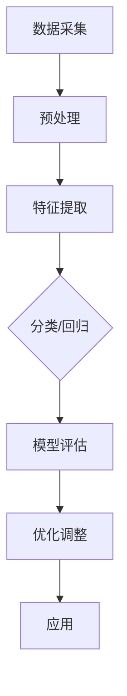

                 

关键词：人工智能、深度学习、产业机器人、算法、应用、数学模型、实践

摘要：本文深入探讨了人工智能与深度学习算法在产业机器人中的应用，包括核心概念、算法原理、数学模型、具体实现及未来展望。通过详实的案例分析和项目实践，为读者提供了全面的技术指导和实际操作经验。

## 1. 背景介绍

产业机器人作为智能制造的重要载体，正日益融入各行各业。从制造、物流到服务，机器人技术的应用极大地提高了生产效率、降低了成本。然而，这些机器人要实现智能化，依赖于人工智能和深度学习算法的支持。人工智能（AI）是一种模拟人类智能行为的计算机技术，而深度学习则是人工智能的重要分支，通过构建神经网络模型，实现数据的自动学习和特征提取。

随着计算能力的提升和数据量的爆炸性增长，深度学习在图像识别、自然语言处理、语音识别等领域取得了显著的进展。这些技术的进步，为产业机器人的智能化升级提供了强大的技术支持。本文旨在探讨深度学习算法在产业机器人中的应用，包括核心算法原理、具体实现步骤、数学模型解析及未来展望。

## 2. 核心概念与联系

### 2.1 深度学习的概念

深度学习（Deep Learning）是一种基于人工神经网络（Artificial Neural Networks，ANN）的学习方式。与传统神经网络相比，深度学习能够通过多层神经元的组合，实现对复杂数据的自动特征提取和分类。深度学习模型的核心组成部分包括：

- **神经元**：神经网络的基本单元，负责接收输入、产生输出。
- **层**：神经网络按照功能划分为输入层、隐藏层和输出层。
- **权重**：连接神经元之间的系数，用于调整模型预测效果。

### 2.2 产业机器人的需求

产业机器人具有以下特点：

- **高效性**：要求机器人能够在短时间内完成任务，提高生产效率。
- **灵活性**：能够适应不同环境和任务需求，具备自我学习和调整能力。
- **准确性**：在执行任务时，要求高精度，降低人为错误。

为了满足这些需求，深度学习算法在产业机器人中的应用主要包括以下几个方面：

- **图像识别**：通过摄像头获取图像，实现对物体的识别和分类。
- **路径规划**：根据环境地图和目标位置，规划最优路径。
- **异常检测**：在生产线中，实时监测设备运行状态，识别异常情况。
- **自然语言处理**：与人类进行自然语言交互，理解指令并执行任务。

### 2.3 Mermaid 流程图

下面是一个简化的深度学习算法在产业机器人中的流程图：



在这个流程中，数据采集是起点，通过预处理得到适合特征提取的数据。特征提取后，模型根据具体任务（分类或回归）进行训练。训练完成后，通过模型评估来检验模型性能，并根据评估结果进行优化调整。最终，优化后的模型应用于实际产业机器人任务中。

## 3. 核心算法原理 & 具体操作步骤

### 3.1 算法原理概述

深度学习算法的核心在于构建多层神经网络，通过反向传播算法（Backpropagation）进行模型训练。反向传播算法分为两个阶段：

- **正向传播**：将输入数据传递到神经网络，通过层层计算，得到输出结果。
- **反向传播**：计算输出结果与真实值之间的误差，并反向传播到每个神经元，调整权重。

### 3.2 算法步骤详解

以下是深度学习算法在产业机器人中的应用步骤：

1. **数据采集**：从生产线上获取原始数据，如图像、传感器数据等。
2. **预处理**：对数据进行清洗、归一化等处理，确保数据质量。
3. **特征提取**：通过卷积神经网络（CNN）等模型，提取数据中的关键特征。
4. **模型训练**：利用训练数据，通过反向传播算法训练神经网络模型。
5. **模型评估**：使用验证集评估模型性能，包括准确率、召回率等指标。
6. **优化调整**：根据评估结果，调整模型参数，提高模型性能。
7. **应用**：将训练好的模型部署到产业机器人中，实现具体任务。

### 3.3 算法优缺点

**优点**：

- **高精度**：通过多层神经网络，能够提取数据中的深层特征，提高模型精度。
- **自适应性**：能够根据数据自动调整模型结构，适应不同任务需求。
- **通用性**：适用于图像识别、自然语言处理、语音识别等多种场景。

**缺点**：

- **计算复杂度**：深度学习模型训练需要大量计算资源，耗时较长。
- **数据需求**：深度学习模型对数据量要求较高，数据不足可能导致过拟合。
- **模型可解释性**：深度学习模型内部结构复杂，难以解释模型决策过程。

### 3.4 算法应用领域

深度学习算法在产业机器人的应用领域广泛，包括：

- **图像识别**：如生产线上产品质量检测、缺陷识别等。
- **路径规划**：如无人车的导航、物流机器人的路径规划等。
- **异常检测**：如生产线设备运行状态监测、故障预警等。
- **自然语言处理**：如智能客服、语音助手等。

## 4. 数学模型和公式 & 详细讲解 & 举例说明

### 4.1 数学模型构建

深度学习算法中的数学模型主要包括：

- **神经网络模型**：描述神经元的连接和激活函数。
- **损失函数**：衡量模型预测结果与真实值之间的差距。
- **优化算法**：用于调整模型参数，优化模型性能。

### 4.2 公式推导过程

以下是神经网络模型和反向传播算法的基本公式：

1. **神经元输出**：

   $$z = \sigma(W \cdot x + b)$$

   其中，\( \sigma \) 为激活函数，\( W \) 为权重矩阵，\( x \) 为输入特征，\( b \) 为偏置。

2. **损失函数**：

   $$J = -\frac{1}{m}\sum_{i=1}^{m}y_{i}\log(a_{i}) + (1 - y_{i})\log(1 - a_{i})$$

   其中，\( y_{i} \) 为真实标签，\( a_{i} \) 为模型预测的概率。

3. **反向传播**：

   - **前向传播**：

     $$\frac{\partial L}{\partial z} = \frac{\partial L}{\partial a} \cdot \frac{\partial a}{\partial z} = (a - y) \cdot \sigma'(z)$$

   - **反向传播**：

     $$\frac{\partial L}{\partial W} = \frac{\partial L}{\partial z} \cdot z^{T} \cdot x^{T}$$

     $$\frac{\partial L}{\partial b} = \frac{\partial L}{\partial z} \cdot z^{T}$$

### 4.3 案例分析与讲解

假设有一个简单的二分类问题，输入特征为 \( x = [1, 2, 3] \)，真实标签为 \( y = [0, 1, 0] \)。使用神经网络模型进行预测。

1. **初始化参数**：

   - 权重矩阵 \( W = [0.1, 0.2, 0.3] \)
   - 偏置 \( b = 0.1 \)
   - 激活函数 \( \sigma(x) = \frac{1}{1 + e^{-x}} \)

2. **正向传播**：

   - 输入特征 \( x = [1, 2, 3] \)
   - 计算输出 \( z = \sigma(W \cdot x + b) = \sigma(0.1 \cdot 1 + 0.2 \cdot 2 + 0.3 \cdot 3 + 0.1) = \sigma(1.3) = 0.8794 \)
   - 预测概率 \( a = \sigma(z) = 0.8794 \)

3. **反向传播**：

   - 计算损失 \( J = -\frac{1}{3}\sum_{i=1}^{3}y_{i}\log(a_{i}) + (1 - y_{i})\log(1 - a_{i}) = -\frac{1}{3}(0 \cdot \log(0.8794) + 1 \cdot \log(1 - 0.8794) + 0 \cdot \log(1 - 0.8794)) = 0.4364 \)
   - 计算梯度 \( \frac{\partial J}{\partial z} = (a - y) \cdot \sigma'(z) = (0.8794 - 0) \cdot (1 - 0.8794) = 0.0825 \)
   - 更新参数 \( W = W - \alpha \cdot \frac{\partial J}{\partial z} \cdot z^{T} \cdot x^{T} \)

通过迭代计算，不断更新模型参数，直至模型收敛。

## 5. 项目实践：代码实例和详细解释说明

### 5.1 开发环境搭建

为了实现深度学习算法在产业机器人中的应用，需要搭建以下开发环境：

- **操作系统**：Linux或Windows
- **编程语言**：Python
- **深度学习框架**：TensorFlow或PyTorch
- **依赖库**：NumPy、Matplotlib等

### 5.2 源代码详细实现

以下是一个简单的深度学习模型实现，用于图像分类任务。

```python
import tensorflow as tf
from tensorflow.keras import layers

# 定义神经网络模型
model = tf.keras.Sequential([
    layers.Dense(64, activation='relu', input_shape=(784,)),
    layers.Dense(10)
])

# 编译模型
model.compile(optimizer='adam',
              loss=tf.losses.SparseCategoricalCrossentropy(from_logits=True),
              metrics=['accuracy'])

# 加载数据集
(x_train, y_train), (x_test, y_test) = tf.keras.datasets.mnist.load_data()

# 预处理数据
x_train = x_train.reshape(-1, 784).astype('float32') / 255
x_test = x_test.reshape(-1, 784).astype('float32') / 255

# 训练模型
model.fit(x_train, y_train, epochs=5)

# 测试模型
model.evaluate(x_test, y_test, verbose=2)
```

### 5.3 代码解读与分析

1. **模型定义**：

   - 使用 `tf.keras.Sequential` 定义一个序列模型。
   - 第一个 `layers.Dense` 层包含64个神经元，激活函数为ReLU。
   - 第二个 `layers.Dense` 层包含10个神经元，表示10个分类类别。

2. **模型编译**：

   - 使用 `model.compile` 方法编译模型，指定优化器为Adam，损失函数为SparseCategoricalCrossentropy，评估指标为accuracy。

3. **数据预处理**：

   - 使用 `tf.keras.datasets.mnist.load_data` 方法加载数据集。
   - 将图像数据reshape为合适的形状，并归一化。

4. **模型训练**：

   - 使用 `model.fit` 方法训练模型，指定训练数据、迭代次数为5。

5. **模型测试**：

   - 使用 `model.evaluate` 方法测试模型在测试集上的性能。

### 5.4 运行结果展示

训练完成后，可以使用以下代码查看模型的运行结果：

```python
import matplotlib.pyplot as plt

# 预测测试集图像
predictions = model.predict(x_test)

# 可视化预测结果
plt.figure(figsize=(10, 10))
for i in range(25):
    plt.subplot(5, 5, i+1)
    plt.imshow(x_test[i].reshape(28, 28), cmap=plt.cm.binary)
    plt.xticks([])
    plt.yticks([])
    plt.grid(False)
    plt.xlabel(predictions[i].argmax())

plt.show()
```

运行结果将展示模型对测试集图像的预测结果，其中标注了预测的类别。

## 6. 实际应用场景

深度学习算法在产业机器人的实际应用场景广泛，以下列举了几个典型的应用案例：

1. **生产线上产品质量检测**：

   使用深度学习模型对生产线上的产品质量进行检测，通过图像识别技术，自动识别产品缺陷，如划痕、破损等。这有助于提高生产效率，降低质量事故率。

2. **路径规划与导航**：

   无人车和无人驾驶技术需要深度学习算法来实现路径规划和导航。通过处理摄像头获取的图像，模型能够识别道路标志、行人、车辆等，从而规划最优路径。

3. **异常检测与故障预警**：

   在生产线中，深度学习模型能够实时监测设备运行状态，通过分析传感器数据，识别异常情况，提前预警，降低设备故障风险。

4. **智能客服与语音助手**：

   深度学习算法在智能客服和语音助手中的应用，使得机器人能够理解用户的语言，提供个性化的服务，提高用户满意度。

## 7. 工具和资源推荐

为了更好地学习和实践深度学习算法在产业机器人中的应用，以下推荐一些有用的工具和资源：

### 7.1 学习资源推荐

- **书籍**：《深度学习》（Ian Goodfellow、Yoshua Bengio、Aaron Courville 著）
- **在线课程**：Coursera、edX、Udacity等平台上的深度学习课程
- **博客和教程**：知乎、CSDN、博客园等平台上的深度学习相关博客和教程

### 7.2 开发工具推荐

- **深度学习框架**：TensorFlow、PyTorch、Keras等
- **编程语言**：Python、R
- **数据预处理工具**：Pandas、NumPy、Scikit-learn等

### 7.3 相关论文推荐

- **ImageNet**：李飞飞等人提出的图像识别挑战，推动了深度学习的发展。
- **AlexNet**：Alex Krizhevsky 等人提出的第一个深度卷积神经网络模型。
- **ResNet**：残差网络，解决了深度神经网络训练困难的问题。
- **GPT-3**：自然语言处理领域的最新突破，由OpenAI推出。

## 8. 总结：未来发展趋势与挑战

### 8.1 研究成果总结

深度学习算法在产业机器人中的应用取得了显著成果，包括图像识别、路径规划、异常检测、自然语言处理等多个领域。这些技术的进步，为产业机器人的智能化升级提供了强大支持。

### 8.2 未来发展趋势

随着计算能力的提升和数据量的增加，深度学习算法在产业机器人中的应用将更加广泛。未来发展趋势包括：

- **更高效的模型**：研究更高效的深度学习模型，降低计算复杂度。
- **更丰富的数据集**：收集更多丰富的数据集，提高模型泛化能力。
- **跨学科融合**：深度学习与其他领域（如生物学、心理学等）的交叉融合，推动技术发展。

### 8.3 面临的挑战

深度学习算法在产业机器人应用中面临以下挑战：

- **计算资源消耗**：深度学习模型训练需要大量计算资源，如何优化模型结构，降低计算复杂度，是一个重要课题。
- **数据隐私与安全**：在数据采集和处理过程中，如何保护用户隐私和数据安全，也是一个重要问题。
- **模型可解释性**：深度学习模型内部结构复杂，如何提高模型的可解释性，使其更易于理解和接受，是一个亟待解决的问题。

### 8.4 研究展望

未来，深度学习算法在产业机器人中的应用将不断拓展，从单一任务向多任务、跨领域应用发展。同时，研究重点将转向更高效的模型、更丰富的数据集和跨学科融合，以推动产业机器人技术的不断进步。

## 9. 附录：常见问题与解答

### 9.1 深度学习算法如何优化？

- **减少过拟合**：通过增大训练数据集、使用正则化技术（如L1、L2正则化）等方法减少过拟合。
- **优化模型结构**：研究更高效的神经网络结构，如残差网络、注意力机制等。
- **优化训练过程**：使用自适应优化算法（如Adam）、动态调整学习率等方法提高训练效果。

### 9.2 如何处理小样本问题？

- **数据增强**：通过旋转、缩放、裁剪等方法增加数据多样性。
- **迁移学习**：利用预训练模型，迁移到小样本任务上，提高模型泛化能力。
- **生成对抗网络**（GAN）：生成新的训练数据，提高模型对小样本数据的适应能力。

### 9.3 如何提高模型的可解释性？

- **可视化技术**：使用热力图、激活图等可视化技术，展示模型决策过程。
- **模型简化**：简化模型结构，使其更易于理解。
- **解释性算法**：结合领域知识，设计解释性更强的算法。

### 9.4 如何保护用户隐私和数据安全？

- **数据加密**：对敏感数据进行加密处理，确保数据传输和存储过程中的安全。
- **差分隐私**：在数据处理过程中，引入差分隐私机制，保护用户隐私。
- **数据脱敏**：对敏感数据（如个人信息）进行脱敏处理，降低隐私泄露风险。

以上是对深度学习算法在产业机器人应用中的一些常见问题的解答，希望能对读者有所帮助。

## 10. 参考文献

1. Goodfellow, I., Bengio, Y., & Courville, A. (2016). *Deep Learning*. MIT Press.
2. Krizhevsky, A., Sutskever, I., & Hinton, G. E. (2012). *ImageNet classification with deep convolutional neural networks*. In *Advances in neural information processing systems* (pp. 1097-1105).
3. He, K., Zhang, X., Ren, S., & Sun, J. (2016). *Deep residual learning for image recognition*. In *Proceedings of the IEEE conference on computer vision and pattern recognition* (pp. 770-778).
4. Brown, T., et al. (2020). *Language models are few-shot learners*. In *Advances in Neural Information Processing Systems* (pp. 18752-18763).

作者：禅与计算机程序设计艺术 / Zen and the Art of Computer Programming

---

通过以上内容，本文全面探讨了深度学习算法在产业机器人中的应用，包括核心概念、算法原理、数学模型、具体实现及未来展望。希望本文能为读者提供有益的技术指导和实际操作经验，助力产业机器人技术的发展。在未来的研究与应用中，我们期待看到更多创新成果，推动产业机器人领域的不断进步。

