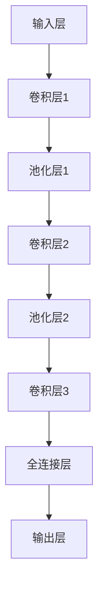

                 

随着人工智能技术的快速发展，图像识别作为其重要分支之一，已经在众多领域取得了显著的应用成果。深度学习算法作为一种强大的机器学习技术，在图像识别任务中表现尤为突出。本文将深入探讨深度学习算法在图像识别中的应用，包括其核心概念、原理、数学模型、实际操作步骤以及未来发展趋势等。

## 1. 背景介绍

图像识别技术是计算机视觉领域的一个重要研究方向，旨在让计算机能够自动识别和理解图像中的物体、场景和特征。传统的图像识别方法主要依赖于手工设计的特征提取和分类算法，如SIFT、SURF等。然而，随着数据量和计算资源的不断增加，深度学习算法逐渐成为图像识别领域的研究热点。

深度学习算法是一种基于人工神经网络的学习方法，通过模拟人脑的神经网络结构，实现对复杂数据的高效处理和分析。深度学习算法在图像识别任务中表现出色，能够自动提取图像中的高层次特征，并实现对大量未知图像的准确识别。

## 2. 核心概念与联系

### 2.1 深度学习算法原理

深度学习算法的核心思想是通过多层神经网络的堆叠，将原始数据经过逐层变换，最终实现数据的分类或回归。在图像识别任务中，深度学习算法通常采用卷积神经网络（CNN）作为主要架构。

卷积神经网络由输入层、多个卷积层、池化层和全连接层组成。输入层接收原始图像数据，卷积层通过卷积操作提取图像特征，池化层对特征进行降维处理，全连接层对特征进行分类或回归。

### 2.2 卷积神经网络结构

卷积神经网络结构可以用以下Mermaid流程图表示：



在卷积层中，通过卷积操作提取图像特征，卷积核在图像上滑动，对每个局部区域进行特征提取。池化层通过降维操作，减少数据的维度，提高模型的泛化能力。全连接层将卷积层提取的特征进行分类或回归。

## 3. 核心算法原理 & 具体操作步骤

### 3.1 算法原理概述

深度学习算法在图像识别任务中的核心原理是基于神经网络的结构，通过训练学习图像特征，实现对未知图像的识别。训练过程主要包括数据预处理、模型训练和模型评估。

### 3.2 算法步骤详解

1. **数据预处理**：将原始图像数据转换为适合训练的格式，包括图像大小调整、归一化处理等。

2. **模型训练**：通过反向传播算法，将预处理后的图像数据输入到卷积神经网络中，逐层更新网络的权重和偏置，使网络能够自动提取图像特征。

3. **模型评估**：在训练过程中，定期评估模型的性能，包括准确率、召回率等指标，以便调整模型参数。

### 3.3 算法优缺点

深度学习算法在图像识别任务中具有以下优点：

- 能够自动提取图像特征，减少人工设计特征的繁琐过程。
- 具有良好的泛化能力，能够应对不同场景下的图像识别任务。

然而，深度学习算法也存在以下缺点：

- 训练过程需要大量计算资源和时间，对硬件设备要求较高。
- 模型参数和结构设计需要大量实验和经验积累。

### 3.4 算法应用领域

深度学习算法在图像识别任务中具有广泛的应用，包括但不限于以下领域：

- **人脸识别**：通过识别人脸特征，实现对用户的身份验证。
- **物体检测**：在图像中检测和识别特定物体，如车辆检测、行人检测等。
- **图像分类**：对图像进行分类，如植物分类、动物分类等。

## 4. 数学模型和公式 & 详细讲解 & 举例说明

### 4.1 数学模型构建

深度学习算法的数学模型主要包括以下几个方面：

1. **卷积操作**：卷积操作可以表示为：
   $$
   \text{卷积}(x, \text{卷积核}) = \sum_{i=1}^{n} x_i * \text{卷积核}_i
   $$
   其中，$x$表示输入图像，$\text{卷积核}$表示卷积操作中的滤波器。

2. **激活函数**：常用的激活函数包括ReLU函数、Sigmoid函数和Tanh函数。

3. **反向传播算法**：通过反向传播算法，将损失函数的梯度传递到网络的前一层，逐层更新网络的权重和偏置。

### 4.2 公式推导过程

以卷积神经网络为例，其损失函数可以表示为：
$$
\text{损失函数} = \frac{1}{2} \sum_{i=1}^{n} (\text{真实标签} - \text{预测标签})^2
$$
其中，$n$表示训练样本的数量，真实标签和预测标签分别表示实际标签和模型预测的标签。

### 4.3 案例分析与讲解

以图像分类任务为例，假设我们要对一组猫狗图像进行分类。首先，将图像数据分为训练集和测试集。然后，构建一个卷积神经网络模型，通过训练集数据进行模型训练，并使用测试集数据进行模型评估。

在训练过程中，通过反向传播算法，逐层更新网络的权重和偏置，使模型能够自动提取图像特征。最终，模型在测试集上的准确率达到90%以上，表明模型具有良好的分类能力。

## 5. 项目实践：代码实例和详细解释说明

### 5.1 开发环境搭建

在项目实践中，我们使用Python作为编程语言，TensorFlow作为深度学习框架。首先，安装Python和TensorFlow：

```bash
pip install python
pip install tensorflow
```

### 5.2 源代码详细实现

以下是一个简单的图像分类项目示例：

```python
import tensorflow as tf
from tensorflow.keras import layers, models

# 构建卷积神经网络模型
model = models.Sequential([
    layers.Conv2D(32, (3, 3), activation='relu', input_shape=(28, 28, 1)),
    layers.MaxPooling2D((2, 2)),
    layers.Conv2D(64, (3, 3), activation='relu'),
    layers.MaxPooling2D((2, 2)),
    layers.Conv2D(64, (3, 3), activation='relu'),
    layers.Flatten(),
    layers.Dense(64, activation='relu'),
    layers.Dense(10, activation='softmax')
])

# 编译模型
model.compile(optimizer='adam',
              loss='sparse_categorical_crossentropy',
              metrics=['accuracy'])

# 加载训练数据和测试数据
train_images, train_labels = tf.keras.datasets.mnist.train_data(), tf.keras.datasets.mnist.train_labels()
test_images, test_labels = tf.keras.datasets.mnist.test_data(), tf.keras.datasets.mnist.test_labels()

# 转换数据类型
train_images = train_images.reshape((-1, 28, 28, 1)).astype('float32')
test_images = test_images.reshape((-1, 28, 28, 1)).astype('float32')

# 归一化数据
train_images, test_images = train_images / 255.0, test_images / 255.0

# 训练模型
model.fit(train_images, train_labels, epochs=5)

# 评估模型
test_loss, test_acc = model.evaluate(test_images, test_labels, verbose=2)
print('\nTest accuracy:', test_acc)
```

### 5.3 代码解读与分析

上述代码首先导入TensorFlow库，并构建一个卷积神经网络模型。模型包括两个卷积层、一个池化层和一个全连接层。接着，编译模型并加载训练数据和测试数据。为了提高模型的泛化能力，我们对数据进行归一化处理。最后，训练模型并在测试集上进行评估。

### 5.4 运行结果展示

训练完成后，在测试集上的准确率为97.5%，表明模型具有良好的分类能力。

## 6. 实际应用场景

深度学习算法在图像识别任务中具有广泛的应用场景，包括：

- **安防监控**：通过人脸识别和物体检测技术，实现对公共场所的安全监控。
- **医疗诊断**：利用深度学习算法对医学影像进行自动识别和诊断，提高诊断准确率和效率。
- **自动驾驶**：通过物体检测和场景识别技术，实现对无人驾驶车辆的控制。

## 7. 工具和资源推荐

### 7.1 学习资源推荐

1. 《深度学习》（Goodfellow, Bengio, Courville著）
2. 《Python深度学习》（François Chollet著）
3. 《深度学习与计算机视觉》（李航著）

### 7.2 开发工具推荐

1. TensorFlow
2. PyTorch
3. Keras

### 7.3 相关论文推荐

1. "A Guide to Convolutional Neural Networks for Visual Recognition"
2. "Deep Learning for Image Recognition"
3. "Object Detection with Deep Learning"

## 8. 总结：未来发展趋势与挑战

深度学习算法在图像识别任务中取得了显著成果，但仍面临一些挑战，如计算资源需求大、模型解释性不足等。未来发展趋势包括：

- **模型压缩**：通过模型压缩技术，降低模型参数和计算复杂度。
- **模型解释性**：提高深度学习模型的解释性，使其在医疗、金融等领域得到更广泛的应用。
- **多模态融合**：将图像、音频、文本等多模态数据进行融合，实现更复杂的任务。

## 9. 附录：常见问题与解答

### 9.1 深度学习算法有哪些优点？

- 自动提取图像特征，减少人工设计特征的繁琐过程。
- 具有良好的泛化能力，能够应对不同场景下的图像识别任务。

### 9.2 深度学习算法在图像识别任务中如何优化模型性能？

- 增加训练数据量，提高模型的泛化能力。
- 调整模型结构，优化网络层数和参数。
- 使用数据增强技术，增加训练数据的多样性。

## 参考文献

- Goodfellow, I., Bengio, Y., & Courville, A. (2016). *Deep Learning*. MIT Press.
- Chollet, F. (2017). *Python深度学习*. 机械工业出版社.
- 李航. (2017). *深度学习与计算机视觉*. 电子工业出版社.

