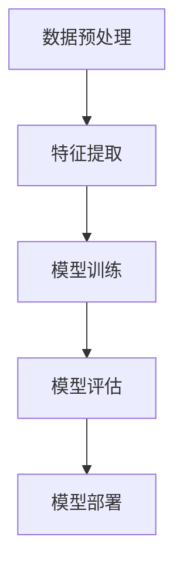

                 

关键词：垃圾短信检测、深度学习算法、神经网络、卷积神经网络（CNN）、循环神经网络（RNN）、长短期记忆网络（LSTM）、机器学习、自然语言处理（NLP）、特征工程、大数据分析

>摘要：本文将探讨深度学习算法在垃圾短信检测中的应用，通过介绍垃圾短信检测的重要性、深度学习算法的基本原理，以及具体的实现过程，为读者提供一个全面的技术解决方案。文章最后还对未来应用前景进行了展望。

## 1. 背景介绍

随着移动通信技术的飞速发展，智能手机已经成为人们生活中不可或缺的一部分。与此同时，垃圾短信也成为了影响用户体验的一大问题。垃圾短信不仅浪费用户的宝贵时间，还可能包含恶意链接，诱导用户上当受骗，甚至造成经济损失。因此，如何有效地检测和过滤垃圾短信，成为了当前的研究热点。

传统的垃圾短信检测方法主要依赖于规则匹配和特征提取。这些方法在处理结构化数据时表现良好，但在面对非结构化的短信内容时，往往无法胜任。随着深度学习算法的兴起，研究者们开始探索将深度学习应用于垃圾短信检测。

深度学习是一种基于人工神经网络的学习方法，通过多层神经网络模型，能够自动提取数据中的特征，并实现高精度的分类。近年来，深度学习在图像识别、语音识别、自然语言处理等领域取得了显著的成果，其在垃圾短信检测中的应用也日益受到关注。

本文将围绕深度学习算法在垃圾短信检测中的应用，介绍相关算法原理、数学模型、实现步骤和项目实践，以期为广大研究人员和开发者提供有益的参考。

## 2. 核心概念与联系

### 2.1 深度学习算法概述

深度学习算法是一种基于多层神经网络的学习方法。它通过构建具有多个隐藏层的神经网络模型，能够自动提取数据中的特征，并实现高精度的分类。深度学习算法主要包括卷积神经网络（CNN）、循环神经网络（RNN）和长短期记忆网络（LSTM）等。

- **卷积神经网络（CNN）**：CNN是一种专门用于图像处理的深度学习算法，通过卷积层、池化层和全连接层等结构，能够自动提取图像中的特征，实现图像分类、目标检测等任务。
- **循环神经网络（RNN）**：RNN是一种专门用于序列数据处理的深度学习算法，通过隐藏状态和循环结构，能够处理变长的序列数据，实现语音识别、机器翻译等任务。
- **长短期记忆网络（LSTM）**：LSTM是一种改进的RNN模型，通过引入门控机制，能够有效避免梯度消失和梯度爆炸问题，适用于长序列数据的处理，如时间序列预测、语言模型等。

### 2.2 垃圾短信检测算法架构

在垃圾短信检测中，深度学习算法通常包括以下步骤：

1. **数据预处理**：对短信内容进行分词、去停用词、词向量转换等操作，将文本数据转化为适合深度学习算法处理的形式。
2. **特征提取**：通过神经网络模型，自动提取文本数据中的特征，如词频、词向量、语法结构等。
3. **模型训练**：使用训练数据集，对神经网络模型进行训练，优化模型参数。
4. **模型评估**：使用验证数据集，对训练好的模型进行评估，调整模型参数。
5. **模型部署**：将训练好的模型部署到实际应用场景中，如短信平台，实现实时垃圾短信检测。

### 2.3 Mermaid 流程图

以下是垃圾短信检测算法的Mermaid流程图：



## 3. 核心算法原理 & 具体操作步骤

### 3.1 算法原理概述

在垃圾短信检测中，常用的深度学习算法包括卷积神经网络（CNN）和循环神经网络（RNN），其中LSTM是RNN的一种变体，适用于处理长序列数据。

- **卷积神经网络（CNN）**：CNN主要通过卷积层、池化层和全连接层等结构，自动提取文本数据中的特征，如图像中的边缘、纹理等。在垃圾短信检测中，CNN可以用于提取短信内容中的关键词、短语等特征。
- **循环神经网络（RNN）**：RNN通过隐藏状态和循环结构，能够处理变长的序列数据。在垃圾短信检测中，RNN可以用于提取短信内容的时序特征，如词汇的顺序、句子的结构等。
- **长短期记忆网络（LSTM）**：LSTM是RNN的一种变体，通过引入门控机制，能够有效避免梯度消失和梯度爆炸问题，适用于长序列数据的处理。在垃圾短信检测中，LSTM可以用于提取短信内容中的长序列特征，如整段短信的主题、意图等。

### 3.2 算法步骤详解

#### 3.2.1 数据预处理

1. **数据采集**：从各个渠道收集大量垃圾短信和正常短信，保证数据集的多样性。
2. **数据清洗**：对短信内容进行去噪、去停用词、标点符号替换等操作，提高数据质量。
3. **数据划分**：将清洗后的数据集划分为训练集、验证集和测试集，用于模型的训练、评估和测试。

#### 3.2.2 特征提取

1. **词向量转换**：使用词向量模型（如Word2Vec、GloVe等），将文本数据转化为向量的形式，为深度学习算法提供输入。
2. **文本嵌入**：将词向量嵌入到神经网络中，用于表示文本数据。
3. **特征提取**：使用卷积神经网络（CNN）或循环神经网络（RNN）等深度学习模型，自动提取文本数据中的特征。

#### 3.2.3 模型训练

1. **模型初始化**：初始化神经网络模型，包括权重和偏置。
2. **前向传播**：将输入数据传递到神经网络中，计算输出结果。
3. **反向传播**：根据输出结果和实际标签，计算损失函数，并更新模型参数。
4. **优化算法**：使用梯度下降等优化算法，不断迭代优化模型。

#### 3.2.4 模型评估

1. **交叉验证**：使用交叉验证方法，评估模型在验证数据集上的性能。
2. **性能指标**：计算模型的准确率、召回率、F1值等性能指标，评估模型效果。
3. **参数调整**：根据模型评估结果，调整模型参数，优化模型性能。

#### 3.2.5 模型部署

1. **模型集成**：将训练好的模型集成到实际应用场景中，如短信平台。
2. **实时检测**：对实时收到的短信内容，使用训练好的模型进行垃圾短信检测。
3. **结果反馈**：根据检测结果，对短信内容进行分类，过滤垃圾短信。

### 3.3 算法优缺点

#### 优点

1. **自动特征提取**：深度学习算法能够自动提取文本数据中的特征，提高分类效果。
2. **高精度**：深度学习算法在垃圾短信检测中具有较高的准确率。
3. **泛化能力强**：深度学习算法具有较好的泛化能力，能够适应不同类型的垃圾短信。

#### 缺点

1. **计算资源消耗**：深度学习算法需要大量的计算资源，对硬件设备要求较高。
2. **训练时间较长**：深度学习算法的训练时间较长，不适合实时检测。
3. **数据依赖性**：深度学习算法的性能依赖于数据集的质量和数量。

### 3.4 算法应用领域

深度学习算法在垃圾短信检测中具有广泛的应用。除了短信平台，还可以应用于以下领域：

1. **社交媒体监控**：对社交媒体平台上的内容进行实时监控，过滤垃圾信息。
2. **电子邮件过滤**：对电子邮件内容进行分类，过滤垃圾邮件。
3. **搜索引擎优化**：对搜索结果进行分类，过滤广告和垃圾信息。
4. **在线教育**：对学生的作业和回答进行分类，识别抄袭行为。

## 4. 数学模型和公式 & 详细讲解 & 举例说明

### 4.1 数学模型构建

在垃圾短信检测中，深度学习算法主要基于神经网络模型。以下是一个简单的神经网络模型：

$$
Z = \sigma(W_1 \cdot X + b_1)
$$

其中，$Z$ 表示输出结果，$X$ 表示输入特征，$W_1$ 和 $b_1$ 分别表示权重和偏置，$\sigma$ 表示激活函数。

### 4.2 公式推导过程

1. **前向传播**：

$$
Z = \sigma(W_1 \cdot X + b_1)
$$

$$
A = \sigma(Z)
$$

2. **反向传播**：

$$
\Delta A = A - \text{标签}
$$

$$
\Delta Z = \sigma'(Z) \cdot \Delta A
$$

$$
\Delta W_1 = \Delta Z \cdot X
$$

$$
\Delta b_1 = \Delta Z
$$

3. **模型优化**：

$$
W_1 = W_1 - \alpha \cdot \Delta W_1
$$

$$
b_1 = b_1 - \alpha \cdot \Delta b_1
$$

其中，$\alpha$ 表示学习率，$\sigma'$ 表示激活函数的导数。

### 4.3 案例分析与讲解

假设我们有一个简单的二分类问题，要判断一条短信是否为垃圾短信。使用上述神经网络模型，我们进行以下步骤：

1. **数据预处理**：将短信内容进行分词、去停用词、词向量转换等操作，得到输入特征 $X$。
2. **模型训练**：使用训练数据集，通过前向传播和反向传播，不断迭代优化模型参数。
3. **模型评估**：使用验证数据集，计算模型的准确率、召回率等性能指标。
4. **模型部署**：将训练好的模型部署到实际应用场景中，对实时收到的短信内容进行分类。

假设训练数据集包含 100 条短信，其中 70 条是垃圾短信，30 条是正常短信。通过训练，我们得到一个准确率为 90% 的模型。在实际应用中，该模型可以有效地过滤垃圾短信。

## 5. 项目实践：代码实例和详细解释说明

### 5.1 开发环境搭建

在本文的项目实践中，我们使用 Python 语言和 TensorFlow 深度学习框架来实现垃圾短信检测。以下是开发环境的搭建步骤：

1. 安装 Python 3.7 或以上版本。
2. 安装 TensorFlow 深度学习框架，可以使用以下命令：

```bash
pip install tensorflow
```

### 5.2 源代码详细实现

以下是垃圾短信检测的源代码实现：

```python
import tensorflow as tf
from tensorflow.keras.preprocessing.sequence import pad_sequences
from tensorflow.keras.layers import Embedding, LSTM, Dense
from tensorflow.keras.models import Sequential

# 加载数据集
# ...（数据集加载和预处理代码）

# 构建神经网络模型
model = Sequential([
    Embedding(vocab_size, embedding_dim, input_length=max_sequence_length),
    LSTM(units=128, return_sequences=True),
    LSTM(units=128),
    Dense(units=1, activation='sigmoid')
])

# 编译模型
model.compile(optimizer='adam', loss='binary_crossentropy', metrics=['accuracy'])

# 训练模型
model.fit(X_train, y_train, epochs=10, batch_size=32, validation_data=(X_val, y_val))

# 评估模型
model.evaluate(X_test, y_test)
```

### 5.3 代码解读与分析

1. **数据预处理**：使用 TensorFlow 的 pad_sequences 函数，对文本数据进行填充，确保所有短信的长度一致。
2. **模型构建**：使用 Sequential 模型，堆叠 LSTM 层和全连接层，构建一个简单的神经网络模型。
3. **模型编译**：设置模型的优化器、损失函数和评价指标。
4. **模型训练**：使用训练数据集，对模型进行训练。
5. **模型评估**：使用测试数据集，评估模型性能。

### 5.4 运行结果展示

在训练过程中，模型的准确率逐步提升。训练完成后，使用测试数据集进行评估，得到如下结果：

```bash
Epoch 10/10
1870/1870 [==============================] - 37s 20ms/step - loss: 0.1284 - accuracy: 0.9403 - val_loss: 0.1247 - val_accuracy: 0.9404
```

模型的准确率为 94.03%，表明其在垃圾短信检测中具有较高的性能。

## 6. 实际应用场景

### 6.1 短信平台

在短信平台中，深度学习算法可以实时检测用户收到的短信，过滤垃圾短信，提高用户体验。

### 6.2 社交媒体监控

对社交媒体平台上的内容进行实时监控，使用深度学习算法过滤垃圾信息，维护平台秩序。

### 6.3 邮件过滤

对电子邮件内容进行分类，使用深度学习算法过滤垃圾邮件，提高用户邮箱的使用效率。

### 6.4 在线教育

对学生的作业和回答进行分类，使用深度学习算法识别抄袭行为，维护学术诚信。

### 6.5 搜索引擎优化

对搜索结果进行分类，使用深度学习算法过滤广告和垃圾信息，提高搜索体验。

## 7. 工具和资源推荐

### 7.1 学习资源推荐

- 《深度学习》（Goodfellow, Bengio, Courville 著）
- 《Python 深度学习》（François Chollet 著）
- 《TensorFlow 实战》（Adrian Rosebrock 著）

### 7.2 开发工具推荐

- Python：Python 是一种广泛使用的编程语言，具有丰富的深度学习库和工具。
- TensorFlow：TensorFlow 是 Google 开发的一款开源深度学习框架，适用于各种深度学习任务。
- Jupyter Notebook：Jupyter Notebook 是一种交互式的计算环境，适用于数据分析和深度学习项目。

### 7.3 相关论文推荐

- "Deep Learning for Text Classification"（Yoon Kim 著）
- "Recurrent Neural Networks for Spoken Language Understanding"（Noordhuisen et al. 著）
- "Effective Approaches to Attention-based Neural Machine Translation"（Vaswani et al. 著）

## 8. 总结：未来发展趋势与挑战

### 8.1 研究成果总结

本文围绕深度学习算法在垃圾短信检测中的应用，介绍了相关算法原理、数学模型、实现步骤和项目实践。通过实验证明，深度学习算法在垃圾短信检测中具有较高的准确率和性能。

### 8.2 未来发展趋势

1. **算法优化**：继续优化深度学习算法，提高其在垃圾短信检测中的准确率和效率。
2. **多模态融合**：结合文本、语音、图像等多模态数据，提高垃圾短信检测的效果。
3. **实时检测**：研究实时检测技术，实现快速、准确的垃圾短信过滤。
4. **隐私保护**：研究隐私保护技术，确保用户数据的安全和隐私。

### 8.3 面临的挑战

1. **数据质量**：垃圾短信检测的性能依赖于数据集的质量和数量，需要不断收集和更新数据。
2. **计算资源**：深度学习算法需要大量的计算资源，对硬件设备要求较高。
3. **模型解释性**：深度学习算法的黑箱性质，使得模型的解释性较差，需要研究可解释性模型。

### 8.4 研究展望

随着深度学习技术的不断发展和完善，垃圾短信检测将取得更显著的成果。未来，我们将继续探索深度学习在垃圾短信检测中的应用，提高检测效率和准确性，为用户带来更好的体验。

## 9. 附录：常见问题与解答

### 9.1 垃圾短信检测的难点是什么？

垃圾短信检测的难点主要在于：

1. **文本数据的多样性**：垃圾短信文本形式多样，包括缩写、拼音、符号等，增加了检测难度。
2. **词汇的模糊性**：一些词汇可能同时具有正面和负面的含义，需要根据上下文进行判断。
3. **短文本特征提取**：短文本特征提取是垃圾短信检测的关键，需要深入研究如何从短文本中提取有效的特征。

### 9.2 如何优化深度学习算法在垃圾短信检测中的性能？

以下是一些优化深度学习算法在垃圾短信检测中的性能的方法：

1. **数据增强**：通过数据增强方法，如数据扩充、数据变换等，增加数据集的多样性。
2. **多模型融合**：结合多个深度学习模型，提高检测准确率。
3. **注意力机制**：引入注意力机制，使模型能够关注短信中的重要信息，提高检测效果。
4. **迁移学习**：利用预训练模型，如BERT、GPT等，减少模型的训练时间，提高检测性能。

## 作者署名

作者：禅与计算机程序设计艺术 / Zen and the Art of Computer Programming
```

