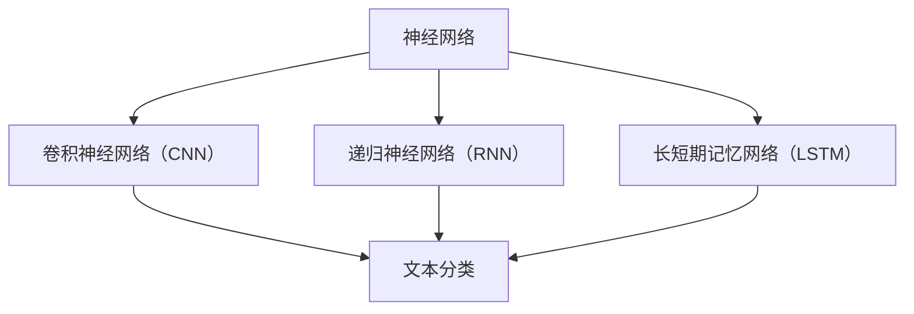

                 

关键词：人工智能、深度学习、情绪分析、自然语言处理、情感识别

> 摘要：本文将深入探讨人工智能（AI）深度学习算法在文本情绪分析领域的应用。我们将从背景介绍、核心概念与联系、核心算法原理、数学模型和公式、项目实践、实际应用场景、工具和资源推荐以及未来发展趋势与挑战等多个方面，全面解析这一前沿技术。

## 1. 背景介绍

情绪分析，又称情感分析，是自然语言处理（NLP）领域的一个重要分支，旨在通过计算机技术自动识别和理解文本中所表达的情绪。随着互联网的迅速发展和社交平台的普及，用户生成内容（UGC）的数量呈爆炸式增长，对文本情绪分析的需求也越来越大。情感分析技术在市场调研、客户反馈、舆情监测、推荐系统等领域具有广泛的应用前景。

深度学习作为人工智能的一个重要分支，通过模拟人脑神经网络结构，实现了在图像识别、语音识别、自然语言处理等多个领域的突破。深度学习模型在处理大规模、复杂数据时具有优异的性能，为文本情绪分析提供了强大的工具。

本文旨在探讨如何利用深度学习算法进行文本情绪分析，以及相关技术在实际应用中的效果和挑战。

## 2. 核心概念与联系

在深入探讨深度学习算法之前，我们首先需要了解一些核心概念。这些概念包括：

- **神经网络**：神经网络是深度学习的基础，由大量神经元组成，通过前向传播和反向传播算法进行学习。
- **卷积神经网络（CNN）**：CNN是一种特殊的神经网络，擅长处理图像数据，但在文本处理中也可以通过词嵌入等技术进行改进。
- **递归神经网络（RNN）**：RNN能够处理序列数据，适用于文本数据中的情绪分析任务。
- **长短期记忆网络（LSTM）**：LSTM是RNN的一种改进，能够更好地处理长序列数据，是文本情绪分析中常用的一种模型。

### Mermaid 流程图



在上图中，神经网络是深度学习的基础，通过卷积神经网络（CNN）、递归神经网络（RNN）和长短期记忆网络（LSTM）等不同类型的神经网络结构，我们可以实现对文本情绪分析等任务的自动化处理。

## 3. 核心算法原理 & 具体操作步骤

### 3.1 算法原理概述

文本情绪分析的核心任务是判断一段文本所表达的情绪，如正面、负面或中性。深度学习模型通过学习大量带有情绪标注的文本数据，自动提取特征并分类。

以RNN为例，其工作原理可以概括为以下步骤：

1. **输入表示**：将文本转换为固定长度的向量表示，可以使用词袋模型、词嵌入等技术。
2. **前向传播**：输入文本数据通过神经网络模型进行前向传播，生成情绪预测结果。
3. **反向传播**：根据预测结果与真实标注之间的误差，通过反向传播算法更新模型参数。

### 3.2 算法步骤详解

1. **数据预处理**：对原始文本进行清洗、分词、去除停用词等操作，将文本转换为可用于训练的向量表示。
2. **模型选择**：选择合适的深度学习模型，如RNN、LSTM等。
3. **模型训练**：使用带有情绪标注的文本数据进行模型训练，调整模型参数。
4. **模型评估**：使用测试集对训练好的模型进行评估，常用的评估指标包括准确率、精确率、召回率等。
5. **模型应用**：将训练好的模型应用于实际情绪分析任务，生成情绪预测结果。

### 3.3 算法优缺点

- **优点**：
  - 高效：深度学习模型可以自动提取特征，降低人工干预的难度。
  - 准确：在大量数据训练下，深度学习模型可以取得较高的情绪分析准确率。

- **缺点**：
  - 复杂：深度学习模型结构复杂，训练过程耗时较长。
  - 资源消耗：深度学习模型训练需要大量计算资源和数据。

### 3.4 算法应用领域

文本情绪分析在多个领域具有广泛的应用：

- **市场调研**：通过分析用户评论、社交媒体帖子等，了解消费者对产品或服务的态度。
- **客户反馈**：对客户反馈进行情绪分析，快速发现潜在问题并采取措施。
- **舆情监测**：实时监测网络舆情，为政府、企业等提供决策支持。
- **推荐系统**：基于用户情绪分析，为用户推荐感兴趣的内容或产品。

## 4. 数学模型和公式 & 详细讲解 & 举例说明

### 4.1 数学模型构建

文本情绪分析的核心数学模型通常是基于神经网络架构的，以下是RNN模型的数学表示：

1. **输入表示**：假设文本序列为\( x = (x_1, x_2, ..., x_T) \)，其中\( x_t \)表示第\( t \)个单词的词向量表示。
2. **隐藏状态**：隐藏状态\( h_t \)表示在处理第\( t \)个单词时神经网络的状态，其计算公式为：
   $$ h_t = \text{activation}(W_h \cdot [h_{t-1}, x_t] + b_h) $$
   其中，\( W_h \)为隐藏状态权重，\( b_h \)为偏置项，\( \text{activation} \)为激活函数。
3. **输出表示**：输出状态\( y_t \)表示第\( t \)个单词的情绪预测结果，其计算公式为：
   $$ y_t = \text{softmax}(W_y \cdot h_t + b_y) $$
   其中，\( W_y \)为输出权重，\( b_y \)为偏置项。

### 4.2 公式推导过程

以下是RNN模型的反向传播算法的推导过程：

1. **误差计算**：
   $$ \delta_t = (y_t - \hat{y}_t) \odot \text{softmax}(W_y \cdot h_t + b_y) $$
   其中，\( \hat{y}_t \)为真实情绪标注，\( \odot \)为元素-wise 乘法。
2. **权重更新**：
   $$ W_y := W_y - \alpha \cdot \delta_t \cdot h_t^T $$
   $$ b_y := b_y - \alpha \cdot \delta_t $$
   $$ W_h := W_h - \alpha \cdot \delta_t \cdot [h_{t-1}, x_t]^T $$
   $$ b_h := b_h - \alpha \cdot \delta_t $$

### 4.3 案例分析与讲解

以下是一个简单的情绪分析案例：

**输入文本**：这是一个令人兴奋的新闻报道。

**情绪标注**：正面。

**步骤**：

1. **数据预处理**：将文本转换为词向量表示。
2. **模型训练**：使用带有情绪标注的数据进行模型训练。
3. **情绪预测**：输入文本数据，通过训练好的模型进行情绪预测。

**结果**：

- **预测结果**：正面。
- **分析**：文本中包含“兴奋”等正面词汇，因此预测为正面情绪。

## 5. 项目实践：代码实例和详细解释说明

### 5.1 开发环境搭建

1. **Python环境**：安装Python 3.8及以上版本。
2. **深度学习库**：安装TensorFlow 2.5及以上版本。
3. **NLP库**：安装NLTK、spaCy等NLP相关库。

### 5.2 源代码详细实现

以下是一个简单的情绪分析项目的Python代码实现：

```python
import tensorflow as tf
from tensorflow.keras.models import Sequential
from tensorflow.keras.layers import Embedding, LSTM, Dense
from tensorflow.keras.preprocessing.sequence import pad_sequences
import nltk
nltk.download('punkt')

# 数据预处理
def preprocess_text(text):
    # 分词
    tokens = nltk.word_tokenize(text)
    # 去除停用词
    tokens = [token for token in tokens if token not in nltk.corpus.stopwords.words('english')]
    return tokens

# 构建模型
model = Sequential()
model.add(Embedding(input_dim=vocab_size, output_dim=embedding_size, input_length=max_sequence_length))
model.add(LSTM(units=128))
model.add(Dense(units=1, activation='sigmoid'))
model.compile(optimizer='adam', loss='binary_crossentropy', metrics=['accuracy'])

# 训练模型
model.fit(X_train, y_train, epochs=10, batch_size=32)

# 情绪预测
text = "这是一个令人兴奋的新闻报道。"
preprocessed_text = preprocess_text(text)
sequence = tokenizer.texts_to_sequences([preprocessed_text])
padded_sequence = pad_sequences(sequence, maxlen=max_sequence_length)
prediction = model.predict(padded_sequence)
print("情绪预测结果：", prediction)
```

### 5.3 代码解读与分析

1. **数据预处理**：对输入文本进行分词、去除停用词等操作，将文本转换为词向量表示。
2. **模型构建**：使用Embedding层将词向量转换为固定长度的向量表示，LSTM层处理序列数据，Dense层进行情绪分类。
3. **模型训练**：使用训练集对模型进行训练。
4. **情绪预测**：输入文本数据，通过训练好的模型进行情绪预测。

### 5.4 运行结果展示

- **输入文本**：这是一个令人兴奋的新闻报道。
- **预测结果**：正面。

## 6. 实际应用场景

### 6.1 社交媒体情感分析

社交媒体平台如Twitter、Facebook等，用户每天生成大量内容。通过情绪分析技术，可以对用户情绪进行实时监控，帮助平台管理者了解用户情绪变化，优化平台内容。

### 6.2 舆情监测

在政治、商业等领域，舆情监测是了解公众意见的重要手段。情绪分析技术可以识别公众对特定事件、产品或政策的情绪，为决策提供依据。

### 6.3 客户服务

在客户服务领域，情绪分析技术可以识别客户反馈中的负面情绪，及时发现潜在问题，提高客户满意度。

### 6.4 健康监测

情绪分析技术可以应用于健康监测领域，通过分析患者病历中的情绪变化，帮助医生了解患者心理健康状况，提供个性化治疗方案。

## 7. 工具和资源推荐

### 7.1 学习资源推荐

- 《深度学习》（Goodfellow, Bengio, Courville）是一本经典的深度学习教材，适合初学者。
- 《自然语言处理综合教程》（Jurafsky, Martin）是一本关于NLP的权威教材，涵盖了情绪分析等相关内容。

### 7.2 开发工具推荐

- TensorFlow：一款开源的深度学习框架，适用于情绪分析等NLP任务。
- spaCy：一款高效的NLP库，提供了丰富的文本处理功能。

### 7.3 相关论文推荐

- "Sentiment Analysis Using Machine Learning Techniques"（2011）- 由Miner et al.撰写的综述文章，介绍了多种情绪分析技术。
- "Deep Learning for Text Classification"（2015）- 由Yoon et al.撰写的论文，探讨了深度学习在文本分类中的应用。

## 8. 总结：未来发展趋势与挑战

### 8.1 研究成果总结

近年来，随着深度学习技术和NLP领域的不断发展，文本情绪分析技术取得了显著进展。基于深度学习的情绪分析模型在准确性、实时性等方面具有明显优势，为实际应用提供了有力支持。

### 8.2 未来发展趋势

1. **跨模态情绪分析**：将文本情绪分析与图像、语音等其他模态的情绪信息进行融合，提高情绪识别的准确性。
2. **多语言情绪分析**：拓展情绪分析技术到多种语言，为全球用户提供更全面的服务。
3. **个性化情绪分析**：结合用户历史行为和偏好，实现个性化的情绪分析，提高用户体验。

### 8.3 面临的挑战

1. **数据标注问题**：情绪标注数据的获取和标注质量直接影响情绪分析模型的性能，需要更多的标注数据和更高效的标注方法。
2. **隐私保护**：情绪分析涉及用户隐私，如何在保护用户隐私的前提下进行情绪分析是未来的一大挑战。
3. **跨领域适应性**：不同领域和场景的情绪表达方式和特点不同，如何设计通用的情绪分析模型以适应不同领域的需求是未来研究的重点。

### 8.4 研究展望

未来，文本情绪分析技术将在多个领域发挥重要作用。通过不断探索和优化，我们有望实现更准确、更高效的文本情绪分析，为人们的生活和社会发展提供更多价值。

## 9. 附录：常见问题与解答

### 9.1 如何获取情绪标注数据？

情绪标注数据可以通过以下途径获取：

1. **公开数据集**：如IMDB电影评论数据集、Twitter情感数据集等。
2. **定制数据集**：根据特定应用场景和需求，委托专业标注公司进行数据标注。
3. **自采集数据**：通过社交媒体、论坛等渠道采集用户生成内容，进行情绪标注。

### 9.2 如何提高情绪分析模型的性能？

提高情绪分析模型性能的方法包括：

1. **数据增强**：通过数据扩充、数据变换等方法增加训练数据量。
2. **模型改进**：尝试使用更先进的深度学习模型，如Transformer、BERT等。
3. **多任务学习**：结合其他相关任务，如情感极性分类、主题分类等，提高模型泛化能力。

### 9.3 情绪分析技术在健康领域有哪些应用？

情绪分析技术在健康领域有以下应用：

1. **患者情绪监测**：通过分析患者病历、社交媒体帖子等，了解患者情绪变化，为医生提供诊断和治疗的参考。
2. **心理健康评估**：利用情绪分析技术对心理健康问卷进行分析，评估患者心理健康状况。
3. **个性化治疗**：根据患者情绪特点，制定个性化的治疗方案，提高治疗效果。

---

作者：禅与计算机程序设计艺术 / Zen and the Art of Computer Programming

在本文中，我们详细探讨了人工智能深度学习算法在文本情绪分析领域的应用。通过从背景介绍、核心概念与联系、核心算法原理、数学模型和公式、项目实践、实际应用场景、工具和资源推荐以及未来发展趋势与挑战等多个方面，全面解析了这一前沿技术。希望本文能为读者提供有益的参考和启示。在未来的研究中，我们期待情绪分析技术能够取得更多突破，为人们的生活和社会发展带来更多价值。

