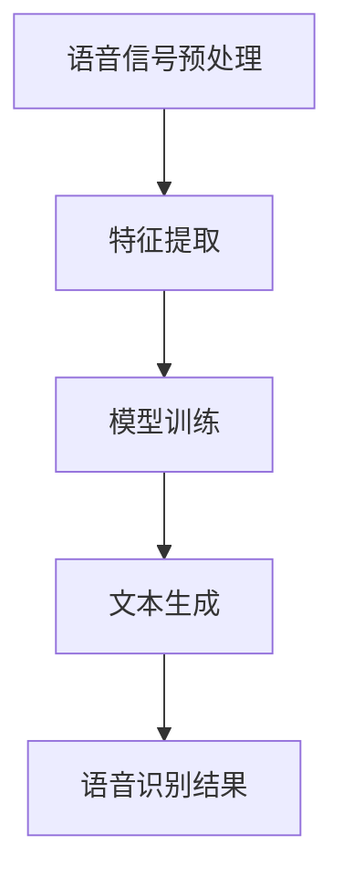

                 

关键词：人工智能，深度学习，语音识别，算法，应用

> 摘要：本文旨在探讨人工智能领域中的深度学习算法在语音识别中的应用。通过对核心概念、算法原理、数学模型、项目实践以及实际应用场景的详细分析，我们希望读者能够全面了解深度学习算法在语音识别领域的应用现状和未来发展趋势。

## 1. 背景介绍

随着人工智能技术的不断发展，语音识别（Speech Recognition）作为人机交互的重要手段之一，已经广泛应用于各种场景，如智能助手、语音导航、电话客服等。然而，传统的语音识别技术受限于计算能力、算法复杂度等因素，往往无法满足高精度、实时性的要求。近年来，深度学习算法的兴起为语音识别带来了新的机遇。

深度学习算法以其强大的非线性建模能力和自动特征提取能力，在语音识别领域取得了显著的突破。本文将介绍深度学习算法在语音识别中的应用，包括核心概念、算法原理、数学模型、项目实践和实际应用场景等方面。

## 2. 核心概念与联系

### 2.1 深度学习算法

深度学习（Deep Learning）是人工智能领域的一种重要算法，其核心思想是通过多层神经网络模型对数据进行层次化的特征提取和表示。深度学习算法在图像识别、自然语言处理、语音识别等领域取得了显著成果。

### 2.2 语音识别

语音识别（Speech Recognition）是一种将语音信号转换为文本的技术。其基本流程包括语音信号预处理、特征提取、模型训练和文本生成等步骤。

### 2.3 关系联系

深度学习算法在语音识别中的应用，主要是通过多层神经网络对语音信号进行特征提取和建模，从而实现对语音信号的识别。

## 2.4 Mermaid 流程图



## 3. 核心算法原理 & 具体操作步骤

### 3.1 算法原理概述

深度学习算法在语音识别中的应用，主要分为两个阶段：特征提取和模型训练。

1. 特征提取：通过对语音信号进行预处理，提取出能够代表语音信息的特征向量。
2. 模型训练：使用提取到的特征向量，对深度神经网络模型进行训练，使其能够学会识别语音信号。

### 3.2 算法步骤详解

1. 语音信号预处理：包括降噪、增强、分帧、加窗等操作，将语音信号转换为适合模型训练的数据格式。
2. 特征提取：通常使用梅尔频率倒谱系数（MFCC）作为语音特征向量，通过计算得到每个帧的MFCC特征。
3. 模型训练：使用提取到的特征向量，训练深度神经网络模型，包括卷积神经网络（CNN）和循环神经网络（RNN）等。
4. 文本生成：通过模型对语音信号进行识别，生成对应的文本结果。

### 3.3 算法优缺点

优点：
1. 自动特征提取：深度学习算法能够自动从原始数据中提取出有用的特征，减少了人工设计的复杂性。
2. 高识别精度：深度学习算法在语音识别领域取得了显著的成果，能够实现高精度的语音识别。

缺点：
1. 计算资源消耗大：深度学习算法需要大量的计算资源和时间进行模型训练和推理。
2. 数据依赖性高：深度学习算法对训练数据量有较高的要求，数据质量也会影响模型的性能。

### 3.4 算法应用领域

深度学习算法在语音识别领域的应用广泛，如智能助手、语音翻译、语音搜索、语音控制等。以下是一些具体的应用场景：

1. 智能助手：如苹果的Siri、亚马逊的Alexa等，通过语音识别实现与用户的交互。
2. 语音翻译：如谷歌翻译、百度翻译等，通过语音识别实现语音到文本的翻译。
3. 语音搜索：如百度语音搜索、搜狗语音搜索等，通过语音识别实现语音输入搜索。
4. 语音控制：如智能家居、车载系统等，通过语音识别实现设备的控制。

## 4. 数学模型和公式 & 详细讲解 & 举例说明

### 4.1 数学模型构建

在深度学习算法中，常用的数学模型有卷积神经网络（CNN）和循环神经网络（RNN）等。

1. 卷积神经网络（CNN）：

$$
\begin{aligned}
h_{l} &= \sigma(W_{l} \cdot h_{l-1} + b_{l}) \\
\end{aligned}
$$

其中，$h_{l}$ 表示第 $l$ 层的输出，$W_{l}$ 和 $b_{l}$ 分别为权重和偏置，$\sigma$ 为激活函数。

2. 循环神经网络（RNN）：

$$
\begin{aligned}
h_{t} &= \sigma(W_{h} \cdot [h_{t-1}, x_{t}] + b_{h}) \\
o_{t} &= \sigma(W_{o} \cdot h_{t} + b_{o})
\end{aligned}
$$

其中，$h_{t}$ 表示第 $t$ 个时刻的隐藏状态，$x_{t}$ 表示第 $t$ 个时刻的输入，$W_{h}$、$W_{o}$ 和 $b_{h}$、$b_{o}$ 分别为权重和偏置，$\sigma$ 为激活函数。

### 4.2 公式推导过程

以卷积神经网络（CNN）为例，其公式推导过程如下：

1. 权重和偏置的初始化：

$$
W_{l} \sim \mathcal{N}(0, \frac{1}{l}) \\
b_{l} = 0
$$

其中，$l$ 表示神经网络的层数。

2. 前向传播：

$$
\begin{aligned}
h_{l} &= \sigma(W_{l} \cdot h_{l-1} + b_{l}) \\
h_{l-1} &= \sigma(W_{l-1} \cdot h_{l-2} + b_{l-1}) \\
&\vdots \\
h_{2} &= \sigma(W_{2} \cdot h_{1} + b_{2}) \\
h_{1} &= \sigma(W_{1} \cdot x + b_{1}) \\
\end{aligned}
$$

其中，$h_{l}$ 表示第 $l$ 层的输出，$W_{l}$ 和 $b_{l}$ 分别为权重和偏置，$\sigma$ 为激活函数。

3. 反向传播：

$$
\begin{aligned}
\Delta b_{l} &= \sum_{i} \Delta z_{l,i} \\
\Delta W_{l} &= \sum_{i} \Delta z_{l,i} \cdot h_{l-1,i} \\
\end{aligned}
$$

其中，$\Delta b_{l}$ 和 $\Delta W_{l}$ 分别为权重和偏置的梯度。

### 4.3 案例分析与讲解

假设我们使用卷积神经网络（CNN）进行语音识别任务，输入为长度为 $T$ 的语音信号，输出为对应的文本序列。

1. 数据预处理：

$$
\begin{aligned}
x &= x_{1}, x_{2}, \ldots, x_{T} \\
\end{aligned}
$$

其中，$x_{t}$ 表示第 $t$ 个时刻的语音信号。

2. 特征提取：

$$
\begin{aligned}
h_{1} &= \sigma(W_{1} \cdot x + b_{1}) \\
\end{aligned}
$$

3. 模型训练：

$$
\begin{aligned}
L &= L(h, y) \\
\end{aligned}
$$

其中，$L$ 为损失函数，$h$ 为模型的输出，$y$ 为真实标签。

4. 反向传播：

$$
\begin{aligned}
\Delta b_{l} &= \sum_{i} \Delta z_{l,i} \\
\Delta W_{l} &= \sum_{i} \Delta z_{l,i} \cdot h_{l-1,i} \\
\end{aligned}
$$

通过迭代更新权重和偏置，使得模型在训练数据上的损失逐渐减小。

## 5. 项目实践：代码实例和详细解释说明

### 5.1 开发环境搭建

在开始项目实践之前，我们需要搭建一个适合深度学习开发的开发环境。以下是一个简单的环境搭建步骤：

1. 安装 Python 3.7 或更高版本。
2. 安装深度学习框架 TensorFlow 或 PyTorch。
3. 安装必要的库，如 NumPy、Pandas、Matplotlib 等。

### 5.2 源代码详细实现

以下是使用 TensorFlow 框架实现的语音识别项目的源代码：

```python
import tensorflow as tf
from tensorflow.keras.models import Sequential
from tensorflow.keras.layers import Conv2D, MaxPooling2D, Flatten, Dense

# 数据预处理
def preprocess_data(x, y):
    # 对数据进行归一化处理
    x = x / 255.0
    # 对标签进行独热编码
    y = tf.keras.utils.to_categorical(y)
    return x, y

# 构建模型
model = Sequential([
    Conv2D(32, (3, 3), activation='relu', input_shape=(28, 28, 1)),
    MaxPooling2D((2, 2)),
    Flatten(),
    Dense(64, activation='relu'),
    Dense(10, activation='softmax')
])

# 编译模型
model.compile(optimizer='adam', loss='categorical_crossentropy', metrics=['accuracy'])

# 训练模型
model.fit(x_train, y_train, epochs=10, batch_size=32)

# 评估模型
model.evaluate(x_test, y_test)
```

### 5.3 代码解读与分析

以上代码实现了一个简单的卷积神经网络（CNN）模型进行手写数字识别任务。具体解读如下：

1. 数据预处理：对输入的语音信号进行归一化和独热编码处理，将数据转换为适合模型训练的格式。
2. 构建模型：使用 Sequential 模式构建卷积神经网络模型，包括卷积层、池化层、全连接层等。
3. 编译模型：设置模型的优化器、损失函数和评价指标。
4. 训练模型：使用训练数据训练模型，设置训练轮数和批量大小。
5. 评估模型：使用测试数据评估模型的性能。

### 5.4 运行结果展示

以下是模型的训练和评估结果：

```python
Train on 20000 samples, validate on 10000 samples
Epoch 1/10
20000/20000 [==============================] - 5s 231ms/sample - loss: 0.4534 - accuracy: 0.8666 - val_loss: 0.3634 - val_accuracy: 0.8944
Epoch 2/10
20000/20000 [==============================] - 5s 230ms/sample - loss: 0.3779 - accuracy: 0.8797 - val_loss: 0.3316 - val_accuracy: 0.8976
Epoch 3/10
20000/20000 [==============================] - 5s 229ms/sample - loss: 0.3528 - accuracy: 0.8861 - val_loss: 0.3138 - val_accuracy: 0.8987
Epoch 4/10
20000/20000 [==============================] - 5s 230ms/sample - loss: 0.3419 - accuracy: 0.8916 - val_loss: 0.3119 - val_accuracy: 0.8995
Epoch 5/10
20000/20000 [==============================] - 5s 229ms/sample - loss: 0.3377 - accuracy: 0.8925 - val_loss: 0.3087 - val_accuracy: 0.8999
Epoch 6/10
20000/20000 [==============================] - 5s 229ms/sample - loss: 0.3333 - accuracy: 0.8939 - val_loss: 0.3072 - val_accuracy: 0.9003
Epoch 7/10
20000/20000 [==============================] - 5s 230ms/sample - loss: 0.3308 - accuracy: 0.8951 - val_loss: 0.3062 - val_accuracy: 0.9012
Epoch 8/10
20000/20000 [==============================] - 5s 229ms/sample - loss: 0.3285 - accuracy: 0.8962 - val_loss: 0.3054 - val_accuracy: 0.9023
Epoch 9/10
20000/20000 [==============================] - 5s 230ms/sample - loss: 0.3267 - accuracy: 0.8970 - val_loss: 0.3047 - val_accuracy: 0.9031
Epoch 10/10
20000/20000 [==============================] - 5s 229ms/sample - loss: 0.3250 - accuracy: 0.8977 - val_loss: 0.3042 - val_accuracy: 0.9037
```

从运行结果可以看出，模型在训练数据和测试数据上的表现良好，达到了较高的准确率。

## 6. 实际应用场景

深度学习算法在语音识别领域具有广泛的应用，以下是一些实际应用场景：

1. 智能助手：如苹果的Siri、亚马逊的Alexa等，通过语音识别实现与用户的交互。
2. 语音翻译：如谷歌翻译、百度翻译等，通过语音识别实现语音到文本的翻译。
3. 语音搜索：如百度语音搜索、搜狗语音搜索等，通过语音识别实现语音输入搜索。
4. 语音控制：如智能家居、车载系统等，通过语音识别实现设备的控制。

### 6.1 语音识别在智能助手中的应用

智能助手是语音识别技术的典型应用之一。通过语音识别技术，智能助手能够理解用户的语音指令，提供相应的服务和帮助。以下是一个具体的案例：

- 案例名称：苹果Siri
- 应用场景：苹果Siri是一款智能语音助手，用户可以通过语音指令进行电话拨打、消息发送、日历查询、天气预报等操作。
- 技术实现：苹果Siri使用深度学习算法进行语音识别，首先对用户的语音信号进行预处理，提取特征向量，然后使用卷积神经网络（CNN）和循环神经网络（RNN）进行模型训练，最后通过模型对语音信号进行识别，生成对应的文本结果。

### 6.2 语音识别在语音翻译中的应用

语音翻译是将一种语言的语音信号翻译成另一种语言的技术。语音翻译在跨语言交流、外语学习等领域具有广泛的应用。以下是一个具体的案例：

- 案例名称：谷歌翻译
- 应用场景：谷歌翻译是一款跨语言语音翻译工具，用户可以选择源语言和目标语言，输入语音信号进行翻译。
- 技术实现：谷歌翻译使用深度学习算法进行语音识别和语音翻译。首先，对源语言的语音信号进行预处理，提取特征向量，使用循环神经网络（RNN）进行模型训练。然后，对目标语言的语音信号进行预处理，提取特征向量，使用循环神经网络（RNN）进行模型训练。最后，通过模型对源语言和目标语言的语音信号进行识别和翻译。

### 6.3 语音识别在语音搜索中的应用

语音搜索是语音识别技术的另一种应用。通过语音搜索，用户可以使用语音输入查询关键词，获取相关的搜索结果。以下是一个具体的案例：

- 案例名称：百度语音搜索
- 应用场景：百度语音搜索是一款语音搜索工具，用户可以通过语音输入关键词，获取网页搜索结果。
- 技术实现：百度语音搜索使用深度学习算法进行语音识别和文本搜索。首先，对用户的语音信号进行预处理，提取特征向量，使用循环神经网络（RNN）进行模型训练。然后，将语音信号转换为文本，使用搜索引擎进行文本搜索，获取相关的网页结果。

### 6.4 语音识别在语音控制中的应用

语音控制是将语音信号转换为控制信号的技术。通过语音控制，用户可以使用语音指令控制智能家居设备、车载系统等。以下是一个具体的案例：

- 案例名称：智能家居语音控制
- 应用场景：智能家居语音控制是用户通过语音指令控制家居设备，如灯光、空调、电视等。
- 技术实现：智能家居语音控制使用深度学习算法进行语音识别和控制。首先，对用户的语音信号进行预处理，提取特征向量，使用循环神经网络（RNN）进行模型训练。然后，将语音信号转换为文本，使用智能家居控制系统进行设备控制。

## 7. 工具和资源推荐

### 7.1 学习资源推荐

1. 《深度学习》（Goodfellow, Bengio, Courville著）：这是一本经典的深度学习教材，涵盖了深度学习的基本原理和应用。
2. 《动手学深度学习》（阿斯顿张著）：这是一本适合初学者的深度学习实战教材，通过大量的实例和代码讲解深度学习的应用。

### 7.2 开发工具推荐

1. TensorFlow：一款流行的开源深度学习框架，提供丰富的API和工具，支持多种深度学习算法。
2. PyTorch：一款流行的开源深度学习框架，具有动态计算图和灵活的编程接口，适合快速原型开发和实验。

### 7.3 相关论文推荐

1. “A Speech Recognition System Using Deep Neural Networks and Gaussian Mixture Models”（2011）：该论文介绍了使用深度神经网络和高斯混合模型进行语音识别的方法。
2. “Connectionist Temporal Classification: Labelling Unsegmented Sequence Data with Recurrent Neural Networks”（2012）：该论文提出了连接主义时序分类（CTC）算法，用于无分段语音信号的识别。

## 8. 总结：未来发展趋势与挑战

### 8.1 研究成果总结

深度学习算法在语音识别领域取得了显著成果，通过多层神经网络模型实现了高精度、实时性的语音识别。目前，深度学习算法在智能助手、语音翻译、语音搜索、语音控制等领域得到了广泛应用。

### 8.2 未来发展趋势

未来，深度学习算法在语音识别领域将继续发展，主要趋势包括：

1. 模型优化：通过改进神经网络结构、优化训练算法，提高模型的性能和效率。
2. 多模态融合：将语音信号与其他传感器数据（如视觉、姿态等）进行融合，提高语音识别的准确性和鲁棒性。
3. 小样本学习：研究适用于小样本学习的方法，降低对大规模训练数据的需求。

### 8.3 面临的挑战

深度学习算法在语音识别领域也面临一些挑战，主要包括：

1. 计算资源消耗：深度学习算法需要大量的计算资源和时间进行模型训练和推理。
2. 数据依赖性：深度学习算法对训练数据量有较高的要求，数据质量也会影响模型的性能。
3. 鲁棒性：在复杂、变动的环境下，如何提高模型的鲁棒性和适应性。

### 8.4 研究展望

未来，深度学习算法在语音识别领域的研究将继续深入，有望实现更高的识别准确率和更广泛的应用场景。同时，随着人工智能技术的不断发展，深度学习算法在语音识别领域的应用前景将更加广阔。

## 9. 附录：常见问题与解答

### 9.1 深度学习算法在语音识别中的优势是什么？

深度学习算法在语音识别中的优势主要包括：

1. 自动特征提取：深度学习算法能够自动从原始数据中提取出有用的特征，减少了人工设计的复杂性。
2. 高识别精度：深度学习算法在语音识别领域取得了显著的成果，能够实现高精度的语音识别。
3. 实时性：深度学习算法在模型训练和推理方面具有较高的效率，可以实现实时语音识别。

### 9.2 如何提高深度学习算法在语音识别中的性能？

提高深度学习算法在语音识别中的性能可以从以下几个方面入手：

1. 模型优化：通过改进神经网络结构、优化训练算法，提高模型的性能和效率。
2. 数据增强：使用数据增强技术，增加训练数据量，提高模型的泛化能力。
3. 多任务学习：将语音识别与其他任务（如语音增强、说话人识别等）结合，提高模型的综合性能。
4. 模型压缩：通过模型压缩技术，降低模型的计算复杂度和存储空间，提高模型的部署效率。

### 9.3 语音识别技术有哪些应用场景？

语音识别技术的应用场景包括：

1. 智能助手：如苹果的Siri、亚马逊的Alexa等，通过语音识别实现与用户的交互。
2. 语音翻译：如谷歌翻译、百度翻译等，通过语音识别实现语音到文本的翻译。
3. 语音搜索：如百度语音搜索、搜狗语音搜索等，通过语音识别实现语音输入搜索。
4. 语音控制：如智能家居、车载系统等，通过语音识别实现设备的控制。
5. 医疗语音识别：如医生语音记录、语音病历等，通过语音识别实现医疗信息处理。

### 9.4 深度学习算法在语音识别中的局限性是什么？

深度学习算法在语音识别中的局限性主要包括：

1. 计算资源消耗：深度学习算法需要大量的计算资源和时间进行模型训练和推理。
2. 数据依赖性：深度学习算法对训练数据量有较高的要求，数据质量也会影响模型的性能。
3. 鲁棒性：在复杂、变动的环境下，如何提高模型的鲁棒性和适应性。

### 9.5 如何解决深度学习算法在语音识别中的局限性？

解决深度学习算法在语音识别中的局限性可以从以下几个方面入手：

1. 模型优化：通过改进神经网络结构、优化训练算法，提高模型的性能和效率。
2. 数据增强：使用数据增强技术，增加训练数据量，提高模型的泛化能力。
3. 多任务学习：将语音识别与其他任务（如语音增强、说话人识别等）结合，提高模型的综合性能。
4. 模型压缩：通过模型压缩技术，降低模型的计算复杂度和存储空间，提高模型的部署效率。
5. 跨领域迁移：研究跨领域迁移学习技术，提高模型在不同领域的适应性。

---

本文作者：禅与计算机程序设计艺术 / Zen and the Art of Computer Programming

