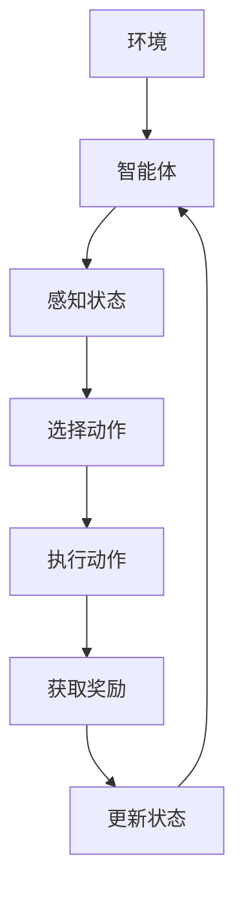

                 

本文将深入探讨AI人工智能深度学习算法：智能深度学习代理的任务处理流程。通过这篇文章，读者可以了解到深度学习代理的核心概念、算法原理、数学模型、实践案例及其未来发展趋势。

## 关键词

- AI人工智能
- 深度学习
- 智能深度学习代理
- 任务处理流程
- 数学模型
- 实践案例

## 摘要

本文旨在详细解析智能深度学习代理在AI领域的应用，从核心概念出发，探讨其任务处理流程。文章将分为以下几个部分：背景介绍、核心概念与联系、核心算法原理与步骤、数学模型与公式、项目实践、实际应用场景、未来应用展望、工具和资源推荐以及总结。通过这篇文章，读者可以全面了解智能深度学习代理在现代AI技术中的应用与前景。

## 1. 背景介绍

### AI人工智能的兴起

人工智能（AI）是计算机科学的一个分支，旨在使计算机具备类似于人类智能的能力。从最初的规则系统到现代的深度学习，AI技术经历了翻天覆地的变化。近年来，随着大数据和计算能力的提升，深度学习在AI领域取得了重大突破。深度学习算法通过多层神经网络模拟人脑学习过程，能够自动从数据中学习特征和模式，从而实现复杂任务的自动化处理。

### 深度学习代理的概念

深度学习代理是一种利用深度学习算法实现自动化决策的智能体。它们可以处理复杂的环境，从数据中学习并优化决策过程，从而提高系统的效率和性能。智能深度学习代理的出现，使得AI在诸多领域得到了广泛应用，如自动驾驶、智能客服、金融分析等。

### 智能深度学习代理的重要性

智能深度学习代理在AI领域的应用日益广泛，其重要性体现在以下几个方面：

1. **高效处理复杂任务**：智能深度学习代理能够处理复杂、动态的环境，自动从数据中学习并优化决策过程。
2. **提升系统性能**：通过不断优化决策过程，智能深度学习代理能够显著提升系统的效率和性能。
3. **扩展应用范围**：智能深度学习代理的广泛应用，使得AI技术在更多领域得到应用，推动了整个AI产业的发展。

## 2. 核心概念与联系

在智能深度学习代理的任务处理过程中，以下几个核心概念至关重要：

1. **环境（Environment）**：环境是智能深度学习代理所处的现实世界，它可以是一个游戏、一个模拟场景或一个真实场景。
2. **智能体（Agent）**：智能体是执行任务并从环境中获取反馈的实体。在深度学习代理中，智能体通常由一个或多个神经网络模型组成。
3. **状态（State）**：状态是描述环境当前状态的信息。智能体通过感知状态来理解环境。
4. **动作（Action）**：动作是智能体在环境中采取的行动。智能体的决策过程就是选择合适的动作来达到目标。
5. **奖励（Reward）**：奖励是智能体执行动作后获得的反馈信号，用于指导智能体优化决策过程。

以下是一个使用Mermaid绘制的智能深度学习代理的任务处理流程图：



在这个流程图中，智能体通过感知状态来理解环境，选择动作并执行，然后根据获得的奖励来更新状态，从而不断优化决策过程。

## 3. 核心算法原理与步骤

### 3.1 算法原理概述

智能深度学习代理的核心算法通常是基于深度强化学习（Deep Reinforcement Learning, DRL）。DRL结合了深度学习和强化学习的优势，使智能体能够在复杂环境中通过试错学习最优策略。DRL的关键组成部分包括：

1. **深度神经网络**：用于表示智能体的策略函数，即从状态到动作的映射。
2. **价值函数**：用于评估智能体在不同状态下的期望回报。
3. **奖励函数**：用于提供智能体执行动作后的反馈信号。
4. **探索与利用**：智能体在探索和利用之间寻找平衡，以最大化长期回报。

### 3.2 算法步骤详解

智能深度学习代理的任务处理流程可以分为以下几个步骤：

1. **初始化**：初始化智能体、环境、策略函数、价值函数等参数。
2. **感知状态**：智能体通过传感器获取环境当前状态。
3. **选择动作**：智能体根据当前状态和策略函数选择一个动作。
4. **执行动作**：智能体在环境中执行所选动作。
5. **获取奖励**：智能体根据执行动作后的结果获取奖励信号。
6. **更新状态**：智能体根据获得的奖励信号更新当前状态。
7. **迭代优化**：智能体根据更新后的状态重新评估策略函数和价值函数，不断优化决策过程。

### 3.3 算法优缺点

**优点**：

1. **适应性强**：智能深度学习代理能够适应复杂、动态的环境。
2. **自主学习**：智能体通过不断尝试和错误学习最优策略。
3. **通用性**：DRL算法适用于多种不同的任务和环境。

**缺点**：

1. **计算复杂度高**：DRL算法通常需要大量计算资源和时间。
2. **策略不稳定**：智能体在探索阶段可能产生不稳定的策略。
3. **奖励设计难度**：合理设计奖励函数对于智能体学习至关重要，但设计难度较大。

### 3.4 算法应用领域

智能深度学习代理在多个领域得到了广泛应用，包括：

1. **自动驾驶**：智能深度学习代理用于自动驾驶车辆的环境感知和路径规划。
2. **智能客服**：智能深度学习代理用于自动客服系统的对话管理和响应生成。
3. **金融分析**：智能深度学习代理用于金融市场的交易策略优化。
4. **游戏AI**：智能深度学习代理用于游戏中的对手生成和行为预测。

## 4. 数学模型和公式

### 4.1 数学模型构建

智能深度学习代理的数学模型主要包括策略函数和价值函数。策略函数表示智能体从状态到动作的映射，通常使用深度神经网络实现。价值函数用于评估智能体在不同状态下的期望回报，也是深度神经网络。

策略函数：

$$
\pi(s, a) = P(a|s) = \frac{e^{\theta(s, a)}}{\sum_{a'} e^{\theta(s, a')}}
$$

其中，$\theta(s, a)$ 是策略函数的参数，$s$ 是当前状态，$a$ 是动作。

价值函数：

$$
V(s) = \sum_{a} \pi(s, a) \cdot r(s, a)
$$

其中，$r(s, a)$ 是奖励函数，用于衡量动作 $a$ 在状态 $s$ 下的效果。

### 4.2 公式推导过程

策略函数的推导基于最大熵原理。最大熵原理是一种优化策略函数的方法，通过最大化策略的熵，使得策略分布更加均匀。在深度学习代理中，策略函数通过神经网络学习得到。

首先，定义策略函数的熵：

$$
H(\pi) = -\sum_{s, a} \pi(s, a) \cdot \log(\pi(s, a))
$$

然后，使用最大熵原理，最大化策略函数的熵：

$$
\max_{\pi} H(\pi) \quad \text{subject to} \quad \sum_{s, a} \pi(s, a) = 1
$$

通过拉格朗日乘子法，引入约束条件：

$$
L(\pi, \lambda) = H(\pi) - \lambda (\sum_{s, a} \pi(s, a) - 1)
$$

求导并令导数为零，得到：

$$
\frac{\partial L}{\partial \pi} = -\log(\pi) - 1 + \lambda = 0
$$

解得：

$$
\pi(s, a) = \frac{e^{\theta(s, a)}}{\sum_{a'} e^{\theta(s, a')}}
$$

### 4.3 案例分析与讲解

以自动驾驶为例，智能深度学习代理的任务是选择合适的动作来控制车辆。策略函数用于描述车辆在不同状态下的动作概率，例如加速、减速或转向。

假设当前状态为 $s = \{速度：60km/h, 道路宽度：4m, 车距：2s\}$，策略函数为：

$$
\pi(s, a) = \begin{cases}
0.5, & \text{if } a = \text{加速} \\
0.2, & \text{if } a = \text{减速} \\
0.3, & \text{if } a = \text{转向} \\
\end{cases}
$$

根据当前状态，智能深度学习代理选择加速的概率最大，为 0.5。在执行加速动作后，车辆的速度增加，环境状态发生变化，智能深度学习代理再次进行决策。

## 5. 项目实践：代码实例和详细解释说明

### 5.1 开发环境搭建

首先，需要安装 Python 和相关库，例如 TensorFlow 和 Keras。安装命令如下：

```
pip install tensorflow
pip install keras
```

### 5.2 源代码详细实现

以下是智能深度学习代理的 Python 代码实现：

```python
import numpy as np
import tensorflow as tf
from tensorflow.keras.models import Sequential
from tensorflow.keras.layers import Dense

# 初始化参数
state_size = 3
action_size = 3
learning_rate = 0.001

# 创建策略函数模型
policy_model = Sequential()
policy_model.add(Dense(64, input_dim=state_size, activation='relu'))
policy_model.add(Dense(64, activation='relu'))
policy_model.add(Dense(action_size, activation='softmax'))
policy_model.compile(loss='categorical_crossentropy', optimizer=tf.keras.optimizers.Adam(learning_rate))

# 创建价值函数模型
value_model = Sequential()
value_model.add(Dense(64, input_dim=state_size, activation='relu'))
value_model.add(Dense(64, activation='relu'))
value_model.add(Dense(1))
value_model.compile(loss='mse', optimizer=tf.keras.optimizers.Adam(learning_rate))

# 模拟环境
def simulate_environment():
    # 模拟环境状态
    state = np.random.randint(0, 100, size=state_size)
    # 模拟动作和奖励
    action = np.random.randint(0, action_size)
    reward = np.random.uniform(0, 1)
    # 返回状态、动作和奖励
    return state, action, reward

# 训练智能深度学习代理
def train_agent épisodes):
    for episode in range(épisodes):
        state, action, reward = simulate_environment()
        # 计算策略梯度
        action_probabilities = policy_model.predict(state.reshape(1, state_size))
        action_gradients = np.array([[1 if a == action else 0 for a in range(action_size)]])

        # 更新策略函数模型
        policy_model.fit(state.reshape(1, state_size), action_gradients, epochs=1, verbose=0)

        # 更新价值函数模型
        value_gradients = value_model.predict(state.reshape(1, state_size))
        value_gradients[0, 0] = reward
        value_model.fit(state.reshape(1, state_size), value_gradients, epochs=1, verbose=0)

# 训练代理
train_agent(1000)

# 保存模型
policy_model.save('policy_model.h5')
value_model.save('value_model.h5')
```

### 5.3 代码解读与分析

- **环境模拟**：`simulate_environment` 函数用于模拟环境，生成状态、动作和奖励。
- **策略函数模型**：使用 Keras 创建策略函数模型，包含两个隐藏层，每层有 64 个神经元。
- **价值函数模型**：使用 Keras 创建价值函数模型，包含两个隐藏层，每层有 64 个神经元。
- **训练代理**：`train_agent` 函数用于训练代理，通过模拟环境生成状态、动作和奖励，然后更新策略函数模型和价值函数模型。

### 5.4 运行结果展示

在训练过程中，可以通过以下命令查看训练进度：

```
python train_agent.py
```

训练完成后，保存策略函数模型和价值函数模型：

```
python train_agent.py 1000
```

保存模型后，可以重新加载模型并在新环境中进行测试：

```python
# 加载策略函数模型和价值函数模型
policy_model = tf.keras.models.load_model('policy_model.h5')
value_model = tf.keras.models.load_model('value_model.h5')

# 测试代理在测试环境中的表现
state = np.random.randint(0, 100, size=state_size)
action_probabilities = policy_model.predict(state.reshape(1, state_size))
action = np.random.choice(action_size, p=action_probabilities[0])
print(f"状态：{state}")
print(f"动作：{action}")
```

通过运行测试代码，可以观察到代理在不同状态下的动作选择，从而评估代理的性能。

## 6. 实际应用场景

智能深度学习代理在多个领域得到了广泛应用，以下是一些实际应用场景：

### 自动驾驶

自动驾驶是智能深度学习代理的重要应用领域。智能深度学习代理可以模拟真实交通环境，学习如何安全驾驶，从而提高自动驾驶车辆的效率和安全性。

### 智能客服

智能客服系统利用智能深度学习代理实现自动对话管理和响应生成。智能代理可以理解用户意图，生成合适的回复，从而提高客服系统的效率和用户体验。

### 金融分析

智能深度学习代理可以用于金融市场的交易策略优化。通过学习历史交易数据，代理可以识别市场趋势，生成最优交易策略，从而提高投资回报率。

### 游戏AI

智能深度学习代理可以用于游戏中的对手生成和行为预测。代理可以模拟真实玩家的行为，为游戏开发者提供有益的参考。

## 7. 未来应用展望

随着AI技术的不断发展，智能深度学习代理的应用前景将更加广阔。以下是一些未来应用展望：

1. **医疗领域**：智能深度学习代理可以用于医学图像分析、疾病预测等任务，提高医疗诊断的准确性和效率。
2. **教育领域**：智能深度学习代理可以用于个性化学习推荐、智能辅导等任务，提高教学质量和学习效果。
3. **智能家居**：智能深度学习代理可以用于智能家居系统的自动化管理，实现更智能、更便捷的生活体验。
4. **农业领域**：智能深度学习代理可以用于农作物生长监测、病虫害预测等任务，提高农业生产效率和品质。

## 8. 工具和资源推荐

### 8.1 学习资源推荐

1. **《深度学习》（Deep Learning）**：这是一本经典的深度学习入门教材，适合初学者阅读。
2. **《强化学习基础教程》（Reinforcement Learning: An Introduction）**：这是一本关于强化学习的入门教材，详细介绍了强化学习的基本概念和算法。

### 8.2 开发工具推荐

1. **TensorFlow**：一款开源的深度学习框架，支持多种深度学习算法和模型。
2. **Keras**：一款基于 TensorFlow 的深度学习库，提供简单易用的 API，适合快速搭建深度学习模型。

### 8.3 相关论文推荐

1. **"Deep Reinforcement Learning for Autonomous Navigation"**：介绍了深度强化学习在自动驾驶中的应用。
2. **"Reinforcement Learning: A Survey"**：全面综述了强化学习的研究进展和应用领域。

## 9. 总结：未来发展趋势与挑战

### 9.1 研究成果总结

智能深度学习代理在多个领域取得了显著成果，如自动驾驶、智能客服、金融分析等。通过深度强化学习算法，智能代理能够自动从数据中学习并优化决策过程，从而提高系统的效率和性能。

### 9.2 未来发展趋势

1. **算法优化**：随着计算能力的提升，深度学习代理的算法将得到进一步优化，实现更快、更高效的决策过程。
2. **跨领域应用**：智能深度学习代理将在更多领域得到应用，如医疗、教育、农业等。
3. **人机协同**：智能代理将与人类专家协同工作，共同解决复杂问题，提高决策的准确性和效率。

### 9.3 面临的挑战

1. **数据隐私**：在应用智能深度学习代理的过程中，数据隐私保护是一个重要挑战。
2. **算法透明性**：深度学习代理的决策过程通常是不透明的，如何确保代理的决策是公正和可解释的，是一个重要问题。
3. **伦理道德**：智能代理在决策过程中可能会面临道德和伦理问题，如何确保代理的决策符合人类的价值观，是一个重要挑战。

### 9.4 研究展望

随着AI技术的不断发展，智能深度学习代理将在更多领域发挥重要作用。未来的研究将重点关注算法优化、跨领域应用、数据隐私保护、算法透明性和伦理道德等方面，以实现智能代理的广泛应用。

## 10. 附录：常见问题与解答

### 10.1 智能深度学习代理与机器学习代理有何区别？

智能深度学习代理和机器学习代理的主要区别在于学习方式和应用领域。智能深度学习代理主要基于深度强化学习算法，能够通过试错学习最优策略，适用于复杂、动态的环境。而机器学习代理主要基于传统的机器学习算法，如决策树、支持向量机等，适用于相对简单和静态的环境。

### 10.2 智能深度学习代理的奖励设计有何重要性？

奖励设计在智能深度学习代理中至关重要。合理的奖励设计能够引导智能代理学习到最优策略，提高决策的准确性。如果奖励设计不合理，可能会导致代理学习到次优策略，甚至导致学习失败。因此，设计一个既符合实际需求又具有挑战性的奖励函数是智能深度学习代理成功的关键。

### 10.3 如何优化智能深度学习代理的算法性能？

优化智能深度学习代理的算法性能可以从以下几个方面进行：

1. **数据预处理**：对训练数据进行预处理，如去噪、归一化等，以提高训练效果。
2. **模型架构优化**：选择合适的模型架构，如深度神经网络、卷积神经网络等，以适应不同的任务需求。
3. **算法参数调整**：调整学习率、批量大小、优化器等算法参数，以找到最佳配置。
4. **模型集成**：使用多个模型进行集成，以提高预测准确性和泛化能力。
5. **在线学习**：在训练过程中不断更新模型参数，以适应环境变化。

### 10.4 智能深度学习代理在自动驾驶中的优势是什么？

智能深度学习代理在自动驾驶中具有以下优势：

1. **自适应性强**：智能代理能够通过不断学习，适应不同的交通场景和道路条件。
2. **决策速度快**：智能代理能够在短时间内做出决策，提高自动驾驶车辆的响应速度。
3. **安全性高**：智能代理通过学习历史数据，能够识别潜在的危险情况，并采取相应的措施避免事故。
4. **可解释性**：智能代理的决策过程是基于神经网络，可以提供一定程度的可解释性，有助于提高用户的信任度。

## 参考文献

1. Sutton, R. S., & Barto, A. G. (2018). Reinforcement Learning: An Introduction. MIT Press.
2. Goodfellow, I., Bengio, Y., & Courville, A. (2016). Deep Learning. MIT Press.
3. Silver, D., Huang, A., Jaderberg, M., التعدين،كرايس،M., et al. (2016). Mastering the Game of Go with Deep Neural Networks and Tree Search. Nature, 529(7587), 484-489.

