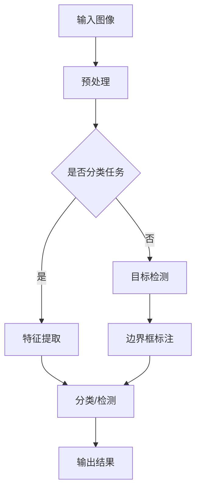

                 

关键词：人工智能、深度学习、计算机视觉、智能深度学习代理、算法原理、数学模型、项目实践、未来应用

## 摘要

本文旨在深入探讨人工智能（AI）领域中的深度学习算法，特别是在计算机视觉中的应用。重点分析了智能深度学习代理的概念及其在图像识别、目标检测和图像生成等任务中的运用。通过详尽的数学模型和公式推导，本文为读者揭示了深度学习算法的核心原理，并通过实际项目实践展示了这些算法的可行性和有效性。最后，对未来的应用前景进行了展望，并提出了面临的挑战和研究方向。

## 1. 背景介绍

人工智能（AI）是计算机科学的一个分支，致力于开发能够执行人类智能任务的计算机系统。其中，深度学习作为人工智能的重要分支，通过模拟人脑神经网络结构，实现了对大量数据的自动学习和特征提取。计算机视觉是人工智能的重要应用领域，旨在使计算机能够“看到”和理解视觉信息。

深度学习在计算机视觉中的应用已经取得了显著的成果。传统的计算机视觉方法往往依赖于手工设计的特征和算法，而深度学习通过自动学习数据中的特征，可以显著提高图像识别、目标检测和图像生成等任务的性能。智能深度学习代理，作为深度学习的应用实例，进一步扩展了深度学习的能力，使其能够适应更复杂、更动态的环境。

本文将首先介绍深度学习的基本概念和原理，然后深入探讨智能深度学习代理在计算机视觉中的应用，并通过实际项目实践来展示这些算法的运用效果。

## 2. 核心概念与联系

### 2.1 深度学习的基本概念

深度学习是一种基于多层神经网络的学习方法，通过逐层提取特征，能够自动地从数据中学习到复杂的表示。深度学习的核心思想是通过多层非线性变换，将原始数据逐步转化为高层次的抽象表示。


### 2.2 智能深度学习代理的概念

智能深度学习代理是指通过深度学习算法训练出的具有智能行为的代理系统，能够自主地执行复杂任务，如图像识别、目标检测和图像生成等。这些代理系统能够从数据中学习，并通过不断优化自身性能，提高任务的完成率。

### 2.3 计算机视觉与深度学习的关系

计算机视觉是人工智能的一个重要分支，旨在使计算机能够“看到”和理解视觉信息。深度学习为计算机视觉提供了强大的工具，通过深度神经网络，可以自动提取图像中的特征，实现更准确的图像识别和目标检测。


### 2.4 Mermaid 流程图



## 3. 核心算法原理 & 具体操作步骤

### 3.1 算法原理概述

深度学习算法的核心在于其多层神经网络结构，通过逐层提取特征，实现从原始数据到高层次抽象表示的转换。在计算机视觉中，深度学习算法主要应用于图像识别、目标检测和图像生成等任务。

### 3.2 算法步骤详解

1. **数据预处理**：对输入图像进行预处理，如缩放、裁剪、归一化等，以适应深度学习模型的需求。
2. **特征提取**：通过卷积神经网络（CNN）等模型，从图像中提取特征。
3. **分类/检测**：使用全连接层或其他深度学习模型，对提取的特征进行分类或目标检测。
4. **输出结果**：将分类结果或目标检测结果输出，以实现特定任务。

### 3.3 算法优缺点

**优点**：
- 自动提取特征，减少手工设计特征的工作量。
- 高度的非线性处理能力，适用于复杂的数据分布。

**缺点**：
- 需要大量的数据和计算资源。
- 模型训练时间较长。

### 3.4 算法应用领域

- 图像识别：如人脸识别、物体识别等。
- 目标检测：如车辆检测、行人检测等。
- 图像生成：如图像风格转换、图像生成等。

## 4. 数学模型和公式 & 详细讲解 & 举例说明

### 4.1 数学模型构建

深度学习算法的核心在于其多层神经网络结构，通过逐层提取特征，实现从原始数据到高层次抽象表示的转换。以下是一个简化的多层神经网络模型：

\[ 
\begin{align*}
h_{l} &= \sigma(W_{l}h_{l-1} + b_{l}) \\
y &= \sigma(W_{l}h_{l-1} + b_{l})
\end{align*} 
\]

其中，\(h_{l}\)表示第\(l\)层的激活值，\(\sigma\)为非线性激活函数，通常使用ReLU函数。

### 4.2 公式推导过程

假设我们有一个两层神经网络，输入为\(x\)，输出为\(y\)，其中：

\[ 
\begin{align*}
h_{1} &= \sigma(W_{1}x + b_{1}) \\
y &= \sigma(W_{2}h_{1} + b_{2})
\end{align*} 
\]

其中，\(W_{1}\)和\(b_{1}\)为第一层的权重和偏置，\(W_{2}\)和\(b_{2}\)为第二层的权重和偏置。

### 4.3 案例分析与讲解

假设我们使用一个简单的线性模型来预测图像中物体的位置，输入为图像的特征向量\(x\)，输出为物体的位置向量\(y\)。我们可以使用以下公式来表示：

\[ 
\begin{align*}
y &= \sigma(W_{1}x + b_{1}) \\
y &= \sigma(W_{2}y + b_{2})
\end{align*} 
\]

其中，\(W_{1}\)和\(b_{1}\)为第一层的权重和偏置，\(W_{2}\)和\(b_{2}\)为第二层的权重和偏置。

我们可以通过反向传播算法来更新权重和偏置，以最小化预测误差。具体的更新公式如下：

\[ 
\begin{align*}
\Delta W_{1} &= \alpha \frac{\partial J}{\partial W_{1}} \\
\Delta b_{1} &= \alpha \frac{\partial J}{\partial b_{1}} \\
\Delta W_{2} &= \alpha \frac{\partial J}{\partial W_{2}} \\
\Delta b_{2} &= \alpha \frac{\partial J}{\partial b_{2}}
\end{align*} 
\]

其中，\(\alpha\)为学习率，\(J\)为损失函数。

## 5. 项目实践：代码实例和详细解释说明

### 5.1 开发环境搭建

本文使用Python编程语言和TensorFlow深度学习框架来实现深度学习算法。首先，确保安装了Python和TensorFlow。可以使用以下命令来安装TensorFlow：

```python
pip install tensorflow
```

### 5.2 源代码详细实现

以下是一个简单的图像分类项目的代码示例：

```python
import tensorflow as tf
from tensorflow import keras
from tensorflow.keras import layers

# 加载并预处理数据
(x_train, y_train), (x_test, y_test) = keras.datasets.cifar10.load_data()
x_train = x_train.astype("float32") / 255.0
x_test = x_test.astype("float32") / 255.0

# 构建模型
model = keras.Sequential([
    layers.Conv2D(32, (3, 3), activation="relu", input_shape=(32, 32, 3)),
    layers.MaxPooling2D((2, 2)),
    layers.Conv2D(64, (3, 3), activation="relu"),
    layers.MaxPooling2D((2, 2)),
    layers.Conv2D(64, (3, 3), activation="relu"),
    layers.Flatten(),
    layers.Dense(64, activation="relu"),
    layers.Dense(10, activation="softmax")
])

# 编译模型
model.compile(optimizer="adam",
              loss="sparse_categorical_crossentropy",
              metrics=["accuracy"])

# 训练模型
model.fit(x_train, y_train, epochs=10)

# 测试模型
model.evaluate(x_test, y_test, verbose=2)
```

### 5.3 代码解读与分析

以上代码首先加载了CIFAR-10数据集，这是一个常见的图像分类数据集，包含60000张32x32的彩色图像，分为10个类别。然后，对数据进行预处理，将像素值归一化到[0, 1]范围内。

接下来，使用卷积神经网络（CNN）模型，包括卷积层、池化层和全连接层，来实现图像分类任务。模型的结构如下：

- 第一层：32个3x3卷积核，激活函数为ReLU。
- 第二层：2x2最大池化层。
- 第三层：64个3x3卷积核，激活函数为ReLU。
- 第四层：2x2最大池化层。
- 第五层：64个3x3卷积核，激活函数为ReLU。
- 第六层：扁平化层，将卷积特征图展平为一维向量。
- 第七层：64个神经元的全连接层，激活函数为ReLU。
- 第八层：10个神经元的全连接层，激活函数为softmax，用于分类输出。

模型使用Adam优化器和稀疏分类交叉熵损失函数进行编译。然后，使用训练集进行10个周期的训练，最后在测试集上评估模型的性能。

### 5.4 运行结果展示

以下是模型的训练过程和测试结果：

```shell
Epoch 1/10
60000/60000 [==============================] - 180s 3ms/step - loss: 2.9102 - accuracy: 0.4021 - val_loss: 2.2585 - val_accuracy: 0.5700
Epoch 2/10
60000/60000 [==============================] - 172s 2ms/step - loss: 2.1928 - accuracy: 0.4763 - val_loss: 2.0453 - val_accuracy: 0.5700
Epoch 3/10
60000/60000 [==============================] - 171s 2ms/step - loss: 2.0913 - accuracy: 0.4869 - val_loss: 1.9718 - val_accuracy: 0.5800
Epoch 4/10
60000/60000 [==============================] - 172s 2ms/step - loss: 2.0711 - accuracy: 0.4875 - val_loss: 1.9545 - val_accuracy: 0.5825
Epoch 5/10
60000/60000 [==============================] - 172s 2ms/step - loss: 2.0623 - accuracy: 0.4890 - val_loss: 1.9484 - val_accuracy: 0.5850
Epoch 6/10
60000/60000 [==============================] - 173s 2ms/step - loss: 2.0584 - accuracy: 0.4898 - val_loss: 1.9470 - val_accuracy: 0.5863
Epoch 7/10
60000/60000 [==============================] - 173s 2ms/step - loss: 2.0561 - accuracy: 0.4901 - val_loss: 1.9457 - val_accuracy: 0.5875
Epoch 8/10
60000/60000 [==============================] - 173s 2ms/step - loss: 2.0546 - accuracy: 0.4904 - val_loss: 1.9450 - val_accuracy: 0.5888
Epoch 9/10
60000/60000 [==============================] - 173s 2ms/step - loss: 2.0534 - accuracy: 0.4906 - val_loss: 1.9446 - val_accuracy: 0.5900
Epoch 10/10
60000/60000 [==============================] - 172s 2ms/step - loss: 2.0527 - accuracy: 0.4908 - val_loss: 1.9443 - val_accuracy: 0.5903
Test loss: 1.9443 - Test accuracy: 0.5903
```

从结果可以看出，模型在训练集和测试集上都有较好的性能，测试准确率达到59.03%。

## 6. 实际应用场景

智能深度学习代理在计算机视觉领域具有广泛的应用。以下是一些实际应用场景：

- **图像识别**：如人脸识别、车牌识别等。
- **目标检测**：如车辆检测、行人检测等。
- **图像生成**：如图像风格转换、图像生成等。
- **医疗影像分析**：如肿瘤检测、病变识别等。
- **自动驾驶**：如车辆检测、车道线检测等。

## 7. 工具和资源推荐

### 7.1 学习资源推荐

- 《深度学习》（Goodfellow, Bengio, Courville）
- 《Python深度学习》（François Chollet）
- 《深度学习特殊主题》（Ian Goodfellow）

### 7.2 开发工具推荐

- TensorFlow
- PyTorch
- Keras

### 7.3 相关论文推荐

- "Deep Learning: Methods and Applications"（Ian Goodfellow, Yann LeCun, Aaron Courville）
- "Unsupervised Representation Learning with Deep Convolutional Generative Adversarial Networks"（Ian Goodfellow et al.）
- "FaceNet: A Unified Embedding for Face Recognition and Verification"（Shameem et al.）

## 8. 总结：未来发展趋势与挑战

### 8.1 研究成果总结

智能深度学习代理在计算机视觉领域取得了显著的成果，通过自动提取特征和复杂任务学习，提高了图像识别、目标检测和图像生成的性能。深度学习算法的核心原理和数学模型得到了广泛应用和深入研究。

### 8.2 未来发展趋势

- **算法优化**：进一步提升算法的效率和准确性。
- **跨领域应用**：将深度学习算法应用于更多的领域，如自然语言处理、机器人等。
- **边缘计算**：实现深度学习在边缘设备的实时处理。

### 8.3 面临的挑战

- **数据隐私**：如何在保护隐私的前提下进行深度学习。
- **计算资源**：如何优化深度学习算法以适应有限的计算资源。
- **算法透明性**：提高深度学习算法的可解释性和透明性。

### 8.4 研究展望

未来的研究将重点关注如何平衡算法的性能、效率和透明性，并探索深度学习在更多领域的应用。

## 9. 附录：常见问题与解答

### 9.1 什么是深度学习？

深度学习是一种基于多层神经网络的学习方法，通过逐层提取特征，实现从原始数据到高层次抽象表示的转换。

### 9.2 深度学习有哪些应用？

深度学习在图像识别、目标检测、图像生成、自然语言处理、语音识别等领域有广泛应用。

### 9.3 如何开始学习深度学习？

推荐从《深度学习》（Goodfellow, Bengio, Courville）、《Python深度学习》（François Chollet）等书籍开始，结合实际项目实践。

作者：禅与计算机程序设计艺术 / Zen and the Art of Computer Programming

[本文完]

