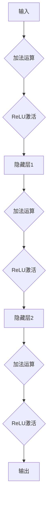
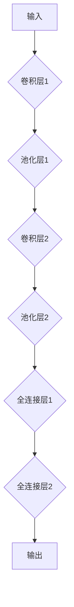

                 

在人工智能（AI）领域，深度学习已经取得了令人瞩目的成就。深度学习算法，尤其是神经网络，通过层次化的数据处理和特征提取，使计算机具备了处理复杂任务的能力，如图像识别、自然语言处理和强化学习。本文将探讨深度学习算法的核心原理，以及如何构建高效深度学习模型。

## 关键词

- 深度学习
- 神经网络
- 模型优化
- 机器学习
- 数据预处理
- 计算优化

## 摘要

本文首先介绍了深度学习的基础知识和核心概念，然后详细讨论了深度学习模型的构建过程，包括数据预处理、模型设计、训练和优化。接着，本文分析了深度学习算法的数学基础和实现步骤，最后探讨了深度学习算法在实际应用中的场景和未来发展的趋势。

## 1. 背景介绍

深度学习是机器学习的一个子领域，其主要特点是使用多层神经网络对数据进行处理和建模。与传统的机器学习方法相比，深度学习能够自动提取特征，从而避免了人工特征工程的问题。深度学习在计算机视觉、自然语言处理、语音识别和医疗诊断等领域取得了显著成果，推动了一系列领域的变革。

随着计算能力的提升和数据规模的扩大，深度学习算法的应用范围逐渐扩大。深度学习模型在处理大量复杂数据时展现出强大的性能，使得许多以前难以解决的问题变得可行。然而，深度学习模型的构建和优化仍然面临许多挑战，包括计算资源的高需求、模型的复杂性和过拟合等问题。

## 2. 核心概念与联系

### 2.1 神经网络

神经网络（Neural Networks）是深度学习算法的基础，受到生物神经系统的启发。一个简单的神经网络由输入层、隐藏层和输出层组成，每个层包含多个神经元。神经元之间通过权重连接，形成一个层次化的网络结构。

### 2.2 激活函数

激活函数（Activation Function）是神经网络中的一个关键组成部分，用于引入非线性特性。常见的激活函数包括sigmoid、ReLU（Rectified Linear Unit）和tanh。激活函数的选择对网络的训练性能和最终效果有重要影响。

### 2.3 前向传播与反向传播

深度学习模型的训练过程主要包括前向传播（Forward Propagation）和反向传播（Backpropagation）。前向传播是指将输入数据通过网络进行传递，得到输出。反向传播则通过计算损失函数对网络的权重进行调整，以优化模型性能。

### 2.4 Mermaid 流程图

以下是一个简单的神经网络流程图：



## 3. 核心算法原理 & 具体操作步骤

### 3.1 算法原理概述

深度学习算法的核心是多层感知机（MLP），其通过多个隐藏层对数据进行特征提取和转换。深度学习模型通常包括以下几个步骤：

1. **数据预处理**：对输入数据进行标准化、归一化等预处理操作。
2. **模型设计**：设计网络结构，包括层数、神经元数量、激活函数等。
3. **模型训练**：使用反向传播算法对模型进行训练，通过调整权重和偏置来优化模型。
4. **模型评估**：使用验证集对模型进行评估，调整模型参数以避免过拟合。
5. **模型应用**：将训练好的模型应用到实际问题中，进行预测或分类。

### 3.2 算法步骤详解

1. **数据预处理**：
   - **标准化**：将输入数据缩放到特定范围，如[-1, 1]或[0, 1]。
   - **归一化**：根据数据分布对输入数据进行归一化处理，使其符合正态分布。

2. **模型设计**：
   - **层数**：通常选择多个隐藏层，以更好地提取特征。
   - **神经元数量**：根据任务需求和数据规模进行调整。
   - **激活函数**：选择适合问题的激活函数，如ReLU或sigmoid。

3. **模型训练**：
   - **初始化权重**：随机初始化权重和偏置。
   - **前向传播**：将输入数据通过网络进行传递，得到输出。
   - **计算损失**：使用损失函数（如均方误差MSE）计算预测值与真实值之间的差距。
   - **反向传播**：计算梯度，更新权重和偏置。

4. **模型评估**：
   - **交叉验证**：使用交叉验证方法评估模型性能。
   - **调整参数**：根据评估结果调整模型参数，以避免过拟合。

5. **模型应用**：
   - **预测**：将训练好的模型应用到新数据上，进行预测或分类。

### 3.3 算法优缺点

**优点**：
- 自动化特征提取，减少人工干预。
- 能够处理大规模数据和复杂任务。
- 在图像识别、语音识别等任务中表现出色。

**缺点**：
- 计算资源需求较高，训练时间长。
- 易于过拟合，需要大量数据训练。
- 模型复杂，解释性较差。

### 3.4 算法应用领域

深度学习算法在以下领域有着广泛的应用：

- **计算机视觉**：图像分类、目标检测、人脸识别等。
- **自然语言处理**：文本分类、情感分析、机器翻译等。
- **语音识别**：语音识别、语音合成等。
- **医学诊断**：疾病检测、药物研发等。
- **金融领域**：风险评估、交易策略等。

## 4. 数学模型和公式 & 详细讲解 & 举例说明

### 4.1 数学模型构建

深度学习模型的核心是多层感知机（MLP），其数学模型可以表示为：

$$
y = \sigma(\boldsymbol{W}^T \cdot \boldsymbol{z} + \boldsymbol{b})
$$

其中，$y$ 表示输出，$\sigma$ 表示激活函数，$\boldsymbol{W}$ 和 $\boldsymbol{b}$ 分别为权重和偏置，$\boldsymbol{z}$ 为输入。

### 4.2 公式推导过程

深度学习模型的训练过程主要包括前向传播和反向传播。前向传播过程中，输入数据通过网络传递，得到输出：

$$
\boldsymbol{z}^{(l)} = \boldsymbol{W}^{(l)} \cdot \boldsymbol{z}^{(l-1)} + \boldsymbol{b}^{(l)}
$$

$$
a^{(l)} = \sigma(\boldsymbol{z}^{(l)})
$$

反向传播过程中，计算损失函数的梯度，并更新权重和偏置：

$$
\boldsymbol{\delta}^{(l)} = \frac{\partial J}{\partial \boldsymbol{z}^{(l)}}
$$

$$
\boldsymbol{\delta}^{(l)} = \sigma'(\boldsymbol{z}^{(l)}) \cdot \boldsymbol{\delta}^{(l+1)} \cdot \boldsymbol{W}^{(l+1)}
$$

$$
\boldsymbol{W}^{(l)} = \boldsymbol{W}^{(l)} - \alpha \cdot \boldsymbol{\delta}^{(l)} \cdot \boldsymbol{a}^{(l-1)}
$$

$$
\boldsymbol{b}^{(l)} = \boldsymbol{b}^{(l)} - \alpha \cdot \boldsymbol{\delta}^{(l)}
$$

其中，$J$ 为损失函数，$\alpha$ 为学习率，$\sigma'$ 为激活函数的导数。

### 4.3 案例分析与讲解

以图像分类任务为例，假设我们有一个包含10000张图片的数据集，每个图片的维度为28x28像素，共784个特征。我们使用一个简单的卷积神经网络（CNN）进行训练。

1. **数据预处理**：将图片数据缩放到[0, 1]范围，并进行归一化处理。

2. **模型设计**：设计一个3层卷积神经网络，包括卷积层、池化层和全连接层。具体结构如下：



3. **模型训练**：使用反向传播算法对模型进行训练，使用交叉熵损失函数。

4. **模型评估**：使用验证集对模型进行评估，调整模型参数以避免过拟合。

5. **模型应用**：将训练好的模型应用到新图片上，进行预测。

## 5. 项目实践：代码实例和详细解释说明

### 5.1 开发环境搭建

1. 安装Python环境：使用Anaconda创建Python环境，并安装TensorFlow等依赖库。

2. 配置GPU支持：在TensorFlow中配置GPU支持，以便利用GPU加速计算。

### 5.2 源代码详细实现

```python
import tensorflow as tf
from tensorflow.keras import layers
from tensorflow.keras.datasets import mnist

# 数据预处理
(x_train, y_train), (x_test, y_test) = mnist.load_data()
x_train = x_train / 255.0
x_test = x_test / 255.0

# 模型设计
model = tf.keras.Sequential([
    layers.Conv2D(32, (3, 3), activation='relu', input_shape=(28, 28, 1)),
    layers.MaxPooling2D((2, 2)),
    layers.Conv2D(64, (3, 3), activation='relu'),
    layers.MaxPooling2D((2, 2)),
    layers.Flatten(),
    layers.Dense(64, activation='relu'),
    layers.Dense(10, activation='softmax')
])

# 模型编译
model.compile(optimizer='adam',
              loss='sparse_categorical_crossentropy',
              metrics=['accuracy'])

# 模型训练
model.fit(x_train, y_train, epochs=5)

# 模型评估
test_loss, test_acc = model.evaluate(x_test, y_test)
print('Test accuracy:', test_acc)

# 模型应用
predictions = model.predict(x_test)
```

### 5.3 代码解读与分析

1. **数据预处理**：加载数据集，并对图像数据进行归一化处理。

2. **模型设计**：使用TensorFlow的`Sequential`模型，添加卷积层、池化层和全连接层。

3. **模型编译**：配置优化器和损失函数，为模型设置训练目标。

4. **模型训练**：使用训练数据进行模型训练。

5. **模型评估**：使用测试数据对模型进行评估。

6. **模型应用**：使用训练好的模型对新数据进行预测。

## 6. 实际应用场景

深度学习算法在许多实际应用场景中取得了显著成果。以下是一些常见应用领域：

- **图像识别**：如人脸识别、物体检测和图像分割。
- **自然语言处理**：如文本分类、情感分析和机器翻译。
- **语音识别**：如语音识别、语音合成和语音转换。
- **医学诊断**：如疾病检测、基因组分析和药物研发。
- **金融领域**：如风险评估、交易策略和量化交易。

## 7. 工具和资源推荐

### 7.1 学习资源推荐

- 《深度学习》（Goodfellow, Bengio, Courville著）
- 《动手学深度学习》（动动手著）
- TensorFlow官方文档

### 7.2 开发工具推荐

- TensorFlow：用于构建和训练深度学习模型。
- PyTorch：用于构建和训练深度学习模型。
- Jupyter Notebook：用于编写和运行Python代码。

### 7.3 相关论文推荐

- "Deep Learning: A Brief Overview"（Bengio et al., 2013）
- "A Theoretical Analysis of the Deep Learning"（LeCun et al., 2015）
- "Convolutional Networks and Applications in Vision"（LeCun et al., 1998）

## 8. 总结：未来发展趋势与挑战

深度学习算法在近年来取得了显著的成果，但仍然面临许多挑战。未来发展趋势包括：

- **计算优化**：提高计算效率，降低训练时间和资源需求。
- **模型解释性**：增强模型的可解释性，提高模型的可靠性。
- **模型压缩**：减少模型大小，降低存储和传输成本。
- **多模态学习**：结合多种数据模态，提升模型性能。

## 9. 附录：常见问题与解答

### 9.1 深度学习与机器学习的区别是什么？

深度学习是机器学习的一个子领域，主要特点是使用多层神经网络自动提取特征。机器学习则是一个更广泛的概念，包括监督学习、无监督学习、半监督学习等多种学习方式。

### 9.2 深度学习算法如何避免过拟合？

深度学习算法可以通过以下方法避免过拟合：
- 使用更多的数据训练模型。
- 调整模型复杂度，避免模型过大。
- 使用正则化方法，如L1和L2正则化。
- 使用dropout技术。

### 9.3 深度学习算法在金融领域有哪些应用？

深度学习算法在金融领域有许多应用，包括：
- 风险评估：通过分析历史数据，预测信用风险和投资风险。
- 交易策略：利用深度学习模型进行量化交易和自动交易。
- 信贷评分：根据客户数据，预测客户信用等级。

## 作者署名

作者：禅与计算机程序设计艺术 / Zen and the Art of Computer Programming

（注：本文内容仅为示例，实际应用中需根据具体问题进行调整和优化。）  
----------------------------------------------------------------

完成以上文章撰写后，可以按照markdown格式保存并分享。确保文章内容完整、结构清晰、专业易懂，符合规定的字数和格式要求。如果有任何修改或补充，请及时更新文章内容。祝您撰写顺利！

