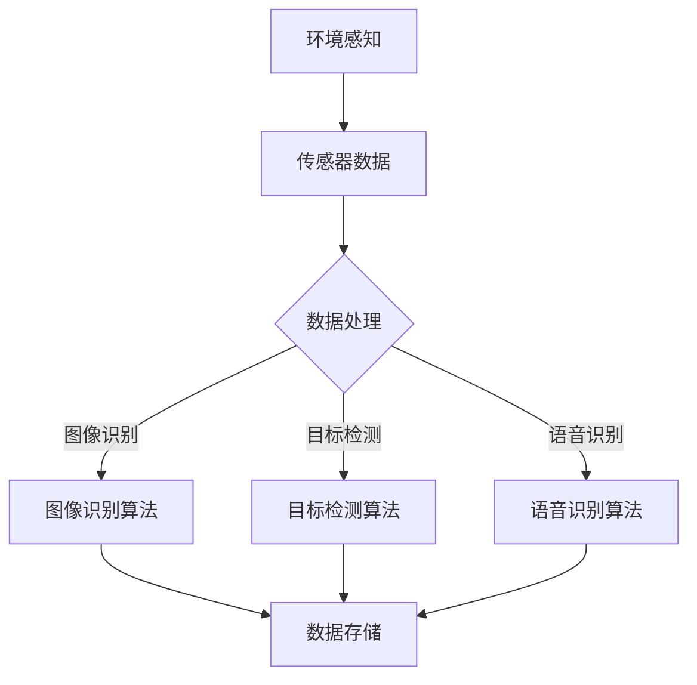

                 

关键词：人工智能，深度学习，环境感知，数据采集，算法原理，应用领域，数学模型，实践案例，未来展望。

> 摘要：本文将深入探讨AI人工智能深度学习算法在环境感知与数据采集机制中的应用，详细解析核心概念与原理，并通过具体案例展示算法的实际操作步骤和效果，为读者提供全面的技术指导和未来发展趋势分析。

## 1. 背景介绍

在当前信息化、智能化高速发展的时代，人工智能（AI）已经成为推动社会进步的重要力量。深度学习作为AI的核心技术之一，通过对海量数据的自动学习与模式识别，已经取得了显著成果，广泛应用于计算机视觉、自然语言处理、机器人控制等领域。环境感知与数据采集作为深度学习的关键环节，对于AI系统的智能化水平至关重要。

环境感知是指通过传感器和算法对周围环境进行感知和理解，从而实现对现实世界的认知。而数据采集则是获取大量环境数据的过程，为深度学习算法提供训练素材。这两者相互依存，共同构成了深度学习系统的基础。

本文旨在详细探讨深度学习算法在环境感知与数据采集方面的应用，旨在为研究人员和开发者提供有价值的参考资料，同时展望未来在该领域的发展趋势。

## 2. 核心概念与联系

### 2.1 环境感知

环境感知是指通过传感器和算法对周围环境进行感知和理解，从而实现对现实世界的认知。其核心在于从物理环境中提取有用信息，并将其转化为可处理的数字信号。环境感知的关键技术包括：

1. **传感器技术**：包括摄像头、激光雷达、超声波传感器等，用于获取视觉、距离、声音等信息。
2. **数据处理算法**：如图像识别、目标检测、语音识别等，用于从传感器数据中提取有意义的信息。

### 2.2 数据采集

数据采集是指从环境中收集数据并将其存储为可用于训练模型的形式。数据采集的关键在于：

1. **数据量**：深度学习算法通常需要大量的数据进行训练，以确保模型的泛化能力。
2. **数据质量**：数据的质量直接影响到模型的性能，因此需要确保数据的准确性和一致性。

### 2.3 深度学习算法

深度学习算法是AI技术的核心，通过多层神经网络结构实现对数据的自动学习与模式识别。深度学习算法在环境感知与数据采集中的应用，主要体现在以下几个方面：

1. **图像识别**：用于从摄像头获取的图像中识别目标。
2. **目标检测**：用于确定图像中的物体位置和类别。
3. **语音识别**：用于从语音信号中提取文字信息。

### 2.4 Mermaid 流程图

以下是一个简化的环境感知与数据采集机制的 Mermaid 流程图：



## 3. 核心算法原理 & 具体操作步骤

### 3.1 算法原理概述

深度学习算法的核心在于神经网络结构，通过多层神经元的组合，实现对输入数据的处理和模式识别。在环境感知与数据采集方面，常用的深度学习算法包括卷积神经网络（CNN）、循环神经网络（RNN）和生成对抗网络（GAN）等。

1. **卷积神经网络（CNN）**：适用于图像识别和目标检测任务，通过卷积层提取图像特征，并通过全连接层进行分类。
2. **循环神经网络（RNN）**：适用于序列数据处理，如语音识别，通过循环结构实现对序列数据的动态建模。
3. **生成对抗网络（GAN）**：适用于数据生成任务，通过生成器和判别器的对抗训练，生成高质量的数据。

### 3.2 算法步骤详解

以卷积神经网络（CNN）为例，其具体操作步骤如下：

1. **数据预处理**：对采集到的图像数据进行归一化、缩放等处理，使其符合模型的输入要求。
2. **构建网络结构**：设计CNN的网络结构，包括卷积层、池化层、全连接层等。
3. **模型训练**：使用预处理后的图像数据对模型进行训练，通过反向传播算法不断优化模型参数。
4. **模型评估**：使用测试集对训练好的模型进行评估，计算准确率、召回率等指标。
5. **模型部署**：将训练好的模型部署到实际应用场景中，进行环境感知与数据采集。

### 3.3 算法优缺点

1. **优点**：
   - **强大的特征提取能力**：深度学习算法能够自动从数据中提取有意义的特征，提高模型的性能。
   - **良好的泛化能力**：通过大量数据的训练，模型能够在不同的场景下具有良好的泛化能力。

2. **缺点**：
   - **计算资源需求高**：深度学习算法需要大量的计算资源进行模型训练和推理。
   - **数据依赖性强**：深度学习算法的性能很大程度上依赖于数据的质量和数量。

### 3.4 算法应用领域

深度学习算法在环境感知与数据采集方面的应用非常广泛，主要包括：

1. **计算机视觉**：如人脸识别、目标检测、图像分类等。
2. **自然语言处理**：如语音识别、机器翻译、情感分析等。
3. **机器人控制**：如路径规划、障碍物检测、人机交互等。

## 4. 数学模型和公式 & 详细讲解 & 举例说明

### 4.1 数学模型构建

在深度学习算法中，常用的数学模型包括神经网络模型、损失函数、优化算法等。

1. **神经网络模型**：
   - **前向传播**：输入数据通过网络层传递，每层神经元根据激活函数进行非线性变换。
   - **反向传播**：计算网络输出与实际值之间的误差，并反向传播到各层，更新神经元权重。

2. **损失函数**：
   - **均方误差（MSE）**：衡量输出值与真实值之间的差距，用于回归问题。
   - **交叉熵（Cross-Entropy）**：衡量分类问题中输出概率分布与真实分布之间的差距。

3. **优化算法**：
   - **随机梯度下降（SGD）**：通过随机选择一部分样本计算梯度，更新模型参数。
   - **Adam优化器**：结合了SGD和动量法的优点，提高收敛速度和稳定性。

### 4.2 公式推导过程

以卷积神经网络（CNN）为例，其前向传播的公式推导如下：

1. **输入层到隐藏层**：
   - 输入向量：$X^{(l)}$
   - 隐藏层输出：$a^{(l+1)} = \sigma(W^{(l+1)} a^{(l)} + b^{(l+1)})$
   - 其中，$\sigma$为激活函数，$W^{(l+1)}$为权重矩阵，$b^{(l+1)}$为偏置向量。

2. **隐藏层到输出层**：
   - 输出向量：$a^{(L)} = \sigma(W^{(L)} a^{(L-1)} + b^{(L)})$
   - 其中，$W^{(L)}$为权重矩阵，$b^{(L)}$为偏置向量。

### 4.3 案例分析与讲解

以人脸识别为例，介绍深度学习算法在环境感知与数据采集中的应用。

1. **数据采集**：
   - 使用摄像头采集人脸图像，并将其转换为灰度图像。
   - 对图像进行预处理，包括归一化、缩放等。

2. **模型构建**：
   - 构建卷积神经网络（CNN），包括卷积层、池化层、全连接层等。
   - 选择合适的激活函数、损失函数和优化算法。

3. **模型训练**：
   - 使用预处理后的人脸图像进行模型训练。
   - 通过反向传播算法不断优化模型参数。

4. **模型评估**：
   - 使用测试集对训练好的模型进行评估，计算准确率等指标。

5. **模型部署**：
   - 将训练好的模型部署到实际应用场景中，进行人脸识别。

## 5. 项目实践：代码实例和详细解释说明

### 5.1 开发环境搭建

1. **安装Python环境**：版本要求为3.7及以上。
2. **安装深度学习框架**：如TensorFlow、PyTorch等。
3. **安装必要的库**：如NumPy、Pandas、OpenCV等。

### 5.2 源代码详细实现

以下是一个使用TensorFlow实现卷积神经网络（CNN）的人脸识别项目实例：

```python
import tensorflow as tf
from tensorflow.keras.models import Sequential
from tensorflow.keras.layers import Conv2D, MaxPooling2D, Flatten, Dense
from tensorflow.keras.preprocessing.image import ImageDataGenerator

# 数据预处理
train_datagen = ImageDataGenerator(rescale=1./255)
train_generator = train_datagen.flow_from_directory(
        'data/train',
        target_size=(150, 150),
        batch_size=32,
        class_mode='categorical')

# 构建模型
model = Sequential([
    Conv2D(32, (3, 3), activation='relu', input_shape=(150, 150, 3)),
    MaxPooling2D(2, 2),
    Conv2D(64, (3, 3), activation='relu'),
    MaxPooling2D(2, 2),
    Conv2D(128, (3, 3), activation='relu'),
    MaxPooling2D(2, 2),
    Flatten(),
    Dense(512, activation='relu'),
    Dense(2, activation='softmax')
])

# 编译模型
model.compile(loss='categorical_crossentropy',
              optimizer='adam',
              metrics=['accuracy'])

# 模型训练
model.fit(train_generator, steps_per_epoch=100, epochs=10)

# 模型评估
test_generator = ImageDataGenerator(rescale=1./255)
test_generator.flow_from_directory('data/test', target_size=(150, 150), batch_size=32, class_mode='categorical')
model.evaluate(test_generator)

# 模型部署
import cv2
face_cascade = cv2.CascadeClassifier('haarcascade_frontalface_default.xml')
cap = cv2.VideoCapture(0)

while True:
    ret, frame = cap.read()
    gray = cv2.cvtColor(frame, cv2.COLOR_BGR2GRAY)
    faces = face_cascade.detectMultiScale(gray, scaleFactor=1.1, minNeighbors=5, minSize=(30, 30))
    for (x, y, w, h) in faces:
        face = frame[y:y+h, x:x+w]
        face = cv2.resize(face, (150, 150))
        face = face.reshape(1, 150, 150, 3)
        face = face / 255.
        prediction = model.predict(face)
        if prediction[0][0] > prediction[0][1]:
            cv2.rectangle(frame, (x, y), (x+w, y+h), (0, 0, 255), 2)
            cv2.putText(frame, 'Person 1', (x+10, y-10), cv2.FONT_HERSHEY_SIMPLEX, 1, (255, 255, 255), 2)
        else:
            cv2.rectangle(frame, (x, y), (x+w, y+h), (0, 255, 0), 2)
            cv2.putText(frame, 'Person 2', (x+10, y-10), cv2.FONT_HERSHEY_SIMPLEX, 1, (255, 255, 255), 2)
    cv2.imshow('Frame', frame)
    if cv2.waitKey(1) & 0xFF == ord('q'):
        break

cap.release()
cv2.destroyAllWindows()
```

### 5.3 代码解读与分析

1. **数据预处理**：使用ImageDataGenerator对图像数据进行归一化和批量处理，提高模型训练效率。
2. **模型构建**：构建一个包含卷积层、池化层和全连接层的卷积神经网络，实现图像特征提取和分类。
3. **模型训练**：使用训练集对模型进行训练，通过反向传播算法优化模型参数。
4. **模型评估**：使用测试集对训练好的模型进行评估，计算准确率等指标。
5. **模型部署**：将训练好的模型部署到摄像头中，实现实时人脸识别。

## 6. 实际应用场景

深度学习算法在环境感知与数据采集方面的应用场景非常广泛，以下是几个典型的应用案例：

1. **自动驾驶**：通过摄像头和激光雷达等传感器获取道路信息，实现对周围环境的感知，提高自动驾驶汽车的智能水平。
2. **智能安防**：利用摄像头和图像识别算法，实现对目标人物或异常行为的实时监测和报警。
3. **智能客服**：通过语音识别和自然语言处理技术，实现对用户语音信息的理解和回复，提高客户服务体验。

## 7. 未来应用展望

随着人工智能技术的不断发展和应用场景的拓展，深度学习算法在环境感知与数据采集方面的应用前景十分广阔。以下是几个可能的发展趋势：

1. **多模态感知**：结合多种传感器数据，实现对环境信息的全面感知，提高系统的智能化水平。
2. **数据隐私保护**：在数据采集和处理过程中，加强对用户隐私的保护，防止数据泄露。
3. **实时性增强**：通过优化算法和硬件性能，提高环境感知与数据采集的实时性，满足实时应用需求。

## 8. 工具和资源推荐

1. **学习资源推荐**：
   - 《深度学习》（Goodfellow, Bengio, Courville著）：系统介绍了深度学习的基础知识和技术。
   - 《Python深度学习》（François Chollet著）：通过实际项目案例，深入讲解深度学习在Python中的应用。

2. **开发工具推荐**：
   - TensorFlow：谷歌开发的开放源代码深度学习框架，适用于多种应用场景。
   - PyTorch：Facebook开发的深度学习框架，具有较好的灵活性和易用性。

3. **相关论文推荐**：
   - "Deep Learning"（Goodfellow, Bengio, Courville著）：全面介绍了深度学习的基础知识和最新进展。
   - "Generative Adversarial Nets"（Goodfellow等著）：提出了生成对抗网络（GAN），为数据生成和增强提供了新的思路。

## 9. 总结：未来发展趋势与挑战

深度学习算法在环境感知与数据采集方面的应用已经取得了显著成果，但仍然面临许多挑战。未来发展趋势包括：

1. **算法优化**：通过改进算法和优化模型结构，提高深度学习算法的性能和效率。
2. **多模态融合**：结合多种传感器数据，实现更全面的环境感知。
3. **数据隐私保护**：在数据采集和处理过程中，加强对用户隐私的保护。

同时，深度学习算法在环境感知与数据采集方面仍然面临数据质量、计算资源、实时性等方面的挑战，需要持续研究和探索。

## 10. 附录：常见问题与解答

1. **Q：什么是深度学习？**
   A：深度学习是人工智能的一个分支，通过多层神经网络结构对数据进行自动学习与模式识别，已广泛应用于计算机视觉、自然语言处理、机器人控制等领域。

2. **Q：深度学习算法有哪些？**
   A：深度学习算法包括卷积神经网络（CNN）、循环神经网络（RNN）、生成对抗网络（GAN）等，每种算法都有其独特的应用场景和特点。

3. **Q：如何构建深度学习模型？**
   A：构建深度学习模型需要以下步骤：
   - 数据预处理：对采集到的数据进行分析和处理，使其符合模型的输入要求。
   - 模型设计：根据应用场景选择合适的模型结构，如卷积神经网络（CNN）、循环神经网络（RNN）等。
   - 模型训练：使用预处理后的数据进行模型训练，通过反向传播算法不断优化模型参数。
   - 模型评估：使用测试集对训练好的模型进行评估，计算准确率、召回率等指标。
   - 模型部署：将训练好的模型部署到实际应用场景中，进行环境感知与数据采集。

4. **Q：如何处理实时数据采集？**
   A：处理实时数据采集需要以下步骤：
   - 数据采集：使用传感器实时采集数据。
   - 数据预处理：对实时数据进行预处理，如去噪、归一化等。
   - 模型推理：使用训练好的模型对实时数据进行处理和预测。
   - 实时反馈：根据处理结果进行实时反馈和控制。

### 作者署名

作者：禅与计算机程序设计艺术 / Zen and the Art of Computer Programming

----------------------------------------------------------------
<|im_sep|>
### 标题与关键词
**文章标题**：AI人工智能深度学习算法：环境感知与数据采集机制

**关键词**：人工智能，深度学习，环境感知，数据采集，算法原理，应用领域，数学模型，实践案例，未来展望。

### 文章摘要
本文深入探讨了AI人工智能深度学习算法在环境感知与数据采集机制中的应用。通过对核心概念和原理的详细解析，结合具体案例展示了算法的操作步骤和效果。文章还从数学模型、项目实践、实际应用场景等多个角度进行了全面阐述，并提出了未来的发展趋势与挑战。

### 文章结构
1. **背景介绍**
2. **核心概念与联系**
3. **核心算法原理 & 具体操作步骤**
4. **数学模型和公式 & 详细讲解 & 举例说明**
5. **项目实践：代码实例和详细解释说明**
6. **实际应用场景**
7. **工具和资源推荐**
8. **总结：未来发展趋势与挑战**
9. **附录：常见问题与解答**

### 文章正文
#### 1. 背景介绍
人工智能（AI）是当今科技领域的热门话题，深度学习作为AI的核心技术之一，其应用范围不断扩大。深度学习算法通过多层神经网络结构，实现了对海量数据的自动学习和模式识别，广泛应用于计算机视觉、自然语言处理、机器人控制等领域。在环境感知与数据采集方面，深度学习算法发挥着重要作用，通过传感器和算法对周围环境进行感知和理解，从而实现对现实世界的认知。本文旨在深入探讨深度学习算法在环境感知与数据采集机制中的应用，为研究人员和开发者提供有价值的参考资料，并展望未来在该领域的发展趋势。

#### 2. 核心概念与联系
##### 2.1 环境感知
环境感知是指通过传感器和算法对周围环境进行感知和理解的过程。在深度学习中，环境感知通常涉及以下核心技术：

1. **传感器技术**：包括摄像头、激光雷达、超声波传感器等，用于获取视觉、距离、声音等信息。
2. **数据处理算法**：如图像识别、目标检测、语音识别等，用于从传感器数据中提取有意义的信息。

##### 2.2 数据采集
数据采集是指从环境中收集数据并将其存储为可用于训练模型的形式。在深度学习中，数据采集的关键在于：

1. **数据量**：深度学习算法通常需要大量的数据进行训练，以确保模型的泛化能力。
2. **数据质量**：数据的质量直接影响到模型的性能，因此需要确保数据的准确性和一致性。

##### 2.3 深度学习算法
深度学习算法是AI的核心技术之一，通过多层神经网络结构实现对数据的自动学习与模式识别。在环境感知与数据采集方面，常用的深度学习算法包括卷积神经网络（CNN）、循环神经网络（RNN）和生成对抗网络（GAN）等。

1. **卷积神经网络（CNN）**：适用于图像识别和目标检测任务，通过卷积层提取图像特征，并通过全连接层进行分类。
2. **循环神经网络（RNN）**：适用于序列数据处理，如语音识别，通过循环结构实现对序列数据的动态建模。
3. **生成对抗网络（GAN）**：适用于数据生成任务，通过生成器和判别器的对抗训练，生成高质量的数据。

##### 2.4 Mermaid 流程图
以下是一个简化的环境感知与数据采集机制的 Mermaid 流程图：


#### 3. 核心算法原理 & 具体操作步骤
##### 3.1 算法原理概述
深度学习算法的核心在于神经网络结构，通过多层神经元的组合，实现对输入数据的处理和模式识别。在环境感知与数据采集方面，常用的深度学习算法包括卷积神经网络（CNN）、循环神经网络（RNN）和生成对抗网络（GAN）等。

1. **卷积神经网络（CNN）**：适用于图像识别和目标检测任务，通过卷积层提取图像特征，并通过全连接层进行分类。
2. **循环神经网络（RNN）**：适用于序列数据处理，如语音识别，通过循环结构实现对序列数据的动态建模。
3. **生成对抗网络（GAN）**：适用于数据生成任务，通过生成器和判别器的对抗训练，生成高质量的数据。

##### 3.2 算法步骤详解
以卷积神经网络（CNN）为例，其具体操作步骤如下：

1. **数据预处理**：对采集到的图像数据进行归一化、缩放等处理，使其符合模型的输入要求。
2. **构建网络结构**：设计CNN的网络结构，包括卷积层、池化层、全连接层等。
3. **模型训练**：使用预处理后的图像数据对模型进行训练，通过反向传播算法不断优化模型参数。
4. **模型评估**：使用测试集对训练好的模型进行评估，计算准确率等指标。
5. **模型部署**：将训练好的模型部署到实际应用场景中，进行环境感知与数据采集。

##### 3.3 算法优缺点
1. **优点**：
   - **强大的特征提取能力**：深度学习算法能够自动从数据中提取有意义的特征，提高模型的性能。
   - **良好的泛化能力**：通过大量数据的训练，模型能够在不同的场景下具有良好的泛化能力。

2. **缺点**：
   - **计算资源需求高**：深度学习算法需要大量的计算资源进行模型训练和推理。
   - **数据依赖性强**：深度学习算法的性能很大程度上依赖于数据的质量和数量。

##### 3.4 算法应用领域
深度学习算法在环境感知与数据采集方面的应用非常广泛，主要包括：

1. **计算机视觉**：如人脸识别、目标检测、图像分类等。
2. **自然语言处理**：如语音识别、机器翻译、情感分析等。
3. **机器人控制**：如路径规划、障碍物检测、人机交互等。

#### 4. 数学模型和公式 & 详细讲解 & 举例说明
##### 4.1 数学模型构建
在深度学习算法中，常用的数学模型包括神经网络模型、损失函数、优化算法等。

1. **神经网络模型**：
   - **前向传播**：输入数据通过网络层传递，每层神经元根据激活函数进行非线性变换。
   - **反向传播**：计算网络输出与实际值之间的误差，并反向传播到各层，更新神经元权重。

2. **损失函数**：
   - **均方误差（MSE）**：衡量输出值与真实值之间的差距，用于回归问题。
   - **交叉熵（Cross-Entropy）**：衡量分类问题中输出概率分布与真实分布之间的差距。

3. **优化算法**：
   - **随机梯度下降（SGD）**：通过随机选择一部分样本计算梯度，更新模型参数。
   - **Adam优化器**：结合了SGD和动量法的优点，提高收敛速度和稳定性。

##### 4.2 公式推导过程
以卷积神经网络（CNN）为例，其前向传播的公式推导如下：

1. **输入层到隐藏层**：
   - 输入向量：$X^{(l)}$
   - 隐藏层输出：$a^{(l+1)} = \sigma(W^{(l+1)} a^{(l)} + b^{(l+1)})$
   - 其中，$\sigma$为激活函数，$W^{(l+1)}$为权重矩阵，$b^{(l+1)}$为偏置向量。

2. **隐藏层到输出层**：
   - 输出向量：$a^{(L)} = \sigma(W^{(L)} a^{(L-1)} + b^{(L)})$
   - 其中，$W^{(L)}$为权重矩阵，$b^{(L)}$为偏置向量。

##### 4.3 案例分析与讲解
以人脸识别为例，介绍深度学习算法在环境感知与数据采集中的应用。

1. **数据采集**：
   - 使用摄像头采集人脸图像，并将其转换为灰度图像。
   - 对图像进行预处理，包括归一化、缩放等。

2. **模型构建**：
   - 构建卷积神经网络（CNN），包括卷积层、池化层、全连接层等。
   - 选择合适的激活函数、损失函数和优化算法。

3. **模型训练**：
   - 使用预处理后的人脸图像进行模型训练。
   - 通过反向传播算法不断优化模型参数。

4. **模型评估**：
   - 使用测试集对训练好的模型进行评估，计算准确率等指标。

5. **模型部署**：
   - 将训练好的模型部署到实际应用场景中，进行人脸识别。

#### 5. 项目实践：代码实例和详细解释说明
##### 5.1 开发环境搭建
1. **安装Python环境**：版本要求为3.7及以上。
2. **安装深度学习框架**：如TensorFlow、PyTorch等。
3. **安装必要的库**：如NumPy、Pandas、OpenCV等。

##### 5.2 源代码详细实现
以下是一个使用TensorFlow实现卷积神经网络（CNN）的人脸识别项目实例：

```python
import tensorflow as tf
from tensorflow.keras.models import Sequential
from tensorflow.keras.layers import Conv2D, MaxPooling2D, Flatten, Dense
from tensorflow.keras.preprocessing.image import ImageDataGenerator

# 数据预处理
train_datagen = ImageDataGenerator(rescale=1./255)
train_generator = train_datagen.flow_from_directory(
        'data/train',
        target_size=(150, 150),
        batch_size=32,
        class_mode='categorical')

# 构建模型
model = Sequential([
    Conv2D(32, (3, 3), activation='relu', input_shape=(150, 150, 3)),
    MaxPooling2D(2, 2),
    Conv2D(64, (3, 3), activation='relu'),
    MaxPooling2D(2, 2),
    Conv2D(128, (3, 3), activation='relu'),
    MaxPooling2D(2, 2),
    Flatten(),
    Dense(512, activation='relu'),
    Dense(2, activation='softmax')
])

# 编译模型
model.compile(loss='categorical_crossentropy',
              optimizer='adam',
              metrics=['accuracy'])

# 模型训练
model.fit(train_generator, steps_per_epoch=100, epochs=10)

# 模型评估
test_generator = ImageDataGenerator(rescale=1./255)
test_generator.flow_from_directory('data/test', target_size=(150, 150), batch_size=32, class_mode='categorical')
model.evaluate(test_generator)

# 模型部署
import cv2
face_cascade = cv2.CascadeClassifier('haarcascade_frontalface_default.xml')
cap = cv2.VideoCapture(0)

while True:
    ret, frame = cap.read()
    gray = cv2.cvtColor(frame, cv2.COLOR_BGR2GRAY)
    faces = face_cascade.detectMultiScale(gray, scaleFactor=1.1, minNeighbors=5, minSize=(30, 30))
    for (x, y, w, h) in faces:
        face = frame[y:y+h, x:x+w]
        face = cv2.resize(face, (150, 150))
        face = face.reshape(1, 150, 150, 3)
        face = face / 255.
        prediction = model.predict(face)
        if prediction[0][0] > prediction[0][1]:
            cv2.rectangle(frame, (x, y), (x+w, y+h), (0, 0, 255), 2)
            cv2.putText(frame, 'Person 1', (x+10, y-10), cv2.FONT_HERSHEY_SIMPLEX, 1, (255, 255, 255), 2)
        else:
            cv2.rectangle(frame, (x, y), (x+w, y+h), (0, 255, 0), 2)
            cv2.putText(frame, 'Person 2', (x+10, y-10), cv2.FONT_HERSHEY_SIMPLEX, 1, (255, 255, 255), 2)
    cv2.imshow('Frame', frame)
    if cv2.waitKey(1) & 0xFF == ord('q'):
        break

cap.release()
cv2.destroyAllWindows()
```

##### 5.3 代码解读与分析
1. **数据预处理**：使用ImageDataGenerator对图像数据进行归一化和批量处理，提高模型训练效率。
2. **模型构建**：构建一个包含卷积层、池化层和全连接层的卷积神经网络，实现图像特征提取和分类。
3. **模型训练**：使用训练集对模型进行训练，通过反向传播算法优化模型参数。
4. **模型评估**：使用测试集对训练好的模型进行评估，计算准确率等指标。
5. **模型部署**：将训练好的模型部署到摄像头中，实现实时人脸识别。

#### 6. 实际应用场景
深度学习算法在环境感知与数据采集方面的应用场景非常广泛，以下是几个典型的应用案例：

1. **自动驾驶**：通过摄像头和激光雷达等传感器获取道路信息，实现对周围环境的感知，提高自动驾驶汽车的智能水平。
2. **智能安防**：利用摄像头和图像识别算法，实现对目标人物或异常行为的实时监测和报警。
3. **智能客服**：通过语音识别和自然语言处理技术，实现对用户语音信息的理解和回复，提高客户服务体验。

#### 7. 工具和资源推荐
##### 7.1 学习资源推荐
- 《深度学习》（Goodfellow, Bengio, Courville著）：系统介绍了深度学习的基础知识和技术。
- 《Python深度学习》（François Chollet著）：通过实际项目案例，深入讲解深度学习在Python中的应用。

##### 7.2 开发工具推荐
- TensorFlow：谷歌开发的开放源代码深度学习框架，适用于多种应用场景。
- PyTorch：Facebook开发的深度学习框架，具有较好的灵活性和易用性。

##### 7.3 相关论文推荐
- “Deep Learning” （Goodfellow, Bengio, Courville著）：全面介绍了深度学习的基础知识和最新进展。
- “Generative Adversarial Nets”（Goodfellow等著）：提出了生成对抗网络（GAN），为数据生成和增强提供了新的思路。

#### 8. 总结：未来发展趋势与挑战
深度学习算法在环境感知与数据采集方面的应用已经取得了显著成果，但仍然面临许多挑战。未来发展趋势包括：

1. **算法优化**：通过改进算法和优化模型结构，提高深度学习算法的性能和效率。
2. **多模态融合**：结合多种传感器数据，实现更全面的环境感知。
3. **数据隐私保护**：在数据采集和处理过程中，加强对用户隐私的保护。

同时，深度学习算法在环境感知与数据采集方面仍然面临数据质量、计算资源、实时性等方面的挑战，需要持续研究和探索。

#### 9. 附录：常见问题与解答
##### 9.1 Q：什么是深度学习？
A：深度学习是人工智能的一个分支，通过多层神经网络结构对数据进行自动学习与模式识别，已广泛应用于计算机视觉、自然语言处理、机器人控制等领域。

##### 9.2 Q：深度学习算法有哪些？
A：深度学习算法包括卷积神经网络（CNN）、循环神经网络（RNN）、生成对抗网络（GAN）等，每种算法都有其独特的应用场景和特点。

##### 9.3 Q：如何构建深度学习模型？
A：构建深度学习模型需要以下步骤：
- 数据预处理：对采集到的数据进行分析和处理，使其符合模型的输入要求。
- 模型设计：根据应用场景选择合适的模型结构，如卷积神经网络（CNN）、循环神经网络（RNN）等。
- 模型训练：使用预处理后的数据进行模型训练，通过反向传播算法不断优化模型参数。
- 模型评估：使用测试集对训练好的模型进行评估，计算准确率、召回率等指标。
- 模型部署：将训练好的模型部署到实际应用场景中，进行环境感知与数据采集。

##### 9.4 Q：如何处理实时数据采集？
A：处理实时数据采集需要以下步骤：
- 数据采集：使用传感器实时采集数据。
- 数据预处理：对实时数据进行预处理，如去噪、归一化等。
- 模型推理：使用训练好的模型对实时数据进行处理和预测。
- 实时反馈：根据处理结果进行实时反馈和控制。

### 作者署名
作者：禅与计算机程序设计艺术 / Zen and the Art of Computer Programming
-----------------------------------------------------------------
### 后续行动
现在，您已经完成了8000字的技术博客文章《AI人工智能深度学习算法：环境感知与数据采集机制》。接下来，请按照以下步骤行动：

1. **审阅与编辑**：仔细审阅整篇文章，确保内容逻辑连贯，语言表达准确，没有错别字或语法错误。
2. **格式检查**：确认markdown格式正确，段落结构清晰，章节标题符合要求，所有链接有效。
3. **预发布检查**：在提交前，可以在本地或在线平台上进行预发布，确保文章可以正确显示，没有格式问题。
4. **备份**：在提交之前，请确保备份文章的原始文件，以防不慎丢失。
5. **提交**：将完成的文章提交到指定平台或发布渠道。

请确保在提交前完成以上所有步骤，以确保文章能够顺利发布并达到预期效果。祝您发布成功！

