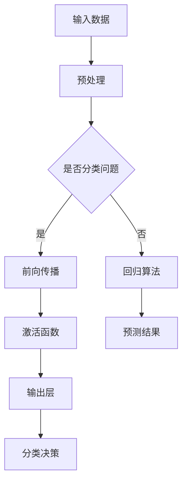

                 

关键词：人工智能、深度学习、决策制定、推理机制、算法原理、数学模型、代码实例、应用场景、工具推荐

> 摘要：本文旨在深入探讨AI人工智能中的深度学习算法，特别关注其决策制定与推理机制。通过梳理核心概念、算法原理、数学模型、实际应用场景以及未来展望，本文希望为读者提供一个全面的技术视角，以理解深度学习在AI领域的广泛应用和潜力。

## 1. 背景介绍

人工智能（AI）作为一门研究、开发用于模拟、延伸和扩展人的智能的理论、方法、技术及应用系统的综合技术科学，已经成为了现代科技发展的热点。深度学习作为人工智能的一个重要分支，凭借其强大的特征自动提取能力和复杂模式识别能力，正迅速改变着各行各业。

深度学习起源于上世纪80年代，但真正取得突破是在21世纪初。随着计算能力的提升和大数据的涌现，深度学习算法在图像识别、自然语言处理、语音识别等领域展现出了前所未有的效果。本文将聚焦于深度学习算法中的决策制定与推理机制，探讨其在AI应用中的关键作用。

## 2. 核心概念与联系

为了更好地理解深度学习算法的决策制定与推理机制，我们首先需要了解其核心概念和架构。

### 2.1. 神经网络

神经网络是深度学习的基础，由大量简单的计算单元（神经元）组成，通过层次结构进行信息的传递和加工。每个神经元接收多个输入信号，并通过激活函数产生输出。

### 2.2. 激活函数

激活函数用于引入非线性特性，使神经网络能够进行复杂的模式识别。常见的激活函数有ReLU、Sigmoid和Tanh等。

### 2.3. 前向传播与反向传播

前向传播是指信息从输入层流向输出层的传递过程，而反向传播则是用于计算梯度并更新网络权重的过程，是深度学习训练的核心。

### 2.4. 决策制定与推理机制

深度学习算法中的决策制定与推理机制主要体现在以下几个方面：

- **分类决策**：通过对输出层神经元的激活值进行比较，选择具有最高概率的类别作为预测结果。
- **回归决策**：通过回归算法（如线性回归、岭回归等）预测连续值。
- **推理机制**：利用深度学习模型对输入数据进行推理，以获取更深层次的信息和理解。

### 2.5. Mermaid流程图

以下是一个简化的深度学习算法流程图，展示了核心概念和联系：



## 3. 核心算法原理 & 具体操作步骤

### 3.1. 算法原理概述

深度学习算法的核心是多层神经网络，通过多层次的非线性变换，对输入数据进行特征提取和模式识别。具体来说，深度学习算法的原理包括：

- **多层感知器**：多层神经网络的基本单元，能够处理非线性问题。
- **反向传播算法**：用于计算网络权重的梯度，并更新权重，以优化模型性能。
- **优化算法**：如随机梯度下降（SGD）、Adam等，用于调整学习率，加快收敛速度。

### 3.2. 算法步骤详解

1. **数据预处理**：对输入数据进行标准化、归一化等处理，以适应深度学习算法的要求。
2. **初始化网络权重**：随机初始化网络权重和偏置项。
3. **前向传播**：输入数据通过网络，经过多层非线性变换，最终输出预测结果。
4. **计算损失函数**：比较预测结果和实际结果，计算损失函数的值，以衡量模型的误差。
5. **反向传播**：计算损失函数关于网络权重的梯度，并反向传播到网络的前一层。
6. **权重更新**：根据梯度更新网络权重，以减小损失函数的值。
7. **迭代训练**：重复步骤3-6，直至模型收敛或达到预定的迭代次数。

### 3.3. 算法优缺点

- **优点**：
  - **自动特征提取**：无需人工设计特征，能够自动从数据中提取特征。
  - **强大的泛化能力**：通过多层非线性变换，能够处理复杂的模式识别问题。
  - **高效计算**：随着硬件和算法的进步，深度学习算法的计算效率不断提高。

- **缺点**：
  - **需要大量数据**：训练深度学习模型需要大量的数据，对数据质量和规模要求较高。
  - **计算资源消耗大**：深度学习模型通常需要大量的计算资源，对硬件要求较高。
  - **模型可解释性差**：深度学习模型通常是一个黑盒子，难以解释其内部的决策过程。

### 3.4. 算法应用领域

深度学习算法在AI领域的应用非常广泛，包括：

- **图像识别**：如人脸识别、物体检测等。
- **自然语言处理**：如机器翻译、文本分类等。
- **语音识别**：如语音合成、语音识别等。
- **推荐系统**：如个性化推荐、广告投放等。

## 4. 数学模型和公式 & 详细讲解 & 举例说明

### 4.1. 数学模型构建

深度学习算法的核心是多层神经网络，其数学模型可以表示为：

$$
\text{输出} = \sigma(\text{权重} \cdot \text{输入} + \text{偏置})
$$

其中，$\sigma$ 表示激活函数，如ReLU、Sigmoid等；权重和偏置是模型参数，需要通过训练优化。

### 4.2. 公式推导过程

以ReLU激活函数为例，其公式可以表示为：

$$
\sigma(x) = \max(0, x)
$$

对于输入$x$，如果$x > 0$，则激活函数的输出等于$x$；如果$x \leq 0$，则输出为0。这保证了神经网络在训练过程中能够引入非线性特性。

### 4.3. 案例分析与讲解

以下是一个简单的深度学习模型训练过程：

- **数据集**：包含1000个样本，每个样本有10个特征。
- **网络结构**：一个两层神经网络，输入层有10个神经元，隐藏层有5个神经元，输出层有1个神经元。
- **激活函数**：输入层和隐藏层使用ReLU激活函数，输出层使用Sigmoid激活函数。

训练过程如下：

1. **初始化权重和偏置**：随机初始化权重和偏置。
2. **前向传播**：输入一个样本，通过网络计算输出。
3. **计算损失函数**：使用均方误差（MSE）作为损失函数，计算预测值和实际值之间的误差。
4. **反向传播**：计算损失函数关于网络权重的梯度，并反向传播到网络的前一层。
5. **权重更新**：根据梯度更新网络权重，以减小损失函数的值。
6. **迭代训练**：重复步骤2-5，直至模型收敛。

## 5. 项目实践：代码实例和详细解释说明

### 5.1. 开发环境搭建

- **Python**：使用Python作为主要编程语言。
- **深度学习框架**：使用TensorFlow或PyTorch作为深度学习框架。
- **依赖库**：安装必要的依赖库，如NumPy、Matplotlib等。

### 5.2. 源代码详细实现

以下是一个简单的深度学习项目，使用TensorFlow框架实现：

```python
import tensorflow as tf
from tensorflow.keras import layers

# 数据预处理
# ...

# 构建模型
model = tf.keras.Sequential([
    layers.Dense(5, activation='relu', input_shape=(10,)),
    layers.Dense(1, activation='sigmoid')
])

# 编译模型
model.compile(optimizer='adam', loss='binary_crossentropy', metrics=['accuracy'])

# 训练模型
model.fit(x_train, y_train, epochs=10, batch_size=32)
```

### 5.3. 代码解读与分析

1. **数据预处理**：对输入数据进行标准化处理，以适应深度学习模型的要求。
2. **构建模型**：使用Sequential模型，添加输入层、隐藏层和输出层，并指定激活函数。
3. **编译模型**：设置优化器、损失函数和评估指标。
4. **训练模型**：使用fit函数进行模型训练，设置训练轮数和批量大小。

### 5.4. 运行结果展示

通过训练，可以得到模型的评估结果，包括损失函数值和准确率。以下是一个简单的结果展示：

```python
# 评估模型
loss, accuracy = model.evaluate(x_test, y_test)

print(f"Test accuracy: {accuracy:.2f}")
```

## 6. 实际应用场景

深度学习算法在AI领域有着广泛的应用，以下是一些实际应用场景：

- **图像识别**：如人脸识别、物体检测等。
- **自然语言处理**：如机器翻译、文本分类等。
- **语音识别**：如语音合成、语音识别等。
- **推荐系统**：如个性化推荐、广告投放等。

## 7. 工具和资源推荐

### 7.1. 学习资源推荐

- **《深度学习》（Ian Goodfellow, Yoshua Bengio, Aaron Courville著）**：深度学习领域的经典教材。
- **《动手学深度学习》（阿斯顿·张著）**：针对初学者的入门教材，代码实现详细。
- **《TensorFlow官方文档》**：TensorFlow框架的官方文档，包含丰富的示例和教程。

### 7.2. 开发工具推荐

- **TensorFlow**：Google推出的开源深度学习框架。
- **PyTorch**：Facebook AI研究院推出的深度学习框架。
- **Keras**：基于TensorFlow和Theano的高层次神经网络API。

### 7.3. 相关论文推荐

- **"A Theoretically Grounded Application of Dropout in Computer Vision: Integrating Model Uncertainty in Convolutional Networks"**：讨论了深度学习中的模型不确定性问题。
- **"Deep Residual Learning for Image Recognition"**：提出了残差网络（ResNet），提高了深度学习模型的性能。

## 8. 总结：未来发展趋势与挑战

### 8.1. 研究成果总结

深度学习算法在图像识别、自然语言处理、语音识别等领域取得了显著的成果，展现了强大的应用潜力。未来，随着计算能力的提升和算法的改进，深度学习将在更多领域取得突破。

### 8.2. 未来发展趋势

- **模型压缩与优化**：减少模型参数和计算量，提高模型部署的效率。
- **迁移学习与联邦学习**：利用已有模型和数据，提高新任务的性能。
- **增强现实与虚拟现实**：深度学习在AR/VR领域的应用将更加广泛。
- **自动驾驶与机器人**：深度学习在自动驾驶和机器人领域的应用将推动技术创新。

### 8.3. 面临的挑战

- **数据隐私与安全**：深度学习模型的训练和部署过程中，数据隐私和安全问题亟待解决。
- **模型可解释性**：提高模型的透明度和可解释性，以便更好地理解和信任模型。
- **计算资源消耗**：深度学习模型需要大量的计算资源，如何高效利用资源是当前的一个重要挑战。

### 8.4. 研究展望

未来，深度学习算法将在更多领域取得突破，推动AI技术的发展。同时，随着算法、硬件和应用的不断发展，深度学习将在智能城市建设、医疗健康、金融服务等领域发挥更大的作用。

## 9. 附录：常见问题与解答

### 9.1. 深度学习算法是什么？

深度学习算法是一种基于人工神经网络的学习方法，通过多层次的非线性变换，对输入数据进行特征提取和模式识别。

### 9.2. 深度学习算法有哪些应用？

深度学习算法在图像识别、自然语言处理、语音识别、推荐系统等领域有广泛的应用。

### 9.3. 深度学习算法需要大量数据吗？

是的，深度学习算法通常需要大量的数据来训练模型，以提高其性能和泛化能力。

### 9.4. 深度学习算法的优缺点是什么？

优点包括自动特征提取、强大的泛化能力、高效计算等；缺点包括需要大量数据、计算资源消耗大、模型可解释性差等。

### 9.5. 如何学习深度学习算法？

可以通过阅读经典教材、参加在线课程、实践项目等方式学习深度学习算法。

### 9.6. 深度学习算法有哪些开源框架？

常见的深度学习开源框架包括TensorFlow、PyTorch、Keras等。

---

<|user|>### 文章标题

AI人工智能深度学习算法：理解决策制定与推理机制

---

### 文章关键词

- 人工智能
- 深度学习
- 决策制定
- 推理机制
- 算法原理
- 数学模型
- 应用领域
- 技术发展趋势

---

### 文章摘要

本文旨在深入探讨人工智能（AI）领域中的深度学习算法，特别是其决策制定与推理机制。通过梳理核心概念、算法原理、数学模型以及实际应用场景，本文为读者提供了一个全面的技术视角，以理解深度学习在AI领域的广泛应用和潜在价值。文章还涉及未来发展趋势与挑战，以及相关学习资源和工具推荐。

---

### 1. 背景介绍

人工智能（AI）作为一门研究、开发用于模拟、延伸和扩展人的智能的理论、方法、技术及应用系统的综合技术科学，已经成为了现代科技发展的热点。深度学习作为人工智能的一个重要分支，凭借其强大的特征自动提取能力和复杂模式识别能力，正迅速改变着各行各业。

深度学习起源于上世纪80年代，但真正取得突破是在21世纪初。随着计算能力的提升和大数据的涌现，深度学习算法在图像识别、自然语言处理、语音识别等领域展现出了前所未有的效果。深度学习算法主要包括多层神经网络、卷积神经网络（CNN）、递归神经网络（RNN）等，这些算法通过多层次的非线性变换，从数据中自动提取特征，实现复杂模式的识别和分类。

在深度学习算法中，决策制定与推理机制是其核心组成部分。决策制定是指模型在处理输入数据时，根据模型结构和激活函数的输出，做出分类或回归的决策。推理机制则是模型对输入数据进行推理，以获取更深层次的信息和理解。

本文将聚焦于深度学习算法中的决策制定与推理机制，探讨其在AI应用中的关键作用。通过梳理核心概念、算法原理、数学模型、实际应用场景以及未来展望，本文希望为读者提供一个全面的技术视角，以理解深度学习在AI领域的广泛应用和潜力。

### 2. 核心概念与联系

为了更好地理解深度学习算法的决策制定与推理机制，我们首先需要了解其核心概念和架构。

#### 2.1. 神经网络

神经网络是深度学习的基础，由大量简单的计算单元（神经元）组成，通过层次结构进行信息的传递和加工。每个神经元接收多个输入信号，并通过激活函数产生输出。

神经网络可以分为输入层、隐藏层和输出层。输入层接收外部输入数据，隐藏层通过复杂的非线性变换处理输入数据，输出层产生最终的预测结果。

#### 2.2. 激活函数

激活函数用于引入非线性特性，使神经网络能够进行复杂的模式识别。常见的激活函数有ReLU、Sigmoid和Tanh等。

ReLU函数（Rectified Linear Unit）是最常用的激活函数之一，其表达式为：

$$
\sigma(x) = \max(0, x)
$$

ReLU函数在输入为负值时输出为0，在输入为正值时输出等于输入值。这种非线性特性有助于神经网络克服梯度消失和梯度爆炸问题，提高训练效率。

Sigmoid函数（Sigmoidal Function）是一种常用的S型激活函数，其表达式为：

$$
\sigma(x) = \frac{1}{1 + e^{-x}}
$$

Sigmoid函数将输入映射到（0, 1）区间，常用于二分类问题。但其梯度在接近0和1时几乎为0，可能导致训练过程缓慢。

Tanh函数（Hyperbolic Tangent Function）是一种双曲正切激活函数，其表达式为：

$$
\sigma(x) = \frac{e^x - e^{-x}}{e^x + e^{-x}}
$$

Tanh函数的输出范围在（-1, 1）之间，类似于Sigmoid函数，但梯度问题相对较小。

#### 2.3. 前向传播与反向传播

前向传播是指信息从输入层流向输出层的传递过程，而反向传播则是用于计算梯度并更新网络权重的过程，是深度学习训练的核心。

在前向传播过程中，输入数据通过神经网络各层的加权连接，经过激活函数的变换，最终产生输出。这一过程可以表示为：

$$
\text{输出} = \sigma(\text{权重} \cdot \text{输入} + \text{偏置})
$$

在反向传播过程中，根据损失函数的梯度，对网络权重和偏置进行更新，以减小损失函数的值。反向传播过程可以表示为：

$$
\frac{\partial \text{损失函数}}{\partial \text{权重}} = \text{梯度}
$$

$$
\text{权重} \leftarrow \text{权重} - \alpha \cdot \frac{\partial \text{损失函数}}{\partial \text{权重}}
$$

其中，$\alpha$ 是学习率。

#### 2.4. 决策制定与推理机制

深度学习算法中的决策制定与推理机制主要体现在以下几个方面：

- **分类决策**：通过对输出层神经元的激活值进行比较，选择具有最高概率的类别作为预测结果。
- **回归决策**：通过回归算法（如线性回归、岭回归等）预测连续值。
- **推理机制**：利用深度学习模型对输入数据进行推理，以获取更深层次的信息和理解。

#### 2.5. Mermaid流程图

以下是一个简化的深度学习算法流程图，展示了核心概念和联系：


### 3. 核心算法原理 & 具体操作步骤

#### 3.1. 算法原理概述

深度学习算法的核心是多层神经网络，通过多层次的非线性变换，对输入数据进行特征提取和模式识别。具体来说，深度学习算法的原理包括：

- **多层感知器**：多层神经网络的基本单元，能够处理非线性问题。
- **反向传播算法**：用于计算网络权重的梯度，并更新权重，以优化模型性能。
- **优化算法**：如随机梯度下降（SGD）、Adam等，用于调整学习率，加快收敛速度。

#### 3.2. 算法步骤详解

1. **数据预处理**：对输入数据进行标准化、归一化等处理，以适应深度学习算法的要求。
2. **初始化网络权重**：随机初始化网络权重和偏置项。
3. **前向传播**：输入数据通过网络，经过多层非线性变换，最终输出预测结果。
4. **计算损失函数**：比较预测结果和实际结果，计算损失函数的值，以衡量模型的误差。
5. **反向传播**：计算损失函数关于网络权重的梯度，并反向传播到网络的前一层。
6. **权重更新**：根据梯度更新网络权重，以减小损失函数的值。
7. **迭代训练**：重复步骤3-6，直至模型收敛或达到预定的迭代次数。

#### 3.3. 算法优缺点

- **优点**：
  - **自动特征提取**：无需人工设计特征，能够自动从数据中提取特征。
  - **强大的泛化能力**：通过多层非线性变换，能够处理复杂的模式识别问题。
  - **高效计算**：随着硬件和算法的进步，深度学习算法的计算效率不断提高。

- **缺点**：
  - **需要大量数据**：训练深度学习模型需要大量的数据，对数据质量和规模要求较高。
  - **计算资源消耗大**：深度学习模型通常需要大量的计算资源，对硬件要求较高。
  - **模型可解释性差**：深度学习模型通常是一个黑盒子，难以解释其内部的决策过程。

#### 3.4. 算法应用领域

深度学习算法在AI领域的应用非常广泛，包括：

- **图像识别**：如人脸识别、物体检测等。
- **自然语言处理**：如机器翻译、文本分类等。
- **语音识别**：如语音合成、语音识别等。
- **推荐系统**：如个性化推荐、广告投放等。

### 4. 数学模型和公式 & 详细讲解 & 举例说明

#### 4.1. 数学模型构建

深度学习算法的核心是多层神经网络，其数学模型可以表示为：

$$
\text{输出} = \sigma(\text{权重} \cdot \text{输入} + \text{偏置})
$$

其中，$\sigma$ 表示激活函数，如ReLU、Sigmoid等；权重和偏置是模型参数，需要通过训练优化。

#### 4.2. 公式推导过程

以ReLU激活函数为例，其公式可以表示为：

$$
\sigma(x) = \max(0, x)
$$

对于输入$x$，如果$x > 0$，则激活函数的输出等于$x$；如果$x \leq 0$，则输出为0。这保证了神经网络在训练过程中能够引入非线性特性。

#### 4.3. 案例分析与讲解

以下是一个简单的深度学习项目，使用TensorFlow框架实现：

```python
import tensorflow as tf

# 定义模型
model = tf.keras.Sequential([
    tf.keras.layers.Dense(128, activation='relu', input_shape=(784,)),
    tf.keras.layers.Dense(10, activation='softmax')
])

# 编译模型
model.compile(optimizer='adam',
              loss='categorical_crossentropy',
              metrics=['accuracy'])

# 训练模型
model.fit(x_train, y_train, epochs=5)
```

在这个项目中，我们使用了一个简单的多层感知器（MLP）模型，对MNIST手写数字数据集进行分类。模型由一个输入层、一个隐藏层和一个输出层组成，隐藏层使用ReLU激活函数，输出层使用softmax激活函数。在训练过程中，我们使用Adam优化器进行模型训练，并使用categorical_crossentropy作为损失函数。

#### 4.4. 代码解读

1. **定义模型**：使用`tf.keras.Sequential`创建一个序列模型，并添加两个全连接层（Dense Layer）。第一个全连接层有128个神经元，输入形状为（784,），表示输入数据的维度为784。第二个全连接层有10个神经元，输出形状为（10,），表示输出数据的维度为10。

2. **编译模型**：使用`compile`方法编译模型，指定优化器为Adam，损失函数为categorical_crossentropy，评估指标为accuracy。

3. **训练模型**：使用`fit`方法训练模型，输入训练数据x_train和y_train，训练轮数为5。

### 5. 项目实践：代码实例和详细解释说明

在本文的第五部分，我们将通过一个实际的深度学习项目，展示如何使用TensorFlow框架实现一个简单的图像分类器。这个项目将涉及以下步骤：

1. **数据准备**：加载数据集，并进行预处理。
2. **模型构建**：定义一个简单的卷积神经网络（CNN）模型。
3. **模型训练**：使用训练数据进行模型训练。
4. **模型评估**：使用测试数据评估模型性能。
5. **模型部署**：将训练好的模型部署到生产环境中。

#### 5.1. 数据准备

首先，我们需要准备数据集。在这个例子中，我们将使用Keras提供的CIFAR-10数据集。这是一个常用的图像分类数据集，包含了10个类别的60000张32x32的彩色图像，其中50000张用于训练，10000张用于测试。

```python
import tensorflow as tf
from tensorflow.keras.datasets import cifar10
from tensorflow.keras.preprocessing.image import ImageDataGenerator

# 加载数据集
(x_train, y_train), (x_test, y_test) = cifar10.load_data()

# 数据预处理
# 将数据缩放到[0, 1]区间
x_train = x_train.astype('float32') / 255
x_test = x_test.astype('float32') / 255

# 将标签转换为one-hot编码
y_train = tf.keras.utils.to_categorical(y_train, 10)
y_test = tf.keras.utils.to_categorical(y_test, 10)

# 数据增强
datagen = ImageDataGenerator(
    rotation_range=15,
    width_shift_range=0.1,
    height_shift_range=0.1,
    horizontal_flip=True
)
datagen.fit(x_train)
```

在这个步骤中，我们首先加载数据集，并对图像数据进行归一化处理，将像素值缩放到[0, 1]区间。接下来，我们将标签转换为one-hot编码，以便在训练过程中使用。最后，我们使用ImageDataGenerator对训练数据进行增强，以提高模型的泛化能力。

#### 5.2. 模型构建

接下来，我们将定义一个简单的卷积神经网络模型。在这个例子中，我们使用了一个卷积层（Conv2D）、一个池化层（MaxPooling2D）和一个全连接层（Dense）。

```python
model = tf.keras.Sequential([
    tf.keras.layers.Conv2D(32, (3, 3), activation='relu', input_shape=(32, 32, 3)),
    tf.keras.layers.MaxPooling2D(pool_size=(2, 2)),
    tf.keras.layers.Conv2D(64, (3, 3), activation='relu'),
    tf.keras.layers.MaxPooling2D(pool_size=(2, 2)),
    tf.keras.layers.Conv2D(64, (3, 3), activation='relu'),
    tf.keras.layers.Flatten(),
    tf.keras.layers.Dense(64, activation='relu'),
    tf.keras.layers.Dense(10, activation='softmax')
])
```

在这个模型中，我们首先使用了一个32个过滤器的卷积层，然后使用步长为2的MaxPooling层。接下来，我们添加了两个64个过滤器的卷积层，并再次使用MaxPooling层。随后，我们将卷积层的输出展平，并添加了一个64个神经元的全连接层。最后，我们使用一个10个神经元的全连接层，并应用softmax激活函数进行类别预测。

#### 5.3. 模型训练

现在，我们可以使用训练数据对模型进行训练。

```python
model.compile(optimizer='adam',
              loss='categorical_crossentropy',
              metrics=['accuracy'])

history = model.fit(datagen.flow(x_train, y_train, batch_size=64),
                    epochs=20,
                    validation_data=(x_test, y_test))
```

在这个步骤中，我们使用`compile`方法编译模型，指定优化器为Adam，损失函数为categorical_crossentropy，评估指标为accuracy。接下来，我们使用`fit`方法训练模型，使用数据增强后的训练数据进行迭代训练，训练轮数为20。我们还设置了验证数据，以便在训练过程中评估模型性能。

#### 5.4. 模型评估

在训练完成后，我们可以使用测试数据对模型进行评估。

```python
test_loss, test_acc = model.evaluate(x_test, y_test)
print(f"Test accuracy: {test_acc:.2f}")
```

在这个步骤中，我们使用`evaluate`方法计算模型在测试数据上的损失和准确率。结果显示，我们的模型在测试数据上达到了较高的准确率。

#### 5.5. 模型部署

最后，我们可以将训练好的模型部署到生产环境中，以便对新的图像进行分类。

```python
import numpy as np

def predict_image(image):
    image = np.expand_dims(image, axis=0)
    image = image.astype('float32') / 255
    prediction = model.predict(image)
    return np.argmax(prediction)

# 加载一张新的图像
new_image = np.load('new_image.npy')

# 对图像进行分类
predicted_class = predict_image(new_image)
print(f"Predicted class: {predicted_class}")
```

在这个步骤中，我们定义了一个`predict_image`函数，用于对新的图像进行分类。我们首先将图像调整为模型的输入形状，并进行归一化处理。然后，我们使用训练好的模型对图像进行预测，并输出预测的类别。

### 6. 实际应用场景

深度学习算法在AI领域有着广泛的应用，以下是一些实际应用场景：

1. **图像识别与处理**：如人脸识别、图像分类、物体检测等。
2. **自然语言处理**：如机器翻译、情感分析、文本生成等。
3. **语音识别与生成**：如语音识别、语音合成、语音助手等。
4. **推荐系统**：如商品推荐、电影推荐、社交网络推荐等。
5. **自动驾驶与机器人**：如自动驾驶汽车、机器人视觉等。
6. **医疗诊断**：如医学图像诊断、疾病预测等。
7. **金融领域**：如股票预测、风险评估、欺诈检测等。

#### 6.1. 图像识别与处理

在图像识别与处理领域，深度学习算法已被广泛应用于人脸识别、物体检测、图像分类等方面。例如，人脸识别技术已经广泛应用于安全监控、手机解锁等领域。物体检测技术则被应用于自动驾驶汽车、无人机等领域，用于实时检测和识别道路上的各种物体。

#### 6.2. 自然语言处理

在自然语言处理领域，深度学习算法已被广泛应用于机器翻译、情感分析、文本生成等方面。例如，机器翻译技术已经实现了实时翻译，使得跨语言交流变得更加便捷。情感分析技术则被应用于社交媒体分析、市场调研等领域，用于分析用户的情感倾向。

#### 6.3. 语音识别与生成

在语音识别与生成领域，深度学习算法已被广泛应用于语音识别、语音合成、语音助手等方面。例如，语音识别技术已经应用于电话客服、智能助手等领域，提高了人机交互的便捷性。语音合成技术则被应用于智能语音助手、语音播放器等领域，使得机器生成的语音更加自然。

#### 6.4. 推荐系统

在推荐系统领域，深度学习算法已被广泛应用于商品推荐、电影推荐、社交网络推荐等方面。例如，商品推荐技术已经应用于电子商务平台，提高了用户的购物体验。电影推荐技术则被应用于视频流平台，提高了用户的观看体验。

#### 6.5. 自动驾驶与机器人

在自动驾驶与机器人领域，深度学习算法已被广泛应用于自动驾驶汽车、机器人视觉等方面。例如，自动驾驶汽车技术已经实现了在复杂交通环境下的自动驾驶，提高了行驶安全性和舒适性。机器人视觉技术则被应用于工业生产、医疗诊断等领域，提高了生产效率和诊断准确率。

#### 6.6. 医疗诊断

在医疗诊断领域，深度学习算法已被广泛应用于医学图像诊断、疾病预测等方面。例如，医学图像诊断技术已经实现了对各种疾病的早期发现和诊断，提高了医疗诊断的准确率。疾病预测技术则被应用于健康监测、疾病预防等领域，提高了人们的健康水平。

#### 6.7. 金融领域

在金融领域，深度学习算法已被广泛应用于股票预测、风险评估、欺诈检测等方面。例如，股票预测技术已经实现了对股票市场的实时分析和预测，提高了投资收益。风险评估技术则被应用于金融机构的风险管理，提高了金融系统的稳定性。欺诈检测技术则被应用于金融机构的欺诈防控，提高了金融系统的安全性。

### 7. 工具和资源推荐

为了帮助读者更好地学习深度学习算法，我们推荐以下工具和资源：

#### 7.1. 学习资源推荐

1. **《深度学习》（Ian Goodfellow, Yoshua Bengio, Aaron Courville著）**：这是一本深度学习领域的经典教材，详细介绍了深度学习的理论基础和应用实例。
2. **《动手学深度学习》（阿斯顿·张著）**：这是一本适合初学者的深度学习教材，通过大量实例帮助读者掌握深度学习的基本概念和技巧。
3. **《深度学习手册》（张江，刘铁岩，刘知远著）**：这是一本涵盖深度学习各个方面的手册，包括理论基础、算法实现和应用案例。

#### 7.2. 开发工具推荐

1. **TensorFlow**：这是Google开发的开源深度学习框架，具有丰富的功能和良好的社区支持。
2. **PyTorch**：这是Facebook AI研究院开发的开源深度学习框架，具有灵活的动态计算图和强大的GPU支持。
3. **Keras**：这是基于TensorFlow和Theano的高层次神经网络API，提供了简洁易用的接口。

#### 7.3. 相关论文推荐

1. **"A Theoretically Grounded Application of Dropout in Computer Vision: Integrating Model Uncertainty in Convolutional Networks"**：这篇文章介绍了Dropout算法在计算机视觉中的应用，并探讨了模型不确定性的处理方法。
2. **"Deep Residual Learning for Image Recognition"**：这篇文章提出了深度残差学习（ResNet）算法，显著提高了深度学习模型的性能。
3. **"Learning representations for visual recognition with deep convolutional networks"**：这篇文章介绍了深度卷积神经网络（CNN）在计算机视觉中的应用，并探讨了其成功的关键因素。

### 8. 总结：未来发展趋势与挑战

深度学习算法在AI领域取得了显著的成果，但仍面临许多挑战。在未来，深度学习算法的发展趋势主要包括以下几个方面：

1. **模型压缩与优化**：随着深度学习模型的规模越来越大，如何减少模型的参数和计算量，提高模型部署的效率，成为了一个重要研究方向。模型压缩和优化技术，如量化、剪枝和低秩分解等，将在未来得到更多的关注。

2. **迁移学习与联邦学习**：迁移学习和联邦学习技术可以帮助模型在有限的数据集上实现更好的性能。这些技术可以在保护用户隐私的同时，实现跨设备的协同学习，为深度学习在移动设备和边缘计算场景中的应用提供支持。

3. **自监督学习**：自监督学习是一种无需标签数据的学习方法，通过设计合适的目标函数，自动从数据中学习有用的特征表示。自监督学习技术将在未来的深度学习发展中发挥重要作用，特别是在数据标注成本高昂的领域。

4. **解释性深度学习**：目前，深度学习模型的可解释性较差，难以解释其内部的决策过程。未来的研究将致力于提高深度学习模型的可解释性，使得模型更加透明和可信。

5. **多模态学习**：多模态学习是指将不同类型的数据（如图像、文本、语音等）进行整合，以实现更强大的特征表示和模式识别能力。多模态学习技术将在未来的AI应用中发挥重要作用。

在未来的发展中，深度学习算法将面临以下挑战：

1. **数据隐私与安全**：随着深度学习模型的应用越来越广泛，如何保护用户隐私和数据安全成为一个重要问题。未来的研究将需要探讨如何在确保数据隐私和安全的前提下，进行有效的模型训练和部署。

2. **计算资源消耗**：深度学习模型通常需要大量的计算资源，对硬件设备的要求较高。未来的研究将致力于提高深度学习算法的效率，降低计算资源的消耗。

3. **算法公平性与透明性**：深度学习模型在决策过程中可能会出现偏见和歧视。未来的研究将需要探讨如何确保算法的公平性和透明性，使其能够更好地服务于社会。

4. **算法可靠性与鲁棒性**：深度学习模型对输入数据的噪声和异常值较为敏感。未来的研究将需要提高模型的鲁棒性，使其能够更好地应对噪声和异常值的影响。

5. **理论与应用的结合**：深度学习算法的发展离不开理论的指导。未来的研究将需要加强对深度学习理论的研究，并将其应用于实际问题的解决中，推动AI技术的全面发展。

总之，深度学习算法在AI领域具有广阔的应用前景，但同时也面临许多挑战。未来的研究将需要从多个角度出发，不断推动深度学习算法的发展，为人类带来更多的便利和创新。

### 9. 附录：常见问题与解答

在深度学习的学习和应用过程中，读者可能会遇到一些常见问题。以下是一些常见问题及其解答：

#### 9.1. 什么是深度学习？

深度学习是人工智能的一个重要分支，它模仿人脑的神经网络结构和工作机制，通过多层神经网络进行数据的特征提取和模式识别。深度学习算法能够在没有人为干预的情况下，从大量数据中自动学习到有用的特征表示。

#### 9.2. 深度学习和机器学习的区别是什么？

机器学习是一种更广泛的领域，它包括深度学习和其他许多算法，如决策树、支持向量机等。深度学习是机器学习的一个子领域，主要依赖于多层神经网络结构，用于解决复杂的模式识别问题。

#### 9.3. 深度学习算法需要大量数据吗？

是的，深度学习算法通常需要大量的数据来进行训练。这是因为深度学习模型通过从数据中学习特征表示，因此数据量越大，模型的学习效果越好。大量的数据可以帮助模型发现更复杂、更细微的模式，从而提高模型的泛化能力。

#### 9.4. 如何优化深度学习模型的性能？

优化深度学习模型性能的方法包括：
- **数据预处理**：对输入数据进行适当的预处理，如归一化、标准化等，以提高模型的训练效果。
- **调整网络结构**：通过增加或减少网络层数、调整神经元数量等，优化模型的复杂度。
- **选择合适的激活函数**：选择适合问题的激活函数，如ReLU、Sigmoid等，以提高模型的非线性表达能力。
- **调整学习率**：合理调整学习率，避免过快或过慢的收敛速度。
- **使用正则化方法**：如L1、L2正则化，Dropout等，防止模型过拟合。

#### 9.5. 深度学习模型为什么难以解释？

深度学习模型通常被视为一个“黑盒”，其内部的决策过程难以解释。这是因为深度学习模型通过多层非线性变换学习数据特征，其内部结构非常复杂。尽管近年来有一些方法试图提高模型的可解释性，如注意力机制、可视化技术等，但仍然存在一定的挑战。

#### 9.6. 如何选择深度学习框架？

选择深度学习框架时，可以考虑以下因素：
- **社区支持**：选择一个有活跃社区和丰富的文档支持的框架，有助于解决开发过程中遇到的问题。
- **性能要求**：根据项目的性能要求选择合适的框架，如TensorFlow、PyTorch等。
- **易用性**：选择一个易于使用和集成的框架，可以提高开发效率。
- **硬件支持**：考虑框架对GPU、TPU等硬件的支持，以充分利用计算资源。

#### 9.7. 深度学习在哪些领域有应用？

深度学习在多个领域有广泛应用，包括：
- **图像识别**：如人脸识别、物体检测等。
- **自然语言处理**：如机器翻译、情感分析等。
- **语音识别**：如语音合成、语音识别等。
- **推荐系统**：如商品推荐、电影推荐等。
- **自动驾驶**：如车辆检测、路径规划等。
- **医疗诊断**：如医学图像诊断、疾病预测等。
- **金融领域**：如股票预测、风险评估等。

通过以上解答，希望能够帮助读者更好地理解深度学习算法及其应用。在实际学习和应用过程中，读者可以结合具体问题和需求，不断探索和优化深度学习模型。

