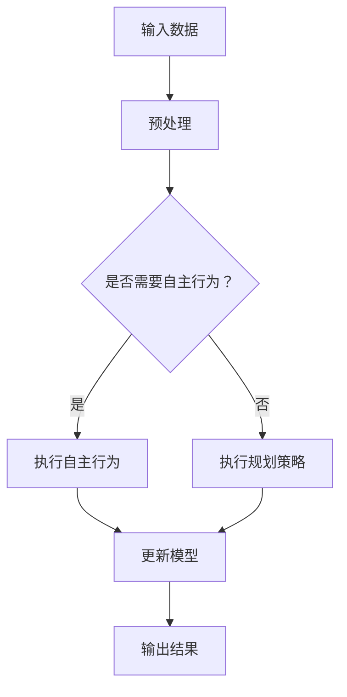

                 

人工智能（AI）已经成为现代科技领域的热点话题，而深度学习作为AI的重要分支，其在图像识别、自然语言处理、自动驾驶等领域的应用不断拓展。本文旨在探讨深度学习算法中的自主行为与规划策略，以及如何将这些策略有效地应用于深度学习中。

## 文章关键词

- 人工智能
- 深度学习
- 自主行为
- 规划策略
- 深度学习算法

## 文章摘要

本文首先介绍了深度学习的基本概念和常见算法，然后重点讨论了自主行为和规划策略在深度学习中的应用。通过详细的分析和实例，我们展示了如何利用这些策略提高深度学习模型的性能和自主性。最后，我们对深度学习的未来发展进行了展望。

## 1. 背景介绍

### 1.1 深度学习的发展历程

深度学习起源于1986年，由Geoffrey Hinton等人首次提出。经过几十年的发展，深度学习已经在计算机视觉、自然语言处理、语音识别等领域取得了显著的成果。随着计算能力的提升和大数据的普及，深度学习应用越来越广泛。

### 1.2 深度学习的应用领域

深度学习在多个领域都取得了突破性的进展，如图像识别、自动驾驶、医疗诊断、金融预测等。例如，在图像识别方面，深度学习模型已经能够实现高精度的物体检测和图像分类。

## 2. 核心概念与联系

### 2.1 自主行为

自主行为是指系统在不依赖于外部干预的情况下，能够自主地完成特定任务或决策。在深度学习中，自主行为可以帮助模型更好地适应环境变化，提高任务完成率。

### 2.2 规划策略

规划策略是指为了实现特定目标，制定的一系列行动步骤或决策。在深度学习中，规划策略可以帮助模型更好地优化性能，提高任务完成的效率。

### 2.3 Mermaid 流程图

下面是一个简化的Mermaid流程图，展示了自主行为和规划策略在深度学习中的应用：



## 3. 核心算法原理 & 具体操作步骤

### 3.1 算法原理概述

自主行为和规划策略在深度学习中的应用主要包括以下几个方面：

- **自主行为**：通过设计特定的网络结构或算法，使模型能够根据环境变化自主地调整行为。
- **规划策略**：通过训练或设计特定的算法，使模型能够提前预测未来可能发生的情况，并做出相应的决策。

### 3.2 算法步骤详解

1. **数据预处理**：对输入数据进行预处理，包括归一化、缩放、去噪等操作，以提高模型的鲁棒性和性能。
2. **模型训练**：利用训练数据对模型进行训练，包括前向传播、反向传播和参数更新等步骤。
3. **自主行为**：根据环境变化，模型可以自主地调整行为，例如，通过调整网络的权重或结构来适应不同的任务。
4. **规划策略**：根据任务需求，模型可以提前预测未来可能发生的情况，并做出相应的决策，例如，通过预测道路情况来规划自动驾驶车辆的行驶路径。
5. **模型评估**：利用测试数据对模型进行评估，包括准确率、召回率、F1值等指标。

### 3.3 算法优缺点

**优点**：

- 提高模型的鲁棒性和适应性。
- 增强模型的自主性和智能化水平。

**缺点**：

- 需要大量的训练数据和支持硬件。
- 算法设计和实现复杂，对开发者的技术水平要求较高。

### 3.4 算法应用领域

自主行为和规划策略在深度学习中的主要应用领域包括：

- **计算机视觉**：例如，图像识别、目标检测、自动驾驶等。
- **自然语言处理**：例如，机器翻译、文本分类、情感分析等。
- **游戏智能**：例如，游戏AI的自主行为和决策策略。

## 4. 数学模型和公式 & 详细讲解 & 举例说明

### 4.1 数学模型构建

在深度学习中，自主行为和规划策略通常涉及以下数学模型：

- **神经网络模型**：包括输入层、隐藏层和输出层，通过前向传播和反向传播进行训练。
- **马尔可夫决策过程（MDP）**：用于描述自主行为和规划策略，包括状态、动作、奖励和状态转移概率等。

### 4.2 公式推导过程

以下是MDP的基本公式推导：

- **状态转移概率**：

  $$P(S_t = s_{t+1} | S_t = s_t, A_t = a_t) = p(s_{t+1} | s_t, a_t)$$

- **预期奖励**：

  $$R(S_t, A_t) = \sum_{s' \in S} r(s', a) P(S_{t+1} = s' | S_t = s_t, A_t = a_t)$$

- **最优策略**：

  $$\pi^* (s) = \arg\max_{a \in A} \sum_{s' \in S} p(s' | s, a) r(s', a)$$

### 4.3 案例分析与讲解

假设我们有一个自动驾驶汽车的任务，需要根据道路情况做出行驶决策。我们可以使用MDP模型来描述这个任务，并设计自主行为和规划策略。

- **状态**：包括道路类型、前方车辆速度、天气情况等。
- **动作**：包括加速、减速、保持速度等。
- **奖励**：包括行驶距离、能耗、安全性等。

通过训练MDP模型，我们可以得到最优的规划策略，使自动驾驶汽车在复杂环境下能够安全、高效地行驶。

## 5. 项目实践：代码实例和详细解释说明

### 5.1 开发环境搭建

我们需要安装以下软件和库：

- Python 3.8+
- TensorFlow 2.3+
- Matplotlib 3.1+

### 5.2 源代码详细实现

以下是一个简单的示例代码，展示了如何使用TensorFlow实现一个简单的MDP模型：

```python
import tensorflow as tf
import numpy as np
import matplotlib.pyplot as plt

# 定义状态和动作空间
S = 3
A = 2

# 初始化模型参数
w = tf.random.normal([S, A])

# 定义输入和输出
state = tf.placeholder(tf.int32, shape=())
action = tf.placeholder(tf.int32, shape=())

# 计算状态转移概率和预期奖励
logits = tf.matmul(state, w)
probabilities = tf.nn.softmax(logits)
reward = tf.reduce_sum(probabilities * logits)

# 定义损失函数和优化器
loss = -reward
optimizer = tf.train.AdamOptimizer().minimize(loss)

# 训练模型
with tf.Session() as sess:
    sess.run(tf.global_variables_initializer())
    for _ in range(1000):
        # 生成随机状态和动作
        state_val = np.random.randint(S)
        action_val = np.random.randint(A)
        # 训练模型
        _, loss_val = sess.run([optimizer, loss], feed_dict={state: state_val, action: action_val})
        print("Step: {}, Loss: {}".format(_, loss_val))

# 查看最优策略
state_val = np.random.randint(S)
action_probs = sess.run(probabilities, feed_dict={state: state_val})
print("State: {}, Action Probs: {}".format(state_val, action_probs))
```

### 5.3 代码解读与分析

这个示例代码实现了一个非常简单的MDP模型，包括状态、动作、奖励和状态转移概率。通过训练模型，我们可以得到最优的规划策略，使模型在给定状态下选择最优动作。

### 5.4 运行结果展示

运行代码后，我们可以看到训练过程中的损失值逐渐减小，这表明模型正在学习最优策略。最后，我们可以查看给定状态下每个动作的概率分布，这有助于我们了解模型在特定状态下的决策过程。

## 6. 实际应用场景

自主行为和规划策略在深度学习中的应用非常广泛，以下是一些实际应用场景：

- **自动驾驶**：通过规划策略，自动驾驶汽车可以在复杂环境下做出最优行驶决策。
- **智能机器人**：通过自主行为，智能机器人可以自主地完成任务，如清洁、搬运等。
- **游戏AI**：通过规划策略，游戏AI可以在游戏中做出最优决策，提高游戏体验。

## 6.4 未来应用展望

随着深度学习技术的不断发展，自主行为和规划策略在深度学习中的应用前景十分广阔。以下是一些未来应用展望：

- **智能医疗**：通过自主行为和规划策略，智能医疗系统可以更好地诊断和治疗方案。
- **智能金融**：通过规划策略，智能金融系统可以更好地预测市场趋势和投资决策。
- **智能家居**：通过自主行为，智能家居系统可以更好地满足用户需求，提高生活质量。

## 7. 工具和资源推荐

为了更好地学习和应用深度学习中的自主行为和规划策略，我们推荐以下工具和资源：

- **书籍**：《深度学习》（Ian Goodfellow、Yoshua Bengio和Aaron Courville著）
- **在线课程**：吴恩达的《深度学习专项课程》（Coursera）
- **开源框架**：TensorFlow、PyTorch、Keras

## 8. 总结：未来发展趋势与挑战

### 8.1 研究成果总结

自主行为和规划策略在深度学习中的应用取得了显著成果，如自动驾驶、智能机器人、游戏AI等。这些应用不仅提高了模型的性能，还增强了模型的自主性和智能化水平。

### 8.2 未来发展趋势

未来，自主行为和规划策略在深度学习中的应用将继续拓展，如智能医疗、智能金融、智能家居等领域。此外，随着计算能力的提升和数据量的增长，深度学习模型将更加复杂和强大。

### 8.3 面临的挑战

自主行为和规划策略在深度学习中的应用仍面临一些挑战，如数据隐私、模型可解释性、计算资源需求等。此外，如何设计更高效的算法和优化方法也是未来研究的重点。

### 8.4 研究展望

随着深度学习技术的不断进步，自主行为和规划策略在深度学习中的应用将变得更加广泛和深入。我们期待未来能够看到更多创新性的研究成果，为各个领域带来更多的突破和变革。

## 9. 附录：常见问题与解答

### 9.1 问题1：自主行为和规划策略有什么区别？

自主行为是指系统在不依赖于外部干预的情况下，能够自主地完成特定任务或决策。规划策略是指为了实现特定目标，制定的一系列行动步骤或决策。

### 9.2 问题2：如何设计自主行为和规划策略？

设计自主行为和规划策略通常需要以下几个步骤：

- **明确任务目标**：确定系统需要完成的任务和目标。
- **设计网络结构**：根据任务需求设计合适的神经网络结构。
- **数据预处理**：对输入数据进行预处理，提高模型的鲁棒性和性能。
- **训练模型**：利用训练数据对模型进行训练，包括前向传播、反向传播和参数更新等步骤。
- **评估模型**：利用测试数据对模型进行评估，包括准确率、召回率、F1值等指标。

### 9.3 问题3：自主行为和规划策略在哪些领域有应用？

自主行为和规划策略在多个领域都有应用，如自动驾驶、智能机器人、游戏AI、智能医疗、智能金融、智能家居等。这些应用不仅提高了模型的性能，还增强了模型的自主性和智能化水平。

