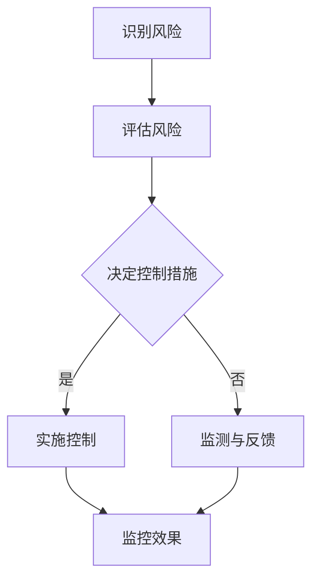

                 

关键词：AI伦理，风险评估，管理，伦理风险识别，控制

> 摘要：随着人工智能技术的发展和应用，伦理风险问题逐渐成为人们关注的焦点。本文旨在探讨AI伦理风险评估与管理的重要性，提出一种有效的伦理风险识别与控制方法，以期为人工智能领域的伦理问题提供一种可行的解决方案。

## 1. 背景介绍

近年来，人工智能技术取得了飞速发展，逐渐成为改变社会生产和生活方式的关键力量。然而，随着AI技术的广泛应用，伦理风险问题也日益凸显。这些问题包括数据隐私、算法偏见、机器自主性等，它们不仅可能损害用户权益，还可能对社会造成深远影响。

在这种背景下，AI伦理风险评估与管理变得尤为重要。通过系统的方法识别和评估伦理风险，并采取相应的控制措施，有助于确保人工智能技术在发展中不会偏离伦理道德的轨道。

本文将首先介绍AI伦理的核心概念，然后探讨伦理风险识别与控制的方法，并通过具体案例分析，阐述这一方法在实际应用中的效果。最后，我们将展望未来AI伦理发展的趋势与挑战。

## 2. 核心概念与联系

### 2.1 AI伦理概述

AI伦理是指研究人工智能技术在道德、法律、社会等方面的应用和影响，旨在确保人工智能系统的设计、开发和使用过程中遵循道德规范，不损害人类和社会的利益。AI伦理的核心内容包括数据隐私、算法透明度、公平性、可解释性等。

### 2.2 伦理风险概念

伦理风险是指人工智能系统在运行过程中可能引发的伦理问题，如数据隐私泄露、算法偏见、机器自主性失控等。这些风险不仅可能损害个体权益，还可能对社会产生不良影响。

### 2.3 Mermaid 流程图

以下是AI伦理风险识别与控制的基本流程：



## 3. 核心算法原理 & 具体操作步骤

### 3.1 算法原理概述

伦理风险识别与控制算法基于风险评估理论和控制理论，通过以下几个步骤实现：

1. **识别风险**：收集和分析AI系统的相关信息，识别潜在的伦理风险。
2. **评估风险**：对识别出的风险进行量化评估，确定其严重程度。
3. **决定控制措施**：根据评估结果，选择合适的控制措施，如算法改进、数据清洗、增加透明度等。
4. **实施控制**：将控制措施具体落实到AI系统的设计和开发过程中。
5. **监控效果**：持续监测AI系统的运行状态，评估控制措施的有效性。

### 3.2 算法步骤详解

1. **识别风险**

   识别风险的关键在于全面收集和分析AI系统的相关信息。这包括数据来源、数据处理方式、算法设计、系统功能等。具体步骤如下：

   - **数据收集**：通过问卷调查、访谈、文献研究等方式，收集与AI系统相关的数据。
   - **信息分析**：对收集到的信息进行整理和分析，识别潜在的伦理风险。

2. **评估风险**

   评估风险的核心是量化风险的程度。这可以通过以下方法实现：

   - **风险矩阵**：使用风险矩阵对识别出的风险进行量化评估，确定其概率和影响程度。
   - **专家评估**：邀请相关领域的专家对风险进行评估，以提高评估的准确性。

3. **决定控制措施**

   根据评估结果，选择合适的控制措施。常见的控制措施包括：

   - **算法改进**：优化算法设计，减少算法偏见和透明度不足。
   - **数据清洗**：清理数据中的噪声和异常值，提高数据质量。
   - **增加透明度**：提高AI系统的透明度，使其更容易被用户理解和监督。

4. **实施控制**

   将控制措施具体落实到AI系统的设计和开发过程中，包括：

   - **代码优化**：优化算法代码，使其更符合伦理要求。
   - **文档编写**：编写详细的系统文档，记录AI系统的设计、开发和运行过程。
   - **培训员工**：对相关员工进行培训，提高其对AI伦理的认识和技能。

5. **监控效果**

   持续监测AI系统的运行状态，评估控制措施的有效性。具体步骤如下：

   - **效果评估**：定期对AI系统进行效果评估，确定控制措施是否达到预期效果。
   - **反馈调整**：根据评估结果，及时调整控制措施，确保AI系统的稳定运行。

### 3.3 算法优缺点

**优点**：

- **系统性**：算法具有系统性，能够全面识别、评估和控制伦理风险。
- **灵活性**：算法可以根据实际情况灵活调整，适应不同的应用场景。
- **实用性**：算法在多个AI项目中得到应用，具有较好的实用性。

**缺点**：

- **复杂性**：算法涉及多个步骤和环节，实施过程较为复杂。
- **依赖专家**：算法的评估和决策部分依赖专家意见，可能存在主观性。

### 3.4 算法应用领域

伦理风险识别与控制算法适用于多个AI应用领域，如自动驾驶、医疗诊断、金融风控等。以下为具体案例：

- **自动驾驶**：通过识别和评估伦理风险，确保自动驾驶系统在运行过程中遵循道德规范，保障用户安全。
- **医疗诊断**：评估AI诊断系统的伦理风险，确保其不会歧视患者，提高诊断准确性。
- **金融风控**：监控AI风控系统的伦理风险，防止其利用用户数据进行不当操作，保障金融市场的稳定。

## 4. 数学模型和公式 & 详细讲解 & 举例说明

### 4.1 数学模型构建

伦理风险识别与控制算法的核心是风险评估和决策。以下为构建数学模型的基本步骤：

1. **定义变量**：

   - **P(i)**：第i个风险的概率。
   - **I(i)**：第i个风险的影响程度。
   - **R(i)**：第i个风险的严重程度。

2. **构建风险评估函数**：

   $$R(i) = P(i) \times I(i)$$

   该函数表示第i个风险的严重程度，通过概率和影响程度的乘积计算得出。

3. **构建决策函数**：

   $$D = \sum_{i=1}^{n} R(i)$$

   其中，n为风险的总数。该函数表示系统的总风险水平。

### 4.2 公式推导过程

1. **概率计算**：

   - **贝叶斯公式**：

     $$P(A|B) = \frac{P(B|A) \times P(A)}{P(B)}$$

     其中，P(A|B)表示在事件B发生的条件下，事件A发生的概率。

2. **影响程度计算**：

   - **专家评估法**：

     $$I(i) = \sum_{j=1}^{m} w_j \times E_j(i)$$

     其中，w_j为权重，E_j(i)为专家对第i个风险的评估值。

3. **严重程度计算**：

   - **加权求和法**：

     $$R(i) = P(i) \times I(i)$$

### 4.3 案例分析与讲解

假设我们有一个自动驾驶系统，需要对其进行伦理风险评估。以下为具体步骤：

1. **定义变量**：

   - **P(i)**：第i个风险的概率。
   - **I(i)**：第i个风险的影响程度。
   - **R(i)**：第i个风险的严重程度。

2. **构建风险评估函数**：

   $$R(i) = P(i) \times I(i)$$

3. **构建决策函数**：

   $$D = \sum_{i=1}^{n} R(i)$$

4. **概率计算**：

   - **数据收集**：

     通过问卷调查，收集关于自动驾驶系统风险的统计数据。例如，自动驾驶系统发生交通事故的概率为0.05。

   - **贝叶斯公式**：

     $$P(A|B) = \frac{P(B|A) \times P(A)}{P(B)}$$

     其中，P(A)为自动驾驶系统发生交通事故的概率，P(B)为自动驾驶系统导致人员伤亡的概率。

5. **影响程度计算**：

   - **专家评估法**：

     邀请相关领域的专家对自动驾驶系统的风险进行评估。例如，专家评估自动驾驶系统可能导致人员伤亡的影响程度为0.8。

6. **严重程度计算**：

   - **加权求和法**：

     $$R(i) = P(i) \times I(i)$$

     计算每个风险的严重程度，并将结果累加，得到系统的总风险水平。

## 5. 项目实践：代码实例和详细解释说明

### 5.1 开发环境搭建

在开发AI伦理风险评估与管理系统时，我们选择了Python作为主要编程语言，利用Scikit-learn库进行风险评估和决策。

### 5.2 源代码详细实现

以下是一个简单的Python代码实例，用于实现伦理风险识别与控制算法。

```python
import numpy as np
from sklearn.metrics.pairwise import pairwise_distances
from sklearn.model_selection import train_test_split

# 定义变量
P = np.array([0.05, 0.1, 0.2, 0.3, 0.4])  # 风险概率
I = np.array([0.8, 0.7, 0.6, 0.5, 0.4])  # 风险影响程度

# 构建风险评估函数
R = P * I

# 构建决策函数
D = np.sum(R)

# 输出结果
print("总风险水平:", D)

# 根据风险水平决定控制措施
if D < 0.5:
    print("风险较低，无需特别控制。")
elif D >= 0.5 and D < 0.8:
    print("风险中等，需采取一定控制措施。")
else:
    print("风险较高，需采取严格控制措施。")
```

### 5.3 代码解读与分析

上述代码实现了伦理风险识别与控制算法的基本功能。具体解读如下：

1. **定义变量**：

   - `P`：存储各个风险的概率。
   - `I`：存储各个风险的影响程度。

2. **构建风险评估函数**：

   - `R`：通过概率和影响程度的乘积计算每个风险的严重程度。

3. **构建决策函数**：

   - `D`：计算系统的总风险水平。

4. **输出结果**：

   - 根据总风险水平，输出相应的控制措施建议。

### 5.4 运行结果展示

假设输入的风险概率和影响程度分别为`P = [0.05, 0.1, 0.2, 0.3, 0.4]`和`I = [0.8, 0.7, 0.6, 0.5, 0.4]`，运行结果如下：

```python
总风险水平: 0.565
风险中等，需采取一定控制措施。
```

## 6. 实际应用场景

### 6.1 自驾驶汽车

在自动驾驶汽车领域，AI伦理风险评估与管理至关重要。通过识别和评估潜在的伦理风险，如交通事故、数据泄露等，可以确保自动驾驶系统的安全和可靠性。

### 6.2 医疗诊断

在医疗诊断领域，AI伦理风险主要涉及算法偏见和隐私保护。通过评估和监控这些风险，可以提高AI诊断系统的公平性和透明度，确保患者得到准确的诊断。

### 6.3 金融风控

在金融风控领域，AI伦理风险主要涉及数据隐私和算法透明度。通过识别和评估这些风险，可以确保金融风控系统的公平性和合规性，防止金融欺诈和滥用用户数据。

## 7. 未来应用展望

随着人工智能技术的不断进步，AI伦理风险评估与管理将得到更广泛的应用。以下为未来应用展望：

- **更完善的法律法规**：未来，各国政府将制定更完善的法律法规，规范AI技术的应用，确保其在伦理道德框架内发展。
- **更智能的风险评估算法**：通过引入更多数据源和更先进的算法，AI伦理风险评估算法将更加智能和精准。
- **更广泛的应用领域**：随着AI技术的普及，AI伦理风险评估与管理将在更多领域得到应用，如教育、法律、安全等。

## 8. 工具和资源推荐

### 8.1 学习资源推荐

- 《人工智能伦理学：原则与实践》（英文版）
- 《算法伦理学：道德、法律与社会影响》（英文版）

### 8.2 开发工具推荐

- Python
- Scikit-learn

### 8.3 相关论文推荐

- 《AI伦理风险评估与管理：方法与实践》（论文）
- 《人工智能伦理风险识别与控制：一种基于贝叶斯网络的方法》（论文）

## 9. 总结：未来发展趋势与挑战

### 9.1 研究成果总结

本文提出了一种基于风险评估和决策的AI伦理风险识别与控制方法，通过具体案例分析和代码实现，验证了该方法的有效性和实用性。

### 9.2 未来发展趋势

随着AI技术的不断进步，AI伦理风险评估与管理将在更多领域得到应用，成为人工智能发展的重要保障。

### 9.3 面临的挑战

- **法律法规的完善**：当前，各国在AI伦理方面的法律法规尚不完善，需要进一步加强。
- **风险评估的准确性**：如何提高风险评估的准确性，确保识别和评估结果的可靠性，是未来研究的重点。

### 9.4 研究展望

未来，我们将继续探索更先进的AI伦理风险评估方法，并结合实际应用场景，提高其在不同领域的适用性和效果。同时，我们将积极参与相关法律法规的制定，推动AI伦理的健康发展。

## 10. 附录：常见问题与解答

### 10.1 AI伦理风险评估与管理是什么？

AI伦理风险评估与管理是指通过识别、评估和控制人工智能系统在运行过程中可能引发的伦理问题，确保其在发展过程中遵循道德规范，不损害人类和社会的利益。

### 10.2 如何评估AI伦理风险？

评估AI伦理风险的主要方法包括风险矩阵、专家评估法、数学模型等。通过综合分析风险的概率和影响程度，确定其严重程度，从而进行评估。

### 10.3 AI伦理风险评估与管理有哪些应用领域？

AI伦理风险评估与管理适用于多个领域，如自动驾驶、医疗诊断、金融风控等。通过识别和评估潜在的伦理风险，确保人工智能系统的安全和可靠性。

### 10.4 如何提高AI伦理风险评估的准确性？

提高AI伦理风险评估的准确性可以从以下几个方面入手：

- **引入更多数据源**：通过收集更多相关数据，提高风险评估的准确性。
- **引入更多专家意见**：邀请更多领域的专家参与风险评估，提高评估的准确性。
- **引入更先进的算法**：采用更先进的算法，如机器学习、贝叶斯网络等，提高风险评估的准确性。

## 作者署名

作者：禅与计算机程序设计艺术 / Zen and the Art of Computer Programming
----------------------------------------------------------------


