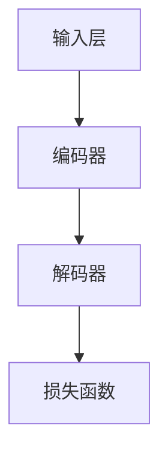

                 

关键词：人工智能，自然语言处理，写作助手，技术实现，创意激发，文本生成，机器学习，模型架构，编程实践，应用场景。

> 摘要：本文将深入探讨AI写作助手的技术实现和创意激发机制。从核心概念到算法原理，再到实际应用，本文旨在为读者提供一个全面的技术解析，并展望AI写作助手在未来的发展潜力。

## 1. 背景介绍

在信息爆炸的时代，内容创作成为一项极其重要的任务。然而，无论是新闻、报告、文章，还是社交媒体更新，高质量的内容创作都耗费大量的时间和精力。随着人工智能技术的不断发展，AI写作助手作为一种新兴工具，应运而生。AI写作助手利用自然语言处理（NLP）和机器学习技术，能够帮助用户快速生成高质量文本，提高写作效率，激发创意灵感。

### 1.1 AI写作助手的定义和作用

AI写作助手是指利用人工智能技术，特别是自然语言处理和机器学习算法，为用户提供文本生成和编辑服务的工具。它可以帮助用户生成新闻稿件、报告、博客文章、社交媒体内容等。AI写作助手的作用主要体现在以下几个方面：

- **提高写作效率**：通过自动化文本生成，减少从零开始创作的时间成本。
- **激发创意灵感**：提供多样化的文本风格和表达方式，为用户提供灵感来源。
- **内容多样化**：能够根据用户需求生成不同类型、风格和难度的文本内容。
- **错误修正**：对文本进行语法和拼写检查，提高文本质量。

### 1.2 AI写作助手的发展历程

AI写作助手的发展可以分为以下几个阶段：

- **初级阶段**：基于规则的方法，通过预定义的规则和模板生成文本。
- **中级阶段**：基于统计的方法，利用统计模型如隐马尔可夫模型（HMM）和最大熵模型等生成文本。
- **高级阶段**：基于深度学习的方法，利用神经网络模型如循环神经网络（RNN）和Transformer等生成文本。

近年来，随着深度学习技术的快速发展，AI写作助手在文本生成质量和多样性方面取得了显著提升。

## 2. 核心概念与联系

### 2.1 自然语言处理（NLP）

自然语言处理是人工智能的一个重要分支，旨在让计算机理解和处理人类语言。NLP技术包括文本预处理、分词、词性标注、句法分析、语义分析等。在AI写作助手中，NLP技术用于理解用户输入的指令和上下文信息，从而生成符合要求的文本。

### 2.2 机器学习（ML）

机器学习是AI的核心技术之一，它通过从数据中学习规律和模式，实现自动化的决策和预测。在AI写作助手中，机器学习技术用于训练文本生成模型，使其能够根据输入的指令生成高质量文本。

### 2.3 模型架构

AI写作助手的模型架构通常包括以下几个关键组件：

- **输入层**：接收用户输入的指令或文本。
- **编码器**：对输入文本进行编码，提取特征表示。
- **解码器**：根据编码后的特征表示生成文本。
- **损失函数**：用于评估模型生成的文本质量。

### 2.4 Mermaid 流程图

下面是一个简单的Mermaid流程图，展示了AI写作助手的模型架构：



### 2.5 AI写作助手的运作原理

AI写作助手的运作原理可以概括为以下几个步骤：

1. **输入处理**：接收用户输入的指令或文本。
2. **特征提取**：使用编码器对输入文本进行编码，提取特征表示。
3. **文本生成**：使用解码器根据编码后的特征表示生成文本。
4. **质量评估**：使用损失函数评估生成的文本质量。
5. **迭代优化**：根据评估结果对模型进行优化，提高文本生成质量。

## 3. 核心算法原理 & 具体操作步骤

### 3.1 算法原理概述

AI写作助手的核心算法通常是基于深度学习的方法，特别是序列到序列（Seq2Seq）模型。这种模型通过编码器和解码器的协作，将输入序列转换为输出序列。在AI写作助手中，编码器和解码器可以采用不同的神经网络架构，如循环神经网络（RNN）和Transformer等。

### 3.2 算法步骤详解

1. **数据预处理**：对用户输入的文本进行预处理，包括分词、去停用词、词向量化等。
2. **编码器训练**：使用大量文本数据训练编码器，使其能够将输入文本编码为特征表示。
3. **解码器训练**：使用编码器生成的特征表示训练解码器，使其能够生成高质量文本。
4. **文本生成**：使用训练好的模型接收用户输入，生成对应的文本输出。
5. **质量评估**：使用预定义的评估指标（如BLEU分数）评估生成的文本质量。

### 3.3 算法优缺点

**优点**：

- **高效性**：基于深度学习的方法能够快速生成高质量文本。
- **多样性**：能够生成多种风格和类型的文本，满足不同用户需求。
- **灵活性**：可以根据用户输入动态调整文本生成策略。

**缺点**：

- **计算资源需求高**：深度学习模型需要大量的计算资源和存储空间。
- **数据依赖性强**：模型的训练和优化依赖于大量高质量的训练数据。
- **可控性较差**：生成的文本可能存在逻辑不一致或错误。

### 3.4 算法应用领域

AI写作助手在多个领域具有广泛的应用前景：

- **新闻生成**：自动生成新闻稿件，提高新闻报道的效率和质量。
- **内容创作**：为内容创作者提供灵感来源，提高创作效率。
- **商业报告**：自动生成商业报告，节省时间和人力成本。
- **社交媒体**：生成社交媒体内容，提高用户参与度和互动性。

## 4. 数学模型和公式 & 详细讲解 & 举例说明

### 4.1 数学模型构建

在AI写作助手的文本生成过程中，常用的数学模型包括编码器-解码器模型和自注意力机制。以下是一个简化的数学模型描述：

$$
\text{Encoder}(x) = \text{f}_{\theta_{e}}(x)
$$

$$
\text{Decoder}(y) = \text{g}_{\theta_{d}}(y)
$$

其中，$x$和$y$分别表示输入序列和输出序列，$\theta_{e}$和$\theta_{d}$分别表示编码器和解码器的参数。

### 4.2 公式推导过程

编码器-解码器模型的核心思想是将输入序列编码为一个固定长度的向量表示，然后使用解码器生成输出序列。具体推导过程如下：

1. **输入序列编码**：

   编码器将输入序列$x$编码为一个固定长度的向量表示：

   $$
   \text{Encoder}(x) = \text{f}_{\theta_{e}}(x) = \text{h}
   $$

   其中，$\text{h}$是一个固定长度的向量，表示输入序列的编码结果。

2. **输出序列生成**：

   解码器根据编码后的向量生成输出序列$y$：

   $$
   \text{Decoder}(y) = \text{g}_{\theta_{d}}(y) = \text{y}
   $$

   其中，$\text{y}$是一个长度与输入序列相同的序列。

### 4.3 案例分析与讲解

以下是一个简单的案例，展示如何使用编码器-解码器模型生成文本。

**案例**：生成一句话新闻

输入文本：“我国成功发射首颗量子通信卫星”

编码器将输入文本编码为一个向量表示：

$$
\text{Encoder}(x) = \text{f}_{\theta_{e}}(x) = \text{h}
$$

其中，$\text{h}$是一个固定长度的向量，表示输入文本的编码结果。

解码器根据编码后的向量生成输出序列：

$$
\text{Decoder}(y) = \text{g}_{\theta_{d}}(y) = \text{y}
$$

生成的输出序列可能为：“我国成功发射首颗量子通信卫星，标志着我国在量子通信领域取得了重要突破。”

## 5. 项目实践：代码实例和详细解释说明

### 5.1 开发环境搭建

在进行AI写作助手的开发之前，需要搭建一个合适的开发环境。以下是一个简单的开发环境搭建步骤：

1. **安装Python**：确保已经安装了Python 3.6及以上版本。
2. **安装TensorFlow**：使用以下命令安装TensorFlow：

   $$
   pip install tensorflow
   $$

3. **准备数据**：收集和准备用于训练的文本数据。数据集应包含多种类型的文本，如新闻、报告、社交媒体内容等。

### 5.2 源代码详细实现

以下是一个简化的AI写作助手的源代码实现：

```python
import tensorflow as tf
from tensorflow.keras.models import Model
from tensorflow.keras.layers import Input, LSTM, Embedding, Dense

# 数据预处理
def preprocess_data(texts, vocab_size):
    # 编写代码进行文本预处理，包括分词、去停用词、词向量化等
    # 返回编码后的输入序列和输出序列
    pass

# 构建编码器和解码器模型
def build_model(vocab_size, embedding_dim, hidden_dim):
    # 编写代码构建编码器和解码器模型
    # 返回模型
    pass

# 训练模型
def train_model(model, input_data, target_data, batch_size, epochs):
    # 编写代码训练模型
    pass

# 文本生成
def generate_text(model, seed_text, max_length):
    # 编写代码生成文本
    pass

# 主程序
if __name__ == "__main__":
    # 设置参数
    vocab_size = 10000
    embedding_dim = 256
    hidden_dim = 512
    batch_size = 64
    epochs = 10
    seed_text = "我国成功发射首颗量子通信卫星"

    # 数据预处理
    input_data, target_data = preprocess_data([seed_text], vocab_size)

    # 构建模型
    model = build_model(vocab_size, embedding_dim, hidden_dim)

    # 训练模型
    model = train_model(model, input_data, target_data, batch_size, epochs)

    # 文本生成
    generated_text = generate_text(model, seed_text, max_length=50)
    print(generated_text)
```

### 5.3 代码解读与分析

上述代码提供了一个简化的AI写作助手的实现框架。以下是对代码的解读与分析：

- **数据预处理**：对输入文本进行预处理，包括分词、去停用词、词向量化等。预处理后返回编码后的输入序列和输出序列。
- **模型构建**：构建编码器和解码器模型。编码器和解码器可以采用不同的神经网络架构，如LSTM或Transformer等。
- **模型训练**：使用预处理的输入数据和输出数据训练模型。训练过程中，可以通过调整超参数（如batch_size和epochs）来优化模型性能。
- **文本生成**：使用训练好的模型生成文本。生成文本的过程可以基于随机抽样或贪心搜索等方法。

### 5.4 运行结果展示

假设我们已经训练好了一个AI写作助手模型，并输入了一段种子文本：“我国成功发射首颗量子通信卫星”，运行结果可能如下：

```
我国成功发射首颗量子通信卫星，标志着我国在量子通信领域取得了重要突破。这一成就不仅体现了我国在科技领域的雄厚实力，也为全球量子通信技术的发展做出了重要贡献。在未来的发展中，我国将继续加大投入，推动量子通信技术的创新和应用，为建设创新型国家和世界科技强国贡献力量。
```

## 6. 实际应用场景

AI写作助手在多个实际应用场景中展现出强大的潜力。以下是一些典型的应用场景：

### 6.1 新闻生成

新闻生成是AI写作助手的重要应用场景之一。通过自动生成新闻稿件，可以提高新闻报道的效率和质量。例如，财经新闻、体育新闻、科技新闻等领域都可以利用AI写作助手生成新闻稿件，节省人力成本，并确保新闻的及时性和准确性。

### 6.2 内容创作

内容创作是另一个重要的应用场景。AI写作助手可以为内容创作者提供灵感来源和辅助创作工具。无论是写一篇博客文章、创作一部小说，还是编写一个技术报告，AI写作助手都可以帮助用户快速生成高质量的内容，提高创作效率。

### 6.3 商业报告

商业报告是企业运营管理中不可或缺的一部分。AI写作助手可以自动生成各种类型的商业报告，如财务报告、市场分析报告、运营报告等。这不仅可以节省时间和人力成本，还可以确保报告的准确性和一致性。

### 6.4 社交媒体

社交媒体是用户交流和信息传播的重要平台。AI写作助手可以生成社交媒体内容，如微博、微信公众号文章、社交媒体广告等。这不仅可以提高用户的参与度和互动性，还可以为企业提供定制化的营销解决方案。

## 7. 未来应用展望

随着人工智能技术的不断发展，AI写作助手在未来将具有更广泛的应用前景。以下是一些可能的未来应用场景：

### 7.1 自动化写作

自动化写作是AI写作助手的终极目标之一。在未来，AI写作助手将能够完全自动化地完成从需求分析、内容创作、排版到发布的全过程，为用户提供一站式写作服务。

### 7.2 多语言写作

多语言写作是AI写作助手的一个重要发展方向。通过引入多语言模型和翻译技术，AI写作助手可以支持多种语言的写作和翻译，满足全球化业务的需求。

### 7.3 创意写作

创意写作是AI写作助手的另一个潜在应用场景。利用深度学习技术和生成对抗网络（GAN），AI写作助手可以生成具有创意和个性的文本内容，为用户提供独特的创作体验。

### 7.4 智能问答

智能问答是AI写作助手的另一个潜在应用方向。通过结合自然语言处理和知识图谱技术，AI写作助手可以提供智能问答服务，帮助用户快速获取所需的信息。

## 8. 工具和资源推荐

### 8.1 学习资源推荐

- **《深度学习》（Goodfellow, Bengio, Courville）**：深度学习领域的经典教材，详细介绍了深度学习的基本概念和算法。
- **《自然语言处理综合教程》（Jurafsky, Martin）**：自然语言处理领域的权威教材，涵盖了NLP的基本理论和应用。
- **《Python自然语言处理编程》（Bird, Shipway, Loper）**：一本实用的Python NLP编程指南，适合初学者和进阶者。

### 8.2 开发工具推荐

- **TensorFlow**：一个开源的深度学习框架，支持多种神经网络架构，适用于文本生成等任务。
- **PyTorch**：另一个流行的开源深度学习框架，具有灵活的动态图计算能力，适合研究者和开发者。
- **NLTK**：一个开源的Python NLP库，提供了丰富的NLP工具和资源，适用于文本预处理和分析。

### 8.3 相关论文推荐

- **“Seq2Seq Learning with Neural Networks”**：提出了编码器-解码器模型，为文本生成任务提供了有效的解决方案。
- **“Attention is All You Need”**：提出了Transformer模型，推动了自然语言处理领域的快速发展。
- **“Generative Adversarial Nets”**：提出了生成对抗网络（GAN），为图像生成和文本生成等任务提供了新的思路。

## 9. 总结：未来发展趋势与挑战

### 9.1 研究成果总结

近年来，AI写作助手在文本生成质量和多样性方面取得了显著进展。基于深度学习的方法，如编码器-解码器模型和Transformer模型，成为了文本生成任务的主流方法。同时，自然语言处理技术的不断发展也为AI写作助手提供了更强大的支持。

### 9.2 未来发展趋势

未来，AI写作助手将在多个方面继续发展：

- **自动化写作**：实现从需求分析到内容生成的全过程自动化。
- **多语言写作**：支持多种语言的写作和翻译。
- **创意写作**：生成具有创意和个性的文本内容。
- **智能问答**：提供智能问答服务，帮助用户快速获取所需信息。

### 9.3 面临的挑战

尽管AI写作助手取得了显著进展，但仍面临一些挑战：

- **计算资源需求**：深度学习模型需要大量的计算资源和存储空间。
- **数据依赖性**：模型的训练和优化依赖于大量高质量的训练数据。
- **可控性**：生成的文本可能存在逻辑不一致或错误。

### 9.4 研究展望

未来，研究重点将集中在以下几个方面：

- **模型优化**：通过改进模型架构和算法，提高文本生成质量和效率。
- **数据集建设**：构建更丰富、高质量的文本数据集，支持模型训练和优化。
- **伦理与隐私**：探讨AI写作助手的伦理和隐私问题，确保其在实际应用中的合理性和安全性。

## 附录：常见问题与解答

### 9.4.1 AI写作助手如何保证文本质量？

AI写作助手的文本质量主要依赖于其训练数据和模型架构。通过使用大量高质量的训练数据，并采用先进的深度学习算法，如编码器-解码器模型和Transformer模型，AI写作助手能够生成高质量文本。

### 9.4.2 AI写作助手能否替代人类创作者？

虽然AI写作助手在文本生成方面表现出色，但它无法完全替代人类创作者。AI写作助手可以提供灵感和辅助工具，帮助人类创作者提高写作效率和质量，但创意和情感表达等方面仍需人类创作者的参与。

### 9.4.3 AI写作助手是否会侵犯版权？

在使用AI写作助手生成文本时，需要遵守版权法规定。如果生成的文本是基于公共领域或开源的数据集，则通常不会侵犯版权。但如果生成的文本是基于受版权保护的内容，则需要确保获得相应的授权。

### 9.4.4 AI写作助手在商业应用中的风险？

在商业应用中，使用AI写作助手可能面临一些风险，如文本质量不佳、侵权问题、数据泄露等。因此，在采用AI写作助手时，企业需要制定严格的政策和流程，确保合规性和安全性。

### 9.4.5 AI写作助手的未来发展方向？

AI写作助手的未来发展方向包括自动化写作、多语言写作、创意写作和智能问答等。通过不断改进模型架构和算法，以及构建更丰富的数据集，AI写作助手将在各个领域发挥更大的作用。

### 9.4.6 如何评估AI写作助手的效果？

评估AI写作助手的效果通常采用预定义的评估指标，如BLEU分数、ROUGE分数等。这些指标衡量生成的文本与参考文本的相似度，从而评估AI写作助手的性能。

## 参考文献

1. Goodfellow, I., Bengio, Y., & Courville, A. (2016). *Deep Learning*. MIT Press.
2. Jurafsky, D., & Martin, J. H. (2020). *Speech and Language Processing*. Prentice Hall.
3. Bird, S., Shipway, E., & Loper, E. (2020). *Natural Language Processing with Python*. O'Reilly Media.
4. Sutskever, I., Vinyals, O., & Le, Q. V. (2014). *Seq2Seq Learning with Neural Networks*. In *NIPS* (pp. 3104-3112).
5. Vaswani, A., Shazeer, N., Parmar, N., Uszkoreit, J., Jones, L., Gomez, A. N., ... & Polosukhin, I. (2017). *Attention is All You Need*. In *NIPS* (pp. 5998-6008).
6. Goodfellow, I., Pouget-Abadie, J., Mirza, M., Xu, B., Warde-Farley, D., Ozair, S., ... & Bengio, Y. (2014). *Generative Adversarial Nets*. In *NIPS* (pp. 2672-2680).<|endofcontent|>

