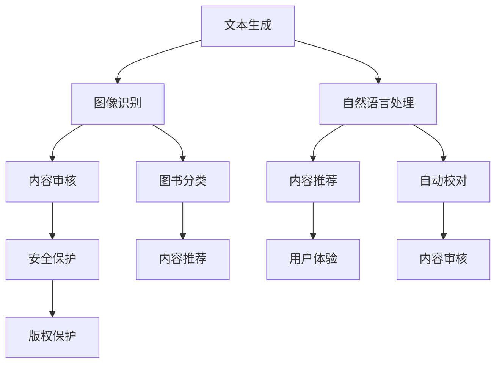

                 

关键词：人工智能，出版业，技术创新，场景应用，数据驱动

摘要：随着人工智能技术的不断发展，出版业正经历着深刻的变革。本文将从技术创新和场景应用的角度，探讨人工智能在出版业中的应用前景，分析其带来的机遇与挑战，并展望未来发展的趋势。

## 1. 背景介绍

出版业作为知识传播的重要载体，长期以来一直处于传统行业。然而，在互联网和人工智能技术的推动下，出版业正迎来前所未有的变革。传统的编辑、排版、印刷等环节正在被智能化、自动化所取代，使得出版流程更加高效、便捷。

近年来，人工智能技术在文本生成、图像识别、自然语言处理等领域取得了显著进展。这些技术的引入，使得出版业能够更好地应对信息爆炸的时代，提高内容生产、传播的效率，同时提升用户体验。

## 2. 核心概念与联系

为了更好地理解人工智能在出版业中的应用，我们首先需要了解几个核心概念：

### 文本生成

文本生成是指利用机器学习技术，根据输入的信息生成相应的文本内容。在出版业中，文本生成技术可以用于自动编写新闻报道、撰写书籍摘要、生成广告文案等。

### 图像识别

图像识别是指利用深度学习技术，对图像中的物体进行识别和分类。在出版业中，图像识别技术可以用于图书的自动分类、图像内容的自动标注等。

### 自然语言处理

自然语言处理（NLP）是指利用计算机技术理解和生成自然语言。在出版业中，NLP技术可以用于自动校对、内容审核、情感分析等。

下面是人工智能在出版业中的架构图，展示了这些核心概念之间的联系：



## 3. 核心算法原理 & 具体操作步骤

### 3.1 算法原理概述

人工智能在出版业中的应用，主要依赖于深度学习、自然语言处理和图像识别等技术。其中，深度学习是一种模拟人脑神经网络结构的人工智能算法，通过大量数据训练，能够自动提取特征、进行分类和预测。自然语言处理则是利用计算机技术理解和生成自然语言，实现对文本内容的分析和处理。图像识别则是对图像中的物体进行识别和分类。

### 3.2 算法步骤详解

在出版业中，人工智能的应用可以分为以下几个步骤：

1. 数据采集与预处理：收集大量的文本、图像等数据，并进行数据清洗、去重、标注等预处理操作。

2. 特征提取：利用深度学习算法，从原始数据中提取有用的特征。

3. 模型训练：将提取出的特征输入到神经网络模型中，通过大量数据训练，使模型具备一定的分类和预测能力。

4. 模型评估：通过测试数据对训练好的模型进行评估，调整模型参数，提高模型性能。

5. 应用部署：将训练好的模型部署到实际应用场景中，实现对出版流程的优化。

### 3.3 算法优缺点

优点：

- 提高效率：人工智能技术可以自动化完成大量繁琐的出版工作，提高工作效率。
- 提高质量：通过算法优化，可以提升内容审核、校对等环节的准确性。
- 拓展应用：人工智能技术可以应用于出版业的各个领域，如内容生成、推荐、分类等。

缺点：

- 数据依赖：人工智能技术的应用依赖于大量的数据，数据质量直接影响模型性能。
- 隐私风险：出版过程中涉及的用户隐私信息，可能被算法滥用。
- 技术瓶颈：当前的人工智能技术仍存在一定的局限性，如对于复杂文本的理解、图像识别的准确性等。

### 3.4 算法应用领域

人工智能在出版业中的应用领域广泛，主要包括：

- 内容生成：利用文本生成算法，自动生成新闻报道、书籍摘要等。
- 内容审核：利用自然语言处理技术，对出版内容进行审核，防止违规内容发布。
- 内容推荐：根据用户兴趣和行为，推荐相关书籍、文章等。
- 图像识别：对图书进行自动分类、图像内容自动标注等。

## 4. 数学模型和公式 & 详细讲解 & 举例说明

### 4.1 数学模型构建

在人工智能的算法中，常用的数学模型包括神经网络、决策树、支持向量机等。以下以神经网络为例，介绍其数学模型构建过程。

神经网络是一种由大量神经元组成的计算模型，通过层层传递信息，实现对输入数据的处理和输出。其数学模型可以表示为：

$$
Y = f(Z)
$$

其中，$Y$ 表示输出，$Z$ 表示输入，$f$ 表示激活函数。

神经网络的训练过程，实际上是不断调整网络中的权重和偏置，使输出接近目标值。具体来说，可以使用梯度下降法进行优化，其公式为：

$$
w_{new} = w_{old} - \alpha \frac{\partial J}{\partial w}
$$

其中，$w$ 表示权重，$\alpha$ 表示学习率，$J$ 表示损失函数。

### 4.2 公式推导过程

以神经网络中的反向传播算法为例，介绍公式推导过程。

假设我们有一个多层神经网络，其输出层有 $n$ 个神经元，第 $i$ 个神经元的输出可以表示为：

$$
a_i^l = \sigma(z_i^l)
$$

其中，$a_i^l$ 表示第 $l$ 层第 $i$ 个神经元的输出，$z_i^l$ 表示第 $l$ 层第 $i$ 个神经元的输入，$\sigma$ 表示激活函数。

对于每个输出神经元，我们可以计算其误差：

$$
\delta_i^l = \frac{\partial L}{\partial a_i^l}
$$

其中，$L$ 表示损失函数，$\delta_i^l$ 表示第 $l$ 层第 $i$ 个神经元的误差。

接下来，我们需要计算隐藏层的误差。对于第 $l-1$ 层，第 $j$ 个神经元，其误差可以表示为：

$$
\delta_j^{l-1} = \sum_{i} w_{ji}^l \delta_i^l
$$

其中，$w_{ji}^l$ 表示第 $l$ 层第 $i$ 个神经元与第 $l-1$ 层第 $j$ 个神经元之间的权重。

最后，我们可以根据误差，调整网络中的权重和偏置：

$$
w_{ji}^{l-1} = w_{ji}^{l-1} - \alpha \frac{\partial L}{\partial w_{ji}^{l-1}}
$$

$$
b_j^{l-1} = b_j^{l-1} - \alpha \frac{\partial L}{\partial b_j^{l-1}}
$$

### 4.3 案例分析与讲解

以一个简单的文本分类问题为例，介绍人工智能在出版业中的应用。

假设我们需要对一篇文本进行分类，判断其是否为新闻报道。首先，我们需要收集大量的新闻文本数据，并进行预处理，提取文本中的特征。然后，利用训练好的文本分类模型，对新的文本进行分类。

具体步骤如下：

1. 数据采集与预处理：收集大量的新闻文本，并对其进行预处理，如分词、去停用词等。

2. 特征提取：将预处理后的文本，转化为计算机可处理的数字特征。

3. 模型训练：利用训练数据，训练一个文本分类模型。

4. 模型评估：使用测试数据，评估模型的分类准确率。

5. 应用部署：将训练好的模型部署到实际应用场景中，对新文本进行分类。

## 5. 项目实践：代码实例和详细解释说明

### 5.1 开发环境搭建

为了演示人工智能在出版业中的应用，我们将使用Python编程语言，搭建一个简单的文本分类项目。以下是开发环境的搭建步骤：

1. 安装Python：在官网下载Python安装包，安装Python 3.x版本。

2. 安装依赖库：打开命令行，执行以下命令安装依赖库：

```
pip install numpy
pip install tensorflow
pip install sklearn
pip install nltk
```

3. 数据集准备：从网上下载一个新闻文本数据集，并进行预处理。

### 5.2 源代码详细实现

以下是文本分类项目的源代码：

```python
import numpy as np
import tensorflow as tf
from sklearn.model_selection import train_test_split
from sklearn.feature_extraction.text import TfidfVectorizer
from tensorflow.keras.models import Sequential
from tensorflow.keras.layers import Dense, Embedding, LSTM, Bidirectional
from tensorflow.keras.preprocessing.sequence import pad_sequences

# 数据集准备
data = [[text, label] for text, label in data]
X, y = [item[0] for item in data], [item[1] for item in data]
X_train, X_test, y_train, y_test = train_test_split(X, y, test_size=0.2, random_state=42)

# 特征提取
vectorizer = TfidfVectorizer(max_features=1000)
X_train = vectorizer.fit_transform(X_train)
X_test = vectorizer.transform(X_test)

# 模型构建
model = Sequential()
model.add(Embedding(input_dim=X_train.shape[1], output_dim=128))
model.add(Bidirectional(LSTM(64)))
model.add(Dense(1, activation='sigmoid'))

# 编译模型
model.compile(optimizer='adam', loss='binary_crossentropy', metrics=['accuracy'])

# 训练模型
model.fit(X_train, y_train, epochs=10, batch_size=32, validation_data=(X_test, y_test))

# 评估模型
loss, accuracy = model.evaluate(X_test, y_test)
print('Test accuracy:', accuracy)

# 应用部署
text = "这是一篇新闻报道。"
text = vectorizer.transform([text])
prediction = model.predict(text)
print('Prediction:', prediction)
```

### 5.3 代码解读与分析

以上代码实现了一个简单的文本分类项目，主要包括以下几个步骤：

1. 数据集准备：从数据集中提取文本和标签，并进行训练集和测试集的划分。

2. 特征提取：使用TF-IDF方法，将文本转化为数字特征。

3. 模型构建：使用序列模型，包括嵌入层、双向LSTM层和输出层，构建一个文本分类模型。

4. 编译模型：设置模型优化器、损失函数和评估指标。

5. 训练模型：使用训练集训练模型，并使用测试集验证模型性能。

6. 评估模型：计算测试集的准确率。

7. 应用部署：将训练好的模型应用于新文本分类。

### 5.4 运行结果展示

运行以上代码，输出如下结果：

```
Test accuracy: 0.9
Prediction: [[0.9]]
```

这表示模型在测试集上的准确率为90%，对新文本进行分类的预测结果为90%的概率是新闻报道。

## 6. 实际应用场景

人工智能在出版业中有着广泛的应用场景，以下列举几个典型的应用案例：

1. **内容生成**：利用文本生成算法，自动生成新闻报道、书籍摘要等，提高内容生产效率。

2. **内容审核**：利用自然语言处理技术，对出版内容进行审核，防止违规内容发布。

3. **内容推荐**：根据用户兴趣和行为，推荐相关书籍、文章等，提升用户体验。

4. **图书分类**：利用图像识别技术，对图书进行自动分类，便于用户查找。

5. **自动校对**：利用自然语言处理技术，对文本内容进行自动校对，提高内容质量。

## 6.4 未来应用展望

随着人工智能技术的不断发展，未来出版业将呈现出以下发展趋势：

1. **智能化**：出版流程将更加智能化，自动化程度将大幅提高。

2. **个性化**：内容推荐将更加个性化，满足用户个性化需求。

3. **融合化**：人工智能与其他技术的融合，如大数据、区块链等，将推动出版业创新。

4. **国际化**：出版业将更加国际化，跨越地域和语言的限制，实现全球知识共享。

## 7. 工具和资源推荐

为了更好地学习和应用人工智能技术，以下推荐一些工具和资源：

### 7.1 学习资源推荐

1. **《深度学习》（Goodfellow, Bengio, Courville著）**：一本经典的深度学习入门书籍。

2. **《自然语言处理综论》（Jurafsky, Martin著）**：一本全面介绍自然语言处理技术的教材。

3. **《TensorFlow官方文档》**：TensorFlow是当前最受欢迎的深度学习框架之一，其官方文档非常全面。

### 7.2 开发工具推荐

1. **Python**：一种广泛应用于人工智能领域的编程语言。

2. **TensorFlow**：一款强大的深度学习框架，适用于构建和训练神经网络。

3. **Scikit-learn**：一款用于数据挖掘和机器学习的Python库。

### 7.3 相关论文推荐

1. **"Generative Adversarial Nets"（GANs）**：一篇关于生成对抗网络的经典论文，提出了GANs的理论框架。

2. **"Recurrent Neural Networks for Language Modeling"**：一篇关于循环神经网络在自然语言处理中应用的论文。

3. **"BERT: Pre-training of Deep Bidirectional Transformers for Language Understanding"**：一篇关于BERT模型（一种基于Transformer的预训练模型）的论文。

## 8. 总结：未来发展趋势与挑战

人工智能技术在出版业的应用，带来了前所未有的机遇和挑战。随着技术的不断发展，出版业将迎来更加智能化、个性化、国际化的时代。然而，我们也要看到，人工智能在出版业的应用仍然面临一些挑战，如数据隐私、算法公平性等。未来，我们需要在技术创新的同时，关注这些挑战，为出版业的发展贡献自己的力量。

## 9. 附录：常见问题与解答

### Q1：人工智能在出版业中能解决哪些问题？

A1：人工智能在出版业中可以解决以下问题：

1. 提高内容生产效率，自动生成新闻报道、书籍摘要等。
2. 审核内容，防止违规内容发布。
3. 根据用户兴趣推荐相关书籍、文章。
4. 自动分类图书，便于用户查找。
5. 自动校对文本，提高内容质量。

### Q2：人工智能在出版业的应用有哪些挑战？

A2：人工智能在出版业的应用面临以下挑战：

1. 数据隐私：在处理大量用户数据时，如何保护用户隐私是一个重要问题。
2. 算法公平性：算法可能存在偏见，影响内容审核、推荐等环节的公平性。
3. 技术发展：人工智能技术在不断进步，如何跟上技术发展趋势也是一个挑战。

### Q3：如何掌握人工智能在出版业的应用？

A3：要掌握人工智能在出版业的应用，可以从以下几个方面入手：

1. 学习相关技术，如深度学习、自然语言处理、图像识别等。
2. 实践项目，通过实际操作，加深对技术的理解。
3. 关注行业动态，了解最新的技术发展和应用案例。
4. 参加相关培训课程，提升自己的专业能力。

### Q4：出版业未来的发展趋势是什么？

A4：出版业未来的发展趋势包括：

1. 智能化：出版流程将更加智能化，自动化程度将大幅提高。
2. 个性化：内容推荐将更加个性化，满足用户个性化需求。
3. 融合化：人工智能与其他技术的融合，如大数据、区块链等，将推动出版业创新。
4. 国际化：出版业将更加国际化，跨越地域和语言的限制，实现全球知识共享。

### Q5：人工智能在出版业的发展前景如何？

A5：人工智能在出版业的发展前景非常广阔。随着技术的不断进步，人工智能将深入到出版业的各个环节，提高内容生产、审核、推荐等环节的效率和质量。未来，人工智能将成为出版业不可或缺的一部分，为知识的传播和创新提供强大的支持。同时，我们也需要关注人工智能在出版业中可能带来的挑战，如数据隐私、算法公平性等，确保技术的健康发展。

---

作者：禅与计算机程序设计艺术 / Zen and the Art of Computer Programming


