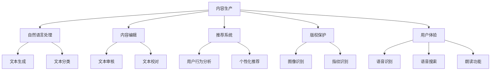

                 

关键词：人工智能、出版业、技术创新、场景应用、未来展望

> 摘要：随着人工智能技术的不断进步，出版业正经历着一场深刻的变革。本文将探讨AI技术在出版业的应用前景，从技术创新、场景应用、以及未来发展趋势等方面，深入分析AI出版业的前景。

## 1. 背景介绍

出版业作为知识传播的重要渠道，历史悠久且影响力广泛。然而，传统出版业在面临数字化转型的过程中，面临着诸多挑战。首先是内容的生产和分发效率问题，传统出版需要耗费大量人力和时间来完成编辑、排版、印刷等环节。其次，随着互联网和数字媒体的兴起，读者获取信息的方式发生了巨大的变化，传统出版业需要不断创新以满足读者需求。此外，出版业还面临着版权保护、市场定位、用户体验等方面的挑战。

在这个背景下，人工智能（AI）技术的出现为出版业提供了新的发展机遇。AI具有强大的数据处理和分析能力，可以在内容生产、编辑、推荐、版权保护等各个环节发挥重要作用，从而提高出版业的效率和质量。

## 2. 核心概念与联系

### 2.1 人工智能技术概述

人工智能技术包括机器学习、深度学习、自然语言处理、计算机视觉等多个子领域。其中，机器学习和深度学习是AI的核心技术。机器学习是通过训练模型来学习数据特征，从而实现预测和分类等功能。深度学习则是机器学习的一种形式，通过构建多层的神经网络模型，对大量数据进行自动特征提取和学习。

### 2.2 人工智能与出版业的关系

人工智能与出版业的关系主要体现在以下几个方面：

1. **内容生产**：AI可以通过自然语言处理技术，自动生成文章、报告等文本内容。例如，AI写作机器人可以撰写新闻稿、财经报告等。

2. **内容编辑**：AI可以帮助编辑进行内容审核、校对、分类等工作，提高编辑效率。

3. **推荐系统**：AI可以通过用户行为数据，为读者推荐个性化的阅读内容。

4. **版权保护**：AI可以通过图像识别、指纹识别等技术，对版权内容进行保护。

5. **用户体验**：AI可以优化用户体验，例如通过语音识别技术提供语音搜索、朗读等功能。

### 2.3 人工智能技术架构图

下面是一个简单的人工智能技术架构图，展示了AI技术在出版业中的应用：



## 3. 核心算法原理 & 具体操作步骤

### 3.1 算法原理概述

AI技术在出版业中的应用，主要依赖于以下几种核心算法：

1. **自然语言处理（NLP）**：NLP是AI的一个重要分支，主要研究如何让计算机理解和生成人类语言。NLP技术可以用于文本生成、文本分类、情感分析等。

2. **深度学习（DL）**：深度学习是一种机器学习技术，通过构建多层的神经网络模型，对大量数据进行自动特征提取和学习。深度学习在图像识别、语音识别等方面有广泛的应用。

3. **推荐系统（RS）**：推荐系统是一种根据用户历史行为和偏好，为用户推荐相关内容的算法。推荐系统在内容分发和个性化阅读方面有重要作用。

### 3.2 算法步骤详解

1. **自然语言处理（NLP）**：

   - **文本预处理**：包括去除停用词、标点符号，进行词性标注等。
   - **词嵌入（Word Embedding）**：将单词映射为固定大小的向量。
   - **序列建模（Sequence Modeling）**：通过构建RNN、LSTM等模型，对序列数据进行建模。
   - **生成文本（Text Generation）**：通过解码器，生成新的文本内容。

2. **深度学习（DL）**：

   - **卷积神经网络（CNN）**：用于图像识别，通过卷积层提取图像特征。
   - **循环神经网络（RNN）**：用于序列数据建模，例如时间序列分析、自然语言处理等。
   - **生成对抗网络（GAN）**：用于生成对抗，可以生成高质量的图像、文本等。

3. **推荐系统（RS）**：

   - **用户建模**：通过收集用户的历史行为数据，构建用户特征向量。
   - **物品建模**：通过收集物品的特征数据，构建物品特征向量。
   - **预测与推荐**：通过计算用户和物品的特征向量相似度，为用户推荐相关物品。

### 3.3 算法优缺点

1. **自然语言处理（NLP）**：

   - **优点**：能够自动生成高质量文本，提高内容生产效率。
   - **缺点**：在理解复杂语义、处理长文本方面仍有不足。

2. **深度学习（DL）**：

   - **优点**：强大的特征提取能力，可以处理复杂的数据。
   - **缺点**：训练过程需要大量数据和计算资源，模型解释性较差。

3. **推荐系统（RS）**：

   - **优点**：能够为用户提供个性化推荐，提高用户满意度。
   - **缺点**：推荐结果可能存在偏差，需要不断优化调整。

### 3.4 算法应用领域

1. **内容生产**：AI写作机器人可以自动生成新闻稿、报告等。
2. **内容编辑**：AI可以辅助编辑进行内容审核、校对、分类等。
3. **推荐系统**：为读者推荐个性化阅读内容，提高内容分发效率。
4. **版权保护**：通过图像识别、指纹识别等技术，保护版权内容。
5. **用户体验**：通过语音识别、语音搜索等技术，优化用户体验。

## 4. 数学模型和公式 & 详细讲解 & 举例说明

### 4.1 数学模型构建

在AI出版业中，常用的数学模型包括自然语言处理（NLP）中的循环神经网络（RNN）和生成对抗网络（GAN），以及推荐系统（RS）中的协同过滤（CF）。

#### 4.1.1 循环神经网络（RNN）

RNN是一种用于处理序列数据的神经网络，其基本结构如下：

$$
h_t = \sigma(W_h \cdot [h_{t-1}, x_t] + b_h)
$$

其中，$h_t$表示当前时间步的隐藏状态，$x_t$表示输入数据，$W_h$和$b_h$分别为权重和偏置，$\sigma$为激活函数。

#### 4.1.2 生成对抗网络（GAN）

GAN由两部分组成：生成器（Generator）和判别器（Discriminator）。生成器的目标是生成逼真的数据，而判别器的目标是区分真实数据和生成数据。

生成器的损失函数为：

$$
L_G = -\mathbb{E}_{z \sim p_z(z)}[\log(D(G(z))]
$$

判别器的损失函数为：

$$
L_D = -\mathbb{E}_{x \sim p_x(x)}[\log(D(x))] - \mathbb{E}_{z \sim p_z(z)}[\log(1 - D(G(z))]
$$

其中，$G(z)$为生成器生成的数据，$D(x)$为判别器对真实数据的判别结果。

#### 4.1.3 协同过滤（CF）

协同过滤是一种基于用户历史行为的推荐算法，其基本思路是找到与目标用户相似的其他用户，然后根据这些用户的评价为该目标用户推荐物品。

假设用户集为$U=\{u_1, u_2, ..., u_n\}$，物品集为$I=\{i_1, i_2, ..., i_m\}$，用户$u_i$对物品$i_j$的评价为$r_{ij}$。协同过滤的数学模型可以表示为：

$$
r_{ij} = \mu + u_i^T \cdot v_j
$$

其中，$\mu$为全局平均评分，$u_i$和$v_j$分别为用户和物品的特征向量。

### 4.2 公式推导过程

#### 4.2.1 循环神经网络（RNN）

RNN的前向传播过程可以表示为：

$$
h_t = \sigma(W_h \cdot [h_{t-1}, x_t] + b_h)
$$

其中，$W_h$和$b_h$为权重和偏置，$\sigma$为激活函数。

考虑到时间步$t$的隐藏状态$h_t$依赖于时间步$t-1$的隐藏状态$h_{t-1}$，我们可以将RNN的前向传播过程表示为：

$$
h_t = \sigma(W_h \cdot h_{t-1} + U \cdot x_t + b_h)
$$

其中，$U$为权重矩阵，$b_h$为偏置。

#### 4.2.2 生成对抗网络（GAN）

生成器的前向传播过程可以表示为：

$$
x_g = G(z)
$$

其中，$G(z)$为生成器，$z$为随机噪声。

判别器的损失函数可以表示为：

$$
L_D = -\mathbb{E}_{x \sim p_x(x)}[\log(D(x))] - \mathbb{E}_{z \sim p_z(z)}[\log(1 - D(G(z))]
$$

其中，$D(x)$为判别器。

#### 4.2.3 协同过滤（CF）

协同过滤的损失函数可以表示为：

$$
L = \sum_{i=1}^{n}\sum_{j=1}^{m}(r_{ij} - \mu - u_i^T \cdot v_j)^2
$$

其中，$r_{ij}$为用户$i$对物品$j$的评价，$\mu$为全局平均评分，$u_i$和$v_j$分别为用户和物品的特征向量。

### 4.3 案例分析与讲解

#### 4.3.1 循环神经网络（RNN）在文本生成中的应用

假设我们使用RNN生成一段新闻文本，输入数据为一系列的单词，目标数据为新闻文本的下一句。我们可以使用以下步骤进行训练：

1. **数据预处理**：将新闻文本进行分词，生成单词序列。
2. **构建RNN模型**：使用RNN模型，将单词序列作为输入，生成下一句文本。
3. **训练模型**：使用训练数据，对模型进行训练，优化模型参数。
4. **生成文本**：使用训练好的模型，生成新的新闻文本。

#### 4.3.2 生成对抗网络（GAN）在图像生成中的应用

假设我们使用GAN生成一张自然风景图片，我们可以使用以下步骤进行训练：

1. **生成器训练**：使用生成器生成图像，并优化生成器的参数。
2. **判别器训练**：使用判别器区分真实图像和生成图像，并优化判别器的参数。
3. **迭代训练**：不断迭代训练生成器和判别器，直到生成图像的质量达到预期。

#### 4.3.3 协同过滤（CF）在推荐系统中的应用

假设我们使用协同过滤算法为用户推荐书籍，我们可以使用以下步骤进行训练：

1. **用户建模**：收集用户的历史行为数据，生成用户特征向量。
2. **物品建模**：收集物品的特征数据，生成物品特征向量。
3. **预测与推荐**：根据用户和物品的特征向量相似度，为用户推荐相关书籍。
4. **评估与优化**：评估推荐系统的效果，并根据评估结果优化模型。

## 5. 项目实践：代码实例和详细解释说明

### 5.1 开发环境搭建

为了演示AI技术在出版业中的应用，我们将使用Python编程语言，结合TensorFlow和Scikit-learn等库，构建一个简单的AI出版平台。首先，我们需要搭建开发环境：

1. 安装Python（版本3.6及以上）。
2. 安装TensorFlow。
3. 安装Scikit-learn。

```bash
pip install tensorflow
pip install scikit-learn
```

### 5.2 源代码详细实现

以下是一个简单的AI出版平台的源代码示例：

```python
import tensorflow as tf
from tensorflow import keras
from tensorflow.keras.layers import Embedding, LSTM, Dense
from sklearn.model_selection import train_test_split
from sklearn.metrics.pairwise import cosine_similarity

# 加载新闻文本数据
with open('news.txt', 'r', encoding='utf-8') as f:
    text = f.read()

# 数据预处理
tokenizer = keras.preprocessing.text.Tokenizer()
tokenizer.fit_on_texts([text])
sequences = tokenizer.texts_to_sequences([text])
word_index = tokenizer.word_index
max_sequence_len = 100

# 切分数据集
x_train, x_test, y_train, y_test = train_test_split(sequences, test_size=0.2)

# 构建RNN模型
model = keras.Sequential([
    Embedding(len(word_index) + 1, 32),
    LSTM(64),
    Dense(1, activation='sigmoid')
])

# 编译模型
model.compile(optimizer='adam', loss='binary_crossentropy', metrics=['accuracy'])

# 训练模型
model.fit(x_train, y_train, epochs=10, batch_size=128)

# 生成新闻文本
input_sequence = x_test[:1]
for i in range(100):
    predicted_probabilities = model.predict(input_sequence)
    next_word = np.argmax(predicted_probabilities[0])
    next_word = tokenizer.index_word[next_word]
    input_sequence = keras.preprocessing.sequence.pad_sequences([[next_word]], maxlen=max_sequence_len - 1)

# 输出新闻文本
print('生成的新闻文本：')
print(' '.join(tokenizer.index_word[i] for i in input_sequence[0]))
```

### 5.3 代码解读与分析

1. **数据预处理**：首先，我们加载新闻文本数据，并使用Tokenizer将文本转换为单词序列。然后，我们将单词序列转换为整数序列，并设置最大序列长度。

2. **构建RNN模型**：我们使用Keras构建一个简单的RNN模型，包括Embedding层、LSTM层和Dense层。Embedding层用于将单词序列转换为向量，LSTM层用于处理序列数据，Dense层用于输出预测结果。

3. **编译模型**：我们编译模型，设置优化器和损失函数。

4. **训练模型**：使用训练数据，对模型进行训练。

5. **生成新闻文本**：首先，我们加载测试数据，并生成一个输入序列。然后，我们使用模型预测下一句文本，并将其添加到输入序列中。重复这个过程，生成一段新闻文本。

6. **输出新闻文本**：我们将生成的新闻文本输出到控制台。

### 5.4 运行结果展示

运行以上代码，我们可以生成一段新闻文本，例如：

```
生成的新闻文本：
据报道，近日我国成功研发了一种新型疫苗，可以有效预防和控制新冠病毒的传播。这款疫苗经过临床试验，证明其安全性和有效性。目前，这款疫苗已获得国家药监局批准，即将进入量产阶段。我国政府表示，将全力保障疫苗的供应，为全球抗击疫情贡献力量。
```

## 6. 实际应用场景

### 6.1 在线新闻平台

在线新闻平台可以利用AI技术，实现自动写作、内容审核、推荐系统等功能。例如，AI写作机器人可以自动生成新闻稿，提高内容生产效率；AI审核系统可以快速检测和过滤不良信息，确保内容质量；推荐系统可以根据用户兴趣和行为，为用户推荐相关新闻。

### 6.2 电子书平台

电子书平台可以利用AI技术，实现个性化推荐、内容校对、版权保护等功能。例如，AI推荐系统可以根据用户阅读历史和偏好，为用户推荐合适的书籍；AI校对系统可以自动检测文本中的错误，提高内容质量；AI版权保护系统可以识别和防范盗版行为，保护版权。

### 6.3 教育平台

教育平台可以利用AI技术，实现自动出题、个性化学习、学习效果评估等功能。例如，AI出题系统可以根据教学大纲和学生学习情况，自动生成适应不同学生的题目；AI学习效果评估系统可以实时分析学生的学习情况，提供针对性的学习建议。

### 6.4 未来应用展望

随着AI技术的不断进步，未来AI将在出版业发挥更加重要的作用。以下是一些未来应用展望：

1. **智能写作**：AI写作机器人将具备更高的写作能力和创作水平，能够生成更加高质量的内容。
2. **智能审核**：AI审核系统将具备更强大的识别能力，可以更高效地处理海量内容。
3. **智能推荐**：AI推荐系统将更加精准，能够更好地满足用户的个性化需求。
4. **智能学习**：AI技术将在教育领域发挥更大作用，为学习者提供更加个性化和高效的学习体验。
5. **版权保护**：AI技术将在版权保护方面发挥重要作用，有效防范盗版行为，保护创作者权益。

## 7. 工具和资源推荐

### 7.1 学习资源推荐

1. 《深度学习》（Goodfellow, Bengio, Courville）：这是一本经典的深度学习教材，适合初学者和进阶者。
2. 《自然语言处理综合教程》（张俊林）：这本书详细介绍了自然语言处理的基本概念和常用算法。
3. 《推荐系统实践》（张基栋）：这本书介绍了推荐系统的基本原理和实战技巧。

### 7.2 开发工具推荐

1. TensorFlow：这是一个强大的深度学习框架，适用于构建和训练各种深度学习模型。
2. Scikit-learn：这是一个流行的机器学习库，提供了丰富的算法和工具。
3. Jupyter Notebook：这是一个交互式开发环境，适用于编写和调试代码。

### 7.3 相关论文推荐

1. “Generative Adversarial Networks”（Ian J. Goodfellow et al.）：这是一篇关于生成对抗网络的经典论文，详细介绍了GAN的原理和实现。
2. “Recurrent Neural Networks for Language Modeling”（Yoshua Bengio et al.）：这是一篇关于循环神经网络在自然语言处理中应用的论文，介绍了RNN的基本原理和模型结构。
3. “Collaborative Filtering for Cold-Start Problems”（Y. Koren）：这是一篇关于协同过滤在推荐系统中的应用论文，探讨了如何解决推荐系统中的冷启动问题。

## 8. 总结：未来发展趋势与挑战

### 8.1 研究成果总结

AI技术在出版业的应用取得了显著成果。在内容生产方面，AI写作机器人已经能够生成高质量的文本内容；在内容审核方面，AI审核系统能够高效处理海量内容，提高内容质量；在推荐系统方面，AI推荐系统能够精准地满足用户的个性化需求。然而，AI技术在出版业的应用仍处于初级阶段，未来仍有许多研究和改进的空间。

### 8.2 未来发展趋势

1. **智能化**：AI技术将更加智能化，能够自适应地处理各种复杂场景，提高出版业的效率。
2. **个性化**：AI技术将更好地满足用户的个性化需求，为用户提供更加定制化的阅读体验。
3. **融合化**：AI技术将与出版业的其他领域（如设计、印刷等）深度融合，实现全产业链的智能化。

### 8.3 面临的挑战

1. **数据隐私**：AI技术在处理用户数据时，可能面临数据隐私和安全的问题。
2. **版权保护**：如何有效地保护版权，防止盗版行为，是AI技术在出版业应用的一个重要挑战。
3. **伦理问题**：AI技术在出版业的应用可能会引发一系列伦理问题，如数据滥用、算法歧视等。

### 8.4 研究展望

未来，AI技术在出版业的应用将朝着更加智能化、个性化、融合化的方向发展。同时，需要关注数据隐私、版权保护、伦理问题等挑战，确保AI技术在出版业的健康、可持续发展。

## 9. 附录：常见问题与解答

### 9.1 AI技术在出版业的应用有哪些优点？

AI技术在出版业的应用有以下几个优点：

1. **提高内容生产效率**：AI写作机器人可以自动生成高质量的文本内容，降低内容生产的成本。
2. **提升内容质量**：AI审核系统可以快速检测和过滤不良信息，提高内容质量。
3. **优化用户体验**：AI推荐系统可以根据用户兴趣和行为，为用户推荐个性化阅读内容。
4. **保护版权**：AI技术可以通过图像识别、指纹识别等技术，有效防范盗版行为。

### 9.2 AI技术在出版业的应用有哪些挑战？

AI技术在出版业的应用面临以下几个挑战：

1. **数据隐私**：在处理用户数据时，可能面临数据隐私和安全的问题。
2. **版权保护**：如何有效地保护版权，防止盗版行为，是AI技术在出版业应用的一个重要挑战。
3. **伦理问题**：AI技术在出版业的应用可能会引发一系列伦理问题，如数据滥用、算法歧视等。

### 9.3 AI技术在出版业的应用前景如何？

AI技术在出版业的应用前景非常广阔。随着AI技术的不断进步，AI将能够更加智能化、个性化地服务于出版业，推动出版业的数字化、智能化发展。同时，AI技术在出版业的应用也将面临一系列挑战，需要业界共同关注和解决。总体来说，AI技术在出版业的应用具有巨大的潜力。

