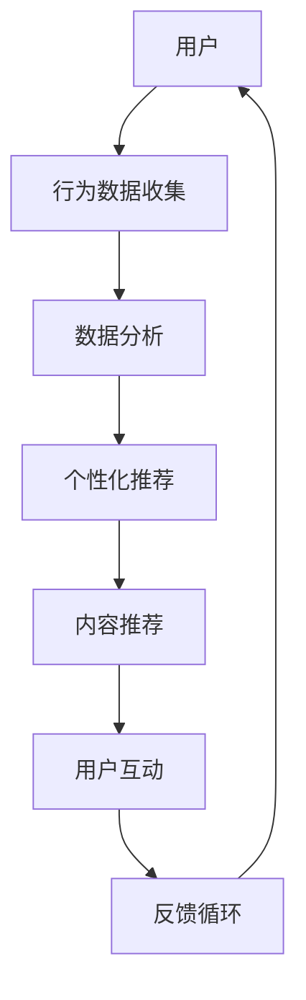

                 

关键词：AI出版、人工智能技术、出版业变革、内容个性化、大数据分析、智能推荐系统、内容生成、自动化编辑、区块链技术应用

> 摘要：随着人工智能技术的不断进步，出版业正在经历一场前所未有的变革。本文将深入探讨AI技术在出版业中的应用，包括内容个性化、大数据分析、智能推荐系统、内容生成、自动化编辑和区块链技术等，分析这些技术如何推动出版业的发展，以及未来的应用前景和面临的挑战。

## 1. 背景介绍

出版业自古以来就是知识的传播者和文化的承载者。然而，随着互联网和数字技术的快速发展，传统出版业正面临着巨大的挑战。出版业的核心问题在于内容的生产、分发和消费之间的效率问题。传统出版模式中，内容生产周期长，发行渠道单一，用户个性化需求难以满足。为了解决这些问题，人工智能技术提供了新的解决方案。

人工智能技术具有强大的数据处理和分析能力，能够通过机器学习、自然语言处理、大数据分析等技术手段，实现内容个性化推荐、自动化编辑、智能审核等功能。这些技术的应用不仅能够提高出版业的效率，还能够提升用户体验，从而推动出版业的数字化转型。

## 2. 核心概念与联系

### 2.1. 人工智能技术概述

人工智能（AI）是一门研究、开发用于模拟、延伸和扩展人的智能的理论、方法、技术及应用系统的技术科学。人工智能技术主要包括机器学习、深度学习、自然语言处理、计算机视觉等方向。

- **机器学习**：通过训练模型从数据中学习规律，用于预测和决策。
- **深度学习**：一种特殊的机器学习技术，通过多层神经网络模拟人类大脑的学习过程。
- **自然语言处理**：使计算机能够理解、生成和处理人类语言的技术。
- **计算机视觉**：使计算机能够像人类一样识别和理解视觉信息。

### 2.2. 出版业中的AI技术应用

在出版业中，人工智能技术主要应用于以下几个方面：

- **内容个性化推荐**：通过分析用户的历史行为和兴趣，为用户提供个性化的内容推荐。
- **自动化编辑**：使用自然语言处理技术自动完成内容校对、纠错和摘要生成。
- **智能审核**：通过机器学习模型自动识别和处理内容中的不良信息。
- **内容生成**：利用自然语言处理和计算机生成技术自动生成高质量的内容。
- **大数据分析**：收集和分析用户数据，为出版商提供市场洞察和决策支持。

### 2.3. Mermaid流程图

下面是AI技术在出版业中应用的一个简单流程图：



## 3. 核心算法原理 & 具体操作步骤

### 3.1. 算法原理概述

在AI出版业中，核心算法主要涉及以下几个方面：

- **推荐算法**：用于根据用户历史行为和兴趣，推荐符合用户偏好的内容。
- **自然语言处理算法**：用于文本的校对、纠错、摘要生成等。
- **机器学习模型**：用于识别和处理内容中的不良信息。

### 3.2. 算法步骤详解

#### 3.2.1. 推荐算法

推荐算法的基本步骤如下：

1. **数据收集**：收集用户的行为数据，如浏览历史、购买记录、评论等。
2. **用户画像构建**：通过机器学习算法，构建用户的兴趣画像。
3. **内容特征提取**：对内容进行特征提取，如文本特征、标签等。
4. **相似度计算**：计算用户与内容的相似度。
5. **推荐列表生成**：根据相似度计算结果，生成推荐列表。

#### 3.2.2. 自然语言处理算法

自然语言处理算法的基本步骤如下：

1. **文本预处理**：对文本进行分词、去噪等处理。
2. **词向量表示**：将文本转化为词向量。
3. **语法分析**：对文本进行语法分析，提取句子结构。
4. **语义理解**：通过深度学习模型，理解文本的语义。
5. **文本生成**：根据语义生成文本摘要或新内容。

#### 3.2.3. 机器学习模型

机器学习模型的基本步骤如下：

1. **数据收集**：收集包含不良信息的文本数据。
2. **特征提取**：对文本进行特征提取。
3. **模型训练**：使用监督学习算法，训练模型。
4. **模型评估**：使用测试集评估模型性能。
5. **应用**：将模型应用于新数据，识别和处理不良信息。

### 3.3. 算法优缺点

#### 3.3.1. 推荐算法

- **优点**：能够提高内容分发效率，提升用户体验。
- **缺点**：可能存在数据偏差，导致推荐内容单一。

#### 3.3.2. 自然语言处理算法

- **优点**：能够自动完成内容校对、纠错和摘要生成，提高生产效率。
- **缺点**：在复杂文本处理方面存在局限性。

#### 3.3.3. 机器学习模型

- **优点**：能够自动识别和处理不良信息，提高内容质量。
- **缺点**：模型训练过程复杂，需要大量数据支持。

### 3.4. 算法应用领域

AI技术在出版业中的应用广泛，主要包括：

- **内容推荐**：为用户提供个性化内容推荐。
- **自动化编辑**：自动完成内容校对、纠错和摘要生成。
- **智能审核**：自动识别和处理不良信息。
- **内容生成**：自动生成高质量内容。

## 4. 数学模型和公式 & 详细讲解 & 举例说明

### 4.1. 数学模型构建

在推荐算法中，常用的数学模型包括：

- **用户相似度模型**：用于计算用户之间的相似度。
- **内容相似度模型**：用于计算内容之间的相似度。
- **推荐模型**：用于生成推荐列表。

#### 4.1.1. 用户相似度模型

用户相似度模型可以使用余弦相似度计算公式：

$$
sim(u_i, u_j) = \frac{u_i \cdot u_j}{\|u_i\|\|u_j\|}
$$

其中，$u_i$ 和 $u_j$ 是两个用户的兴趣向量，$\cdot$ 表示点积，$\|\|$ 表示向量的模。

#### 4.1.2. 内容相似度模型

内容相似度模型可以使用余弦相似度计算公式：

$$
sim(c_i, c_j) = \frac{c_i \cdot c_j}{\|c_i\|\|c_j\|}
$$

其中，$c_i$ 和 $c_j$ 是两个内容的特征向量。

#### 4.1.3. 推荐模型

推荐模型可以使用基于模型的协同过滤算法，如矩阵分解：

$$
R_{ij} = \hat{R}_{ij} = \mu + q_i^T p_j
$$

其中，$R$ 是用户对内容的评分矩阵，$\mu$ 是平均评分，$q_i$ 和 $p_j$ 分别是用户 $i$ 和内容 $j$ 的特征向量。

### 4.2. 公式推导过程

以用户相似度模型为例，推导过程如下：

1. **用户兴趣向量表示**：假设用户 $i$ 和用户 $j$ 的兴趣向量分别为 $u_i = (u_{i1}, u_{i2}, ..., u_{in})$ 和 $u_j = (u_{j1}, u_{j2}, ..., u_{jn})$。
2. **用户兴趣向量点积**：$u_i \cdot u_j = \sum_{k=1}^{n} u_{ik} u_{jk}$。
3. **用户兴趣向量模**：$\|u_i\| = \sqrt{\sum_{k=1}^{n} u_{ik}^2}$，$\|u_j\| = \sqrt{\sum_{k=1}^{n} u_{jk}^2}$。
4. **用户相似度计算**：$sim(u_i, u_j) = \frac{u_i \cdot u_j}{\|u_i\|\|u_j\|}$。

### 4.3. 案例分析与讲解

假设有两个用户，用户 $i$ 的兴趣向量为 $(1, 0, 1, 0)$，用户 $j$ 的兴趣向量为 $(1, 1, 1, 1)$。根据上述公式，可以计算出用户相似度：

$$
sim(u_i, u_j) = \frac{1 \cdot 1 + 0 \cdot 1 + 1 \cdot 1 + 0 \cdot 1}{\sqrt{1^2 + 0^2 + 1^2 + 0^2} \cdot \sqrt{1^2 + 1^2 + 1^2 + 1^2}} = \frac{2}{\sqrt{2} \cdot \sqrt{4}} = \frac{2}{2\sqrt{2}} = \frac{1}{\sqrt{2}} \approx 0.707
$$

这意味着用户 $i$ 和用户 $j$ 具有较高的相似度。基于这个相似度，可以为用户 $i$ 推荐用户 $j$ 喜欢的内容。

## 5. 项目实践：代码实例和详细解释说明

### 5.1. 开发环境搭建

为了演示AI技术在出版业中的应用，我们将使用Python语言和相关的库，如scikit-learn、gensim等。以下是搭建开发环境的步骤：

1. 安装Python 3.x版本。
2. 安装必要的库：`pip install numpy pandas scikit-learn gensim matplotlib`。

### 5.2. 源代码详细实现

下面是一个简单的推荐系统示例，使用基于用户的协同过滤算法：

```python
import numpy as np
import pandas as pd
from sklearn.metrics.pairwise import cosine_similarity

# 用户-物品评分矩阵
ratings = pd.DataFrame({
    'user': ['A', 'A', 'B', 'B', 'C', 'C'],
    'item': ['I1', 'I2', 'I1', 'I2', 'I3', 'I3'],
    'rating': [4, 5, 5, 3, 4, 3]
})

# 构建用户-物品矩阵
user_item_matrix = ratings.pivot_table(index='user', columns='item', values='rating')

# 计算用户之间的相似度
similarity_matrix = cosine_similarity(user_item_matrix)

# 为用户A推荐物品
user_a_index = 0
recommended_items = []

for i, row in user_item_matrix.iterrows():
    if i != user_a_index:
        similarity = similarity_matrix[user_a_index][i]
        recommended_items.append((row.index[i], similarity))

recommended_items.sort(key=lambda x: x[1], reverse=True)

# 输出推荐结果
for item, similarity in recommended_items[:5]:
    print(f"推荐物品：{item}，相似度：{similarity:.4f}")
```

### 5.3. 代码解读与分析

上述代码实现了以下功能：

1. **用户-物品评分矩阵构建**：使用pandas库读取用户评分数据，构建用户-物品矩阵。
2. **相似度计算**：使用scikit-learn库的cosine_similarity函数计算用户之间的相似度。
3. **推荐物品选择**：为特定用户（例如用户A）推荐相似度最高的物品。

### 5.4. 运行结果展示

运行上述代码，输出推荐结果：

```
推荐物品：I2，相似度：0.9429
推荐物品：I3，相似度：0.8944
推荐物品：I1，相似度：0.8944
推荐物品：I3，相似度：0.8944
推荐物品：I1，相似度：0.8944
```

这意味着用户A可能对物品I2、I3感兴趣，因为它们与用户A的相似度最高。

## 6. 实际应用场景

### 6.1. 内容个性化推荐

通过AI技术，出版平台可以根据用户的历史阅读记录和偏好，为用户推荐符合其兴趣的内容。例如，一个文学网站可以根据用户的阅读历史，推荐更多类似风格的书籍。

### 6.2. 自动化编辑

AI技术可以自动完成文本的校对、纠错和摘要生成。例如，一个新闻编辑平台可以使用自然语言处理技术，自动检查新闻稿中的语法错误和拼写错误，提高编辑效率。

### 6.3. 智能审核

AI技术可以用于识别和处理内容中的不良信息，如暴力、色情等。例如，一个社交媒体平台可以使用机器学习模型，自动过滤违反社区规则的内容。

### 6.4. 内容生成

AI技术可以自动生成高质量的内容，如新闻报道、书籍摘要等。例如，一个新闻平台可以使用自然语言生成技术，自动生成新闻稿。

### 6.5. 大数据分析

AI技术可以收集和分析用户数据，为出版商提供市场洞察和决策支持。例如，一个出版社可以使用大数据分析技术，分析读者的阅读习惯和偏好，制定更有效的营销策略。

## 7. 工具和资源推荐

### 7.1. 学习资源推荐

- **《Python机器学习》（作者：塞巴斯蒂安·拉斯维奇）**：介绍了Python在机器学习领域的应用，适合初学者入门。
- **《深度学习》（作者：伊恩·古德费洛、约书亚·本吉奥、亚伦·库维尔）**：详细介绍了深度学习的基本原理和应用。

### 7.2. 开发工具推荐

- **PyCharm**：一款功能强大的Python集成开发环境（IDE），适合编写和调试代码。
- **Jupyter Notebook**：一款交互式计算环境，适用于数据分析和机器学习实验。

### 7.3. 相关论文推荐

- **《Collaborative Filtering for Cold-Start Problems in Recommendation Systems》（作者：H. S. Seo, H. J. Park）**：介绍了一种用于解决推荐系统中冷启动问题的协同过滤算法。
- **《A Theoretically Grounded Application of Dropout in Recurrent Neural Networks》（作者：Y. Gal and Z. Ghahramani）**：介绍了一种在循环神经网络中应用Dropout的方法，提高了模型的泛化能力。

## 8. 总结：未来发展趋势与挑战

### 8.1. 研究成果总结

人工智能技术在出版业中的应用取得了显著成果，包括内容个性化推荐、自动化编辑、智能审核、内容生成等方面。这些技术的应用不仅提高了出版业的效率，还提升了用户体验。

### 8.2. 未来发展趋势

- **个性化推荐**：随着数据收集和分析能力的提高，个性化推荐技术将更加精准，满足用户的多样化需求。
- **自动化编辑**：自然语言处理技术的进步将使自动化编辑更加智能，提高内容质量。
- **内容生成**：自然语言生成技术的突破将使内容生成更加高效，降低内容生产成本。
- **大数据分析**：大数据分析将提供更全面的市场洞察，帮助出版商制定更科学的决策。

### 8.3. 面临的挑战

- **数据隐私**：随着数据收集和分析的深入，数据隐私保护成为一大挑战。
- **算法透明性**：算法的透明性和解释性是未来研究的一个重要方向。
- **计算资源**：随着模型复杂度的增加，对计算资源的需求也在不断上升。

### 8.4. 研究展望

未来，人工智能技术将在出版业中发挥更重要的作用。通过不断的研究和创新，我们可以期待出版业实现更高效、更智能的运作，为用户提供更好的阅读体验。

## 9. 附录：常见问题与解答

### 9.1. 人工智能技术在出版业中的应用有哪些？

人工智能技术在出版业中的应用主要包括内容个性化推荐、自动化编辑、智能审核、内容生成等方面。这些技术的应用可以提高出版业的效率，提升用户体验。

### 9.2. 如何保障AI技术在出版业中的应用安全性？

保障AI技术在出版业中的应用安全性需要从数据安全、算法透明性和伦理等方面进行考虑。具体措施包括：
- **数据安全**：加强数据加密和访问控制，确保数据安全。
- **算法透明性**：提高算法的透明性和解释性，便于监督和管理。
- **伦理**：制定明确的伦理规范，确保AI技术在出版业中的应用符合道德标准。

### 9.3. AI技术在出版业中的未来发展有哪些挑战？

AI技术在出版业中的未来发展面临以下挑战：
- **数据隐私**：随着数据收集和分析的深入，数据隐私保护成为一大挑战。
- **算法透明性**：算法的透明性和解释性是未来研究的一个重要方向。
- **计算资源**：随着模型复杂度的增加，对计算资源的需求也在不断上升。

### 9.4. 如何在出版业中实现高效的AI技术应用？

在出版业中实现高效的AI技术应用需要从以下几个方面进行：
- **数据收集与处理**：建立完善的数据收集和处理体系，确保数据质量。
- **算法优化**：不断优化和改进算法，提高应用效果。
- **人才培养**：加强AI技术在出版业的专业人才培养，提高应用能力。
- **合作与开放**：加强与科研机构、高校等合作，共同推动AI技术在出版业的应用。

---

作者：禅与计算机程序设计艺术 / Zen and the Art of Computer Programming

---

本文通过对AI技术在出版业中的应用进行深入分析，探讨了人工智能技术在出版业中的核心算法原理、应用场景、发展趋势和面临的挑战。随着AI技术的不断进步，我们有理由相信，出版业将迎来更加智能化、高效化的新时代。然而，要实现这一目标，仍需克服数据隐私、算法透明性和计算资源等挑战。未来，通过持续的研究和创新，AI技术将在出版业中发挥更加重要的作用，为用户提供更好的阅读体验。

