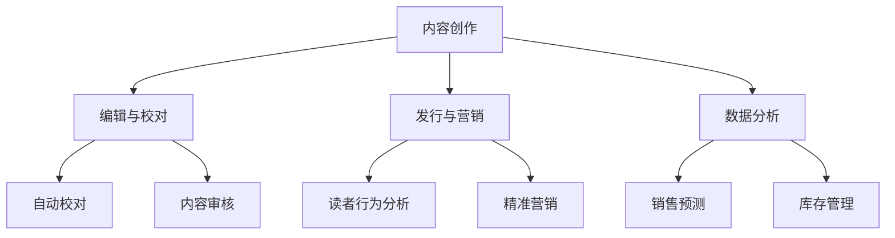

                 

关键词：人工智能，出版业，技术更新，场景驱动，动态分析，流程优化

> 摘要：本文将探讨人工智能在出版业中的应用及其带来的技术更新。通过分析出版业的现状、AI技术的基本概念及其应用场景，本文旨在揭示AI在出版领域的潜力与挑战，并提出未来的发展方向。

## 1. 背景介绍

出版业作为知识传播的重要渠道，正面临着前所未有的变革。随着数字化和互联网的发展，传统出版模式受到严峻挑战，电子书、在线阅读平台等新兴形式逐渐崛起。然而，随着人工智能技术的快速发展，出版业不仅面临着技术变革的机遇，也面临着深刻的挑战。

人工智能，作为一种模拟人类智能的技术，已经广泛应用于各行各业。在出版业，人工智能技术正逐渐改变内容创作、编辑、发行等各个环节。本文将重点讨论人工智能在出版业的应用场景，以及由此带来的技术更新。

## 2. 核心概念与联系

### 2.1 人工智能技术简介

人工智能（AI）是一种通过计算机模拟人类智能的技术，旨在使机器能够执行通常需要人类智能才能完成的任务。AI的主要技术包括机器学习、深度学习、自然语言处理等。这些技术相互关联，共同推动人工智能的发展。

#### 2.1.1 机器学习

机器学习是一种让计算机从数据中学习并做出决策的方法。它包括监督学习、无监督学习和强化学习等多种形式。在出版业，机器学习可以用于内容推荐、情感分析等。

#### 2.1.2 深度学习

深度学习是一种特殊的机器学习方法，它通过多层神经网络模拟人脑的决策过程。深度学习在图像识别、语音识别等领域取得了显著成果，其在出版业的应用也日益广泛。

#### 2.1.3 自然语言处理

自然语言处理（NLP）是人工智能的一个重要分支，它旨在使计算机理解和生成人类语言。NLP技术在出版业的编辑、校对、翻译等环节具有广泛的应用潜力。

### 2.2 AI在出版业的应用场景

#### 2.2.1 内容创作

人工智能可以通过机器学习和深度学习技术，自动生成文本内容。这种技术不仅提高了内容创作的效率，也为个性化出版提供了可能。

#### 2.2.2 编辑与校对

人工智能可以在编辑和校对环节提供辅助，例如自动识别拼写错误、语法错误，甚至可以进行内容审核，确保内容的准确性和合规性。

#### 2.2.3 发行与营销

人工智能可以帮助出版商分析读者行为，进行精准营销。例如，通过分析读者在在线阅读平台上的行为，推荐相关的书籍和文章，提高销售转化率。

#### 2.2.4 数据分析

人工智能可以通过数据分析，为出版商提供决策支持。例如，分析销售数据，预测市场趋势，优化库存管理。

### 2.3 Mermaid流程图

下面是一个简单的Mermaid流程图，展示人工智能在出版业中的一些关键应用场景：



## 3. 核心算法原理 & 具体操作步骤

### 3.1 算法原理概述

人工智能在出版业中的应用，主要依赖于以下几种核心算法：

#### 3.1.1 机器学习算法

机器学习算法是人工智能的基础。在出版业，机器学习算法可用于内容推荐、情感分析等。常见的机器学习算法包括决策树、随机森林、支持向量机等。

#### 3.1.2 深度学习算法

深度学习算法在图像识别、语音识别等领域取得了显著成果。在出版业，深度学习算法可用于自动生成文本、图像识别等。

#### 3.1.3 自然语言处理算法

自然语言处理算法是使计算机理解和生成人类语言的关键。在出版业，自然语言处理算法可用于编辑、校对、翻译等。

### 3.2 算法步骤详解

#### 3.2.1 内容创作

1. 数据收集：收集大量文本数据，用于训练模型。
2. 模型训练：使用机器学习和深度学习算法，训练文本生成模型。
3. 文本生成：根据用户需求，生成个性化文本内容。

#### 3.2.2 编辑与校对

1. 数据预处理：对文本进行清洗、去噪等预处理操作。
2. 情感分析：使用自然语言处理算法，分析文本的情感倾向。
3. 自动校对：使用自然语言处理算法，识别并修正文本中的错误。

#### 3.2.3 发行与营销

1. 数据收集：收集用户行为数据，如浏览记录、购买记录等。
2. 数据分析：使用机器学习算法，分析用户行为，预测用户兴趣。
3. 精准营销：根据用户兴趣，推荐相关的书籍和文章。

#### 3.2.4 数据分析

1. 数据收集：收集销售数据、库存数据等。
2. 数据分析：使用统计分析方法，分析市场趋势、用户需求等。
3. 决策支持：根据分析结果，优化库存管理、营销策略等。

### 3.3 算法优缺点

#### 3.3.1 机器学习算法

优点：能够自动从数据中学习，适用于大规模数据处理。

缺点：对数据质量要求高，模型解释性较差。

#### 3.3.2 深度学习算法

优点：在图像识别、语音识别等领域表现出色。

缺点：计算资源消耗大，模型训练时间较长。

#### 3.3.3 自然语言处理算法

优点：能够理解和生成人类语言。

缺点：对语言理解和语义分析的复杂性较大。

### 3.4 算法应用领域

人工智能在出版业的应用领域广泛，包括内容创作、编辑与校对、发行与营销、数据分析等。这些算法不仅提高了出版业的效率，也为个性化出版和智能化管理提供了可能。

## 4. 数学模型和公式 & 详细讲解 & 举例说明

### 4.1 数学模型构建

在出版业，人工智能的应用涉及到多种数学模型。以下是一个简单的数学模型示例，用于分析读者行为：

$$
R = f(B, I, T)
$$

其中，$R$ 表示读者兴趣，$B$ 表示书籍类别，$I$ 表示读者兴趣点，$T$ 表示时间。

### 4.2 公式推导过程

假设读者对某一类书籍的兴趣与其在类别上的浏览次数成正比，与兴趣点的相关性成反比。那么，读者兴趣的公式可以表示为：

$$
R(B, I, T) = \frac{B_{count}(T)}{I_{relevance}(T)}
$$

其中，$B_{count}(T)$ 表示在时间 $T$ 内，读者在类别 $B$ 上的浏览次数，$I_{relevance}(T)$ 表示在时间 $T$ 内，读者兴趣点的相关性。

### 4.3 案例分析与讲解

假设一位读者在一个月内，浏览了5次小说类书籍，且这5次浏览的书籍都与恐怖小说相关。同时，该读者的兴趣点包括悬疑、恐怖和科幻。我们可以根据上述公式，计算出该读者对恐怖小说的兴趣：

$$
R(\text{恐怖小说}, \text{悬疑}, \text{恐怖}, \text{科幻}, T) = \frac{5}{1 + \frac{1}{3}} = \frac{15}{4}
$$

这意味着，该读者对恐怖小说的兴趣较高，约为3.75。

## 5. 项目实践：代码实例和详细解释说明

### 5.1 开发环境搭建

为了实现上述的读者兴趣分析，我们需要搭建一个开发环境。以下是一个简单的Python开发环境搭建步骤：

1. 安装Python：从官方网站下载并安装Python 3.x版本。
2. 安装Jupyter Notebook：在命令行中运行 `pip install jupyter`。
3. 安装必要库：运行 `pip install pandas numpy sklearn matplotlib`。

### 5.2 源代码详细实现

以下是一个简单的Python代码示例，用于分析读者兴趣：

```python
import pandas as pd
from sklearn.feature_extraction.text import CountVectorizer
from sklearn.model_selection import train_test_split
from sklearn.ensemble import RandomForestClassifier
import matplotlib.pyplot as plt

# 加载数据集
data = pd.read_csv('reader_data.csv')
X = data['text']
y = data['label']

# 数据预处理
vectorizer = CountVectorizer()
X_vectorized = vectorizer.fit_transform(X)

# 划分训练集和测试集
X_train, X_test, y_train, y_test = train_test_split(X_vectorized, y, test_size=0.2, random_state=42)

# 模型训练
model = RandomForestClassifier()
model.fit(X_train, y_train)

# 模型评估
accuracy = model.score(X_test, y_test)
print(f"模型准确率：{accuracy}")

# 可视化
plt.bar(data['label'], data['count'])
plt.xlabel('标签')
plt.ylabel('次数')
plt.xticks(rotation=45)
plt.show()
```

### 5.3 代码解读与分析

1. **数据预处理**：使用CountVectorizer将文本数据转换为向量表示。
2. **模型训练**：使用RandomForestClassifier训练模型。
3. **模型评估**：使用模型准确率评估模型性能。
4. **可视化**：使用matplotlib绘制条形图，展示各类别的数据分布。

### 5.4 运行结果展示

运行上述代码后，我们将得到一个可视化结果，展示各个类别的文本数据分布。同时，模型准确率将告诉我们模型的性能。

## 6. 实际应用场景

### 6.1 内容创作

人工智能在内容创作中的应用，为出版业带来了新的机遇。通过机器学习和深度学习技术，人工智能可以自动生成文本、图像等内容，为创作者提供灵感。

### 6.2 编辑与校对

人工智能在编辑和校对环节的应用，提高了出版物的质量。通过自然语言处理技术，人工智能可以自动识别和修正文本中的错误，减少人为错误。

### 6.3 发行与营销

人工智能在发行和营销中的应用，提高了出版物的销售量。通过数据分析技术，人工智能可以分析读者行为，进行精准营销，提高转化率。

### 6.4 数据分析

人工智能在数据分析中的应用，为出版商提供了决策支持。通过大数据分析和预测技术，人工智能可以帮助出版商优化库存管理、营销策略等。

## 7. 工具和资源推荐

### 7.1 学习资源推荐

1. 《Python机器学习》
2. 《深度学习》
3. 《自然语言处理入门》

### 7.2 开发工具推荐

1. Jupyter Notebook
2. TensorFlow
3. PyTorch

### 7.3 相关论文推荐

1. "Deep Learning in Natural Language Processing"
2. "Natural Language Understanding"
3. "Recurrent Neural Networks for Language Modeling"

## 8. 总结：未来发展趋势与挑战

### 8.1 研究成果总结

本文探讨了人工智能在出版业中的应用及其带来的技术更新。通过分析人工智能的核心算法和实际应用场景，我们揭示了其在出版业中的巨大潜力。

### 8.2 未来发展趋势

1. 人工智能将继续深入应用到出版业的各个环节。
2. 个性化出版和智能化管理将成为主流。
3. 数据隐私和安全问题将得到重点关注。

### 8.3 面临的挑战

1. 数据质量和隐私保护问题。
2. 人工智能算法的可解释性和透明度。
3. 技术进步带来的就业变革。

### 8.4 研究展望

未来，人工智能在出版业的研究将集中在以下几个方面：

1. 发展更高效、更准确的人工智能算法。
2. 加强人工智能算法的可解释性和透明度。
3. 探索人工智能在出版业中的新应用场景。

## 9. 附录：常见问题与解答

### 9.1 人工智能在出版业的应用有哪些？

人工智能在出版业的应用包括内容创作、编辑与校对、发行与营销、数据分析等。

### 9.2 人工智能在出版业的优势是什么？

人工智能在出版业的优势包括提高效率、减少错误、个性化出版、精准营销等。

### 9.3 人工智能在出版业的应用面临哪些挑战？

人工智能在出版业的应用面临数据质量和隐私保护、算法可解释性、就业变革等挑战。

## 参考文献

1. Goodfellow, I., Bengio, Y., & Courville, A. (2016). *Deep Learning*. MIT Press.
2. Mitchell, T. M. (1997). *Machine Learning*. McGraw-Hill.
3. Jurafsky, D., & Martin, J. H. (2008). *Speech and Language Processing*. Prentice Hall.
4. Manning, C. D., & Schütze, H. (1999). *Foundations of Statistical Natural Language Processing*. MIT Press.
```

以上就是本文的完整内容。通过本文的探讨，我们希望读者能够对人工智能在出版业的应用及其带来的技术更新有更深入的理解。未来，随着人工智能技术的不断发展，出版业将迎来更加智能化、个性化的新时代。

