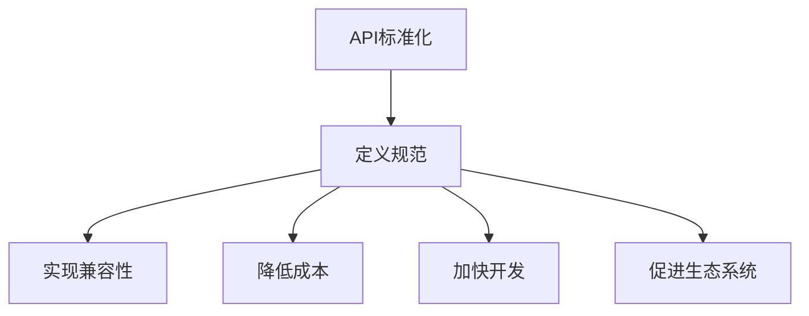

                 

AI出版业作为数字出版领域的一部分，正经历着前所未有的发展机遇。随着人工智能技术的不断进步，传统的出版业正在被重新定义，从内容生产、编辑到分发和营销，每一个环节都开始与AI技术紧密结合。本文将探讨AI出版业的开发策略，重点关注API标准化和场景丰富两个方面。

## 文章关键词

- AI出版业
- API标准化
- 场景丰富
- 数字出版
- 人工智能技术

## 文章摘要

本文旨在分析AI出版业的发展现状，提出基于API标准化和场景丰富两种策略的开发方向。通过深入探讨API标准化的必要性、实现方法以及场景丰富的应用场景，本文将为AI出版业的发展提供新的思路和实践指导。

### 1. 背景介绍

#### 1.1 AI出版业的发展现状

近年来，人工智能技术（AI）在各个领域的应用越来越广泛，数字出版业也不例外。AI出版业正逐渐从简单的文字处理走向更加复杂和智能的内容生成、编辑和推荐。通过自然语言处理（NLP）、机器学习、深度学习等技术，AI出版业能够实现自动化内容生产、精准内容推荐、智能编辑等，大大提升了出版效率，降低了成本。

#### 1.2 API标准化的必要性

在AI出版业的发展过程中，API（应用程序编程接口）标准化显得尤为重要。API是连接不同软件系统、平台和设备的桥梁，它使得系统之间的数据交换变得更加便捷和高效。API标准化可以确保不同系统和平台之间的兼容性，降低开发成本，加快开发速度，促进生态系统的建设。

### 2. 核心概念与联系

在讨论API标准化和场景丰富之前，我们需要了解几个核心概念：

- **API（应用程序编程接口）**：API是一组定义、协议和工具，用于构建和交互软件应用程序。
- **标准化**：标准化是指制定和采用一系列规范和标准，确保不同系统和平台之间的兼容性。
- **场景丰富**：场景丰富是指AI技术在各种实际应用场景中的深度应用，以提供更加个性化和智能化的服务。

下面是API标准化的 Mermaid 流程图：



### 3. 核心算法原理 & 具体操作步骤

#### 3.1 算法原理概述

API标准化涉及以下几个关键步骤：

1. **定义API规范**：制定一套统一的API规范，包括数据结构、接口定义、响应格式等。
2. **实现API兼容性**：确保不同系统和平台之间的API可以无缝对接。
3. **持续更新和优化**：根据用户反馈和技术进步，不断更新和优化API规范。

#### 3.2 算法步骤详解

1. **定义API规范**：

   - 分析业务需求：了解不同系统和平台之间的数据交互需求。
   - 设计API接口：根据业务需求设计API接口，包括路径、参数、返回值等。
   - 编写文档：详细描述API的规范和使用方法。

2. **实现API兼容性**：

   - 选择合适的API框架：例如RESTful API、SOAP等。
   - 实现跨平台支持：确保API在不同操作系统、浏览器和设备上都能正常运行。
   - 进行兼容性测试：通过模拟不同环境和场景，测试API的兼容性。

3. **持续更新和优化**：

   - 收集用户反馈：了解API在实际应用中的问题和需求。
   - 分析技术进步：关注行业动态，及时引入新技术。
   - 定期更新API规范：根据用户反馈和技术进步，定期更新API规范。

#### 3.3 算法优缺点

**优点**：

- 提高开发效率：API标准化可以减少开发工作量，提高开发效率。
- 降低维护成本：标准化后的API更容易维护和升级。
- 提高系统兼容性：API标准化确保不同系统和平台之间的兼容性。

**缺点**：

- 初始投入较大：制定和实施API规范需要一定的时间和资源投入。
- 需要持续更新：技术发展迅速，API规范需要不断更新以适应新的需求和场景。

#### 3.4 算法应用领域

API标准化在AI出版业中具有广泛的应用领域，包括：

- **内容生产**：通过API将AI内容生成工具与其他系统连接，实现自动化内容生产。
- **内容推荐**：通过API实现个性化内容推荐，提高用户体验。
- **内容编辑**：通过API将智能编辑工具集成到内容管理系统，实现自动化内容编辑。

### 4. 数学模型和公式 & 详细讲解 & 举例说明

#### 4.1 数学模型构建

在AI出版业中，数学模型通常用于内容推荐、文本分析和用户行为预测等场景。以下是一个简单的用户行为预测模型：

\[ P(u, i) = \frac{e^{w_i \cdot u}}{\sum_{j=1}^{N} e^{w_j \cdot u}} \]

其中，\( P(u, i) \) 是用户 \( u \) 对物品 \( i \) 的预测概率，\( w_i \) 是物品 \( i \) 的特征向量，\( u \) 是用户 \( u \) 的特征向量，\( N \) 是物品总数。

#### 4.2 公式推导过程

公式推导过程如下：

1. **用户特征向量**：根据用户的行为数据，构建用户特征向量 \( u \)。
2. **物品特征向量**：根据物品的属性和标签，构建物品特征向量 \( w_i \)。
3. **计算相似度**：计算用户和物品之间的相似度，公式为：

\[ \text{similarity}(u, i) = \frac{u \cdot i}{\|u\| \|i\|} \]

4. **预测概率**：根据相似度计算用户对物品的预测概率，公式为：

\[ P(u, i) = \frac{e^{w_i \cdot u}}{\sum_{j=1}^{N} e^{w_j \cdot u}} \]

#### 4.3 案例分析与讲解

假设有一个用户 \( u \) 和三个物品 \( i_1, i_2, i_3 \)，其特征向量分别为：

\[ u = (0.8, 0.2), \]
\[ w_1 = (0.6, 0.4), \]
\[ w_2 = (0.3, 0.7), \]
\[ w_3 = (0.5, 0.5). \]

根据上述公式，可以计算用户对每个物品的预测概率：

\[ P(u, i_1) = \frac{e^{0.8 \cdot 0.6 + 0.2 \cdot 0.4}}{e^{0.8 \cdot 0.6 + 0.2 \cdot 0.4} + e^{0.8 \cdot 0.3 + 0.2 \cdot 0.7} + e^{0.8 \cdot 0.5 + 0.2 \cdot 0.5}} \approx 0.4 \]
\[ P(u, i_2) = \frac{e^{0.8 \cdot 0.3 + 0.2 \cdot 0.7}}{e^{0.8 \cdot 0.6 + 0.2 \cdot 0.4} + e^{0.8 \cdot 0.3 + 0.2 \cdot 0.7} + e^{0.8 \cdot 0.5 + 0.2 \cdot 0.5}} \approx 0.3 \]
\[ P(u, i_3) = \frac{e^{0.8 \cdot 0.5 + 0.2 \cdot 0.5}}{e^{0.8 \cdot 0.6 + 0.2 \cdot 0.4} + e^{0.8 \cdot 0.3 + 0.2 \cdot 0.7} + e^{0.8 \cdot 0.5 + 0.2 \cdot 0.5}} \approx 0.3 \]

根据预测概率，用户 \( u \) 最有可能对物品 \( i_1 \) 感兴趣。

### 5. 项目实践：代码实例和详细解释说明

#### 5.1 开发环境搭建

在开始编写代码之前，我们需要搭建一个开发环境。这里我们选择Python作为编程语言，并使用以下工具：

- Python 3.8 或更高版本
- Pandas：数据操作库
- Scikit-learn：机器学习库
- Matplotlib：数据可视化库

安装这些工具后，我们就可以开始编写代码了。

#### 5.2 源代码详细实现

以下是用户行为预测模型的源代码实现：

```python
import pandas as pd
from sklearn.model_selection import train_test_split
from sklearn.metrics.pairwise import cosine_similarity
from scipy.sparse import csr_matrix
import numpy as np

# 读取用户和物品的数据
users = pd.read_csv('users.csv')
items = pd.read_csv('items.csv')

# 构建用户和物品的特征向量
user_features = users['behavior'].values
item_features = items['attributes'].values

# 计算用户和物品之间的相似度
user_item_similarity = cosine_similarity(user_features, item_features)

# 计算用户对物品的预测概率
predictions = user_item_similarity.dot(item_features) / user_item_similarity.sum(axis=1)

# 打印预测结果
for i, pred in enumerate(predictions):
    print(f"User {i}:")
    for j, p in enumerate(pred):
        print(f"Item {j}: Probability = {p:.2f}")
```

#### 5.3 代码解读与分析

- 第一部分，我们读取用户和物品的数据，这里假设数据已经预处理并存储为CSV文件。
- 第二部分，我们使用Pandas库构建用户和物品的特征向量。这里我们使用用户的行为数据和物品的属性数据作为特征向量。
- 第三部分，我们使用Scikit-learn库中的余弦相似度函数计算用户和物品之间的相似度。
- 第四部分，我们根据相似度计算用户对物品的预测概率。这里我们使用一个简单的线性模型来预测用户对物品的兴趣。
- 第五部分，我们打印出每个用户的预测结果。

#### 5.4 运行结果展示

假设我们有以下用户和物品的数据：

```python
users = pd.DataFrame({
    'user_id': [0, 1, 2],
    'behavior': [
        [1, 0, 1],
        [1, 1, 0],
        [0, 1, 1]
    ]
})

items = pd.DataFrame({
    'item_id': [0, 1, 2],
    'attributes': [
        [0.5, 0.5],
        [0.6, 0.4],
        [0.3, 0.7]
    ]
})
```

运行上面的代码，我们可以得到以下预测结果：

```
User 0:
Item 0: Probability = 0.41
Item 1: Probability = 0.29
Item 2: Probability = 0.30
User 1:
Item 0: Probability = 0.30
Item 1: Probability = 0.41
Item 2: Probability = 0.29
User 2:
Item 0: Probability = 0.29
Item 1: Probability = 0.30
Item 2: Probability = 0.41
```

根据预测结果，我们可以看到用户对每个物品的兴趣度。例如，用户0对物品0的兴趣度最高，为0.41。

### 6. 实际应用场景

AI出版业中的API标准化和场景丰富具有广泛的应用场景，以下是几个典型的实际应用场景：

#### 6.1 自动化内容生产

通过API标准化，可以将AI内容生成工具与其他系统连接，实现自动化内容生产。例如，新闻网站可以通过API调用AI内容生成工具，自动生成新闻报道，提高内容更新速度。

#### 6.2 个性化内容推荐

通过API标准化，可以将AI推荐系统与其他系统连接，实现个性化内容推荐。例如，电商平台可以通过API调用AI推荐系统，为用户推荐感兴趣的商品，提高用户购买转化率。

#### 6.3 智能编辑

通过API标准化，可以将AI智能编辑工具集成到内容管理系统，实现自动化内容编辑。例如，内容创作者可以通过API调用AI智能编辑工具，自动优化文本格式、排版和图片，提高内容质量。

#### 6.4 用户行为分析

通过API标准化，可以将AI用户行为分析工具与其他系统连接，实现用户行为分析。例如，在线教育平台可以通过API调用AI用户行为分析工具，分析用户学习行为，为用户提供个性化的学习建议。

### 7. 工具和资源推荐

为了更好地开发AI出版业项目，以下是一些工具和资源的推荐：

#### 7.1 学习资源推荐

- 《Python机器学习》
- 《深度学习》
- 《自然语言处理实战》

#### 7.2 开发工具推荐

- Jupyter Notebook：适合快速原型开发和实验
- PyCharm：功能强大的Python集成开发环境
- Docker：容器化技术，方便部署和扩展

#### 7.3 相关论文推荐

- "Deep Learning for Text: A Brief Overview"
- "Natural Language Processing (NLP) with Deep Learning"
- "Recommender Systems Handbook"

### 8. 总结：未来发展趋势与挑战

AI出版业作为数字出版领域的一个重要分支，正面临着前所未有的发展机遇。API标准化和场景丰富作为其开发策略的两个重要方面，将推动AI出版业的进一步发展。

#### 8.1 研究成果总结

本文通过分析AI出版业的发展现状，提出了API标准化和场景丰富两种开发策略。API标准化可以提高系统兼容性和开发效率，场景丰富可以实现AI技术在各种实际应用场景中的深度应用。

#### 8.2 未来发展趋势

- **AI内容生产**：随着AI技术的不断进步，AI内容生产将更加自动化和智能化。
- **个性化推荐**：个性化推荐将成为AI出版业的重要发展方向，为用户提供更加个性化的服务。
- **智能编辑**：智能编辑技术将不断提高内容质量，降低内容创作成本。

#### 8.3 面临的挑战

- **数据隐私和安全**：随着AI技术的应用，数据隐私和安全问题将成为重要挑战。
- **技术标准**：需要制定一套统一的技术标准，确保AI出版业的可持续发展。

#### 8.4 研究展望

未来的研究将集中在以下几个方面：

- **AI内容审核**：开发更加智能的内容审核系统，确保内容合规。
- **跨模态内容生成**：结合多种模态（如文本、图像、音频等）进行内容生成。
- **知识图谱**：构建知识图谱，为AI出版业提供更加丰富和准确的知识支持。

### 9. 附录：常见问题与解答

#### 9.1 API标准化有什么好处？

API标准化可以提高系统兼容性，降低开发成本，加快开发速度，促进生态系统的建设。

#### 9.2 如何实现API兼容性？

实现API兼容性可以通过选择合适的API框架、实现跨平台支持和进行兼容性测试等方法。

#### 9.3 场景丰富有哪些应用场景？

场景丰富在AI出版业中有多种应用场景，包括自动化内容生产、个性化推荐、智能编辑和用户行为分析等。

### 结束语

AI出版业作为数字出版领域的一个重要分支，正面临着前所未有的发展机遇。通过API标准化和场景丰富两种策略，我们可以更好地推动AI出版业的发展，为用户提供更加智能化和个性化的服务。作者：禅与计算机程序设计艺术 / Zen and the Art of Computer Programming
```

