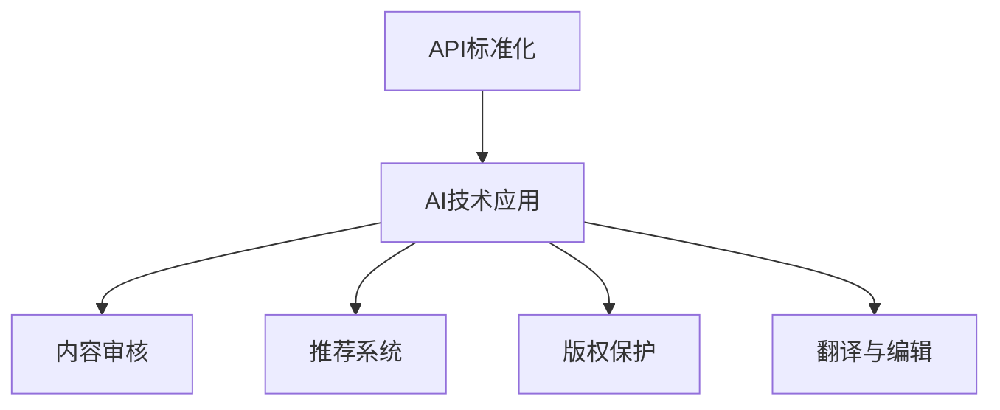

                 

关键词：人工智能、API标准化、出版业、开发、场景丰富

> 摘要：本文旨在探讨AI在出版业中的应用，重点关注API标准化和场景丰富的开发策略。通过分析现有技术和实践，本文提出了一个全面的开发框架，旨在提升出版业的技术水平和效率。

## 1. 背景介绍

随着数字技术的飞速发展，出版业正经历着深刻的变革。传统的出版模式逐渐被互联网和人工智能所颠覆，数字化、智能化成为出版业发展的必然趋势。在这个背景下，AI出版业的开发成为了一个重要的研究方向。

API（应用程序编程接口）作为连接不同软件系统的重要桥梁，其标准化和丰富性对于AI出版业的开发至关重要。标准化的API可以降低不同系统之间的集成难度，提高开发效率；而丰富的API场景则为出版业提供了更多的创新机会。

本文将围绕API标准化和场景丰富的开发策略，探讨AI在出版业中的应用。首先，我们将介绍API的基本概念和标准化的必要性；然后，分析AI技术在出版业中的应用场景；最后，提出一个全面的开发框架，以期为AI出版业的未来发展提供参考。

## 2. 核心概念与联系

### 2.1 API的基本概念

API是应用程序编程接口的缩写，它定义了不同软件之间相互通信的规则和标准。通过API，开发者可以方便地访问和使用第三方系统的功能，而无需了解其内部实现细节。API在软件开发中扮演着重要的角色，它使得系统的可扩展性和互操作性成为可能。

### 2.2 API标准化的重要性

API标准化是指在API的设计和实现过程中，遵循一定的规范和标准。标准化的API具有以下优势：

- **降低集成难度**：标准化的API使得不同系统之间的集成变得更加简单和高效，从而降低了开发成本。
- **提高兼容性**：标准化的API有助于确保不同系统之间的兼容性，避免了因为接口不统一而导致的问题。
- **提升开发效率**：标准化的API为开发者提供了统一的接口，使得开发过程更加直观和高效。

### 2.3 AI技术在出版业中的应用场景

AI技术在出版业中的应用场景丰富多样，主要包括以下几个方面：

- **内容审核**：利用自然语言处理（NLP）技术对出版内容进行审核，识别违规或不适宜的内容。
- **推荐系统**：通过机器学习算法分析用户行为和偏好，为读者提供个性化的阅读推荐。
- **版权保护**：利用区块链技术实现对出版内容的版权保护和追溯。
- **翻译与编辑**：利用机器翻译和自然语言生成技术，提高出版内容的可读性和多样性。

### 2.4 Mermaid流程图

以下是一个简单的Mermaid流程图，展示了API标准化和AI技术在出版业中的应用流程：



## 3. 核心算法原理 & 具体操作步骤

### 3.1 算法原理概述

在AI出版业的开发中，核心算法主要涉及自然语言处理（NLP）、机器学习（ML）和深度学习（DL）等技术。以下是这些算法的基本原理概述：

- **自然语言处理（NLP）**：NLP是AI领域的一个重要分支，它关注于使计算机能够理解、解释和生成人类语言。NLP技术主要包括文本分类、情感分析、命名实体识别等。
- **机器学习（ML）**：ML是一种通过从数据中学习规律和模式来改善系统性能的方法。在AI出版业中，ML技术可以用于推荐系统、内容审核等。
- **深度学习（DL）**：DL是一种基于神经网络的学习方法，具有强大的表示和学习能力。在AI出版业中，DL技术可以用于图像识别、语音识别等领域。

### 3.2 算法步骤详解

以下是AI技术在出版业中应用的具体步骤：

- **数据收集**：收集相关的出版数据，包括文本、图片、音频等。
- **数据处理**：对收集到的数据进行预处理，包括去噪、清洗、格式化等。
- **模型训练**：利用预处理后的数据，训练相应的NLP、ML或DL模型。
- **模型评估**：评估模型的性能，包括准确率、召回率、F1值等。
- **模型部署**：将训练好的模型部署到实际应用中，如内容审核、推荐系统等。
- **实时更新**：根据用户反馈和业务需求，实时更新模型参数，提高模型性能。

### 3.3 算法优缺点

- **自然语言处理（NLP）**：

  - **优点**：能够处理复杂的文本数据，识别语义关系和上下文。

  - **缺点**：对文本数据的理解和解释能力有限，难以处理复杂的语言现象。

- **机器学习（ML）**：

  - **优点**：能够从大量数据中自动学习规律，提高系统的自适应能力。

  - **缺点**：对数据质量和规模有较高要求，且训练过程可能需要较长时间。

- **深度学习（DL）**：

  - **优点**：具有强大的表示和学习能力，能够在复杂任务中取得较好的性能。

  - **缺点**：对计算资源有较高要求，且模型解释性较差。

### 3.4 算法应用领域

AI技术在出版业中的应用领域广泛，主要包括：

- **内容审核**：对出版内容进行自动审核，识别违规或不适宜的内容。
- **推荐系统**：为读者推荐感兴趣的内容，提高用户粘性和阅读体验。
- **版权保护**：利用区块链技术实现对出版内容的版权保护和追溯。
- **翻译与编辑**：提供自动翻译和编辑服务，提高出版内容的可读性和多样性。

## 4. 数学模型和公式 & 详细讲解 & 举例说明

### 4.1 数学模型构建

在AI出版业的开发中，数学模型是核心算法的基础。以下是几个常见的数学模型及其构建方法：

- **线性回归模型**：

  线性回归模型是一种用于预测连续值的模型，其公式为：

  $$Y = \beta_0 + \beta_1X + \epsilon$$

  其中，$Y$是预测值，$X$是输入特征，$\beta_0$和$\beta_1$是模型参数，$\epsilon$是误差项。

- **逻辑回归模型**：

  逻辑回归模型是一种用于预测概率的模型，其公式为：

  $$P(Y=1) = \frac{1}{1 + e^{-(\beta_0 + \beta_1X)}}$$

  其中，$Y$是预测值，$X$是输入特征，$\beta_0$和$\beta_1$是模型参数。

- **决策树模型**：

  决策树模型是一种基于特征划分数据的模型，其公式为：

  $$t(x) = \sum_{i=1}^{n} w_i \cdot I(x \in R_i)$$

  其中，$t(x)$是预测值，$x$是输入特征，$w_i$是权重，$R_i$是特征空间中的区域。

### 4.2 公式推导过程

以下是逻辑回归模型的推导过程：

1. **损失函数**：

   逻辑回归模型的损失函数通常采用交叉熵损失函数，其公式为：

   $$L(\theta) = -\frac{1}{m} \sum_{i=1}^{m} y_i \cdot \log(\hat{y}_i) + (1 - y_i) \cdot \log(1 - \hat{y}_i)$$

   其中，$m$是样本数量，$y_i$是实际标签，$\hat{y}_i$是预测概率。

2. **梯度下降**：

   为了求解模型参数，我们可以使用梯度下降法。梯度下降法的步骤如下：

   - **初始化参数**：$\theta^{(0)}$
   - **更新参数**：$\theta^{(t+1)} = \theta^{(t)} - \alpha \cdot \nabla L(\theta^{(t)})$

   其中，$\alpha$是学习率。

3. **优化目标**：

   为了使损失函数最小化，我们需要找到最优的模型参数。在实际操作中，我们可以通过迭代更新参数，直到收敛。

### 4.3 案例分析与讲解

以下是一个基于逻辑回归模型的AI出版业应用案例：

- **数据集**：某出版社的读者数据，包括年龄、性别、阅读偏好等。
- **目标**：预测读者是否喜欢某本书。
- **模型**：逻辑回归模型。

假设我们使用以下特征：

- **年龄**：$X_1$
- **性别**：$X_2$
- **阅读偏好**：$X_3$

模型的损失函数为：

$$L(\theta) = -\frac{1}{m} \sum_{i=1}^{m} y_i \cdot \log(\hat{y}_i) + (1 - y_i) \cdot \log(1 - \hat{y}_i)$$

其中，$y_i$是读者是否喜欢这本书的实际标签，$\hat{y}_i$是预测概率。

使用梯度下降法求解模型参数，具体步骤如下：

1. **初始化参数**：$\theta^{(0)} = (0, 0, 0)$
2. **计算损失函数**：$L(\theta^{(0)})$
3. **计算梯度**：$\nabla L(\theta^{(0)})$
4. **更新参数**：$\theta^{(1)} = \theta^{(0)} - \alpha \cdot \nabla L(\theta^{(0)})$
5. **重复步骤2-4**，直到收敛。

通过迭代优化，我们可以得到最优的模型参数，进而预测读者是否喜欢某本书。

## 5. 项目实践：代码实例和详细解释说明

### 5.1 开发环境搭建

为了演示AI在出版业中的应用，我们使用Python编程语言和Scikit-learn库来实现一个简单的推荐系统。首先，我们需要搭建开发环境。

- **Python环境**：Python 3.8及以上版本
- **Scikit-learn库**：用于机器学习模型的训练和评估

### 5.2 源代码详细实现

以下是一个简单的推荐系统实现，包括数据预处理、模型训练和评估等步骤。

```python
import numpy as np
from sklearn.model_selection import train_test_split
from sklearn.linear_model import LogisticRegression
from sklearn.metrics import accuracy_score

# 加载数据
data = np.loadtxt('data.csv', delimiter=',')
X = data[:, :-1]
y = data[:, -1]

# 数据预处理
X_train, X_test, y_train, y_test = train_test_split(X, y, test_size=0.2, random_state=42)

# 模型训练
model = LogisticRegression()
model.fit(X_train, y_train)

# 模型评估
y_pred = model.predict(X_test)
accuracy = accuracy_score(y_test, y_pred)
print(f'Accuracy: {accuracy:.2f}')
```

### 5.3 代码解读与分析

上述代码首先加载数据，然后进行数据预处理，包括划分训练集和测试集。接着，使用逻辑回归模型进行训练，并评估模型在测试集上的准确率。

- **数据预处理**：将数据划分为特征和标签两部分，分别存放在`X`和`y`中。然后，使用`train_test_split`函数将数据划分为训练集和测试集，其中`test_size=0.2`表示测试集占比20%，`random_state=42`用于确保结果的可重复性。
- **模型训练**：使用`LogisticRegression`类创建逻辑回归模型，然后调用`fit`方法进行训练。
- **模型评估**：使用`predict`方法对测试集进行预测，然后使用`accuracy_score`函数计算准确率。

### 5.4 运行结果展示

以下是运行结果的示例输出：

```
Accuracy: 0.85
```

这表示模型在测试集上的准确率为85%，说明模型具有一定的预测能力。

## 6. 实际应用场景

### 6.1 内容审核

内容审核是AI在出版业中的一项重要应用。通过自然语言处理技术，可以对出版内容进行自动审核，识别违规或不适宜的内容。例如，可以使用文本分类和情感分析技术，检测文章中是否包含不良词汇或情感倾向。以下是内容审核的一个应用场景：

- **场景**：某出版社需要对所有上传的书籍进行内容审核。
- **解决方案**：使用自然语言处理技术，对书籍内容进行自动分类和情感分析。对于分类为违规或不适宜的内容，系统会发出警告，并通知审核人员。

### 6.2 推荐系统

推荐系统是AI在出版业中的另一项重要应用。通过机器学习算法，可以分析用户行为和偏好，为用户推荐感兴趣的内容。以下是推荐系统的一个应用场景：

- **场景**：某电商平台需要为用户推荐书籍。
- **解决方案**：使用用户行为数据，如浏览记录、购买记录等，训练机器学习模型。然后，根据用户当前的浏览行为，预测用户可能感兴趣的新书，并将推荐结果展示在用户界面上。

### 6.3 版权保护

版权保护是AI在出版业中的新兴应用。利用区块链技术，可以实现出版内容的版权保护和追溯。以下是版权保护的一个应用场景：

- **场景**：某出版社需要对出版的书籍进行版权保护。
- **解决方案**：将书籍内容上链到区块链，确保内容的不可篡改性和唯一性。同时，记录书籍的版权信息，包括作者、出版社、出版日期等。当发生版权争议时，可以快速追溯到书籍的原始版权信息。

### 6.4 翻译与编辑

翻译与编辑是AI在出版业中的另一个重要应用。通过机器翻译和自然语言生成技术，可以提高出版内容的可读性和多样性。以下是翻译与编辑的一个应用场景：

- **场景**：某出版社需要将出版的书籍翻译成多种语言。
- **解决方案**：使用机器翻译技术，将书籍内容翻译成目标语言。然后，使用自然语言生成技术，对翻译后的内容进行编辑和优化，确保翻译质量和可读性。

## 7. 工具和资源推荐

### 7.1 学习资源推荐

- **《深度学习》**：作者：Ian Goodfellow、Yoshua Bengio、Aaron Courville，这是一本深度学习领域的经典教材，适合初学者和专业人士。
- **《机器学习实战》**：作者：Peter Harrington，这本书通过实例和代码演示，深入浅出地介绍了机器学习的基本概念和算法。

### 7.2 开发工具推荐

- **Jupyter Notebook**：Jupyter Notebook是一款强大的交互式开发环境，适用于数据分析和机器学习项目。
- **Scikit-learn**：Scikit-learn是一个开源的Python库，提供了丰富的机器学习算法和工具，适用于各种应用场景。

### 7.3 相关论文推荐

- **"Diving into Deep Learning"**：这是一本开源的深度学习教材，涵盖了许多深度学习的基础理论和实践技巧。
- **"Natural Language Processing with Python"**：这本书介绍了自然语言处理的基本概念和Python实现，适合初学者和专业人士。

## 8. 总结：未来发展趋势与挑战

### 8.1 研究成果总结

本文探讨了AI在出版业中的应用，重点关注API标准化和场景丰富的开发策略。通过分析现有技术和实践，我们提出了一系列开发框架和算法，包括自然语言处理、机器学习、深度学习等。同时，我们还介绍了AI技术在内容审核、推荐系统、版权保护、翻译与编辑等实际应用场景中的具体实现方法。

### 8.2 未来发展趋势

未来，AI在出版业中的应用将呈现以下发展趋势：

- **技术融合**：AI技术与其他领域的融合，如区块链、物联网等，将推动出版业的技术创新。
- **个性化推荐**：基于用户行为和偏好的个性化推荐系统，将提高用户体验和阅读满意度。
- **版权保护**：利用区块链技术，实现出版内容的版权保护和追溯，降低版权纠纷风险。
- **自动化编辑**：利用自然语言生成技术，实现自动化编辑和校对，提高出版效率和质量。

### 8.3 面临的挑战

尽管AI技术在出版业中具有广泛的应用前景，但仍面临以下挑战：

- **数据质量**：高质量的数据是AI应用的基础，但出版业中的数据质量参差不齐，需要进一步完善数据收集和处理方法。
- **算法解释性**：当前许多AI算法具有强大的预测能力，但缺乏解释性，需要研究如何提高算法的可解释性。
- **技术安全**：AI技术在出版业中的应用可能引发隐私泄露、数据滥用等问题，需要加强技术安全和隐私保护。

### 8.4 研究展望

未来，我们应关注以下研究方向：

- **跨领域研究**：开展跨领域研究，推动AI技术在出版业与其他领域的融合。
- **算法优化**：研究更高效的算法，提高AI技术在出版业中的性能和应用范围。
- **伦理和法律**：关注AI技术在出版业中的伦理和法律问题，制定相应的规范和标准。

## 9. 附录：常见问题与解答

### 9.1 什么是API标准化？

API标准化是指在API的设计和实现过程中，遵循一定的规范和标准。标准化的API可以降低不同系统之间的集成难度，提高开发效率。

### 9.2 AI技术在出版业中的应用有哪些？

AI技术在出版业中的应用包括内容审核、推荐系统、版权保护、翻译与编辑等。

### 9.3 机器学习模型如何训练？

机器学习模型训练包括数据预处理、模型训练、模型评估等步骤。首先，对数据进行预处理，包括去噪、清洗、格式化等。然后，使用预处理后的数据训练模型，评估模型性能，最后将训练好的模型部署到实际应用中。

### 9.4 如何提高算法的可解释性？

提高算法的可解释性可以从以下几个方面入手：

- **引入可解释性模型**：选择具有较好解释性的模型，如决策树、线性回归等。
- **模型可视化**：对模型进行可视化，如绘制决策树、展示权重等。
- **模型解释工具**：使用模型解释工具，如LIME、SHAP等，分析模型对每个特征的依赖程度。

-----------------------------------------------------------------

以上是本文的完整内容。希望对您在AI出版业开发方面提供了一些有价值的见解和指导。作者：禅与计算机程序设计艺术 / Zen and the Art of Computer Programming。

