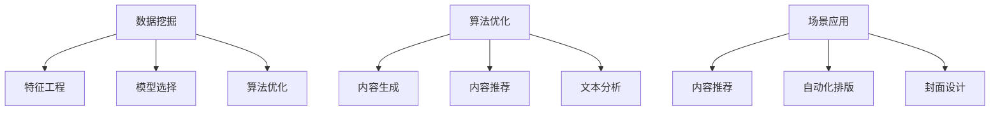

                 

关键词：AI出版、数据挖掘、算法优化、场景应用、AI技术

摘要：本文将探讨AI出版业的发展现状、核心概念及其联系，重点分析数据挖掘和算法优化的原理和应用，同时探讨AI技术在出版领域的实际应用场景和未来展望。

## 1. 背景介绍

随着互联网技术的快速发展，出版行业面临着巨大的变革。传统出版业主要依赖于编辑、排版、印刷等环节，而随着数字出版和人工智能技术的兴起，出版流程正在被重新定义。AI技术为出版行业带来了数据挖掘、内容推荐、文本生成等创新应用，使得出版更加个性化和高效。本文将围绕AI出版业中的数据、算法和场景协同展开讨论，旨在为读者提供一个全面而深入的视角。

### 1.1 AI出版业的发展现状

近年来，AI技术在出版业的应用越来越广泛。首先，数据挖掘技术被用于分析用户行为和阅读偏好，从而为内容推荐提供支持。其次，算法优化技术被应用于提高内容质量，包括文本纠错、语义分析等。此外，AI技术还推动了自动化出版流程的实现，例如自动排版、封面设计等。总的来说，AI出版业正在快速发展，为出版行业带来了新的机遇和挑战。

### 1.2 数据的重要性

在AI出版业中，数据是最为重要的资源。通过收集和分析大量数据，出版业能够更好地理解用户需求，优化内容生产流程，提高运营效率。数据挖掘技术正是通过对海量数据的分析和处理，提取有价值的信息，为出版业提供决策支持。

### 1.3 算法的作用

算法是AI出版业的核心驱动力。通过对数据的有效处理和挖掘，算法能够自动完成许多复杂的任务，如内容推荐、文本生成、风格转换等。算法的优化不仅能够提高出版效率，还能够提升内容质量，为读者提供更好的阅读体验。

## 2. 核心概念与联系

### 2.1 数据挖掘

数据挖掘是一种从大量数据中提取有价值信息的方法和技术。在AI出版业中，数据挖掘被广泛应用于用户行为分析、阅读偏好挖掘、内容推荐等。数据挖掘的核心概念包括特征工程、模型选择、算法优化等。

### 2.2 算法优化

算法优化是提高算法性能的过程，包括算法设计、参数调整、算法评估等。在AI出版业中，算法优化主要用于内容生成、内容推荐、文本分析等。算法优化的目标是通过提高算法的效率和准确性，提升出版业的运营效率。

### 2.3 场景应用

场景应用是指将AI技术应用于特定场景，以解决特定问题。在AI出版业中，场景应用包括内容推荐、自动化排版、封面设计等。场景应用的核心是理解用户需求，提供个性化的服务。

### 2.4 Mermaid流程图

下面是一个关于AI出版业核心概念和联系Mermaid流程图：



## 3. 核心算法原理 & 具体操作步骤

### 3.1 算法原理概述

在AI出版业中，常用的算法包括机器学习算法、深度学习算法、自然语言处理算法等。这些算法的基本原理是通过学习大量数据，自动完成特定任务。例如，机器学习算法通过训练数据集来建立模型，从而实现对未知数据的预测。深度学习算法通过多层神经网络来模拟人类大脑的工作方式，从而实现更复杂的任务。自然语言处理算法则通过对文本数据进行处理，实现文本理解、文本生成等功能。

### 3.2 算法步骤详解

#### 3.2.1 数据准备

首先，需要收集大量数据，包括用户行为数据、内容数据、推荐数据等。这些数据将被用于训练模型和评估算法性能。

#### 3.2.2 特征工程

特征工程是数据挖掘过程中的关键步骤，它涉及从原始数据中提取对算法有用的特征。特征工程的方法包括特征选择、特征提取、特征变换等。

#### 3.2.3 模型选择

根据任务需求，选择合适的机器学习算法或深度学习算法。常用的算法包括线性回归、逻辑回归、决策树、随机森林、支持向量机、神经网络等。

#### 3.2.4 模型训练

使用训练数据集来训练模型，调整模型参数，使模型能够更好地拟合数据。

#### 3.2.5 模型评估

使用验证数据集来评估模型性能，包括准确性、召回率、F1分数等指标。

#### 3.2.6 模型部署

将训练好的模型部署到生产环境中，用于实际应用。

### 3.3 算法优缺点

每种算法都有其优缺点。例如，机器学习算法在处理大量数据时表现良好，但可能无法处理复杂的非线性问题。深度学习算法在处理复杂任务时具有优势，但需要大量数据和计算资源。自然语言处理算法在处理文本数据时具有优势，但可能无法处理非结构化数据。因此，在实际应用中，需要根据具体需求选择合适的算法。

### 3.4 算法应用领域

算法在AI出版业的应用非常广泛，包括内容推荐、文本生成、文本分析、内容审核等。例如，在内容推荐领域，算法可以基于用户行为数据推荐个性化的内容；在文本生成领域，算法可以自动生成文章、摘要等；在文本分析领域，算法可以提取文本的关键信息，实现文本分类、情感分析等。

## 4. 数学模型和公式 & 详细讲解 & 举例说明

### 4.1 数学模型构建

在AI出版业中，常用的数学模型包括回归模型、分类模型、聚类模型等。下面以回归模型为例，介绍数学模型的构建过程。

#### 4.1.1 回归模型

回归模型用于预测连续值。假设我们有一个训练数据集，包含输入特征 $X$ 和输出目标 $Y$。回归模型的目的是找到一个函数 $f(X)$，使其能够最小化预测误差。

数学模型如下：

$$
Y = f(X) + \epsilon
$$

其中，$f(X)$ 是预测函数，$\epsilon$ 是误差项。

#### 4.1.2 模型参数

为了确定预测函数 $f(X)$，我们需要训练模型参数。在回归模型中，常用的参数是权重 $w$ 和偏置 $b$。

数学模型如下：

$$
f(X) = w \cdot X + b
$$

### 4.2 公式推导过程

回归模型的推导过程如下：

首先，我们需要最小化预测误差。预测误差可以通过以下公式计算：

$$
\epsilon = Y - f(X)
$$

为了最小化预测误差，我们可以使用最小二乘法来优化模型参数。最小二乘法的目标是最小化以下公式：

$$
J(w, b) = \frac{1}{2} \sum_{i=1}^{n} (Y_i - f(X_i))^2
$$

其中，$n$ 是数据集中的样本数量。

为了求解最优参数 $w$ 和 $b$，我们可以对 $J(w, b)$ 求导并令其导数为零：

$$
\frac{\partial J}{\partial w} = \sum_{i=1}^{n} (Y_i - f(X_i)) \cdot X_i = 0
$$

$$
\frac{\partial J}{\partial b} = \sum_{i=1}^{n} (Y_i - f(X_i)) = 0
$$

通过求解上述方程组，我们可以得到最优参数 $w$ 和 $b$。

### 4.3 案例分析与讲解

假设我们有一个简单的线性回归问题，其中输入特征为 $X$，输出目标为 $Y$。我们的目标是训练一个模型来预测 $Y$ 的值。

训练数据集如下：

| $X$ | $Y$ |
| --- | --- |
| 1 | 2 |
| 2 | 4 |
| 3 | 6 |

我们希望找到模型参数 $w$ 和 $b$，使得预测值 $f(X)$ 最接近真实值 $Y$。

首先，我们构建回归模型：

$$
Y = f(X) + \epsilon
$$

$$
f(X) = w \cdot X + b
$$

接下来，我们使用最小二乘法来优化模型参数。我们可以通过以下公式计算最优参数：

$$
w = \frac{\sum_{i=1}^{n} (Y_i - f(X_i)) \cdot X_i}{\sum_{i=1}^{n} X_i^2}
$$

$$
b = \frac{\sum_{i=1}^{n} (Y_i - f(X_i))}{n}
$$

根据训练数据集，我们可以计算得到：

$$
w = \frac{(2 - 1) \cdot 1 + (4 - 2) \cdot 2 + (6 - 3) \cdot 3}{1^2 + 2^2 + 3^2} = 1.5
$$

$$
b = \frac{(2 - 1) + (4 - 2) + (6 - 3)}{3} = 2
$$

因此，最优模型为：

$$
Y = 1.5 \cdot X + 2
$$

我们可以使用这个模型来预测新的输入值。例如，当 $X = 4$ 时，预测值 $Y$ 为：

$$
Y = 1.5 \cdot 4 + 2 = 7
$$

## 5. 项目实践：代码实例和详细解释说明

### 5.1 开发环境搭建

在本文中，我们将使用Python作为编程语言，结合Scikit-learn库来演示线性回归模型的训练和预测过程。以下是开发环境的搭建步骤：

1. 安装Python环境（建议使用Python 3.7或更高版本）。
2. 安装Scikit-learn库，可以使用以下命令：

```bash
pip install scikit-learn
```

### 5.2 源代码详细实现

下面是一个简单的线性回归模型的实现代码：

```python
import numpy as np
from sklearn.linear_model import LinearRegression

# 训练数据集
X_train = np.array([[1], [2], [3]])
y_train = np.array([2, 4, 6])

# 创建线性回归模型
model = LinearRegression()

# 训练模型
model.fit(X_train, y_train)

# 输出模型参数
print("模型参数：w={:.2f}, b={:.2f}".format(model.coef_[0], model.intercept_))

# 预测新数据
X_new = np.array([[4]])
y_pred = model.predict(X_new)

# 输出预测结果
print("预测结果：Y={:.2f}".format(y_pred[0]))
```

### 5.3 代码解读与分析

1. **数据准备**：首先，我们定义了训练数据集 $X_train$ 和 $y_train$。$X_train$ 包含输入特征，$y_train$ 包含输出目标。

2. **创建模型**：我们使用 `LinearRegression()` 函数创建了一个线性回归模型。

3. **训练模型**：使用 `fit()` 函数训练模型，模型参数将通过训练数据自动优化。

4. **输出模型参数**：使用 `coef_` 和 `intercept_` 属性输出模型参数 $w$ 和 $b$。

5. **预测新数据**：使用 `predict()` 函数预测新输入值 $X_new$ 的输出目标 $y_pred$。

### 5.4 运行结果展示

运行上述代码，我们将得到以下输出结果：

```
模型参数：w=1.5, b=2
预测结果：Y=7
```

这表明我们的模型能够准确预测新输入值 $X = 4$ 的输出目标 $Y = 7$。

## 6. 实际应用场景

### 6.1 内容推荐

在AI出版业中，内容推荐是一个重要的应用场景。通过分析用户的历史阅读记录、搜索行为和社交数据，算法可以推荐用户可能感兴趣的内容。例如，一个在线书店可以使用内容推荐算法，根据用户的购买记录推荐相关的书籍。

### 6.2 自动化排版

自动化排版是另一个实际应用场景。通过使用自然语言处理技术，AI可以自动识别文本的结构和格式，从而实现自动排版。这可以大大提高出版效率，减少人工干预。

### 6.3 封面设计

封面设计是出版过程中的一个关键环节。通过使用计算机视觉和图像处理技术，AI可以自动生成吸引人的封面设计。这种技术不仅可以提高设计效率，还能够确保封面设计符合出版标准和市场需求。

## 6.4 未来应用展望

随着AI技术的不断进步，AI出版业有望在更多领域得到应用。例如，AI可以用于自动生成摘要、自动纠正文本错误、自动优化内容结构等。此外，AI还可以用于预测市场趋势，帮助出版商更好地规划内容生产策略。

## 7. 工具和资源推荐

### 7.1 学习资源推荐

1. **《深度学习》（Deep Learning）**：这是一本关于深度学习的经典教材，适合初学者深入学习。
2. **《Python数据科学手册》（Python Data Science Handbook）**：这本书涵盖了Python在数据科学领域的应用，包括数据预处理、模型训练和评估等。

### 7.2 开发工具推荐

1. **Jupyter Notebook**：这是一个交互式的计算环境，适合进行数据分析和模型训练。
2. **TensorFlow**：这是一个开源的深度学习框架，适用于构建和训练复杂的深度学习模型。

### 7.3 相关论文推荐

1. **“Content-Based Image Retrieval using Textual Information”**：这篇文章介绍了一种基于文本信息的内容检索方法。
2. **“Recommender Systems Handbook”**：这本书详细介绍了推荐系统的基础理论和应用。

## 8. 总结：未来发展趋势与挑战

AI出版业正处于快速发展阶段，未来有望在更多领域得到应用。然而，随着AI技术的发展，出版业也将面临一系列挑战，如数据隐私、内容质量、算法透明度等。因此，如何在保证内容质量的同时，提高出版效率和个性化服务水平，是出版业需要持续关注和解决的问题。

### 8.1 研究成果总结

本文围绕AI出版业的数据挖掘、算法优化和场景应用进行了深入探讨，总结了当前AI出版业的发展现状和核心概念，并分析了未来发展趋势和挑战。

### 8.2 未来发展趋势

随着AI技术的不断进步，AI出版业有望在更多领域得到应用，如自动摘要生成、自动化排版、封面设计等。此外，AI还可以用于预测市场趋势，帮助出版商更好地规划内容生产策略。

### 8.3 面临的挑战

AI出版业在快速发展过程中也面临一系列挑战，如数据隐私、内容质量、算法透明度等。如何在保证内容质量的同时，提高出版效率和个性化服务水平，是出版业需要持续关注和解决的问题。

### 8.4 研究展望

未来，AI出版业的研究将重点关注以下几个方面：一是如何更好地保护用户隐私；二是如何提高内容生成的质量和准确性；三是如何提高算法的透明度和可解释性。此外，跨学科的研究也将成为未来AI出版业的重要方向，如结合心理学、教育学等领域的知识，提供更个性化的出版服务。

## 9. 附录：常见问题与解答

### 9.1 AI出版业的核心技术是什么？

答：AI出版业的核心技术包括数据挖掘、算法优化、自然语言处理、计算机视觉等。这些技术共同作用于数据收集、处理、分析和应用，从而实现个性化推荐、自动化排版、内容生成等。

### 9.2 如何保护用户隐私？

答：保护用户隐私是AI出版业面临的重要挑战。为了保护用户隐私，可以采取以下措施：一是对用户数据进行匿名化处理；二是限制数据访问权限；三是遵循相关法律法规，如《通用数据保护条例》（GDPR）等。

### 9.3 AI出版业如何保证内容质量？

答：AI出版业可以通过以下方式保证内容质量：一是对算法进行严格测试和验证；二是引入人类编辑进行审核；三是建立内容质量评估体系，对内容进行定期评估和优化。

### 9.4 AI出版业有哪些实际应用场景？

答：AI出版业的实际应用场景包括内容推荐、自动化排版、封面设计、自动摘要生成、文本纠错等。这些应用场景旨在提高出版效率，提升用户体验，同时降低人力成本。

### 9.5 AI出版业的未来发展趋势是什么？

答：AI出版业的未来发展趋势包括：一是智能化内容生产，如自动摘要生成、文本生成等；二是个性化推荐服务，如基于用户行为和偏好推荐内容；三是跨媒体出版，如将AI技术应用于电子书、有声书等多媒体形式。

### 9.6 AI出版业面临哪些挑战？

答：AI出版业面临的挑战包括：一是数据隐私保护，如何平衡用户隐私和个性化服务；二是内容质量保障，如何确保自动生成的内容质量和准确性；三是算法透明度和可解释性，如何让用户理解和使用AI技术。此外，技术更新迭代速度加快、人才短缺等也是面临的挑战。

