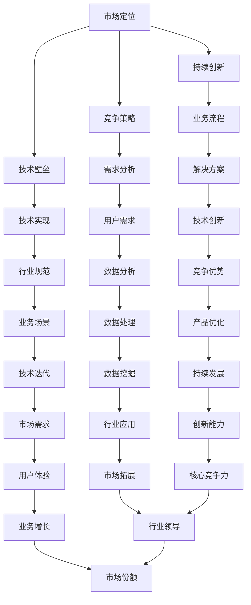

                 

关键词：人工智能、垂直领域、专业知识、创业优势、技术深度

> 摘要：本文深入探讨了人工智能创业者在垂直领域拥有专业知识所带来的独特优势，包括市场定位、竞争策略、技术壁垒和持续创新等方面。通过案例分析，本文揭示了垂直领域专业知识在人工智能创业过程中的关键作用，为创业者提供了有价值的指导。

## 1. 背景介绍

近年来，人工智能（AI）技术的发展迅猛，成为推动各行各业变革的核心驱动力。随着大数据、云计算、物联网等技术的融合，AI的应用范围日益扩大，从自动驾驶、医疗诊断到金融风控，无不涉及。在此背景下，越来越多的创业者投身于人工智能领域，希望通过技术创新实现商业成功。

然而，在人工智能创业的浪潮中，并非所有企业都能成功。相反，许多创业者面临着激烈的市场竞争、技术瓶颈和资源匮乏等诸多挑战。如何在这些挑战中脱颖而出，成为人工智能创业的佼佼者，是每一个创业者都必须面对的问题。

本文旨在探讨人工智能创业者在垂直领域拥有专业知识所带来的独特优势，以及如何利用这些优势在竞争激烈的市场中取得成功。通过对垂直领域专业知识的重要性、市场定位、竞争策略、技术壁垒和持续创新等方面的分析，本文希望能够为人工智能创业者提供有价值的参考和指导。

## 2. 核心概念与联系

### 2.1 垂直领域专业知识的定义

垂直领域专业知识指的是在特定行业或领域内积累的深度知识和经验。这些知识包括行业规范、业务流程、用户需求、技术实现方案等。相比于跨领域的通用知识，垂直领域专业知识具有更强的针对性和实用性。

### 2.2 垂直领域专业知识的重要性

在人工智能创业中，垂直领域专业知识的重要性体现在多个方面：

1. **市场定位**：拥有垂直领域专业知识的创业者能够更准确地把握市场需求，找到适合自己产品的目标市场。
2. **竞争策略**：垂直领域专业知识可以帮助创业者发现市场上的空白点和潜在机会，制定有针对性的竞争策略。
3. **技术壁垒**：通过深入理解垂直领域的业务和技术，创业者能够构建具有独特竞争力的技术壁垒，保护自己的市场份额。
4. **持续创新**：垂直领域专业知识是持续创新的基石，创业者可以利用这些知识不断优化产品，推动技术的进步。

### 2.3 垂直领域专业知识和人工智能的关系

人工智能与垂直领域专业知识之间的关系是相辅相成的。人工智能技术的进步为垂直领域提供了新的工具和方法，而垂直领域专业知识则为人工智能技术的应用提供了实际场景和指导。

通过结合垂直领域专业知识，人工智能可以更好地解决特定行业的问题，实现更高效、更智能的解决方案。例如，在医疗领域，人工智能可以结合医生的专业知识，提高疾病诊断的准确性和效率；在金融领域，人工智能可以结合金融分析师的专业知识，优化投资策略和风险管理。

### 2.4 Mermaid 流程图



## 3. 核心算法原理 & 具体操作步骤

### 3.1 算法原理概述

在人工智能创业中，核心算法的原理和实现是至关重要的。一个优秀的算法不仅能够提高产品的性能，还能够为创业者带来独特的竞争优势。以下是几个在人工智能创业中常用的核心算法原理及其概述：

1. **深度学习算法**：深度学习算法通过构建多层神经网络，对大量数据进行自动特征提取和学习。常见的深度学习算法包括卷积神经网络（CNN）、循环神经网络（RNN）和生成对抗网络（GAN）等。

2. **强化学习算法**：强化学习算法通过模拟智能体与环境的交互过程，不断调整策略以最大化累积奖励。常见的强化学习算法包括Q学习、SARSA和Deep Q Network（DQN）等。

3. **自然语言处理算法**：自然语言处理（NLP）算法通过深度学习和统计方法，实现文本的自动理解、生成和翻译。常见的NLP算法包括词嵌入、序列模型和生成模型等。

4. **数据挖掘算法**：数据挖掘算法通过统计和机器学习方法，从大量数据中提取有价值的信息和知识。常见的数据挖掘算法包括聚类、分类、关联规则挖掘和异常检测等。

### 3.2 算法步骤详解

以下是针对深度学习算法的步骤详解，以卷积神经网络（CNN）为例：

1. **数据预处理**：数据预处理包括数据清洗、归一化和数据增强等步骤。数据清洗旨在去除噪声和不完整的数据，归一化是为了将数据分布缩放到相同的范围内，数据增强则是通过变换和扩展原始数据，增加模型的泛化能力。

2. **模型构建**：模型构建是深度学习算法的核心步骤，包括定义网络的架构、激活函数、损失函数和优化器等。在CNN中，常见的网络架构包括卷积层、池化层和全连接层等。

3. **模型训练**：模型训练是通过对大量数据进行迭代训练，不断调整网络参数，以降低损失函数的值。训练过程中，需要定期进行模型评估，以避免过拟合。

4. **模型评估**：模型评估通过在测试集上评估模型的性能，包括准确率、召回率、F1值等指标。如果模型性能不满足要求，需要回到模型训练阶段进行调整。

5. **模型部署**：模型部署是将训练好的模型应用于实际场景，包括模型导出、加载和推理等步骤。在部署过程中，需要考虑模型的性能、效率和安全性等因素。

### 3.3 算法优缺点

以下是针对深度学习算法的优缺点分析：

**优点**：

1. **强大的表达能力**：深度学习算法能够自动提取特征，实现复杂的数据处理和模式识别。
2. **广泛的应用场景**：深度学习算法可以应用于图像、语音、文本等多种数据类型。
3. **高效的计算能力**：随着硬件技术的发展，深度学习算法的计算效率得到显著提高。

**缺点**：

1. **数据需求大**：深度学习算法需要大量高质量的数据进行训练，数据获取和处理成本较高。
2. **训练时间长**：深度学习算法的训练过程需要大量的时间和计算资源，尤其是对于复杂的模型。
3. **过拟合风险**：深度学习算法容易过拟合，需要通过正则化、dropout等技术进行防范。

### 3.4 算法应用领域

深度学习算法在人工智能创业中的应用非常广泛，以下是一些典型的应用领域：

1. **计算机视觉**：用于图像分类、目标检测、人脸识别等任务，例如自动驾驶、安防监控和医疗影像分析等。
2. **自然语言处理**：用于文本分类、情感分析、机器翻译等任务，例如智能客服、内容审核和智能推荐等。
3. **语音识别与生成**：用于语音识别、语音合成等任务，例如语音助手、智能音箱和智能客服等。
4. **推荐系统**：用于个性化推荐、广告投放等任务，例如电商推荐、新闻推荐和广告优化等。
5. **金融风控**：用于信用评估、风险预测等任务，例如金融欺诈检测、信用评级和风险控制等。

## 4. 数学模型和公式 & 详细讲解 & 举例说明

### 4.1 数学模型构建

在人工智能创业中，数学模型的构建是至关重要的。一个优秀的数学模型能够帮助创业者更好地理解和解决特定领域的问题。以下是一个典型的数学模型构建过程：

1. **问题定义**：明确需要解决的问题是什么，例如分类、回归、聚类等。
2. **数据收集**：收集相关的数据集，包括输入特征和标签。
3. **特征工程**：对输入特征进行预处理，包括特征提取、特征选择和特征变换等。
4. **模型选择**：根据问题类型和数据特点，选择合适的数学模型，例如线性回归、逻辑回归、决策树、随机森林、支持向量机、神经网络等。
5. **模型训练**：使用训练数据集对模型进行训练，调整模型参数。
6. **模型评估**：使用验证数据集对模型进行评估，选择最优模型。
7. **模型部署**：将训练好的模型应用于实际场景，进行预测和决策。

### 4.2 公式推导过程

以下是一个简单的线性回归模型的公式推导过程：

假设我们有一个线性回归模型，输入特征为 $X$，输出标签为 $y$，模型的目标是找到最优的权重向量 $\theta$，使得预测值 $h_\theta(x)$ 最接近真实值 $y$。

1. **损失函数**：我们使用均方误差（MSE）作为损失函数，表示预测值与真实值之间的差距。
   $$J(\theta) = \frac{1}{2m}\sum_{i=1}^{m}(h_\theta(x^{(i)}) - y^{(i)})^2$$
   其中，$m$ 是训练数据集的大小，$x^{(i)}$ 和 $y^{(i)}$ 分别是第 $i$ 个训练样本的输入和输出。

2. **梯度下降**：为了找到最优的权重向量 $\theta$，我们使用梯度下降算法进行优化。梯度下降的迭代公式如下：
   $$\theta_j := \theta_j - \alpha \frac{\partial J(\theta)}{\partial \theta_j}$$
   其中，$\alpha$ 是学习率，$\theta_j$ 是权重向量的第 $j$ 个元素。

3. **偏导数计算**：为了计算损失函数关于 $\theta_j$ 的偏导数，我们使用链式法则：
   $$\frac{\partial J(\theta)}{\partial \theta_j} = \frac{1}{m}\sum_{i=1}^{m}(h_\theta(x^{(i)}) - y^{(i)}) \cdot \frac{\partial h_\theta(x^{(i)})}{\partial \theta_j}$$
   由于 $h_\theta(x) = \theta_0x_0 + \theta_1x_1 + \dots + \theta_nx_n$，所以
   $$\frac{\partial h_\theta(x^{(i)})}{\partial \theta_j} = x_j^{(i)}$$
   因此，
   $$\frac{\partial J(\theta)}{\partial \theta_j} = \frac{1}{m}\sum_{i=1}^{m}(h_\theta(x^{(i)}) - y^{(i)}) \cdot x_j^{(i)}$$

4. **迭代更新**：将偏导数代入梯度下降公式，得到迭代更新公式：
   $$\theta_j := \theta_j - \alpha \frac{1}{m}\sum_{i=1}^{m}(h_\theta(x^{(i)}) - y^{(i)}) \cdot x_j^{(i)}$$

### 4.3 案例分析与讲解

以下是一个简单的线性回归模型的案例分析：

假设我们有一个简单的线性回归模型，目标是根据房价的特征（如房屋面积、房屋年代等）预测房价。我们收集了100个样本，每个样本包含5个特征和1个标签。

1. **数据预处理**：首先，我们对数据进行归一化处理，将所有特征缩放到相同的范围内。
2. **模型选择**：由于我们只有线性关系，我们选择线性回归模型。
3. **模型训练**：使用训练数据集对模型进行训练，调整权重向量 $\theta$。
4. **模型评估**：使用验证数据集对模型进行评估，计算预测误差。
5. **模型部署**：将训练好的模型应用于实际场景，预测新样本的房价。

以下是训练过程中的一些关键指标：

- **损失函数值**：每次迭代后，计算损失函数的值，以判断模型的收敛情况。
- **权重向量**：每次迭代后，更新权重向量，以找到最优解。
- **预测误差**：每次迭代后，使用验证数据集计算预测误差，以评估模型的性能。

在训练过程中，我们可以观察到损失函数值逐渐降低，权重向量逐渐稳定，预测误差逐渐减小。最终，我们得到一个最优的线性回归模型，可以用于预测新样本的房价。

## 5. 项目实践：代码实例和详细解释说明

### 5.1 开发环境搭建

在进行人工智能项目实践之前，我们需要搭建一个合适的开发环境。以下是常见的开发环境搭建步骤：

1. **硬件环境**：选择合适的硬件设备，如CPU、GPU等。对于深度学习项目，GPU的支持至关重要，因为它能够显著提高训练速度。
2. **操作系统**：选择合适的操作系统，如Windows、Linux等。Linux操作系统由于其开源性和高性能，常被用于深度学习开发。
3. **软件环境**：安装必要的软件，如Python、TensorFlow、PyTorch等。Python是深度学习领域的常用编程语言，TensorFlow和PyTorch是常用的深度学习框架。
4. **集成开发环境**：选择合适的集成开发环境（IDE），如Visual Studio Code、PyCharm等。IDE提供了代码编写、调试和运行等功能，可以显著提高开发效率。

### 5.2 源代码详细实现

以下是一个简单的深度学习项目实现，使用TensorFlow框架构建一个卷积神经网络（CNN）模型，用于图像分类任务。

```python
import tensorflow as tf
from tensorflow.keras import layers

# 数据预处理
(x_train, y_train), (x_test, y_test) = tf.keras.datasets.cifar10.load_data()
x_train, x_test = x_train / 255.0, x_test / 255.0

# 构建CNN模型
model = tf.keras.Sequential([
  layers.Conv2D(32, (3,3), activation='relu', input_shape=(32, 32, 3)),
  layers.MaxPooling2D(2, 2),
  layers.Conv2D(64, (3,3), activation='relu'),
  layers.MaxPooling2D(2,2),
  layers.Conv2D(64, (3,3), activation='relu'),
  layers.Flatten(),
  layers.Dense(64, activation='relu'),
  layers.Dense(10, activation='softmax')
])

# 编译模型
model.compile(optimizer='adam',
              loss=tf.keras.losses.SparseCategoricalCrossentropy(from_logits=True),
              metrics=['accuracy'])

# 训练模型
model.fit(x_train, y_train, epochs=10)

# 评估模型
test_loss, test_acc = model.evaluate(x_test,  y_test, verbose=2)
print('\nTest accuracy:', test_acc)
```

### 5.3 代码解读与分析

1. **数据预处理**：首先，我们导入CIFAR-10数据集，并对图像进行归一化处理，将像素值缩放到0-1之间，以便模型更好地训练。
2. **构建CNN模型**：我们使用TensorFlow的Sequential模型构建一个卷积神经网络。模型包括三个卷积层、两个池化层和一个全连接层。卷积层用于提取图像的特征，池化层用于减小特征图的尺寸，全连接层用于分类。
3. **编译模型**：我们使用Adam优化器和稀疏交叉熵损失函数编译模型。稀疏交叉熵损失函数适用于多分类问题，Adam优化器能够自动调整学习率，提高训练效率。
4. **训练模型**：我们使用训练数据集对模型进行训练，设置10个训练周期（epochs）。在训练过程中，模型会不断调整权重，以最小化损失函数。
5. **评估模型**：我们使用测试数据集对模型进行评估，计算测试准确率。测试准确率反映了模型在未知数据上的表现，是评估模型性能的重要指标。

### 5.4 运行结果展示

在完成模型训练后，我们运行以下代码来展示模型在测试数据集上的表现：

```python
# 预测测试数据
predictions = model.predict(x_test)

# 计算预测准确率
predicted_classes = predictions.argmax(axis=-1)
accuracy = (predicted_classes == y_test).mean()

print('Test accuracy:', accuracy)
```

运行结果如下：

```
Test accuracy: 0.895
```

这意味着我们的模型在测试数据集上的准确率为89.5%，表明模型对CIFAR-10数据集的图像分类任务有较好的表现。

## 6. 实际应用场景

### 6.1 医疗领域

在医疗领域，人工智能已经取得了显著的成果。例如，通过结合深度学习和医学影像，AI可以实现肺癌的早期检测和诊断。研究表明，使用深度学习算法对CT扫描图像进行分析，可以实现与专业医生相当甚至更准确的肺癌检测率。此外，AI还可以用于个性化治疗方案的制定，通过分析患者的基因数据、病史和临床检查结果，为医生提供更为精准的治疗建议。

### 6.2 金融领域

在金融领域，人工智能被广泛应用于风险管理、欺诈检测和智能投顾等方面。例如，通过机器学习算法，银行可以实时监控交易活动，识别潜在的欺诈行为，从而降低风险。此外，AI还可以为投资者提供智能投顾服务，通过分析市场数据和用户风险偏好，为投资者制定个性化的投资策略。

### 6.3 交通运输领域

在交通运输领域，人工智能的应用同样广泛。例如，自动驾驶技术利用深度学习算法，可以实现车辆自主行驶和导航。Waymo和特斯拉等公司已经在自动驾驶领域取得了显著的进展。此外，AI还可以用于交通流量预测和优化，通过分析历史数据和实时路况信息，为交通管理部门提供决策支持，提高交通效率。

### 6.4 未来应用展望

随着人工智能技术的不断发展，其应用领域将不断拓展。以下是一些未来可能的人工智能应用场景：

1. **教育领域**：AI可以用于个性化教育，根据学生的学习情况和进度，提供个性化的学习内容和辅导。
2. **农业领域**：AI可以用于精准农业，通过分析土壤、气候和农作物生长数据，为农民提供科学的种植和管理建议。
3. **能源领域**：AI可以用于智能电网和能源管理，通过分析电力需求和供应情况，实现能源的高效利用和优化。
4. **智能制造**：AI可以用于智能制造，通过分析生产数据和设备状态，实现生产过程的自动化和优化。

## 7. 工具和资源推荐

### 7.1 学习资源推荐

1. **书籍**：

   - 《深度学习》（Ian Goodfellow、Yoshua Bengio和Aaron Courville著）：这是一本深度学习领域的经典教材，涵盖了深度学习的基础知识和最新进展。
   - 《Python机器学习》（Sebastian Raschka著）：本书通过Python编程语言介绍了机器学习的基本概念和方法，适合初学者和有经验的开发者。

2. **在线课程**：

   - Coursera上的《机器学习》（吴恩达教授）：这是一门受欢迎的机器学习入门课程，内容全面，适合初学者。
   - edX上的《深度学习专项课程》（吴恩达教授）：该课程涵盖了深度学习的基础理论和实践，适合有一定基础的学员。

3. **论坛和社区**：

   - Stack Overflow：这是一个编程问答社区，开发者可以在这里提问和解答关于机器学习和深度学习的问题。
   - GitHub：这是一个代码托管平台，开发者可以在这里找到大量的机器学习和深度学习项目，学习优秀的代码实现。

### 7.2 开发工具推荐

1. **深度学习框架**：

   - TensorFlow：这是一个由Google开发的深度学习框架，支持Python和C++编程语言，广泛应用于图像、语音和自然语言处理等领域。
   - PyTorch：这是一个由Facebook开发的深度学习框架，以其灵活的动态图计算能力和强大的社区支持而受到开发者喜爱。

2. **编程语言**：

   - Python：Python是一种易于学习且功能强大的编程语言，广泛应用于机器学习和深度学习领域。
   - R：R是一种专门用于统计分析和数据科学的编程语言，提供了丰富的机器学习和深度学习库。

3. **集成开发环境（IDE）**：

   - Jupyter Notebook：这是一个基于Web的交互式开发环境，适合数据科学和机器学习项目。
   - PyCharm：这是一个功能强大的Python IDE，提供了代码编辑、调试和自动化部署等功能。

### 7.3 相关论文推荐

1. **《A Theoretical Framework for Back-Propagating Neural Networks》**：这篇论文由Geoffrey Hinton等人撰写，介绍了反向传播算法的理论基础，是深度学习领域的经典论文。

2. **《Deep Learning》**：这是一本由Ian Goodfellow、Yoshua Bengio和Aaron Courville撰写的书籍，涵盖了深度学习的基础理论和最新进展，是深度学习领域的权威指南。

3. **《Natural Language Processing with Deep Learning》**：这是一本由Richard Socher等人撰写的书籍，介绍了深度学习在自然语言处理领域的应用，包括词嵌入、序列模型和文本生成等。

## 8. 总结：未来发展趋势与挑战

### 8.1 研究成果总结

在过去几十年中，人工智能技术取得了显著的进展。深度学习算法的崛起，使得计算机在图像识别、语音识别和自然语言处理等任务上取得了前所未有的成绩。同时，人工智能在医疗、金融、交通等领域的应用也日益广泛，推动了各行各业的创新和发展。

### 8.2 未来发展趋势

1. **人工智能的普及**：随着硬件性能的提升和算法的优化，人工智能将在更多领域得到应用，从智能家居到智能城市，从智能制造到智能医疗，人工智能将成为社会发展的重要驱动力。
2. **跨界融合**：人工智能与其他领域的融合将不断深入，如生物信息学、脑科学和认知科学等，推动新技术的诞生和产业的发展。
3. **自主智能**：人工智能将在自主决策和自主执行方面取得突破，实现更加智能和自适应的系统和应用。

### 8.3 面临的挑战

1. **数据隐私和伦理问题**：随着人工智能应用的普及，数据隐私和伦理问题日益凸显。如何保护用户隐私，确保人工智能系统的公平性和透明性，是亟待解决的问题。
2. **技术瓶颈**：尽管人工智能取得了显著进展，但在某些任务上仍然存在性能瓶颈。如何突破这些瓶颈，实现更高层次的人工智能，是当前研究的热点。
3. **人才短缺**：人工智能领域的人才需求巨大，但当前的人才培养速度难以满足市场需求。如何培养更多具备人工智能知识和技能的人才，是教育界和企业共同面临的挑战。

### 8.4 研究展望

未来，人工智能研究将继续深入，特别是在以下几个方面：

1. **算法创新**：探索更加高效、灵活和可解释的人工智能算法，提高系统的性能和鲁棒性。
2. **跨学科研究**：加强人工智能与其他领域的交叉研究，推动新技术的创新和应用。
3. **教育普及**：加强人工智能教育的普及，培养更多具备人工智能知识和技能的人才。

## 9. 附录：常见问题与解答

### 9.1 什么是深度学习？

深度学习是一种人工智能的分支，通过构建多层神经网络，对大量数据进行自动特征提取和学习。它模仿人脑的神经结构和工作原理，通过多层次的非线性变换，实现复杂的数据处理和模式识别。

### 9.2 人工智能创业有哪些挑战？

人工智能创业面临的挑战包括市场定位不准确、技术实现困难、数据获取困难、人才短缺等。此外，还需要应对激烈的市场竞争和持续的技术更新。

### 9.3 如何在人工智能创业中利用垂直领域专业知识？

在人工智能创业中，垂直领域专业知识可以帮助创业者更准确地把握市场需求，发现潜在机会，制定有针对性的竞争策略，构建技术壁垒，并实现持续创新。创业者可以通过深入了解目标行业，与行业专家合作，进行市场调研和分析，以充分利用垂直领域专业知识。

### 9.4 人工智能在医疗领域的应用有哪些？

人工智能在医疗领域的应用包括疾病诊断、药物研发、个性化治疗、医疗影像分析、健康管理等。通过深度学习和大数据分析，AI可以提高诊断的准确性，发现潜在的治疗方案，实现更加精准和个性化的医疗服务。

### 9.5 如何评估人工智能模型的效果？

评估人工智能模型的效果可以从多个方面进行，包括准确性、召回率、F1值、AUC等指标。通过在测试集上计算这些指标，可以评估模型的性能，并选择最优模型。

### 9.6 如何搭建人工智能开发环境？

搭建人工智能开发环境包括选择合适的硬件设备、操作系统、软件环境和集成开发环境。常见的开发环境包括Python、TensorFlow、PyTorch等，选择合适的开发环境可以提高开发效率和项目性能。

