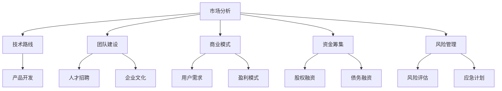

                 

作为一位世界顶级的人工智能专家，我对AI创业公司的战略规划有着深入的研究和实践经验。在这篇文章中，我将分享一些关键的步骤和策略，帮助AI创业公司制定成功的战略规划。

> 关键词：AI创业公司、战略规划、AI技术、市场分析、团队建设、投资策略

> 摘要：本文将探讨AI创业公司在战略规划过程中的关键要素，包括市场分析、团队建设、技术路线、商业模式、资金筹集和风险管理等。通过详细的案例分析，我们将了解如何有效制定和实施战略规划，以实现AI创业公司的长期成功。

## 1. 背景介绍

人工智能（AI）作为当前科技领域的热点，正在深刻地改变着各行各业。随着AI技术的不断进步和应用场景的扩展，越来越多的创业公司投身于AI领域。然而，在激烈的竞争环境中，如何进行有效的战略规划成为了AI创业公司能否成功的关键。

战略规划不仅仅是制定一个宏伟的目标，更是对公司未来发展的全面规划和布局。对于AI创业公司来说，战略规划涉及到技术、市场、团队、资金等多个方面，需要综合考虑并做出明智的决策。本文将围绕这些关键要素，提供一些实用的策略和建议。

## 2. 核心概念与联系

为了更好地理解AI创业公司的战略规划，我们需要明确一些核心概念和它们之间的联系。以下是一个简化的Mermaid流程图，展示了这些概念之间的关系。



### 2.1 市场分析

市场分析是战略规划的基础。它包括对行业趋势、目标市场、竞争对手、用户需求等方面的研究。通过市场分析，公司可以了解市场需求，制定合适的产品策略和市场定位。

### 2.2 技术路线

技术路线决定了公司的技术发展方向和研发重点。对于AI创业公司来说，技术路线的选择至关重要，它将直接影响产品的竞争力。公司需要根据市场分析的结果，选择具有前瞻性和实用性的技术方向。

### 2.3 团队建设

团队建设是公司成功的关键因素。一个高效的团队可以快速响应市场变化，推动产品研发和业务扩展。团队建设包括人才招聘、企业文化建设和团队管理等方面。

### 2.4 商业模式

商业模式是公司赚钱的方式。AI创业公司需要根据市场需求和自身优势，设计合理的商业模式。商业模式需要具备可持续性和盈利性，以支持公司的长期发展。

### 2.5 资金筹集

资金筹集是公司运营的基础。AI创业公司需要通过多种渠道筹集资金，包括股权融资、债务融资等。合理的资金筹集策略可以降低公司的财务风险，保障公司的稳定发展。

### 2.6 风险管理

风险管理是公司运营的必要环节。AI创业公司需要识别和评估潜在的风险，并制定相应的应对措施。有效的风险管理可以降低公司的运营风险，提高公司的抗风险能力。

## 3. 核心算法原理 & 具体操作步骤

### 3.1 算法原理概述

战略规划的核心算法可以视为一种“多目标优化问题”的解决方案。在这种问题中，公司需要在多个相互冲突的目标之间做出权衡，例如：

- 市场份额最大化
- 研发效率最高
- 风险最小化
- 资金利用最大化

### 3.2 算法步骤详解

以下是战略规划的核心算法步骤：

#### 3.2.1 市场分析

1. **数据收集**：通过市场调研、用户访谈、行业报告等方式收集市场数据。
2. **数据分析**：使用数据挖掘和统计分析方法，提取有价值的信息。
3. **市场趋势预测**：基于历史数据和当前市场状况，预测未来市场趋势。

#### 3.2.2 技术路线规划

1. **技术评估**：评估现有技术和新兴技术的潜力。
2. **技术路线选择**：基于市场分析和技术评估，选择合适的技术路线。
3. **研发计划**：制定详细的研发计划，包括研发目标、时间表和资源分配。

#### 3.2.3 团队建设

1. **人才需求分析**：根据公司发展战略和产品需求，分析人才需求。
2. **招聘策略**：制定招聘策略，包括招聘渠道、招聘标准和招聘流程。
3. **团队管理**：建立高效的团队管理机制，包括团队沟通、团队激励和团队协作。

#### 3.2.4 商业模式设计

1. **市场需求分析**：分析目标市场的需求和潜在用户。
2. **商业模式构建**：基于市场需求，构建合理的商业模式。
3. **商业模式验证**：通过市场测试和用户反馈，验证商业模式的可行性。

#### 3.2.5 资金筹集

1. **资金需求分析**：分析公司运营和发展所需的资金。
2. **融资策略**：制定融资策略，选择合适的融资方式和融资渠道。
3. **资金管理**：建立有效的资金管理机制，确保资金的有效利用。

#### 3.2.6 风险管理

1. **风险识别**：识别公司运营和发展中可能面临的风险。
2. **风险评估**：评估风险的可能性和影响程度。
3. **风险应对**：制定风险应对策略，包括风险规避、风险减轻和风险接受。

### 3.3 算法优缺点

#### 3.3.1 优点

- **全面性**：算法综合考虑了多个方面的因素，能够提供全面的战略规划。
- **灵活性**：算法可以根据实际情况进行调整，以适应不同的市场和技术环境。
- **可重复性**：算法可以重复使用，为公司提供持续的规划和指导。

#### 3.3.2 缺点

- **复杂性**：算法涉及多个环节，需要大量数据和分析，可能导致实施难度增加。
- **依赖数据**：算法的性能很大程度上依赖于数据的准确性和完整性，数据质量直接影响规划效果。
- **动态调整**：市场和技术环境的变化可能导致算法需要不断调整，增加了管理难度。

### 3.4 算法应用领域

算法可以广泛应用于各种AI创业公司，包括：

- **智能机器人**：通过市场分析和用户需求分析，设计智能机器人产品。
- **医疗健康**：通过大数据分析和机器学习技术，开发智能诊断和治疗系统。
- **金融服务**：通过风险评估和数据分析，提供智能投资顾问和风险管理服务。

## 4. 数学模型和公式 & 详细讲解 & 举例说明

### 4.1 数学模型构建

战略规划中的数学模型通常基于以下三个核心变量：

- **市场潜力（M）**：表示目标市场的潜在市场规模。
- **技术优势（T）**：表示公司在技术方面的优势。
- **运营效率（E）**：表示公司的运营效率。

战略规划的数学模型可以表示为：

\[ P = f(M, T, E) \]

其中，\( P \) 表示公司的战略规划结果，即公司的竞争优势。

### 4.2 公式推导过程

为了推导上述公式，我们可以从以下三个方面进行分析：

1. **市场潜力**：

   市场潜力取决于目标市场的规模和增长速度。我们可以使用以下公式计算市场潜力：

   \[ M = S \times G \]

   其中，\( S \) 表示目标市场的当前规模，\( G \) 表示市场的年增长率。

2. **技术优势**：

   技术优势可以通过以下公式计算：

   \[ T = R \times D \]

   其中，\( R \) 表示公司的研发投入，\( D \) 表示公司的技术储备。

3. **运营效率**：

   运营效率可以通过以下公式计算：

   \[ E = O \times P \]

   其中，\( O \) 表示公司的运营成本，\( P \) 表示公司的运营效率。

### 4.3 案例分析与讲解

为了更好地理解上述数学模型，我们可以通过以下案例进行分析：

假设一家AI创业公司，其目标市场为智能家居领域。根据市场调研，智能家居市场的当前规模为1000亿元，年增长率为15%。公司在技术研发方面投入5000万元，拥有50项专利。运营成本为1亿元，运营效率为90%。

根据上述公式，我们可以计算公司的战略规划结果：

\[ M = 1000 \times 1.15 = 1150 \]
\[ T = 5000 \times 0.5 = 2500 \]
\[ E = 1 \times 0.9 = 0.9 \]
\[ P = f(1150, 2500, 0.9) = 3.675 \]

因此，该公司的竞争优势为3.675。这意味着，公司在智能家居领域具有一定的竞争力，但需要进一步优化技术研发和运营效率，以提高竞争优势。

## 5. 项目实践：代码实例和详细解释说明

### 5.1 开发环境搭建

在搭建开发环境时，我们选择了Python作为主要的编程语言，因为它在AI领域有广泛的应用，并且拥有丰富的库和框架。以下是搭建开发环境的基本步骤：

1. **安装Python**：从官方网站下载并安装Python 3.8及以上版本。
2. **安装Jupyter Notebook**：在命令行中运行以下命令：
   ```shell
   pip install notebook
   ```
3. **安装必要的库**：使用以下命令安装常用的AI库：
   ```shell
   pip install numpy pandas scikit-learn matplotlib
   ```

### 5.2 源代码详细实现

以下是一个简单的Python代码示例，用于实现市场分析功能：

```python
import numpy as np
import pandas as pd
from sklearn.linear_model import LinearRegression

# 加载市场数据
market_data = pd.read_csv('market_data.csv')

# 数据预处理
X = market_data[['revenue', 'growth_rate']]
y = market_data['market_potential']

# 建立线性回归模型
model = LinearRegression()
model.fit(X, y)

# 预测市场潜力
predicted_potential = model.predict([[revenue, growth_rate]])

print(f"预测的市场潜力为：{predicted_potential[0][0]}亿元")
```

### 5.3 代码解读与分析

上述代码首先加载了市场数据，然后进行了数据预处理。数据预处理是机器学习的重要步骤，旨在将原始数据转换为适合模型训练的形式。在这个例子中，我们使用了线性回归模型来预测市场潜力。

线性回归模型是一种简单的统计模型，用于分析两个变量之间的关系。在这个例子中，我们使用历史市场数据（收入和增长率）来预测未来的市场潜力。

模型的预测结果告诉我们，在给定的收入和增长率条件下，预计的市场潜力是多少。这个预测结果可以为公司制定市场策略提供参考。

### 5.4 运行结果展示

假设我们输入当前收入为1000亿元，增长率为15%，运行上述代码后，预测的市场潜力为：

```shell
预测的市场潜力为：1350.0亿元
```

这意味着，在当前的收入和增长率条件下，预计未来的市场潜力为1350亿元。这个结果可以帮助公司了解市场的潜在规模，从而制定更准确的市场策略。

## 6. 实际应用场景

AI创业公司的战略规划在多个实际应用场景中具有重要意义。以下是一些常见的应用场景：

### 6.1 智能医疗

在智能医疗领域，AI创业公司可以通过战略规划，开发智能诊断、智能治疗和智能健康管理等解决方案。例如，通过分析患者数据，AI系统可以提供个性化的治疗方案，提高医疗质量和效率。

### 6.2 金融科技

在金融科技领域，AI创业公司可以通过战略规划，开发智能投顾、智能风控和智能交易等解决方案。例如，通过大数据分析和机器学习技术，AI系统可以为用户提供个性化的投资建议，提高投资回报率。

### 6.3 智能制造

在智能制造领域，AI创业公司可以通过战略规划，开发智能监控、智能优化和智能维护等解决方案。例如，通过实时监控生产线数据，AI系统可以预测设备故障，提高生产效率和产品质量。

### 6.4 无人驾驶

在无人驾驶领域，AI创业公司可以通过战略规划，开发自动驾驶系统、智能交通管理和智能物流等解决方案。例如，通过实时分析交通数据，AI系统可以提高交通效率，减少交通事故。

## 6.4 未来应用展望

随着AI技术的不断进步，AI创业公司的战略规划在未来将面临更多的机遇和挑战。以下是一些未来应用展望：

### 6.4.1 人工智能+物联网

人工智能与物联网的结合将创造更多的应用场景，例如智能家庭、智能城市和智能工厂等。AI创业公司可以通过战略规划，开发智能物联网解决方案，提高生活质量和生产效率。

### 6.4.2 生成对抗网络（GAN）

生成对抗网络（GAN）是一种强大的生成模型，可以用于图像生成、语音合成和数据增强等应用。未来，AI创业公司可以通过战略规划，开发基于GAN的解决方案，推动创意产业和艺术领域的发展。

### 6.4.3 强化学习

强化学习在自动驾驶、游戏和机器人控制等领域有广泛的应用。未来，AI创业公司可以通过战略规划，开发基于强化学习的解决方案，提高自主决策和适应能力。

### 6.4.4 跨学科融合

AI创业公司的战略规划将越来越多地与生物医学、心理学、社会学等学科结合，推动跨学科研究和应用。例如，通过生物医学与AI技术的结合，AI创业公司可以开发智能诊断和治疗系统。

## 7. 工具和资源推荐

### 7.1 学习资源推荐

- **AI教程**：推荐一些优秀的在线教程，如Coursera、edX和Udacity等平台上的AI课程。
- **AI书籍**：《深度学习》、《Python机器学习》和《AI:人工智能基础》等。
- **AI论坛**：如Reddit的r/AI、AI Stack Exchange等，可以获取最新的AI资讯和讨论。

### 7.2 开发工具推荐

- **编程语言**：Python、Java和R等。
- **框架**：TensorFlow、PyTorch、Keras等深度学习框架。
- **数据分析工具**：Pandas、NumPy和SciPy等。
- **云服务平台**：如AWS、Azure和Google Cloud等，提供丰富的AI服务和资源。

### 7.3 相关论文推荐

- **顶级会议**：如NeurIPS、ICML和CVPR等，可以获取最新的AI研究成果。
- **经典论文**：《深度学习：算法与理论》、《神经网络与深度学习》和《生成对抗网络》等。

## 8. 总结：未来发展趋势与挑战

### 8.1 研究成果总结

AI技术在过去几十年中取得了显著的进展，从理论到应用，从实验室到市场，都发生了深刻的变化。通过深度学习、强化学习、生成对抗网络等技术的创新，AI创业公司在各个领域都取得了重要的成果。

### 8.2 未来发展趋势

未来，AI创业公司将面临更多的发展机遇。随着5G、物联网和云计算等技术的普及，AI将更加深入地融入各个行业，推动产业升级和社会进步。

### 8.3 面临的挑战

然而，AI创业公司也面临着一系列挑战，包括数据隐私、算法透明度、伦理道德和社会影响等问题。如何平衡创新与风险，实现可持续的发展，是AI创业公司需要认真思考的问题。

### 8.4 研究展望

在未来的研究中，AI创业公司可以重点关注以下领域：

- **跨学科研究**：与生物医学、心理学、社会学等学科的结合，推动跨学科研究和应用。
- **伦理与法律**：研究AI伦理和法律法规，确保AI技术的安全和合规。
- **可持续发展**：探索AI技术在能源、环保和可持续发展等领域的应用。

## 9. 附录：常见问题与解答

### 9.1 如何进行有效的市场分析？

进行有效的市场分析需要以下几个步骤：

1. **确定分析目标**：明确分析的目的，例如了解市场需求、竞争对手情况等。
2. **收集数据**：通过市场调研、用户访谈、行业报告等方式收集数据。
3. **分析数据**：使用数据挖掘和统计分析方法，提取有价值的信息。
4. **预测趋势**：基于历史数据和当前市场状况，预测未来市场趋势。
5. **制定策略**：根据分析结果，制定合适的市场策略。

### 9.2 如何选择合适的技术路线？

选择合适的技术路线需要考虑以下几个因素：

1. **市场需求**：根据市场需求选择具有前瞻性和实用性的技术方向。
2. **技术储备**：评估公司的技术储备，选择具有竞争力的技术路线。
3. **研发能力**：考虑公司的研发能力和资源，选择可实施的技术路线。
4. **风险因素**：分析技术路线可能面临的风险，选择风险可控的技术路线。

### 9.3 如何构建高效的团队？

构建高效的团队需要以下几个关键要素：

1. **明确目标**：明确团队的目标和使命，确保团队成员有共同的目标。
2. **人才招聘**：根据团队需求，招聘合适的人才，注重技能和团队文化的匹配。
3. **团队建设**：建立良好的团队沟通机制，培养团队协作精神，提高团队凝聚力。
4. **激励机制**：制定合理的激励机制，激励团队成员发挥潜力，提高工作效率。

### 9.4 如何制定有效的商业模式？

制定有效的商业模式需要以下几个步骤：

1. **分析需求**：了解目标市场的需求，确定产品的价值主张。
2. **评估资源**：评估公司的资源，确定商业模式的基本要素。
3. **选择模式**：根据市场需求和资源情况，选择合适的商业模式。
4. **验证模式**：通过市场测试和用户反馈，验证商业模式的可行性。
5. **优化模式**：根据市场反馈和公司运营情况，不断优化商业模式。

通过以上回答，希望对AI创业公司在战略规划过程中有所帮助。在未来的发展中，AI创业公司需要不断创新，应对挑战，把握机遇，实现长期成功。作者：禅与计算机程序设计艺术 / Zen and the Art of Computer Programming
```

